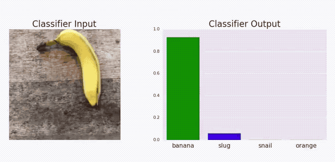
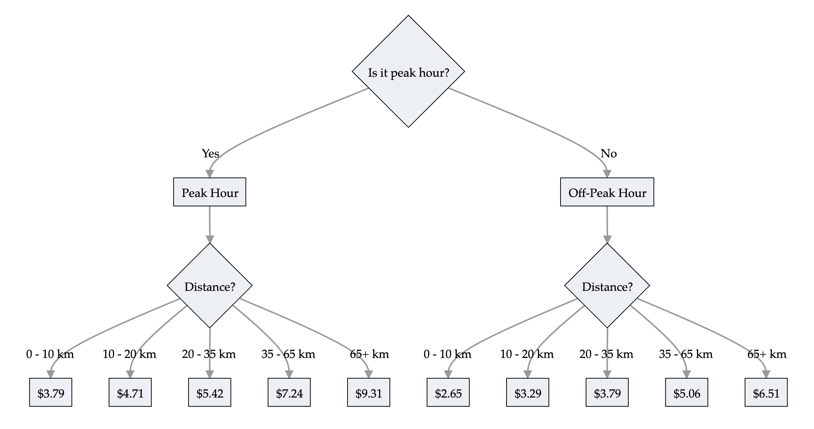
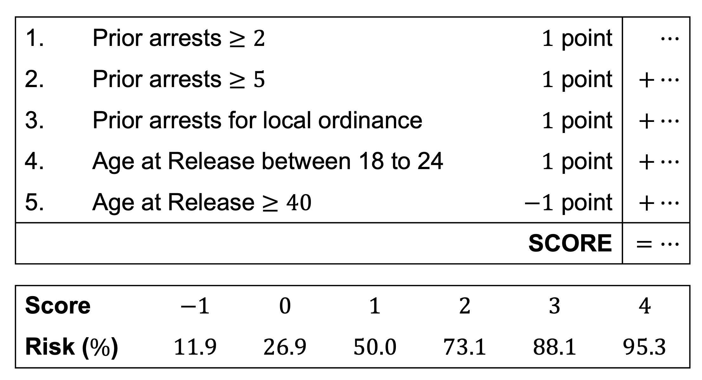
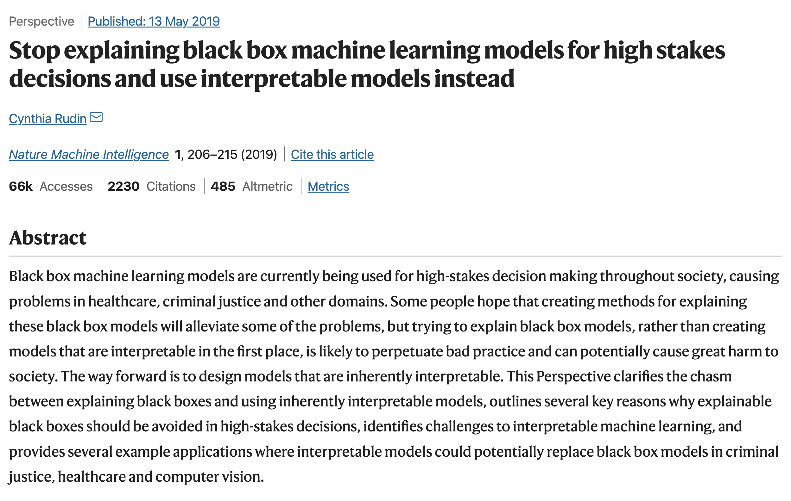
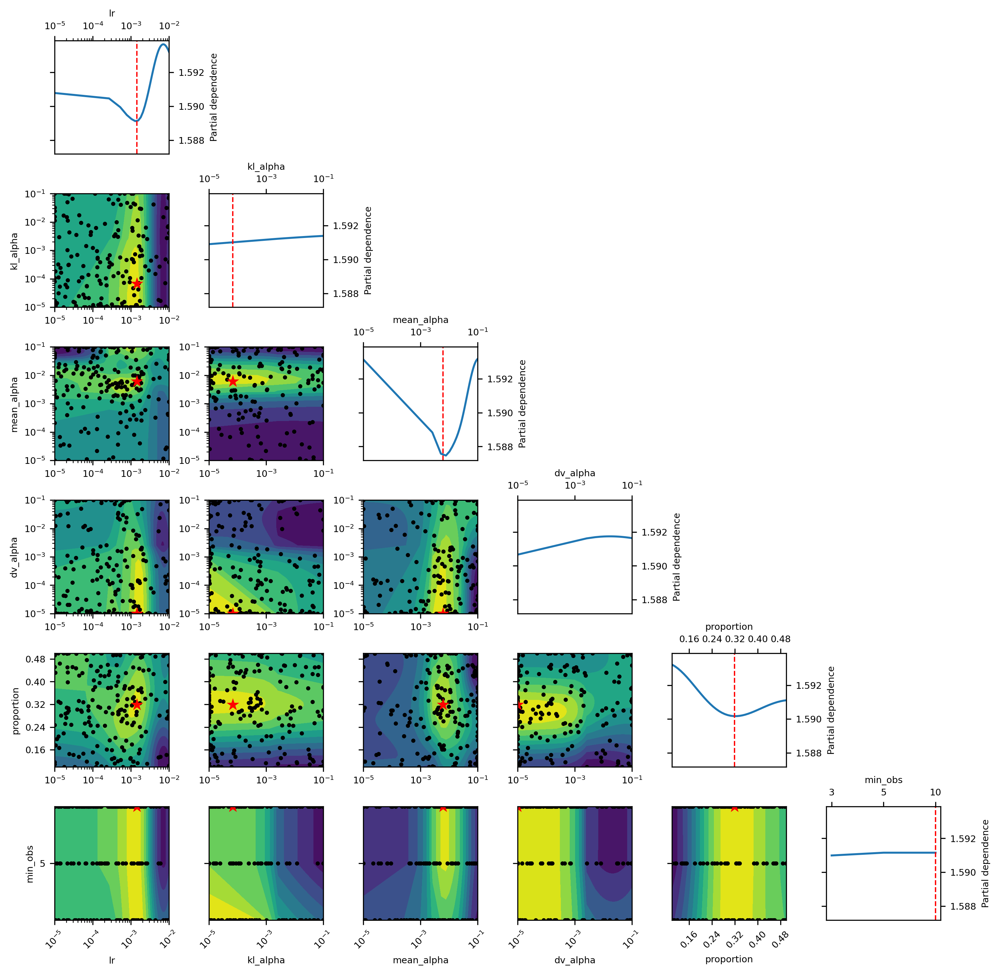

```{python}
#| echo: false
#| warning: false
import sys
sys.path.insert(0, "../scripts")
from setup import *
```

::: {.content-visible unless-format="revealjs"}

```{python}
#| code-fold: true
#| code-summary: Show the package imports
import json
import random
from pathlib import Path

import matplotlib.pyplot as plt
import numpy as np
import numpy.random as rnd
import pandas as pd

import keras
from keras.metrics import SparseTopKCategoricalAccuracy
from keras.models import Sequential
from keras.layers import Dense, Input
from keras.callbacks import EarlyStopping
 
from sklearn.preprocessing import LabelEncoder
from sklearn.feature_extraction.text import CountVectorizer
from sklearn.model_selection import train_test_split 
from sklearn.preprocessing import OrdinalEncoder, StandardScaler, OneHotEncoder
from sklearn.compose import make_column_transformer

from keras.models import Model
from keras.layers import Dense, Input

from sklearn import set_config
set_config(transform_output="pandas")
```

:::

# Introduction

## Definitions

> "Surprisingly enough, although the concept of interpretability is increasingly widespread, there is no general consensus on both the definition and the measurement of the interpretability of a model." [@delcaillau2022]

> "**Definition** Interpret means _to explain or to present in understandable terms_.
> In the context of ML systems, we define interpretability as _the ability to explain or to present in understandable terms to a human_." [@doshi2017]

<!-- 
## Interpretability

Interpretability Definition

:   *Interpretability refers to the ease with which one can understand and comprehend the model's algorithm and predictions.*

Interpretability of black-box models can be crucial to ascertaining trust. -->

## A distinction between interpretability and explainability

> "Interpretability is about transparency, about understanding exactly why and how the model is generating predictions, and therefore, it is important to observe the inner mechanics of the algorithm considered. This leads to interpreting the model’s parameters and features used to determine the given output. Explainability is about explaining the behavior of the model in human terms." [@charpentier2024insurance]

## Aspects of Interpretability

Inherent Interpretability

: The model is interpretable by design.

::: {.content-visible unless-format="revealjs"}
Models with inherent interpretability generally have a simple model architecture where the relationships between inputs and outputs are straightforward. This makes it easy to understand and comprehend model's inner workings and its predictions. As a result, decision making processes convenient. Examples for models with inherent interpretability include:

* linear regression models
* generalized linear regression models
* decision trees. 
:::

Post-hoc Explanations

: The model is not interpretable by design, but we can use other methods to explain the model.

::: {.content-visible unless-format="revealjs"}
Post-hoc explanations refers to applying various techniques to understand how the model makes its predictions after the model is trained. Post-hoc explanations are useful for understanding predictions coming from complex models (less interpretable models) such as:

* neural networks
* random forests
* gradient boosting trees. 
:::

<br>

Global Interpretability

: The ability to understand how the model works.

Local Interpretability

: The ability to interpret/understand each prediction.

::: {.content-visible unless-format="revealjs"}
Global Interpretability focuses on understanding the model's decision-making process as a whole. Global interpretability takes in to account the entire dataset. These techniques will try to look at general patterns related how input data drives the output in general. Examples for global interpretability techniques include:

* global feature importance method
* permutation importance methods

Local Interpretability focuses on understanding the model's decision-making for a specific input observation. These techniques will try to look at how different input features contributed to the output. 
:::

## Husky vs. Wolf

![A well-known anecdote in the explainability literature [@ribeiro2016].](husky.jpg)

::: {.content-visible unless-format="revealjs"}
While the model might perform very well on the training data, it performs badly on the test set. This model has learned the _wrong things_: rather than looking at the facial features of the animal, it looks instead at the background. The model may have learned that wolves tend to be photographed in _snowy_ environments, and huskies in non-snowy environments.
:::

## Adversarial examples

::: {.content-visible unless-format="revealjs"}
An adversarial attack refers to a small carefully created modification to the input data that aims to trick the model in to making wrong predictions while keeping the `y_true` same. The goal is to identify instances where subtle modifications in the input data (which are not instantaneously recognized) can lead to erroneous model predictions.
:::

![A demonstration of fast adversarial example generation applied to GoogLeNet on ImageNet. By adding an imperceptibly small vector whose elements are equal to the sign of the elements of the gradient of the cost function with respect to the input, we can change GoogLeNet’s classification of the image [@goodfellow2014explaining]](adversarial-example.png)

::: {.content-visible unless-format="revealjs"}
The above example shows how a small perturbation to the image of a panda led to the model predicting the image as a gibbon with high confidence. This indicates that there may be certain patterns in the data which are not clearly seen by the human eye, but the model is relying on them to make predictions. Identifying these sensitivities/vulnerabilities is important to understand how a model is making its predictions.
:::

## Adversarial stickers



::: footer
Source: The Verge (2018), [These stickers make computer vision software hallucinate things that aren’t there](https://www.theverge.com/2018/1/3/16844842/ai-computer-vision-trick-adversarial-patches-google).
:::

::: {.content-visible unless-format="revealjs"}
The above graphical illustration shows how adding a metal component changes the model predictions from _Banana_ to _toaster_ with high confidence.
:::

## Adversarial text

::: {.content-visible unless-format="revealjs"}
Adversarial attacks on text generation models help users get an understanding of the inner workings of NLP models. This includes identifying input patterns that are critical to model predictions, and assessing performance of NLP models for robustness. 
:::

"[TextAttack](https://github.com/QData/TextAttack) 🐙 is a Python framework for adversarial attacks, data augmentation, and model training in NLP"

{width=80%}

## LLMs are even more opaque

::: columns
::: {.column width="60%"}

<br>

!["Figure 1: An overview of our research from generating to evaluating EmotionPrompt." [@li2023large]](llm-emotional-manipulation.png)
:::
::: {.column width="40%"}
 about @ben2025assessing](llm-trauma.png)
:::
:::

::: {.content-visible unless-format="revealjs"}
The LLMs performed better after adding some "emotional manipulation" to the prompt.
:::



# Inherently Interpretable Models {visibility="uncounted"}

## What is inherent interpretability?

::: columns
::: {.column width="70%"}

> "Interpretability by design is decided on the level of the machine learning algorithm. If you want a machine learning algorithm that produces interpretable models, the algorithm has to constrain the search of models to those that are interpretable. The simplest example is linear regression: When you use ordinary least squares to fit/train a linear regression model, you are using an algorithm that will produce ... models that are linear in the input features. Models that are interpretable by design are also called **intrinsically** or **inherently** interpretable models." [@molnar2020interpretable]

:::
::: {.column width="30%"}

<br><br>


:::
:::

## Examples of interpretable models

::: columns
::: {.column width="40%"}

<br>
<br>
<br>

- Linear regression
- Generalised linear models
- Decision trees
- Decision rules

:::
::: {.column width="60%"}

```{mermaid}
%%| echo: false
graph TD
  A{vpdmax8 < 27}
  A -->|true| B{pcpn8 ≥ 37}
  A -->|false| C{vpdmax6 < 29}

  B -->|true| D{tmax9 ≥ 21}
  B -->|false| E{tmax6 ≥ 26}

  D -->|true| F[11]
  D -->|false| G[118]

  E -->|true| H[60]
  E -->|false| I[133]

  C -->|true| J{tmax7 ≥ 31}
  C -->|false| M{tmax7 < 31}

  J -->|true| K[81]
  J -->|false| L[131]

  M -->|true| N[82]
  M -->|false| O[186]
```

E.g. decision tree for payouts of index insurance [@chen2024managing].

<!-- ::: footer
Source: Jinggong Zhang (2023), Integrated Design for Index Insurance, IME Presentation
::: -->

:::
:::

## Better trees

> "The optimization over the node parameters (exact for axis-aligned trees, approximate for oblique
trees) assumes the rest of the tree (structure and parameters) is fixed. The greedy nature of the
algorithm means that once a node is optimized, it its fixed forever." [@carreira2018alternating]

Non-greedy search can improve the accuracy of the tree, without sacrificing interpretability.


## Some processes don't fit the tree structure

::: columns
::: {.column width="50%"}



:::
::: {.column width="50%"}


:::
:::

::: {.content-visible unless-format="revealjs"}
By including all train pricing, the tree is very big; this is an example of a process that does not fit the tree structure.
:::

## Decision rules

::: columns
:::: {.column width="50%"}

Make predictions using if-then statements related to the inputs.

> "Decision rules can be **as expressive as decision trees, while being more compact**. Decision trees often also suffer from replicated sub-trees, that is, when the splits in a left and a right child node have the same structure." [@molnar2020interpretable]

:::
::: {.column width="50%"}
```python
def rail_cost(peak_hours, distance):
  if peak_hours:
      if distance <= 10:
        cost = 3.79
      elif distance <= 20:
        cost = 4.71
      elif distance <= 35:
        cost = 5.42
      elif distance <= 65:
        cost = 7.24
      else:
        cost = 9.31
  else:
      if distance <= 10:
        cost = 2.65
      elif distance <= 20:
        cost = 3.29
      elif distance <= 35:
        cost = 3.79
      elif distance <= 65:
        cost = 5.06
      else:
        cost = 6.51
  return cost
```

:::
:::

## Scoring rules



::: {.content-visible unless-format="revealjs"}
Here is a scoring rule system trying to predict the risk that a person released from prison will be incarcerated again. A point system was designed, such that the higher the number of points, the higher the risk of recidivism.
:::

::: footer
Source: Adapted from Rudin (2019), [Stop explaining black box machine learning models for high stakes decisions and use interpretable models instead](https://arxiv.org/abs/1811.10154), preprint available under Creative Commons.
:::

## When to choose inherent interpretability?

::: columns
::: {.column width="70%"}



:::
::: {.column width="30%"}


:::
:::

---

::: {.callout-note title="Article 22 GDPR – Automated individual decision-making, including profiling"}
1. The data subject shall have the right **not** to be subject to a decision based solely on automated processing, including profiling, which produces legal effects concerning him or her or similarly significantly affects him or her.

2. Paragraph 1 shall not apply if the decision:  
   a) is necessary for entering into, or performance of, a contract between the data subject and a data controller;  
   b) is authorised by Union or Member State law to which the controller is subject and which also lays down suitable measures to safeguard the data subject’s rights and freedoms and legitimate interests; or  
   c) is based on the data subject’s explicit consent.

3. In the cases referred to in points (a) and (c) of paragraph 2, the data controller shall implement suitable measures to safeguard the data subject’s rights and freedoms and legitimate interests, at least the right to obtain human intervention on the part of the controller, to express his or her point of view and to contest the decision.

4. Decisions referred to in paragraph 2 shall not be based on special categories of personal data referred to in Article 9(1), unless point (a) or (g) of Article 9(2) applies and suitable measures to safeguard the data subject’s rights and freedoms and legitimate interests are in place.
:::

::: {.content-visible unless-format="revealjs"}
In some contexts, the use of interpretable models is _required_.
:::

<!-- 
## Globally vs. Locally Faithful

Globally Faithful

:   *The interpretable model's explanations accurately reflect the behaviour of the black-box model across the entire input space.*

Locally Faithful

:   *The interpretable model's explanations accurately reflect the behaviour of the black-box model for a specific instance.* -->


## Linear models & LocalGLMNet

A GLM has the form

$$
\hat{y} = g^{-1}\bigl( \beta_0 + \beta_1 x_1 + \dots + \beta_p x_p \bigr)
$$

where $\beta_0, \dots, \beta_p$ are the model parameters.

Global & local interpretations are easy to obtain.

::: {.content-visible unless-format="revealjs"}
The above GLM representation provides a clear interpretation of how a marginal change in a variable $x$ can contribute to a change in the mean of the output. This makes GLM inherently interpretable.
:::

<br>

**LocalGLMNet** extends this to a neural network [@richman2023a].

$$
\hat{y_i} = g^{-1}\bigl( \beta_0(\boldsymbol{x}_i) + \beta_1(\boldsymbol{x}_i) x_{i1} + \dots + \beta_p(\boldsymbol{x}_i) x_{ip} \bigr)
$$

A GLM with local parameters $\beta_0(\boldsymbol{x}_i), \dots, \beta_p(\boldsymbol{x}_i)$ for each observation $\boldsymbol{x}_i$.
The local parameters are the output of a neural network.

::: {.content-visible unless-format="revealjs"}
Here, $\beta_p$'s are the neurons from the output layer. First, we define a Feed Foward Neural Network using an input layer, several hidden layers and an output layer.  The number of neurons in the output layer must be equal to the number of inputs. Thereafter, we define a skip connection from the input layer directly to the output layer, and merge them using scaler multiplication. Thereafter, the neural network returns the coefficients of the GLM fitted for each individual. We then train the model with the _response_ variable. 
:::

## Neural Additive Models (NAMs)


::: {.content-visible unless-format="revealjs"}
We transform the variables and then include them additively to the model. Each variable gets their own subnetwork. The idea is, "how can I transform the variable in column 1, so that I can _add_ it to the other columns to get a prediction?" Subnetworks can be applied to combinations of features, to generate interaction terms. 

This is different to the architecture of a basic neural network in which all variables are inputs to the one network, so that interaction terms can be made from any of the variables.
:::

# Post-hoc Explanations

## One variable's effect on the prediction

![Various plots showing the effect of one variable on the prediction; from [@molnar2020interpretable, Section 12]](cp-ice-pdp.jpg)

## The different plots

A [_Ceteris Paribus_ plot](https://christophm.github.io/interpretable-ml-book/ceteris-paribus.html) shows how the model's prediction changes as we vary the value of _one covariate/input_ while keeping _all other features constant_ at their original values for some observation.

An [Individual Conditional Expectation (ICE)](https://christophm.github.io/interpretable-ml-book/ice.html) plot is the same thing as a ceteris paribus plot, but for _all observations_ in the dataset.

A [Partial Dependence Plot (PDP)](https://christophm.github.io/interpretable-ml-book/pdp.html) shows how the model's prediction changes as we vary the value of _one covariate/input_ while averaging over all other features in the dataset.

::: {.content-visible unless-format="revealjs"}
ICE plots allow us to see the differences in the effect of a given variable based on the values of the other variables.
:::

## Useful for Hyperparameter Tuning



::: {.content-visible unless-format="revealjs"}
Optimal hyperparameter values can be chosen using partial dependence plots as seen in the plot above.
:::

## Permutation importance {.smaller}

::: {.content-visible unless-format="revealjs"}
We've seen this in the NLP example.
:::

- Inputs: fitted model $m$, tabular dataset $D$.
- Compute the reference score $s$ of the model $m$ on data
  $D$ (for instance the accuracy for a classifier or the $R^2$ for
  a regressor).
- For each feature $j$ (column of $D$):

  - For each repetition $k$ in ${1, \dots, K}$:

    - Randomly shuffle column $j$ of dataset $D$ to generate a
      corrupted version of the data named $\tilde{D}_{k,j}$.
    - Compute the score $s_{k,j}$ of model $m$ on corrupted data
      $\tilde{D}_{k,j}$.

  - Compute importance $i_j$ for feature $f_j$ defined as:

    $$ i_j = s - \frac{1}{K} \sum_{k=1}^{K} s_{k,j} $$

Originally proposed by @breiman2001random, extended by @fisher2019all.

::: footer
Source: scikit-learn documentation, [permutation_importance function](https://scikit-learn.org/stable/modules/permutation_importance.html).
:::

## Permutation importance {data-visibility="uncounted"}

```{python}
def permutation_test(model, X, y, num_reps=1, seed=42):
    """
    Run the permutation test for variable importance.
    Returns matrix of shape (X.shape[1], len(model.evaluate(X, y))).
    """
    rnd.seed(seed)
    scores = []    

    for j in range(X.shape[1]):
        original_column = np.copy(X[:, j])
        col_scores = []

        for r in range(num_reps):
            rnd.shuffle(X[:,j])
            col_scores.append(model.evaluate(X, y, verbose=0))

        scores.append(np.mean(col_scores, axis=0))
        X[:,j] = original_column
    
    return np.array(scores)
```

## LIME

*Local Interpretable Model-agnostic Explanations* employs an interpretable surrogate model to explain locally how the black-box model makes predictions for individual instances.

E.g. a black-box model predicts Bob's premium as the highest among all policyholders. LIME uses an interpretable model (a linear regression) to explain how Bob's features influence the black-box model's prediction.

::: footer
See ["Why Should I Trust You?": Explaining the Predictions of Any Classifier](https://youtu.be/hUnRCxnydCc).
:::


## LIME Algorithm

Suppose we want to explain the instance $\boldsymbol{x}_{\text{Bob}}=(1, 2, 0.5)$.

1.  Generate perturbed examples of $\boldsymbol{x}_{\text{Bob}}$ and use the trained gamma MDN $f$ to make predictions:
    $$
    \begin{align*}
      \boldsymbol{x}^{'(1)}_{\text{Bob}} &= (1.1, 1.9, 0.6), \quad f\big(\boldsymbol{x}^{'(1)}_{\text{Bob}}\big)=34000 \\
      \boldsymbol{x}^{'(2)}_{\text{Bob}} &= (0.8, 2.1, 0.4), \quad f\big(\boldsymbol{x}^{'(2)}_{\text{Bob}}\big)=31000 \\
      &\vdots \quad \quad \quad \quad\quad \quad\quad \quad\quad \quad \quad \vdots
    \end{align*}$$
    We can then construct a dataset of $N_{\text{Examples}}$ perturbed examples: $\mathcal{D}_{\text{LIME}} = \big(\big\{\boldsymbol{x}^{'(i)}_{\text{Bob}},f\big(\boldsymbol{x}^{'(i)}_{\text{Bob}}\big)\big\}\big)_{i=0}^{N_{\text{Examples}}}$.

## LIME Algorithm

2.  Fit an interpretable model $g$, i.e., a linear regression using $\mathcal{D}_{\text{LIME}}$ and the following loss function: $$\mathcal{L}_{\text{LIME}}(f,g,\pi_{\boldsymbol{x}_{\text{Bob}}})=\sum_{i=1}^{N_{\text{Examples}}}\pi_{\boldsymbol{x}_{\text{Bob}}}\big(\boldsymbol{x}^{'(i)}_{\text{Bob}}\big)\cdot \bigg(f\big(\boldsymbol{x}^{'(i)}_{\text{Bob}}\big)-g\big(\boldsymbol{x}^{'(i)}_{\text{Bob}}\big)\bigg)^2,$$ where $\pi_{\boldsymbol{x}_{\text{Bob}}}\big(\boldsymbol{x}^{'(i)}_{\text{Bob}}\big)$ represents the distance from the perturbed example $\boldsymbol{x}^{'(i)}_{\text{Bob}}$ to the instance to be explained $\boldsymbol{x}_{\text{Bob}}$.

## "Explaining" to Bob {.smaller}

::: columns
::: {.column width="60%"}

:::
::: {.column width="40%"}
The bold [red]{style="color:red;"} cross is the instance being explained. LIME samples instances ([grey]{style="color:gray;"} nodes), gets predictions using $f$ (gamma MDN) and weighs them by the proximity to the instance being explained (represented here by size). The dashed line $g$ is the learned local explanation.

> "Again the approximation must be imperfect, otherwise one would throw out the black box and instead use the explanation as an inherently interpretable model." [@rudin2022interpretable]

:::
:::

## SHAP Values

The SHapley Additive exPlanations (SHAP) value helps to quantify the contribution of each feature to the prediction for a specific instance [@lundberg2017unified].

The SHAP value for the $j$th feature is defined as
$$\begin{align*}
\text{SHAP}^{(j)}(\boldsymbol{x}) &=
\sum_{U\subset \{1, ..., p\} \backslash \{j\}} \frac{1}{p}
\binom{p-1}{|U|}^{-1} 
\big(\mathbb{E}[Y| \boldsymbol{x}^{(U\cup \{j\})}] - \mathbb{E}[Y|\boldsymbol{x}^{(U)}]\big),
\end{align*}
$$
where $p$ is the number of features. A positive SHAP value indicates that the variable increases the prediction value.

## SHAP waterfall plot


::: {.content-visible unless-format="revealjs"}
How the SHAP waterfall plot works: 

: Start with the mean prediction. Given the value of `AveBedrms` was 1.018 for this prediction, this contributes `+0.06` to the prediction. Continue with this for the rest of the variables. The variables with the largest contributions (positive or negative) are at the top, and the lowest at the bottom.
:::

::: footer
Source: `shap` package documentation, [_An introduction to explainable AI with Shapley values_](https://shap.readthedocs.io/en/stable/example_notebooks/overviews/An%20introduction%20to%20explainable%20AI%20with%20Shapley%20values.html)
:::

# Belgian Motor Dataset

## beMTPL97 dataset

```{python}
data = pd.read_csv('data/raw/beMTPL97.csv')
claims = data.drop(columns = ["id", "claim", "amount", "average"])
claims.shape
```

```{python}
postcode = claims.pop("postcode")
train_raw, test_raw = train_test_split(claims, test_size=0.2, random_state=2000, stratify=postcode)

X_train_raw = train_raw.drop(columns='nclaims')
X_test_raw = test_raw.drop(columns='nclaims')
y_train_raw = train_raw['nclaims']
y_test_raw = test_raw['nclaims']

int_cols = X_train_raw.select_dtypes(include='integer').columns
X_train_raw[int_cols] = X_train_raw[int_cols].astype(float)
X_test_raw[int_cols] = X_test_raw[int_cols].astype(float)

num_vars = ['expo', 'ageph', 'bm', 'power', 'agec', 'lat', 'long']
cat_vars = ['coverage', 'sex', 'fuel', 'use', 'fleet']
```

<!-- 
## Frequency and severity variables

| **Variable** | **Description** |
|---|------------------|
| `id`         | A numeric for the policy number. |
| `expo`       | A numeric for the exposure to risk. |
| `claim`      | A factor indicating the occurrence of claims. |
| `nclaims`    | A numeric for the claims number. |
| `amount`     | A numeric for the aggregate claims amount. |
| `average`    | A numeric for the average claims amount. |
| ...   | ... |
 -->

## Covariates {.smaller}

::: columns
::: {.column width="50%"}

Numerical variables:

| **Variable** | **Description** |
|---|------------------|
| `expo`       | exposure to risk. |
| `ageph`      | policyholder's age. |
| `bm`         | An integer for the level on the former Belgian bonus-malus scale (0 to 22; higher = worse claims history). |
| `power`      | vehicle's horsepower in kilowatts. |
| `agec`       | vehicle's age in years. |
| `long`       | longitude of the policyholder's municipality center. |
| `lat`        | latitude of the policyholder's municipality center. |


Target is `nclaims`.


:::
::: {.column width="50%"}

Categorical variables:

| **Variable** | **Description** |
|---|------------------|
| `coverage`   | insurance coverage level: `"TPL"` (third party liability), `"TPL+"` (TPL + limited material damage), `"TPL++"` (TPL + comprehensive material damage). |
| `sex`        | policyholder's gender: `"female"`, `"male"`. |
| `bm`         | level on the former Belgian bonus-malus scale (0 to 22; higher = worse claims history). |
| `fuel`       | vehicle's fuel type: `"gasoline"` or `"diesel"`. |
| `use`        | vehicle's use: `"private"` or `"work"`. |
| `fleet`      | vehicle is part of a fleet (`1` = yes, `0` = no). |

<!-- | `postcode`   | postal code of the policyholder. | -->

:::
:::

::: {.content-visible unless-format="revealjs"}
::: {.callout-note}
## Bonus-malus

A customer's premium is adjusted based on the number of claims they have made in the past. If a customer made multiple claims, their premium will increase (malus); if they made no claims, their premium will decrease (bonus).
:::
:::

## Exposure & frequency

```{python}
claims["expo"].plot(kind='hist', title='Exposure Distribution')
```

```{python}
claims["nclaims"].value_counts()
```

<!--
## Data description {.smaller}

```{python}
claims[["expo", "nclaims", "ageph", "bm", "power", "agec", "long", "lat"]].describe()
```
-->

<!-- {{ include _belgian-maps.qmd }} -->

## Map of claims

```{python}
#| code-fold: true
import geopandas as gpd
import contextily as ctx
from shapely.geometry import Point

# Compute average claims per location
avg = train_raw.groupby(['lat', 'long'], as_index=False)['nclaims'].mean()

# Build GeoDataFrame in Web Mercator
gdf = gpd.GeoDataFrame(
    avg,
    geometry=[Point(xy) for xy in zip(avg.long, avg.lat)],
    crs="EPSG:4326"
).to_crs(epsg=3857)

# Plot
ax = gdf.plot(
    column='nclaims',
    cmap='OrRd',
    markersize=8,
    edgecolor='grey',
    linewidth=0.5,
    alpha=0.8,
    legend=True,
    figsize=(10, 5)
)
ctx.add_basemap(ax, source=ctx.providers.CartoDB.Positron)
ax.set_axis_off()
plt.title("Average Claims per Location")
plt.show()
```


## Fitting using statsmodels

```{python}
import statsmodels.api as sm
import statsmodels.formula.api as smf

formula = "nclaims ~ expo + ageph + bm + power + agec + lat + long " + \
    " + C(coverage) + C(sex) + C(fuel) + C(use) + C(fleet)"

glm_model = smf.glm(
    formula=formula,
    data=train_raw,
    family=sm.families.Poisson()
).fit()
```

::: {.callout-note}
## Question
What do you expect to be the relationship between `ageph` and `nclaims`?
:::

```{python}
X_train_first = X_train_raw.iloc[0:1].copy()
X_train_first
```

## Summary {.smaller data-visibility="uncounted"}

```{python}
glm_model.summary().tables[0]
```

## Summary {.smaller data-visibility="uncounted"}

```{python}
glm_model.summary().tables[1]
```

# Interpreting Inherently Interpretable Models

## GLM Ceteris Paribus Plots

```{python}
ageph_range = np.linspace(train_raw['ageph'].min(), train_raw['ageph'].max(), 20)
y_pred_batch = []
for ageph in ageph_range:
    X_train_first['ageph'] = ageph
    y_pred_batch.append(glm_model.predict(X_train_first))
```

```{python}
#| code-fold: true
plt.plot(ageph_range, y_pred_batch, 'r')

real_age = X_train_raw['ageph'].iloc[0:1].item()
orig_prediction = glm_model.predict(X_train_raw.iloc[0:1]).item()
plt.plot(real_age, orig_prediction, 'o', color='r', markersize=5)

plt.xlabel('Age of Policyholder')
plt.ylabel('Predicted Number of Claims')
plt.title('GLM Predictions for Varying Age of Policyholder #1');
```

## Zoomed out {data-visibility="uncounted"}

We can see the trend if we zoom out to ages between 0 & 1,000.

```{python}
#| code-fold: true
ageph_range = np.linspace(0, 1000, 20)

X_train_first = X_train_raw.iloc[0:1].copy()
y_pred_batch = []
for ageph in ageph_range:
    X_train_first['ageph'] = ageph
    y_pred_ageph = glm_model.predict(X_train_first)
    y_pred_batch.append(y_pred_ageph)

plt.plot(ageph_range, y_pred_batch, 'r')
plt.plot(real_age, orig_prediction, 'o', markersize=5, color='r')

plt.xlabel('Age of Policyholder')
plt.ylabel('Predicted Number of Claims')
plt.title('GLM Predictions for Varying Age of Policyholder #1');
```

::: {.content-visible unless-format="revealjs"}
This is an _exponential_ curve. Is this surprising? It shouldn't be, since the GLM has a log link function.
:::

## What if we look at multiple policyholders?

```{python}
#| code-fold: true
ageph_range = np.linspace(train_raw['ageph'].min(), train_raw['ageph'].max(), 20)

# Just overlay the plots for the first 10 training observations
for i in range(5):
    X_train_first = X_train_raw.iloc[i:i+1].copy()
    y_pred_batch = []

    real_age = X_train_first['ageph'].item()
    orig_prediction = glm_model.predict(X_train_first).item()

    for ageph in ageph_range:
        X_train_first['ageph'] = ageph
        y_pred_ageph = glm_model.predict(X_train_first)
        y_pred_batch.append(y_pred_ageph)

    res = plt.plot(ageph_range, y_pred_batch, label=f'Policyholder {i+1}')
    plt.plot(real_age, orig_prediction, 'o', markersize=5, color=res[0].get_color())

plt.xlabel('Age of Policyholder')
plt.ylabel('Predicted Number of Claims')
plt.title('GLM Predictions for Varying Age of Policyholders')
plt.legend(loc='upper left', bbox_to_anchor=(1, 1), ncol=1);
```

## Logarithmic scale

```{python}
#| code-fold: true
ageph_range = np.linspace(train_raw['ageph'].min(), train_raw['ageph'].max(), 100)

# Just overlay the plots for the first 10 training observations
for i in range(5):
    X_train_first = X_train_raw.iloc[i:i+1].copy()
    log_y_pred_batch = []

    real_age = X_train_first['ageph'].item()
    orig_prediction = np.log(glm_model.predict(X_train_first).item())


    for ageph in ageph_range:
        X_train_first['ageph'] = ageph
        y_pred_ageph = glm_model.predict(X_train_first)
        log_y_pred_batch.append(np.log(y_pred_ageph))

    res = plt.plot(ageph_range, log_y_pred_batch, label=f'Policyholder {i+1}')
    plt.plot(real_age, orig_prediction, 'o', markersize=5, color=res[0].get_color())

plt.xlabel('Age of Policyholder')
plt.ylabel('Log-Predicted Num. Claims')
plt.title('GLM Log-Predictions for Varying Age of Policyholders')
plt.legend(loc='upper left', bbox_to_anchor=(1, 1), ncol=1);
```

::: {.content-visible unless-format="revealjs"}
The lines should be straight since we have taken the log of predicted number of claims. Also, the lines should be _paralell_ --- the fitted coefficient is the same for all.
:::

## Do it for `ageph` and `agec`

```{python}
#| code-fold: true
import plotly.graph_objects as go

# Create ranges
ageph_range = np.linspace(train_raw['ageph'].min(), train_raw['ageph'].max(), 100)
agec_range = np.linspace(train_raw['agec'].min(), train_raw['agec'].max(), 100)

# Create grid
ageph_grid, agec_grid = np.meshgrid(ageph_range, agec_range)
ageph_flat = ageph_grid.ravel()
agec_flat = agec_grid.ravel()

# Get the first training observation as a dictionary
base_row = X_train_raw.iloc[0].to_dict()

# Create a DataFrame with repeated base_row and overwrite ageph/agec
df_batch = pd.DataFrame([base_row] * len(ageph_flat))
df_batch['ageph'] = ageph_flat
df_batch['agec'] = agec_flat

# Predict all at once
y_pred_flat = glm_model.predict(df_batch)

# Reshape predictions into 2D grid
Z = y_pred_flat.values.reshape(agec_grid.shape)  # shape = (100, 100)

# Plot
fig = go.Figure(data=[
    go.Surface(x=agec_grid, y=ageph_grid, z=Z, colorscale='Viridis')
])

fig.update_layout(
    title='GLM-predicted Number of Claims',
    scene=dict(
        xaxis_title='agec',
        yaxis_title='ageph',
        zaxis_title='Predicted Response'
    ),
    width=800,          # Wider figure
    height=500,         # Taller figure
    margin=dict(l=0, r=0, t=50, b=50),  # Reduce whitespace cropping
)
```

::: {.content-visible unless-format="revealjs"}
The age of the policyholder appears to have a more significant effect on claim count than the age of the car (for the ranges of those variables that we observe). 
:::

## Generalised Additive Models (GAMs)

Transform a GLM's inputs nonlinearly, i.e.,

$$
  \hat{y}_i = g^{-1}\bigl( \beta_0 + f_1(x_{i,1}) + f_2(x_{i,2}) + ... + f_p(x_{i,p}) \bigr)
$$

The $f_j$ are typically polynomials, step functions, or splines. 

```{python}
ct = make_column_transformer(
    ("passthrough", num_vars),
    (OrdinalEncoder(), cat_vars),
    verbose_feature_names_out = False
)
X_train_gam = ct.fit_transform(X_train_raw)
X_test_gam = ct.transform(X_test_raw)
y_train_gam = y_train_raw.values
y_test_gam = y_test_raw.values
```

```{python}
#| code-fold: true
# Need to monkey patch to get pygam working currently
import scipy.sparse

def to_array(self):
    return self.toarray()

scipy.sparse.spmatrix.A = property(to_array)
```

```{python}
#| eval: false
from pygam import PoissonGAM, s, f
formula = s(0) + s(1) + s(2) + s(3) + s(4) + s(5) + s(6) + \
    f(7) + f(8) + f(9) + f(10) + f(11)
gam_model = PoissonGAM(formula).fit(X_train_gam, y_train_gam)
```

```{python}
#| echo: false
#| output: false
from pygam import PoissonGAM, s, f
import pickle 

filename = 'gam.pkl'

if Path(filename).exists():
  with open(filename, 'rb') as f:
    gam_model = pickle.load(f)

else:
  formula = s(0) + s(1) + s(2) + s(3) + s(4) + s(5) + s(6) + \
      f(7) + f(8) + f(9) + f(10) + f(11)
  gam_model = PoissonGAM(formula).fit(X_train_gam, y_train_gam)

  with open(filename, 'wb') as f:
      pickle.dump(gam_model, f)
```

## Ceteris paribus plot for `ageph`

```{python}
#| code-fold: true
# Define range of ageph values
ageph_range = np.linspace(X_train_gam['ageph'].min(), X_train_gam['ageph'].max(), 100)

# Start with a copy of the first encoded training row
X_first = X_train_gam.iloc[0:1].copy()
# Set the dtype of 'ageph' to float
X_first['ageph'] = X_first['ageph'].astype(float)
gam_preds = []

real_age = X_first['ageph'].item()
orig_prediction = gam_model.predict(X_first).item()

for ageph in ageph_range:
    X_first['ageph'] = ageph
    y_pred = gam_model.predict(X_first)[0]
    gam_preds.append(y_pred)

plt.plot(ageph_range, gam_preds, label='GAM', color='red')

# Add original GLM prediction for reference
plt.plot(real_age, orig_prediction, 'o', color='red', markersize=5)

plt.xlabel('Age of Policyholder')
plt.ylabel('Predicted Number of Claims')
plt.title('GAM Predictions for Varying Age')
plt.legend();
```

<!--
## Continuous variables

```python
cts = [term.feature for term in gam_model.terms if term.info['term_type'] == 'spline_term']
for i, name in zip(cts, num_vars):
    XX = gam_model.generate_X_grid(term=i)
    pdep, confi = gam_model.partial_dependence(term=i, X=XX, width=0.95)
    plt.figure()
    plt.plot(XX[:, i], pdep)
    plt.plot(XX[:, i], confi, c='r', ls='--')
    plt.title(name)
    plt.show()
```

## Categorical variables

```python
dsc = [term.feature for term in gam_model.terms if term.info['term_type'] == 'factor_term']
for i, name in zip(dsc, cat_vars):
    XX = gam_model.generate_X_grid(term=i)
    pdep, confi = gam_model.partial_dependence(term=i, X=XX, width=0.95)
    plt.figure()
    plt.plot(XX[:, i], pdep)
    plt.plot(XX[:, i], confi, c='r', ls='--')
    plt.title(name)
    plt.show()
```
-->

## GAM bivariate effects for `ageph` and `agec`

```{python}
#| code-fold: true
import plotly.graph_objects as go

# Create ranges
ageph_range = np.linspace(X_train_gam['ageph'].min(), X_train_gam['ageph'].max(), 100)
agec_range = np.linspace(X_train_gam['agec'].min(), X_train_gam['agec'].max(), 100)

# Create grid
ageph_grid, agec_grid = np.meshgrid(ageph_range, agec_range)
ageph_flat = ageph_grid.ravel()
agec_flat = agec_grid.ravel()

# Get the first training observation as a dictionary
base_row = X_train_gam.iloc[0].to_dict()

# Create a DataFrame with repeated base_row and overwrite ageph/agec
df_batch = pd.DataFrame([base_row] * len(ageph_flat))
df_batch['ageph'] = ageph_flat
df_batch['agec'] = agec_flat

# Predict all at once
y_pred_flat = gam_model.predict(df_batch)

# Reshape predictions into 2D grid
Z = y_pred_flat.reshape(agec_grid.shape)  # shape = (100, 100)

# Plot
fig = go.Figure(data=[
    go.Surface(x=agec_grid, y=ageph_grid, z=Z, colorscale='Viridis')
])

fig.update_layout(
    title='GLM-predicted Number of Claims',
    scene=dict(
        xaxis_title='agec',
        yaxis_title='ageph',
        zaxis_title='Predicted Response'
    ),
    width=800,          # Wider figure
    height=500,         # Taller figure
    margin=dict(l=0, r=0, t=50, b=50),  # Reduce whitespace cropping
)
```



# Explaining Specific Models {visibility="uncounted"}

## Grad-CAM

::: columns
::: column

:::
::: column

:::
:::

See, e.g., [Keras tutorial](https://keras.io/examples/vision/grad_cam/).

::: footer
See Chollet (2021), Deep Learning with Python, Section 9.4.3.
:::

## Criticism

> "Rather than trying to create models that are inherently interpretable,
there has been a recent explosion of work on ‘explainable ML’,
where a second (post hoc) model is created to explain the first black
box model. This is problematic. Explanations are often not reliable,
and can be misleading, as we discuss below. If we instead use models
that are inherently interpretable, they provide their own explanations,
which are faithful to what the model actually computes." [@rudin2019]

## Criticism II

![Multiple conflicting explanations [@rudin2019]](saliency-criticism.png)

::: footer
Source: Rudin (2019), [Stop explaining black box machine learning models for high stakes decisions and use interpretable models intstead](https://arxiv.org/abs/1811.10154), preprint available under Creative Commons.
:::

## Conclusion


## Package Versions {.appendix data-visibility="uncounted"}

```{python}
#| code-fold: true
from watermark import watermark
print(watermark(python=True, packages="contextily,geopandas,keras,matplotlib,numpy,pandas,plotly,pygam,seaborn,scipy,shapely,sklearn,statsmodels,torch"))
```

## Glossary {.appendix data-visibility="uncounted"}

::: columns
::: column
- adversarial examples
- ceteris paribus plot
- global interpretability
- Grad-CAM
- individual conditional expectation (ICE) plot
- inherent interpretability
:::
::: column
- LIME
- local interpretability
- partial dependence plot
- permutation importance
- post-hoc explainability
- SHAP values
:::
:::

## References {.appendix data-visibility="uncounted"}