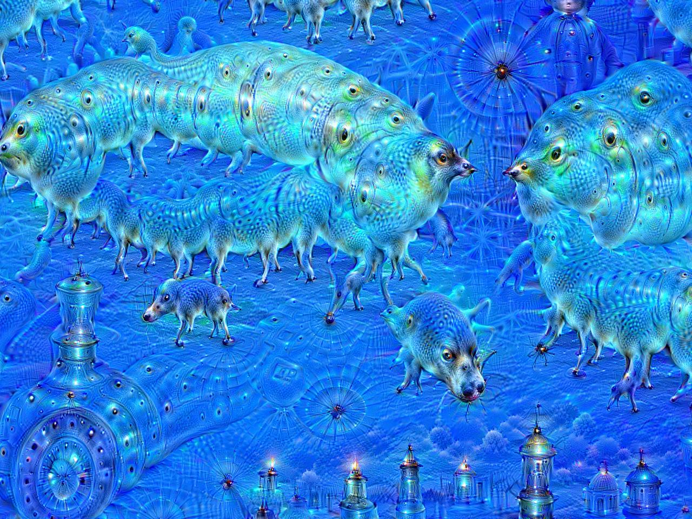
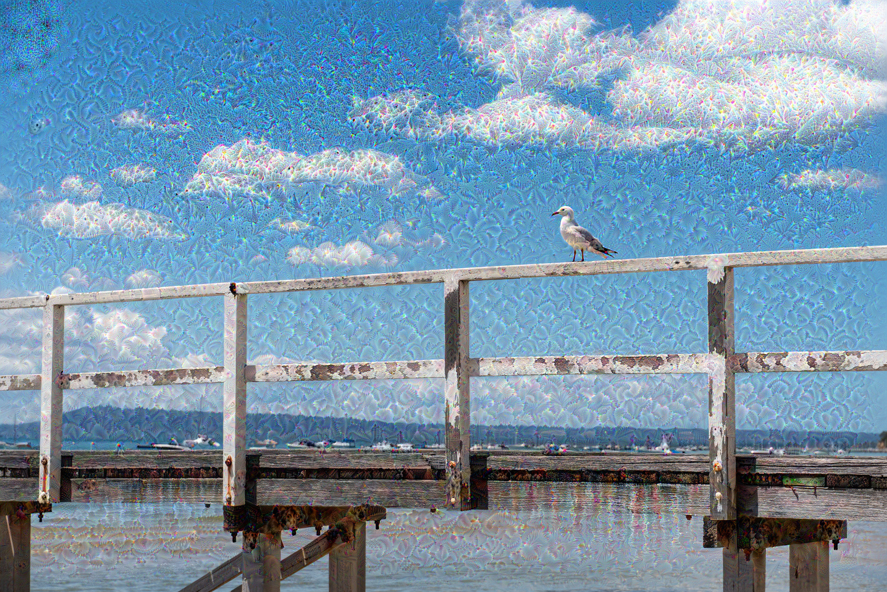
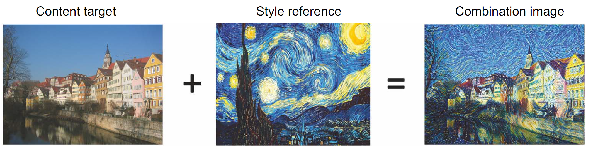
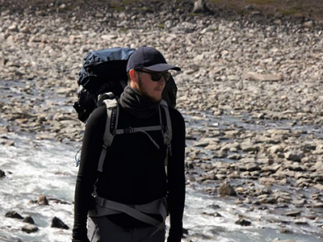
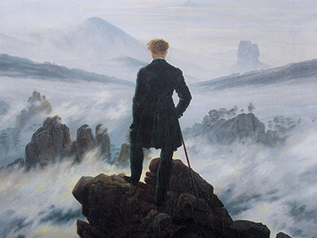
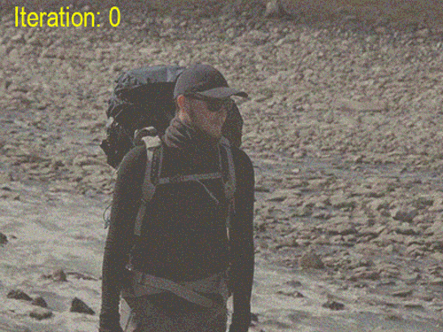
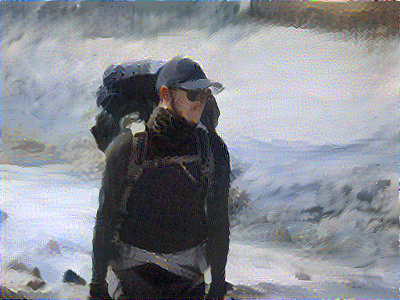
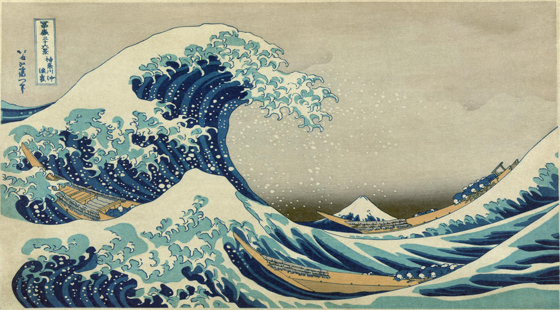
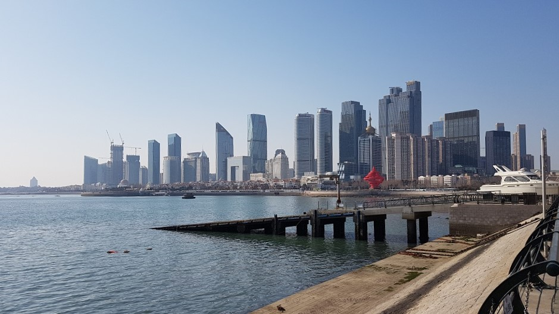
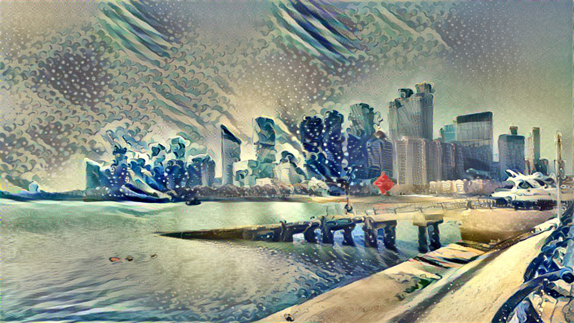

# Image Generation {visibility="uncounted"}

## Reverse-engineering a CNN

::: {.content-visible unless-format="revealjs"}
Reverse engineering is a process where we manipulate the inputs _x_ while keeping the loss function and the model architecture the same. This is useful in understanding the inner workings of the model, especially when we do not have access to the model architecture or the original train dataset. The idea here is to tweak/distort the input feature data and observe how model predictions vary. This provides meaningful insights in to what patterns in the input data are most critical to making model predictions. 
:::

::: {.content-visible unless-format="revealjs"}
This task however requires computing the gradients of the model's outputs with respect to all input features, hence, can be time consuming. 
:::

A CNN is a function $f_{\boldsymbol{\theta}}(\mathbf{x})$ that takes a vector (image) $\mathbf{x}$ and returns a vector (distribution) $\widehat{\mathbf{y}}$.

Normally, we train it by modifying $\boldsymbol{\theta}$ so that 

$$ \boldsymbol{\theta}^*\ =\  \underset{\boldsymbol{\theta}}{\mathrm{argmin}} \,\, \text{Loss} \bigl( f_{\boldsymbol{\theta}}(\mathbf{x}), \mathbf{y} \bigr). $$

However, it is possible to _not train_ the network but to modify $\mathbf{x}$, like

$$ \mathbf{x}^*\ =\  \underset{\mathbf{x}}{\mathrm{argmin}} \,\, \text{Loss} \bigl( f_{\boldsymbol{\theta}}(\mathbf{x}), \mathbf{y} \bigr). $$

This is very slow as we do gradient descent every single time.

## Deep Dream 

::: footer
Source: Wikipedia, [DeepDream page](https://commons.wikimedia.org/wiki/File:Aurelia-aurita-3-0009.jpg).
:::

## DeepDream

- Even though many deep learning models are black boxes, convnets are quite interpretable via visualization. Some visualization techniques are: visualizing convnet outputs shows how convnet layers transform the input, visualizing convnet filters shows what visual patterns or concept each filter is receptive to, etc.
- The activations of the first few layers of the network carries more information about the visual contents, while deeper layers encode higher, more abstract concepts.

## DeepDream

- Each filter is receptive to a visual pattern. To visualize a convnet filter, gradient ascent is used to maximise the response of the filter. Gradient ascent maximize a loss function and moves the image in a direction that activate the filter more strongly to enhance its reading of the visual pattern. 
- DeepDream maximizes the activation of the entire convnet layer rather than that of a specific filter, thus mixing together many visual patterns all at once.
- DeepDream starts with an existing image, latches on to preexisting visual patterns, distorting elements of the image in a somewhat artistic fashion.

## Original

## Transformed

::: footer
Generated by [Keras' Deep Dream tutorial](https://keras.io/examples/generative/deep_dream/).
:::

# Neural style transfer {data-visibility="uncounted"}

## Neural style transfer

Applying the style of a reference image to a target image while conserving the content of the target image.

::: {.notes}
- Style: textures, colors, visual patterns (blue-and-yellow circular brushstrokes in Vincent Van Gogh's Starry Night)
- Content: the higher-level macrostructure of the image (buildings in the Tübingen photograph).
:::

::: footer
Source: François Chollet (2021), _Deep Learning with Python_, Second Edition, Figure 12.9.
:::

## Goal of NST

What the model does:

- Preserve content by maintaining similar deeper layer activations between the original image and the generated image. The convnet should “see” both the original image and the generated image as containing the same things.

- Preserve style by maintaining similar correlations within activations for both low level layers and high-level layers. Feature correlations within a layer capture textures: the generated image and the style-reference image should share the same textures at different spatial scales.

## A wanderer in Greenland

::: columns
::: {.column width="50%"}
Content

:::

::: {.column width="50%"}
Style

:::
:::

::: footer
Source: Laub (2018), [On Neural Style Transfer](https://pat-laub.github.io/2018/01/07/neural-style-transfer.html), Blog post.
:::

## A wanderer in Greenland II

::: columns
::: {.column width="45%"}

:::

::: {.column width="55%"}

:::
:::

:::{.callout-tip}
## Question

How would you make this faster for one specific style image?
:::

::: footer
Source: Laub (2018), [On Neural Style Transfer](https://pat-laub.github.io/2018/01/07/neural-style-transfer.html), Blog post.
:::

## A new style image

::: footer
Source: Laub (2018), [On Neural Style Transfer](https://pat-laub.github.io/2018/01/07/neural-style-transfer.html), Blog post.
:::

## A new content image

::: footer
Source: Laub (2018), [On Neural Style Transfer](https://pat-laub.github.io/2018/01/07/neural-style-transfer.html), Blog post.
:::

## Another neural style transfer

::: footer
Source: Laub (2018), [On Neural Style Transfer](https://pat-laub.github.io/2018/01/07/neural-style-transfer.html), Blog post.
:::

## Why is this important?

Taking derivatives with respect to the input image can be a first step toward explainable AI for convolutional networks.

- [Saliency maps](https://youtu.be/y8cwyeccuy4)
- [Grad-CAM](https://youtu.be/xGZfAoh0xKs)





::: {.content-visible unless-format="revealjs"}
Both autoencoders and variational autoencoders aim to obtain latent representations of input data that carry same information but in a lower dimensional space. The difference between the two is that, autoencoders outputs the latent representations as vectors, while variational auto encoders first identifies the distribution of the input in the latent space, and then sample an observation from that as the vector. Autoencoders are better suited for dimensionality reduction and feature learning tasks. Variation autoencoders are better suited for generative modelling tasks and uncertainty estimation.
::: 

# Diffusion Models {visibility="uncounted"}

## Using KerasCV

::: {.content-hidden unless-format="revealjs"}

:::
::: {.content-visible unless-format="revealjs"}

:::
