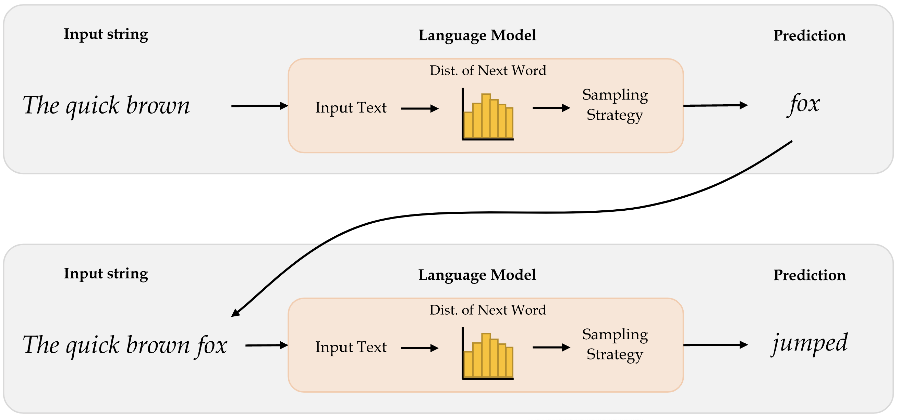
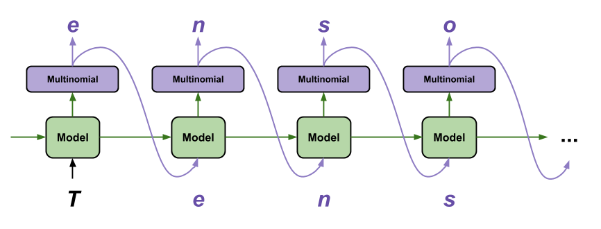
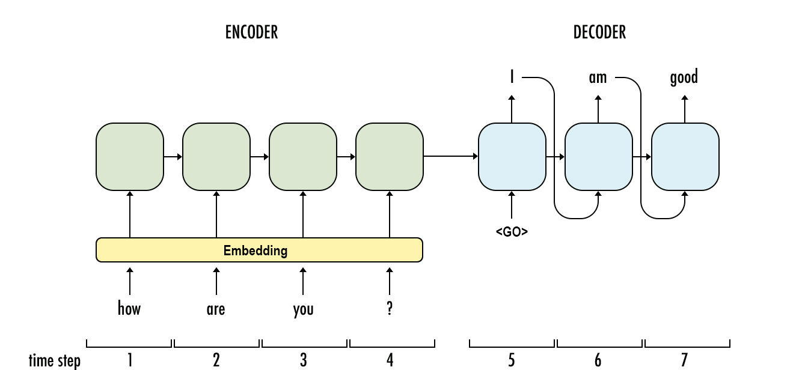
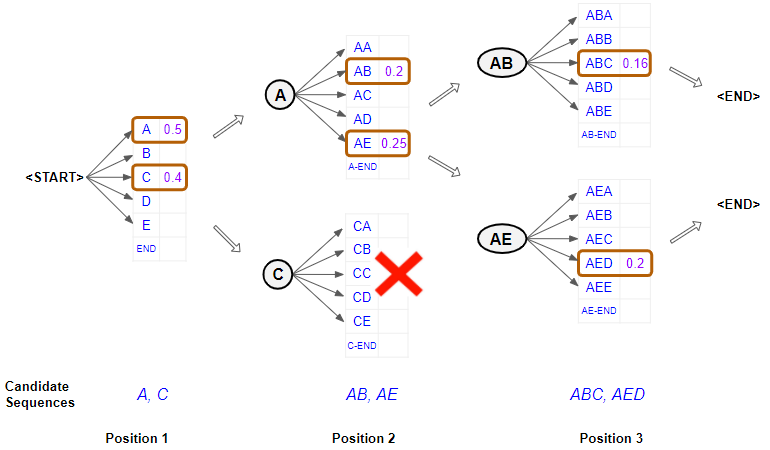

```{python}
#| echo: false
#| warning: false
from dotenv import find_dotenv, load_dotenv
assert load_dotenv(find_dotenv(usecwd=False)), "The .env file was not loaded."

import matplotlib
import matplotlib.pyplot as plt
import cycler

colors = ["#91CCCC", "#FF8FA9", "#CC91BC", "#3F9999", "#A5FFB8"]
plt.rcParams["axes.prop_cycle"] = cycler.cycler(color=colors)

def set_square_figures():
  matplotlib.pyplot.rcParams['figure.figsize'] = (2.0, 2.0)

def set_rectangular_figures():
  matplotlib.pyplot.rcParams['figure.figsize'] = (5.0, 2.0)

def square_fig():
    return matplotlib.pyplot.figure(figsize=(2, 2), dpi=350).gca()

set_rectangular_figures()
matplotlib.pyplot.rcParams['figure.dpi'] = 350
matplotlib.pyplot.rcParams['savefig.bbox'] = "tight"
matplotlib.pyplot.rcParams['font.family'] = "serif"

matplotlib.pyplot.rcParams['axes.spines.right'] = False
matplotlib.pyplot.rcParams['axes.spines.top'] = False

def add_diagonal_line():
    xl = matplotlib.pyplot.xlim()
    yl = matplotlib.pyplot.ylim()
    shortest_side = min(xl[1], yl[1])
    matplotlib.pyplot.plot([0, shortest_side], [0, shortest_side], color="black", linestyle="--")

import pandas
pandas.options.display.max_rows = 6

import numpy
numpy.set_printoptions(precision=2)
numpy.random.seed(123)

import keras
keras.utils.set_random_seed(1)
```

# Generative Adversarial Networks



# Language Models {visibility="uncounted"}

## Generative deep learning

- Using AI as augmented intelligence rather than artificial intelligence.
- Use of deep learning to augment creative activities such as writing, music and art, to *generate* new things.
- Some applications: text generation, deep dreaming, neural style transfer, variational autoencoders and generative adversarial networks.

## Text generation

> Generating sequential data is the closest computers get to dreaming.

- Generate sequence data: Train a model to predict the next token or next few tokens in a sentence, using previous tokens as input.
- A network that models the probability of the next tokens given the previous ones is called a *language model*.

::: {.notes}
GPT-3 is a 175 billion parameter text-generation model trained by the startup OpenAI on a large text corpus of digitally available books, Wikipedia and web crawling. GPT-3 made headlines in 2020 due to its capability to generate plausible-sounding text paragraphs on virtually any topic.
:::

::: footer
Source: Alex Graves (2013), [Generating Sequences With Recurrent Neural Networks](https://arxiv.org/abs/1308.0850)
:::

## Word-level language model



::: footer
Source: Marcus Lautier (2022).
:::

::: {.content-visible unless-format="revealjs"}
The way how word-level language models work is that, it first takes in the input text and then generates the probability distribution of the next word. This distribution tells us how likely a certain word is to be the next word. Thereafter, the model implements an appropriate sampling strategy to select the next word. Once the next word is predicted, it is appended to the input text and then passed in to the model again to predict the next word. The idea here is to predict the word after word. 
:::

## Character-level language model



::: footer
Source: Tensorflow tutorial, [Text generation with an RNN](https://www.tensorflow.org/text/tutorials/text_generation).
:::

::: {.content-visible unless-format="revealjs"}
Character-level language predicts the next character given a certain input character. They capture patterns at a much granular level and do not aim to capture semantics of words.
:::

## Useful for speech recognition

::: {#fig-speech-recognition}

| RNN output |  Decoded Transcription |
| --- | --- |
| what is the weather like in bostin right now | what is the weather like in boston right now |
| prime miniter nerenr modi | prime minister narendra modi |
| arther n tickets for the game | are there any tickets for the game |

Examples of transcriptions directly from the RNN with errors that are fixed by addition of a language model.
:::

::: footer
Source: Hannun et al. (2014), [Deep Speech: Scaling up end-to-end speech recognition](https://arxiv.org/pdf/1412.5567.pdf), arXiv:1412.5567, Table 1.
:::

::: {.content-visible unless-format="revealjs"}
The above example shows how RNN predictions (for sequential data processing) can be improved by fixing errors using a language model.
:::
## Generating Shakespeare I

::: {.content-visible unless-format="revealjs"}
The following is an example how a language model trained on works of Shakespeare starts predicting words after we input a string. This is an example of a character-level prediction, where we aim to predict the most likely character, not the word.
:::

> | ROMEO:
| Why, sir, what think you, sir?
| 
| AUTOLYCUS:
| A dozen; shall I be deceased.
| The enemy is parting with your general,
| As bias should still combit them offend
| That Montague is as devotions that did satisfied;
| But not they are put your pleasure.

::: footer
Source: Tensorflow tutorial, [Text generation with an RNN](https://www.tensorflow.org/text/tutorials/text_generation).
:::

## Generating Shakespeare II {data-visibility="uncounted"}

> | DUKE OF YORK:
| Peace, sing! do you must be all the law;
| And overmuting Mercutio slain;
| And stand betide that blows which wretched shame;
| Which, I, that have been complaints me older hours.
| 
| LUCENTIO:
| What, marry, may shame, the forish priest-lay estimest you, sir,
| Whom I will purchase with green limits o' the commons' ears!

::: footer
Source: Tensorflow tutorial, [Text generation with an RNN](https://www.tensorflow.org/text/tutorials/text_generation).
:::


## Generating Shakespeare III {data-visibility="uncounted"}

> | ANTIGONUS: 
| To be by oath enjoin'd to this. Farewell! 
| The day frowns more and more: thou'rt like to have 
| A lullaby too rough: I never saw 
| The heavens so dim by day. A savage clamour! 
|
| [Exit, pursued by a bear]

# Sampling strategy

::: {.content-visible unless-format="revealjs"}
The sampling strategy refers to the way how we pick the next word/character as the prediction after observing the distribution. There are different sampling strategies and they aim to serve different levels of trade-offs between exploration and exploitation when generating text sequences. 
:::

## Sampling strategy

- *Greedy sampling* will choose the token with the highest probability. It makes the resulting sentence repetitive and predictable.
- *Stochastic sampling*: if a word has probability 0.3 of being next in the sentence according to the model, we’ll choose it 30% of the time. But the result is still not interesting enough and still quite predictable.
- Use a *softmax temperature* to control the randomness. More randomness results in more surprising and creative sentences.

## Softmax temperature

- The softmax temperature is a parameter that controls the randomness of the next token.
- The formula is: $$ \text{softmax}_\text{temperature}(x) = \frac{\exp(x / \text{temperature})}{\sum_i \exp(x_i / \text{temperature})} $$

## "I am a" ...

```{python}
#| echo: false
def softmax(x, temperature=1.0):
    return numpy.exp(x / temperature) / numpy.sum(numpy.exp(x / temperature))

x = numpy.array([0.15, 0.5, 0.1, 0.25])
x /= numpy.sum(x)

# Plot bar charts for the original distributions and the softmax temperature versions.
plt.figure(figsize=(6, 3))

phrase = "I am a"
next_words = ["dog", "human", "robot", "teddy"] 

plt.subplot(2, 2, 1)
temperature = 0.1
plt.bar(next_words, softmax(x, temperature), color=colors)
plt.title(f"Temp = {temperature}")

plt.subplot(2, 2, 2)
temperature = 1
plt.bar(next_words, softmax(x, temperature), color=colors)
plt.title(f"Temp = {temperature}")

temperature = 10
plt.subplot(2, 2, 3)
plt.bar(next_words, softmax(x, temperature), color=colors)
plt.title(f"Temp = {temperature}")

plt.subplot(2, 2, 4)
temperature = 100
plt.bar(next_words, softmax(x, temperature), color=colors)
plt.title(f"Temp = {temperature}")

# Clean up the layout.
plt.tight_layout()

plt.show()
```
::: footer
Idea inspired by Mehta (2023), [The need for sampling temperature and differences between whisper, GPT-3, and probabilistic model's temperature](https://shivammehta25.github.io/posts/temperature-in-language-models-open-ai-whisper-probabilistic-machine-learning/)
:::

::: {.content-visible unless-format="revealjs"}
The graphical illustration above shows how the distribution of words change with different levels of temperature values. Higher levels of temperatures result in less predictable(more interesting) outcomes. If we continue to increase the temperature, after a certain point, outcomes will be picked completely at random. The predictions after this point might not be meaningful. Hence, attention to the trade-off between predictability and creativity is important when deciding the temperature.
:::

## Generating Laub (temp = 0.01)

::: {.content-visible unless-format="revealjs"}
Here I have trained a neural network based on the transcripts of my lecture recordings. Given the starting point "In today's lecture we will", I asked it to generate very different completions at varying temperatures. Setting temperature to 0.25 may give interesting outputs compared to 0.01, and 0.50 may give more creative outputs compared to 0.25. However, when we keep on increasing temperature, the neural network starts giving out meaningless sequences.
:::

> _In today's lecture we will_ be different situation.
> So, next one is what they rective that each commit to be able to learn some relationships from the course, and that is part of the image that it's very clese and black problems that you're trying to fit the neural network to do there instead of like a specific though shef series of layers mean about full of the chosen the baseline of car was in the right, but that's an important facts and it's a very small summary with very scrort by the beginning of the sentence.

## Generating Laub (temp = 0.25) {data-visibility="uncounted"}

> _In today's lecture we will_ decreas before model that we that we have to think about it, this mightsks better, for chattely the same project, because you might use the test set because it's to be picked up the things that I wanted to heard of things that I like that even real you and you're using the same thing again now because we need to understand what it's doing the same thing but instead of putting it in particular week, and we can say that's a thing I mainly link it's three columns.

## Generating Laub (temp = 0.5) {data-visibility="uncounted"}

> _In today's lecture we will_ probably the adw n wait lots of ngobs teulagedation to calculate the gradient and then I'll be less than one layer the next slide will br input over and over the threshow you ampaigey the one that we want to apply them quickly. So, here this is the screen here the main top kecw onct three thing to told them, and the output is a vertical variables and Marceparase of things that you're moving the blurring and that just data set is to maybe kind of categorical variants here but there's more efficiently not basically replace that with respect to the best and be the same thing.

## Generating Laub (temp = 1) {data-visibility="uncounted"}

> _In today's lecture we will_ put it different shates to touch on last week, so I want to ask what are you object frod current.
> They don't have any zero into it, things like that which mistakes. 10 claims that the average version was relden distever ditgs and Python for the whole term wo long right to really.
> The name of these two options.
> There are in that seems to be modified version. If you look at when you're putting numbers into your, that that's over.
> And I went backwards, up, if they'rina functional pricing working with.

## Generating Laub (temp = 1.5) {data-visibility="uncounted"}

> _In today's lecture we will_ put it could be bedinnth. Lowerstoriage nruron. So rochain the everything that I just sGiming.
> If there was a large. It's gonua draltionation.
> Tow many, up, would that black and 53% that's girter thankAty will get you jast typically stickK thing.
> But maybe. Anyway, I'm going to work on this libry two, past, at shit citcs jast
> pleming to memorize overcamples like pre pysing, why wareed to smart a one in this reportbryeccuriay.

## Copilot's "Conversation Style"


## Generate the most likely sequence

::: {.content-visible unless-format="revealjs"}
Similar to other sequence generating tasks such as generating the next word or generating the next character, generating an entire sequence of words is also useful. The task involves generating the most likely sequence after observing model predictions. 
:::



::: footer
Source: Payne (2021), [What is beam search](https://www.width.ai/post/what-is-beam-search), Width.ai blog.
:::

## Beam search

::: {.content-visible unless-format="revealjs"}
Instead of trying to carry forward only the highest probable prediction, beam search carries forward several high probable predictions, and then decide the highest probable combination of predictions. Beam search helps expand the exploration horizon for predictions which can contribute to more contextually relevant model predictions. However, this comes at a certain computational complexity.
:::



::: footer
Source: Doshi (2021), [Foundations of NLP Explained Visually: Beam Search, How It Works](https://towardsdatascience.com/foundations-of-nlp-explained-visually-beam-search-how-it-works-1586b9849a24), towardsdatascience.com.
:::



<!--  -->

## Next Steps

Two new courses starting in 2026:

**ACTL4306** "Quantitative Ethical AI for Risk & Actuarial Applications"

**ACTL4307** "Generative AI for Actuaries"

::: {.content-visible unless-format="revealjs"}

## Package Versions {.appendix data-visibility="uncounted"}

```{python}
from watermark import watermark
print(watermark(python=True, packages="keras,matplotlib,numpy,pandas,seaborn,scipy,torch,tensorflow,tf_keras"))
```

:::

## Glossary {.appendix data-visibility="uncounted"}

::: columns
:::: column

<!-- - autoencoder -->

- beam search
- bias
- ChatGPT (& RLHF)
- generative adversarial networks
- greedy sampling
::::
:::: column
- Hugging Face
- language model
- latent space
- softmax temperature
- stochastic sampling
::::
:::