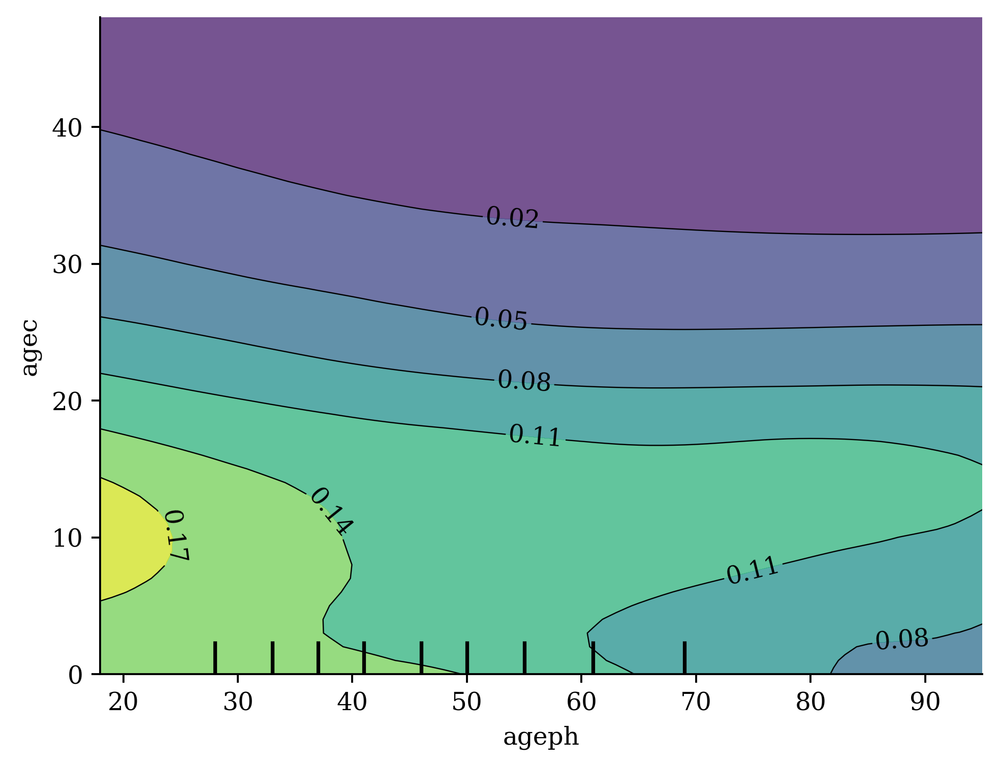

# Explaining a Neural Network with Partial Dependence Plots {visibility="uncounted"}

## Build a neural network

::: columns
::: column

```{python}
ct = make_column_transformer(
    (StandardScaler(), num_vars),
    (OneHotEncoder(drop="first", sparse_output=False), cat_vars),
    verbose_feature_names_out=False
)
ct.fit(X_train_raw)

X_train_nn = ct.transform(X_train_raw)
X_test_nn = ct.transform(X_test_raw)
y_train_nn = y_train_raw.values
y_test_nn = y_test_raw.values


random.seed(123)

nn_model = Sequential(
    [
        Input(shape=(X_train_nn.shape[1],)),
        Dense(128, activation="relu"),
        Dense(128, activation="relu"),
        Dense(128, activation="relu"),
        Dense(1, activation="exponential")
    ]
)
```

:::

::: column

```{python}
#| eval: false
nn_model.compile(
    optimizer="adam",
    loss="poisson",
    metrics=["mae"]
)

history = nn_model.fit(X_train_nn, y_train_nn,
    epochs=25, batch_size=64, verbose=0,
)
```

```{python}
#| echo: false
if not Path("models/nn_model_belgian.keras").exists():
    nn_model.compile(
        optimizer="adam",
        loss="poisson",
        metrics=["mae"]
    )
    history = nn_model.fit(X_train_nn, y_train_nn,
        epochs=25,
        batch_size=64,
        verbose=0,
    )
    nn_model.save("models/nn_model_belgian.keras")

    history = history.history
    with open("models/nn_model_belgian_history.json", "w") as json_file:
        json.dump(history, json_file)

else:
    nn_model = keras.models.load_model("models/nn_model_belgian.keras")

    with open("models/nn_model_belgian_history.json", "r") as json_file:
        history = json.load(json_file)
```

```{python}
#| code-fold: true
plt.plot(history['loss'])
```

:::
:::

## Metrics {data-visibility="uncounted"}

```{python}
from sklearn.metrics import mean_poisson_deviance, mean_absolute_error

# Evaluate the neural network model
y_pred_nn = nn_model.predict(X_test_nn, verbose=0, batch_size=X_test_nn.shape[0]).flatten()
print(f"NN mean Poisson deviance  : {mean_poisson_deviance(y_test_nn, y_pred_nn):.4f}")
print(f"NN MAE                    : {mean_absolute_error(y_test_nn, y_pred_nn):.4f}")

# Compare to the GAM
y_pred_gam = gam_model.predict(X_test_gam).ravel()
print(f"GAM mean Poisson deviance : {mean_poisson_deviance(y_test_gam, y_pred_gam):.4f}")
print(f"GAM MAE                   : {mean_absolute_error(y_test_gam, y_pred_gam):.4f}")

## Compare to the GLM
y_pred_glm = glm_model.predict(X_test_raw).values.ravel()
print(f"GLM mean Poisson deviance : {mean_poisson_deviance(y_test_raw, y_pred_glm):.4f}")
print(f"GLM MAE                   : {mean_absolute_error(y_test_raw, y_pred_glm):.4f}")
```

## Permutation importance example

```{python}
scores = permutation_test(nn_model, X_train_nn.values, y_train_nn)
plt.plot(scores[:,0], label='Loss')
plt.xticks(ticks=np.arange(len(X_train_nn.columns)), labels=X_train_nn.columns, rotation=90);
```

::: {.content-visible unless-format="revealjs"}
The exposure and bonus-malus variables are the least important. The type of coverage, use and if the vehicle is part of a fleet are the most important variables.
:::

## PDP: Training data {.smaller}

Partial dependence plots start by looking at the training data.

::: {.content-visible unless-format="revealjs"}
What is the average prediction over the training data?
:::

```{python}
X_train_raw
```

```{python}
nn_model.predict(ct.transform(X_train_raw), verbose=0).mean()
```

## PDP: Alternate Reality {.smaller data-visibility="uncounted"}

::: {.content-visible unless-format="revealjs"}
Consider an alternate reality where all polidyholders are 18 years old. What is the average prediction then?
:::

```{python}
X_train_pd = X_train_raw.copy()
X_train_pd['ageph'] = 18
X_train_pd
```

```{python}
nn_model.predict(ct.transform(X_train_pd), verbose=0).mean()
```

## PDP: Alternate Reality {.smaller data-visibility="uncounted" .unlisted}

::: {.content-visible unless-format="revealjs"}
What about if we pretend all the policyholders are 19 years old?
:::

```{python}
X_train_pd = X_train_raw.copy()
X_train_pd['ageph'] = 19
X_train_pd
```

```{python}
nn_model.predict(ct.transform(X_train_pd), verbose=0).mean()
```


## PDP: Alternate Reality {.smaller data-visibility="uncounted" .unlisted}

```{python}
X_train_pd = X_train_raw.copy()
X_train_pd['ageph'] = 90
X_train_pd
```

```{python}
nn_model.predict(ct.transform(X_train_pd), verbose=0).mean()
```

::: fragment
::: {.callout-note}
## Question

What could go wrong?
:::
:::


## Partial dependence plots

::: {.content-visible unless-format="revealjs"}
Plot the average prediction for each age given to all policyholders.
:::

```{python}
# Make partial dependence plot for ageph by hand
ageph_range = np.linspace(X_train_raw['ageph'].min(), X_train_raw['ageph'].max(), 100)
y_preds = []
X_train_pd = X_train_raw.copy()

for age in ageph_range:
    X_train_pd['ageph'] = age
    X_train_pd_ct = ct.transform(X_train_pd)
    y_pred_batch = nn_model.predict(X_train_pd_ct, verbose=0, batch_size=X_train_pd_ct.shape[0])
    y_preds.append(y_pred_batch.mean())
```

```{python}
#| code-fold: true
plt.plot(ageph_range, y_preds, label='PDP for ageph')
plt.xlabel('Age of Policyholder')
plt.ylabel('Predicted Number of Claims')
plt.title('Partial Dependence Plot for Age of Policyholder');
```

## Using scikit-learn's PDP

(First need to trick scikit-learn a little..)

```{python}
#| code-fold: true
from sklearn.base import BaseEstimator, RegressorMixin

class SklearnModel(BaseEstimator, RegressorMixin):
    def __init__(self, ct=None, model=None, batch_size=8192):
        self.ct = ct
        self.model = model
        self.batch_size = batch_size
        # Add fitted attribute
        self.n_features_in_ = ct.transform(X_train_raw.iloc[:1]).shape[1]

    def __sklearn_tags__(self):
        # Get parent tags and override estimator_type
        tags = super().__sklearn_tags__()
        tags.estimator_type = "regressor"
        return tags

    def predict(self, X):
        X_trans = self.ct.transform(X)
        preds = self.model.predict(
            X_trans,
            verbose=0,
            batch_size=self.batch_size
        )
        return preds.ravel()

    def fit(self, X=None, y=None):
        return self

nn_model_skl = SklearnModel(ct, nn_model)
```

```{python}
from sklearn.inspection import PartialDependenceDisplay

PartialDependenceDisplay.from_estimator(
    nn_model_skl,
    X_train_raw,
    features=[0],
    feature_names=X_train_raw.columns,
)
```

## Explaining the ages and exposure

```{python}
#| code-fold: true
cols = X_train_raw.columns.to_list() 
inds = [cols.index(col) for col in ["ageph", "agec", "expo"]]
PartialDependenceDisplay.from_estimator(
    nn_model_skl,
    X_train_raw,
    features=inds,
    feature_names=X_train_raw.columns,
)
```

::: {.content-visible unless-format="revealjs"}
The 9 small vertical lines on the x-axis represent the bounds of the deciles of the dataset, i.e., 10% of observations lie between each pair of bars. This helps us understand where most of the observations lie. E.g., for `agec`, we can see that most of the cars were younger than around 15 years, and 10% of observations have `agec` greater than 15 years.

These bars are useful as they indicate where we should place most of our interpretation. We should avoid reading too much into PDP lines where only a small portion of the dataset lies.

:::{.callout-caution}
Let's have a closer look at the PDP for `expo` (exposure). Does this plot make sense to you?

**Answer**: Intuitively, exposure should have a _multiplicative_ impact on expected claim numbers (i.e. $y=mx, m>0$). It should be an increasing straight line.

In this case, rather than putting exposure in as a feature like every other variable, it should be manually adjusted to have the right impact.
:::
:::

## Explaining the bonus-malus and location

```{python}
#| code-fold: true
cols = X_train_raw.columns.to_list() 
inds = [cols.index(col) for col in ["bm", "lat", "long"]]
PartialDependenceDisplay.from_estimator(
    nn_model_skl,
    X_train_raw,
    features=inds,
    feature_names=X_train_raw.columns,
)
```

## Bivariate age effects

```{python}
#| eval: false
cols = X_train_raw.columns.to_list() 
inds = [cols.index(col) for col in ["ageph", "agec"]]

disp = PartialDependenceDisplay.from_estimator(
    nn_model_skl,
    X_train_raw,
    features=[tuple(inds)],
    feature_names=X_train_raw.columns,
)
```



<!-- plt.subplots_adjust(hspace=0.3)  -->
