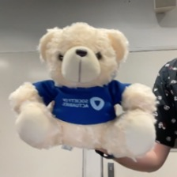
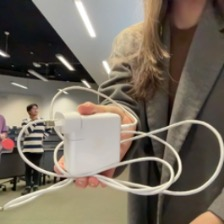
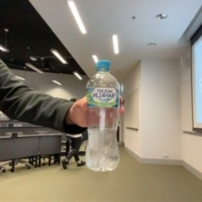
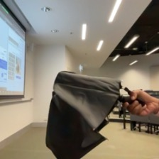

## Pretrained model

```{python}
#| output: false
def classify_imagenet(paths, model_module, ModelClass, dims):
    images = [keras.utils.load_img(path, target_size=dims) for path in paths]
    image_array = np.array([keras.utils.img_to_array(img) for img in images])
    inputs = model_module.preprocess_input(image_array)

    model = ModelClass(weights="imagenet")
    Y_proba = model(inputs)
    top_k = model_module.decode_predictions(Y_proba, top=3)

    for image_index in range(len(images)):
        print(f"Image #{image_index}:")
        for class_id, name, y_proba in top_k[image_index]:
            print(f" {class_id} - {name} {int(y_proba*100)}%")
        print()
```


## Predicted classes (MobileNet)

::: columns
::: {.column width="15%"}
:::
::: {.column width="50%"}

<br><br>

```{python}
#| echo: false
#| warning: false
classify_imagenet(
    ["images/teddy.jpg", "images/mouse.jpg", "images/dollar.jpg"],
    keras.applications.mobilenet,
    keras.applications.mobilenet.MobileNet,
    (224, 224),
)
```
:::
::: {.column width="20%"}




:::
::: {.column width="15%"}
:::
:::

## Predicted classes (MobileNetV2) {visibility="uncounted"}

::: columns
::: {.column width="15%"}
:::
::: {.column width="50%"}

<br><br>

```{python}
#| echo: false
#| warning: false
classify_imagenet(
    ["images/teddy.jpg", "images/mouse.jpg", "images/dollar.jpg"],
    keras.applications.mobilenet_v2,
    keras.applications.mobilenet_v2.MobileNetV2,
    (224, 224),
)
```
:::
::: {.column width="20%"}


:::
::: {.column width="15%"}
:::
:::

## Predicted classes (InceptionV3) {visibility="uncounted"}

::: columns
::: {.column width="15%"}
:::
::: {.column width="50%"}

<br><br>

```{python}
#| echo: false
#| warning: false
classify_imagenet(
    ["images/teddy.jpg", "images/mouse.jpg", "images/dollar.jpg"],
    keras.applications.inception_v3,
    keras.applications.inception_v3.InceptionV3,
    (299, 299),
)
```
:::
::: {.column width="20%"}


:::
::: {.column width="15%"}
:::
:::

## Predicted classes II (MobileNet)

::: columns
::: {.column width="15%"}
:::
::: {.column width="50%"}

<br><br>

```{python}
#| echo: false
#| warning: false
classify_imagenet(
    ["images/charger-4.jpg", "images/table-tennis-17.jpg", "images/water-bottle-15.jpg"],
    keras.applications.mobilenet,
    keras.applications.mobilenet.MobileNet,
    (224, 224),
)
```
:::
::: {.column width="20%"}





:::
::: {.column width="15%"}
:::
:::

## Predicted classes II (MobileNetV2) {visibility="uncounted"}

::: columns
::: {.column width="15%"}
:::
::: {.column width="50%"}

<br><br>

```{python}
#| echo: false
#| warning: false
classify_imagenet(
    ["images/charger-4.jpg", "images/table-tennis-17.jpg", "images/water-bottle-15.jpg"],
    keras.applications.mobilenet_v2,
    keras.applications.mobilenet_v2.MobileNetV2,
    (224, 224),
)
```
:::
::: {.column width="20%"}


:::
::: {.column width="15%"}
:::
:::

## Predicted classes II (InceptionV3) {visibility="uncounted"}

::: columns
::: {.column width="15%"}
:::
::: {.column width="50%"}

<br><br>

```{python}
#| echo: false
#| warning: false
classify_imagenet(
    ["images/charger-4.jpg", "images/table-tennis-17.jpg", "images/water-bottle-15.jpg"],
    keras.applications.inception_v3,
    keras.applications.inception_v3.InceptionV3,
    (299, 299),
)
```
:::
::: {.column width="20%"}


:::
::: {.column width="15%"}
:::
:::


## Predicted classes III (MobileNet)

::: columns
::: {.column width="15%"}
:::
::: {.column width="50%"}

<br><br>

```{python}
#| echo: false
#| warning: false
classify_imagenet(
    ["images/patrick-0.jpg", "images/umbrella-0.jpg", "images/hand-15.jpg"],
    keras.applications.mobilenet,
    keras.applications.mobilenet.MobileNet,
    (224, 224),
)
```
:::
::: {.column width="20%"}





:::
::: {.column width="15%"}
:::
:::

## Predicted classes III (MobileNetV2) {visibility="uncounted"}

::: columns
::: {.column width="15%"}
:::
::: {.column width="50%"}

<br><br>

```{python}
#| echo: false
#| warning: false
classify_imagenet(
    ["images/patrick-0.jpg", "images/umbrella-0.jpg", "images/hand-15.jpg"],
    keras.applications.mobilenet_v2,
    keras.applications.mobilenet_v2.MobileNetV2,
    (224, 224),
)
```
:::
::: {.column width="20%"}


:::
::: {.column width="15%"}
:::
:::

## Predicted classes III (InceptionV3) {visibility="uncounted"}

::: columns
::: {.column width="15%"}
:::
::: {.column width="50%"}

<br><br>

```{python}
#| echo: false
#| warning: false
classify_imagenet(
    ["images/patrick-0.jpg", "images/umbrella-0.jpg", "images/hand-15.jpg"],
    keras.applications.inception_v3,
    keras.applications.inception_v3.InceptionV3,
    (299, 299),
)
```
:::
::: {.column width="20%"}


:::
::: {.column width="15%"}
:::
:::
