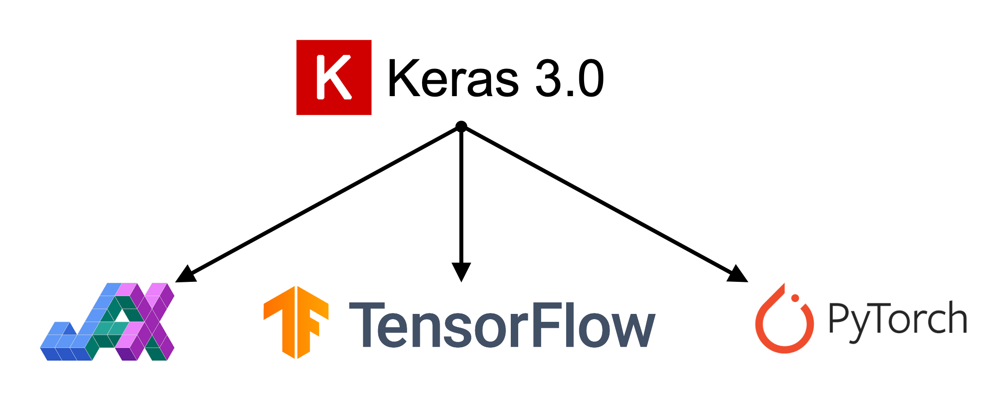
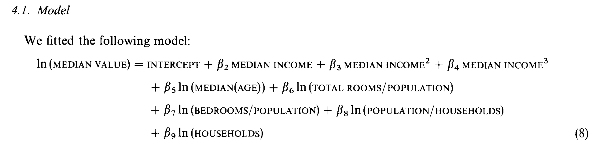
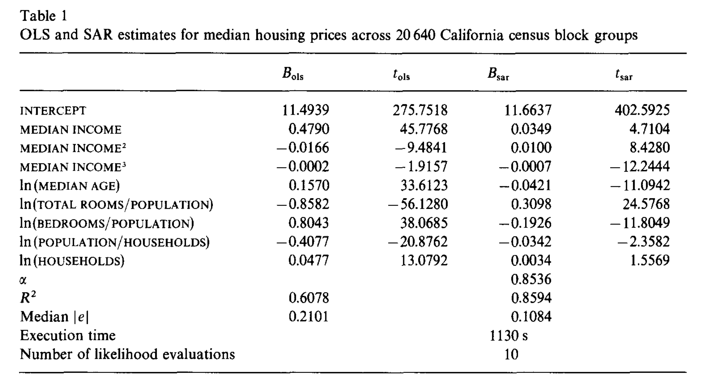
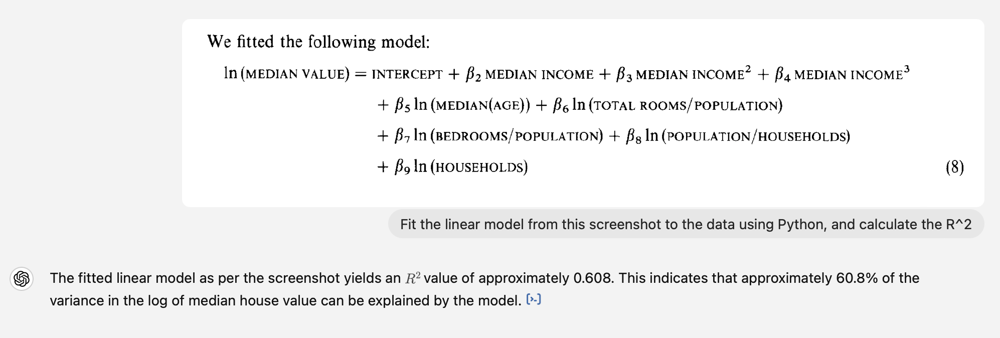
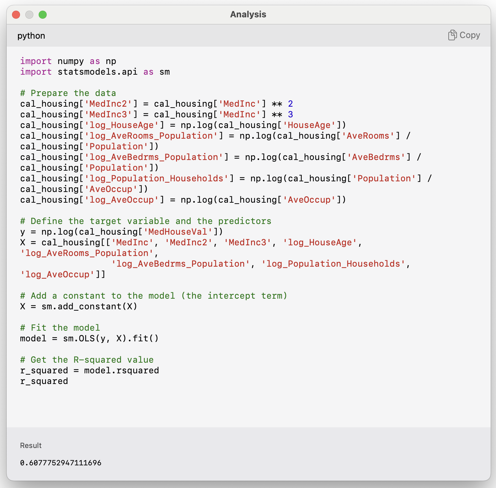
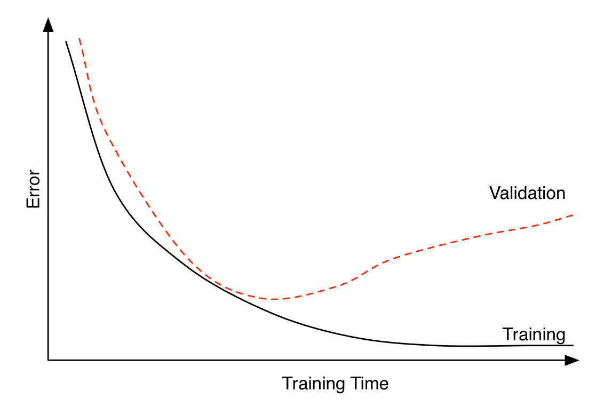

```{python}
#| include: false
# Setup: load the California housing data and fit the linear regression baseline
# that the rest of this lecture references. The walkthrough of these steps lives
# in `python-for-data-science.qmd`.
from sklearn.datasets import fetch_california_housing
from sklearn.model_selection import train_test_split
from sklearn.linear_model import LinearRegression
from sklearn.metrics import mean_squared_error as mse

features, target = fetch_california_housing(as_frame=True, return_X_y=True)

X_main, X_test, y_main, y_test = train_test_split(
    features, target, test_size=0.2, random_state=1
)
X_train, X_val, y_train, y_val = train_test_split(
    X_main, y_main, test_size=0.25, random_state=1
)
num_features = features.shape[1]

lr = LinearRegression()
lr.fit(X_train, y_train)

mse_lr_train = mse(y_train, lr.predict(X_train))
mse_lr_val = mse(y_val, lr.predict(X_val))

mse_train = {"Linear Regression": mse_lr_train}
mse_val = {"Linear Regression": mse_lr_val}
```

# Our First Neural Network {visibility="uncounted"}

## What are Keras and TensorFlow?

Keras is common way of specifying, training, and using neural networks.
It gives a simple interface to _various backend_ libraries, including Tensorflow. 



:::footer
Source: Melissa Renard (2025)
:::

## Create a Keras ANN model

Decide on the architecture: a simple fully-connected network with one hidden layer with 30 neurons.

Create the model:

```{python}
from keras.models import Sequential                              #<1>
from keras.layers import Dense, Input                            #<2>

model = Sequential(
    [Input((num_features,)),
     Dense(30, activation="leaky_relu"),
     Dense(1, activation="leaky_relu")]
)                                                                #<3>
```

1. Imports `Sequential` from `keras.models`
2. Imports `Dense` from `keras.layers`
3. Defines the model architecture using `Sequential()` function

::: {.content-visible unless-format="revealjs"}
This neural network architecture includes one hidden layer with 30 neurons and an output layer with 1 neuron. An activation function is specified (`leaky_relu`) for both the hidden layer and the output layer. In situations where no activation function is specified for the output layer, it assumes a `linear` activation.

What is meant by `Sequential`? The outputs in a given layer become inputs into the next layer, and so on.
:::

## Inspect the model

```{python}
model.summary()
```

::: {.content-visible unless-format="revealjs"}
Note: the output shapes have `None` for the number of rows because the predictions have not yet been made. The `None` is a placeholder for the potential predictions.
:::

## The model is initialised randomly

::: {.content-visible unless-format="revealjs"}
When fitting the ANN, we need to have some initial values for the weights and biases. These are chosen randomly.
:::

```{python}
model = Sequential([Dense(30, activation="leaky_relu"), Dense(1, activation="leaky_relu")])
model.predict(X_val.head(3), verbose=0)
```

```{python}
model = Sequential([Dense(30, activation="leaky_relu"), Dense(1, activation="leaky_relu")])
model.predict(X_val.head(3), verbose=0)
```

::: {.content-visible unless-format="revealjs"}
We can see how rerunning the same code with the same input data results in significantly different predictions. This is due to the random initialization. 
:::

## Controlling the randomness

```{python}
#| code-line-numbers: "|1-3,9"
import random

random.seed(123)

model = Sequential([Dense(30, activation="leaky_relu"), Dense(1, activation="leaky_relu")])

display(model.predict(X_val.head(3), verbose=0))

random.seed(123)
model = Sequential([Dense(30, activation="leaky_relu"), Dense(1, activation="leaky_relu")])

display(model.predict(X_val.head(3), verbose=0))
```

::: {.content-visible unless-format="revealjs"}
By setting the seed, we can control for the randomness.
:::

## Fit the model
```{python}
random.seed(123)                                                    #<1>

model = Sequential([                                                #<2>
    Dense(30, activation="leaky_relu"),
    Dense(1, activation="leaky_relu")
])

model.compile("adam", "mse")                                        #<3>
%time hist = model.fit(X_train, y_train, epochs=5, verbose=False)   #<4>
hist.history["loss"]                                                #<5>
```

::: {.content-visible unless-format="revealjs"}
The above code explains how we would fit a basic neural network. 

1. Define the seed for reproducibility.
2. Define the architecture of the model. 
3. Compile the model. 
4. Fit the model. 
5. Return the calculate loss function (`mse`) at the end of each epoch.

Compiling the model (step 3) involves giving instructions on how we want the model to be trained. At the least, we must define the optimizer and loss function. The *optimizer* explains how the model should learn (how the model should update the weights), and the *loss function* states the objective that the model needs to optimize. In the above code, we use `adam` as the optimizer and `mse` (mean squared error) as the loss function. 

The `fit()` function (step 4) takes in the training data, and runs the entire dataset through 5 epochs before training completes. What this means is that the model is run through the entire dataset 5 times. Suppose we start the training process with the random initialization, run the model through the entire data, calculate the `mse` (after 1 epoch), and update the weights using the `adam` optimizer. Then we run the model through the entire dataset once again with the updated weights, to calculate the `mse` at the end of the second epoch. Likewise, we would run the model 5 times before the training completes. 

**Epoch**: Each step looks at a batch of data (say, the first 10 observations), fits the model, compares with the actual values, and updates the weights and biases to improve the loss function (this is 1 update). Then it moves on to the next batch of data, and updates the weights and biases another time... Once it reaches the end of the dataset, it loops back to the beginning of the dataset. This is defined as *one single epoch*.
:::

<br>

::: {.content-visible unless-format="revealjs"}
`%time` command computes and prints the amount of time spend on training.
By setting `verbose=False` we can avoid printing of intermediate results during training. Setting `verbose=True` is useful when we want to observe how the neural network is training.  
:::

## Make predictions

```{python}
y_pred = model.predict(X_train[:3], verbose=0)
y_pred
```

::: {.callout-note}

The `.predict` gives us a 'matrix' not a 'vector'.
Calling `.flatten()` will convert it to a 'vector'.

```{python}
print(f"Original shape: {y_pred.shape}")
y_pred = y_pred.flatten()
print(f"Flattened shape: {y_pred.shape}")
y_pred
```

:::

## Plot the predictions

```{python}
#| include: false
set_square_figures()
```

::: columns
::: column

```{python}
#| echo: false
y_pred = model.predict(X_train, verbose=0)
plt.scatter(y_pred, y_train)
plt.xlabel("Predictions")
plt.ylabel("True values")
plt.title("Training set")
add_diagonal_line()
```
:::
::: column

```{python}
#| echo: false
y_pred = model.predict(X_val, verbose=0)
plt.scatter(y_pred, y_val)
plt.xlabel("Predictions")
plt.ylabel("True values")
plt.title("Validation set")
add_diagonal_line()
```
:::
:::

```{python}
#| include: false
set_rectangular_figures()
```

::: {.content-visible unless-format="revealjs"}
One problem with the predictions is that lots of predictions include negative values, which is unrealistic for house prices. We might have to rethink the activation function in the output layer.
:::

## Assess the model

```{python}
y_pred = model.predict(X_val, verbose=0)
mse(y_val, y_pred)
```

```{python}
mse_train["Basic ANN"] = mse(
    y_train, model.predict(X_train, verbose=0)
)
mse_val["Basic ANN"] = mse(y_val, model.predict(X_val, verbose=0))
```

Some predictions are negative:

```{python}
y_pred = model.predict(X_val, verbose=0)
y_pred.min(), y_pred.max()
```

```{python}
y_val.min(), y_val.max()
```

# Force positive predictions {visibility="uncounted"}

::: {.content-visible unless-format="revealjs"}
We noted that a lot of the predictions include negative values which is unrealistic for house prices. How can we force the predictions to be positive?
:::

## Try running for longer

```{python}
random.seed(123)

model = Sequential([
    Dense(30, activation="leaky_relu"),
    Dense(1, activation="leaky_relu")
])

model.compile("adam", "mse")

%time hist = model.fit(X_train, y_train, epochs=50, verbose=False)
```
::: {.content-visible unless-format="revealjs"}
We will train the same neural network architecture with more epochs (`epochs=50`) to see if the results improve.
:::
## Loss curve

```{python}
plt.plot(range(1, 51), hist.history["loss"])
plt.xlabel("Epoch")
plt.ylabel("MSE");
```
::: {.content-visible unless-format="revealjs"}
The loss curve experiences a sudden drop even before finishing 5 epochs and remains consistently low. This indicates that increasing the number of epochs from 5 to 50 does not significantly increase the accuracy.
:::

## Loss curve {data-visibility="uncounted"}

```{python}
plt.plot(range(2, 51), hist.history["loss"][1:])
plt.xlabel("Epoch")
plt.ylabel("MSE");
```

::: {.content-visible unless-format="revealjs"}
The above code filters out the MSE value from the first epoch. It plots the vector of MSE values starting from the 2nd epoch. By doing so, we can observe the fluctuations in the MSE values across different epochs more clearly. Results show that the model does not benefit from increasing the epochs.
:::

## Predictions

```{python}
y_pred = model.predict(X_val, verbose=0)
print(f"Min prediction: {y_pred.min():.2f}")
print(f"Max prediction: {y_pred.max():.2f}")
```

::: columns
::: column
```{python}
#| eval: false
plt.scatter(y_pred, y_val)
plt.xlabel("Predictions")
plt.ylabel("True values")
add_diagonal_line()
```

```{python}
mse_train["Long run ANN"] = mse(
    y_train, model.predict(X_train, verbose=0)
)
mse_val["Long run ANN"] = mse(y_val, model.predict(X_val, verbose=0))
```

:::
::: column

<div style="position: relative; top: -2em;">

```{python}
#| echo: false
square_fig().scatter(y_pred, y_val)
plt.xlabel("Predictions")
plt.ylabel("True values")
add_diagonal_line()
```

</div>

:::
:::

::: {.content-visible unless-format="revealjs"}
While there is an improvement, we are still seeing some negative predictions. What else can we try, other than training the NN for longer?
:::

## Try different activation functions

::: {.content-visible unless-format="revealjs"}
We can choose a different activation function for the final layer, namely, an activation function that guarantees a positive output.
:::

```{python}
#| echo: false
import keras.activations as acts
import numpy as np


def plot_activation(activation, ax, name, hideX=False):
    x = np.linspace(-5, 5, 100)
    y = activation(x)

    ax.plot(x, y)
    if y.numpy().min() < 0:
        ax.axhline(0, ls="--", c="black", lw=0.5)

    # Annotate the top-left corner of the subplot with the name
    # of the activation function
    ax.annotate(
        name,
        xy=(0.2, 1),
        xycoords="axes fraction",
        xytext=(-5, -5),
        textcoords="offset points",
        ha="left",
        va="top",
    )

    if hideX:
        ax.xaxis.set_visible(False)


fig, axs = plt.subplots(2, 2)
plot_activation(acts.tanh, axs[0, 0], "tanh", hideX=True)
plot_activation(acts.sigmoid, axs[0, 1], "sigmoid", hideX=True)
plot_activation(acts.softplus, axs[1, 0], "softplus")
plot_activation(acts.exponential, axs[1, 1], "exponential")

axs[0, 0].set(ylabel="Output")
axs[1, 0].set(xlabel="Input", ylabel="Output")
axs[1, 1].set(xlabel="Input");
```

::: {.content-visible unless-format="revealjs"}
We should be mindful when selecting the activation function. Both `tanh` and `sigmoid` functions restrict the output values to the range of [0,1]. This is not sensible for house price modelling. `softplus` does not have that problem. Also, `softplus` ensures the output is positive which is realistic for house prices.
:::

## Enforce positive outputs (softplus)

```{python}
random.seed(123)

model = Sequential([
    Dense(30, activation="leaky_relu"),
    Dense(1, activation="softplus")
])

model.compile("adam", "mse")

%time hist = model.fit(X_train, y_train, epochs=50, \
    verbose=False)

import numpy as np
losses = np.round(hist.history["loss"], 2)
print(losses[:5], "...", losses[-5:])
```

## Plot the predictions

```{python}
#| include: false
set_square_figures()
```

::: columns
::: column

```{python}
#| echo: false
y_pred = model.predict(X_train, verbose=0)
plt.scatter(y_pred, y_train)
plt.xlabel("Predictions")
plt.ylabel("True values")
plt.title("Training set");
```
:::
::: column

```{python}
#| echo: false
y_pred = model.predict(X_val, verbose=0)
plt.scatter(y_pred, y_val)
plt.xlabel("Predictions")
plt.ylabel("True values")
plt.title("Validation set");
```
:::
:::

```{python}
#| include: false
set_rectangular_figures()
```

::: {.content-visible unless-format="revealjs"}
Plots illustrate how all the outputs were stuck at zero. Irrespective of how many epochs we run, the output would always be zero.
:::

## Enforce positive outputs ($\mathrm{e}^{\,x}$)

```{python}
#| code-line-numbers: "|5"
random.seed(123)

model = Sequential([
    Dense(30, activation="leaky_relu"),
    Dense(1, activation="exponential")
])

model.compile("adam", "mse")

%time hist = model.fit(X_train, y_train, epochs=5, verbose=False)

losses = hist.history["loss"]
print(losses)
```

::: {.content-visible unless-format="revealjs"}
Training the model again with an exponential activation function will give `nan` values. This is because the results then can explode easily.
:::

## Same as transforming the target

::: {.content-visible unless-format="revealjs"}
A benefit of NNs is that you don't have to manually transform the features like you do when fitting a GLM.
:::

::: {.content-hidden unless-format="revealjs"}

:::

::: {.content-visible unless-format="revealjs"}
[@kelley1997sparse] studied the California house price dataset. This was one of the models they fit:

$$\begin{align}

\ln(\text{MedHouseVal}) = & \beta_0 + \beta_1\text{MedInc} + \beta_2\text{MedInc}^2 + \beta_3\text{MedInc}^3 \\

& + \beta_4\ln(\text{HouseAge})+ \beta_5\ln(\text{AveRooms}/\text{Population}) \\

& + \beta_6\ln(\text{AveBedrms}/\text{Population}) + \beta_7\ln(\text{Population}/\text{AveOccup}) \\

& + \beta_8\ln(\text{AveOccup})

\end{align}$$
:::

::: {.callout-note}
Fitting $\ln(\text{Median Value})$ is mathematically identical to the `exponential` activation function in the final layer (but metrics are in different units).
:::

::: {.content-hidden unless-format="revealjs"}
::: footer
Source: Pace and Barry (1997), [Sparse Spatial Autoregressions](https://doi.org/10.1016/S0167-7152(96)00140-X), Statistics & Probability Letters.
:::
:::

## Good to know others results

::: {.content-visible unless-format="revealjs"}
If you find that someone else has fit a model to the same dataset, you can compare your metrics to theirs in your report. For example, [@kelley1997sparse] studied this dataset. You can compare the $R^2$ of their two models and compare them to the ones we fit here.
:::

::: {.content-hidden unless-format="revealjs"}


::: footer
Source: Pace and Barry (1997), [Sparse Spatial Autoregressions](https://doi.org/10.1016/S0167-7152(96)00140-X), Statistics & Probability Letters.
:::
:::

## GPT can double-check these results

::: {.content-visible unless-format="revealjs"}
You can ask GPT to fit the linear model shown above to the data using Python and calculate the $R^2$.
:::

::: columns
::: column


I'd previously given it the CSV of the data.
:::
::: column

:::
:::

::: {.content-visible unless-format="revealjs"}
The resulting $R^2$ is equal to the one documented in the article.
:::

# Preprocessing {visibility="uncounted"}

## Re-scaling the inputs

::: {.content-visible unless-format="revealjs"}
Neural networks prefer if the inputs range between -1 and 1.
:::

```{python}
from sklearn.preprocessing import StandardScaler, MinMaxScaler

scaler = StandardScaler()
scaler.fit(X_train)

X_train_sc = scaler.transform(X_train)
X_val_sc = scaler.transform(X_val)
X_test_sc = scaler.transform(X_test)
```

::: {.content-visible unless-format="revealjs"}
Note: We apply both the `fit` and `transform` operations on the train data. However, we only apply `transform` on the validation and test data.
:::

::: columns
::: column
```{python}
#| output-location: default
#| eval: false
plt.hist(X_train.iloc[:, 0])
plt.hist(X_train_sc[:, 0])
plt.legend(["Original", "Scaled"]);
```
:::
::: column
```{python}
#| echo: false
plt.hist(X_train.iloc[:, 0])
plt.hist(X_train_sc[:, 0])
plt.legend(["Original", "Scaled"]);
```
:::
:::

::: {.content-visible unless-format="revealjs"}
We can see how the original values for the input varied between 0 and 10, and how the scaled input values are now between -2 and 2.5.
:::

## Same model with scaled inputs

```{python}
#| code-line-numbers: "|11"
random.seed(123)

model = Sequential([
    Dense(30, activation="leaky_relu"),
    Dense(1, activation="exponential")
])

model.compile("adam", "mse")

%time hist = model.fit( \
    X_train_sc, \
    y_train, \
    epochs=50, \
    verbose=False)
```

## Loss curve

```{python}
plt.plot(range(1, 51), hist.history["loss"])
plt.xlabel("Epoch")
plt.ylabel("MSE");
```

## Loss curve {data-visibility="uncounted"}

```{python}
plt.plot(range(2, 51), hist.history["loss"][1:])
plt.xlabel("Epoch")
plt.ylabel("MSE");
```

## Predictions

```{python}
y_pred = model.predict(X_val_sc, verbose=0)
print(f"Min prediction: {y_pred.min():.2f}")
print(f"Max prediction: {y_pred.max():.2f}")
```

::: columns
::: column
```{python}
#| eval: false
plt.scatter(y_pred, y_val)
plt.xlabel("Predictions")
plt.ylabel("True values")
add_diagonal_line()
```

```{python}
mse_train["Exp ANN"] = mse(
    y_train, model.predict(X_train_sc, verbose=0)
)
mse_val["Exp ANN"] = mse(y_val, model.predict(X_val_sc, verbose=0))
```

:::
::: column

<div style="position: relative; top: -2em;">

```{python}
#| echo: false
square_fig().scatter(y_pred, y_val)
plt.xlabel("Predictions")
plt.ylabel("True values")
add_diagonal_line()
```

</div>

:::
:::

::: {.content-visible unless-format="revealjs"}
Now the predictions are always non-negative.
:::

## Comparing MSE (smaller is better)

On training data:

```{python}
mse_train
```

On validation data (expect _worse_, i.e. bigger):

```{python}
mse_val
```

::: {.content-visible unless-format="revealjs"}
Note: The error on the validation set is usually higher than the training set.
:::

## Comparing models (train) {data-visibility="uncounted"}

```{python}
train_results = pd.DataFrame(
    {"Model": mse_train.keys(), "MSE": mse_train.values()}
)
train_results.sort_values("MSE", ascending=False)
```

## Comparing models (validation) {data-visibility="uncounted"}

```{python}
val_results = pd.DataFrame(
    {"Model": mse_val.keys(), "MSE": mse_val.values()}
)
val_results.sort_values("MSE", ascending=False)
```

::: {.content-visible unless-format="revealjs"}
The neural network with exponential activation function, scaled inputs and 50 epochs performed the best on the training and validation sets.
:::

# Early Stopping {visibility="uncounted"}

## Choosing when to stop training



::: {.content-visible unless-format="revealjs"}
Early stopping can be seen as a regularization technique to avoid overfitting. The plot shows that both training error and validation error decrease at the beginning of training process. However, after a while, validation error starts to increase while training error keeps on decreasing. This is an indication of overfitting. Overfitting leads to poor performance on the unseen data, which is seen here through the gradual increase of validation error. Early stopping can track the model's performance through the training process and stop the training at the right time.
:::
::: footer
Source: Heaton (2022), [Applications of Deep Learning](https://github.com/jeffheaton/t81_558_deep_learning/blob/master/t81_558_class_03_4_early_stop.ipynb), Part 3.4: Early Stopping.
:::

## Try early stopping

Hinton calls it a "beautiful free lunch"

```{python}
#| code-line-numbers: "|1,10,13"
from keras.callbacks import EarlyStopping                                       #<1>

random.seed(123)                                                                #<2>
model = Sequential([                                                            #<3>
    Dense(30, activation="leaky_relu"),                                               #<3>
    Dense(1, activation="exponential")                                          #<3>
])                                                                              #<3>
model.compile("adam", "mse")                                                    #<4>

es = EarlyStopping(restore_best_weights=True, patience=15)                      #<5>

%time hist = model.fit(X_train_sc, y_train, epochs=1_000, \
    callbacks=[es], validation_data=(X_val_sc, y_val), verbose=False)           #<6>
print(f"Keeping model at epoch #{len(hist.history['loss'])-15}.")             #<7>              
```

1. Imports `EarlyStopping` from `keras.callbacks`
2. Sets the random seed
3. Constructs the sequential model
4. Configures the training process with optimiser and loss function
5. Defines the early stopping object. Here, the `patience` parameter tells how many epochs the neural network has to wait without no improvement before the process stops. `patience=15` indicates that the neural network will wait for 15 epochs without any improvement before it stops training. `restore_best_weights=True` ensures that model's weights will be restored to the best model, i.e., the model we saw before 15 epochs earlier
6. Fits the model with early stopping object passed in
7. Prints the outs 

## Loss curve

::: {.content-visible unless-format="revealjs"}
We can look at the training and validation loss function (`"mse"`) across epochs. The validation error is lowest at the end of epoch 8 (starting from 0), so the weights are restored to that model.
:::

```{python}
plt.plot(hist.history["loss"])
plt.plot(hist.history["val_loss"])
plt.legend(["Training", "Validation"]);
```

## Loss curve II

```{python}
plt.plot(hist.history["loss"])
plt.plot(hist.history["val_loss"])
plt.ylim([0, 8])
plt.legend(["Training", "Validation"]);
```

## Predictions

```{python}
#| echo: false
set_square_figures()
```

::: columns
::: column
```{python}
#| echo: false
y_pred = model.predict(X_train_sc, verbose=0)
plt.scatter(y_pred, y_train)
plt.xlabel("Predictions")
plt.ylabel("True values")
plt.title("Training set")
add_diagonal_line()
```
:::
::: column
```{python}
#| echo: false
y_pred = model.predict(X_val_sc, verbose=0)
plt.scatter(y_pred, y_val)
plt.xlabel("Predictions")
plt.ylabel("True values")
plt.title("Validation set")
add_diagonal_line()
```
:::
:::

```{python}
#| echo: false
set_rectangular_figures()
```

```{python}
#| echo: false
# Store the results
mse_train["Early stop ANN"] = model.evaluate(
    X_train_sc, y_train, verbose=False
)
mse_val["Early stop ANN"] = model.evaluate(
    X_val_sc, y_val, verbose=False
)
```

## Comparing models (validation) {data-visibility="uncounted"}

```{python}
#| echo: false
val_results = pd.DataFrame(
    {"Model": mse_val.keys(), "MSE": mse_val.values()}
)
val_results.sort_values("MSE", ascending=False)
```

::: {.content-visible unless-format="revealjs"}
In this case, early stopping did not improve the ANN (0.387 vs. 0.369). Ultimately, we hope that these methods improve the model but that's not always the case. This shows the importance of validating your models.
:::

## The test set

Evaluate _only the final/selected model_ on the test set.

```{python}
mse(y_test, model.predict(X_test_sc, verbose=0))
```

```{python}
model.evaluate(X_test_sc, y_test, verbose=False)
```

::: {.content-visible unless-format="revealjs"}
Evaluating the model on the unseen test set provides an unbiased view on how the model will perform.
Since we configured the model to track 'mse' as the loss function, we can simply use `model.evaluate()` function on the test set and get the same answer.
:::

## Another useful callback

```{python}
from pathlib import Path
from keras.callbacks import ModelCheckpoint                                 #<1>

random.seed(123)
model = Sequential(
    [Dense(30, activation="leaky_relu"), Dense(1, activation="exponential")]
)
model.compile("adam", "mse")
mc = ModelCheckpoint(                                                       #<2>
    "best-model.keras", monitor="val_loss", save_best_only=True             #<2>
)                                                                           #<2>
es = EarlyStopping(restore_best_weights=True, patience=5)
hist = model.fit(                                                           #<3>
    X_train_sc,                                                             #<3>
    y_train,                                                                #<3>
    epochs=100,                                                             #<3>
    validation_split=0.1,                                                   #<3>
    callbacks=[mc, es],                                                     #<3>
    verbose=False,                                                          #<3>
)
Path("best-model.keras").stat().st_size                                     #<4>
```

::: {.content-visible unless-format="revealjs"}
`ModelCheckpoint` is also another useful `callback` function that can be used to save the model at some intervals during training. This is useful when training large datasets. If the training process gets interrupted at some point, last saved set of weights from model checkpoints can be used to resume the training process instead of starting from the beginning.
:::

```{python}
#| echo: false
Path("best-model.keras").unlink()
```
