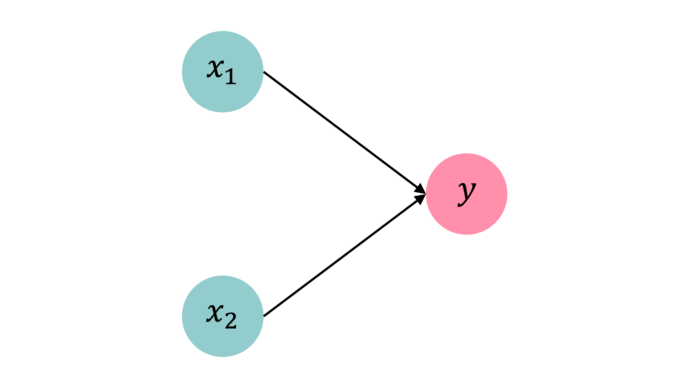
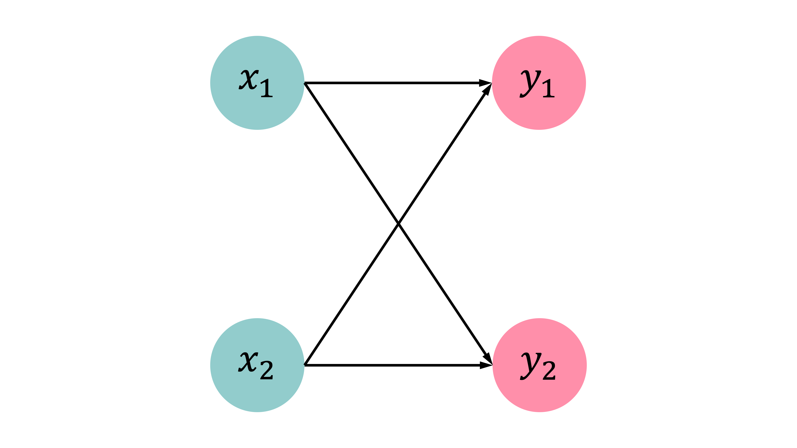

# Dense Layers in Matrices {data-visibility="uncounted"}

## Logistic regression

::: {.content-visible unless-format="revealjs"}
If we want to solve a binary classification problem, we can fit a logistic regression. We could say that a logistic regression is a neural network with no hidden layers and 1 neuron. $z_i$ is a linear combination of the covariates for observation $i$. The activation function is $\sigma(\cdot)$ which converts the $z_i$ to a value $y_i$ between 0 and 1, representing the probability of a positive outcome. 
The sigmoid activation function is the inverse logit function.



::: footer
Source: Melissa Renard (2025)
:::
:::

```{python}
#| echo: false
set_square_figures()
```

::: columns
::: column

Observations: $\mathbf{x}_{i,\bullet} \in \mathbb{R}^{2}$.

Target: $y_i \in \{0, 1\}$.

Predict: $\hat{y}_i = \mathbb{P}(Y_i = 1)$.

<br>

__The model__

For $\mathbf{x}_{i,\bullet} = (x_{i,1}, x_{i,2})$:
$$
z_i = x_{i,1} w_1 + x_{i,2} w_2 + b
$$

$$
\hat{y}_i = \sigma(z_i) = \frac{1}{1 + \mathrm{e}^{-z_i}} .
$$

:::
::: column

```{python}
x = np.linspace(-10, 10, 100)
y = 1/(1 + np.exp(-x))
plt.plot(x, y);
```
:::
:::

```{python}
#| echo: false
set_rectangular_figures()
```

## Multiple observations

::: {.content-visible unless-format="revealjs"}
When we have multiple observations, we can manually calculate the predicted values using the fitted weights and biases. 
:::

```{python}
data = pd.DataFrame({"x_1": [1, 3, 5], "x_2": [2, 4, 6], "y": [0, 1, 1]})
data
```

Let $w_1 = 1$, $w_2 = 2$ and $b = -10$.

```{python}
w_1 = 1; w_2 = 2; b = -10
data["x_1"] * w_1 + data["x_2"] * w_2 + b 
```

## Matrix notation

::: {.content-visible unless-format="revealjs"}
Now let's consider this in matrix notation. $\mathbf{X}$ is the matrix of covariates, $\mathbf{w}$ is the column vector of weights, $b$ is a constant and $\mathbf{z}$ is the output column vector before activation. Finally, $\mathbf{a}$ is the output column vector after applying the activation function. 
Note that: 

* $\text{number of columns in }\mathbf{X} = \text{number of rows in }\mathbf{w}$
* $\text{number of rows in }\mathbf{X} = \text{number of rows in }\mathbf{z}$
* $\text{number of rows in }\mathbf{z} = \text{number of rows in }\mathbf{a}$
:::

::: columns
::: column
Have $\mathbf{X} \in \mathbb{R}^{3 \times 2}$.

```{python}
X_df = data[["x_1", "x_2"]]
X = X_df.to_numpy()
X
```
:::
::: column
Let $\mathbf{w} = (w_1, w_2)^\top \in \mathbb{R}^{2 \times 1}$.

```{python}
w = np.array([[1], [2]])
w
```
:::
:::

$$
\mathbf{z} = \mathbf{X} \mathbf{w} + b , \quad \mathbf{a} = \sigma(\mathbf{z})
$$

::: columns
::: column
```{python}
z = X.dot(w) + b
z
```
:::
::: column
```{python}
1 / (1 + np.exp(-z))
```
:::
:::

## Using a softmax output

::: {.content-visible unless-format="revealjs"}
This time, our problem is still a logistic regression problem, but with a softmax output. There are 2 neurons, each representing the probability that the target is in either category. In the context of matrices, this means that the output is a vector rather than a single value. Separate weights and biases are fitted for each neuron. The activation function is no longer sigmoid, but _softmax_. The predictions are converted to _probability distributions_.



::: footer
Source: Melissa Renard (2025)
:::
:::

::: columns
::: column
Observations: $\mathbf{x}_{i,\bullet} \in \mathbb{R}^{2}$.
Predict: $\hat{y}_{i,j} = \mathbb{P}(Y_i = j)$.
:::
::: column
Target: $\mathbf{y}_{i,\bullet} \in \{(1, 0), (0, 1)\}$.
:::
:::

__The model__: For $\mathbf{x}_{i,\bullet} = (x_{i,1}, x_{i,2})$
$$
\begin{aligned}
z_{i,1} &= x_{i,1} w_{1,1} + x_{i,2} w_{2,1} + b_1 , \\
z_{i,2} &= x_{i,1} w_{1,2} + x_{i,2} w_{2,2} + b_2 .
\end{aligned}
$$

$$
\begin{aligned}
\hat{y}_{i,1} &= \text{Softmax}_1(\mathbf{z}_i) = \frac{\mathrm{e}^{z_{i,1}}}{\mathrm{e}^{z_{i,1}} + \mathrm{e}^{z_{i,2}}} , \\
\hat{y}_{i,2} &= \text{Softmax}_2(\mathbf{z}_i) = \frac{\mathrm{e}^{z_{i,2}}}{\mathrm{e}^{z_{i,1}} + \mathrm{e}^{z_{i,2}}} .
\end{aligned}
$$

## Multiple observations

::: columns
::: column
```{python}
#| echo: false
data = pd.DataFrame({
  "x_1": [1, 3, 5], "x_2": [2, 4, 6],
  "y_1": [1, 0, 0], "y_2": [0, 1, 1]})
```

```{python}
data
```
:::
::: column
Choose:

$w_{1,1} = 1$, $w_{2,1} = 2$,

$w_{1,2} = 3$, $w_{2,2} = 4$, and

$b_1 = -10$, $b_2 = -20$.

:::
:::

```{python}
w_11 = 1; w_21 = 2; b_1 = -10
w_12 = 3; w_22 = 4; b_2 = -20
data["x_1"] * w_11 + data["x_2"] * w_21 + b_1
```

## Matrix notation

::: columns
::: column
Have $\mathbf{X} \in \mathbb{R}^{3 \times 2}$.

```{python}
X
```
:::
::: column
$\mathbf{W}\in \mathbb{R}^{2\times2}$, $\mathbf{b}\in \mathbb{R}^{2}$

```{python}
W = np.array([[1, 3], [2, 4]])
b = np.array([-10, -20])
display(W); b
```
:::
:::

$$
  \mathbf{Z} = \mathbf{X} \mathbf{W} + \mathbf{b} , \quad \mathbf{A} = \text{Softmax}(\mathbf{Z}) .
$$

::: columns
::: column
```{python}
Z = X @ W + b
Z
```
:::
::: column
```{python}
np.exp(Z) / np.sum(np.exp(Z),
  axis=1, keepdims=True)
```
:::
:::
