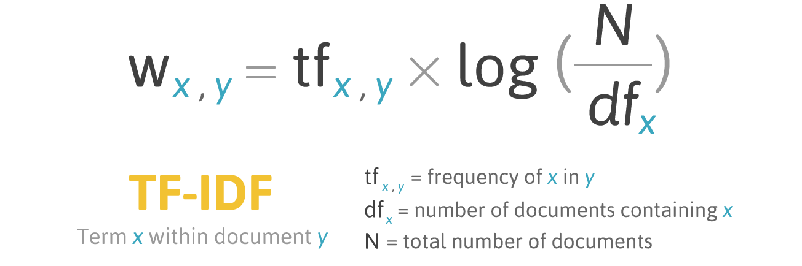

# Use a Continuous Representation {visibility="uncounted"}

## Term Frequency-Inverse Document Frequency

::: {.content-visible unless-format="revealjs"}
A flaw of BoW and bag of n-grams is that each word is weighted equally. For example, the word 'the' has the same weight as the word 'intersection', even though 'intersection' provides a lot more information.

_Term frequency-inverse document frequency_ measures the importance of a word across documents. It first computes the frequency of term _x_ in the document _y_ and weights it by a measure of how common it is. The intuition here is that, the more the word _x_ appears across documents, the less important it becomes.
:::



::: footer
Source: FiloTechnologia (2014), [A simple Java class for TF-IDF scoring](http://filotechnologia.blogspot.com/2014/01/a-simple-java-class-for-tfidf-scoring.html), Blog post.
:::


## Using TF-IDF vectorisation

::: {.content-visible unless-format="revealjs"}
Rather than the raw bag-of-words counts, we now weight each word by TF-IDF, so words that appear frequently across the police reports are given less importance. We keep the same number-of-vehicles target and the same train/validation/test split as before, swapping only the vectoriser.
:::

```{python}
vect = TfidfVectorizer(max_features=1_000, stop_words="english")
vect.fit(X_train["SUMMARY_EN"])

X_train_tfidf = vectorise_dataset(X_train, vect)
X_val_tfidf = vectorise_dataset(X_val, vect)
X_test_tfidf = vectorise_dataset(X_test, vect)

vocab = vect.get_feature_names_out()
print(list(vocab[:50]))
```

## The TF-IDF vectors

```{python}
vectorise_dataset(X_train, vect, dataframe=True)
```

## Feed TF-IDF into an ANN

```{python}
num_features = X_train_tfidf.shape[1]
tfidf_model = build_model(num_features, num_cats)
tfidf_model.summary()
```

## Fit & evaluate

```{python}
#| eval: false
es = EarlyStopping(patience=10, restore_best_weights=True,
    monitor="val_accuracy", verbose=2)
tfidf_model.fit(X_train_tfidf, y_train, epochs=1_000, callbacks=[es],
    validation_data=(X_val_tfidf, y_val), verbose=0)
```

```{python}
#| echo: false
# Train the model, or load it from the cache if we've already trained it.
es = EarlyStopping(patience=10, restore_best_weights=True,
    monitor="val_accuracy", verbose=2)
if not Path("models/tfidf-model.keras").exists():
    tfidf_model.fit(X_train_tfidf, y_train, epochs=1_000, callbacks=[es],
        validation_data=(X_val_tfidf, y_val), verbose=0)
    tfidf_model.save("models/tfidf-model.keras")
else:
    tfidf_model = keras.models.load_model("models/tfidf-model.keras")
```
```{python}
tfidf_model.evaluate(X_train_tfidf, y_train, verbose=0, batch_size=1_000)
```
```{python}
tfidf_model.evaluate(X_val_tfidf, y_val, verbose=0, batch_size=1_000)
```

```{python}
#| echo: false
_train_acc = tfidf_model.evaluate(X_train_tfidf, y_train, verbose=0, batch_size=1_000)[1]
_val_loss, _val_acc, _val_top2 = tfidf_model.evaluate(X_val_tfidf, y_val, verbose=0, batch_size=1_000)
model_results.append(("TF-IDF (top 1,000)", num_features,
    tfidf_model.count_params(), _train_acc, _val_acc, _val_loss, _val_top2))
```

## Comparing the models

Same dense network throughout --- only the **text representation** changes.

```{python}
#| echo: false
comparison = pd.DataFrame(
    model_results,
    columns=["Model", "Features", "Parameters",
        "Train accuracy", "Val. accuracy", "Val. loss", "Val. top-2"],
).sort_values(["Val. accuracy", "Val. loss"], ascending=[False, True])

comparison.style.hide(axis="index").format({
    "Features": "{:,.0f}",
    "Parameters": "{:,.0f}",
    "Train accuracy": "{:.1%}",
    "Val. accuracy": "{:.1%}",
    "Val. loss": "{:.3f}",
    "Val. top-2": "{:.1%}",
})
```

::: {.content-visible unless-format="revealjs"}
The models are sorted by validation accuracy (ties broken by validation loss). The lemmatised bag-of-words model matches the full-vocabulary model's accuracy with ~19&times; fewer features, and has the lowest validation loss.
:::
