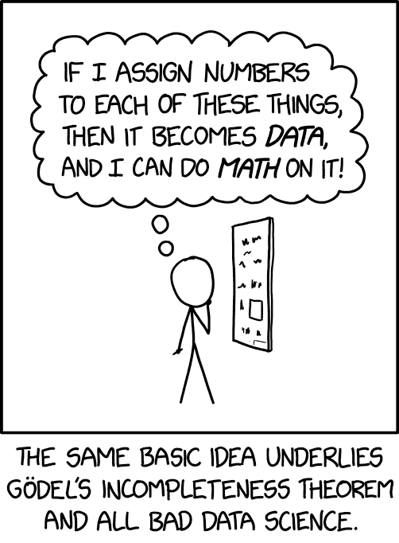
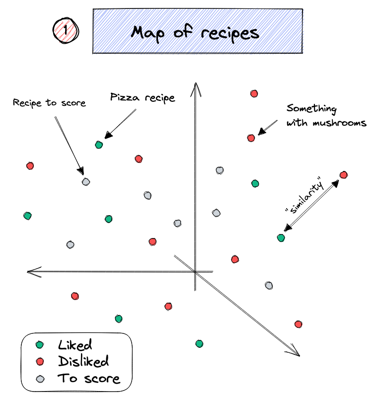
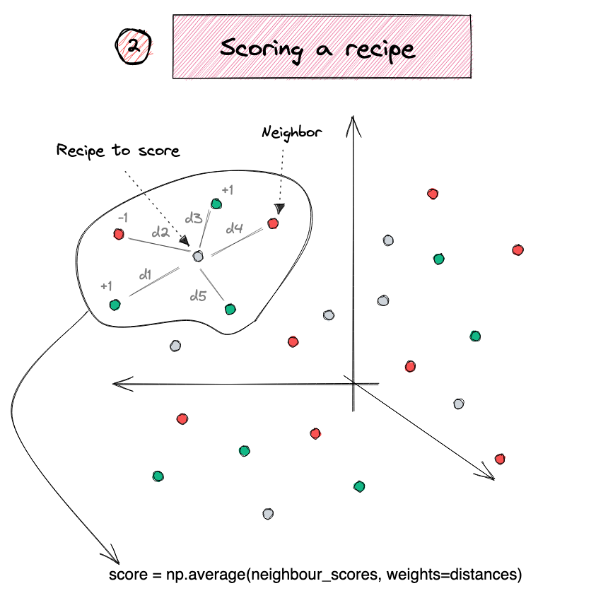

# Word Embeddings {visibility="uncounted"}

## Overview

::: {.notes}
In order for deep learning models to process language, we need to supply that language to the model in a way it can digest, i.e. a __quantitative representation__ such as a 2-D matrix of numerical values.
:::

::: columns
:::: {.column width="60%"}
Popular methods for converting text into numbers include:

- One-hot encoding
- Bag of words
- TF-IDF
- Word vectors (_transfer learning_)

::::
:::: {.column width="40%"}

::::
:::

::: footer
Source: Randall Munroe (2022), [xkcd #2610: Assigning Numbers](https://xkcd.com/2610/).
:::

## Word Vectors

- One-hot representations capture word 'existence' only, whereas word vectors capture information about word meaning as well as location.
- This enables deep learning NLP models to automatically learn linguistic features.
- **Word2Vec** & **GloVe** are popular algorithms for generating word embeddings (i.e. word vectors).

## Word Vectors II


::: {.content-visible unless-format="revealjs"}
Word vectors are a type of word embedding which can return numerical representations of words in a continuous vector space. Their representations capture semantic knowledge of the words. For example, we can see how words of the same gender are positioned closer to each other in a _n_-dimensional space. We also see that capital cities are near their countries, and countries that are geographically close are grouped together.
:::

::: {.notes}
- Overarching concept is to assign each word within a corpus to a particular, meaningful location within a multidimensional space called the vector space.
- Initially each word is assigned to a random location.
- BUT by considering the words that tend to be used around a given word within the corpus, the locations of the words shift. 
:::

::: footer
Bogacz (2023), [_Text Vectorization, an Introduction_](https://www.theinformationlab.nl/2023/03/22/an-introduction-to-embeddings/), The Information Lab.
:::

## Remember this diagram?


::: {.content-visible unless-format="revealjs"}
Embeddings are numerical representations of categorical data that were learned during the supervised learning process. However, numerical representations like **Word2Vec** & **GloVe** are popular algorithms for generating word embeddings that were trained by others, i.e. they are pre-trained.
:::

::: footer
Source: Marcus Lautier (2022) !!!CHECK WITH PL
:::

## Word2Vec

**Key idea**: You're known by the company you keep.

Two algorithms are used to calculate embeddings:

* _Continuous bag of words_: uses the context words to predict the target word
* _Skip-gram_: uses the target word to predict the context words

Predictions are made using a neural network with one hidden layer. Through backpropagation, we update a set of "weights" which become the word vectors.

::: footer
Paper: Mikolov et al. (2013), [_Efficient estimation of word representations in vector space_](https://arxiv.org/pdf/1301.3781.pdf), arXiv:1301.3781.
:::

## Word2Vec training methods


:::{.callout-tip}
## Suggested viewing

Computerphile (2019), [Vectoring Words (Word Embeddings)](https://youtu.be/gQddtTdmG_8), YouTube (16 mins).
:::

::: footer
Source: Amit Chaudhary (2020), [Self Supervised Representation Learning in NLP](https://amitness.com/2020/05/self-supervised-learning-nlp/).
:::

## The skip-gram network


::: footer
Source: Lilian Weng (2017), [Learning Word Embedding](https://lilianweng.github.io/posts/2017-10-15-word-embedding/), Blog post, Figure 1.
:::

## Word Vector Arithmetic

::: columns
::: column

Relationships between words becomes vector math.


::: {.notes}
- E.g., if we calculate the direction and distance between the coordinates of the words _Paris_ and _France_, and trace this direction and distance from _London_, we should be close to the word _England_.
:::

:::
::: column


](krohn_f02_08.jpeg)
:::
:::

::: footer
Sources: PressBooks, [College Physics: OpenStax](https://pressbooks.bccampus.ca/collegephysics/chapter/vector-addition-and-subtraction-graphical-methods/), Chapter 17 Figure 9, and Krohn (2019), _Deep Learning Illustrated_, Figures 2-7 & 2-8.
::: 

# Word Embeddings II {visibility="uncounted"}

## Pretrained word embeddings

GloVe (**Gl**obal **Ve**ctors) are pre-trained word embeddings from Stanford, trained on Wikipedia + Gigaword (6 billion tokens, ~400,000 word vocabulary).

```{python}
#| code-fold: true
#| code-summary: "GloVe loading code"
#| output: false
from pathlib import Path
from urllib.request import urlretrieve
import zipfile, numpy as np

_zip = Path("../data/glove.6B.zip")
if not _zip.exists():
    urlretrieve("https://downloads.cs.stanford.edu/nlp/data/glove.6B.zip", _zip)

words, _rows = [], []
with zipfile.ZipFile(_zip) as _zf:
    with _zf.open("glove.6B.300d.txt") as _f:
        for _line in _f:
            _parts = _line.split()
            words.append(_parts[0].decode("utf-8"))
            _rows.append(_parts[1:])

vectors = np.array(_rows, dtype=np.float32)
vectors /= np.linalg.norm(vectors, axis=1, keepdims=True)
word_to_index = {w: i for i, w in enumerate(words)}

def vec(word):
    return vectors[word_to_index[word]]

def similarity(a, b):
    return float(vec(a) @ vec(b))

def nearest(vector, n=10, exclude=()):
    v = vector / np.linalg.norm(vector)
    sims = vectors @ v
    results = []
    for i in np.argsort(-sims):
        w = words[i]
        if w not in exclude:
            results.append((w, float(sims[i])))
            if len(results) == n:
                break
    return results

def analogy(a, b, c, n=10):
    """a is to b as c is to ?   e.g. analogy("man", "king", "woman") → queen"""
    query = vec(b) - vec(a) + vec(c)
    return nearest(query, n=n, exclude={a, b, c})
```

```{python}
f"The size of the vocabulary is {len(words)}"
```

## Look up a word vector

```{python}
vec("pizza")
```

```{python}
len(vec("pizza"))
```

::: {.content-visible unless-format="revealjs"}
Each word is characterised by 300 numbers; a 300-dimensional vector.
:::

## Find nearby word vectors

::: {.content-visible unless-format="revealjs"}
We can find words similar to a given word, or compute the similarity between two words.
:::

```{python}
nearest(vec("python"))
```

```{python}
similarity("python", "java")
```

```{python}
similarity("python", "sport")
```

```{python}
similarity("python", "r")
```

## What does 'similarity' mean?

The 'similarity' scores
```{python}
similarity("sydney", "melbourne")
```

are normally based on cosine distance.
```{python}
x = vec("sydney")
y = vec("melbourne")
x.dot(y) / (np.linalg.norm(x) * np.linalg.norm(y))
```

```{python}
similarity("sydney", "aarhus")
```

## Weng's GoT Word2Vec

In the Game of Thrones (GoT) word embedding space, the top similar words to “king” and “queen” are:

::: columns
::: column
```python
model.most_similar("king")
```
```
('kings', 0.897245)	
('baratheon', 0.809675)	
('son', 0.763614)
('robert', 0.708522)
('lords', 0.698684)
('joffrey', 0.696455)
('prince', 0.695699)
('brother', 0.685239)
('aerys', 0.684527)
('stannis', 0.682932)
```
:::
::: column
```python
model.most_similar("queen")
```
```
('cersei', 0.942618)
('joffrey', 0.933756)
('margaery', 0.931099)
('sister', 0.928902)
('prince', 0.927364)
('uncle', 0.922507)
('varys', 0.918421)
('ned', 0.917492)
('melisandre', 0.915403)
('robb', 0.915272)
```
:::
:::

::: footer
Source: Lilian Weng (2017), [Learning Word Embedding](https://lilianweng.github.io/posts/2017-10-15-word-embedding/), Blog post.
:::

## Combining word vectors

You can summarise a sentence by averaging the individual word vectors.

```{python}
sv = (vec("melbourne") + vec("has") + vec("better") + vec("coffee")) / 4
len(sv), sv[:5]
```

> As it turns out, averaging word embeddings is a surprisingly effective way to create word embeddings. It’s not perfect (as you’ll see), but it does a strong job of capturing what you might perceive to be complex relationships between words.

::: footer
Source: Trask (2019), Grokking Deep Learning, Chapter 12.
:::

## Recipe recommender

::: columns
::: {.column width="49%"}

:::
::: {.column width="51%"}

:::
:::

::: footer
Source: Duarte O.Carmo (2022), [A recipe recommendation system](https://duarteocarmo.com/blog/scandinavia-food-python-recommendation-systems), Blog post.
:::

## Analogies with word vectors

Obama is to America as ___ is to Australia.

::: fragment
$$ \text{Obama} - \text{America} + \text{Australia} = ? $$
:::

::: fragment
```{python}
analogy("america", "obama", "australia")
```
:::

## Testing more associations 

```{python}
analogy("paris", "france", "london")
```

::: {.content-visible unless-format="revealjs"}
What country is to London like France is to Paris?

$$
\text{France} + \text{London} - \text{Paris} = ?
$$

France is a country whose capital city is Paris. If we remove Paris and add London (a city), we are looking for the country for which London is the capital city.
:::

## Quickly get to bad associations

```{python}
analogy("man", "king", "woman")
```

```{python}
analogy("man", "programmer", "woman")
```

::: {.content-visible unless-format="revealjs"}
What is the 'woman' version of a computer programmer? Seems a strange question to ask, and we get some even stranger responses...
:::

## Bias in NLP models {.smaller}

::: columns
::: column


The Verge (2016), [Twitter taught Microsoft's AI chatbot to be a racist a****** in less than a day](https://www.theverge.com/2016/3/24/11297050/tay-microsoft-chatbot-racist).
:::
::: column
> ... there are serious questions to answer, like how are we going to teach AI using public data without incorporating the worst traits of humanity? If we create bots that mirror their users, do we care if their users are human trash? There are plenty of examples of technology embodying — either accidentally or on purpose — the prejudices of society, and Tay's adventures on Twitter show that even big corporations like Microsoft forget to take any preventative measures against these problems.
:::
:::

## The `analogy` function cheats a little bit

```{python}
nearest(vec("programmer") - vec("man") + vec("woman"))
```

To get the 'nice' analogies, `analogy` ignores the input words as possible answers.

```{python}
#| eval: false
# ignore (don't return) keys from the input
if w not in exclude:
    results.append((w, float(sims[i])))
```