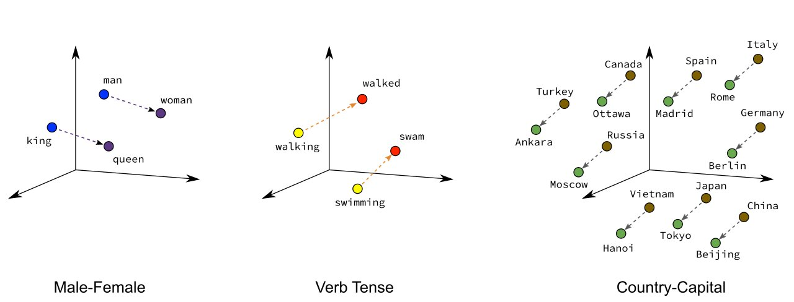
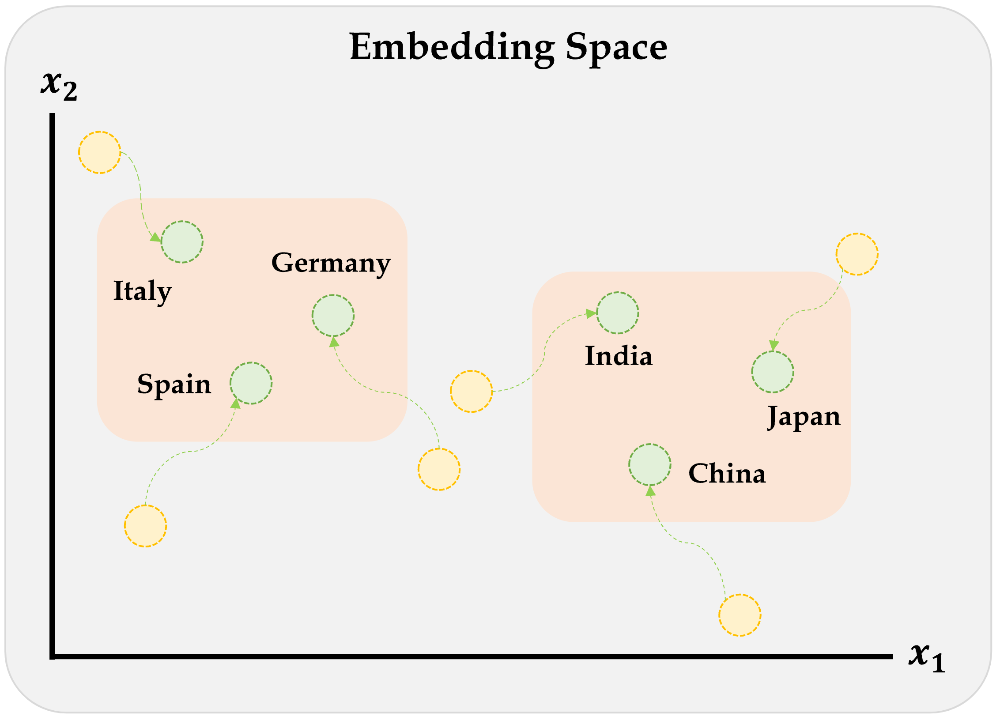
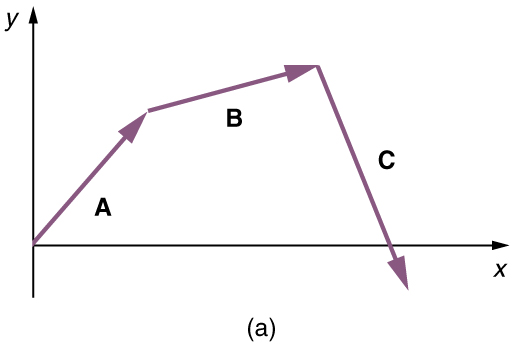
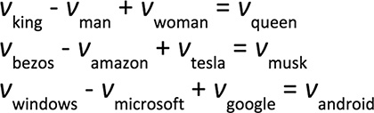

# Word Embeddings {visibility="uncounted"}

## Each column used to be a word

Both bag-of-words and TF-IDF give a **column for every word** in the vocabulary, so you can always read off what a number refers to:

| Representation | Values | What the "crash" column holds |
|:---|:---:|:---|
| **Bag of words** | integers $0, 1, 2, \dots$ | number of times "crash" appears |
| **TF-IDF** | continuous, $\ge 0$ | down-weighted count of "crash" |

TF-IDF made the numbers *continuous*, but each column still **means one specific word**.

::: {.content-visible unless-format="revealjs"}
These vectors are *sparse* (mostly zeros) and *long* (one entry per vocabulary word, often tens of thousands), but every column has a clear, human-readable meaning --- you can point at column 412 and say "that's the word _skid_".
:::

## Word embeddings: continuous but unlabelled

Word embeddings (Word2Vec, GloVe) are continuous too, but the resemblance stops there:

- the vector is **short & dense** --- e.g. 300 numbers, almost all non-zero;
- the columns are **learned dimensions**, not words.

So a word becomes something like

$$
\text{crash} \;\longrightarrow\; [\,0.07,\; -0.42,\; 0.31,\; \ldots,\; -0.05\,]
$$

and there is **no way to say what dimension 137 means**. The meaning is spread across the *whole* vector --- it lives in the directions and distances between words, not in any single column.

::: {.content-visible unless-format="revealjs"}
With bag-of-words or TF-IDF you could point at a column and name the word it counts. With an embedding you cannot: the individual axes are not interpretable. What *is* meaningful is the geometry of the space --- similar words sit close together, and consistent directions encode relationships. That geometry is exactly what makes the word arithmetic on the next slides possible.
:::

::: {.notes}
This is the key shift to land before introducing Word2Vec/GloVe: we move from a sparse, interpretable, one-column-per-word representation to a dense, *learned* representation where meaning is distributed across all the columns. Don't look for "the crash dimension" --- there isn't one.
:::

## Word Vectors

- One-hot representations capture word 'existence' only, whereas word vectors capture information about word meaning as well as location.
- This enables deep learning NLP models to automatically learn linguistic features.
- **Word2Vec** & **GloVe** are popular algorithms for generating word embeddings (i.e. word vectors).

## Word Vectors II



::: {.content-visible unless-format="revealjs"}
Word vectors are a type of word embedding which can return numerical representations of words in a continuous vector space. Their representations capture semantic knowledge of the words. For example, we can see how words of the same gender are positioned closer to each other in a _n_-dimensional space. We also see that capital cities are near their countries, and countries that are geographically close are grouped together.
:::

::: {.notes}
- Overarching concept is to assign each word within a corpus to a particular, meaningful location within a multidimensional space called the vector space.
- Initially each word is assigned to a random location.
- BUT by considering the words that tend to be used around a given word within the corpus, the locations of the words shift. 
:::

::: footer
Bogacz (2023), [_Text Vectorization, an Introduction_](https://www.theinformationlab.nl/2023/03/22/an-introduction-to-embeddings/), The Information Lab.
:::

## Illustration of the embeddings being learned



::: {.content-visible unless-format="revealjs"}
Embeddings are numerical representations of categorical data that were learned during the supervised learning process. However, numerical representations like **Word2Vec** & **GloVe** are popular algorithms for generating word embeddings that were trained by others, i.e. they are pre-trained.
:::

::: footer
Source: Marcus Lautier (2022).
:::

## Word2Vec

**Key idea**: You're known by the company you keep.

Two algorithms are used to calculate embeddings:

* _Continuous bag of words_: uses the context words to predict the target word
* _Skip-gram_: uses the target word to predict the context words

Predictions are made using a neural network with one hidden layer. Through backpropagation, we update a set of "weights" which become the word vectors.

::: footer
Paper: @mikolov2013efficient.
:::

## Word2Vec training methods


:::{.callout-tip}
## Suggested viewing

Computerphile (2019), [Vectoring Words (Word Embeddings)](https://youtu.be/gQddtTdmG_8), YouTube (16 mins).
:::

::: footer
Source: Amit Chaudhary (2020), [Self Supervised Representation Learning in NLP](https://amitness.com/2020/05/self-supervised-learning-nlp/).
:::

<!--
## The skip-gram network


::: footer
Source: Lilian Weng (2017), [Learning Word Embedding](https://lilianweng.github.io/posts/2017-10-15-word-embedding/), Blog post, Figure 1.
:::
-->


## Word Vector Arithmetic

::: columns
::: column

Relationships between words becomes vector math.



::: {.notes}
- E.g., if we calculate the direction and distance between the coordinates of the words _Paris_ and _France_, and trace this direction and distance from _London_, we should be close to the word _England_.
:::

:::
::: column


](images/krohn_f02_08.jpeg)
:::
:::

::: footer
Sources: PressBooks, [College Physics: OpenStax](https://pressbooks.bccampus.ca/collegephysics/chapter/vector-addition-and-subtraction-graphical-methods/), Chapter 17 Figure 9, and Krohn (2019), _Deep Learning Illustrated_, Figures 2-7 & 2-8.
::: 

# Demo of Word Embeddings {visibility="uncounted"}

## Pretrained word embeddings

GloVe (**Gl**obal **Ve**ctors) are pre-trained word embeddings from Stanford, trained on Wikipedia + Gigaword (6 billion tokens, ~400,000 word vocabulary).

```{python}
#| code-fold: true
#| code-summary: "GloVe loading code"
#| output: false
_zip = Path("data/glove.6B.zip")
if not _zip.exists():
    urlretrieve("https://downloads.cs.stanford.edu/nlp/data/glove.6B.zip", _zip)

words, _rows = [], []
with zipfile.ZipFile(_zip) as _zf:
    with _zf.open("glove.6B.300d.txt") as _f:
        for _line in _f:
            _parts = _line.split()
            words.append(_parts[0].decode("utf-8"))
            _rows.append(_parts[1:])

vectors = np.array(_rows, dtype=np.float32)
vectors /= np.linalg.norm(vectors, axis=1, keepdims=True)
word_to_index = {w: i for i, w in enumerate(words)}

def vec(word):
    return vectors[word_to_index[word]]

def similarity(a, b):
    return float(vec(a) @ vec(b))

def nearest(vector, n=10, exclude=()):
    v = vector / np.linalg.norm(vector)
    sims = vectors @ v
    results = []
    for i in np.argsort(-sims):
        w = words[i]
        if w not in exclude:
            results.append((w, float(sims[i])))
            if len(results) == n:
                break
    return results

def analogy(a, b, c, n=10):
    """a is to b as c is to ?   e.g. analogy("man", "king", "woman") → queen"""
    query = vec(b) - vec(a) + vec(c)
    return nearest(query, n=n, exclude={a, b, c})
```

```{python}
f"The size of the vocabulary is {len(words)}"
```

## Look up a word vector

```{python}
vec("pizza")
```

```{python}
len(vec("pizza"))
```

::: {.content-visible unless-format="revealjs"}
Each word is characterised by 300 numbers; a 300-dimensional vector.
:::

## Find nearby word vectors

::: {.content-visible unless-format="revealjs"}
We can find words similar to a given word, or compute the similarity between two words.
:::

```{python}
nearest(vec("python"))
```

```{python}
similarity("python", "java")
```

```{python}
similarity("python", "sport")
```

```{python}
similarity("python", "r")
```

## What does 'similarity' mean?

The 'similarity' scores
```{python}
similarity("sydney", "melbourne")
```

are normally based on cosine distance.
```{python}
x = vec("sydney")
y = vec("melbourne")
x.dot(y) / (np.linalg.norm(x) * np.linalg.norm(y))
```

```{python}
similarity("sydney", "aarhus")
```

## Weng's GoT Word2Vec

In the Game of Thrones (GoT) word embedding space, the top similar words to “king” and “queen” are:

::: columns
::: column
```python
model.most_similar("king")
```
```
('kings', 0.897245)	
('baratheon', 0.809675)	
('son', 0.763614)
('robert', 0.708522)
('lords', 0.698684)
('joffrey', 0.696455)
('prince', 0.695699)
('brother', 0.685239)
('aerys', 0.684527)
('stannis', 0.682932)
```
:::
::: column
```python
model.most_similar("queen")
```
```
('cersei', 0.942618)
('joffrey', 0.933756)
('margaery', 0.931099)
('sister', 0.928902)
('prince', 0.927364)
('uncle', 0.922507)
('varys', 0.918421)
('ned', 0.917492)
('melisandre', 0.915403)
('robb', 0.915272)
```
:::
:::

::: footer
Source: Lilian Weng (2017), [Learning Word Embedding](https://lilianweng.github.io/posts/2017-10-15-word-embedding/), Blog post.
:::

## Combining word vectors

You can summarise a sentence by averaging the individual word vectors.

```{python}
sv = (vec("melbourne") + vec("has") + vec("better") + vec("coffee")) / 4
len(sv), sv[:5]
```

> "As it turns out, averaging word embeddings is a surprisingly effective way to create word embeddings. It’s not perfect (as you’ll see), but it does a strong job of capturing what you might perceive to be complex relationships between words."
>
> ::: {style="text-align: right;"}
> — @trask2019grokking [ch. 12]
> :::

## Analogies with word vectors

::: columns
::: column

```{python}
analogy("paris", "france", "london")
```

::: {.content-visible unless-format="revealjs"}
What country is to London like France is to Paris?

$$
\text{France} + \text{London} - \text{Paris} = ?
$$

France is a country whose capital city is Paris. If we remove Paris and add London (a city), we are looking for the country for which London is the capital city.
:::

:::
::: column

```{python}
analogy("man", "king", "woman")
```

:::
:::

## The embeddings learn biases from the training data {.smaller}


The same arithmetic exposes biases baked into the training corpus. Famously, @bolukbasi2016man found that a word2vec embedding trained on Google News answered _"man is to computer programmer as woman is to ?"_ with **homemaker**:

The most extreme occupations along the _she–he_ direction, and analogies the embedding generates automatically:

::: columns
::: column
**Extreme "she" occupations**

homemaker, nurse, receptionist, librarian, socialite, hairdresser, nanny, bookkeeper, stylist, housekeeper

**Extreme "he" occupations**

maestro, skipper, protégé, philosopher, captain, architect, financier, warrior, broadcaster, magician
:::
::: column
**Gender-stereotype _she–he_ analogies**

sewing–carpentry, registered nurse–physician, housewife–shopkeeper, nurse–surgeon, interior designer–architect, softball–baseball, blond–burly, feminism–conservatism, cosmetics–pharmaceuticals, giggle–chuckle, vocalist–guitarist, petite–lanky, sassy–snappy, diva–superstar, charming–affable, volleyball–football, cupcakes–pizzas, lovely–brilliant
:::
:::

::: footer
Source: @bolukbasi2016man, Figure 1.
:::

# Recap {visibility="uncounted"}

## The vectorisation toolkit

Every method turns text into numbers; they differ on **what** becomes a vector --- a single word or a whole document --- and **how** that vector looks (sparse vs dense):

|  | One **word** $\to$ vector | One **document** $\to$ vector |
|:--|:--:|:--:|
| **Sparse** <br> <small>length \|V\|, one column per word</small> | one-hot encoding | bag of words, TF-IDF |
| **Dense** <br> <small>short, learned dimensions</small> | word embeddings | averaged word embeddings |

- **Sparse** vectors have one *interpretable* column per vocabulary word; **dense** embeddings are short and their columns are uninterpretable learned dimensions.
- A **document** vector is just its word vectors *pooled*: sum the one-hots for bag of words; average the embeddings for a sentence vector.
- Because embeddings are word-level, representing a whole document needs an extra step --- averaging them, or feeding the sequence into an RNN.

::: {.content-visible unless-format="revealjs"}
This pulls together the whole lecture. The **columns** of the table are about *granularity*: one-hot encoding and word embeddings each describe a single word, whereas bag of words and TF-IDF describe a whole document. The **rows** are about *form*: the sparse methods live in a space with one column per vocabulary word (often tens of thousands of mostly-zero entries), while dense embeddings use short vectors --- e.g. 300 numbers --- whose individual columns have no human-readable meaning. The bottom-right cell, averaging word embeddings, and the RNNs of the next section both exist to bridge the gap from word-level vectors to a single document-level representation.
:::
