```{python}
#| echo: false
#| warning: false
from setup import *

keras.utils.set_random_seed(812)
```


# Artificial Intelligence {data-visibility="uncounted"}

## Different goals of AI

Artificial intelligence describes an agent which is capable of:

```{=html}
<style>
.quad table { border-collapse: collapse !important; border: none !important; box-shadow: none !important; }
.quad tr { background: none !important; }
.quad td { border: 1px solid currentColor !important; background: none !important;
           text-align: center !important; padding: 0.4em 1em !important; }
</style>
```

::: {.quad}

----------------  -------------------
Thinking humanly  Thinking rationally
Acting humanly    Acting rationally
----------------  -------------------

:::


::: fragment

<br>

Put another way, what fields are most important to AI?
:::

::: fragment

::: {.quad}

---------------------------       ----------------------------------
Cognitive science, psychology      Mathematics, logic and inference
HCI, linguistics and robotics      Computer science, statistics
---------------------------       ----------------------------------

:::

:::

::: fragment

<br>

- Actions are simpler to work with than thought: How do humans even think?
- Acting humanly can be done without intelligence, see ChatGPT
- The focus on actions: delivers results, but in a black-box manner

:::

## The rational behaviour paradigm won out

::: columns
::: {.column width="65%"}
> "For these reasons, the rational-agent approach to AI has prevailed throughout most of
> the field’s history. In the early decades, rational agents were built on logical foundations
> and formed definite plans to achieve specific goals. Later, methods based on probability
> theory and machine learning allowed the creation of agents that could make decisions under
> I uncertainty to attain the best expected outcome.
> In a nutshell, _AI has focused on the study and construction of agents that **do the right thing**_."
>
> ::: {style="text-align: right;"}
> — @russell2021artificial [p. 22]
> :::
:::
::: {.column width="35%"}
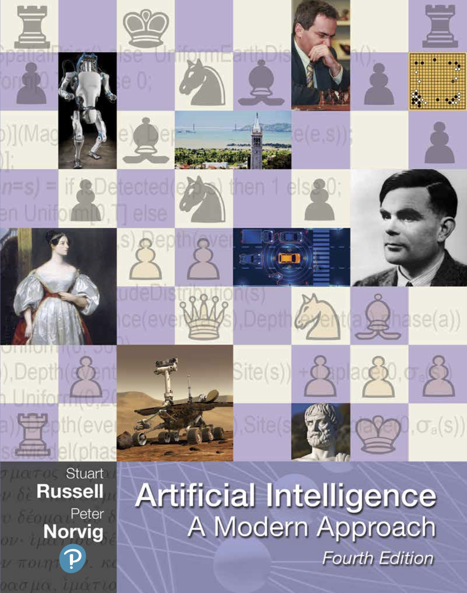
:::
:::

::: fragment
**Question**: When do you think the term "machine learning" was first coined?
:::

## Shakey the Robot (~1966 -- 1972)

::: {.columns}
::: {.column width="30%"}
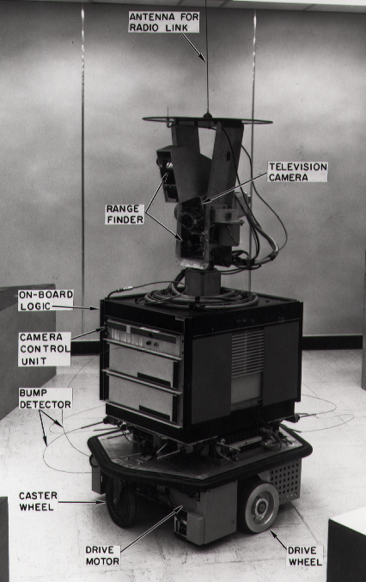

:::
::: {.column width="70%"}

<center>




</center>

:::
:::

::: footer
Source: Wikipedia page for the [Shakey Project](https://en.wikipedia.org/wiki/File:SRI_Shakey_with_callouts.jpg) and for the [A* search algorithm](https://en.wikipedia.org/wiki/A*_search_algorithm).
:::

<!--
## Route-finding II

, GDC 2024](images/zelda-slide.png)
-->


<!--

## Evaluating a chess game I

Who's winning this game?

::: {.content-visible unless-format="revealjs"}
How do we determine who is winning this game of chess just by looking at the board at its current state? We can give each player a score based on how many of their pieces remain, and the relative value of each piece. Pawns would be given lower weight, and the queen would be given a higher weight. 
:::

::: columns
::: {.column width="50%"}

::: figure
```{python}
#| echo: false
import chess
board = chess.Board("2r3k1/p3bp1p/2Bp1np1/4p3/1r6/B1R5/P1PP1P1P/R5K1 b - - 0 1")
board
```
:::

:::
::: {.column width="50%"}

::: fragment

```{python}
#| echo: false
from IPython.display import HTML

PIECES = ["P", "N", "B", "R", "Q", "K"]
STANDARD_PIECE_VALUES = {"P": 1, "N": 3, "B": 3, "R": 5, "Q": 9, "K": 0}


def count_piece(board, piece, white=True):
    count = 0
    for square in chess.SQUARES:
        p = board.piece_at(square)
        if p and p.symbol() == piece:
            count += 1
    return count


table = "<table><tbody>"

total = 0
vals = []

for piece in PIECES:
    table += "<tr>"

    svg = chess.svg.piece(chess.Piece.from_symbol(piece), size="50px")
    numPiece = count_piece(board, piece)
    valPiece = STANDARD_PIECE_VALUES[piece]
    total += numPiece * valPiece
    if numPiece * valPiece > 0:
        vals.append(str(numPiece * valPiece))
    table += f'<td style="text-align: center">{svg}</td>'
    table += f'<td style="text-align: center">{numPiece} &times {valPiece} = {numPiece * valPiece}</td>'
    table += "</tr>"

table += "<tr>"
table += f'<td style="text-align: center">White</td>'
# table += f'<td style="text-align: center">{" + ".join(vals)} = {total}</td>'
table += f'<td style="text-align: center">{total}</td>'
table += "</tr>"

table += "</tbody></table>"

HTML(table)
```

:::

:::
:::

##  Evaluating a chess game II

Just add up the pieces for each player.

::: columns
::: {.column width="50%"}

::: figure
```{python}
#| echo: false
board
```
:::

:::
::: {.column width="50%"}
```{python}
#| echo: false
def count_piece(board, piece, white=True):
    count = 0
    for square in chess.SQUARES:
        p = board.piece_at(square)
        if p and p.symbol() == piece:
            count += 1
    return count


table = "<table><tbody>"

total = 0
vals = []

for piece in PIECES:
    table += "<tr>"

    piece = piece.lower()
    svg = chess.svg.piece(chess.Piece.from_symbol(piece), size="50px")
    numPiece = count_piece(board, piece)
    valPiece = STANDARD_PIECE_VALUES[piece.upper()]
    total += numPiece * valPiece
    if numPiece * valPiece > 0:
        vals.append(str(numPiece * valPiece))
    table += f'<td style="text-align: center">{svg}</td>'
    table += f'<td style="text-align: center">{numPiece} &times {valPiece} = {numPiece * valPiece}</td>'
    table += "</tr>"

table += "<tr>"
table += f'<td style="text-align: center">Black</td>'
# table += f'<td style="text-align: center">{" + ".join(vals)} = {total}</td>'
table += f'<td style="text-align: center">{total}</td>'
table += "</tr>"

table += "</tbody></table>"

HTML(table)
```

:::
:::

::: fragment
Overall: 21 &minus; 22 = &minus;1.
:::

-->

## The minimax algorithm

::: columns
::: column
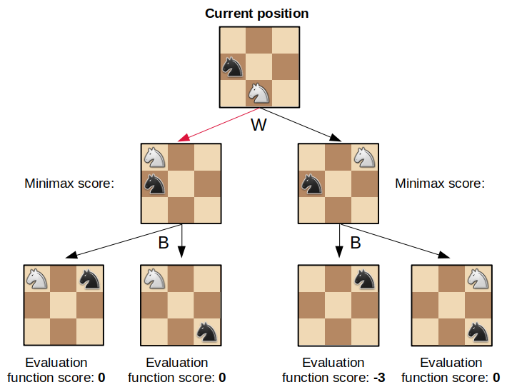
:::
::: column
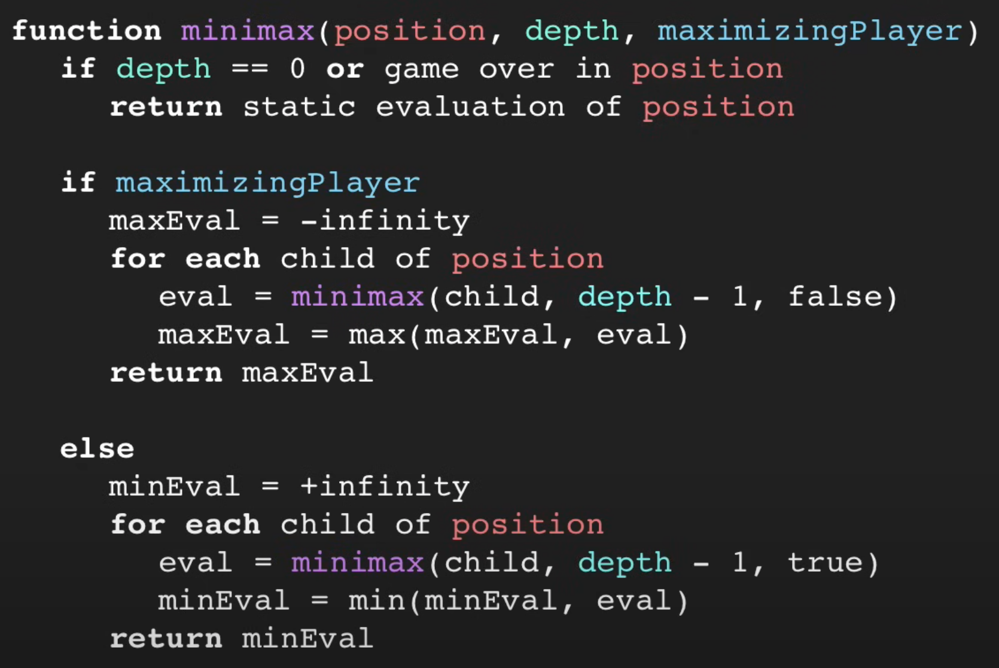
:::
:::

::: {.content-visible unless-format="revealjs"}
How many moves ahead do you want to think? In this example, the player is thinking two moves ahead.

Reminders about the minimax algorithm:

* Assume all players are rational.
* You want to maximise your score while your opponent wants to minimise it.
* To solve the minimax problem, move backwards from the leaves of the minimax tree.
:::


::: footer
Source: codeRtime, [Programming a simple minimax chess engine in R](https://www.codertime.org/minimax-chess-engine-programming-r/), and Sebastian Lague (2018), [Algorithms Explained – minimax and alpha-beta pruning](https://youtu.be/l-hh51ncgDI).
:::

## Chess

Deep Blue (1997)

::: {.content-visible unless-format="revealjs"}
In 1997, Gary Kasparov played chess against an AI called Deep Blue. Kasparov lost.
:::

::: columns
::: {.column width="68%"}
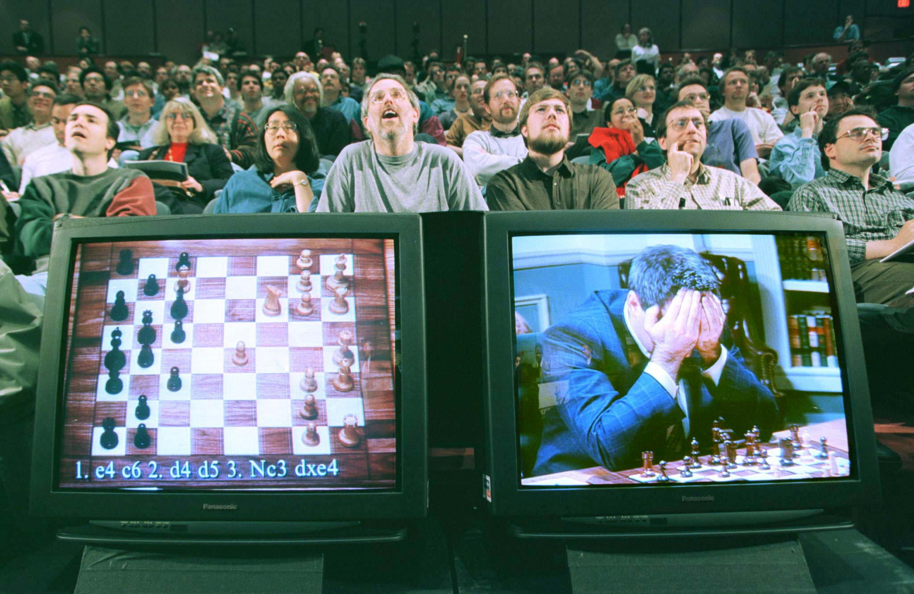
:::
::: {.column width="28%"}
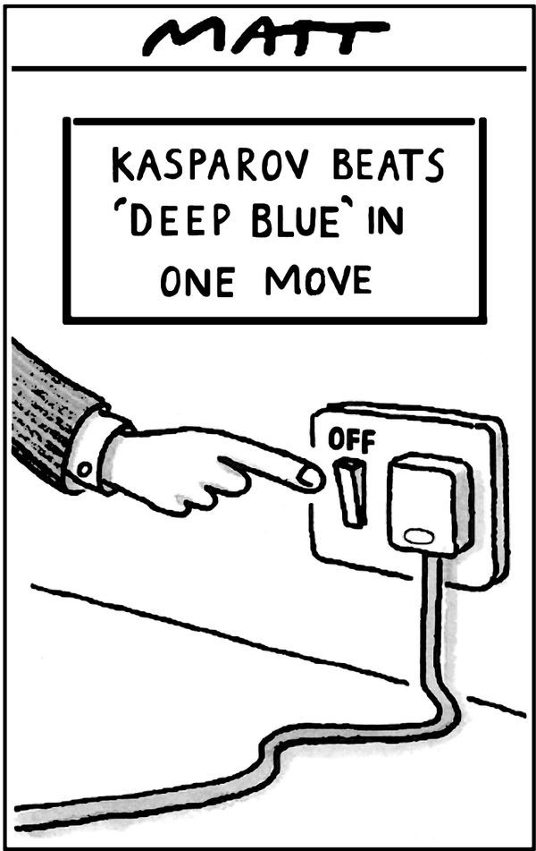
:::
:::

::: footer
Sources: Mark Robert Anderson (2017), [Twenty years on from Deep Blue vs Kasparov](https://theconversation.com/twenty-years-on-from-deep-blue-vs-kasparov-how-a-chess-match-started-the-big-data-revolution-76882), The Conversation article, and [Computer History Museum](https://www.computerhistory.org/chess/stl-431e1a079ea63/).
:::


## Machine Learning

::: columns 
::: {.column width="50%"}

Tried *making a computer smart*, too hard!

Make a computer that can **learn** to be smart.

> "[Machine Learning is the] field of study that gives computers the ability to learn without being explicitly programmed"
>
> ::: {style="text-align: right;"}
> — @samuel1959checkers
> :::

AI eventually become dominated by one approach, called _machine learning_, which itself is now dominated by _deep learning_ (neural networks).

You can study a 12 week course on AI and never touch on machine learning...

:::
::: {.column width="50%"}

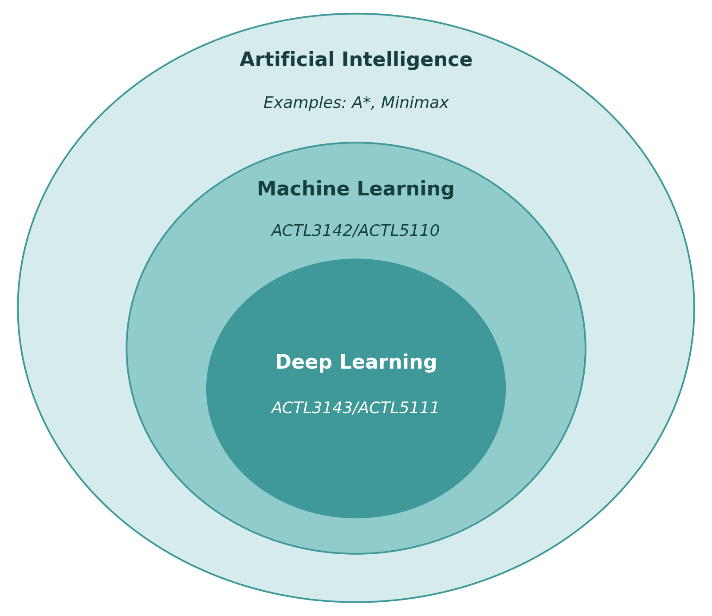

:::
:::

<!--
## Traditional AI versus ML

<br>

::: columns
::: column

:::
::: column

:::
:::

:::footer
Source: Aurélien Géron (2019), _Hands-On Machine Learning with Scikit-Learn, Keras, and TensorFlow_, 2nd Edition, Figures 1-1 and 1-2.
:::

## Benefits of ML

<br>

::: columns
::: {.column .aligned-column}

:::
::: {.column .aligned-column}

::::
:::

:::footer
Source: Aurélien Géron (2019), _Hands-On Machine Learning with Scikit-Learn, Keras, and TensorFlow_, 2nd Edition, Figures 1-3 and 1-4.
:::
-->

# Deep Learning Successes {data-visibility="uncounted"}

## Image Classification I

::: columns
::: {.column width="35%"}
What is this?

:::
::: {.column width="10%"}
:::
::: column
Options:

```{=html}
<ol type="1">
<li><span title="1.10%">punching bag</span></li>
<li><span title="11.87%">goblet</span></li>
<li><span title="0.71%">red wine</span></li>
<li><span title="1.21%">hourglass</span></li>
<li><span title="31.25%">balloon</span></li>
</ol>
```

::: {.content-visible unless-format="revealjs"}
::: {.callout-note}
Hover over the options to see AI's prediction (i.e. the probability of the photo being in that category).
:::
:::

:::
:::

::: footer
Source: [Wikipedia](https://en.wikipedia.org/wiki/Balloon#/media/File:Congrats_bqt.jpg)
:::

## Image Classification II {data-visibility="uncounted"}

::: columns
::: column
What is this?


:::
::: column
Options:

```{=html}
<ol type="1">
<li><span title="0.11%">sea urchin</span></li>
<li><span title="0.71%">porcupine</span></li>
<li><span title="41.32%">echidna</span></li>
<li><span title="0.24%">platypus</span></li>
<li><span title="0.11%">quill</span></li>
</ol>
```
:::
:::

::: footer
Source: [Wikipedia](https://en.wikipedia.org/wiki/Echidna#/media/File:Short-beaked_echidna_in_ANBG.jpg)
:::

## Image Classification III {data-visibility="uncounted"}

::: columns
::: column
What is this?

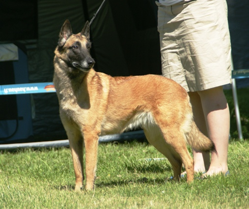
:::
::: column
Options:

```{=html}
<ol type="1">
<li><span title="0.72%">dingo</span></li>
<li><span title="50.70%">malinois</span></li>
<li><span title="1.18%">German shepherd</span></li>
<li><span title="0.37%">muzzle</span></li>
<li><span title="2.24%">kelpie</span></li>
</ol>
```
:::
:::

::: footer
Source: [Wikipedia](https://en.wikipedia.org/wiki/File:Malinois_Shepherd3.JPG)
:::

## ImageNet Challenge (2012)

[ImageNet](https://www.image-net.org/index.php) and the _ImageNet Large Scale Visual Recognition Challenge (ILSVRC)_; originally [1,000 synsets](https://image-net.org/challenges/LSVRC/2014/browse-synsets).

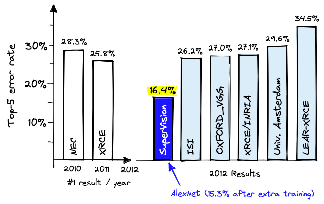

::: {.content-visible unless-format="revealjs"}
Note:

* 'Top-5': The top 5 categories that the NN thought the image was
* 'Top-5 error rate': The proportion of times that the correct answer is *not* in the top 5 guesses 
:::

::: footer
Source: James Briggs & Laura Carnevali, [_AlexNet and ImageNet: The Birth of Deep Learning_](https://www.pinecone.io/learn/series/image-search/imagenet/), Embedding Methods for Image Search, Pinecone Blog
:::

<!-- 
## How were the images labelled? {.smaller}

::: columns
::: column
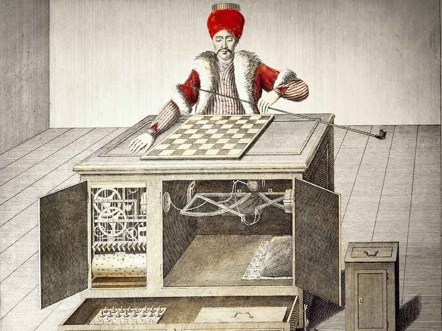
:::
::: column
> "Two years later, the first version of ImageNet was released with 12 million images structured and labeled in line with the WordNet ontology. If one person had annotated one image/minute and did nothing else in those two years (including sleeping or eating), it would have taken 22 years and 10 months.
>
> To do this in under two years, Li turned to Amazon Mechanical Turk, a crowdsourcing platform where anyone can hire people from around the globe to perform tasks cost-effectively."
:::
:::

::: footer
Sources: Editors of Encyclopaedia Britannica, [The Mechanical Turk: AI Marvel or Parlor Trick?](https://www.britannica.com/story/the-mechanical-turk-ai-marvel-or-parlor-trick), and <br>
James Briggs & Laura Carnevali, [_AlexNet and ImageNet: The Birth of Deep Learning_](https://www.pinecone.io/learn/series/image-search/imagenet/), Embedding Methods for Image Search, Pinecone Blog
:::
-->

## Needed a graphics card

::: columns
::: column
A graphics processing unit (GPU)

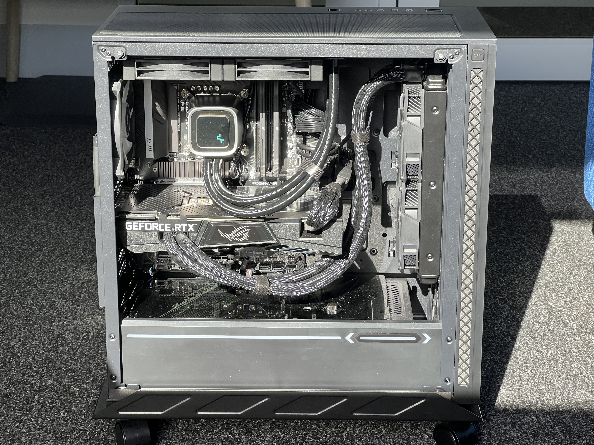

:::
::: column

> "**4.2. Training on multiple GPUs**
> A single GTX 580 GPU has only 3GB of memory, which limits the maximum size of the networks that can be trained on it. It turns out that 1.2 million training examples are enough to train networks which are too big to fit on one GPU. Therefore we spread the net across two GPUs."
>
> ::: {style="text-align: right;"}
> — @krizhevsky2012imagenet
> :::

:::
:::

## Lee Sedol plays AlphaGo (2016)

Deep Blue was a win for AI, AlphaGo a win for DL.

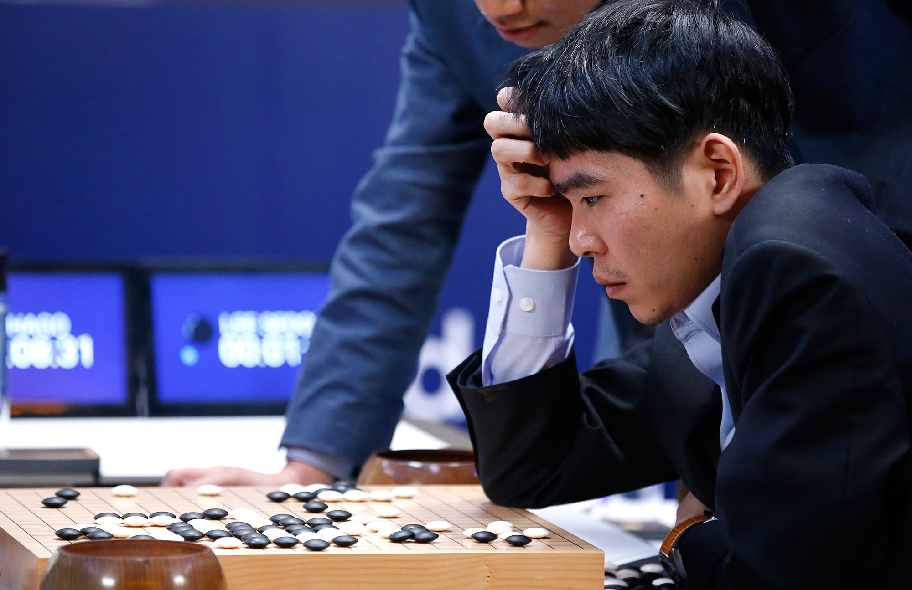 

I highly recommend [this documentary about the event](https://youtu.be/WXuK6gekU1Y).

::: footer
Source: Patrick House (2016), [AlphaGo, Lee Sedol, and the Reassuring Future of Humans and Machines](https://www.newyorker.com/tech/annals-of-technology/alphago-lee-sedol-and-the-reassuring-future-of-humans-and-machines), New Yorker article.
:::

## Generative Adversarial Networks (2014)

[https://thispersondoesnotexist.com/](https://thispersondoesnotexist.com/)

::: columns
::: column
{width="90%"}
:::
::: column
{width="90%"}
:::
:::

::: footer
Source: @goodfellow2014generative.
:::

## Diffusion models (2020)

::: columns
::: column
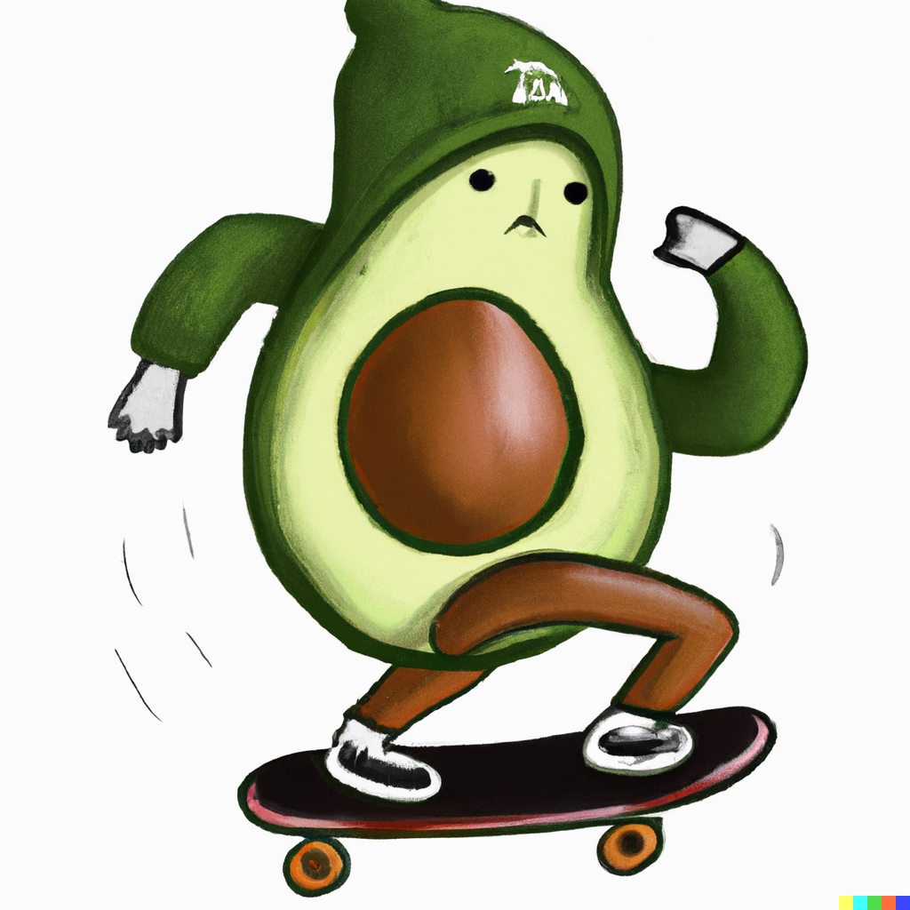
:::
::: column

:::
:::

::: footer
Source: @ho2020denoising. Images generated with Dall-E 2, prompts by ACTL3143 students in 2022.
:::

## ChatGPT (2022)

::: columns
::: {.column width="55%"}
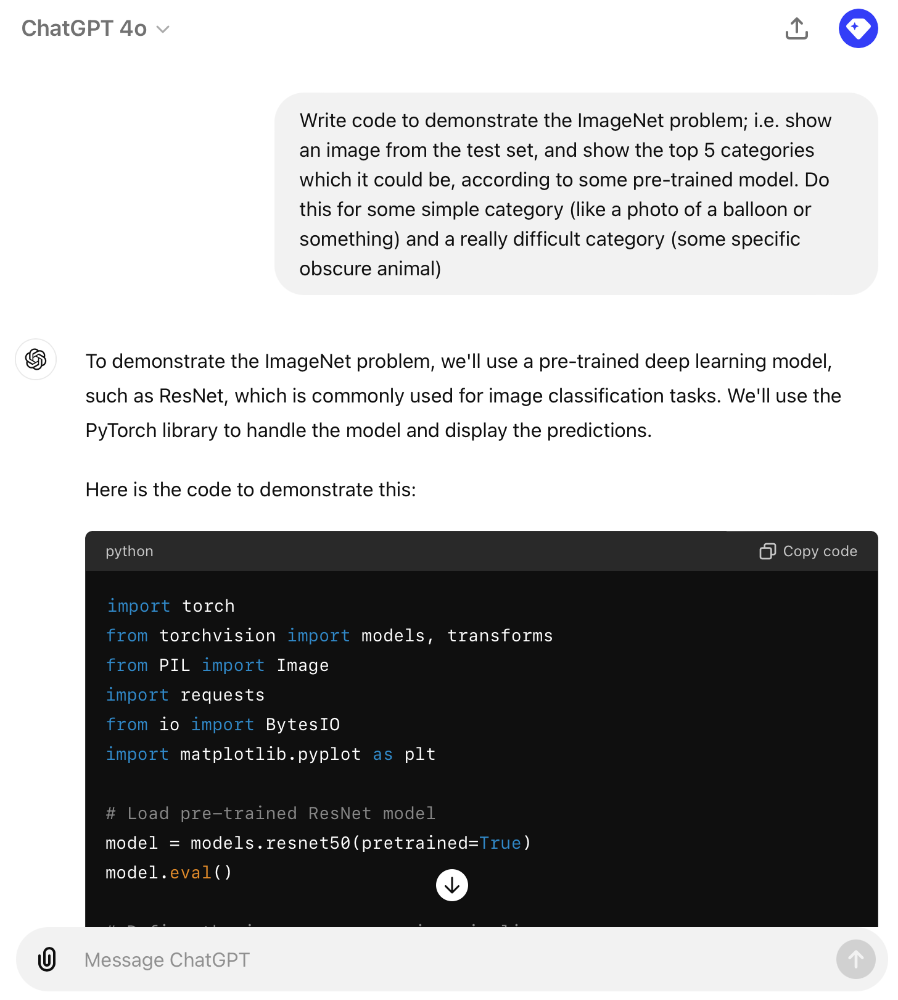{width="80%"}
:::
::: {.column width="45%"}
Test ChatGPT's ability to:

- generate images
- translate code
- explain code
- run code
- analyse a dataset
- critique code
- critique writing
- voice chat with you

Compare to Copilot.

:::
:::

## GitHub Copilot (2022)

::: {.content-hidden unless-format="revealjs"}

<center>



</center>

:::
::: {.content-visible unless-format="revealjs"}

:::

You can get extra usage for free with [GitHub Education for Students](https://github.com/edu/students)

::: footer
Source: [GitHub Blog](https://github.blog/2022-09-08-github-copilot-now-available-for-teachers/)
:::

## Reasoning models (2024)

Reasoning is basically automating the old trick of adding "do this step-by-step" to your prompts.

::: columns
::: {.column width="40%"}

:::
::: {.column width="60%"}

:::
:::

<!-- 
## First example: finding a deep mathematical error

- Worked on a paper since 2024
- 4 authors (me, 2 Assoc. Prof., and a Prof.) who are world experts in the field
- Working on the resubmission, doing final edits
- ChatGPT Pro, basically asked to proofread the LaTeX, finds an obscure mathematical error in the stochastic process that we had invented
- None of the seven PhDs who read the document had seen the issue (4 authors, 2 reviewers, 1 editor)
-->


## Using the larger language models

::: columns
::: {.column width="45%"}
- Zoom out as far as possible
- Give it as much relevant context as possible
- Better if it's easy to ingest (LaTeX or Python/R code), otherwise it has to convert to text
- A simple instruction in the prompt is enough
- Context sizes for the top models have become quite long
- I've had the best results when it reasons for **20--30 minutes**; then I review each potential issue it finds.
:::
::: {.column width="55%"}
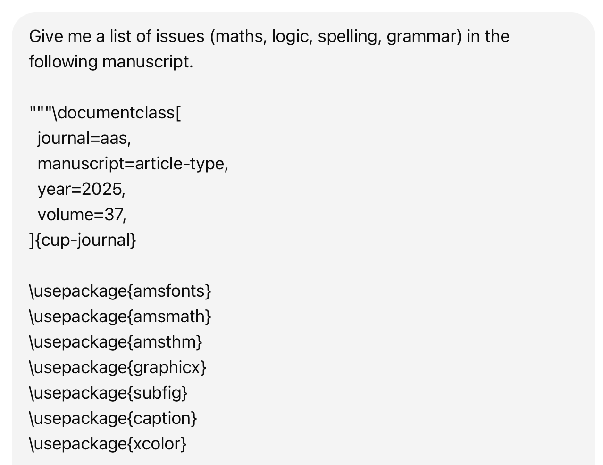
:::
:::

## Claude Code (2025)

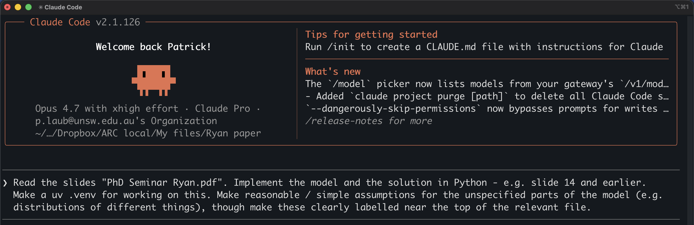

To get an introduction to using the terminal, check [this recording](https://youtu.be/h9czfvuBeRg).

# Types of Machine Learning Tasks {data-visibility="uncounted"}

## Predictive versus generative

We focus on predictive not generative AI in this course.

Our school has two new courses starting in 2026:

- **ACTL4307** "Generative AI for Actuaries"
- **ACTL4306** "Quantitative Ethical AI for Risk & Actuarial Applications"

<br>

This course focuses on **neural networks for supervised learning**, and these techniques are the fundamental building blocks for all the others parts of modern AI.

## A taxonomy of problems

::: columns
::: {.column width="70%"}
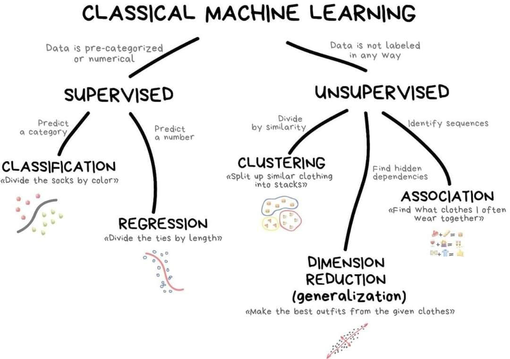
:::
::: {.column width="30%"}
New ones:

- Reinforcement learning
- Semi-supervised learning
- Active learning

:::
:::

::: footer
Source: Kaggle, [Getting Started](https://www.kaggle.com/getting-started/169622).
:::

## Examples of supervised learning

Regression:

- Given policy $\hookrightarrow$ predict the rate of claims.
- Given policy $\hookrightarrow$ predict claim severity.
- Given a reserving triangle $\hookrightarrow$ predict future claims.

Classification:

- Given a claim $\hookrightarrow$ classify as fraudulent or not.
- Given a customer $\hookrightarrow$ predict customer retention patterns.

## Supervised learning: mathematically

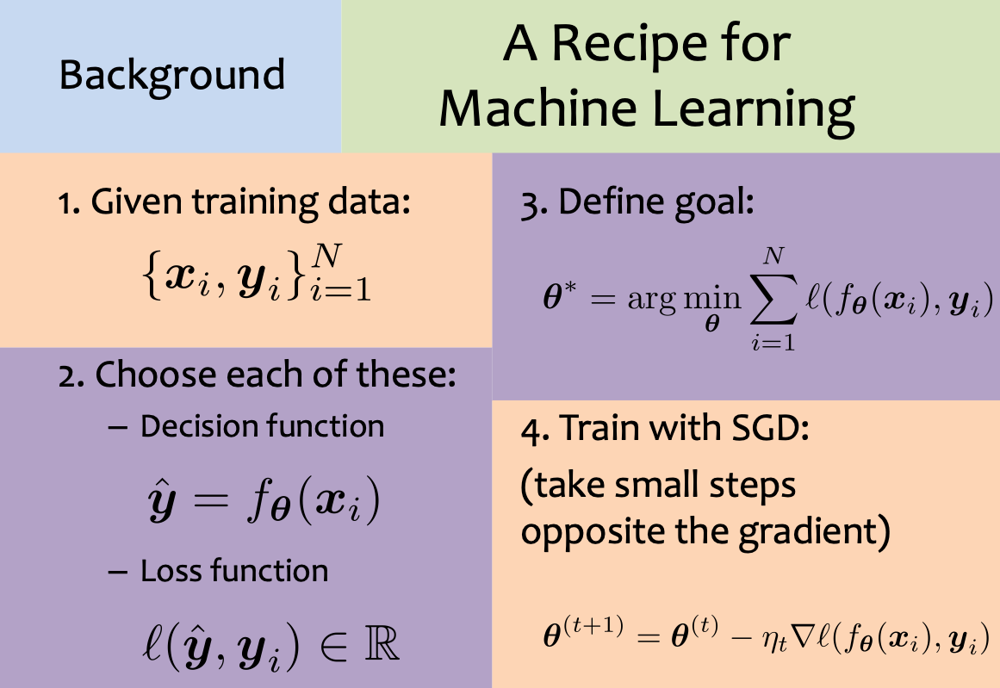

::: footer
Source: Matthew Gormley (2021), [Introduction to Machine Learning Lecture Slides](https://www.cs.cmu.edu/~mgormley/courses/10601-s17/slides/lecture20-backprop.pdf), Slide 67.
:::

## Self-supervised learning

::: {.content-visible unless-format="revealjs"}
Self-supervised learning is a machine learning technique that trains models using unlabelled data by automatically creating supervisory signals from the data itself.
:::

Data which 'labels itself'. Example: language model.

<center>
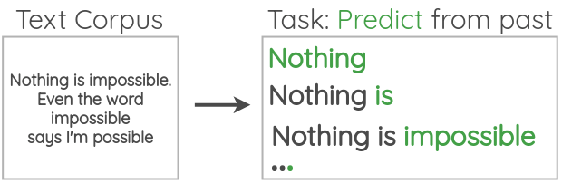
</center>

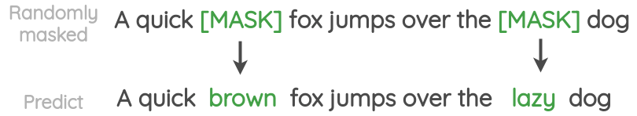


::: footer
Source: Amit Chaudhary (2020), [Self Supervised Representation Learning in NLP](https://amitness.com/2020/05/self-supervised-learning-nlp/).
:::

## Example: image super-resolution

::: columns
::: {.column width="50%"}
{width="80%"}
:::
::: {.column width="50%"}
{width="80%"}
:::
:::

Other examples: image inpainting, denoising images.

::: footer
Test image: Eileen Collins (NASA, public domain).
:::

## Example: Deoldify images


:::footer
Source: [Deoldify package](https://github.com/jantic/DeOldify).
:::

# Neural Networks {data-visibility="uncounted"}

## How do real neurons work?

::: {.content-hidden unless-format="revealjs"}

:::
::: {.content-visible unless-format="revealjs"}

:::

## A neuron 'firing'

::: {.content-visible unless-format="revealjs"}
Similar to a biological neuron, an artificial neuron 'fires' when the combined input information exceeds a certain threshold. This activation can be seen as a step function. The difference is that the artificial neuron uses mathematical rules (e.g. weighted sum) to 'fire' whereas 'firing' in the biological neurons is far more complex and dynamic.
:::

```{python}
#| echo: false
import numpy as np

x = [-5, -1e-10, 0, 5]
y = [x_i >= 0 for x_i in x]

plt.plot(x, y)

# Annotate the top-left corner of the plot with the name
# of the activation function
plt.annotate(
    "Step function",
    xy=(0.2, 1),
    xycoords="axes fraction",
    xytext=(-5, -5),
    textcoords="offset points",
    ha="left",
    va="top",
)

plt.xlabel("Input")
plt.ylabel("Output");
```

## An artificial neuron 

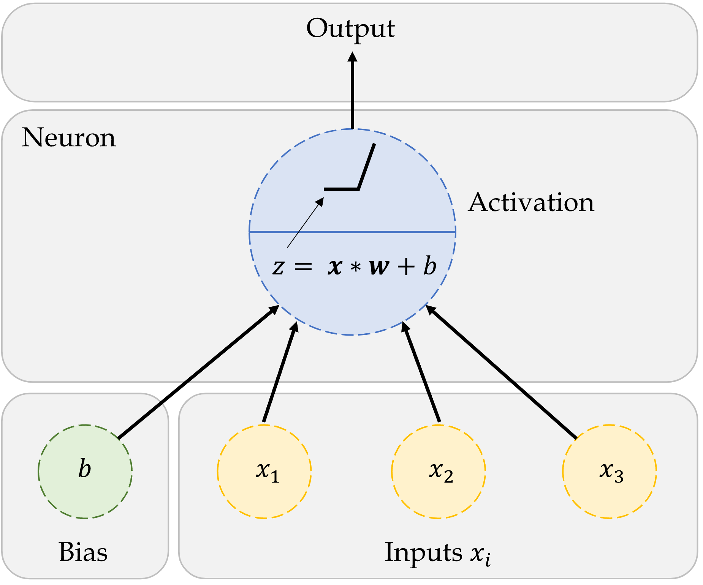

::: {.content-visible unless-format="revealjs"}
The figure shows how we first compute the weighted sum of inputs, and then evaluate the summation using the step function. If the weighted sum is greater than the pre-set threshold, the neuron 'fires'. 
:::

::: footer
Source: Marcus Lautier (2022).
:::

## One neuron

::: columns
::: {.column width="55%"}
$$ \begin{aligned}
  z~=~&x_1 \times w_1 + \\
    &x_2 \times w_2 + \\
    &x_3 \times w_3 . 
  \end{aligned}
$$

$$
  a = \begin{cases}
    z & \text{if } z > 0 \\
    0 & \text{if } z \leq 0
    \end{cases}
$$

Here, $x_1$, $x_2$, $x_3$ are just some fixed data.

The weights $w_1$, $w_2$, $w_3$ should be 'learned'.

:::
::: {.column width="45%"}

:::
:::

::: footer
Source: Marcus Lautier (2022).
:::

## One neuron with bias

::: {.content-visible unless-format="revealjs"} 
The bias is a constant term added to the product of inputs and weights. It helps in shifting the entire activation function to either the negative or positive side. This shifting can either accelerate or delay the activation. For example, if the bias is negative, it will shift the entire curve to the right, making the activation harder. This is similar to delaying the activation.
::: 


::: columns
::: {.column width="55%"}
$$ \begin{aligned}
  z~=~&x_1 \times w_1 + \\
    &x_2 \times w_2 + \\
    &x_3 \times w_3 + b .
  \end{aligned}
$$

$$
  a = \begin{cases}
    z & \text{if } z > 0 \\
    0 & \text{if } z \leq 0
    \end{cases}
$$

The weights $w_1$, $w_2$, $w_3$ and bias $b$ should be 'learned'.
:::
::: {.column width="45%"}

::: {.panel-tabset}

### Bias = -4

```{python}
#| echo: false
def plot_relu_with_bias(bias):
    xs = np.linspace(-10, 10, 1_000)
    xs_with_bias = xs + bias
    ys = xs_with_bias * (xs_with_bias >= 0)

    square_fig().plot(xs, ys)
    plt.xlim([-5, 5])
    plt.ylim([-1, 7])
    plt.xlabel("Weighted Sum Input")
    plt.ylabel("Output")


plot_relu_with_bias(-4)
```

### 0

```{python}
#| echo: false
plot_relu_with_bias(0) 
```

### 4

```{python}
#| echo: false
plot_relu_with_bias(4) 
```

:::
:::
:::

## A basic neural network

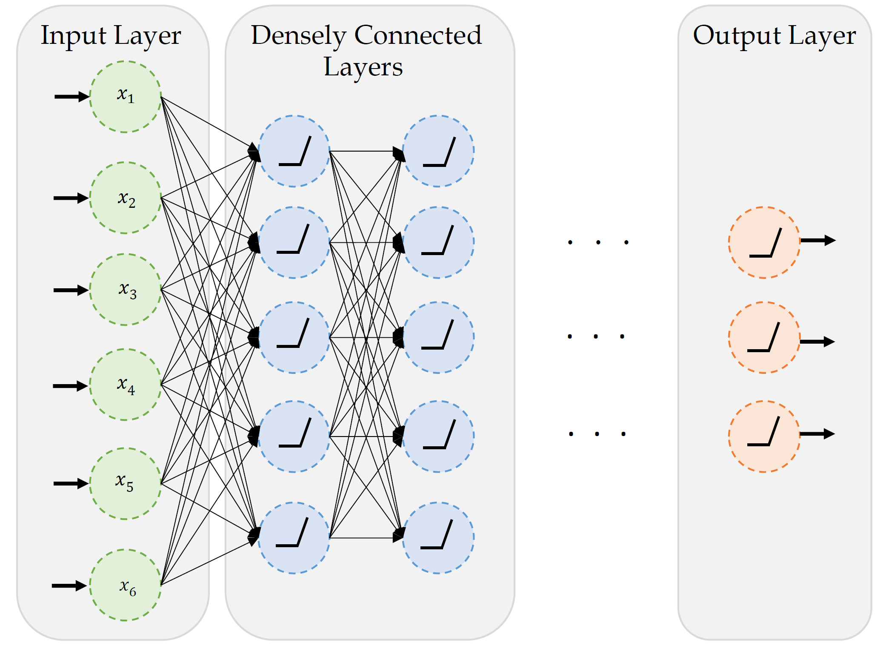

::: {.content-visible unless-format="revealjs"}
This neural network consists of an input layer with 6 neurons ($x_1, x_2, x_3, x_4, x_5, x_6$), an output layer with 3 neurons, and 2 hidden layers with 5 neurons in each layer. Since every neuron is linked to every other neuron, this is called a *fully connected neural network*. 

Since we have 6 inputs and 1 bias in the input layer, each neuron in the first hidden layer has 6+1=7 parameters to learn. 

Similarly, there are 5 neurons and 1 bias in each hidden layer. Each neurion in the second hidden layer has 5+1=6 parameters to learn. 

Assuming the final hidden layer also has 5 neurons, each neuron in the output layer has 5+1=6 parameters to learn.
:::
 
::: footer
Source: Marcus Lautier (2022).
:::

## Step-function activation

### Perceptrons

Brains and computers are binary, so make a perceptron with binary data.
Seemed reasonable, impossible to train.

### Modern neural network

Replace binary state with continuous state.
Still rather slow to train.

::: {.callout-note}
It's a neur**al** network made of neur**on**s, not a "neuron network".
:::

## Try different activation functions

```{python}
#| echo: false
import numpy as np


def plot_activation(x, y, ax, name, hideX=False):
    ax.plot(x, y)
    if y.min() < 0:
        ax.axhline(0, ls="--", c="black", lw=0.5)

    # Annotate the top-left corner of the subplot with the name
    # of the activation function
    ax.annotate(
        name,
        xy=(0.2, 1),
        xycoords="axes fraction",
        xytext=(-5, -5),
        textcoords="offset points",
        ha="left",
        va="top",
    )

    if hideX:
        ax.xaxis.set_visible(False)


x = np.linspace(-5, 5, 500)

fig, axs = plt.subplots(2, 2)
y = x
plot_activation(x, y, axs[0, 0], "Linear", hideX=True)
y = x > 0
plot_activation(x, y, axs[0, 1], "Step", hideX=True)
y = np.tanh(x)
plot_activation(x, y, axs[1, 0], "tanh")
y = x * (x > 0)
plot_activation(x, y, axs[1, 1], "ReLU")

axs[0, 0].set(ylabel="Output")
axs[1, 0].set(xlabel="Input", ylabel="Output")
axs[1, 1].set(xlabel="Input");
```

::: {.content-visible unless-format="revealjs"}
Activation functions are essential for a neural network design. They provide the mathematical rule for 'firing' the neuron. There are many activation functions, and the choice of the activation function depends on the problem we are trying to solve. Note: If we use the 'linear' activation function at every neuron, then the regression learning problem becomes a simple linear regression. But if we use 'ReLu', 'tanh', or any other non-linear function, then, we can introduce non-linearity into the model so that the model can learn complex non-linear patterns in the data. There are activation functions in both the hidden layers and the output layer. The activation function in the hidden layer controls how the neural network learns complex non-linear patterns in the training data. The choice of activation function in the output layer determines the type of predictions we get.  
:::

## Flexible

> One can show that an MLP is a **universal approximator**, meaning 
> it can model any suitably smooth function, given enough hidden units,
> to any desired level of accuracy (Hornik 1991). One can either make
> the model be "wide" or "deep"; the latter has some advantages...
>
> ::: {style="text-align: right;"}
> — @murphy2012machine [p. 566]
> :::

## Feature engineering

::: columns
::: {.column width="50%"}

<center>

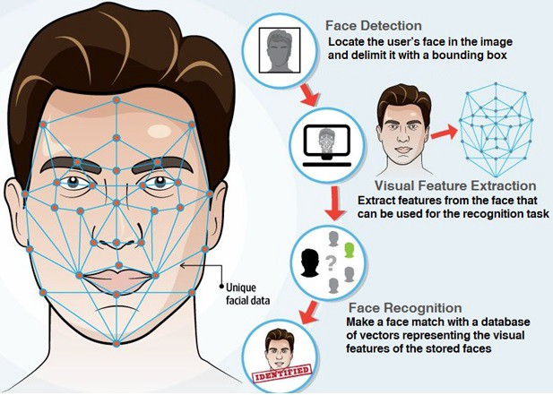{width="90%"}
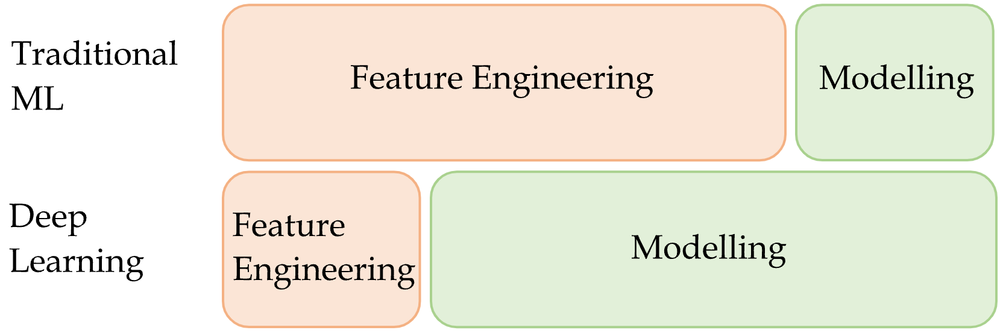{width="90%"}

</center>

:::


::: {.column width="50%"}
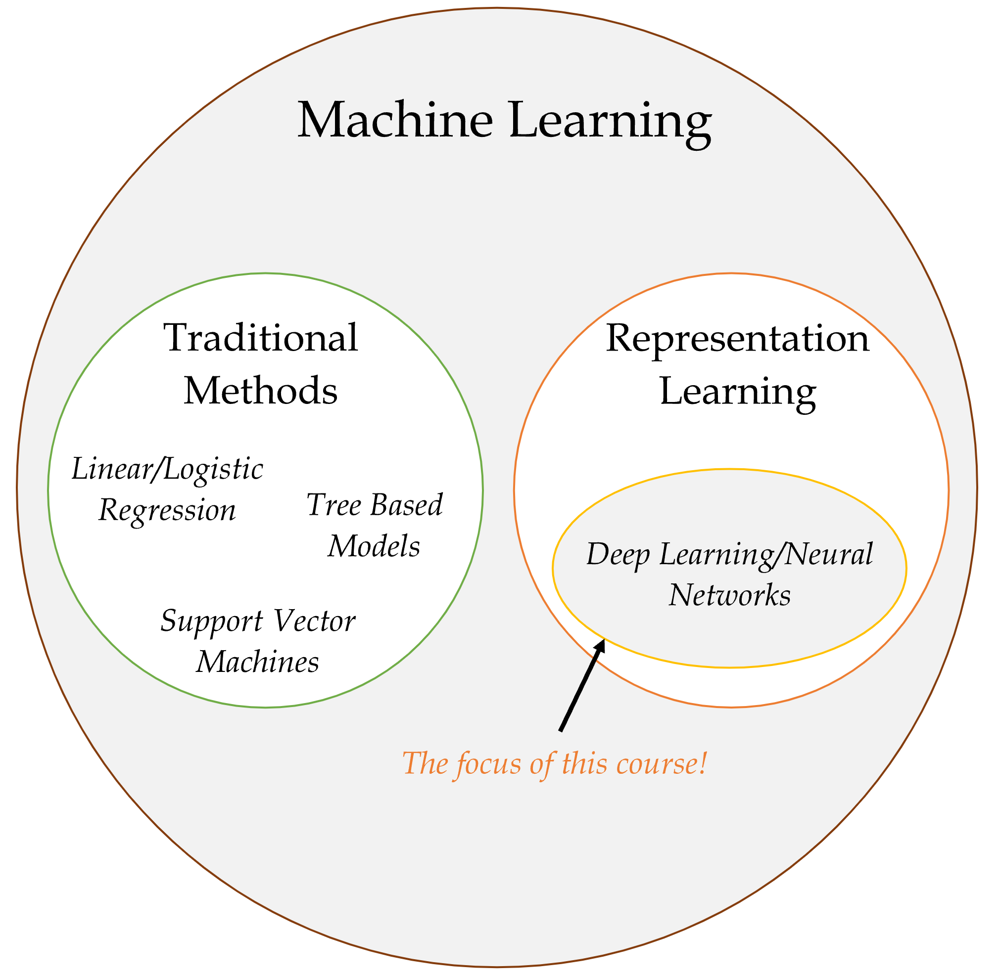{width="80%"}

:::
:::

::: {.content-visible unless-format="revealjs"}
A major part of traditional machine learning (TML) involves conducting feature engineering to extract relevant features manually. In contrast, representational learning does not involve heavy manual feature engineering, rather, it learns relevant features automatically from data during the task. Therefore, the effort spent on feature engineering in representational learning is minimal compared to TML.
:::

::: footer
Sources: Marcus Lautier (2022) & Fenjiro (2019), [_Face Id: Deep Learning for Face Recognition_](https://medium.com/@fenjiro/face-id-deep-learning-for-face-recognition-324b50d916d1), Medium.
:::

## Quiz

In this ANN, how many of the following are there:

::: columns
::: {.column width="32%"}

- features,
- targets,
- weights,
- biases, and
- parameters?

What is the depth?

:::
::: {.column width="68%"}
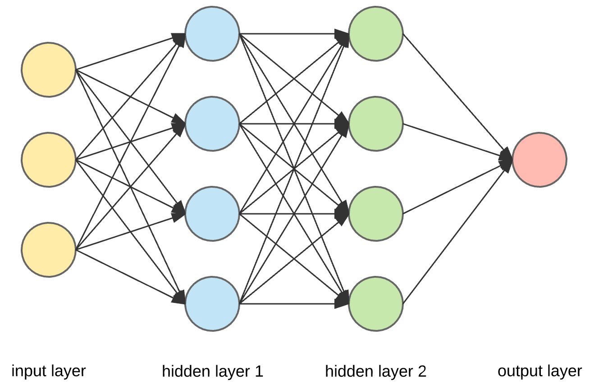
:::
:::

::: {.content-visible unless-format="revealjs"}

* There are 3 inputs, hence, 3 features. 
* There is 1 neuron in the output layer, hence, 1 target. 
* There are $3 \times 4 + 4 \times 4 + 4\times 1 = 32$ arrows, hence, there are 32 weights in total. 
* Since there is 1 bias for each neuron, there are 9 biases in total. 
* The number of total parameters to learn equals to the sum of weights and biases, hence, there are $32+9=41$ parameters in total. 
:::

::: footer
Source: Dertat (2017), [_Applied Deep Learning - Part 1: Artificial Neural Networks_](https://towardsdatascience.com/applied-deep-learning-part-1-artificial-neural-networks-d7834f67a4f6), Medium.
:::



## Keras model methods {.appendix}

```{python}
#| echo: false
# Make up some fake data to fit a model to.
import numpy
numpy.random.seed(42)
Xs = np.random.normal(size=(100, 4))
ys = np.random.poisson(size=(100, 1))

# Convert to a pandas DataFrame.
Xs = pd.DataFrame(Xs, columns=["x1", "x2", "x3", "x4"])
ys = pd.DataFrame(ys, columns=["y"])

X_main, X_test, y_main, y_test = train_test_split(Xs, ys, random_state=42)
X_train, X_val, y_train, y_val = train_test_split(X_main, y_main, random_state=42)

numpy.random.seed(123)
```

::: columns
::: {.column width="45%"}
- `compile`: specify the loss function and optimiser
- `fit`: learn the parameters of the model
- `predict`: apply the model
- `evaluate`: apply the model and calculate a metric
:::
::: {.column width="55%"}

<br>

```{python}
#| warning: false
random.seed(12)
model = Sequential()
model.add(Dense(1, activation="relu"))
model.compile("adam", "poisson")
model.fit(X_train, y_train, verbose=0)
y_pred = model.predict(X_val, verbose=0)
print(model.evaluate(X_val, y_val, verbose=0))
```
:::
:::

## Package Versions {.appendix data-visibility="uncounted"}

```{python}
from watermark import watermark
print(watermark(python=True, packages="keras,matplotlib,numpy,pandas,seaborn,scipy,torch"))
```

## Glossary {.appendix data-visibility="uncounted"}

::: columns
::: column
- activations, activation function
- artificial neural network
- biases (in neurons)
- callbacks
- classification problem
- cost/loss function
- deep network, network depth
- dense or fully-connected layer
- early stopping
- epoch
- feed-forward neural network
- hidden layer
:::
::: column
- Keras, TensorFlow, PyTorch
- labelled/unlabelled data
- machine learning
- minimax algorithm
- neural network architecture
- perceptron
- ReLU
- representation learning
- sigmoid activation function
- targets
- training/validation/test split
- weights (in a neuron)
:::
:::


## References

::: {refs}
:::