```{python}
#| echo: false
#| warning: false
from setup import *

import json
from sklearn.datasets import fetch_california_housing

pandas.options.display.max_rows = 8
```

# Introduction {visibility="uncounted"}

## What is Computer Vision?

> "Little by little, we're giving sight to the machines. First, we teach them to see. Then, they help us to see better."
>
> ::: {style="text-align: right;"}
> — Fei-Fei Li, creator of ImageNet
> :::

::: footer
Source: Fei-Fei Li (2015), [How we're teaching computers to understand pictures](https://www.ted.com/talks/fei_fei_li_how_we_re_teaching_computers_to_understand_pictures), TED2015.
:::

Getting computers to _extract meaning from images and video_ — and act on what they see.

<!-- ## Applications -->

- _Image classification_ — one label per image (benign vs malignant lesion, pass/fail parts).
- _Object detection_ — locate and label many objects at once (pedestrians and traffic lights for a self-driving car).
- _Image segmentation_ — label _every pixel_ (outlining a tumour in a scan).
- _Facial recognition_ — verify or identify a person (phone unlock, passport gates).

## Computer vision for actuaries

- _Claims automation_ — estimate motor repair costs from photos of the damage.
- _Property underwriting_ — score roof condition and bushfire exposure from aerial imagery.
- _Health & life_ — predict cardiovascular risk factors from retinal scans.
- _Fraud detection_ — flag reused, stock, or AI-altered claim images.

For an actuary the practical upshot is less about any individual architecture and more about _transfer learning_: a CNN trained on millions of images can be downloaded and reused on your own (much smaller) dataset.

## Facial analytics and life insurance

::: columns
::: column

{width="80%"}

:::
::: column

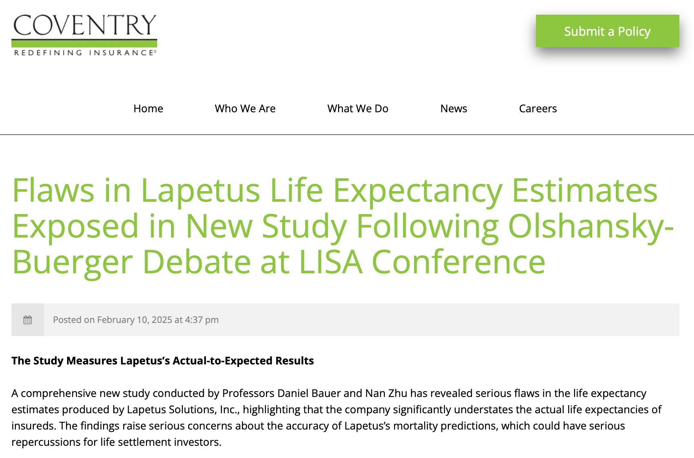

:::
:::

::: footer
Source: [Seattle Times](https://www.seattletimes.com/business/how-your-selfie-could-affect-your-life-insurance/) & [Coventry](https://www.coventry.com/flaws-in-lapetus-life-expectancy-estimates-exposed-in-new-study-following-olshansky-buerger-debate-at-lisa-conference/).
:::


## Imports needed for these demos

```{python}
import random
from pathlib import Path

import matplotlib.pyplot as plt
import matplotlib.font_manager as fm
from matplotlib.image import imread
from matplotlib.pyplot import imshow
import numpy as np
import pandas as pd
from PIL import Image

import keras
from keras.models import Sequential, Model
from keras.layers import (Dense, Input, Rescaling, Flatten,
    Conv2D, MaxPooling2D, GlobalAveragePooling2D)
from keras.callbacks import EarlyStopping
from keras.utils import plot_model

from sklearn.model_selection import train_test_split
from sklearn.preprocessing import StandardScaler

from directory_tree import DisplayTree
import optuna
```

For PIL, you'll need to `pip install Pillow`.

<!-- # Images {visibility="uncounted"} -->

## Shapes of data

::: {.content-visible unless-format="revealjs"}
Special attention to the shapes of data is important in CNN architectures, because CNNs have special types of layers (e.g. convolution and pooling) which require explicit specifications of array dimensions.
:::


::: footer
Source: Paras Patidar (2019), [Tensors — Representation of Data In Neural Networks](https://medium.com/mlait/tensors-representation-of-data-in-neural-networks-bbe8a711b93b), Medium article.
:::

## Shapes of photos

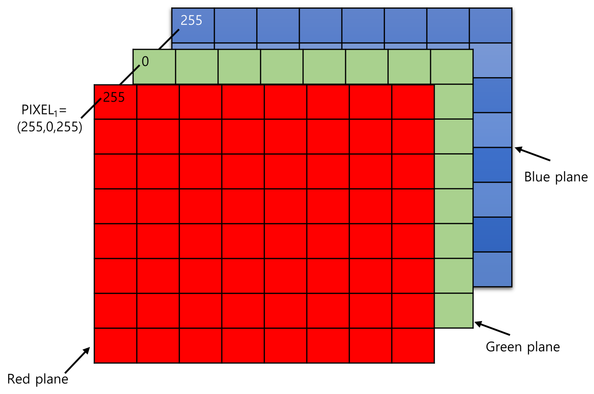

::: footer
Source: Kim et al (2021), [Data Hiding Method for Color AMBTC Compressed Images Using Color Difference](https://www.mdpi.com/applsci/applsci-11-03418/article_deploy/html/images/applsci-11-03418-g001.png), Applied Sciences.
:::

::: {.content-visible unless-format="revealjs"}
A colour photo is stored as a rank 3 tensor: height × width × colour channels. The first two axes locate a pixel (its row and column), and the third holds that pixel's three colour intensities (red, green, and blue).
:::

## How the computer sees them

```{python}
#| eval: false
img1 = imread('images/pu.gif'); img2 = imread('images/pl.gif')
img3 = imread('images/pr.gif'); img4 = imread('images/pg.bmp')
f"Shapes are: {img1.shape}, {img2.shape}, {img3.shape}, {img4.shape}."
```

```{python}
#| echo: false
inds = (0, 1, 2)
img1 = imread("images/pu.gif")
img1 = img1[:, :, inds]

img2 = imread("images/pl.gif")
img2 = img2[:, :, inds]

img3 = imread("images/pr.gif")
img3 = img3[:, :, inds]

img4 = imread("images/pg.bmp")

f"Shapes are: {img1.shape}, {img2.shape}, {img3.shape}, {img4.shape}."
```

::: columns
::: {.column width="25%"}

```{python}
print(img1)
```

:::
::: {.column width="25%"}
```{python}
print(img2)
```

:::
::: {.column width="25%"}

```{python}
print(img3)
```

:::
::: {.column width="25%"}
```{python}
print(img4)
```
:::
:::

::: {.content-visible unless-format="revealjs"}
The above code reads 4 images and then shows how computers read those images. Each image is read by the computer as a rank 3 tensor. Each image is of (16,16,3) dimensions.
:::

## How we see them

::: columns
::: {.column width="25%"}

```{python}
imshow(img1);
```

:::
::: {.column width="25%"}
```{python}
imshow(img2);
```

:::
::: {.column width="25%"}

```{python}
imshow(img3);
```

:::
::: {.column width="25%"}
```{python}
imshow(img4);
```
:::
:::

## Why is 255 special?

Each pixel's colour intensity is stored in one byte.

One byte is 8 bits, so in binary that is 00000000 to 11111111.

The largest _unsigned_ number this can be is $2^8-1 = 255$.

```{python}
np.array([0, 1, 255, 256]).astype(np.uint8)
```

If you had _signed_ numbers, this would go from -128 to 127.

```{python}
np.array([-128, 1, 127, 128]).astype(np.int8)
```

Alternatively, _hexadecimal_ numbers are used.
E.g. 10100001 is split into 1010 0001, and 1010=A, 0001=1, so combined it is 0xA1.

# The Convolution Operation {visibility="uncounted"}

<!-- 
## Images are rank 3 tensors

Height, width, and number of channels.

::: {.content-visible unless-format="revealjs"}
An image can be represented using a rank 3 tensor, since it has 3 dimensions; height, width, and number of channels. The number of channels is also known as the 'depth'. The left hand side of the picture shown below is tensor with height =5, width =5 and depth =3.
:::

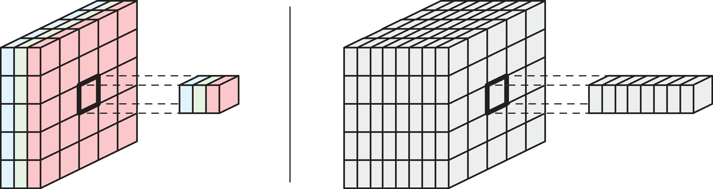

Grayscale image has 1 channel. RGB image has 3 channels.

::: {.content-visible unless-format="revealjs"}
Each colour can be represented as a combination of three primary colours; red, green and blue.
:::

Example: Yellow = Red + Green. 

::: footer
Source: @glassner2021deep, Chapter 16.
:::
 -->

## The convolution operation

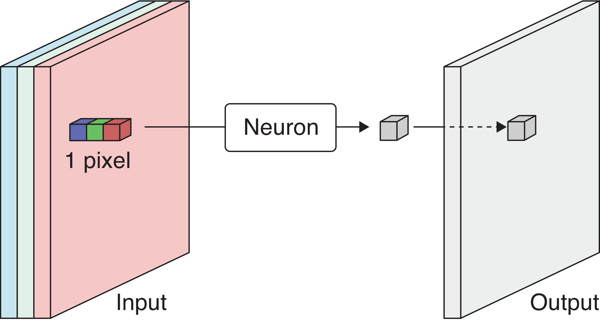

The output is produced by *sweeping* the neuron over the input. This is called **convolution**.

_Aside:_ you'd have seen the convolution operation when calculating the density of $S = X_1 + X_2$ for i.i.d. $X_1, X_2 \sim f_X$ as $f_S(s) = \int f_X(x_1)\, f_X(s - x_1)\,\mathrm{d}x_1 = (f_X \star f_X)(s)$. This is why they're named "convolutional".

::: footer
Source: @glassner2021deep, Chapter 16.
:::

## The weights and biases

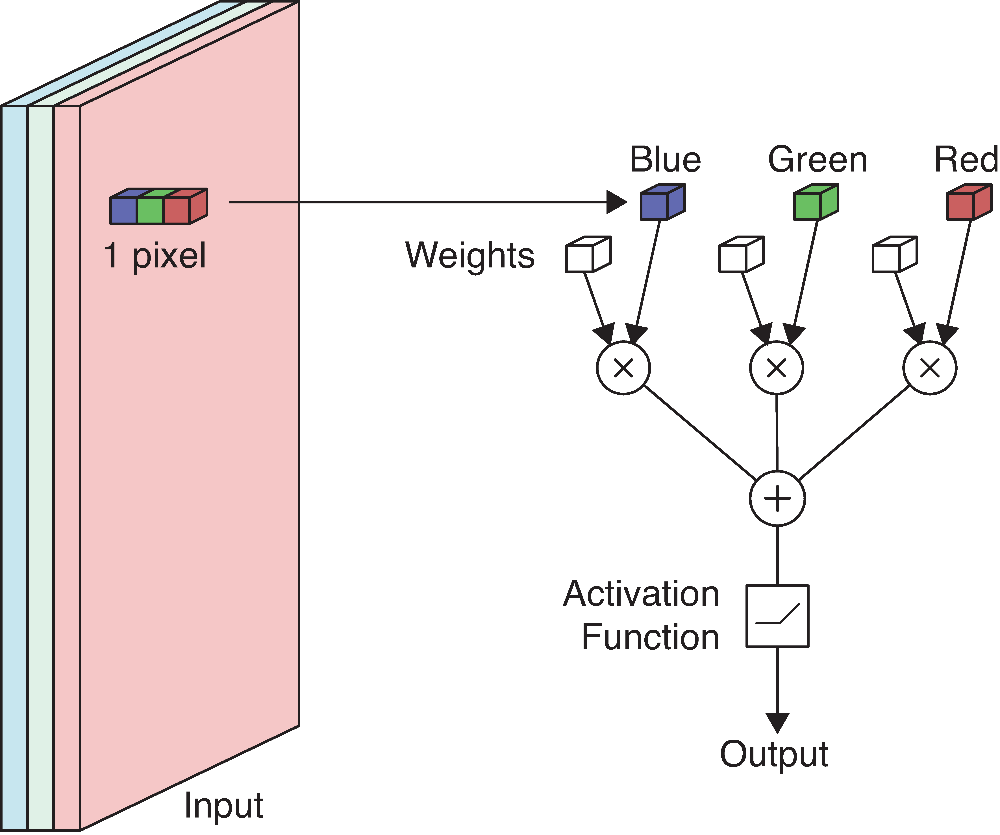

::: footer
Source: @glassner2021deep, Chapter 16.
:::

## Example: Detecting yellow

::: {.content-visible unless-format="revealjs"}
Suppose we wish to detect if a picture has yellow colour in it. One option would be to apply a neuron over each pixel and see if it detects the colour yellow. We know that each pixel is represented by 3 numerical values that correspond to red, green and blue. Higher numeric values for red and green indicate higher chances of detecting yellow. Higher values for blue indicate lower chances of detecting yellow. Utilising this information, we can assign RGB weights to be 1, 1, -1 respectively. 

Next, a standard multiplication between numeric values and weights is carried out, and the weighted sum is passed through the neuron.
:::

<!-- Apply a neuron to each pixel in the image. -->

If red/green $\nearrow$ or blue $\searrow$ then yellowness $\nearrow$. Set RGB weights to 1, 1, -1.

::: {.content-visible unless-format="revealjs"}
The following picture demonstrates how yellow-coloured areas (in the colour picture) are transformed into a white colour (in the greyscale picture). This is a result of the way we assigned the weights. Since we assigned +1 weights to red and green, and -1 to blue, it ended up resulting in large positive values (for the weighted sum) for the pixels in the yellow-coloured areas. Large positive values in the greyscale correspond to white colour. Therefore, the areas which were yellow in the colour picture converted to white in the greyscale. In practice, we do not manually assign weights, instead, we let the neural network decide the optimal weights during training.
:::


This is about all we can detect by looking pixel-by-pixel. Typically we look at 3x3 or 5x5 blocks of pixels together.

::: footer
Source: @glassner2021deep, Chapter 16.
:::

## Filters

::: columns
::: {.column width="60%"}
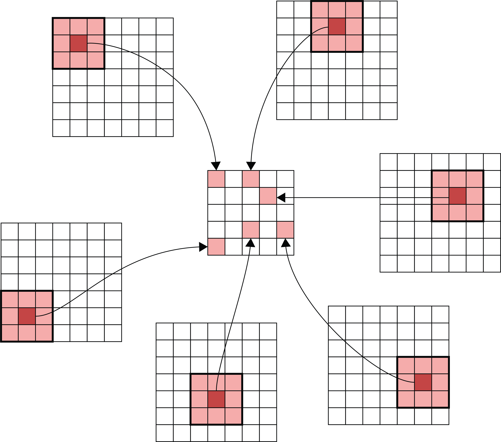{width="90%"}
:::
::: {.column width="40%"}
- The patch of input pixels a filter covers at one location is its *footprint*. Applied there, the filter turns that patch into a single output number — which is exactly what one neuron does.
- The *same* filter slides over every location instead of learning new weights per pixel. This *weight sharing* is why a convolution layer has so few parameters.
:::
:::

::: footer
Source: @glassner2021deep, Chapter 16.
:::

::: {.content-visible unless-format="revealjs"}
The above figure shows how 9 inputs transform into one output. As a result, the dimensions of the output matrix are smaller than the dimensions of the input matrix. There are some options we can use if we wish to keep the size of the input and output matrices the same.
:::

## Example filter


Take a look at [https://setosa.io/ev/image-kernels/](https://setosa.io/ev/image-kernels/).

::: footer
Source: [Stanford's deep learning tutorial](http://deeplearning.stanford.edu/wiki/index.php/Feature_extraction_using_convolution) via [Stack Exchange](https://stats.stackexchange.com/a/188216).
:::


## Padding

::: columns
::: column
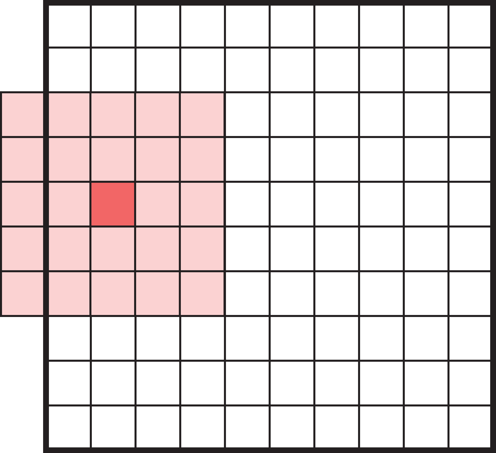{width="80%"}
:::
::: column
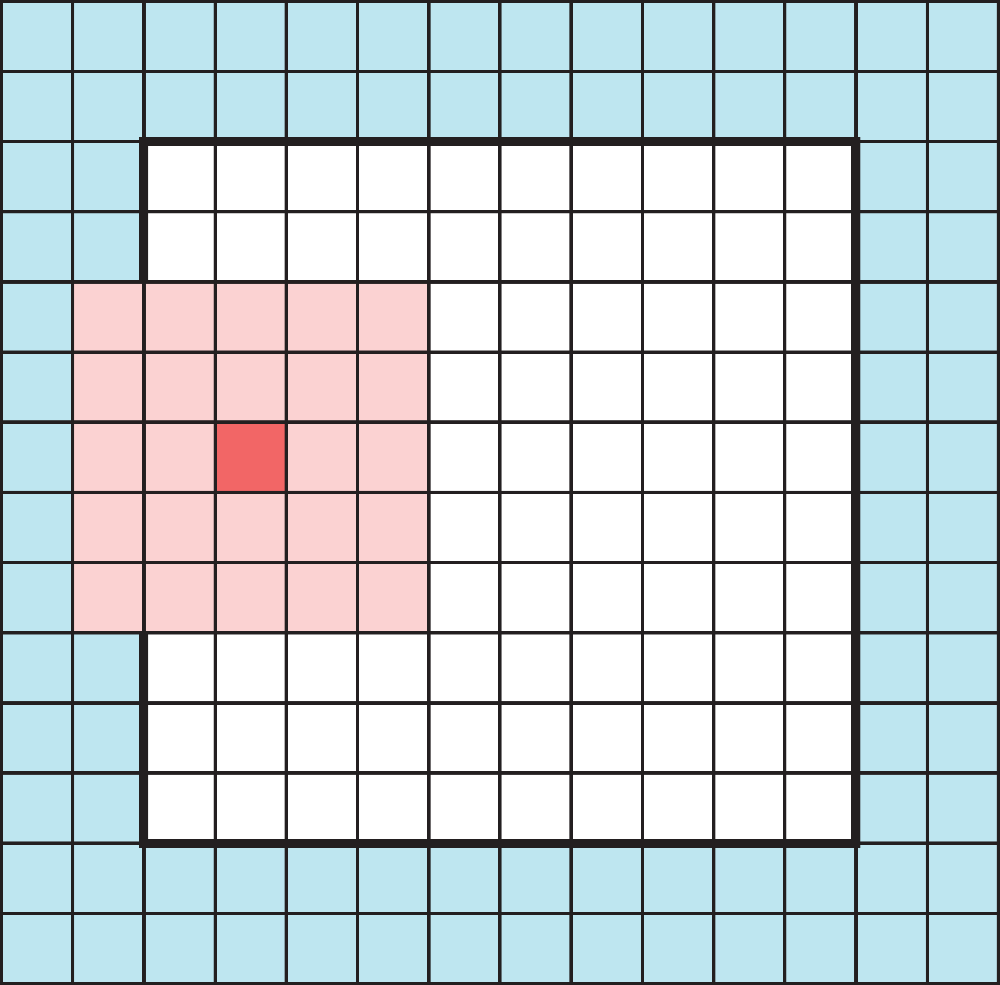{width="80%"}
:::
:::

Add zeros around the input so the filter's footprint doesn't fall off the edge. This lets the output keep the same size as the input (`padding="same"`).

::: footer
Source: @glassner2021deep, Chapter 16.
:::

## Striding

::: {.content-visible unless-format="revealjs"}
Striding modifies how the filter moves across the image. Instead of moving one pixel at a time, we can take larger steps.
:::

We don't have to move the filter one pixel across/down at a time — a larger _stride_ shrinks the output and saves computation.

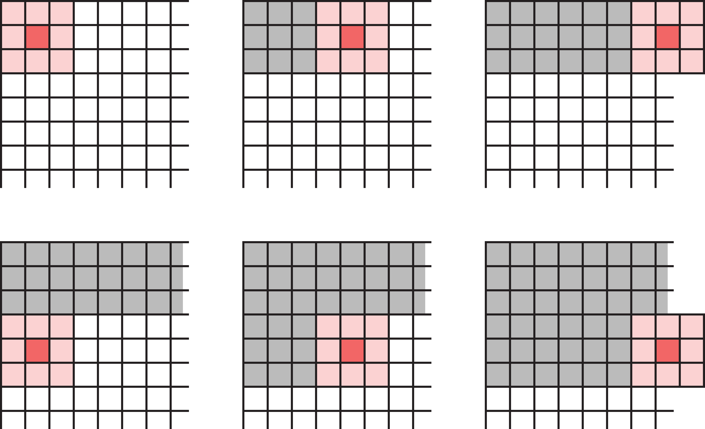

::: footer
Source: @glassner2021deep, Chapter 16.
:::


## Multidimensional convolution

A filter covers a *block* of pixels (e.g. a 3x3 filter has 9 weights), and must have the same number of channels as its input.

<!-- Need $\# \text{ Channels in Input} = \# \text{ Channels in Filter}$. -->

::: columns
::: {.column width="60%"}
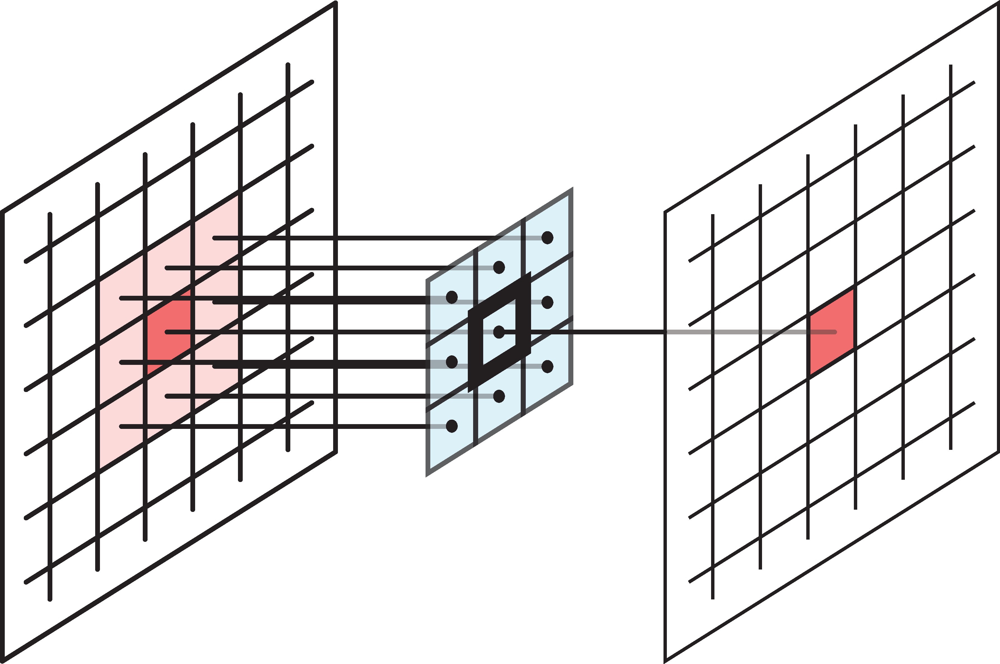{width="80%"}
:::
::: {.column width="40%"}
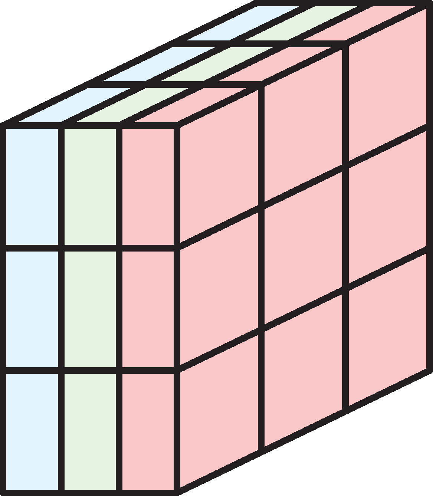{width="80%"}
:::
:::

::: footer
Source: @glassner2021deep, Chapter 16.
:::

::: {.content-visible unless-format="revealjs"}
In a multidimensional filter, the number of channels of the input must be equal to the number of channels in the filter (depths must be the same). The single-channel 3x3 filter has 9 weights; matching it to a 3-channel input gives 3x3x3 = 27 weights.
:::

## Example: 3x3 filter over RGB input 

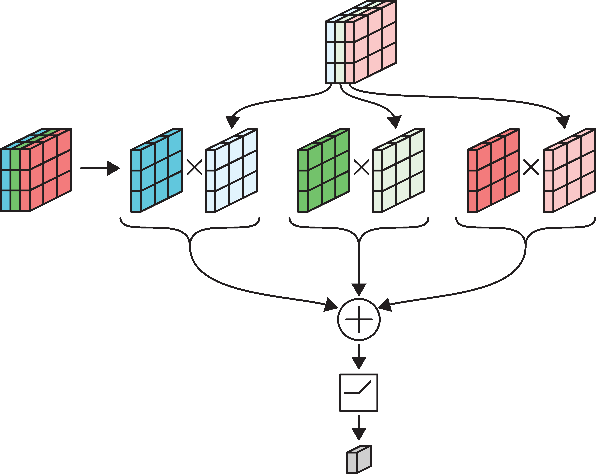

::: footer
Source: @glassner2021deep, Chapter 16.
:::

::: {.content-visible unless-format="revealjs"}
The above figure shows how we pick a 3x3x3 block from the image, and then apply the 3x3 filter. The multiplication is carried out channel-wise, i.e. we select the first channel of the filter and the first channel of the image and carry out the element-wise multiplication. Once the elementwise multiplications for the three pairs of channels are completed, we sum them all, and pass through the neuron.
:::


<!-- # Convolutional Layer Options {visibility="uncounted"} -->


## Convolution layer

- Multiple filters are bundled together in one layer.
- The filters are applied *simultaneously* and *independently* to the input.
- Number of channels in the output will be the same as the number of filters.

::: {.content-visible unless-format="revealjs"}
The motivation behind applying filters *simultaneously* and *independently* is to let the filters learn different patterns in the input-output relationship. The idea is quite similar to using many neurons in one `Dense` layer (in a `Dense` layer, we would use multiple neurons so that different neurons can capture different patterns in the input-output relationship).
:::

<!-- ## Example -->

::: columns
::: {.column width="30%"}
In the image:

- 6-channel input tensor
- input pixels
- four 3x3 filters
- four output tensors
- final output tensor.
:::
::: {.column width="70%"}
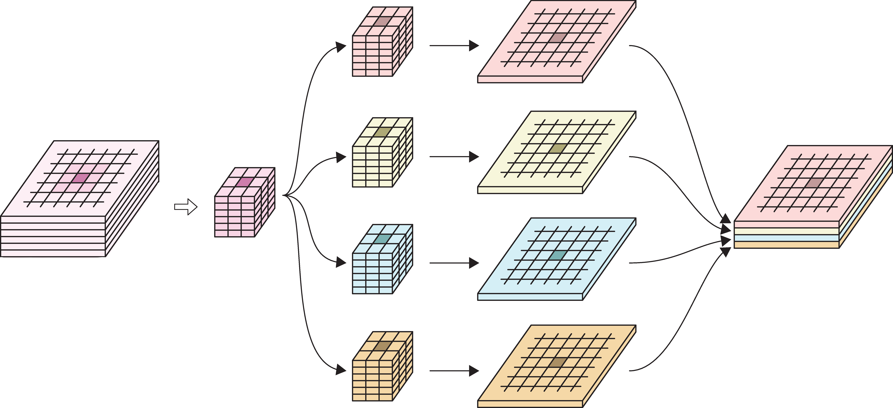
:::
:::


::: footer
Source: @glassner2021deep, Chapter 16.
:::

::: {.content-visible unless-format="revealjs"}
The above picture shows how we take in an image with 6 channels, select a 3x3 block (in pink colour), apply 4 different filters of same dimensions (in pink, green, blue and yellow), retrieve the output with 1 channel (1 output for each filter) and finally stack them together to create 1 output tensor. Note that the number of channels in the output tensor is 4, which is equal to the number of filters used.  
:::


## Specifying a convolutional layer

Need to choose:

- number of filters,
- their size/footprint (e.g. 3x3, 5x5, etc.),
- activation functions,
- padding & striding (optional).

All the filter weights are learned during training.

# Convolutional Neural Networks {visibility="uncounted"}

## Convolutional Neural Networks

A neural network that uses _convolution layers_ is called a _convolutional neural network_.

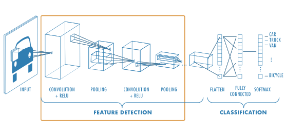

::: footer
Source: MathWorks, [_Introducing Deep Learning with MATLAB_](https://au.mathworks.com/campaigns/offers/next/deep-learning-ebook.html), Ebook.
:::

::: {.content-visible unless-format="revealjs"}
A standard CNN architecture has the following components: 

* Input layer
* Sequence of feature extraction layers (which combine convolution and pooling operations sequentially)
* Sequence of classification layers (which include flattening and fully connected layers)
* Final output layer

Convolution layers are used to extract meaningful patterns from the input using filters. Pooling layers are used to reduce the spatial dimensions of the feature maps generated from convolutional layers. The purpose of the feature extraction layers is to learn complex but meaningful, high levels patterns in data. The aim of classification layers is to receive the learned patterns and make decisions more closely related to the classification task at hand.
:::

::: {.content-visible unless-format="revealjs"}
On a high level, as we move deeper into the network the number of channels (the depth) tends to grow while the spatial dimensions (height and width) of the feature maps shrink.
:::

## Pooling

**Pooling**, or **downsampling**, is a technique to blur a tensor.

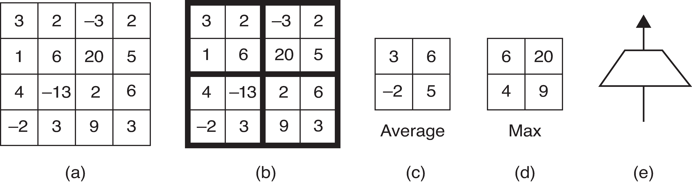

(a): Input tensor
(b): Subdivide input tensor into 2x2 blocks
(c): Average pooling
(d): Max pooling
(e): Icon for a pooling layer

::: footer
Source: @glassner2021deep, Chapter 16.
:::


## Pooling for multiple channels {.smaller}

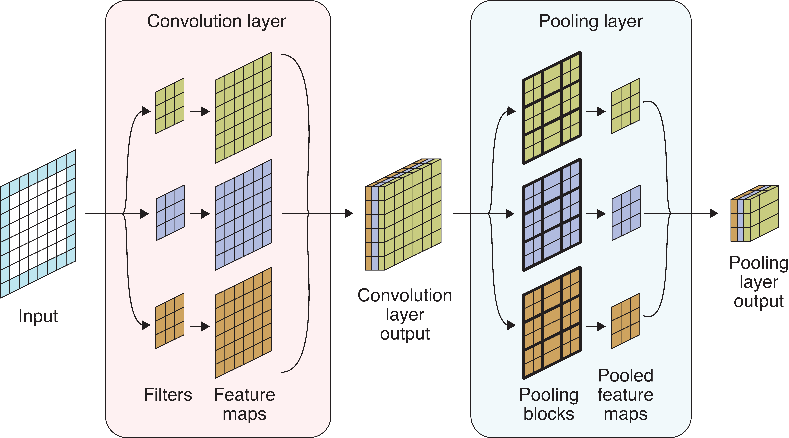

::: footer
Source: @glassner2021deep, Chapter 16.
:::

<!--
## Why/why not use pooling?

**Why?** Pooling _reduces the size_ of tensors, therefore reduces memory usage and execution time.

**Why not?**

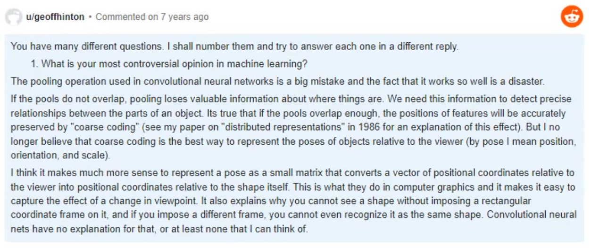

::: footer
Source: Hinton, [Reddit AMA](https://www.reddit.com/r/MachineLearning/comments/2lmo0l/comment/clyj4jv/?utm_source=share&utm_medium=web2x&context=3).
:::
-->

## MNIST Dataset {visibility="uncounted"}

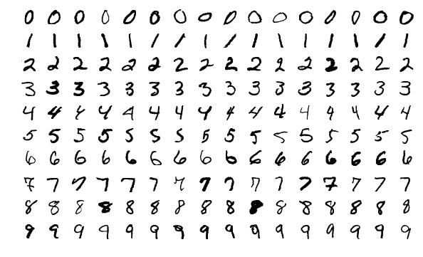

::: footer
Source: Wikipedia, [MNIST database](https://en.wikipedia.org/wiki/MNIST_database).
:::

## LeNet-5 (1998)

| Layer | Type            | Channels | Size    | Kernel size | Stride | Activation |
|-------|-----------------|------|---------|-------------|--------|------------|
| In    | Input           | 1    | 32×32 | –           | –      | –          |
| C1    | Convolution     | 6    | 28×28 | 5×5       | 1      | tanh       |
| S2    | Avg pooling     | 6    | 14×14 | 2×2       | 2      | tanh       |
| C3    | Convolution     | 16   | 10×10 | 5×5       | 1      | tanh       |
| S4    | Avg pooling     | 16   | 5×5   | 2×2       | 2      | tanh       |
| C5    | Convolution     | 120  | 1×1   | 5×5       | 1      | tanh       |
| F6    | Fully connected | –    | 84      | –           | –      | tanh       |
| Out   | Fully connected | –    | 10      | –           | –      | RBF        |

::: {.callout-note}
MNIST images are 28×28 pixels, and with zero-padding (for a 5×5 kernel) that becomes 32×32.
:::

::: footer
Source: @geron2022hands, Chapter 14.
:::

## AlexNet (2012) {.smaller}

| Layer | Type            | Channels    | Size      | Kernel | Stride | Padding | Activation |
|-------|-----------------|---------|-----------|-------------|--------|---------|------------|
| In    | Input           | 3       | 227×227 | –           | –      | –       | –          |
| C1    | Convolution     | 96      | 55×55   | 11×11     | 4      | valid   | ReLU       |
| S2    | Max pool     | 96      | 27×27   | 3×3       | 2      | valid   | –          |
| C3    | Convolution     | 256     | 27×27   | 5×5       | 1      | same    | ReLU       |
| S4    | Max pool     | 256     | 13×13   | 3×3       | 2      | valid   | –          |
| C5    | Convolution     | 384     | 13×13   | 3×3       | 1      | same    | ReLU       |
| C6    | Convolution     | 384     | 13×13   | 3×3       | 1      | same    | ReLU       |
| C7    | Convolution     | 256     | 13×13   | 3×3       | 1      | same    | ReLU       |
| S8    | Max pool     | 256     | 6×6     | 3×3       | 2      | valid   | –          |
| F9    | Fully conn. | –       | 4,096     | –           | –      | –       | ReLU       |
| F10   | Fully conn. | –       | 4,096     | –           | –      | –       | ReLU       |
| Out   | Fully conn. | –       | 1,000     | –           | –      | –       | Softmax    |

::: footer
Winner of the ILSVRC 2012 challenge (top-five error 17%), developed by Alex Krizhevsky, Ilya Sutskever, and Geoffrey Hinton.
:::

<!--
## A lineage of CNN architectures

| Year | Architecture | Key idea |
|------|--------------|----------|
| 1998 | LeNet-5 | first working CNN — digit recognition |
| 2012 | AlexNet | the ImageNet breakthrough (ReLU, dropout, GPUs) |
| 2014 | VGG | very deep, uniform 3×3 stacks |
| 2014 | GoogLeNet / Inception | parallel multi-scale filters |
| 2015 | ResNet | residual / skip connections → 100s of layers |

You don't need to memorise these — you'll meet them as a drop-down menu in [`keras.applications`](https://keras.io/api/applications/), where you load one with ImageNet weights and transfer-learn (next section).
-->

## Depth can be important for image tasks

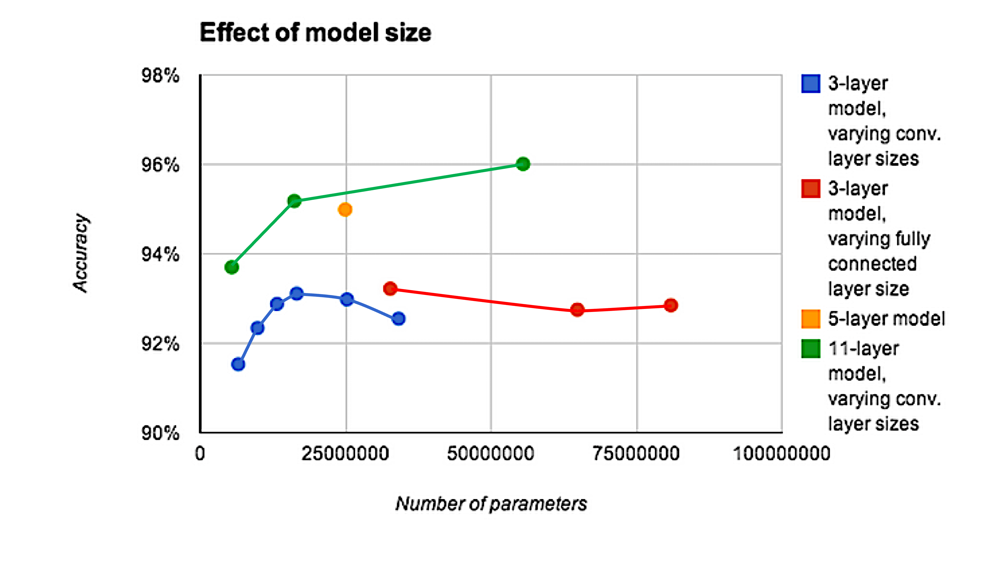

::: footer
Source: Adapted from @goodfellow2014multi.
:::

## Residual connection

Residual (skip) connections [@he2016deep] let the network learn a correction to the identity, making it possible to train hundreds of layers.


::: footer
Source: [Wikimedia](https://commons.wikimedia.org/wiki/File:ResBlock.png)
:::


## Image augmentation

::: {.content-visible unless-format="revealjs"}
Image augmentation: start with an image and create new training examples from it by applying small, label-preserving transformations. Examples include:

* Flipping/rotating
* Zooming/translating/cropping
* Adjusting contrast/brightness

Image augmentation doesn't _add_ new information, but by training on many perturbed versions of each image it makes the model _less sensitive_ to such small changes. In effect, the model has more images to learn from.
:::

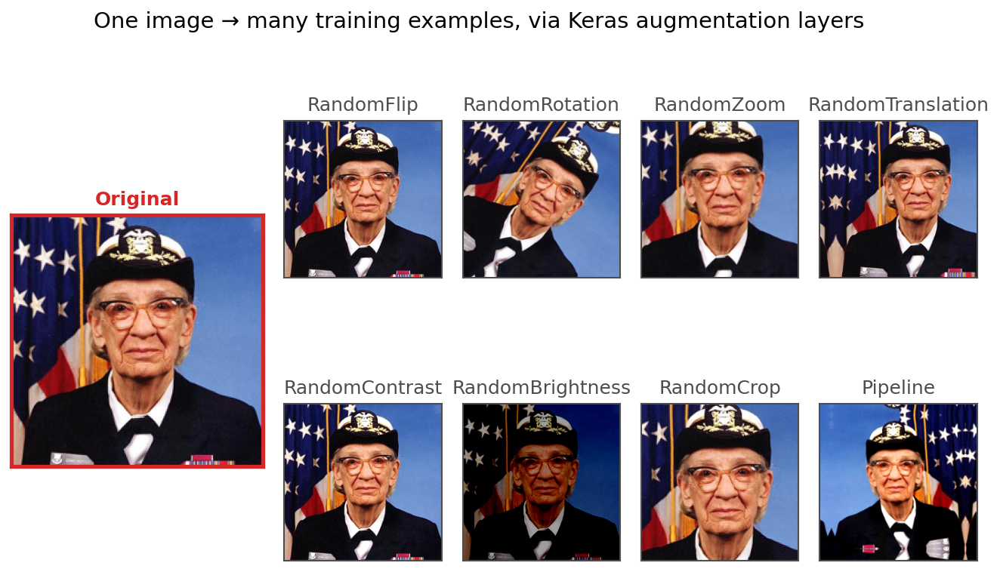

::: footer
Base image: Grace Hopper (ships with Matplotlib).
:::

## What do the CNN layers learn?

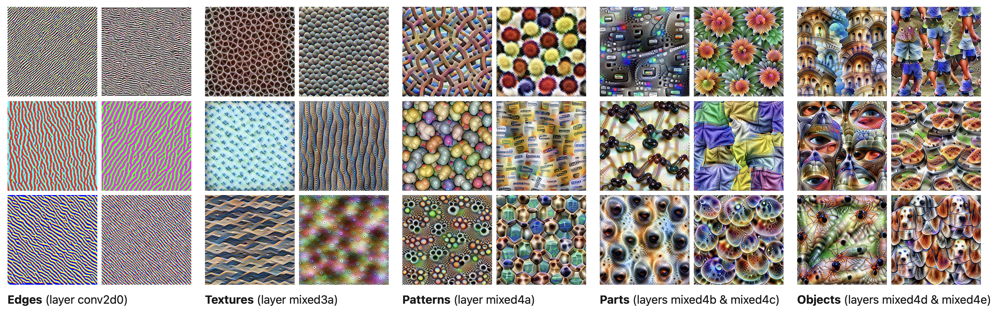

::: {.content-visible unless-format="revealjs"}
CNN layers learn (sequentially):

1. Edges
2. Textures
3. Patterns
4. Parts
5. Objects
:::

::: footer
Source: Distill article, [Feature Visualization](https://distill.pub/2017/feature-visualization/).
:::

## How does that work?

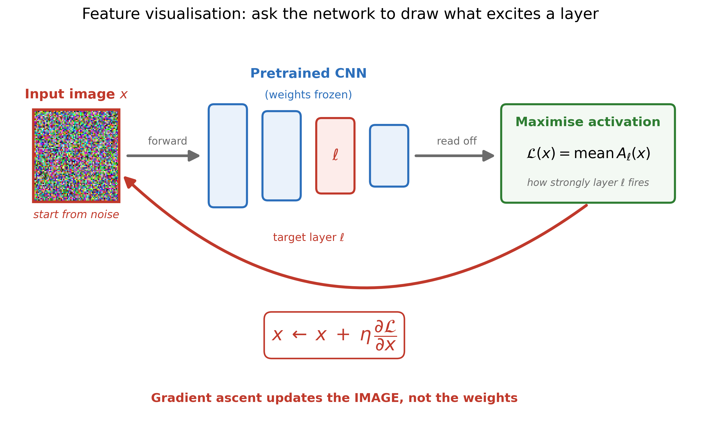

::: {.content-visible unless-format="revealjs"}
The pictures above aren't real photos — they're _synthesised_ by the network itself:

1. Take a pretrained CNN and _freeze_ its weights.
2. Pick a target layer $\ell$, and start from a random-noise image $x$.
3. Run a forward pass and measure how strongly that layer fires, $\mathcal{L}(x) = \mathrm{mean}\,A_\ell(x)$.
4. Backpropagate, but apply the update to the _image_ rather than the weights: $x \leftarrow x + \eta\,\tfrac{\partial \mathcal{L}}{\partial x}$ (gradient _ascent_, so the activation grows).
5. Repeat. The noise gradually morphs into the pattern that layer is most excited by.

The takeaway: _early_ layers light up for simple things (edges, colours, textures), while _deeper_ layers respond to complex things (parts, whole objects). (The real method also needs regularisation — jittering and rescaling the image each step — or it produces high-frequency junk instead of recognisable patterns.)
:::

::: footer
Method from the Distill article, [Feature Visualization](https://distill.pub/2017/feature-visualization/).
:::

# Chinese Character Recognition Dataset {visibility="uncounted"}

## CASIA Chinese handwriting database

Dataset source: [Institute of Automation of Chinese Academy of Sciences (CASIA)](https://nlpr.ia.ac.cn/databases/handwriting/Home.html)


::: footer
Source: @liu2011casia. Dataset available [here](https://nlpr.ia.ac.cn/databases/handwriting/Home.html).
:::

## Inspect a subset of characters

::: columns
::: column

Pulling out 55 characters to experiment with.

人从众大夫天口太因鱼犬吠哭火炎啖木林森本竹羊美羔山出女囡鸟日东月朋明肉肤工白虎门闪问闲水牛马吗妈玉王国主川舟虫

:::
::: column

Inspect directory structure
```{python}
#| eval: false
DisplayTree("CASIA-Dataset")
```
```{python}
#| echo: false
tree = DisplayTree("CASIA-Dataset", stringRep=True).split("\n")
print("\n".join(tree[:12]))
print("...")
print("\n".join(tree[-4:]))
```

:::
:::

## Count number of images for each character

```{python}
def count_images_in_folders(root_folder):
    counts = {}
    for folder in root_folder.glob("*/"):
        counts[folder.name] = len(list(folder.glob("*.png")))
    return counts

train_counts = count_images_in_folders(Path("CASIA-Dataset/Train"))
test_counts = count_images_in_folders(Path("CASIA-Dataset/Test"))

print(train_counts)
print(test_counts)
```

## Number of images for each character

```{python}
plt.hist(train_counts.values(), bins=30, label="Train")
plt.hist(test_counts.values(), bins=30, label="Test")
plt.legend();
```

It differs, but basically ~600 training and ~140 test images per character.
A couple of characters have a lot less of both though.

## Checking the dimensions

```{python}
#| code-fold: true
def get_image_dimensions(root_folder):
    dimensions = []
    for folder in root_folder.glob("*/"):
        for image in folder.glob("*.png"):
            img = imread(image)
            dimensions.append(img.shape)
    return dimensions

train_dimensions = get_image_dimensions(Path("CASIA-Dataset/Train"))
test_dimensions = get_image_dimensions(Path("CASIA-Dataset/Test"))

train_heights = [d[0] for d in train_dimensions]
train_widths = [d[1] for d in train_dimensions]
test_heights = [d[0] for d in test_dimensions]
test_widths = [d[1] for d in test_dimensions]
```

```{python}
plt.hist(train_heights, bins=30, alpha=0.5, label="Train Heights")
plt.hist(train_widths, bins=30, alpha=0.5, label="Train Widths")
plt.hist(test_heights, bins=30, alpha=0.5, label="Test Heights")
plt.hist(test_widths, bins=30, alpha=0.5, label="Test Widths")
plt.legend();
```

## Checking the dimensions II

Using `density=True` removes the count imbalance, so we can compare the *shapes* of the distributions.

::: columns
::: column
```{python}
plt.hist(train_heights, bins=30, alpha=0.5, label="Train Heights", density=True)
plt.hist(test_heights, bins=30, alpha=0.5, label="Test Heights", density=True)
plt.legend();

```
:::
::: column
```{python}
plt.hist(train_widths, bins=30, alpha=0.5, label="Train Widths", density=True)
plt.hist(test_widths, bins=30, alpha=0.5, label="Test Widths", density=True)
plt.legend();
```
:::
:::

- The images are taller than they are wide.
- The distribution of dimensions is pretty similar between training and test sets.

## Keras image dataset loading

Normally we'd use [`keras.utils.image_dataset_from_directory`](https://keras.io/api/data_loading/image/) but the Chinese characters break it on Windows.
I made an image loading function just for this demo.

```{python}
#| code-fold: true
def preprocess_image(img_path, img_height=80, img_width=60):
    """
    Loads and preprocesses an image:
    - Converts to grayscale
    - Resizes to (img_height, img_width) using anti-aliasing
    - Returns a NumPy array normalized to [0,1]
    """
    img = Image.open(img_path).convert("L")  # Open image and convert to grayscale
    img = img.resize((img_width, img_height), Image.LANCZOS)  # Resize with anti-aliasing
    return np.array(img, dtype=np.float32)

def load_images_from_directory(directory, img_height=80, img_width=60):
    """
    Loads images and labels from a directory where each subfolder represents a class.
    
    Returns:
        X (numpy array): Image data of shape (num_samples, img_height, img_width, 1).
        y (numpy array): Labels as integer indices.
        class_names (list): List of class names in sorted order.
    """
    directory = Path(directory)  # Ensure it's a Path object
    class_names = sorted([d.name for d in directory.iterdir() if d.is_dir()])  # Sorted UTF-8 class names
    class_name_to_index = {name: i for i, name in enumerate(class_names)}

    image_paths, labels = [], []
    
    for class_name in class_names:
        class_dir = directory / class_name
        for img_path in sorted(class_dir.glob("*.png")):
            image_paths.append(img_path)
            labels.append(class_name_to_index[class_name])

    # Load and preprocess images
    X = np.array([preprocess_image(img, img_height, img_width) for img in image_paths])
    X = X[..., np.newaxis]  # Add channel dimension
    y = np.array(labels, dtype=np.int32)

    return X, y, class_names
```

```{python}
data_dir = Path("CASIA-Dataset")
img_height, img_width = 80, 60  # Target image size

# Load 'training' and test datasets
X_main, y_main, class_names = load_images_from_directory(data_dir / "Train", img_height, img_width)
X_test, y_test, _ = load_images_from_directory(data_dir / "Test", img_height, img_width)

# Verify dataset shape
print(f"Train: X={X_main.shape}, y={y_main.shape}")
print(f"Test: X={X_test.shape}, y={y_test.shape}")
print("Class Names:", class_names)
```

::: {.content-visible unless-format="revealjs"}
The shape of the X data represents:

1. Number of images
2. Image height
3. Image width
4. Image depth
:::

## Some setup

::: {.content-visible unless-format="revealjs"}
Split the data into training and validation.
:::

```{python}
X_train, X_val, y_train, y_val = train_test_split(X_main, y_main, test_size=0.2,
    random_state=123)
print(X_train.shape, y_train.shape, X_val.shape, y_val.shape, X_test.shape, y_test.shape)
```

```{python}
CHINESE_FONT = fm.FontProperties(fname="STHeitiTC-Medium-01.ttf")

def plot_mandarin_characters(X, y, class_names, n=5, title_font=CHINESE_FONT):
    # Plot the first n images in X
    plt.figure(figsize=(10, 4))
    for i in range(n):
        plt.subplot(1, n, i + 1)
        plt.imshow(X[i], cmap="gray")
        plt.title(class_names[y[i]], fontproperties=title_font)
        plt.axis("off")
```

```{python}
class_names[:5]
```

```{python}
X_dong = X_train[y_train == 0]; y_dong = y_train[y_train == 0]
X_ren = X_train[y_train == 2]; y_ren = y_train[y_train == 2]
```

## Plotting some training characters {.smaller}

```{python}
#| code-fold: true
plot_mandarin_characters(X_dong, y_dong, class_names)
```

```{python}
#| code-fold: true
plot_mandarin_characters(X_ren, y_ren, class_names)
```

## Without the colourmap..

::: columns
::: {.column width="5%"}
:::
::: {.column width="45%"}
```{python}
dong = X_test[y_test == 0][0]
plt.imshow(dong, cmap="gray");
```
:::
::: {.column width="45%"}
```{python}
dong = X_test[y_test == 0][1]
plt.imshow(dong);
```
:::
::: {.column width="5%"}
:::
:::

# Training Our Models {visibility="uncounted"}

## Make simple baseline (multinomial) logistic regression

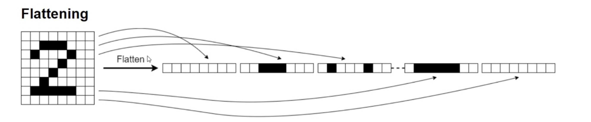

::: {.content-visible unless-format="revealjs"}
By flattening the image, we convert the 2D grid of pixels (a rank-2 tensor) into a single long vector (a rank-1 tensor), turning the dataset into a tabular one.
The pixel values are all still there, but the model loses track of which pixels were neighbours --- it can no longer exploit the 2D spatial structure that convolution relies on.
:::

```{python}
num_classes = np.unique(y_train).shape[0]       #<1>
random.seed(123)
model = Sequential([
  Input((img_height, img_width, 1)), Flatten(), Rescaling(1./255),
  Dense(num_classes, activation="softmax")
])
```
1. Specifies the number of unique categories in the train set

::: {.callout-tip}
The `Rescaling` layer will rescale the intensities to [0, 1].
:::

## Inspecting the model

```{python}
model.summary()                            
```

## Plot the model

```{python}
plot_model(model, show_shapes=True)
```

```{python}
#| echo: false
Path("model.png").unlink(missing_ok=True)
```

## Fitting the model

```{python}
#| eval: false
loss = keras.losses.SparseCategoricalCrossentropy()
topk = keras.metrics.SparseTopKCategoricalAccuracy(k=5)
model.compile(optimizer='adam', loss=loss, metrics=['accuracy', topk])  #<1>

es = EarlyStopping(patience=15, restore_best_weights=True,
    monitor="val_accuracy", verbose=2)                                  #<2>
hist = model.fit(X_train, y_train, validation_data=(X_val, y_val),
    epochs=100, batch_size=128, callbacks=[es], verbose=0)                              #<3>
history = hist.history
```

1. Compile the model with specified optimizer (`"adam"`) and loss function (cross-entropy). The metrics we look at are accuracy and top-5 accuracy
2. Perform early stopping to fit the parameters, using the accuracy on the validation set to determine the stopping point
3. Fit the model with the optimized parameters

```{python}
#| echo: false
# Train the model, or load it from the cache if we've already trained it.
if Path("models/logistic.keras").exists():
    model = keras.models.load_model("models/logistic.keras")
    with open("models/logistic_history.json", "r") as json_file:
        history = json.load(json_file)
else:
    loss = keras.losses.SparseCategoricalCrossentropy()
    topk = keras.metrics.SparseTopKCategoricalAccuracy(k=5)
    model.compile(optimizer='adam', loss=loss, metrics=['accuracy', topk])
    es = EarlyStopping(patience=15, restore_best_weights=True,
        monitor="val_accuracy", verbose=2)
    hist = model.fit(X_train, y_train, validation_data=(X_val, y_val),
        epochs=100, batch_size=128, callbacks=[es], verbose=0)
    model.save("models/logistic.keras")
    history = hist.history
    with open("models/logistic_history.json", "w") as json_file:
        json.dump(history, json_file)
```

## Plot the loss/accuracy curves

```{python}
#| code-fold: true
def plot_history(history):
    epochs = range(len(history["loss"]))

    plt.subplot(1, 2, 1)
    plt.plot(epochs, history["accuracy"], label="Train")
    plt.plot(epochs, history["val_accuracy"], label="Val")
    plt.legend(loc="lower right")
    plt.title("Accuracy")

    plt.subplot(1, 2, 2)
    plt.plot(epochs, history["loss"], label="Train")
    plt.plot(epochs, history["val_loss"], label="Val")
    plt.legend(loc="upper right")
    plt.title("Loss")
    plt.show()
```

```{python}
plot_history(history)
```

## Look at the metrics

```{python}
print(model.evaluate(X_train, y_train, verbose=0))
print(model.evaluate(X_val, y_val, verbose=0))
```

```{python}
loss_value, accuracy, top5_accuracy = model.evaluate(X_val, y_val, verbose=0)
print(f"Validation Loss: {loss_value:.4f}")
print(f"Validation Accuracy: {accuracy:.4f}")
print(f"Validation Top 5 Accuracy: {top5_accuracy:.4f}")
```

::: {.content-visible unless-format="revealjs"}
::: {.callout-note}
Why is top-5 accuracy greater than accuracy?

* Accuracy: the proportion of guesses that are correct (the "guess" is the category with the highest implied probability)
* Top-5 accuracy: the proportion of the time that the top 5 categories (the 5 categories with the highest implied probabilities) include the correct answer
:::
:::

## Make a CNN

```{python}
random.seed(123)

model = Sequential([
  Input((img_height, img_width, 1)),
  Rescaling(1./255),                                                    #<1>
  Conv2D(16, 3, padding="same", activation="relu", name="conv1"),       #<2>
  MaxPooling2D(name="pool1"),                                           #<3>
  Conv2D(32, 3, padding="same", activation="relu", name="conv2"),
  MaxPooling2D(name="pool2"),
  Conv2D(64, 3, padding="same", activation="relu", name="conv3"),
  MaxPooling2D(name="pool3", pool_size=(4, 4)),
  Flatten(),                                                            #<4>
  Dense(64, activation="relu"),
  Dense(num_classes)           
])
```
1. Rescales the numeric representations of data which ranges from [0,255] into [0, 1] range
2. Applies the convolution layer. Here `padding="same"` ensures that the dimensions of the input and output matrices remain the same
3. Applies `MaxPooling`, which reduces the spatial dimensions by carrying forward the maximum value over an input window
4. Applies the `Flatten` layer to convert the 2D array (from pooling) into a single column vector, and passes through a couple of `Dense` layers to train the neural network for the specific classification problem.
Note that the output layer has number of neurons equal to `num_classes`, which corresponds to the number of unique classes in the output.

::: footer
Architecture inspired by [https://www.tensorflow.org/tutorials/images/classification](https://www.tensorflow.org/tutorials/images/classification).
:::

## Inspect the model

```{python}
model.summary()
```

## Plot the CNN

::: columns
::: {.column width="60%"}

```{python}
plot_model(model, show_shapes=True)
```

```{python}
#| echo: false
Path("model.png").unlink(missing_ok=True)
```
:::
::: {.column width="30%"}
.](images/xkcd-trained_a_neural_net_2x.png)
:::
:::

## Fit the CNN

```{python}
#| eval: false
loss = keras.losses.SparseCategoricalCrossentropy(from_logits=True)               #<1>
topk = keras.metrics.SparseTopKCategoricalAccuracy(k=5)                           #<2>
model.compile(optimizer='adam', loss=loss, metrics=['accuracy', topk])            #<3>

es = EarlyStopping(patience=15, restore_best_weights=True,
    monitor="val_accuracy", verbose=2)
hist = model.fit(X_train, y_train, validation_data=(X_val, y_val),
    epochs=100, batch_size=128, callbacks=[es], verbose=0)
history = hist.history
```

1. Defines the loss function with an added command `from_logits=True`. Doing this instead of defining a `softmax` function at the output `Dense` layer of the neural network is expected to be more numerically stable
2. Specifies a new metric to keep track of accuracy of the top 5 predicted classes. This means that, for each input image, the metric will consider whether the true class is among the top 5 predicted classes by the model
3. Compiles the model as usual with an optimizer, a loss function and metrics to monitor

```{python}
#| echo: false
# Train the model, or load it from the cache if we've already trained it.
if Path("models/cnn.keras").exists():
    model = keras.models.load_model("models/cnn.keras")
    with open("models/cnn_history.json", "r") as json_file:
        history = json.load(json_file)
else:
    loss = keras.losses.SparseCategoricalCrossentropy(from_logits=True)
    topk = keras.metrics.SparseTopKCategoricalAccuracy(k=5)
    model.compile(optimizer='adam', loss=loss, metrics=['accuracy', topk])
    es = EarlyStopping(patience=15, restore_best_weights=True,
        monitor="val_accuracy", verbose=2)
    hist = model.fit(X_train, y_train, validation_data=(X_val, y_val),
        epochs=100, batch_size=128, callbacks=[es], verbose=0)
    model.save("models/cnn.keras")
    history = hist.history
    with open("models/cnn_history.json", "w") as json_file:
        json.dump(history, json_file)
```

::: {.callout-tip}
Instead of using softmax activation, just added `from_logits=True` to the loss function; this is more numerically stable.
:::

## Plot the loss/accuracy curves

```{python}
plot_history(history)
```

## Look at the metrics

```{python}
print(model.evaluate(X_train, y_train, verbose=0))
print(model.evaluate(X_val, y_val, verbose=0))
```

```{python}
loss_value, accuracy, top5_accuracy = model.evaluate(X_test, y_test, verbose=0)
print(f"Test Loss: {loss_value:.4f}")
print(f"Test Accuracy: {accuracy:.4f}")
print(f"Test Top 5 Accuracy: {top5_accuracy:.4f}")
```

## Predict on the test set

Running `model.predict(X_test[0], verbose=0)` would crash. Why?

```{python}
print(X_test[0].shape)
print(X_test[0][np.newaxis, :].shape)
print(X_test[[0]].shape)
```

::: {.content-visible unless-format="revealjs"}
Make sure to check the shape of your data to ensure the right inputs to the functions.
:::


```{python}
model.predict(X_test[[0]], verbose=0)
```

::: {.content-visible unless-format="revealjs"}
Because we don't have the softmax activation function, the predicted values don't directly represent the probabilities (not between 0 and 1). However, the predicted values are ordered according to their respective implied probabilities. In other words, the category with the highest predicted value is the category with the highest implied probability.
:::


## Predict on the test set II

::: columns
::: column
```{python}
model.predict(X_test[[0]], verbose=0).argmax()
```

```{python}
class_names[model.predict(X_test[[0]], verbose=0).argmax()]
```
:::
::: column

```{python}
plt.imshow(X_test[0], cmap="gray");
```
:::
:::

::: {.content-visible unless-format="revealjs"}
The predicted category appears to be correct.
:::

## Take a look at the failure cases

```{python}
#| code-fold: true
def plot_failed_predictions(X, y, class_names, max_errors = 20,
            num_rows = 2, num_cols = 5, title_font=CHINESE_FONT):
    plt.figure(figsize=(num_cols * 2, num_rows * 2))
    errors = 0
    y_pred = model.predict(X, verbose=0)
    y_pred_classes = y_pred.argmax(axis=1)
    y_pred_probs = keras.ops.convert_to_numpy(keras.ops.softmax(y_pred)).max(axis=1)
    for i in range(len(y_pred)):
        if errors >= min(max_errors, num_rows * num_cols):
            break
        if y_pred_classes[i] != y[i]:
            plt.subplot(num_rows, num_cols, errors + 1)
            plt.imshow(X[i], cmap="gray")
            true_class = class_names[y[i]]
            pred_class = class_names[y_pred_classes[i]]
            conf = y_pred_probs[i]
            msg = f"{true_class} not {pred_class} ({conf*100:.0f}%)"
            plt.title(msg, fontproperties=title_font)
            plt.axis("off")
            errors += 1
```

```{python}
plot_failed_predictions(X_test, y_test, class_names)
```

::: {.content-visible unless-format="revealjs"}
By looking at the failure cases, we can ask ourselves:

* Was any of the data mislabeled?
* Are there common patterns in the failure cases? E.g. Two different characters that look similar
:::

## Confidence of predictions

```{python}
y_log = model.predict(X_test, verbose=0)                                #<1>
y_pred = keras.ops.convert_to_numpy(keras.activations.softmax(y_log))   #<2>
y_pred_class = np.argmax(y_pred, axis=1)                                #<3>
y_pred_prob = y_pred[np.arange(y_pred.shape[0]), y_pred_class]          #<4>

confidence_when_correct = y_pred_prob[y_pred_class == y_test]
confidence_when_wrong = y_pred_prob[y_pred_class != y_test]             #<5>
```

1. Make predictions on the test set
2. Convert the predictions to probabilities [0,1] using softmax activation function
3. Extract the category with the highest probability (the prediction's best guess)
4. Extract the *probability* of the above category
5. Split the probabilities between correct and incorrect guesses

::: columns
::: column
```{python}
plt.hist(confidence_when_correct);
```
:::
::: column
```{python}
plt.hist(confidence_when_wrong);
```
:::
:::

::: {.content-visible unless-format="revealjs"}
For correct guesses, almost all of them were at least 90% confident.
For incorrect guesses, the guesses were less confident on average, but most of the guesses were still at least 90% confident.
:::


# Hyperparameter Optimisation {visibility="uncounted"}

## How do we pick the best hyperparameters?

Make a range of potential values for each hyperparameter, and try many combinations of them.

> "hyper-parameter optimization should be regarded as a formal outer loop in the
learning process"
>
> ::: {style="text-align: right;"}
> — @bergstra2011algorithms [p. 1].
> :::


> "HPO faces several challenges which make it a hard problem in practice:
>
> - Function evaluations can be extremely expensive for large models (e.g., in deep learning), complex machine learning pipelines, or large datesets [sic].
> - The configuration space is often complex (comprising a mix of continuous, categorical and conditional hyperparameters) and high-dimensional. Furthermore, it is not always clear which of an algorithm’s hyperparameters need to be optimized, and in which ranges.
> - We usually don’t have access to a gradient of the loss function with respect to the hyperparameters."
> 
> ::: {style="text-align: right;"}
> — @feurer2019hyperparameter [p. 4]
> :::


## Could we just try every combination?

This technique, called grid search, would be too slow. Better to take random selections.

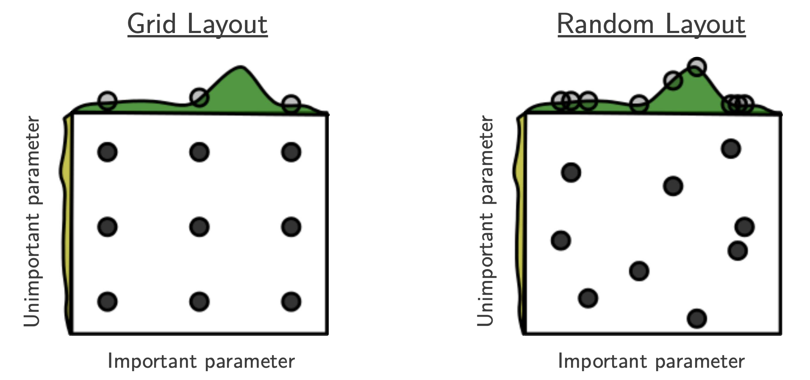.

::: footer
Source: Figure 1 directly from @bergstra2012random.
:::

## Optuna

```{python}
#| echo: false
if not Path("california-features.csv").exists():
  features, target = fetch_california_housing(as_frame=True, return_X_y=True)
  features.to_csv("california-features.csv", index=False)
  target.to_csv("california-target.csv", index=False)
else:
  features = pd.read_csv("california-features.csv")
  target = pd.read_csv("california-target.csv")

X_main, X_test, y_main, y_test = \
    train_test_split(features, target, test_size=0.2, random_state=1)

# As 0.25 x 0.8 = 0.2
X_train, X_val, y_train, y_val = \
    train_test_split(X_main, y_main, test_size=0.25, random_state=1)

X_train.shape, X_val.shape, X_test.shape

sc = StandardScaler()
sc.fit(X_train)
X_train_sc = sc.transform(X_train)
X_val_sc = sc.transform(X_val)
X_test_sc = sc.transform(X_test)
```

```{python}
def objective(trial):
    keras.utils.set_random_seed(trial.number) #<1>
    model = Sequential()
    model.add(Dense(
        trial.suggest_categorical("neurons", [4, 8, 16, 32, 64, 128, 256]),
        activation=trial.suggest_categorical("activation",
            ["relu", "leaky_relu", "tanh"]),
    ))
    model.add(Dense(1, activation="exponential"))

    learning_rate = trial.suggest_float("lr", 1e-4, 1e-2, log=True)
    opt = keras.optimizers.Adam(learning_rate=learning_rate)
    model.compile(optimizer=opt, loss="poisson")

    es = EarlyStopping(patience=3, restore_best_weights=True)
    model.fit(X_train_sc, y_train, epochs=100, batch_size=256,
        callbacks=[es], validation_data=(X_val_sc, y_val), verbose=0)

    return model.evaluate(X_val_sc, y_val, verbose=0)
```
1. Seeding with the trial number makes each model's weight initialisation and mini-batch shuffling reproducible, so the winning trial can be rebuilt exactly afterwards.

::: {.content-visible unless-format="revealjs"}
The hyperparameters we are tuning are:

* The number of neurons in each hidden layer
* The activation functions for the hidden layers
* The learning rate for the Adam optimiser

We give the model a few choices for the first two (the learning rate is continuous). Note that with Optuna, the `objective` function handles the entire training loop and returns the validation loss. Optuna then uses this to decide which hyperparameters to try next.
:::

## Do a random search

```{python}
sampler = optuna.samplers.RandomSampler(seed=123)
study = optuna.create_study(direction="minimize", sampler=sampler)

study.optimize(objective, n_trials=10)
```

```{python}
print(f"Best value: {study.best_trial.value:.4f}")
print(f"Best params:")
for k, v in study.best_trial.params.items():
    print(f"  {k}: {v}")
```

::: {.content-visible unless-format="revealjs"}
The model runs through 10 random combinations of the hyperparameters and returns the one where the loss on the validation set is minimised.
:::

## Recover the winning model

Because each trial seeded itself with its own trial number, we can rebuild the *exact* winning model from its saved parameters --- no need to store the trained weights.

```{python}
p = study.best_trial.params
keras.utils.set_random_seed(study.best_trial.number)

best_model = Sequential([
    Dense(p["neurons"], activation=p["activation"]),
    Dense(1, activation="exponential"),
])
best_model.compile(optimizer=keras.optimizers.Adam(p["lr"]), loss="poisson")

es = EarlyStopping(patience=3, restore_best_weights=True)
best_model.fit(X_train_sc, y_train, epochs=100, batch_size=256,
    callbacks=[es], validation_data=(X_val_sc, y_val), verbose=0)

print(f"Rebuilt loss: {best_model.evaluate(X_val_sc, y_val, verbose=0):.4f}")
print(f"Tuning best:  {study.best_trial.value:.4f}")
```

::: {.content-visible unless-format="revealjs"}
The rebuilt model's validation loss matches the value found during tuning, confirming we have recovered the same model. The seed must be set at the top of the function --- before the model is built and trained --- since it controls both the weight initialisation and the order the training data is shuffled in.
:::

## Tune layers separately

```{python}
def objective(trial):
    keras.utils.set_random_seed(trial.number)
    model = Sequential()

    for i in range(trial.suggest_int("numHiddenLayers", 1, 3)):
        model.add(Dense(
            trial.suggest_categorical(f"neurons_{i}", [8, 16, 32, 64]),
            activation="relu"))
    model.add(Dense(1, activation="exponential"))

    opt = keras.optimizers.Adam(learning_rate=0.0005)
    model.compile(optimizer=opt, loss="poisson")

    es = EarlyStopping(patience=3, restore_best_weights=True)
    model.fit(X_train_sc, y_train, epochs=100, batch_size=256,
        callbacks=[es], validation_data=(X_val_sc, y_val), verbose=0)

    return model.evaluate(X_val_sc, y_val, verbose=0)
```

::: {.content-visible unless-format="revealjs"}
This time, we let the number of neurons in each hidden layer be tuned separately. For this example we are not tuning the activation functions or the learning rate.
:::

## Do a Bayesian search

```{python}
sampler = optuna.samplers.TPESampler(seed=123, n_startup_trials=5) #<1>
study = optuna.create_study(direction="minimize", sampler=sampler)

study.optimize(objective, n_trials=10)
```
1. Optuna uses a _Tree-structured Parzen Estimator_ (TPE) by default, which is a Bayesian method. Passing a `seed` makes the search reproducible. The first `n_startup_trials` are sampled randomly to seed the model (the default is 10); we lower it to 5 so the later trials are actually chosen by TPE.

```{python}
print(f"Best value: {study.best_trial.value:.4f}")
print(f"Best params:")
for k, v in study.best_trial.params.items():
    print(f"  {k}: {v}")
```

::: {.callout-tip}
Neural networks are sensitive to their random initialisation: a hyperparameter combination that looks good (or bad) on a single run might just have been lucky. A more robust approach is to train 3--5 models with the same hyperparameters but different random seeds, and average the validation loss --- selecting architectures that perform well _and_ reliably.
:::

::: {.content-visible unless-format="revealjs"}
Bayesian search is not purely random, and updates its beliefs about the optimal hyperparameter values based on past models. Bayesian search balances *exploration* of new hyperparameter values and *exploitation* of the values that are expected to be optimal. Optuna's default sampler is the Tree-structured Parzen Estimator (TPE), which is a Bayesian optimization algorithm. Passing a `seed` to the sampler ensures the same sequence of hyperparameters is tried each time.

In the objective function, instead of returning the loss from a single fit, you would loop over a few seeds, refit each time, and return the mean validation loss. This is slower but gives you much more confidence that the chosen hyperparameters are genuinely good rather than a fluke.
:::

::: footer
See @bergstra2011algorithms [Sec. 4] for details of the Tree-structured Parzen Estimator approach.
:::

<!--
# Leverage Past Work {visibility="uncounted"}

## Benchmarks

[CIFAR-10 / CIFAR-100 dataset](https://www.cs.toronto.edu/~kriz/cifar.html) from Canadian Institute for Advanced Research

- 10 classes: 60000 32x32 colour images
- 100 classes: 60000 32x32 colour images

[ImageNet](https://www.image-net.org/index.php) and the _ImageNet Large Scale Visual Recognition Challenge (ILSVRC)_; originally [1,000 synsets](https://image-net.org/challenges/LSVRC/2014/browse-synsets).

- In 2022: 14,197,122 labelled images from 21,841 synsets.
- See [Keras applications](https://keras.io/api/applications/) for downloadable models.
-->


# Transfer Learning {visibility="uncounted"}


## Demo: Object classification

::: columns
::: column
](images/teach-images.png){width="65%"}
:::
::: column
{width="80%"}
:::
:::

::: {.content-visible unless-format="revealjs"}
How are these classification models so accurate?
:::

<!-- ## How does that work? -->

> "... these models use a technique called transfer learning. There’s a pretrained neural network, and when you create your own classes, you can sort of picture that your classes are becoming the last layer or step of the neural net. Specifically, both the image and pose models are learning off of pretrained mobilenet models ..."

::: footer
Source: [Teachable Machine FAQ](https://teachablemachine.withgoogle.com/faq#Diving-Deeper)
:::

::: {.content-hidden unless-format="revealjs"}



:::

## Transfer learned model

```{python}
#| output: false
#| eval: false 
model_file = "converted_keras/keras_model.h5"
model = keras.models.load_model(model_file)
```

```{python}
#| eval: false
model.layers[0].layers[0].layers
```

```{python}
#| echo: false
print("""[<InputLayer name=input_1, built=True>,
<ZeroPadding2D name=Conv1_pad, built=True>,
<Conv2D name=Conv1, built=True>,
<BatchNormalization name=bn_Conv1, built=True>,
<ReLU name=Conv1_relu, built=True>,
<DepthwiseConv2D name=expanded_conv_depthwise, built=True>,
<BatchNormalization name=expanded_conv_depthwise_BN, built=True>,
<ReLU name=expanded_conv_depthwise_relu, built=True>,
<Conv2D name=expanded_conv_project, built=True>,
<BatchNormalization name=expanded_conv_project_BN, built=True>,
<Conv2D name=block_1_expand, built=True>,
<BatchNormalization name=block_1_expand_BN, built=True>,
<ReLU name=block_1_expand_relu, built=True>,
<ZeroPadding2D name=block_1_pad, built=True>,
<DepthwiseConv2D name=block_1_depthwise, built=True>,
<BatchNormalization name=block_1_depthwise_BN, built=True>,
<ReLU name=block_1_depthwise_relu, built=True>,
<Conv2D name=block_1_project, built=True>,
<BatchNormalization name=block_1_project_BN, built=True>,
<Conv2D name=block_2_expand, built=True>,
<BatchNormalization name=block_2_expand_BN, built=True>,
<ReLU name=block_2_expand_relu, built=True>,
<DepthwiseConv2D name=block_2_depthwise, built=True>,
<BatchNormalization name=block_2_depthwise_BN, built=True>,
<ReLU name=block_2_depthwise_relu, built=True>,
<Conv2D name=block_2_project, built=True>,
<BatchNormalization name=block_2_project_BN, built=True>,
<Add name=block_2_add, built=True>,
<Conv2D name=block_3_expand, built=True>,
<BatchNormalization name=block_3_expand_BN, built=True>,
<ReLU name=block_3_expand_relu, built=True>,
<ZeroPadding2D name=block_3_pad, built=True>,
<DepthwiseConv2D name=block_3_depthwise, built=True>,
<BatchNormalization name=block_3_depthwise_BN, built=True>,
<ReLU name=block_3_depthwise_relu, built=True>,
<Conv2D name=block_3_project, built=True>,
<BatchNormalization name=block_3_project_BN, built=True>,
<Conv2D name=block_4_expand, built=True>,
<BatchNormalization name=block_4_expand_BN, built=True>,
<ReLU name=block_4_expand_relu, built=True>,
<DepthwiseConv2D name=block_4_depthwise, built=True>,
<BatchNormalization name=block_4_depthwise_BN, built=True>,
<ReLU name=block_4_depthwise_relu, built=True>,
<Conv2D name=block_4_project, built=True>,
<BatchNormalization name=block_4_project_BN, built=True>,
<Add name=block_4_add, built=True>,
<Conv2D name=block_5_expand, built=True>,
<BatchNormalization name=block_5_expand_BN, built=True>,
<ReLU name=block_5_expand_relu, built=True>,
<DepthwiseConv2D name=block_5_depthwise, built=True>,
<BatchNormalization name=block_5_depthwise_BN, built=True>,
<ReLU name=block_5_depthwise_relu, built=True>,
<Conv2D name=block_5_project, built=True>,
<BatchNormalization name=block_5_project_BN, built=True>,
<Add name=block_5_add, built=True>,
<Conv2D name=block_6_expand, built=True>,
<BatchNormalization name=block_6_expand_BN, built=True>,
<ReLU name=block_6_expand_relu, built=True>,
<ZeroPadding2D name=block_6_pad, built=True>,
<DepthwiseConv2D name=block_6_depthwise, built=True>,
<BatchNormalization name=block_6_depthwise_BN, built=True>,
<ReLU name=block_6_depthwise_relu, built=True>,
<Conv2D name=block_6_project, built=True>,
<BatchNormalization name=block_6_project_BN, built=True>,
<Conv2D name=block_7_expand, built=True>,
<BatchNormalization name=block_7_expand_BN, built=True>,
<ReLU name=block_7_expand_relu, built=True>,
<DepthwiseConv2D name=block_7_depthwise, built=True>,
<BatchNormalization name=block_7_depthwise_BN, built=True>,
<ReLU name=block_7_depthwise_relu, built=True>,
<Conv2D name=block_7_project, built=True>,
<BatchNormalization name=block_7_project_BN, built=True>,
<Add name=block_7_add, built=True>,
<Conv2D name=block_8_expand, built=True>,
<BatchNormalization name=block_8_expand_BN, built=True>,
<ReLU name=block_8_expand_relu, built=True>,
<DepthwiseConv2D name=block_8_depthwise, built=True>,
<BatchNormalization name=block_8_depthwise_BN, built=True>,
<ReLU name=block_8_depthwise_relu, built=True>,
<Conv2D name=block_8_project, built=True>,
<BatchNormalization name=block_8_project_BN, built=True>,
<Add name=block_8_add, built=True>,
<Conv2D name=block_9_expand, built=True>,
<BatchNormalization name=block_9_expand_BN, built=True>,
<ReLU name=block_9_expand_relu, built=True>,
<DepthwiseConv2D name=block_9_depthwise, built=True>,
<BatchNormalization name=block_9_depthwise_BN, built=True>,
<ReLU name=block_9_depthwise_relu, built=True>,
<Conv2D name=block_9_project, built=True>,
<BatchNormalization name=block_9_project_BN, built=True>,
<Add name=block_9_add, built=True>,
<Conv2D name=block_10_expand, built=True>,
<BatchNormalization name=block_10_expand_BN, built=True>,
<ReLU name=block_10_expand_relu, built=True>,
<DepthwiseConv2D name=block_10_depthwise, built=True>,
<BatchNormalization name=block_10_depthwise_BN, built=True>,
<ReLU name=block_10_depthwise_relu, built=True>,
<Conv2D name=block_10_project, built=True>,
<BatchNormalization name=block_10_project_BN, built=True>,
<Conv2D name=block_11_expand, built=True>,
<BatchNormalization name=block_11_expand_BN, built=True>,
<ReLU name=block_11_expand_relu, built=True>,
<DepthwiseConv2D name=block_11_depthwise, built=True>,
<BatchNormalization name=block_11_depthwise_BN, built=True>,
<ReLU name=block_11_depthwise_relu, built=True>,
<Conv2D name=block_11_project, built=True>,
<BatchNormalization name=block_11_project_BN, built=True>,
<Add name=block_11_add, built=True>,
<Conv2D name=block_12_expand, built=True>,
<BatchNormalization name=block_12_expand_BN, built=True>,
<ReLU name=block_12_expand_relu, built=True>,
<DepthwiseConv2D name=block_12_depthwise, built=True>,
<BatchNormalization name=block_12_depthwise_BN, built=True>,
<ReLU name=block_12_depthwise_relu, built=True>,
<Conv2D name=block_12_project, built=True>,
<BatchNormalization name=block_12_project_BN, built=True>,
<Add name=block_12_add, built=True>,
<Conv2D name=block_13_expand, built=True>,
<BatchNormalization name=block_13_expand_BN, built=True>,
<ReLU name=block_13_expand_relu, built=True>,
<ZeroPadding2D name=block_13_pad, built=True>,
<DepthwiseConv2D name=block_13_depthwise, built=True>,
<BatchNormalization name=block_13_depthwise_BN, built=True>,
<ReLU name=block_13_depthwise_relu, built=True>,
<Conv2D name=block_13_project, built=True>,
<BatchNormalization name=block_13_project_BN, built=True>,
<Conv2D name=block_14_expand, built=True>,
<BatchNormalization name=block_14_expand_BN, built=True>,
<ReLU name=block_14_expand_relu, built=True>,
<DepthwiseConv2D name=block_14_depthwise, built=True>,
<BatchNormalization name=block_14_depthwise_BN, built=True>,
<ReLU name=block_14_depthwise_relu, built=True>,
<Conv2D name=block_14_project, built=True>,
<BatchNormalization name=block_14_project_BN, built=True>,
<Add name=block_14_add, built=True>,
<Conv2D name=block_15_expand, built=True>,
<BatchNormalization name=block_15_expand_BN, built=True>,
<ReLU name=block_15_expand_relu, built=True>,
<DepthwiseConv2D name=block_15_depthwise, built=True>,
<BatchNormalization name=block_15_depthwise_BN, built=True>,
<ReLU name=block_15_depthwise_relu, built=True>,
<Conv2D name=block_15_project, built=True>,
<BatchNormalization name=block_15_project_BN, built=True>,
<Add name=block_15_add, built=True>,
<Conv2D name=block_16_expand, built=True>,
<BatchNormalization name=block_16_expand_BN, built=True>,
<ReLU name=block_16_expand_relu, built=True>,
<DepthwiseConv2D name=block_16_depthwise, built=True>,
<BatchNormalization name=block_16_depthwise_BN, built=True>,
<ReLU name=block_16_depthwise_relu, built=True>,
<Conv2D name=block_16_project, built=True>,
<BatchNormalization name=block_16_project_BN, built=True>,
<Conv2D name=Conv_1, built=True>,
<BatchNormalization name=Conv_1_bn, built=True>,
<ReLU name=out_relu, built=True>]""")
```

```{python}
#| eval: false
len(model.layers[0].layers[0].layers)
```

```{python}
#| echo: false
print(155)
```

::: {.content-visible unless-format="revealjs"}
The model has 155 layers.
:::

## The original pretrained model

<div style="overflow:auto; height: 90%">

</div>


## Transfer learning

```python
# Pull in the base model we are transferring from.
base_model = keras.applications.Xception(
    weights="imagenet",  # Load weights pre-trained on ImageNet.
    input_shape=(150, 150, 3),
    include_top=False,
)  # Discard the ImageNet classifier at the top.

# Tell it not to update its weights.
base_model.trainable = False

# Make our new model on top of the base model.
inputs = Input(shape=(150, 150, 3))
x = base_model(inputs, training=False)
x = GlobalAveragePooling2D()(x)
outputs = Dense(1)(x)
model = Model(inputs, outputs)

# Compile and fit on our data.
model.compile(
    optimizer=keras.optimizers.Adam(),
    loss=keras.losses.BinaryCrossentropy(from_logits=True),
    metrics=[keras.metrics.BinaryAccuracy()],
)
model.fit(new_dataset, epochs=2, callbacks=..., validation_data=...)
```

::: footer
Source: François Chollet (2020), [Transfer learning & fine-tuning](https://keras.io/guides/transfer_learning/), Keras documentation.
:::

## Fine-tuning

```python
# Unfreeze the base model
base_model.trainable = True

# It's important to recompile your model after you make any changes
# to the `trainable` attribute of any inner layer, so that your changes
# are take [sic] into account
model.compile(
    optimizer=keras.optimizers.Adam(1e-5),  # Very low learning rate
    loss=keras.losses.BinaryCrossentropy(from_logits=True),
    metrics=[keras.metrics.BinaryAccuracy()],
)

# Train end-to-end. Be careful to stop before you overfit!
model.fit(new_dataset, epochs=1, callbacks=..., validation_data=...)
```

::: {.callout-caution}
Keep the learning rate low, otherwise you may accidentally throw away the useful information in the base model.
:::

::: footer
Source: François Chollet (2020), [Transfer learning & fine-tuning](https://keras.io/guides/transfer_learning/), Keras documentation.
:::

## Package Versions {.appendix data-visibility="uncounted"}

```{python}
from watermark import watermark
print(watermark(python=True, packages="keras,matplotlib,numpy,pandas,seaborn,scipy,torch"))
```

## Glossary {.appendix data-visibility="uncounted"}

::: columns
::: column

- AlexNet
- channels
- computer vision
- convolutional layer
- convolutional network
- filter
- ImageNet challenge
- fine-tuning
:::
::: column
- flatten layer
- kernel
- max pooling
- MNIST
- stride
- tensor (rank)
- transfer learning
:::
:::

## References {visibility="uncounted"}

::: {#refs}
:::