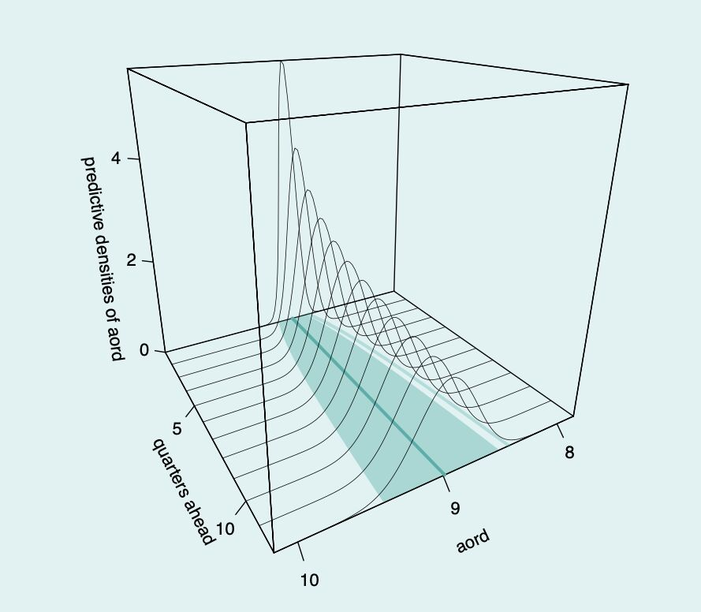
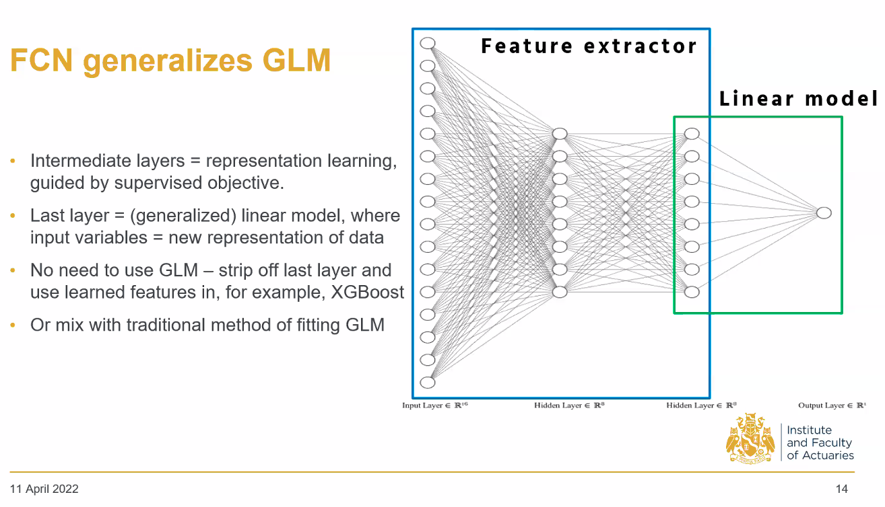
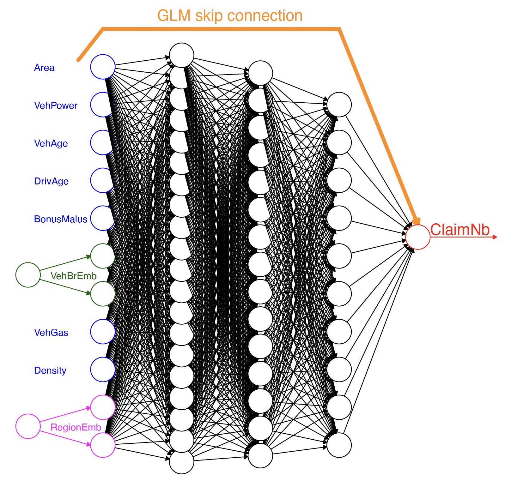
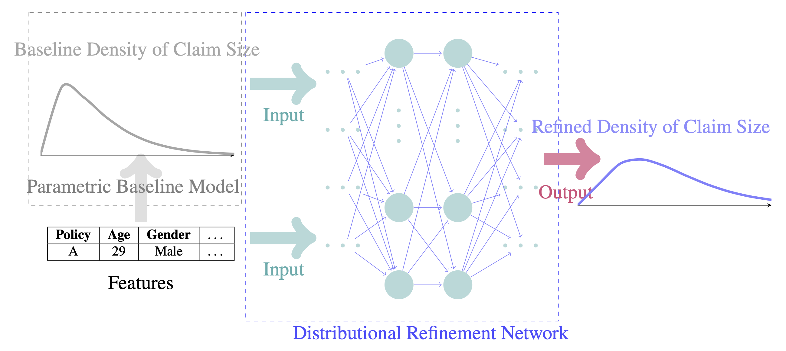
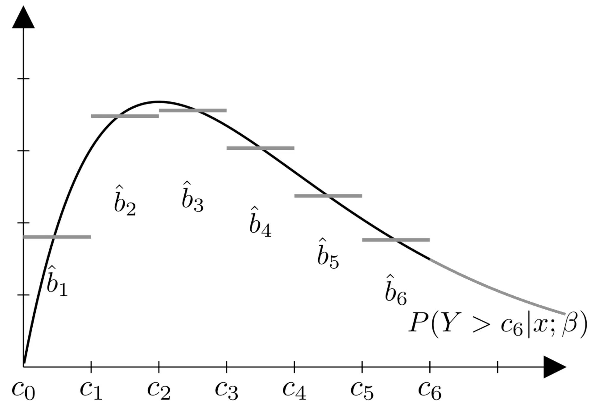
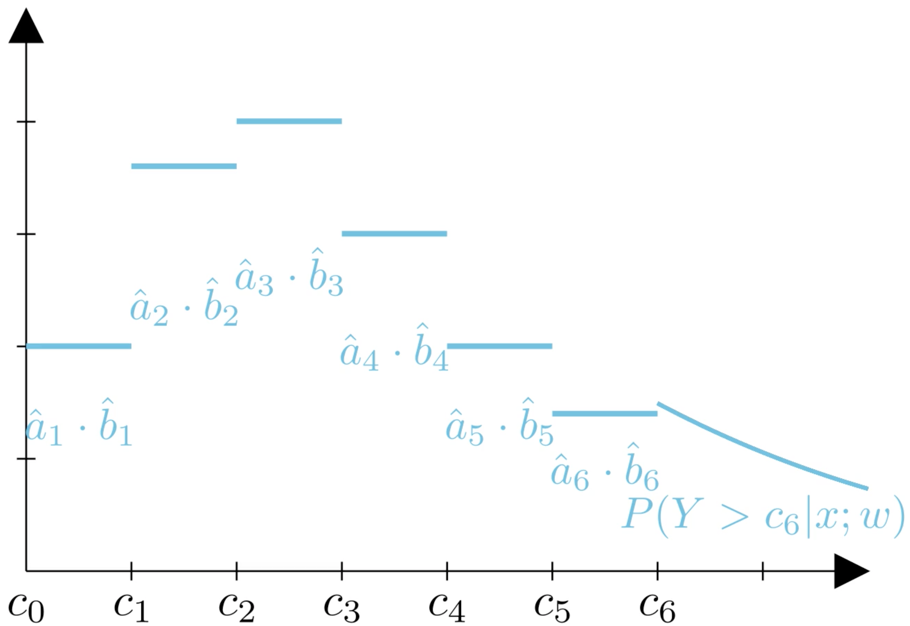
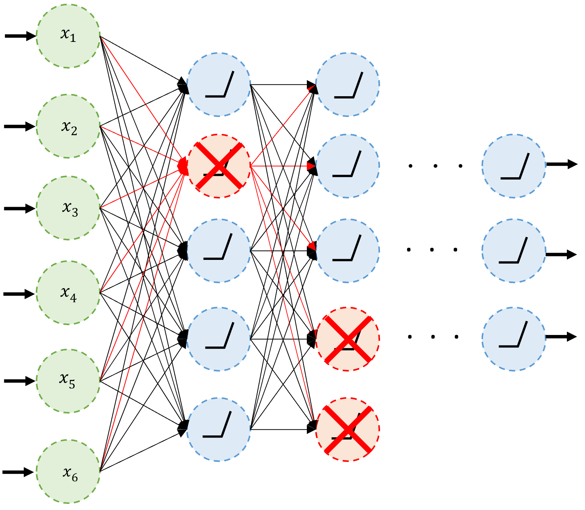
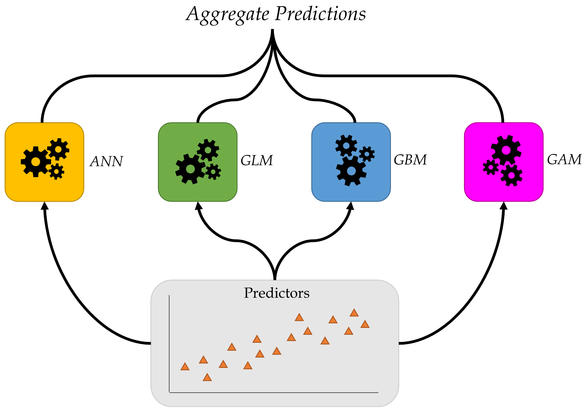

```{python}
#| echo: false
#| warning: false
from setup import *

# scipy.stats isn't provided by setup, but the early illustrative plots need it
# (the visible imports slide later re-imports it for the students).
import scipy.stats as stats

pandas.options.display.max_rows = 5

import os
```

# Introduction {visibility="uncounted"}

## Why actuaries avoid neural networks

They're not _inherently interpretable_, so we just have to look at inputs and outputs from the black box.

::: fragment
Neural network models typically just output a prediction without any sense of its _confidence_.
:::

::: fragment
Therefore we cannot _trust_ the neural network models, which is a **dealbreaker**.
:::

::: fragment
Now let's focus on actuarial problems.
:::

## Car insurance

Claim size prediction

::: columns
::: {.column width=5%}
:::
::: {.column width=60%}

| 👤 **Age** | 🚗 **Age** |  🏎️ **Type** |
|------------|-----------|------------------|
| 25         | 3         | 🚙 Sedan         |
| 40         | 5         | 🚐 SUV           |
| 19         | 1         | 🏎️ Sports Car    |
| 60         | 10        | 🚘 Hatchback     | 

:::
::: {.column width=10%}

<br>
<br>

::: {.fragment}

$$\longrightarrow$$

:::


:::
::: {.column width=20%}

::: {.fragment}

| **Cost** |
|-------------------|
| 💵 $1,200          |
| 💵 $2,500          |
| 💵 $3,800          |
| 💵 $800            |

:::

:::
:::

::: {.fragment}
What's wrong? Not enough rows? Not enough columns?
:::

::: {.content-visible unless-format="revealjs"}
These claim size predictions are not genuine future predictions --- the next claim that a 40-year-old with a 5-year-old SUV makes will probably not be $2,500. That's only a _best guess_.
:::

```{python}
#| echo: false
data = [
    (25, 3, "🚙", 1200),  # (Driver Age, Car Age, Type of Car, Repair Cost)
    (40, 5, "🚐", 2500),
    (19, 1, "🏎️", 3800),
    (60, 10, "🚘", 800)
]

x = numpy.linspace(0, 5000, 1000)

def draw_gamma_distribution(mean, shape, color, customer_id):
  scale = mean / shape
  plt.plot(x, stats.gamma.pdf(x, a=shape, scale=scale), label=f"Customer {customer_id+1}", color=color)
  plt.title(f"Predicted Claim Size Distribution")
  plt.xlabel("Claim size")
  plt.ylabel("Density")
```


## Distributional regression

Customer 1 = (25, 3, 🚙)
```{python}
#| echo: false
draw_gamma_distribution(1200, 2, COLOURS[0], 0)
```

::: {.content-visible unless-format="revealjs"}
What we are trying to predict is fundamentally unpredictable. Rather than making a 100% confident prediction on a customer's next claim, the distributional regression model returns a range of possible claim sizes, namely, a distribution of predicted claim sizes for a given customer.

Based on the distribution output, actuaries can obtain risk measures such as expected claim size, variance, Value at Risk, etc. 
:::

## Distributional regression {data-visibility=uncounted .unlisted}

Customer 2 = (40, 5, 🚐)
```{python}
#| echo: false
draw_gamma_distribution(2500, 2, COLOURS[1], 1)
```

## Distributional regression {data-visibility=uncounted .unlisted}

Customer 3 = (19, 1, 🏎️)
```{python}
#| echo: false
draw_gamma_distribution(3800, 2, COLOURS[2], 2)
```

## Distributional regression {data-visibility=uncounted .unlisted}

Customer 4 = (60, 10, 🚘)
```{python}
#| echo: false
draw_gamma_distribution(800, 2, COLOURS[3], 3)
```

## Distributional regression {data-visibility=uncounted .unlisted}

All customers

```{python}
#| echo: false
# Plot all on the same graph
plt.figure()
for i, (age, car_age, car_type, cost) in enumerate(data):
  mean = cost
  shape = 2  # Example shape parameter for the gamma distribution
  scale = mean / shape  # Scale parameter to achieve the correct mean

  plt.plot(x, stats.gamma.pdf(x, a=shape, scale=scale), label=f"Customer {i+1}", color=COLOURS[i])

plt.title(f"Predicted Claim Size Distribution")
plt.xlabel("Claim size")
plt.ylabel("Density")
plt.legend()
```

## One model, many distributions

Feed in a _batch_ of customers and the model returns a predicted claim-size distribution for _each_ one.

```{python}
#| echo: false
import matplotlib.patches as mpatches

batch = [
    (25, 3, "Sedan", 1200),   # (driver age, car age, type, mean claim)
    (40, 5, "SUV", 2500),
    (19, 1, "Sports", 3800),
    (60, 10, "Hatch", 800),
]
xgrid = numpy.linspace(0, 6000, 400)
GSHAPE = 2  # gamma shape parameter used for every customer


ARROW_INSET = 0.01  # gap between an arrow tip and the box it points at


def _arrow(bg, x0, x1, y=0.5):
    bg.annotate("", xy=(x1, y), xytext=(x0, y),
                arrowprops=dict(arrowstyle="-|>", lw=1.5, color="black"))


def _data_table(fig, pos, rows):
    # bbox=[0, 0, 1, 1] makes the table fill its axes exactly, so its visible
    # edges match `pos` (arrows can connect cleanly) and every row is tall
    # enough for the two-line headers. Returns the visible right edge.
    ax = fig.add_axes(pos); ax.axis("off")
    tbl = ax.table(cellText=rows, colLabels=["Driver\nage", "Car\nage", "Type"],
                   cellLoc="center", bbox=[0, 0, 1, 1])
    tbl.auto_set_font_size(False); tbl.set_fontsize(11)
    for (r, _c), cell in tbl.get_celld().items():
        cell.set_edgecolor("#AAAAAA")
        if r == 0:
            cell.set_facecolor("#ECECEC"); cell.set_text_props(weight="bold")
    return pos[0] + pos[2]


def _pdf_positions(n, x0, x1, ybottom=0.14, ytop=0.86, gap=0.025):
    each = (ytop - ybottom - (n - 1) * gap) / n
    return [(x0, ytop - i * (each + gap) - each, x1 - x0, each) for i in range(n)]


def draw_pipeline_diagram(with_params=False):
    n = len(batch)
    fig = plt.figure(figsize=(11, 5.2))
    bg = fig.add_axes([0, 0, 1, 1])
    bg.set_xlim(0, 1); bg.set_ylim(0, 1); bg.axis("off")

    # Columns are laid out with equal gaps so every arrow has the same length.
    if with_params:
        table_pos = [0.02, 0.30, 0.20, 0.40]
        box_l, box_r = 0.33, 0.46
        param_x0, param_x1 = 0.57, 0.71
        pdf_x0, pdf_x1 = 0.82, 0.99
    else:
        table_pos = [0.04, 0.30, 0.24, 0.40]
        box_l, box_r = 0.39, 0.55
        pdf_x0, pdf_x1 = 0.66, 0.99
    box_cx = (box_l + box_r) / 2

    # left column: the batch of input data
    table_r = _data_table(fig, table_pos,
                          [[str(a), str(c), t] for (a, c, t, _) in batch])
    bg.text((table_pos[0] + table_r) / 2, 0.93, "Batch of data",
            ha="center", va="bottom", fontsize=12, weight="bold")

    # middle column: the neural network box
    box = mpatches.FancyBboxPatch(
        (box_l, 0.5 - 0.17), box_r - box_l, 0.34,
        boxstyle="round,pad=0.008,rounding_size=0.02",
        linewidth=1.5, edgecolor="black", facecolor=COLOURS[0], alpha=0.55)
    bg.add_patch(box)
    bg.text(box_cx, 0.5, "Neural\nnetwork", ha="center", va="center",
            fontsize=13, weight="bold")

    # right column: one predicted distribution per input row
    positions = _pdf_positions(n, pdf_x0, pdf_x1)
    for i, pos in enumerate(positions):
        ax = fig.add_axes(pos)
        y = stats.gamma.pdf(xgrid, a=GSHAPE, scale=batch[i][3] / GSHAPE)
        ax.plot(xgrid, y, color=COLOURS[i], lw=1.8)
        ax.fill_between(xgrid, y, color=COLOURS[i], alpha=0.25)
        ax.set_yticks([]); ax.set_xlim(0, 6000)
        for s in ("left", "right", "top"):
            ax.spines[s].set_visible(False)
        if i < n - 1:
            ax.set_xticks([]); ax.spines["bottom"].set_visible(False)
        else:
            ax.set_xticks([0, 3000, 6000]); ax.tick_params(labelsize=8)
    bg.text((pdf_x0 + pdf_x1) / 2, 0.93, "Distributions",
            ha="center", va="bottom", fontsize=12, weight="bold")
    bg.text((pdf_x0 + pdf_x1) / 2, 0.045, "Claim size",
            ha="center", va="center", fontsize=9)

    if with_params:
        # extra column: the parameters the network emits for each row
        for i, pos in enumerate(positions):
            cy = pos[1] + pos[3] / 2
            bg.text((param_x0 + param_x1) / 2, cy,
                    f"$\\alpha={GSHAPE}$\n$\\beta={batch[i][3] / GSHAPE:.0f}$",
                    ha="center", va="center", fontsize=11,
                    bbox=dict(boxstyle="round,pad=0.3", fc="white",
                              ec=COLOURS[i], lw=1.6))
        bg.text((param_x0 + param_x1) / 2, 0.93, "Parameters",
                ha="center", va="bottom", fontsize=12, weight="bold")
        _arrow(bg, table_r + ARROW_INSET, box_l - ARROW_INSET)
        _arrow(bg, box_r + ARROW_INSET, param_x0 - ARROW_INSET)
        _arrow(bg, param_x1 + ARROW_INSET, pdf_x0 - ARROW_INSET)
    else:
        _arrow(bg, table_r + ARROW_INSET, box_l - ARROW_INSET)
        _arrow(bg, box_r + ARROW_INSET, pdf_x0 - ARROW_INSET)

    plt.show()


draw_pipeline_diagram(with_params=False)
```

::: {.content-visible unless-format="revealjs"}
The same network is applied to every row of the batch, and for each customer it returns a full predicted claim-size distribution rather than a single number.
:::

## Predicting distribution parameters

In practice the network doesn't emit a whole curve --- it emits the _parameters_ of a chosen distribution family, which then define the distribution.

```{python}
#| echo: false
draw_pipeline_diagram(with_params=True)
```

::: {.content-visible unless-format="revealjs"}
Here the network maps each input $\mathbf{x}_i$ to a parameter vector $\theta_i = (\alpha_i, \beta_i)$. Those parameters are then plugged into the assumed family (a gamma here) to give the predicted distribution for customer $i$.
:::

## Anatomy of a predicted distribution

From a _single_ predicted distribution we can read off the _mean_, the _variance_, and high _quantiles_ (e.g. Value-at-Risk).

```{python}
#| echo: false
import matplotlib.patches as mpatches

# A multimodal predicted claim-size distribution (mixture of gammas)
mix = [
    (0.45, stats.gamma(a=15, scale=60)),    # mode near 840
    (0.35, stats.gamma(a=25, scale=100)),   # mode near 2400
    (0.20, stats.gamma(a=30, scale=140)),   # mode near 4060
]
xx = numpy.linspace(0, 6500, 5000)
pdf = sum(w * c.pdf(xx) for w, c in mix)
cdf = sum(w * c.cdf(xx) for w, c in mix)

mean = sum(w * c.mean() for w, c in mix)
ex2 = sum(w * (c.var() + c.mean() ** 2) for w, c in mix)
sd = numpy.sqrt(ex2 - mean ** 2)

quantiles = [0.90, 0.95, 0.99]
qx = numpy.interp(quantiles, cdf, xx)

fig, ax = plt.subplots(figsize=(8, 4.3))
ymax = pdf.max()
ax.plot(xx, pdf, color=COLOURS[3], lw=2.2)
ax.fill_between(xx, pdf, color=COLOURS[3], alpha=0.15)

# the mean: label sits to the right of the line so the line doesn't cross it
ax.axvline(mean, color="black", lw=2, ls="--")
ax.text(mean + 90, ymax * 1.16, f"Mean = {mean:,.0f}", ha="left", va="top",
        fontsize=10, weight="bold")

# the variance as a +/- 1 SD span; the label floats above the arrow, to the
# right of the mean line and clear of both modes
ax.axvspan(mean - sd, mean + sd, color="0.5", alpha=0.12)
ax.annotate("", xy=(mean + sd, ymax * 0.42), xytext=(mean - sd, ymax * 0.42),
            arrowprops=dict(arrowstyle="<|-|>", color="0.4", lw=1.8))
ax.text(mean + 120, ymax * 0.62, f"$\\pm$1 SD  (Var $=$ {sd ** 2:,.0f})",
        ha="left", va="bottom", fontsize=9, color="0.35")

# a few high quantiles (staggered vertically so the labels don't collide)
qheights = [0.95, 0.75, 0.55]
qcolours = [COLOURS[0], COLOURS[2], COLOURS[1]]
for q, xv, h, col in zip(quantiles, qx, qheights, qcolours):
    ax.axvline(xv, color=col, lw=1.8, ls=":")
    ax.annotate(f"Q{int(q * 100)} = {xv:,.0f}", xy=(xv, ymax * h),
                xytext=(xv + 250, ymax * h), fontsize=9, color=col,
                weight="bold", va="center",
                bbox=dict(boxstyle="round,pad=0.2", fc="white", ec=col, lw=1.2))

ax.set_xlim(0, 6500)
ax.set_ylim(0, ymax * 1.22)
ax.set_yticks([])
ax.set_xlabel("Claim size")
ax.set_ylabel("Density")
plt.show()
```

::: {.content-visible unless-format="revealjs"}
A predicted distribution need not be a tidy unimodal shape. This multimodal example still yields a well-defined mean and variance, and the high quantiles (here the 90%, 95% and 99% points) are exactly the risk measures actuaries care about, e.g. Value-at-Risk.
:::

## Traditional vs distributional regression

Same inputs, same model --- the difference is what comes _out_.

```{python}
#| echo: false
import matplotlib.patches as mpatches

PREDICTION = 1582.48
_XG = numpy.linspace(0, 6000, 400)
_ROW = [["35", "12", "Sport"]]
_COLS = ["Driver\nage", "Car\nage", "Type"]


def _reg_arrow(bg, x0, x1, y):
    bg.annotate("", xy=(x1, y), xytext=(x0, y),
                arrowprops=dict(arrowstyle="-|>", lw=1.5, color="black"))


def _reg_lane(fig, bg, ycen, heading, caption, draw_output):
    # Equal gaps between table, box and output so both arrows match in length.
    table_pos = [0.04, ycen - 0.09, 0.24, 0.18]
    box_l, box_r = 0.39, 0.55
    output_pos = [0.66, ycen - 0.075, 0.33, 0.15]
    box_cx = (box_l + box_r) / 2

    # left: the (shared) input row. bbox=[0, 0, 1, 1] fills the axes so the
    # visible edges match `table_pos` and the two-line header row fits.
    axt = fig.add_axes(table_pos); axt.axis("off")
    tbl = axt.table(cellText=_ROW, colLabels=_COLS, cellLoc="center", bbox=[0, 0, 1, 1])
    tbl.auto_set_font_size(False); tbl.set_fontsize(11)
    for (r, _c), cell in tbl.get_celld().items():
        cell.set_edgecolor("#AAAAAA")
        if r == 0:
            cell.set_facecolor("#ECECEC"); cell.set_text_props(weight="bold")
    table_r = table_pos[0] + table_pos[2]

    # middle: the model box
    box = mpatches.FancyBboxPatch((box_l, ycen - 0.085), box_r - box_l, 0.17,
        boxstyle="round,pad=0.008,rounding_size=0.02", linewidth=1.5,
        edgecolor="black", facecolor=COLOURS[0], alpha=0.55)
    bg.add_patch(box)
    bg.text(box_cx, ycen, "Model", ha="center", va="center", fontsize=13, weight="bold")

    _reg_arrow(bg, table_r + 0.01, box_l - 0.01, ycen)
    _reg_arrow(bg, box_r + 0.01, output_pos[0] - 0.01, ycen)

    # right: whatever the model emits
    axo = fig.add_axes(output_pos)
    draw_output(axo)
    axo.set_xlim(0, 6000); axo.set_xticks([0, 3000, 6000]); axo.tick_params(labelsize=8)
    axo.set_yticks([])
    for s in ("left", "right", "top"):
        axo.spines[s].set_visible(False)

    bg.text(0.48, ycen + 0.20, heading, ha="center", va="bottom", fontsize=15, weight="bold")
    bg.text(output_pos[0] + output_pos[2] / 2, ycen - 0.115, caption,
            ha="center", va="top", fontsize=10, style="italic", color="0.35")


def _traditional_output(ax):
    ax.set_ylim(0, 1.28)
    ax.vlines(PREDICTION, 0, 1, color="black", lw=2.5)
    ax.plot(PREDICTION, 1, "o", color="black", ms=8)
    ax.text(PREDICTION, 1.08, r"\$1,582", ha="center", va="bottom", fontsize=12, weight="bold")


def _distributional_output(ax):
    y = stats.gamma.pdf(_XG, a=2, scale=PREDICTION / 2)
    ax.plot(_XG, y, color=COLOURS[2], lw=2)
    ax.fill_between(_XG, y, color=COLOURS[2], alpha=0.25)
    ax.axvline(PREDICTION, color="black", ls="--", lw=1.5)
    ax.set_ylim(0, y.max() * 1.28)


fig = plt.figure(figsize=(10, 5.6))
bg = fig.add_axes([0, 0, 1, 1]); bg.set_xlim(0, 1); bg.set_ylim(0, 1); bg.axis("off")
_reg_lane(fig, bg, 0.72, "Traditional regression", "a single number", _traditional_output)
bg.plot([0.03, 0.97], [0.485, 0.485], color="#CCCCCC", lw=1.2, ls="--")
_reg_lane(fig, bg, 0.22, "Distributional regression", "a whole distribution",
          _distributional_output)
plt.show()
```

::: {.content-visible unless-format="revealjs"}
While traditional models give a single prediction (expected value), distributional regression models give a distribution of predictions.
:::

## Baseline: a generalised linear model

A gamma GLM with a log link function:

$$
\begin{aligned}
Y | \mathbf{X} &\sim \mathrm{Gamma}(\ldots, \ldots) \\
\mathbb{E}[Y | \mathbf{X}] &= \exp\Bigl\{ \beta_0 + \beta_1 \cdot \text{Age} + \beta_2 \cdot \text{Car Age} + \beta_3 \cdot \text{Type} \Bigr\}
\end{aligned}
$$

A simple model, easy to train and interpret, but...

::: {.fragment}

::: {.callout-important}
# GLMs can be

1. Bad at _regression_
2. Bad at _distributional_ regression
:::

:::

::: {.content-visible unless-format="revealjs"}
GLMs can be bad at _regression_ because they are restricted to having to take a _linear combination_ of the covariates.

GLMs can be bad at _distributional regression_ because they are restricted to a _limited number of probability distributions_ (Gamma, Poisson, etc.).
:::

## Example 1: Non-monotonicity


```{python}
#| echo: false
ages = numpy.linspace(18, 80, 200)  # Driver ages from 18 to 80
claim_sizes = 1000 * (1 - numpy.exp(-((ages - 35) / 20)**2))

# Create the updated plot
# plt.figure(figsize=(8, 6))
plt.plot(ages, claim_sizes, linewidth=2)
plt.title("Effect of Driver Age on Claim Sizes")
plt.xlabel("Driver Age")
plt.ylabel("Claim Size Effect ($)")
# plt.grid(alpha=0.3)
# plt.axvline(35, color='gray', linestyle='--', label='New Middle Age Peak')
# plt.legend(fontsize=10)
plt.show()
```

::: {.content-visible unless-format="revealjs"}
The relationship between the input and output is not always linear. We need to find a way to reflect these non-linear relationships. 
While you can manually perform feature engineering before placing them in the GLM, this quickly becomes time-consuming. 
This doesn't compare to the automated and complex feature engineering that neural networks can do.
:::

GLMs cannot (easily) do this $\longrightarrow$ Use a neural network

## Example 2: Multimodality

```{python}
#| echo: false
x = numpy.linspace(0, 20*500, 500)  # Range restricted to positive real numbers

# Adjust the components to ensure a bimodal mixture
pdf1 = stats.lognorm.pdf(x, s=0.3, scale=numpy.exp(1)*500)  # Sharper log-normal distribution
pdf2 = stats.gamma.pdf(x, a=10, scale=0.8*500)  # Narrower gamma distribution
mixture_pdf = 0.3 * pdf1 + 0.7 * pdf2  # Equal weights to emphasize bimodality

# Create the updated plot
plt.figure();
plt.plot(x, pdf1, label='Parent driving', linestyle='--', color='blue')
plt.plot(x, pdf2, label='Kid driving', linestyle='--', color='green')
plt.plot(x, mixture_pdf, label='Mixture Distribution', color='red', linewidth=2)
plt.title("Claim Size Distribution")
plt.legend()
plt.xlabel("Claim Size")
plt.ylabel("Density")

# Turn off the y axis
# plt.gca().axes.get_yaxis().set_visible(False)

None
```

::: {.content-visible unless-format="revealjs"}
The distribution of the output cannot always be easily represented with the limited distributions available for GLMs. For example, if the distribution of the claim size is multimodal... Gamma/Weibull/Pareto distributions cannot capture this.

::: {.callout-note}
## Mixture distribution
A mixture distribution is, simply put, a mixture of two or more distributions. If $f_1(\cdot)$ is the distribution of claim sizes when a parent is driving and $f_2(\cdot)$ is the distribution when a kid is driving, then the distribution of all claim sizes is: 

$$ f(x) = wf_1(x) + (1-w)f_2(x)$$

The weight parameter $w$ would be chosen based on the expected proportion of the time that a parent/kid is driving.
:::
:::

## Key idea

::: columns
::: column



:::
::: column

- Earlier machine learning models focused on point estimates.
- However, in many applications, we need to understand the distribution of the response variable.
- Each prediction becomes a _distribution_ over the possible outcomes 

:::
:::

::: {.content-visible unless-format="revealjs"}
In this example, the distribution of predictions is much more concentrated around the mean for earlier predictions. As we look further into the future, naturally our confidence decreases and the variance of predictions increases.
:::

::: footer
Source: Tomasz Woźniak (2024), [LinkedIn Post](https://www.linkedin.com/posts/tomaszwwozniak_rstats-densityforecasting-activity-7171005952463134721-ZsHl?utm_source=share&utm_medium=member_desktop), accessed on July 15 2024.
:::

## We will focus on regression not classification

Classifiers already give us a probability, which is a big step up compared to regression models.

However, neural networks' "probabilities" can be overconfident.

 a case of this.](images/example-of-overconfidence.png)

See @guo2017calibration.


# Traditional Regression {visibility="uncounted"}

```{=html}
<style>
/* ── MLE "recipe" step colours ───────────────────────────────
   One colour per stage of the maximum-likelihood recipe, reused across the
   Traditional / Logistic / Poisson / Gamma slides so the same procedure is
   visible every time. Only the prose label of each step is coloured; the
   display equations stay plain. Base values are tuned for a white background
   (slides, decktape PDFs, light website). The dark website (OS dark mode)
   gets lighter tints, scoped to #quarto-content so the always-white slides
   are never affected. Tweak the five hexes here. */
.step-density { color: #1d4ed8; }  /* specify the density     — blue    */
.step-lik     { color: #7c3aed; }  /* likelihood              — violet  */
.step-loglik  { color: #0f766e; }  /* log-likelihood          — teal    */
.step-nll     { color: #b45309; }  /* negative log-likelihood — amber   */
.step-loss    { color: #be123c; }  /* simplified NLL / loss    — crimson */

@media (prefers-color-scheme: dark) {
  #quarto-content .step-density { color: #8ab4f8; }
  #quarto-content .step-lik     { color: #c4b5fd; }
  #quarto-content .step-loglik  { color: #5ec9b7; }
  #quarto-content .step-nll     { color: #e0b87a; }
  #quarto-content .step-loss    { color: #f2879f; }
}
</style>
```

## Package imports

```{python}
import random
import matplotlib.pyplot as plt
import numpy as np
import pandas as pd

import keras
from keras.models import Sequential, Model
from keras.layers import Input, Dense, Concatenate, Dropout
from keras.callbacks import EarlyStopping
from keras.initializers import Constant
from keras.regularizers import L1, L2

from sklearn.model_selection import train_test_split
from sklearn.compose import make_column_transformer
from sklearn.pipeline import make_pipeline
from sklearn.preprocessing import StandardScaler, OrdinalEncoder
from sklearn.linear_model import LinearRegression
from sklearn.datasets import fetch_california_housing
from sklearn import set_config
set_config(transform_output="pandas")

import scipy.stats as stats
import statsmodels.api as sm
from torch.distributions import Gamma, MixtureSameFamily, Categorical
```

## Notation

- scalars are denoted by lowercase letters, e.g., $y$,
- vectors are denoted by bold lowercase letters, e.g.,
$$\boldsymbol{y} = (y_1, \ldots, y_n) ,$$
- random variables are denoted by capital letters, e.g., $Y$
- random vectors are denoted by bold capital letters, e.g.,
$$\boldsymbol{X} = (X_1, \ldots, X_p) ,$$
- matrices are denoted by bold uppercase non-italics letters, e.g.,
$$\mathbf{X} = \begin{pmatrix} x_{11} & \cdots & x_{1p} \\ \vdots & \ddots & \vdots \\ x_{n1} & \cdots & x_{np} \end{pmatrix} .$$

<!-- If we need random matrices, then run to the nearest fire exit. -->

## Regression notation

- $n$ is the number of observations, $p$ is the number of features,
- the true coefficients are $\boldsymbol{\beta} = (\beta_0, \beta_1, \ldots, \beta_p)$,
- $\beta_0$ is the intercept, $\beta_1, \ldots, \beta_p$ are the coefficients,
- $\boldsymbol{\beta}^*$ is the estimated coefficient vector,
- $\boldsymbol{x}_i = (1, x_{i1}, x_{i2}, \ldots, x_{ip})$ is the feature vector for the $i$th observation,
- $y_i$ is the response variable for the $i$th observation,
- $\hat{y}_i$ is the predicted value for the $i$th observation,

<!-- - the error $\varepsilon$ random variable is not capitalised, -->

## Distributional assumptions become loss functions

Each example below follows the same maximum-likelihood recipe:

1. [Choose a distribution and write its density or mass function.]{.step-density}

   $$
   Y_i|\boldsymbol{X}=\boldsymbol{x}_i \sim F(\theta_i),
   \qquad f(y_i; \theta_i)
   $$

2. [Multiply the probabilities to form the likelihood.]{.step-lik}

   $$
   L(\boldsymbol{\beta}) = \prod_{i=1}^n f(y_i; \theta_i)
   $$

3. Take logs to get the [log-likelihood]{.step-loglik} and negate it to get [negative log likelihood.]{.step-nll}

   $$
   \ell(\boldsymbol{\beta}) = \sum_{i=1}^n \log f(y_i; \theta_i) \quad \Rightarrow \text{NLL}(\boldsymbol{\beta}) = -\ell(\boldsymbol{\beta})
   $$

4. [Drop constants and rescale to get the model loss.]{.step-loss}

   $$
   \text{loss}(\boldsymbol{y}, \hat{\boldsymbol{y}})
   $$

## Traditional regression

Multiple linear regression assumes the data-generating process is

$$Y_i = \beta_0 + \beta_1 x_{i1} + \beta_2 x_{i2} + \ldots + \beta_p x_{ip} + \varepsilon$$

where $\varepsilon \sim \mathcal{N}(0, \sigma^2)$.

We estimate the coefficients $\beta_0, \beta_1, \ldots, \beta_p$ by minimising the sum of squared residuals or mean squared error

$$\text{RSS} := \sum_{i=1}^n (y_i - \hat{y}_i)^2
, \quad \text{MSE} := \frac{1}{n} \sum_{i=1}^n (y_i - \hat{y}_i)^2 ,
$$

where $\hat{y}_i$ is the predicted value for the $i$th observation.

## Visualising the distribution of each $Y$

```{python}
#| code-fold: true
# Generate sample data for linear regression
np.random.seed(0)
X_toy = np.linspace(0, 10, 10)
np.random.shuffle(X_toy)

beta_0 = 2
beta_1 = 3
y_toy = beta_0 + beta_1 * X_toy + np.random.normal(scale=2, size=X_toy.shape)
sigma_toy = 2  # Assuming a standard deviation for the normal distribution

# Fit a simple linear regression model
coefficients = np.polyfit(X_toy, y_toy, 1)
predicted_y = np.polyval(coefficients, X_toy)

# Plot the data points and the fitted line
plt.scatter(X_toy, y_toy, label='Data Points')
plt.plot(X_toy, predicted_y, color='red', label='Fitted Line')

# Draw the normal distribution bell curve sideways at each data point
for i in range(len(X_toy)):
    mu = predicted_y[i]
    y_values = np.linspace(mu - 4*sigma_toy, mu + 4*sigma_toy, 100)
    x_values = stats.norm.pdf(y_values, mu, sigma_toy) + X_toy[i]
    plt.plot(x_values, y_values, color='blue', alpha=0.5)

plt.xlabel('$x$')
plt.ylabel('$y$')
plt.legend()
```

::: {.content-visible unless-format="revealjs"}
The error terms $\varepsilon \sim \mathcal{N}(0, \sigma^2)$ are represented by the purple distribution curves along the fitted line.
:::

## The probabilistic view

::: {.content-visible unless-format="revealjs"}
From a probability point of view, we are fitting a distributional model. Since $\varepsilon$ is random, then $Y$ is also partially random.
:::

$$Y_i \sim \mathcal{N}(\mu_i, \sigma^2)$$

where $\mu_i = \beta_0 + \beta_1 x_{i1} + \ldots + \beta_p x_{ip}$,
and the $\sigma^2$ is known.

[The $\mathcal{N}(\mu, \sigma^2)$ normal distribution has p.d.f.]{.step-density}

$$f(y) = \frac{1}{\sqrt{2\pi\sigma^2}} \exp\left(-\frac{(y - \mu)^2}{2\sigma^2}\right) .$$

[The likelihood function is]{.step-lik}

$$
L(\boldsymbol{\beta}) = \prod_{i=1}^n \frac{1}{\sqrt{2\pi\sigma^2}} \exp\left(-\frac{(y_i - \mu_i)^2}{2\sigma^2}\right)
$$
$$
\Rightarrow \ell(\boldsymbol{\beta}) = -\frac{n}{2}\log(2\pi) - \frac{n}{2}\log(\sigma^2) - \frac{1}{2\sigma^2}\sum_{i=1}^n (y_i - \mu_i)^2 .
$$

Perform maximum likelihood estimation to find $\boldsymbol{\beta}$.

## The predicted distributions

```{python}
#| code-fold: true
y_pred = np.polyval(coefficients, X_toy[:4])

fig, axes = plt.subplots(4, 1, figsize=(5.0, 3.0))

x_min = y_pred[:4].min() - 4*sigma_toy
x_max = y_pred[:4].max() + 4*sigma_toy
x_grid = np.linspace(x_min, x_max, 100)

# Plot each normal distribution with different means vertically
for i, ax in enumerate(axes):
    mu = y_pred[i]
    y_grid = stats.norm.pdf(x_grid, mu, sigma_toy)
    ax.plot(x_grid, y_grid)
    ax.set_ylabel(f'$f(y ; \\boldsymbol{{x}}_{{{i+1}}})$')
    ax.set_xticks([y_pred[i]], labels=[r'$\mu_{' + str(i+1) + r'}$'])
    ax.plot(y_toy[i], 0, 'rx', clip_on=False)

plt.tight_layout();
```

::: {.content-visible unless-format="revealjs"}
$\sigma^2$ is known, fixed and the same for all observations. For each observation, the shape of the distribution doesn't change, only the location.
:::

## The machine learning view

[The negative log-likelihood $\text{NLL}(\boldsymbol{\beta}) := -\ell(\boldsymbol{\beta})$ is to be minimised:]{.step-nll}

$$
\text{NLL}(\boldsymbol{\beta})
= \frac{n}{2}\log(2\pi) + \frac{n}{2}\log(\sigma^2) + \frac{1}{2\sigma^2}\sum_{i=1}^n (y_i - \mu_i)^2 .
$$

As $\sigma^2$ is fixed, minimising NLL is equivalent to minimising [MSE]{.step-loss}:

$$
\begin{aligned}
\boldsymbol{\beta}^*
&= \underset{\boldsymbol{\beta}}{\operatorname{arg\,min}}\,\, \text{NLL}(\boldsymbol{\beta}) \\
&= \underset{\boldsymbol{\beta}}{\operatorname{arg\,min}}\,\, \frac{n}{2}\log(2\pi) + \frac{n}{2}\log(\sigma^2) + \frac{1}{2\sigma^2}\sum_{i=1}^n (y_i - \mu_i)^2 \\
&= \underset{\boldsymbol{\beta}}{\operatorname{arg\,min}}\,\, \frac{1}{n} \sum_{i=1}^n \Bigl( y_i - \hat{y}_i(\boldsymbol{x}_i; \boldsymbol{\beta}) \Bigr)^2 \\
&= \underset{\boldsymbol{\beta}}{\operatorname{arg\,min}}\,\, \text{MSE}\bigl( \boldsymbol{y}, \hat{\boldsymbol{y}}(\mathbf{X}; \boldsymbol{\beta}) \bigr).
\end{aligned}
$$

## Generalised Linear Model (GLM)

The GLM is often characterised by the mean prediction:

$$
\mu(\boldsymbol{x}; \boldsymbol{\beta}) = g^{-1} \left(\left\langle \boldsymbol{\beta}, \boldsymbol{x} \right\rangle\right)
$$

where $g$ is the link function.

Common GLM distributions for the response variable include: 

- Normal distribution with identity link (just MLR)
- Bernoulli distribution with logit link (logistic regression)
- Poisson distribution with log link (Poisson regression)
- Gamma distribution with log link

## Logistic regression

[A Bernoulli distribution with parameter $p$ has p.m.f.]{.step-density}

$$
f(y)\ =\ \begin{cases}
p & \text{if } y = 1 \\
1 - p & \text{if } y = 0
\end{cases}
\ =\ p^y (1 - p)^{1 - y}.
$$

Our model is $Y|\boldsymbol{X}=\boldsymbol{x}$ follows a Bernoulli distribution with parameter

$$
\mu(\boldsymbol{x}; \boldsymbol{\beta}) = \frac{1}{1 + \exp\left(-\left\langle \boldsymbol{\beta}, \boldsymbol{x} \right\rangle\right)} = \mathbb{P}(Y=1|\boldsymbol{X}=\boldsymbol{x}).
$$

The likelihood function, using $\mu_i := \mu(\boldsymbol{x}_i; \boldsymbol{\beta})$, is

$$
L(\boldsymbol{\beta})
\ =\ \prod_{i=1}^n \begin{cases}
\mu_i & \text{if } y_i = 1 \\
1 - \mu_i & \text{if } y_i = 0
\end{cases}
\ =\ \prod_{i=1}^n \mu_i^{y_i} (1 - \mu_i)^{1 - y_i} .
$$

## Binary cross-entropy loss

$$
L(\boldsymbol{\beta}) = \prod_{i=1}^n \mu_i^{y_i} (1 - \mu_i)^{1 - y_i}
\Rightarrow \ell(\boldsymbol{\beta}) = \sum_{i=1}^n \Bigl( y_i \log(\mu_i) + (1 - y_i) \log(1 - \mu_i) \Bigr).
$$

[The negative log-likelihood is]{.step-nll}

$$
\text{NLL}(\boldsymbol{\beta}) = -\sum_{i=1}^n \Bigl( y_i \log(\mu_i) + (1 - y_i) \log(1 - \mu_i) \Bigr).
$$

[The binary cross-entropy loss]{.step-loss} is basically identical:
$$
\text{BCE}(\boldsymbol{y}, \boldsymbol{\mu}) = - \frac{1}{n} \sum_{i=1}^n \Bigl( y_i \log(\mu_i) + (1 - y_i) \log(1 - \mu_i) \Bigr).
$$

## Poisson regression

[A Poisson distribution with rate $\lambda$ has p.m.f.]{.step-density}
$$
f(y) = \frac{\lambda^y \exp(-\lambda)}{y!}.
$$

Our model is $Y|\boldsymbol{X}=\boldsymbol{x}$ is Poisson distributed with parameter

$$
\mu(\boldsymbol{x}; \boldsymbol{\beta}) = \exp\left(\left\langle \boldsymbol{\beta}, \boldsymbol{x} \right\rangle\right) .
$$

[The likelihood function is]{.step-lik}

$$
L(\boldsymbol{\beta}) = \prod_{i=1}^n \frac{ \mu_i^{y_i} \exp(-\mu_i) }{y_i!}
$$
$$
\Rightarrow \ell(\boldsymbol{\beta}) = \sum_{i=1}^n \Bigl( -\mu_i + y_i \log(\mu_i) - \log(y_i!) \Bigr).
$$

## Poisson loss

[The negative log-likelihood is]{.step-nll}

$$
\text{NLL}(\boldsymbol{\beta}) = \sum_{i=1}^n \Bigl( \mu_i - y_i \log(\mu_i) + \log(y_i!) \Bigr) .
$$

[The Poisson loss]{.step-loss} is

$$
\text{Poisson}(\boldsymbol{y}, \boldsymbol{\mu}) = \frac{1}{n} \sum_{i=1}^n \Bigl( \mu_i - y_i \log(\mu_i) \Bigr).
$$

## Gamma regression

[A Gamma distribution with mean $\mu$ and dispersion $\phi$ has p.d.f.]{.step-density}
$$
f(y; \mu, \phi) = \frac{(\mu \phi)^{-\frac{1}{\phi}}}{\Gamma\left(\frac{1}{\phi}\right)} y^{\frac{1}{\phi} - 1} \mathrm{e}^{-\frac{y}{\mu \phi}}
$$

Our model is $Y|\boldsymbol{X}=\boldsymbol{x}$ is Gamma distributed with a dispersion of $\phi$ and a mean of
$\mu(\boldsymbol{x}; \boldsymbol{\beta}) = \exp\left(\left\langle \boldsymbol{\beta}, \boldsymbol{x} \right\rangle\right)$.

[The likelihood function is]{.step-lik}
$$
L(\boldsymbol{\beta}) = \prod_{i=1}^n \frac{(\mu_i \phi)^{-\frac{1}{\phi}}}{\Gamma\left(\frac{1}{\phi}\right)} y_i^{\frac{1}{\phi} - 1} \exp\left(-\frac{y_i}{\mu_i \phi}\right)
$$

$$
\Rightarrow \ell(\boldsymbol{\beta}) = \sum_{i=1}^n \left[ -\frac{1}{\phi} \log(\mu_i \phi) - \log \Gamma\left(\frac{1}{\phi}\right) + \left(\frac{1}{\phi} - 1\right) \log(y_i) - \frac{y_i}{\mu_i \phi} \right].
$$

## Gamma loss

[The negative log-likelihood is]{.step-nll}

$$
\text{NLL}(\boldsymbol{\beta}) = \sum_{i=1}^n \left[ \frac{1}{\phi} \log(\mu_i \phi) + \log \Gamma\left(\frac{1}{\phi}\right) - \left(\frac{1}{\phi} - 1\right) \log(y_i) + \frac{y_i}{\mu_i \phi} \right].
$$

Since $\phi$ is a nuisance parameter
$$
\text{NLL}(\boldsymbol{\beta})
= \sum_{i=1}^n \left[ \frac{1}{\phi} \log(\mu_i) + \frac{y_i}{\mu_i \phi} \right] + \text{const} 
\propto \sum_{i=1}^n \left[ \log(\mu_i) + \frac{y_i}{\mu_i} \right].
$$

::: {.callout-note}
As $\log(\mu_i) = \log(y_i) - \log(y_i / \mu_i)$, we could write an alternative version
$$
\text{NLL}(\boldsymbol{\beta})
\propto \sum_{i=1}^n \left[ \log(y_i) - \log\Bigl(\frac{y_i}{\mu_i}\Bigr) + \frac{y_i}{\mu_i} \right]
\propto \sum_{i=1}^n \left[ \frac{y_i}{\mu_i} - \log\Bigl(\frac{y_i}{\mu_i}\Bigr) \right].
$$
:::

::: {.content-visible unless-format="revealjs"}
All of these examples show the overlap between the world of probability and the world of statistical machine learning. They are both trying to solve the same problem, and in fact use the same methods to solve those problems. 
:::

## Why do actuaries use GLMs?

- GLMs are interpretable.
- GLMs are flexible (can handle different types of response variables).
- We get the full distribution of the response variable, not just the mean.

This last point is particularly important for analysing worst-case scenarios.

# Stochastic Forecasts {visibility="uncounted"}

## Stock price forecasting

```{python}
#| code-fold: true
def lagged_timeseries(df, target, window):
    lagged = pd.DataFrame()
    for i in range(window, 0, -1):
        lagged[f"T-{i}"] = df[target].shift(i)
    lagged["T"] = df[target].values
    return lagged


stocks = pd.read_csv("data/interim/aus_fin_stocks.csv")
stocks["Date"] = pd.to_datetime(stocks["Date"])
stocks = stocks.set_index("Date")
_ = stocks.pop("ASX200")
stock = stocks[["CBA"]]
stock = stock.ffill()

# Compute daily log returns
stock_log = np.log(stock / stock.shift(1)).dropna()

# Helper functions for converting log returns to prices
def log_to_price(log_returns, initial_price):
    cumulative_log_returns = log_returns.cumsum()
    return initial_price * np.exp(cumulative_log_returns)

def get_last_price(stock_df, cutoff_date):
    last_known_date = stock_df.loc[:cutoff_date].index[-1]
    return stock_df.loc[last_known_date, "CBA"]

# Create lagged features from log returns
df_lags = lagged_timeseries(stock_log, "CBA", 40)

# Split the data in time (same cutoffs as the Time Series lecture)
X_train = df_lags.loc[:"2014"]
X_val = df_lags.loc["2015":"2020"]
X_test = df_lags.loc["2021":]

# Remove any with NAs and split into X and y
X_train = X_train.dropna()
X_val = X_val.dropna()
X_test = X_test.dropna()

y_train = X_train.pop("T")
y_val = X_val.pop("T")
y_test = X_test.pop("T")

lr = LinearRegression()
lr.fit(X_train, y_train);
```

::: columns
::: {.column width=50%}
```{python}
#| code-fold: true
stocks.plot();
```
:::
::: {.column width=50%}
```{python}
#| code-fold: true
stock_log.plot()
plt.ylabel("Daily Log Return")
plt.title("CBA Daily Log Returns");
```
:::
:::

## Noisy auto-regressive forecast

::: {.content-visible unless-format="revealjs"}
Remember the auto-regressive forecast: based on the stock's log return history up to yesterday, predict today's stock price.

What about tomorrow's stock price? $\longrightarrow$ Assume today's prediction actually occurred, and use that to predict tomorrow's price.

This time, add _noise_ to the forecasts.
:::

```{python}
def noisy_autoregressive_forecast(model, X_val, sigma):
    """Roll a one-step model forward, feeding each (noisy) prediction back in."""
    window = np.asarray(X_val.iloc[0], dtype="float32").copy()
    preds = []
    for _ in range(len(X_val)):
        X_next = pd.DataFrame(window.reshape(1, -1), columns=X_val.columns)
        next_value = model.predict(X_next).flatten()[0]
        next_value += np.random.normal(0, sigma)  #<1>
        preds.append(next_value)
        window = np.append(window[1:], next_value)  # drop oldest, add prediction
    return pd.Series(preds, index=X_val.index, name="Multi Step")
```

1. Add random normal noise with a specified variance to the prediction.

::: {.content-visible unless-format="revealjs"}
In this model, we assume that: 
$$\hat y_{t+1} \sim \mathcal N (\mu_i, \sigma^2)$$

This is equivalent to
$$\hat y_{t+1} = \mu_i + \varepsilon, \quad \varepsilon \sim \mathcal{N}(0,\sigma^2)$$

which is what we see in the code.
:::

## Original forecast

```{python}
lr_forecast = noisy_autoregressive_forecast(lr, X_test, 0)
last_price = get_last_price(stock, cutoff_date="2020-12")
price_forecast = log_to_price(lr_forecast, last_price)
```

```{python}
#| code-fold: true
stock.loc[price_forecast.index, "AR Log-Return"] = price_forecast

def plot_forecasts(stock):
    stock.loc["2020-12":].plot()
    plt.axvline("2021", color="black", linestyle="--")
    plt.ylabel("Stock Price ($)")
    plt.legend(loc="center left", bbox_to_anchor=(1, 0.5))

plot_forecasts(stock)
```

```{python}
residuals = y_val - lr.predict(X_val)
sigma = np.std(residuals)
```

## With noise

```{python}
np.random.seed(1)
lr_noisy_forecast = noisy_autoregressive_forecast(lr, X_test, sigma)
price_noisy = log_to_price(lr_noisy_forecast, last_price)
```

```{python}
#| code-fold: true
stock.loc[price_noisy.index, "AR Noisy Log-Return"] = price_noisy
plot_forecasts(stock)
```

::: {.content-visible unless-format="revealjs"}
This noisy forecast seems much more realistic than the non-noisy AR forecast.
:::

## With noise {visibility="uncounted" .unlisted}

```{python}
np.random.seed(2)
lr_noisy_forecast = noisy_autoregressive_forecast(lr, X_test, sigma)
price_noisy = log_to_price(lr_noisy_forecast, last_price)
```

```{python}
#| code-fold: true
stock.loc[price_noisy.index, "AR Noisy Log-Return"] = price_noisy
plot_forecasts(stock)
```

## With noise {visibility="uncounted" .unlisted}

```{python}
np.random.seed(3)
lr_noisy_forecast = noisy_autoregressive_forecast(lr, X_test, sigma)
price_noisy = log_to_price(lr_noisy_forecast, last_price)
```

```{python}
#| code-fold: true
stock.loc[price_noisy.index, "AR Noisy Log-Return"] = price_noisy
plot_forecasts(stock)
```

## Many noisy forecasts {visibility="uncounted"}

```{python}
num_forecasts = 100
forecasts = []
for i in range(num_forecasts):
    sim = log_to_price(noisy_autoregressive_forecast(lr, X_test, sigma), last_price)
    forecasts.append(sim)
noisy_forecasts = pd.concat(forecasts, axis=1)
noisy_forecasts.index = X_test.index
```

```{python}
#| code-fold: true
noisy_forecasts.plot(legend=False, alpha=0.4)
plt.ylabel("Stock Price");
```

::: {.content-visible unless-format="revealjs"}
This plot contains 100 simulated forecasts of the stock price over time. We see that the variance in the predictions increases with time. This makes sense as we are accumulating the random components over time.
:::

## 95% "prediction intervals"

```{python}
# Calculate quantiles for the forecasts
lower_quantile = noisy_forecasts.quantile(0.025, axis=1)
upper_quantile = noisy_forecasts.quantile(0.975, axis=1)
mean_forecast = noisy_forecasts.mean(axis=1)
```

```{python}
#| code-fold: true
# Plot the mean forecast
plt.figure(figsize=(8, 3))

plt.plot(stock.loc["2020-12":].index, stock.loc["2020-12":]["CBA"], label="CBA")

plt.plot(mean_forecast, label="Mean")

# Plot the quantile-based shaded area
plt.fill_between(mean_forecast.index, 
                 lower_quantile, 
                 upper_quantile, 
                 color="grey", alpha=0.2)

# Plot settings
plt.axvline(pd.Timestamp("2021-01-01"), color="black", linestyle="--")
plt.legend(loc="center left", bbox_to_anchor=(1, 0.5))
plt.xlabel("Date")
plt.ylabel("Stock Price")
plt.tight_layout();
```

::: {.content-visible unless-format="revealjs"}
The band fans out as the horizon grows, because each day's random shock accumulates: a year into the test period the 95% interval is already roughly \$50–\$120, and by the end (over five years out) it spans something like \$50–\$400. That is honest about how little we can say about a near-random-walk so far ahead — but notice the realised price stays inside the band the whole way.
:::

## Residuals 

```{python}
#| echo: false
set_square_figures()
```

::: columns
::: column
```{python}
#| warning: true
y_pred = lr.predict(X_train)
residuals = y_train - y_pred
residuals -= np.mean(residuals)
residuals /= np.std(residuals)
stats.shapiro(residuals)
```

:::
::: column
```{python}
#| code-fold: true
plt.hist(residuals, bins=60, density=True)
x = np.linspace(-3, 3, 100)
plt.xlim(-3, 3)
plt.plot(x, stats.norm.pdf(x, 0, 1));
```
:::
:::

::: {.content-visible unless-format="revealjs"}
How do we choose the value for `sigma`?
Here, `sigma` is the standard deviation of the model's one-step residuals on the _validation_ set — data held out from fitting, so it gives an honest estimate of the prediction spread without touching the test set.

The plot above shows the histogram of the standardised residuals (on the training set) and the standard normal curve. Based on this plot and the Shapiro test, it appears that the residuals are _not_ normally distributed.
:::


## Q-Q plot and P-P plot {visibility="uncounted"}


::: columns
::: column
```{python}
#| code-fold: true
sm.qqplot(residuals, line="45");
```
:::
::: column
```{python}
#| code-fold: true
sm.ProbPlot(residuals).ppplot(line="45");
```
:::
:::

```{python}
#| echo: false
set_rectangular_figures()
```

::: {.content-visible unless-format="revealjs"}
The distribution of the residuals has _heavier_ tails than the standard normal distribution.
:::

## Residuals against time

```{python}
#| code-fold: true
plt.plot(y_train.index, residuals)
plt.xlabel("Date")
plt.ylabel("Standardised Residuals")
plt.tight_layout();
```

Heteroskedasticity!

::: {.content-visible unless-format="revealjs"}
The variance of the standardised residuals changes over time. Higher variance occurs during significantly volatile economic periods — most visibly the global financial crisis of 2008-2009, which dominates the training period. (The other obvious episode, the COVID crash of 2020, now falls in the held-out validation/test period rather than the training set.)
:::

## Retrain on less data


```{python}
#| code-fold: true
# Drop the GFC years (2008-2009) from the training set
mask = ~((y_train.index.year >= 2008) & (y_train.index.year <= 2009))
X2 = X_train.loc[mask]
y2 = y_train.loc[mask]

lr2 = LinearRegression()
lr2.fit(X2, y2)

res2 = y2 - lr2.predict(X2)
res2 = (res2 - np.mean(res2)) / np.std(res2)

plt.plot(y2.index, res2)
plt.xlabel("Date")
plt.ylabel("Standardised Residuals")
plt.tight_layout();
```

Refit the model without the GFC crisis years.

## Residual diagnostics {visibility="uncounted"}

```{python}
stats.shapiro(res2)
```

::: columns

::: {.column width="33%"}
```{python}
#| echo: false
set_square_figures()
```

```{python}
#| code-fold: true
plt.hist(res2, bins=60, density=True)
x = np.linspace(-3, 3, 100)
plt.xlim(-3, 3)
plt.plot(x, stats.norm.pdf(x, 0, 1));
```
:::

::: {.column width="33%"}
```{python}
#| code-fold: true
sm.qqplot(res2, line="45");
```
:::

::: {.column width="33%"}
```{python}
#| code-fold: true
sm.ProbPlot(res2).ppplot(line="45");
```
:::

:::

```{python}
#| echo: false
set_rectangular_figures()
```

::: {.content-visible unless-format="revealjs"}
While the distribution looks closer, it is still significantly far from normally distributed. At this point, we should question the validity of the normal distribution assumption we made.
:::

# GLMs and Neural Networks {visibility="uncounted"}

## French motor claim sizes

::: {.content-visible unless-format="revealjs"}
As `freMTPL2sev` just has Policy ID & severity, we merge with `freMTPL2freq` which has Policy ID, # Claims, and other covariates.
:::

``` {python}
sev = pd.read_csv('data/freMTPL2sev.csv')
cov = pd.read_csv('data/freMTPL2freq.csv').drop(columns=['ClaimNb'])
sev = pd.merge(sev, cov, on='IDpol', how='left').drop(columns=["IDpol"]).dropna()  #<1>
sev
```
1. Merges the severity dataframe `sev` with the covariates in `cov` by matching the `IDpol` column. Assigning `how='left'` ensures that all rows from the left dataset `sev` are considered, and only the matching columns from `cov` are selected. Also drops the policy ID column and any rows with missing values.


## Preprocessing

```{python}
X_train, X_test, y_train, y_test = train_test_split(
  sev.drop("ClaimAmount", axis=1), sev["ClaimAmount"], random_state=2023)   #<1>
ct = make_column_transformer(
    (make_pipeline(OrdinalEncoder(), StandardScaler()), ["Area", "VehGas"]),
    ("drop", ["VehBrand", "Region"]), remainder=StandardScaler())           #<2>
X_train = ct.fit_transform(X_train)                                         #<3>
X_test = ct.transform(X_test)                                               #<4>
plt.hist(y_train[y_train < 5000], bins=30);
```

1. Split the data into train and test sets
2. Ordinal-encode `Area` and `VehGas` and then standardise them, and apply standard scaling to all remaining numerical variables, so every input is on a mean 0 / std 1 scale. To simplify things, `VehBrand` and `Region` variables are dropped from the dataframe.
3. Fit the column transformer to the train set and apply it
4. Apply the column transformer to the test set

::: {.content-visible unless-format="revealjs"}
Plotting the empirical distribution of the target variable `ClaimAmount` helps us to get an understanding of the inherent variability associated with the data.
The data appears to be multimodal.
:::

## Doesn't prove that $Y | \boldsymbol{X} = \boldsymbol{x}$ is multimodal

```{python}
#| code-fold: true
# Make some example where the distribution is multimodal because of a binary covariate which separates the means of the two distributions
np.random.seed(1)

fig, axes = plt.subplots(3, 1, figsize=(5.0, 3.0), sharex=True)

x_min = 0
x_max = y_train.max()
x_grid = np.linspace(x_min, x_max, 100)

# Simulate some data from an exponential distribution which has Pr(X < 1000) = 0.9
n = 100
p = 0.1
lambda_ = -np.log(p) / 1000 
mu = 1 / lambda_
y_1 = np.random.exponential(scale=mu, size=n)

# Pick a truncated normal distribution with a mean of 1100 and std of 250 (truncated to be positive)
mu = 1100
sigma = 100
y_2 = stats.truncnorm.rvs((0 - mu) / sigma, (np.inf - mu) / sigma, loc=mu, scale=sigma, size=n)

# Combine y_1 and y_2 for the final histogram
y = np.concatenate([y_1, y_2])

# Determine common bins
bins = np.histogram_bin_edges(y, bins=30)


# Plot each normal distribution with different means vertically
for i, ax in enumerate(axes):
    if i == 0:
        ax.hist(y_1, bins=bins, density=True, color=COLOURS[i+1])
        ax.set_ylabel(f'$f(y | x = 1)$')

    elif i == 1:
        ax.hist(y_2, bins=bins, density=True, color=COLOURS[i+1])
        ax.set_ylabel(f'$f(y | x = 2)$')

    else:
        ax.hist(y, bins=bins, density=True)
        ax.set_ylabel(f'$f(y)$')

plt.tight_layout();
```

::: {.content-visible unless-format="revealjs"}
While the distribution of claim size from entire dataset appears to be multimodal, that does not mean that the distribution of claim size of a particular type of customer is multimodal. Two different categories of customers can have different unimodal distributions, and the combination ("mixture") of the two categories would be multimodal.
:::

::: {.content-visible unless-format="revealjs"}
The following section illustrates how embedding a GLM in a neural network architecture can help us quantify the uncertainty relating to the predictions coming from the neural network. The idea is to first fit a GLM, and use the predictions from the GLM and predictions from the neural network part to define a custom loss function. This embedding presents an opportunity to compute the dispersion parameter $\phi_{\text{CANN}}$ for the neural network.
<!--The dispersion parameter provides insights into whether the model accurately captures the inherent variability (aleatoric uncertainty) in the data or not.-->
:::

::: {.content-visible unless-format="revealjs"}
The idea of GLM is to find a linear combination of independent variables $\boldsymbol{x}$ and coefficients $\boldsymbol{\beta}$, apply a non-linear transformation ($g^{-1}$) to that linear combination and set it equal to conditional mean of the response variable $Y$ given an instance $\boldsymbol{x}$. The non-linear transformation provides added flexibility.
:::

## Gamma GLM

Suppose a fitted Gamma GLM model has

- a log link function $g(x)=\log(x)$ and
- regression coefficients $\boldsymbol{\beta}=(\beta_0, \beta_1, \beta_2, \beta_3)$.

Then, it estimates the conditional mean of $Y$ given a new instance $\boldsymbol{x}=(1, x_1, x_2, x_3)$ as follows:
$$
    \mathbb{E}[Y|\boldsymbol{X}=\boldsymbol{x}] = g^{-1}(\langle \boldsymbol{\beta}, \boldsymbol{x}\rangle) = \exp\big(\beta_0 + \beta_1 x_1 + \beta_2 x_2 + \beta_3 x_3 \big).
$$

A GLM can model any other exponential family distribution using an appropriate link function $g$.

## Gamma GLM loss

If $Y|\boldsymbol{X}=\boldsymbol{x}$ is a Gamma r.v. with mean $\mu(\boldsymbol{x}; \boldsymbol{\beta})$ and dispersion parameter $\phi$, we can minimise the negative log-likelihood (NLL)
$$
    \text{NLL} \propto \sum_{i=1}^{n}\left[ \log \mu (\boldsymbol{x}_i; \boldsymbol{\beta})+\frac{y_i}{\mu (\boldsymbol{x}_i; \boldsymbol{\beta})} \right] + \text{const},
$$
i.e., we ignore the dispersion parameter $\phi$ while estimating the regression coefficients.

## What the GLM predicts

A GLM predicts the _mean_ for each input; the dispersion is a single shared constant, estimated separately.

```{python}
#| echo: false
from matplotlib.patches import FancyBboxPatch

_TEAL = COLOURS[3]   # model-output colour (ties to the teal model box)
_GREY = "0.45"       # fixed-constant colour
_S = 0.08            # shift everything except the two headings upward
_YB = 0.11           # crop the empty band below this (data y) and shrink height to match

def _glm_gamma(mu, phi, y):
    return stats.gamma.pdf(y, a=1/phi, scale=mu*phi)

fig, ax = plt.subplots(figsize=(10.0, 5.0 * (1 - _YB)))
ax.set_xlim(0, 1); ax.set_ylim(_YB, 1); ax.axis("off")

# Row 1: features -> GLM -> distributional parameters
ax.text(0.17, 0.94, "Features", ha="center", va="center", fontsize=13)
ax.text(0.17, 0.72 + _S, "$\\boldsymbol{x}_i = [1.5,\\ 3.6,\\ -2.1]$",
        ha="center", va="center", fontsize=13)
ax.annotate("", xy=(0.42, 0.72 + _S), xytext=(0.30, 0.72 + _S),
            arrowprops=dict(arrowstyle="-|>", color="black", lw=1.5))

ax.add_patch(FancyBboxPatch((0.43, 0.63 + _S), 0.14, 0.18,
             boxstyle="round,pad=0.008,rounding_size=0.02",
             lw=1.5, edgecolor="black", facecolor=COLOURS[0], alpha=0.55))
ax.text(0.50, 0.72 + _S, "GLM", ha="center", va="center", fontsize=13)
# model -> mean arrow, coloured to signal "the mean is the model's output"
ax.annotate("", xy=(0.685, 0.72 + _S), xytext=(0.58, 0.72 + _S),
            arrowprops=dict(arrowstyle="-|>", color=_TEAL, lw=1.8))

ax.text(0.84, 0.94, "Distributional parameters", ha="center", va="center", fontsize=12.5)
# mean: the model output (teal, aligned with the arrow)
ax.text(0.84, 0.72 + _S, r"Mean $\mu_i = 2.5$", ha="center", va="center",
        fontsize=13.5, color=_TEAL)
# dispersion: a fixed shared constant (grey, with identity sign)
ax.text(0.84, 0.62 + _S, r"Dispersion $\phi \equiv 0.5$", ha="center", va="center",
        fontsize=13.5, color=_GREY)
ax.text(0.84, 0.545 + _S, "(A shared constant)", ha="center",
        va="center", fontsize=10, style="italic", color=_GREY)

# Row 2: the predicted distribution, with faint ghosts for other inputs
ax.text(0.50, 0.45 + _S, r"Predicted distribution of $Y\mid\boldsymbol{x}_i$",
        ha="center", va="center", fontsize=13)
inset = ax.inset_axes([0.13, 0.07 + _S, 0.74, 0.32], transform=ax.transData)
_yy = np.linspace(0, 11, 500)
inset.plot(_yy, _glm_gamma(2.5, 0.5, _yy), color=COLOURS[2], lw=2.0)
inset.fill_between(_yy, _glm_gamma(2.5, 0.5, _yy), color=COLOURS[2], alpha=0.15)
for _mu in (1.3, 4.2):
    inset.plot(_yy, _glm_gamma(_mu, 0.5, _yy), color="0.7", lw=1.0, ls="--")
inset.set_yticks([]); inset.set_xticks([]); inset.set_xlim(left=0)
inset.set_xlabel("$y$", fontsize=11, labelpad=1)
for _s in ["top", "right"]:
    inset.spines[_s].set_visible(False)
plt.show()
```

## Fitting steps

Step 1. Use the advanced second derivative iterative method to find the regression coefficients:
$$
    \boldsymbol{\beta}^* = \underset{\boldsymbol{\beta}}{\text{arg\,min}} \ \sum_{i=1}^{n}\left[ \log \mu (\boldsymbol{x}_i; \boldsymbol{\beta})+\frac{y_i}{\mu (\boldsymbol{x}_i; \boldsymbol{\beta})} \right]
$$

Step 2. Estimate the dispersion parameter:
$$
    \phi = \frac{1}{n-p}\sum_{i=1}^{n}\frac{\bigl(y_i-\mu(\boldsymbol{x}_i; \boldsymbol{\beta}^*)\bigr)^2}{\mu(\boldsymbol{x}_i; \boldsymbol{\beta}^* )^2}
$$ 

(Here, $p$ is the number of coefficients in the model. If this $p$ doesn't include the intercept, then the scaling should be $\frac{1}{n-(p+1)}$.)

## Gamma GLM

In Python, we can fit a Gamma GLM as follows:


```{python}
# Add a column of ones to include an intercept in the model
X_train_design = sm.add_constant(X_train)

# Create a Gamma GLM with a log link function
gamma_glm = sm.GLM(y_train, X_train_design,                   
            family=sm.families.Gamma(sm.families.links.Log()))

# Fit the model
gamma_glm = gamma_glm.fit()
```

::: columns
::: column
```{python}
gamma_glm.params
```
:::
::: column
```{python}
# Dispersion Parameter
mus = gamma_glm.predict(X_train_design)
residuals = y_train - mus
dof = (len(y_train)-X_train_design.shape[1])
phi_glm = np.sum(residuals**2/mus**2)/dof
print(phi_glm)
```
:::
:::

::: {.content-visible unless-format="revealjs"}
The above example of fitting a Gamma distribution assumes a constant dispersion, meaning that, the dispersion of claim amount is constant for all policyholders. If we believe that the constant dispersion assumption is quite strong, we can use a double GLM model. Fitting a GLM is the traditional way of modelling a claim amount.
:::

## ANN can feed into a GLM



::: footer
Source: Ronald Richman (2022), _Mind the Gap --- Safely Incorporating Deep Learning Models into the Actuarial Toolkit_, IFoA seminar, Slide 14.
:::

::: {.content-visible unless-format="revealjs"}
By zooming in on the last hidden layer of the NN and the output neuron, we are essentially looking at a GLM. 
The hidden layer of neurons would be the input "covariates". 
The output neuron before applying the activation function is $\hat\mu$, which is a linear combination of the covariates using the fitted weights and bias. 
The activation function (inverse link function) converts $\hat \mu$ into $\hat y$. 
The only difference is that the input neurons are not the raw data values; they are the processed versions of the data.
Then we can consider the first part of the NN to simply be the feature engineering process.
:::

## Deep GLM

A GLM has a _linear_ predictor. A _deep GLM_ [@tran2020bayesian] swaps that for a neural network --- a non-linear mean --- but keeps the _same Gamma loss_, so it still predicts a single Gamma distribution.

```{python}
def gamma_loss(y_true, y_pred):                                         #<1>
    return keras.ops.mean(keras.ops.log(y_pred) + y_true / y_pred)

random.seed(1)
inputs = Input(shape=X_train.shape[1:])
x = Dense(64, activation="leaky_relu")(inputs)
x = Dense(64, activation="leaky_relu")(x)
mu = Dense(1, activation="exponential")(x) + 1e-6                       #<2>
deep_glm = Model(inputs, mu)
deep_glm.compile(optimizer="adam", loss=gamma_loss)
deep_glm.fit(X_train, y_train, epochs=100, batch_size=64, verbose=0,
    callbacks=[EarlyStopping(patience=10, restore_best_weights=True)],
    validation_split=0.2);
```
1. The Gamma negative log-likelihood (the dispersion is a nuisance parameter) --- identical to the GLM's loss.
2. The `exponential` activation plays the role of the GLM's inverse log link; the `+ 1e-6` keeps the mean strictly positive so it can't underflow to _exactly_ 0, which would otherwise make the loss's `log(y_pred)` and `y_true / y_pred` blow up to `NaN`.

::: {.content-visible unless-format="revealjs"}
Unlike the GLM, the mean can be an arbitrary non-linear function of the inputs. Unlike the MDN (coming up), the response is still a single Gamma distribution with one constant dispersion. The CANN sits in between: it keeps the GLM and _adds_ a network on top.
:::

# Combined Actuarial Neural Network {visibility="uncounted"}

## CANN

The Combined Actuarial Neural Network is an actuarial neural network architecture proposed by @schelldorfer2019nesting. We summarise the CANN approach as follows:

- Find coefficients $\boldsymbol{\beta}$ of the GLM with a link function $g(\cdot)$.
- Find weights $\boldsymbol{w} = (\boldsymbol{w}^{(1)}, \dots, \boldsymbol{w}^{(K+1)})$ of a neural network $s:\mathbb{R}^{p}\to\mathbb{R}$.
- Given a new instance $\boldsymbol{x}$, we have


$$\mathbb{E}[Y|\boldsymbol{X}=\boldsymbol{x}] = g^{-1}\Big( \langle\boldsymbol{\beta}, \boldsymbol{x}\rangle + s(\boldsymbol{x};\boldsymbol{w})\Big).$$

If just a sequential dense network, then

$$\mathbb{E}[Y|\boldsymbol{X}=\boldsymbol{x}] = g^{-1}\Big( \langle\boldsymbol{\beta}, \boldsymbol{x}\rangle + \Big\langle \boldsymbol{w}^{(K+1)}, \bigl( \boldsymbol{z}^{(K)} \circ \dots \circ \boldsymbol{z}^{(1)}\bigr)(\boldsymbol{x}) \Big\rangle \Big).$$

::: {.content-visible unless-format="revealjs"}
The neural network is shifting the predictions given by the GLM.
:::

## Shifting the predicted distributions

```{python}
#| code-fold: true

# Ensure reproducibility
random.seed(1)

# Make a 4x1 grid of plots
fig, axes = plt.subplots(4, 1, figsize=(5.0, 3.0), sharex=True)

# Define the x-axis
x_min = 0
x_max = 5000
x_grid = np.linspace(x_min, x_max, 100)

# Plot a few Gamma distribution pdfs with different means.
# Then plot Gamma distributions with shifted means and the same dispersion parameter.
glm_means = [1000, 3000, 2000, 4000]
cann_means = [1500, 1400, 3000, 5000]
for i, ax in enumerate(axes):
    ax.plot(x_grid, stats.gamma.pdf(x_grid, a=2, scale=glm_means[i]/2), label=f'GLM')
    ax.plot(x_grid, stats.gamma.pdf(x_grid, a=2, scale=cann_means[i]/2), label=f'CANN')
    ax.set_ylabel(f'$f(y | x_{i+1})$')
    if i == 0:
        ax.legend(["GLM", "CANN"], loc="upper right", ncol=2)

```

::: {.content-visible unless-format="revealjs"}
While the assumed distribution of the target variable remains the same the neural network shifts the parameters of the distribution (e.g. mean and variance) to give a new shape under the CANN.
:::

## Architecture

::: {.content-visible unless-format="revealjs"}
Building CANNs is relatively straightforward.
:::



::: {.content-visible unless-format="revealjs"}
One copy of the variables is processed through many dense hidden layers (NN component), while a second copy skips the layers and gets combined directly into the generation of the output neuron (GLM component).
:::

::: footer
Source: Figure 8 of @schelldorfer2019nesting.
:::

## CANN architecture

```{python}
random.seed(1)
inputs = Input(shape=X_train.shape[1:])

# GLM part (won't be updated during training)
glm_weights = gamma_glm.params.iloc[1:].values.reshape((-1, 1))
glm_bias = gamma_glm.params.iloc[0]                                     #<1>
glm_part = Dense(1, activation='linear', trainable=False,
                     kernel_initializer=Constant(glm_weights),
                     bias_initializer=Constant(glm_bias))(inputs)       #<2>         

# Neural network part
x = Dense(64, activation='leaky_relu')(inputs)
nn_part = Dense(1, activation='linear',
                    kernel_initializer="zeros",
                    bias_initializer="zeros")(x)                        #<3>

# Combine GLM and CANN estimates
mu = keras.ops.exp(glm_part + nn_part) + 1e-6                           #<4>
cann = Model(inputs, mu)
```
1. Fit a GLM directly to the train data, and extract the fitted coefficients.
2. Add a `Dense` layer with just one neuron, to store the model output (before inverse link function) from the GLM. The linear activation is used to make sure that the output is a linear combination of inputs. The weights are set to be non-trainable, hence the values obtained during GLM fitting will not change during the neural network training process. `kernel_initializer=Constant(glm_weights)` and `bias_initializer=Constant(glm_bias)` ensures that weights are initialized with the optimal values estimated from GLM fit. 
3. Specify the neural network layers (1 dense hidden layer and the output neuron). The output neuron is initialised with _zero_ weights and bias, so that at the start of training the network part contributes nothing and the CANN's predictions are exactly those of the fitted GLM. Gradient descent then only _adds_ the structure the GLM missed (cf. the initialisation in @schelldorfer2019nesting).
4. Add the GLM contribution to the neural network output and exponentiate to get the mean estimate; the `+ 1e-6` stops the mean underflowing to _exactly_ 0 and turning the loss into `NaN`.

Since this CANN predicts Gamma distributions, we reuse the same `gamma_loss` from the deep GLM.

## Training the CANN

```{python}
#| eval: false
cann.compile(optimizer="adam", loss=gamma_loss)                         #<1>
hist = cann.fit(X_train, y_train,
    epochs=100,
    callbacks=[EarlyStopping(patience=10, restore_best_weights=True)],
    verbose=0,
    batch_size=64,
    validation_split=0.2)                                               #<2>
```
1. Compiles the model with adam optimizer and the custom loss function
2. Fits the model (with a validation split defined inside the fit function)

```{python}
#| echo: false
if not os.path.exists("models/cann.keras"):
    cann.compile(optimizer="adam", loss=gamma_loss)
    cann.fit(X_train, y_train,
      epochs=100,
      callbacks=[EarlyStopping(patience=10, restore_best_weights=True)],
      verbose=0,
      batch_size=64,
      validation_split=0.2)
    cann.save("models/cann.keras")
else:
    cann = keras.models.load_model("models/cann.keras",
                                      custom_objects={"gamma_loss": gamma_loss})
```

Find the dispersion parameter.

``` {python}
mus = cann.predict(X_train, verbose=0).flatten()
residuals = y_train - mus
dof = (len(y_train)-(X_train.shape[1] + 1))
phi_cann = np.sum(residuals**2/mus**2) / dof
print(phi_cann)
```

# Mean-Variance Estimation Network {visibility="uncounted"}

## Generating normal distribution parameters

Our model is

$$Y \mid \boldsymbol{x} \;\sim\; \mathcal{N}\bigl(\mu(\boldsymbol{x}),\, \sigma^2(\boldsymbol{x})\bigr) .$$

<!-- We can make a neural network that takes features $\boldsymbol{x}$ and outputs the $\mu$ and $\sigma$ that pin down this observation's distribution. -->

```{python}
#| echo: false
from matplotlib.patches import FancyBboxPatch

def draw_meanvar_schematic(out_lines, y, density, dist_heading):
    fig, ax = plt.subplots(figsize=(10.0, 5.0))
    ax.set_xlim(0, 1); ax.set_ylim(0, 1); ax.axis("off")

    # Row 1: features -> neural network -> distributional parameters
    ax.text(0.17, 0.94, "Features", ha="center", va="center", fontsize=13)
    ax.text(0.17, 0.72, "$\\boldsymbol{x}_i = [1.5,\\ 3.6,\\ -2.1]$",
            ha="center", va="center", fontsize=13)
    ax.annotate("", xy=(0.42, 0.72), xytext=(0.30, 0.72),
                arrowprops=dict(arrowstyle="-|>", color="black", lw=1.5))

    ax.add_patch(FancyBboxPatch((0.43, 0.63), 0.14, 0.18,
                 boxstyle="round,pad=0.008,rounding_size=0.02",
                 lw=1.5, edgecolor="black", facecolor=COLOURS[0], alpha=0.55))
    ax.text(0.50, 0.72, "Neural\nnetwork", ha="center", va="center", fontsize=13)
    ax.annotate("", xy=(0.70, 0.72), xytext=(0.58, 0.72),
                arrowprops=dict(arrowstyle="-|>", color="black", lw=1.5))

    ax.text(0.83, 0.94, "Distributional parameters", ha="center", va="center",
            fontsize=12.5)
    ax.text(0.83, 0.72, "\n".join(out_lines), ha="center", va="center",
            ma="center", fontsize=12.5, linespacing=1.8)

    # Row 2: the predicted distribution (full width)
    ax.text(0.50, 0.46, dist_heading, ha="center", va="center", fontsize=13)
    inset = ax.inset_axes([0.13, 0.07, 0.74, 0.32])
    inset.plot(y, density, color=COLOURS[2], lw=2.0)
    inset.fill_between(y, density, color=COLOURS[2], alpha=0.15)
    inset.set_yticks([]); inset.set_xticks([])
    inset.set_xlabel("$y$", fontsize=11, labelpad=1)
    for s in ["left", "top", "right"]:
        inset.spines[s].set_visible(False)
    plt.show()

y_mv = np.linspace(-1, 6, 400)
density_mv = stats.norm.pdf(y_mv, 2.5, 0.8)
draw_meanvar_schematic(
    [r"Mean $\mu = 2.5$",
     r"Std dev $\sigma = 0.8$"],
    y_mv, density_mv,
    r"Predicted distribution of $Y\mid\boldsymbol{x}_i$",
)
```

## In-class exercise

Make a neural network that models $Y \mid \boldsymbol{x} \;\sim\; \mathcal{N}\bigl(\mu(\boldsymbol{x}),\, \sigma^2(\boldsymbol{x})\bigr)$.


```{python}
#| code-fold: true
y_pred = np.polyval(coefficients, X_toy[:4])
y_pred[2] *= 1.1
sigma_preds = sigma_toy * np.array([1.0, 3.0, 0.5, 0.5])
fig, axes = plt.subplots(1, 4, figsize=(5.0, 2.0), sharey=True)

x_min = y_pred[:4].min() - 4*sigma_toy
x_max = y_pred[:4].max() + 4*sigma_toy
x_grid = np.linspace(x_min, x_max, 100)

# Plot each normal distribution with different means vertically
for i, ax in enumerate(axes):
    y_grid = stats.norm.pdf(x_grid, y_pred[i], sigma_preds[i])
    ax.plot(x_grid, y_grid)
    ax.plot([y_toy[i], y_toy[i]], [0, stats.norm.pdf(y_toy[i], y_pred[i], sigma_preds[i])], color='red', linestyle='--')
    ax.scatter([y_toy[i]], [stats.norm.pdf(y_toy[i], y_pred[i], sigma_preds[i])], color='red', zorder=10)
    ax.set_title(f'$f(y ; \\boldsymbol{{x}}_{{{i+1}}})$')
    ax.set_xticks([y_pred[i]], labels=[r'$\mu_{' + str(i+1) + r'}$'])
    # ax.set_ylim(0, 0.25)

    # Turn off the y axes
    ax.yaxis.set_visible(False)

plt.tight_layout();
```

*Task*: Assume you have `X_train` and `y_train` loaded and write the following code, everything up to the `model.fit(X_train, y_train)` line.

::: {.content-visible unless-format="revealjs"}
In this example the observed value is in red and the green line is the predicted distribution. For overconfident predictions (low variance), we can either be rewarded greatly if we are right ($\mu_4$). We can also be penalised heavily if our confident prediction is wrong ($\mu_3$). For underconfident predictions, the reward does not change significantly between predictions, and we are penalised for not being confident enough.

When fitting the model by trying to maximise the likelihood, you want to balance the trade-off between making an accurate prediction and making a confident prediction.
:::

::: footer
Mean-variance estimation networks: @nix1994estimating.
:::

# Mixture Density Network {visibility="uncounted"}

## Mixture density network

The mean-variance network outputs the parameters of a _single_ normal. But our data may be _multimodal_, or have some other shape which no single normal or gamma can capture.

A _mixture density network_ (MDN) operates the same way, except now we model $Y \mid \boldsymbol{x}$ as a _mixture_ of $K$ components. The network outputs the mixing weights $\boldsymbol{\pi}(\boldsymbol{x})$ and each component's parameters, giving the density
$$
    f_{Y|\boldsymbol{X}}(y \mid \boldsymbol{x}) = \sum_{k=1}^{K}\pi_k(\boldsymbol{x})\, f_{k}(y \mid \boldsymbol{x}), \qquad \pi_k(\boldsymbol{x}) \ge 0,\ \ \sum_{k=1}^{K}\pi_k(\boldsymbol{x})=1 .
$$
Each component $f_k$ can be any parametric family (normal, gamma, etc.).

::: {.content-visible unless-format="revealjs"}
As before, the weights are trained by minimising the negative log-likelihood.
:::

::: footer
Mixture density networks: @bishop1994mixture.
:::

## A two-component normal MDN

```{python}
#| echo: false
def draw_mdn_schematic(out_lines, y, weighted_curves, dist_heading, yaxis_line=False):
    fig, ax = plt.subplots(figsize=(10.0, 5.0))
    ax.set_xlim(0, 1); ax.set_ylim(0, 1); ax.axis("off")

    # Row 1: features -> neural network -> distributional parameters
    ax.text(0.17, 0.94, "Features", ha="center", va="center", fontsize=13)
    ax.text(0.17, 0.72, "$\\boldsymbol{x}_i = [1.5,\\ 3.6,\\ -2.1]$",
            ha="center", va="center", fontsize=13)
    ax.annotate("", xy=(0.42, 0.72), xytext=(0.30, 0.72),
                arrowprops=dict(arrowstyle="-|>", color="black", lw=1.5))

    ax.add_patch(FancyBboxPatch((0.43, 0.63), 0.14, 0.18,
                 boxstyle="round,pad=0.008,rounding_size=0.02",
                 lw=1.5, edgecolor="black", facecolor=COLOURS[0], alpha=0.55))
    ax.text(0.50, 0.72, "Neural\nnetwork", ha="center", va="center", fontsize=13)
    ax.annotate("", xy=(0.70, 0.72), xytext=(0.58, 0.72),
                arrowprops=dict(arrowstyle="-|>", color="black", lw=1.5))

    ax.text(0.83, 0.94, "Distributional parameters", ha="center", va="center",
            fontsize=12.5)
    ax.text(0.83, 0.72, "\n".join(out_lines), ha="center", va="center",
            ma="center", fontsize=12.5, linespacing=1.8)

    # Row 2: the predicted distribution (full width)
    ax.text(0.50, 0.46, dist_heading, ha="center", va="center", fontsize=13)
    inset = ax.inset_axes([0.13, 0.07, 0.74, 0.32])
    mixture = sum(weighted_curves)
    for c in weighted_curves:
        inset.plot(y, c, color="0.65", lw=1.0, ls="--")
    inset.plot(y, mixture, color=COLOURS[2], lw=2.0)
    inset.fill_between(y, mixture, color=COLOURS[2], alpha=0.15)
    inset.set_yticks([]); inset.set_xticks([])
    inset.set_xlabel("$y$", fontsize=11, labelpad=1)
    if yaxis_line:
        inset.set_xlim(left=0)  # pin the y-axis to data y=0, not the padded edge
    hidden = ["top", "right"] if yaxis_line else ["left", "top", "right"]
    for s in hidden:
        inset.spines[s].set_visible(False)
    plt.show()

y_norm = np.linspace(-4, 6, 400)
norm_curves = [
    0.35 * stats.norm.pdf(y_norm, -1.0, 0.80),
    0.65 * stats.norm.pdf(y_norm,  2.5, 0.70),
]
draw_mdn_schematic(
    [r"Weights $\boldsymbol{\pi}=(0.35,\,0.65)$",
     r"Means $\boldsymbol{\mu}=(-1.0,\,2.5)$",
     r"Std devs $\boldsymbol{\sigma}=(0.80,\,0.70)$"],
    y_norm, norm_curves,
    r"Predicted distribution of $Y\mid\boldsymbol{x}_i$",
)
```

## A two-component Gamma mixture

Suppose there are two types of claims:

- Type I: $Y_1|\boldsymbol{X}=\boldsymbol{x}\sim \text{Gamma}(\alpha_1(\boldsymbol{x}), \beta_1(\boldsymbol{x}))$ and,
- Type II: $Y_2|\boldsymbol{X}=\boldsymbol{x}\sim \text{Gamma}(\alpha_2(\boldsymbol{x}), \beta_2(\boldsymbol{x}))$.

(Note the new gamma parametrisation.) So the claim amount $Y|\boldsymbol{X}=\boldsymbol{x}$ has density
$$
    \begin{align*}
        f_{Y|\boldsymbol{X}}(y|\boldsymbol{x})
        &= \pi_1(\boldsymbol{x})\cdot \frac{\beta_1(\boldsymbol{x})^{\alpha_1(\boldsymbol{x})}}{\Gamma(\alpha_1(\boldsymbol{x}))}\mathrm{e}^{-\beta_1(\boldsymbol{x})y}y^{\alpha_1(\boldsymbol{x})-1} \\
        &\quad + \pi_2(\boldsymbol{x})\cdot \frac{\beta_2(\boldsymbol{x})^{\alpha_2(\boldsymbol{x})}}{\Gamma(\alpha_2(\boldsymbol{x}))}\mathrm{e}^{-\beta_2(\boldsymbol{x})y}y^{\alpha_2(\boldsymbol{x})-1},
    \end{align*}
$$
where $\pi_1(\boldsymbol{x})$ is the probability of a Type I claim. So here the network's six outputs are the mixing weights, shapes and rates:
$$
    \text{MDN}(\boldsymbol{x}; \boldsymbol{w}^*)
    = \bigl( \pi_1, \pi_2,\ \alpha_1, \alpha_2,\ \beta_1, \beta_2 \bigr).
$$

::: {.content-visible unless-format="revealjs"}
Watch the parameterisation. The Gamma GLM earlier used the _mean–dispersion_ form $(\mu, \phi)$; from here on we use the _shape–rate_ form $(\alpha, \beta)$ that `torch.distributions.Gamma` assumes, whose density is
$$
f(y; \alpha, \beta) = \frac{\beta^{\alpha}}{\Gamma(\alpha)}\, y^{\alpha - 1}\, \mathrm{e}^{-\beta y}, \qquad y > 0.
$$
So in the code `concentration` is the shape $\alpha$ and `rate` is $\beta$, giving mean $\alpha/\beta$. It is the _same_ distribution reparameterised: $\mu = \alpha/\beta$ and $\phi = 1/\alpha$.
:::

::: footer
Gamma MDNs for insurance claim amounts: @delong2021gamma; MDNs for loss reserving: @al2022stochastic.
:::

## The Gamma MDN

```{python}
#| echo: false
y_gam = np.linspace(0, 14, 400)
gam_curves = [
    0.30 * stats.gamma.pdf(y_gam, a=2.0, scale=1/1.0),
    0.70 * stats.gamma.pdf(y_gam, a=9.0, scale=1/1.2),
]
draw_mdn_schematic(
    [r"Weights $\boldsymbol{\pi}=(0.30,\,0.70)$",
     r"Shapes $\boldsymbol{\alpha}=(2.0,\,9.0)$",
     r"Rates $\boldsymbol{\beta}=(1.0,\,1.2)$"],
    y_gam, gam_curves,
    r"Predicted distribution of $Y\mid\boldsymbol{x}_i$",
    yaxis_line=True,
)
```

## Gamma MDN architecture

The following code implements the gamma MDN from the previous slide.

```{python}
random.seed(1)

n_components = 2
inputs = Input(shape=X_train.shape[1:])

x = Dense(64, activation="relu")(inputs)                                                 #<1>
x = Dense(64, activation="relu")(x)

pis = Dense(n_components, activation="softmax")(x)                                       #<2>
alphas = Dense(n_components, activation="softplus")(x) + 1e-6
betas = Dense(n_components, activation="softplus")(x) + 1e-6

outputs = Concatenate()([pis, alphas, betas])                                            #<3>
gamma_mdn = Model(inputs, outputs)
```
1. Specifies the shared hidden layers of the neural network using Keras' functional API.
2. Specifies the output heads. `softmax` is used for the $\pi$ values as they must sum to 1. `softplus` is used for the $\alpha$'s and $\beta$'s as they must be positive. We add a tiny constant (`1e-6`) because `softplus` can underflow to _exactly_ 0, which would make the Gamma parameters invalid and the log-likelihood `NaN`.
3. Concatenates the three heads into a single output of $3 \times K$ values (mixing weights, shapes, rates), which the loss function will split apart.

## Loss & training

`torch.distributions` to the rescue.

::: {.content-visible unless-format="revealjs"}
`torch.distributions` does all the hard work of mathematically describing the mixture distribution, so we only need a single loss _function_ (no custom classes).
:::

```{python}
def gamma_mixture_nll(y_true, y_pred):                                      #<1>
    pis = y_pred[:, :n_components]                                          #<2>
    alphas = y_pred[:, n_components:2*n_components]
    betas = y_pred[:, 2*n_components:]
    mixture = MixtureSameFamily(
        mixture_distribution=Categorical(probs=pis),
        component_distribution=Gamma(concentration=alphas, rate=betas))     #<3>
    return -keras.ops.mean(mixture.log_prob(keras.ops.squeeze(y_true)))     #<4>
```
1. The loss takes the observed values and the MDN's concatenated output, matching Keras' `(y_true, y_pred)` signature.
2. Split the output back into the mixing weights, shapes, and rates.
3. Specify the mixture distribution using the predicted model components.
4. Calculate the mean negative log-likelihood given the observed data.

We can now train it like any other Keras model.

```{python}
#| eval: false
gamma_mdn.compile(optimizer="adam", loss=gamma_mixture_nll)                 #<1>
gamma_mdn.fit(X_train, y_train,
    epochs=100,
    callbacks=[EarlyStopping(patience=10, restore_best_weights=True)],
    verbose=0,
    batch_size=64,
    validation_split=0.2)                                                   #<2>
```
1. Compile the model with the Adam optimiser and our custom loss function.
2. Fit the model, with early stopping on a 20% validation split.

```{python}
#| echo: false
if not os.path.exists("models/gamma_mdn.keras"):
    gamma_mdn.compile(optimizer="adam", loss=gamma_mixture_nll)
    gamma_mdn.fit(X_train, y_train,
        epochs=100,
        callbacks=[EarlyStopping(patience=10, restore_best_weights=True)],
        verbose=0,
        batch_size=64,
        validation_split=0.2)
    gamma_mdn.save("models/gamma_mdn.keras")
else:
    gamma_mdn = keras.models.load_model("models/gamma_mdn.keras",
        custom_objects={"gamma_mixture_nll": gamma_mixture_nll})
```

<!--
# Calibration
-->


# Distributional Refinement Network {visibility="uncounted"}

## The DRN architecture

Start from a _trusted_ parametric baseline (e.g. a GLM), then let a neural network make _small adjustments_ to the whole distribution.



::: footer
Source: @avanzi2026distributional.
:::

## Refining the distribution {visibility="uncounted"}

Discretise the baseline into bins, then multiply each bin's mass by a learned adjustment factor $\hat{a}_k$.

::: columns
::: {.column width="50%"}



:::
::: {.column width="50%"}



:::
:::

A penalty keeps the adjustments _faithful_ to the baseline, so the model stays interpretable and trustworthy.

::: footer
Source: @avanzi2026distributional.
:::

## Implemented in the `drn` package

The [`drn`](https://github.com/EricTianDong/drn) package fits the DRN architecture along with today's earlier models:

```{python}
#| echo: false
#| output: false
import logging
for _name in ["lightning", "lightning.pytorch",
              "lightning.pytorch.utilities", "pytorch_lightning"]:
    logging.getLogger(_name).setLevel(logging.ERROR)

import lightning as L
L.seed_everything(1, verbose=False)
```

```{python}
#| warning: false
#| output: false
from drn import GLM, CANN, MDN, DRN, nll

glm  = GLM("gamma").fit(X_train, y_train)
cann = CANN(glm).fit(X_train, y_train)
mdn  = MDN("gamma", num_components=2).fit(X_train, y_train)
drn  = DRN(glm).fit(X_train, y_train)
```

```{python}
#| warning: false
for name, model in {"GLM": glm, "CANN": cann, "MDN": mdn, "DRN": drn}.items():
    print(f"{name}: {nll(model.predict(X_test), y_test):.2f}")
```

::: footer
Source: @avanzi2026distributional.
:::

# Uncertainty and Regularisation {visibility="uncounted"}

::: {.content-visible unless-format="revealjs"}
Uncertainty in deep learning refers to the level of doubt one would have about the predictions made by an AI-driven algorithm.
Identifying and quantifying different sources of uncertainty that could exist in AI-driven algorithms is therefore important to ensure a credible application.
:::

## Categories of uncertainty

There are two major categories of uncertainty in statistical or machine learning:

- Aleatoric uncertainty: the inherent variability associated with the data generating process.
- Epistemic uncertainty: the lack of knowledge, limited data information, parameter errors and model errors.

<!--
Since there is no consensus on the definitions of aleatoric and epistemic uncertainty, we provide the most acknowledged definitions in the following slides.

## Aleatoric Uncertainty

::: {.content-visible unless-format="revealjs"}
Aleatoric uncertainty refers to the inherent variability associated with the data generating process. Among many ways to capture the aleatoric uncertainty, (i) combining with probabilistic models and (ii) considering mixture models are two useful methods to quantify the inherent variability.
:::

Qualitative Definition

:   *Aleatoric uncertainty refers to the statistical variability and inherent noise with data distribution that modelling cannot explain.*

Quantitative Definition

:   $$\text{Ale}(Y|\boldsymbol{X}=\boldsymbol{x}) = \mathbb{V}[Y|\boldsymbol{X}=\boldsymbol{x}],$$i.e., if $Y|\boldsymbol{X}=\boldsymbol{x} \sim \mathcal{N}(\mu, \sigma^2)$, the aleatoric uncertainty would be $\sigma^2$. Simply, it is the conditional variance of the response variable $Y$ given features/covariates $\boldsymbol{x}$.

## Epistemic Uncertainty

Qualitative Definition

:   *Epistemic uncertainty refers to the lack of knowledge, limited data information, parameter errors and model errors.*

Quantitative Definition

:   $$\text{Epi}(Y|\boldsymbol{X}=\boldsymbol{x}) = \text{Uncertainty}(Y|\boldsymbol{X}=\boldsymbol{x}) - \text{Ale}(Y|\boldsymbol{X}=\boldsymbol{x}),$$

i.e., the total uncertainty subtracting the aleatoric uncertainty $\mathbb{V}[Y|\boldsymbol{X}=\boldsymbol{x}]$ would be the epistemic uncertainty.
-->

## Sources of uncertainty

::: {.content-visible unless-format="revealjs"}
There are many sources of uncertainty in statistical or machine learning models.

* Parameter error stems primarily due to lack of data.
* Model error stems from assuming wrong distributional properties of the data.
* Data uncertainty arises due to the lack of confidence we may have about the quality of the collected data.
Noisy data, inconsistent data, data with missing values or data with missing important variables can result in data uncertainty.
:::

*If you decide to predict the claim amount of an individual using a deep learning model, which source(s) of uncertainty are you dealing with?*

1. The inherent variability of the data-generating process $\rightarrow$ aleatoric uncertainty.
2. Parameter error $\rightarrow$ epistemic uncertainty.
3. Model error $\rightarrow$ epistemic uncertainty.
4. Data uncertainty $\rightarrow$ epistemic uncertainty.

<!--
## Proper Scoring Rules

::: {.content-visible unless-format="revealjs"}
Proper scoring rules provide a summary measure for the performance of the probabilistic predictions. They are useful in comparing performances across models. 
:::

Definition

:   A _scoring rule_ is the equivalent of a loss function for distributional regression.

    Denote $S(F, y)$ to be the score given to the forecasted distribution $F$ and an observation $y \in \mathbb{R}$.

Definition

:   A scoring rule is called _proper_ if
    $$
    \mathbb{E}_{Y \sim Q} S(Q, Y) \le \mathbb{E}_{Y \sim Q} S(F, Y)
    $$
    for all $F$ and $Q$ distributions.
    
    It is called _strictly proper_ if equality holds only if $F = Q$.

::: {.content-visible unless-format="revealjs"}
::: {.callout-note}
$Y \sim Q$: the true distribution of $Y$ is $Q$.
:::
:::

## Example Proper Scoring Rules

Logarithmic Score (NLL)

:   The logarithmic score is defined as
    $$
        \mathrm{LogS}(f, y) = - \log f(y),
    $$
    where $f$ is the predictive density.

Continuous Ranked Probability Score (CRPS)

:   The continuous ranked probability score is defined as
    $$
        \mathrm{crps}(F, y) = \int_{-\infty}^{\infty} (F(t) - {1}_{t\ge y})^2 \ \mathrm{d}t,
    $$
    where $F$ is the predicted c.d.f.

::: footer
See, e.g., Taggart (2023), [Estimation of CRPS for precipitation forecasts...](https://nla.gov.au/nla.obj-3160938615/view), BoM Research Report 079.
:::
-->

## Traditional regularisation

::: {.content-visible unless-format="revealjs"}
Regularisation is performed when fitting model parameters to avoid overfitting to the train data.
:::

Say all the $m$ weights (excluding biases) are in the vector $\boldsymbol{\theta}$.
If we change the loss function to
$$
\text{Loss}_{1:n}
= \frac{1}{n} \sum_{i=1}^n \text{Loss}_i
  + \lambda \sum_{j=1}^{m} \left| \theta_j \right|
$$

this would be using $L^1$ regularisation. 
A loss like

$$
\text{Loss}_{1:n}
= \frac{1}{n} \sum_{i=1}^n \text{Loss}_i
  + \lambda \sum_{j=1}^{m} \theta_j^2
$$

is called $L^2$ regularisation.

## Regularisation in Keras

::: {.content-visible unless-format="revealjs"}
We can perform regularisation in Keras with the same intuition as for the context of regression.
:::

```{python}
#| code-fold: true
features, target = fetch_california_housing(as_frame=True, return_X_y=True)

NUM_FEATURES = len(features.columns)

X_main, X_test, y_main, y_test = train_test_split(
    features, target, test_size=0.2, random_state=1
)
X_train, X_val, y_train, y_val = train_test_split(
    X_main, y_main, test_size=0.25, random_state=1
)

scaler = StandardScaler()
X_train_sc = scaler.fit_transform(X_train)
X_val_sc = scaler.transform(X_val)
X_test_sc = scaler.transform(X_test)
```

```{python}
def l1_model(regulariser_strength=0.01):
  random.seed(123)
  model = Sequential([
      Dense(30, activation="leaky_relu",
        kernel_regularizer=L1(regulariser_strength)),
      Dense(1, activation="exponential")
  ])

  model.compile("adam", "mse")
  model.fit(X_train_sc, y_train, epochs=4, verbose=0)
  return model

def l2_model(regulariser_strength=0.01):
  random.seed(123)
  model = Sequential([
      Dense(30, activation="leaky_relu",
        kernel_regularizer=L2(regulariser_strength)),
      Dense(1, activation="exponential")
  ])

  model.compile("adam", "mse")
  model.fit(X_train_sc, y_train, epochs=10, verbose=0)
  return model
```

::: {.content-visible unless-format="revealjs"}
This code defines functions that specify and fit a NN under the two regularisation methods.
:::

## Weights before & after $L^2$

```{python}
#| echo: false
set_square_figures()
``` 

::: columns
::: column
```{python}
model = l2_model(0.0)
weights = model.layers[0].get_weights()[0].flatten()
print(f"Number of weights almost 0: {np.sum(np.abs(weights) < 1e-5)}")
plt.hist(weights, bins=100);
```
::: 
::: column
```{python}
model = l2_model(1.0)
weights = model.layers[0].get_weights()[0].flatten()
print(f"Number of weights almost 0: {np.sum(np.abs(weights) < 1e-5)}")
plt.hist(weights, bins=100);
```
::: 
::: 

::: {.content-visible unless-format="revealjs"}
Many of the weights are much closer to 0 (but never exactly 0).
:::

## Weights before & after $L^1$

::: columns
::: column
```{python}
model = l1_model(0.0)
weights = model.layers[0].get_weights()[0].flatten()
print(f"Number of weights almost 0: {np.sum(np.abs(weights) < 1e-5)}")
plt.hist(weights, bins=100);
```
::: 
::: column
```{python}
model = l1_model(1.0)
weights = model.layers[0].get_weights()[0].flatten()
print(f"Number of weights almost 0: {np.sum(np.abs(weights) < 1e-5)}")
plt.hist(weights, bins=100);
```
::: 
::: 


```{python}
#| echo: false
set_rectangular_figures()
``` 

::: {.content-visible unless-format="revealjs"}
Many of the weights have been reduced to exactly 0. This breaks the connections between neurons inside the NN.
:::

## Early-stopping regularisation

::: {.content-visible unless-format="revealjs"}
A form of regularisation that we've already been doing is early-stopping. The model stops learning when the _validation_ loss is minimised, clearly solving the issue of over-fitting the model to the train data.
:::

> A very different way to regularize iterative learning algorithms such as gradient descent is to stop training as soon as the validation error reaches a minimum. This is called early stopping... It is such a simple and efficient regularization technique that Geoffrey Hinton called it a “beautiful free lunch”.

> Alternatively, you can try building a model with slightly more layers and neurons than you actually need, then use early stopping and other regularization techniques to prevent it from overfitting too much. Vincent Vanhoucke, a scientist at Google, has dubbed this the “stretch pants” approach: instead of wasting time looking for pants that perfectly match your size, just use large stretch pants that will shrink down to the right size.

::: footer
Source: Géron (2019), Hands-On Machine Learning with Scikit-Learn, Keras, and TensorFlow, 3rd Edition, Chapters 4 and 10.
:::

# Dropout and Ensembles

## Dropout

::: {.content-visible unless-format="revealjs"}
Dropout is one of the most popular methods for reducing the risk of overfitting. Dropout is the act of randomly selecting a proportion of neurons and deactivating them during each training iteration. It is a regularization technique that aims to reduce overfitting and improve the generalization ability of the model. 
:::



::: footer
Sources: Marcus Lautier (2022).
:::

## Dropout quote

> It's surprising at first that this destructive technique works at all.
Would a company perform better if its employees were told to toss a coin every morning to decide whether or not to go to work?
Well, who knows; perhaps it would!
The company would be forced to adapt its organization; it could not rely on any single person to work the coffee machine or perform any other critical tasks, so this expertise would have to be spread across several people.
Employees would have to learn to cooperate with many of their coworkers, not just a handful of them.
The company would become much more resilient.
If one person quit, it wouldn't make much of a difference.
It's unclear whether this idea would actually work for companies, but it certainly does for neural networks.
Neurons trained with dropout cannot co-adapt with their neighboring neurons; they have to be as useful as possible on their own.
They also cannot rely excessively on just a few input neurons; they must pay attention to each of their input neurons.
They end up being less sensitive to slight changes in the inputs.
In the end, you get a more robust network that generalizes better.

::: footer
Source: Aurélien Géron (2019), _Hands-On Machine Learning with Scikit-Learn, Keras, and TensorFlow_, 2nd Edition, p. 366
:::

## Dropout

Dropout is just another layer in Keras.

::: {.content-visible unless-format="revealjs"}
The following code shows how we can apply a dropout to each hidden layer in the neural network. The dropout rate for each layer is 0.2. There is also an option called `seed` in the `Dropout` function, which can be used to ensure reproducibility. 
:::

```{python}
random.seed(2);

model = Sequential([
    Dense(30, activation="leaky_relu"),
    Dropout(0.2),
    Dense(30, activation="leaky_relu"),
    Dropout(0.2),
    Dense(1, activation="exponential")
])

model.compile("adam", "mse")
model.fit(X_train_sc, y_train, epochs=4, verbose=0);
```

## Dropout after training

Making predictions is the same as any other model:

::: columns
::: column
```{python}
model.predict(X_train_sc.head(3),
                  verbose=0)
```
:::
::: column
```{python}
model.predict(X_train_sc.head(3),
                  verbose=0)
```
:::
:::

::: {.content-visible unless-format="revealjs"}
Dropout has no impact on model predictions because `Dropout` function is carried out only during the training stage. Once the model finishes its training (once the weights and biases are computed), all neurons together contribute to the predictions (no dropping out during the prediction stage). Therefore, predictions from the model will not change across different runs.
:::

We can make the model think it is still training:

::: columns
::: column
```{python}
keras.ops.convert_to_numpy(
    model(X_train_sc.head(3), training=True))
```
:::
::: column
```{python}
keras.ops.convert_to_numpy(
    model(X_train_sc.head(3), training=True))
```
:::
:::

By setting the `training=True`, we can let dropout happen during prediction stage as well. This will change predictions for the same output differently. This is known as the _Monte Carlo dropout_ and can be used to generate a distribution of predictions.

## Ensembles



::: {.content-visible unless-format="revealjs"}
Ensemble learning: combine predictions from multiple models.
:::

::: footer
Source: Marcus Lautier (2022).
:::

## Deep Ensembles 

Train $M$ neural networks with different random initial weights independently (even in parallel).

```{python}
def build_model(seed):
    random.seed(seed)                                                       #<1>
    model = Sequential([
        Dense(30, activation="leaky_relu"),
        Dense(1, activation="exponential")
    ])                                                                      
    model.compile("adam", "mse")                                           

    es = EarlyStopping(restore_best_weights=True, patience=5)
    model.fit(X_train_sc, y_train, epochs=1_000,
        callbacks=[es], validation_data=(X_val_sc, y_val), verbose=False)   #<2>
    return model
```

1. Set random seed which is used for a single NN
2. Specify, compile and fit the NN as usual

::: {.content-visible unless-format="revealjs"}
The following code fits 3 neural networks with different starting weights and biases.
:::

```{python}
#| eval: false
M = 3
seeds = range(M)
models = []
for seed in seeds:
    models.append(build_model(seed))
```

```{python}
#| echo: false
M = 3
seeds = range(M)
models = []
for seed in seeds:
    # Load the model if it already exists
    if os.path.exists(f"models/model_{seed}.keras"):
        model = keras.models.load_model(f"models/model_{seed}.keras")
    else:
        model = build_model(seed)
        model.save(f"models/model_{seed}.keras")
    models.append(model)
```

## Deep Ensembles II

Say the trained weights for the NNs are $\boldsymbol{w}^{(1)}, \ldots, \boldsymbol{w}^{(M)}$, then we get predictions $\bigl\{ \hat{y}(\boldsymbol{x}; \boldsymbol{w}^{(m)}) \bigr\}_{m=1}^{M}$

```{python}
y_preds = []
for model in models:
    y_preds.append(model.predict(X_test_sc, verbose=0))

y_preds = np.array(y_preds)
y_preds
```

::: {.content-visible unless-format="revealjs"}
Now that we have multiple predictions for each NN, we can obtain a distribution of the predictions. The distribution helps us to understand how uncertain our predictions are. Some architectures are more sensitive to the starting weights than others; this would be reflected in the prediction uncertainty. 
:::

<!-- It's simple to implement and requires very little hyperparameter tuning. -->

## Package Versions {.appendix data-visibility="uncounted"}

```{python}
from watermark import watermark
print(watermark(python=True, packages="keras,matplotlib,numpy,pandas,seaborn,scipy,torch,drn"))
```

## Glossary {.appendix data-visibility="uncounted"}

::: columns
::: column
- aleatoric and epistemic uncertainty
- Combined Actuarial Neural Network
- Deep GLM
- Deep Ensembles
- distributional forecasts
:::
::: column
- Distributional Refinement Network
- dropout
- Mixture Density Network
- mixture distribution
- Monte Carlo dropout
:::
:::

## References {visibility="uncounted"}

::: {#refs}
:::
