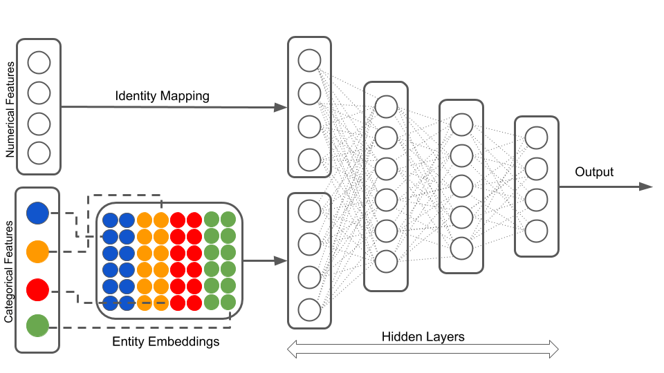
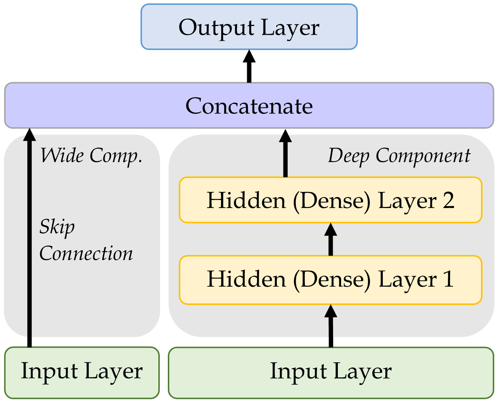

```{python}
#| echo: false
#| warning: false
from setup import *

pandas.options.display.max_rows = 4
```

# Entity Embedding {visibility="uncounted"}

::: {.content-visible unless-format="revealjs"}
Entity embedding is a new way of handling categorical variables.
:::

## Each category used to be a column

When we preprocessed categorical variables, _one-hot encoding_ gave a _column for every category_, so you could always read off what each number meant:

| Category | One-hot vector |
|:---|:---|
| `R11` | $[\,1,\, 0,\, 0,\, \ldots,\, 0\,]$ |
| `R24` | $[\,0,\, 1,\, 0,\, \ldots,\, 0\,]$ |
| `R93` | $[\,0,\, 0,\, \ldots,\, 1,\, 0\,]$ |

Each column _means one specific category_, but the vector is _sparse_ (mostly zeros) and _long_ (one entry per category), and every category sits the _same distance_ from every other.

::: {.content-visible unless-format="revealjs"}
With 22 French regions that is already a 22-column block; for a variable like postcode or occupation it could be thousands of columns. And because the one-hot vectors are all orthogonal, the encoding treats `R11` as exactly as different from its neighbour `R24` as it is from a region on the opposite side of the country --- it knows nothing about which regions are alike.
:::

## Entity embeddings: short, dense & learned

An _entity embedding_ [@guo2016entity] replaces that sparse column-per-category block with a _short, dense vector_ that the network _learns during training_:

$$
\text{R11} \;\longrightarrow\; [\,0.07,\; -0.42\,], \qquad
\text{R24} \;\longrightarrow\; [\,0.11,\; -0.39\,]
$$

- the vector is _short_ --- e.g. 2 numbers instead of 22 columns;
- the dimensions are _learned_, not categories --- there is no "`R11` column";
- categories with a _similar effect on the target_ tend to cluster together.

This is particularly useful when the categorical variable can take on a large number of different levels (it has high cardinality).
Though, in that situation, _rare_ levels are fit from very little data, so they may not be placed optimally.

::: {.content-visible unless-format="revealjs"}
Just like word embeddings, the meaning is not in any single axis --- you cannot say what dimension 1 "means". What _is_ meaningful is the geometry: regions that behave similarly for the prediction task drift close together during training. The encoding goes from sparse-and-interpretable to dense-and-learned, exactly the shift we saw moving from bag-of-words to word embeddings.
:::

::: {.notes}
The shift to land: one-hot is a fixed, hand-specified, orthogonal encoding; an entity embedding is a _learned_ lookup table that places each category in a continuous space, so the model can express that some categories are alike.
:::

## It's the same idea as word embeddings

::: {.content-visible unless-format="revealjs"}
You have already met this idea in the previous lecture, just under a different name.
:::

- A _word embedding_ is just an entity embedding where the "entity" is a _word_.
- _Entity embedding_ applies the same trick to _any_ categorical variable: region, vehicle brand, occupation, postcode, ...
- Typically word embeddings are _pre-trained_ on huge text corpora --- i.e. it is a _transfer learning_ technique --- though here we have labels so learn the embeddings as part of the supervised task.

They are both, in essence, a _lookup table of learned vectors_.

# The French Motor Dataset {visibility="uncounted"}

## Imports needed for these demos

```{python}
import random
from pathlib import Path

import matplotlib.pyplot as plt
import numpy as np
import pandas as pd

from keras.models import Sequential, Model
from keras.layers import Dense, Input, Embedding, Reshape, Concatenate
from keras.callbacks import EarlyStopping
from keras.utils import plot_model

from sklearn import set_config
from sklearn.datasets import fetch_openml
from sklearn.model_selection import train_test_split
from sklearn.preprocessing import OneHotEncoder, OrdinalEncoder, StandardScaler
from sklearn.compose import make_column_transformer

set_config(transform_output="pandas")
```

## Revisit the French motor dataset

```{python}
#| code-fold: true
if not Path("data/freq_data.csv").exists():
    freq = fetch_openml(data_id=41214, as_frame=True).frame
    freq.to_csv("data/freq_data.csv", index=False)
else:
    freq = pd.read_csv("data/freq_data.csv")

freq
```

::: footer
Source: @noll2020case.
:::

## Data dictionary {.smaller}


| Variable | Description | Preprocessing |
|:---:|:------:|:---:|
`IDpol` | Policy number (unique identifier)  | Dropped
`ClaimNb` | Number of claims on the given policy | **Target**
`Exposure`* | Total exposure in yearly units | Normalised
`Area` | Area code (ordinal) | Ordinal Encode
`VehPower` | Power of the car (ordinal encoded) | Normalised
`VehAge` | Age of the car in years |  Normalised
`DrivAge` |  Age of the (most common) driver in years | Normalised
`BonusMalus` | Bonus--malus level between 50 and 230 (with reference level 100) |  Normalised
`VehBrand`* | Car brand (nominal) | One-hot
`VehGas` | Diesel or regular fuel car (binary) | One-hot
`Density` | Density of inhabitants per km^2^ in the city of the living place of the driver | Normalised
`Region`* | Regions in France (prior to 2016) | One-hot

_\* The three variables we single out later: `Region` & `VehBrand` get embeddings, and `Exposure` becomes an offset._

::: footer
Source: @noll2020case.
:::

## The model

Have $\{ (\mathbf{x}_i, y_i) \}_{i=1, \dots, n}$ for $\mathbf{x}_i \in \mathbb{R}^{47}$ and $y_i \in \mathbb{N}_0$.

Assume the distribution
$$
Y_i \sim \mathsf{Poisson}(\lambda(\mathbf{x}_i))
$$

We have $\mathbb{E} Y_i = \lambda(\mathbf{x}_i)$. 
The NN takes $\mathbf{x}_i$ & predicts $\mathbb{E} Y_i$.

::: {.callout-note}
For insurance, _this is a bit weird_.
The exposures are different for each policy.

$\lambda(\mathbf{x}_i)$ is the expected number of claims for the duration of policy $i$'s contract.

Normally, $\text{Exposure}_i \not\in \mathbf{x}_i$, and $\lambda(\mathbf{x}_i)$ is the expected rate _per year_, then
$$
Y_i \sim \mathsf{Poisson}(\text{Exposure}_i \times \lambda(\mathbf{x}_i)).
$$
:::

## What values do we see in the data?

```{python}
#| code-fold: true
freq = freq.drop("IDpol", axis=1).head(25_000)

X_train, X_test, y_train, y_test = train_test_split(
  freq.drop("ClaimNb", axis=1), freq["ClaimNb"], random_state=36861)

# Reset each index to start at 0 again.
X_train_raw = X_train.reset_index(drop=True)
X_test_raw = X_test.reset_index(drop=True)
```


::: {layout-ncol=2 layout-nrow=2}
```{python}
X_train_raw["Area"].value_counts()
```

```{python}
X_train_raw["VehBrand"].value_counts()
```

```{python}
X_train_raw["VehGas"].value_counts()
```

```{python}
X_train_raw["Region"].value_counts()
```
:::

## How we preprocessed last time

::: {.content-visible unless-format="revealjs"}
As a reminder, last time we preprocessed the categorical data through one-hot encoding/dummy encoding.
:::

```{python}
ct = make_column_transformer(
  (OneHotEncoder(sparse_output=False, drop="first"), ["VehGas", "VehBrand", "Region"]),
  (OrdinalEncoder(), ["Area"]),
  remainder=StandardScaler(),
  verbose_feature_names_out=False
)
X_train = ct.fit_transform(X_train_raw)
```


::: columns
::: column
```{python}
X_train_raw.head(3)
```
:::
::: column
```{python}
X_train.head(3)
```
:::
:::

# From One-Hot Encoding to Embeddings {visibility="uncounted"}

## Region column


::: footer
Source: [Wikimedia](https://commons.wikimedia.org/wiki/File:Carte-des-codes-des-regions-selon-l-INSEE.jpg)
:::

## One-hot encoding

::: {.content-visible unless-format="revealjs"}
One hot encoding is a way to assign numerical values to nominal variables. One hot encoding is different from ordinal encoding in the way in which it transforms the data. Ordinal encoding assigns a numerical integer to each unique category of the data column and returns one integer column. In contrast, one hot encoding returns a binary vector for each unique category. As a result, what we get from one hot encoding is not a single column vector, but a matrix with number of columns equal to the number of unique categories in that nominal data column.
:::

```{python}
oh = OneHotEncoder(sparse_output=False)
X_train_oh = oh.fit_transform(X_train_raw[["Region"]])
X_test_oh = oh.transform(X_test_raw[["Region"]])
print(list(X_train_raw["Region"][:5]))
X_train_oh.head()
```

## Train on one-hot inputs

::: {.content-visible unless-format="revealjs"}
For the sake of explaining entity embeddings, we will train a neural network on just one categorical variable which is one-hot encoded.
:::

```{python}
num_regions = len(oh.categories_[0])                            #<1>

random.seed(12)
model = Sequential([                                            #<2>
  Input(shape=(num_regions,)),
  Dense(2),
  Dense(1, activation="exponential")
])

model.compile(optimizer="adam", loss="poisson")                #<3>  

es = EarlyStopping(verbose=True)                               #<4> 
hist = model.fit(X_train_oh, y_train, epochs=100, verbose=0, validation_split=0.2, callbacks=[es])  #<5> 
                           
hist.history["val_loss"][-1]                                   #<6> 
```

1. Computes the number of unique categories in the encoded column and store it in `num_regions`
2. Constructs the neural network. This time, it is a neural network with 1 hidden layer and 1 output layer. The `Input(shape=(num_regions,))` tells the model to expect an input matrix with columns = `num_regions`, and `Dense(2)` transforms it down to an output with 2 neurons
3. Steps 3-6 are similar to what we saw during training with ordinal encoded variables


## Make a fake batch of data

::: {.content-visible unless-format="revealjs"}
Make a fake batch of data where one observation is from each region (essentially an identity matrix). We use this fake batch of data to see what the hidden layer's activation looks like under each of the 22 categories.
:::

::: columns
::: column
```{python}
X = np.eye(num_regions)
pd.DataFrame(X, columns=oh.categories_[0])
```

:::
::: column

```{python}
model.layers[0](X)
```

:::
:::

::: {.content-visible unless-format="revealjs"}
We see above the values of the 2 neurons in the hidden layer for each region as input.
:::

## The first layer

::: {.content-visible unless-format="revealjs"}
We can also extract the layer, get its weights and compute manually.
:::

```{python}
layer = model.layers[0]                     #<1>
W, b = layer.get_weights()                  #<2>
X.shape, W.shape, b.shape                   #<3>
```

1. Extracts the layer
2. Gets the weights and biases and stores the weights in _W_ and biases in _b_
3. Returns the shapes of the matrices

::: columns
::: column
```{python}
X @ W + b
```
:::
::: column
```{python}
W + b
```
:::
:::


::: {.content-visible unless-format="revealjs"}
The above codes manually compute and return the same answers as before. Remember that our $\mathbf X$ is the identity matrix, so any matrix multiplication with $\mathbf X$ becomes redundant (`X @ W + b == W + b`). This is extremely valuable as, if your categorical variable had, say, 10,000 different category possibilities, the matrix operation becomes intensive.
:::

## Just a look-up operation

::: {.content-visible unless-format="revealjs"}
We can consider this as just a look-up operation, where each row of the matrix `W+b` is some vector representation of each category. For example, if we want to know how region 11 is represented, we just look at the first row of the matrix `W+b`.
:::

::: columns
::: column
```{python}
display(list(oh.categories_[0]))
```
:::
::: column
```{python}
W + b
```
:::
:::

Each category maps to one row of `W + b` --- that row _is_ its embedding. No matrix multiply needed.

::: {.content-visible unless-format="revealjs"}
This is what _entity embedding_ does.
:::


## Turn the region into an index

::: {.content-visible unless-format="revealjs"}
To use the entity embedding functionality, we need to turn the categories into indices. We can use the ordinal encoder to do so.
:::

```{python}
oe = OrdinalEncoder()
X_train_reg = oe.fit_transform(X_train_raw[["Region"]])
X_test_reg = oe.transform(X_test_raw[["Region"]])

for i, reg in enumerate(oe.categories_[0][:3]):
  print(f"The Region value {reg} gets turned into {i}.")
```

## Use an Embedding layer

::: {.content-visible unless-format="revealjs"}
Feed this new version of the data into the NN, using an _embedding layer_.
:::

```{python}
num_regions = X_train_raw["Region"].nunique()

random.seed(12)
model = Sequential([
  Input(shape=(1,)),
  Embedding(input_dim=num_regions, output_dim=2),
  Dense(1, activation="exponential")
])

model.compile(optimizer="adam", loss="poisson")
```


```{python}
es = EarlyStopping(verbose=True)
hist = model.fit(X_train_reg, y_train, epochs=100, verbose=0,
    validation_split=0.2, callbacks=[es])
hist.history["val_loss"][-1]
```

```{python}
model.layers
```

Aside: the output here is shaped `(None, 1, 1)`, not `(None, 1)` --- a harmless extra axis from the `Embedding` that we will tidy up later.

::: {.content-visible unless-format="revealjs"}
Embedding layer can learn the optimal representation for a category of a categorical variable, during training.
In the above example, encoding the variable _Region_ using ordinal encoding and passing it through an embedding layer learns the optimal representation for the region during training. Ordinal encoding followed with an embedding layer is a better alternative to one-hot encoding. It is computationally less expensive (compared to generating large matrices in one-hot encoding) particularly when the number of categories is high.
:::

## Keras' Embedding Layer

::: columns
::: column
```{python}
model.layers[0].get_weights()[0]
```
:::
::: column

```{python}
X_train_raw["Region"].head(4)
```

```{python}
X_sample = X_train_reg[:4].to_numpy()
X_sample
```

```{python}
enc_tensor = model.layers[0](X_sample)
keras.ops.convert_to_numpy(enc_tensor).squeeze()
```

:::
:::

## The embedding dimension

- Entity embedding is especially useful when there is a very large number of categories (such as 1,000 or 10,000) and you want to reduce the number of columns.
- The embedding dimension is really a _hyperparameter to tune_ (e.g. by validation loss); there is no settled formula for it.
- One heuristic is to use $n^{1/4}$ for a variable with $n$ categories [@tensorflow2017feature], but there's no theoretical justification, and others disagree.
- In this case, a nice side benefit is that 2-dimensional embeddings can be plotted directly.

## The learned embeddings

::: {.content-visible unless-format="revealjs"}
If we only have two-dimensional embeddings we can plot them.
:::

::: columns
::: column

```{python}
points = model.layers[0].get_weights()[0]
plt.figure(figsize=(3, 3))
plt.scatter(points[:,0], points[:,1])
for i in range(num_regions):
  plt.text(points[i,0]+0.01, points[i,1] , s=oe.categories_[0][i])
```

:::
::: column
![Reproduced from the @guo2016entity [p. 7].](images/guo-fig3.png)
:::
:::

::: {.content-visible unless-format="revealjs"}
While it is not always the case, entity embeddings can at times be meaningful instead of just being useful representations. The above figure shows how plotting the learned embeddings help reveal regions which might be similar (e.g. coastal areas, hilly areas etc.).
:::

## Embeddings improve during training


::: {.content-visible unless-format="revealjs"}
Each category is initially assigned a random vector, but they move during training. These movements follow some sort of logic, for example in this graph countries in Europe cluster together and countries in Asia cluster together.
:::

::: footer
Source: Marcus Lautier (2022).
:::

## Embeddings & other inputs

::: {.content-visible unless-format="revealjs"}
Often times, we deal with both categorical and numerical variables together. The following diagram shows a recommended way of inputting numerical and categorical data into the neural network. Numerical variables are inherently numeric and do not require entity embedding. On the other hand, categorical variables must undergo entity embedding to convert to number format.
:::



We can't do this with Sequential models...

::: {.content-visible unless-format="revealjs"}
Given we want numerical variables to do one thing and categorical variables to do another, they need to be preprocessed separately and independently. The outputs of these independent (non-sequential) preprocesses become inputs to the next hidden layer (now back to sequential).
:::

::: footer
Source: LotusLabs Blog, [Accurate insurance claims prediction with Deep Learning](https://www.lotuslabs.ai/post/accurate-insurance-claims-prediction-with-deep-learning).
:::

# Keras' Functional API {visibility="uncounted"}

::: {.content-visible unless-format="revealjs"}
Sequential models are easy to use and do not require many specifications, however, they cannot model complex neural network architectures. Keras Functional API approach on the other hand allows the users to build complex architectures. 
:::

## Converting Sequential models

::: columns
::: column
```{python}
random.seed(12)

model = Sequential([
  Input(shape=(X_train_oh.shape[1],)),
  Dense(30, "leaky_relu"),
  Dense(1, "exponential")
])

model.compile(
  optimizer="adam",
  loss="poisson")

hist = model.fit(
  X_train_oh, y_train,
  epochs=1, verbose=0,
  validation_split=0.2)
hist.history["val_loss"][-1]
```
:::
::: column
```{python}
random.seed(12)

inputs = Input(shape=(X_train_oh.shape[1],))
x = Dense(30, "leaky_relu")(inputs)
out = Dense(1, "exponential")(x)
model = Model(inputs, out)

model.compile(
  optimizer="adam",
  loss="poisson")

hist = model.fit(
  X_train_oh, y_train,
  epochs=1, verbose=0,
  validation_split=0.2)
hist.history["val_loss"][-1]
```
:::
:::

::: {.content-visible unless-format="revealjs"}
The above code shows how to construct the same neural network using sequential models and Keras functional API. Every sequential model can be converted into the functional style, but not every functional model can be converted to the sequential style. 

In the functional API approach, we must specify the shape of the input layer, and explicitly define the inputs and outputs of a layer before specifying the model. `model = Model(inputs, out)` specifies the inputs and outputs of the model. This manner of specifying the inputs and outputs of the model allows the user to combine several inputs (inputs which are preprocessed in different ways) to finally build the model. One example would be combining entity embedded categorical variables, and scaled numerical variables.
:::

## Wide & Deep network

::: columns
::: {.column width="45%"}

:::
::: {.column width="55%"}
Add a _skip connection_ from input to output layers.

```{python}
inp = Input(shape=X_train.shape[1:])
hidden1 = Dense(30, "leaky_relu")(inp)
hidden2 = Dense(30, "leaky_relu")(hidden1)
concat = Concatenate()(
  [inp, hidden2])
output = Dense(1)(concat)
model = Model(inputs=[inp], outputs=[output])
```
:::
:::

::: {.content-visible unless-format="revealjs"}
The functional API method can unlock some new non-sequential NN architectures, such as the _Wide & Deep network_. One version of the inputs is processed through dense hidden layers, and the other version skips the processing. The two versions are then concatenated into a new layer which is used to create the output layer.
:::

::: footer
Sources: Marcus Lautier (2022) & Aurélien Géron (2019), _Hands-On Machine Learning with Scikit-Learn, Keras, and TensorFlow_, 2nd Edition, Chapter 10 code snippet.
:::

## Naming the layers

For complex networks, it is often useful to give meaningful names to the layers.

```{python}
input_ = Input(shape=X_train.shape[1:], name="input")
hidden1 = Dense(30, activation="leaky_relu", name="hidden1")(input_)
hidden2 = Dense(30, activation="leaky_relu", name="hidden2")(hidden1)
concat = Concatenate(name="combined")([input_, hidden2])
output = Dense(1, name="output")(concat)
model = Model(inputs=[input_], outputs=[output])
```

## Inspecting a complex model

::: columns
::: {.column width="30%"}
```{python}
plot_model(model, show_layer_names=True)
```
:::
::: {.column width="70%"}
::: {.smaller}
```{python}
model.summary(line_length=60)
```
:::
:::
:::

::: {.content-visible unless-format="revealjs"}
The plot of the model becomes much easier to understand and interpret.
:::

# French Motor Dataset with Embeddings {visibility="uncounted"}

## The desired architecture


::: footer
Source: LotusLabs Blog, [Accurate insurance claims prediction with Deep Learning](https://www.lotuslabs.ai/post/accurate-insurance-claims-prediction-with-deep-learning).
:::

## Preprocess all French motor inputs

Transform the categorical variables to integers:

```{python}
num_brands, num_regions = X_train_raw[["VehBrand", "Region"]].nunique()     #<1>

ct = make_column_transformer(
  (OrdinalEncoder(), ["VehBrand", "Region", "Area", "VehGas"]),             #<2>
  remainder=StandardScaler(),                                               #<3>
  verbose_feature_names_out=False                                           #<4>
)
X_train = ct.fit_transform(X_train_raw)                                     #<5>
X_test = ct.transform(X_test_raw)                                           #<6>
```

1. Stores separately the number of unique categories in the nominal variables, as we will need these values later for entity embedding
2. Contructs columns transformer by first ordinally encoding _all_ categorical variables (ordinal and nominal). Nominal variables are ordinal encoded here just as an intermediate step before this is the required input format for entity embedding layers
   
3. Applies standard scaling to all other numerical variables
4. Choose the simpler style of column names for the transformed dataframes
5. Fits the column transformer to the train set and transforms it
6. Transforms the test set using the column transformer fitted using the train set

Split the brand and region data apart from the rest:

```{python}
X_train_brand = X_train["VehBrand"]
X_train_region = X_train["Region"]
X_train_rest = X_train.drop(["VehBrand", "Region"], axis=1)

X_test_brand = X_test["VehBrand"]
X_test_region = X_test["Region"]
X_test_rest = X_test.drop(["VehBrand", "Region"], axis=1)
```

## Organise the inputs

Make a Keras `Input` for: vehicle brand, region, & others.

```{python}
veh_brand = Input(shape=(1,), name="veh_brand")
region = Input(shape=(1,), name="region")
other_inputs = Input(shape=X_train_rest.shape[1:], name="other_inputs")
```
Create embeddings and join them with the other inputs. 
```{python}
random.seed(1337)
veh_brand_ee = Embedding(input_dim=num_brands, output_dim=2,                   #<1>
    name="veh_brand_ee")(veh_brand)
veh_brand_ee = Reshape(target_shape=(2,))(veh_brand_ee)                         #<2>

region_ee = Embedding(input_dim=num_regions, output_dim=2, name="region_ee")(region) #<3>
region_ee = Reshape(target_shape=(2,))(region_ee)                               #<4>

x = Concatenate(name="combined")([veh_brand_ee, region_ee, other_inputs])       #<5>
```

1. Constructs the embedding layer by specifying the input dimension (the number of unique categories) and output dimension (the number of dimensions we want the input to be summarised in to)
2. Reshapes the output to match the format required at the model building step
3. Constructs the embedding layer by specifying the input dimension (the number of unique categories) and output dimension
4. Reshapes the output to match the format required at the model building step
5. Combines the entity embedded matrices and other inputs together

## Complete the model and fit it

Feed the combined embeddings & continuous inputs to some normal dense layers.

```{python}
x = Dense(30, "relu", name="hidden")(x)
out = Dense(1, "exponential", name="out")(x)

model = Model([veh_brand, region, other_inputs], out)                     #<1>
model.compile(optimizer="adam", loss="poisson")

hist = model.fit((X_train_brand, X_train_region, X_train_rest),           #<2>
    y_train, epochs=100, verbose=0,
    callbacks=[EarlyStopping(patience=5)], validation_split=0.2)
np.min(hist.history["val_loss"])
```

1. Model building stage requires all inputs to be passed in together
2. Passes in the three sets of data, since the format defined at the model building stage requires 3 data sets

## Plotting this model

```{python}
plot_model(model, show_layer_names=True)
```

## Why we need to reshape

```{python}
plot_model(model, show_layer_names=True, show_shapes=True)
```

::: footer
`Embedding` turns `(None, 1)` into `(None, 1, 2)`; `Reshape` drops the extra axis to `(None, 2)` so we can `Concatenate`.
:::

::: {.content-visible unless-format="revealjs"}
The plotted model shows how, for example, `region` starts off as a matrix with `(None,1)` shape. This indicates that `region` was a column matrix with some number of rows. Entity embedding the `region` variable resulted in a 3D array of shape (`(None,1,2)`) which is not the required format for concatenating. Therefore, we reshape it using the `Reshape` function. This results in column array of shape, `(None,2)` which is what we need for concatenating.
:::

# Scale by Exposure {visibility="uncounted"}

## Two different models

Have $\{ (\mathbf{x}_i, y_i) \}_{i=1, \dots, n}$ for $\mathbf{x}_i \in \mathbb{R}^{47}$ and $y_i \in \mathbb{N}_0$.

**Model 1**: Say $Y_i \sim \mathsf{Poisson}(\lambda(\mathbf{x}_i))$.

But, the exposures are different for each policy.
$\lambda(\mathbf{x}_i)$ is the expected number of claims for the duration of policy $i$'s contract.

**Model 2**: Say $Y_i \sim \mathsf{Poisson}(\text{Exposure}_i \times \lambda(\mathbf{x}_i))$.

Now, $\text{Exposure}_i \not\in \mathbf{x}_i$, and $\lambda(\mathbf{x}_i)$ is the rate _per year_.

## Just take continuous variables

::: {.content-visible unless-format="revealjs"}
For convenience, the following code only considers the numerical variables during this implementation.
:::

```{python}
ct = make_column_transformer(                                           #<1>
  ("passthrough", ["Exposure"]),                                        #<2>
  ("drop", ["VehBrand", "Region", "Area", "VehGas"]),                   #<3>
  remainder=StandardScaler(),                                           #<4>
  verbose_feature_names_out=False                                       #<5>
)
X_train = ct.fit_transform(X_train_raw)                                  #<6>
X_test = ct.transform(X_test_raw)                                        #<7>
```

1. Starts defining the column transformer 
2. Lets `Exposure` pass through the neural network as it is without preprocessing
3. Drops the categorical variables (for the ease of implementation)
4. Scales the remaining variables
5. Choose the simpler style of column names for the transformed dataframes
6. Fits and transforms the train set
7. Only transforms the test set


Split exposure apart from the rest:

```{python}
X_train_exp = X_train["Exposure"]
X_test_exp = X_test["Exposure"]
X_train_rest = X_train.drop("Exposure", axis=1)
X_test_rest = X_test.drop("Exposure", axis=1)
```

Organise the inputs:

```{python}
exposure = Input(shape=(1,), name="exposure")
other_inputs = Input(shape=X_train_rest.shape[1:], name="other_inputs")
```

## Make & fit the model

Feed the continuous inputs to some normal dense layers.

```{python}
random.seed(1337)
x = Dense(30, "relu", name="hidden1")(other_inputs)
x = Dense(30, "relu", name="hidden2")(x)
lambda_ = Dense(1, "exponential", name="lambda")(x)
```

```{python}
out = lambda_ * exposure
model = Model([exposure, other_inputs], out)
model.compile(optimizer="adam", loss="poisson")

es = EarlyStopping(patience=10, restore_best_weights=True, verbose=1)
hist = model.fit((X_train_exp, X_train_rest), y_train, epochs=100, verbose=0,
    callbacks=[es], validation_split=0.2)
np.min(hist.history["val_loss"])
```

## Plot the model

```{python}
plot_model(model, show_layer_names=True)
```

## Further reading

@avanzi2024machine focus on how to handle the case of high-cardinality categorical features, and propose a new architecture specifically tailored for actuarial purposes.

## Package Versions {.appendix data-visibility="uncounted"}

```{python}
from watermark import watermark
print(watermark(python=True, packages="keras,matplotlib,numpy,pandas,seaborn,scipy,torch"))
```

## Glossary {.appendix data-visibility="uncounted"}

::: columns
:::: column
- entity embeddings
- Input layer
- Keras functional API
::::
:::: column
- Reshape layer
- skip connection
- wide & deep network
::::
:::

```{python}
#| echo: false
Path("model.png").unlink(missing_ok=True)
```

## References {visibility="uncounted"}

::: {#refs}
:::