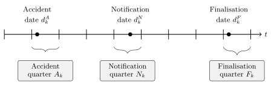
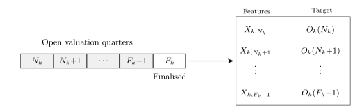
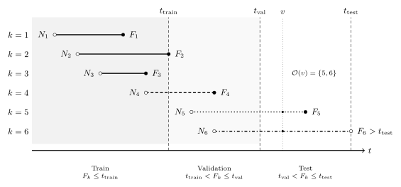

<!--
engine: knitr (not the course-wide jupyter) so R and Python share one file:
R chunks run natively (SPLICE, ChainLadder); Python runs via reticulate ->
../.venv. knitr gotchas that cause real breakage:
- cache: false in the front matter — knitr's cache doesn't replay python
  state, so a cached edited chunk runs in an empty session (NameError).
- SPLICE generates the data at render time on the case-study slide, and the R
  data frames cross to python via reticulate's bridge (claims = r.claims), NOT
  via parquet. Never round-trip a parquet within one render: pyarrow mmaps the
  file, so a read after a write in the same process hands back corrupt strings
  ("Embedded NUL in string"). memory_map=False does not fix it. The only
  parquet write left is the export chunk at the very END of the file; keep it
  write-only and keep it last. The early claim-life and portfolio figures use
  hand-crafted illustrative numbers, so nothing depends on the DGP before the
  case study anyway.
- jupyter_compat = TRUE (first r chunk): only the last expression auto-prints.
  Never write `_ = ...` in a python chunk — it shadows reticulate's repr hook.
- #| fig-dpi: 350 on every python plotting chunk (knitr ignores rcParams dpi).
- A bare dataframe renders as plain text; use show_df() for HTML tables.
- Bind/chain reticulate results (glm = Ridge(...).fit(X, y)) so knitr doesn't
  emit sklearn's HTML estimator diagram and swallow the chunk output.
-->

```{r}
#| echo: false
#| warning: false
# Bind reticulate to the project venv BEFORE any python chunk runs.
# (Package loading happens on the case study's imports slide.)
reticulate::use_virtualenv("../.venv", required = TRUE)
# Display python values like the jupyter engine: only the final expression
# in a chunk is auto-printed (a trailing `;` still suppresses it), instead
# of reticulate's default REPL-style echo of every top-level expression.
# Centre figures horizontally (knitr's default is left-aligned, unlike the
# jupyter engine). And hold printed output until the end of the chunk rather
# than interleaving each print() with the source line that produced it.
# Print the first `n` rows of a big frame while the footer still reports the
# true row count, the way pandas elides rows but prints an honest .shape.
# The pagedtable JS reads an `options.rows.total` override, but rmarkdown never
# emits one (it silently caps the count it computes at 10,000), so patch it in.
peek <- function(df, n = 200) {
  html <- rmarkdown:::paged_table_html(utils::head(df, n))
  html <- sub('"rows":{', sprintf('"rows":{"total":%d,', nrow(df)), html, fixed = TRUE)
  knitr::asis_output(html, meta = list(rmarkdown:::html_dependency_pagedtable()))
}

knitr::opts_chunk$set(
  jupyter_compat = TRUE, fig.align = "center", results = "hold"
)
```

```{python}
#| echo: false
#| warning: false
from setup import *

# Compile interactive-splits/*.jsx to compiled/*.js before quarto copies the
# `resources:`. No-op when already up to date.
import subprocess
import sys

subprocess.run(
    [sys.executable, "../scripts/compile_interactive_splits.py"], check=True
);


def show_df(df):
    """Emit a dataframe's HTML in an `output: asis` chunk, wrapped in the
    .cell-output div the jupyter engine uses (gives wide tables a scrollbar)."""
    print('<div class="cell-output cell-output-display">'
          + df._repr_html_() + "</div>")
```

# Introduction

## Individual claim reserving

An accident has occurred, the insurer has been notified, and maybe parts of the claim have already been paid, now we need to guess how much remains in this realised claim.

```{=html}
<!-- The live version of the timeline that images/individual-claim.png was a
screenshot of. Mounted by lecture-demos.js (id demo-claim-intro), which loads
on the "One claim's full history" slide below; type="module" scripts run after
the whole document is parsed, so this earlier div is found and mounted fine.
The .interactive-demo CSS in that same later block applies globally. -->
<div id="demo-claim-intro" class="interactive-demo"></div>
```

This is potentially a promising application for neural networks.

## Ultimate claim size

For claim $k$, we want to know the  _ultimate claim size_
$$
  U_k := \sum_{t} P_{k,t},
$$

This is the sum of all _incremental payments_ $P_{k,t}$ (also called _partial payments_) over the complete lifetime of the claim.

::: {.callout-note}
## Assumption: payments are positive

We assume $P_{k,t} \ge 0$ throughout. In reality some payments are _negative_ --- called _recoveries_ (e.g. money coming back from a third party or a salvaged vehicle). They are typically so rare and small relative to normal payments that ignoring them is reasonable (though this depends on the dataset).
:::

## Outstanding claim amount

Say the valuation date is $v$, then we've seen the history of the claim $\mathcal{H}_{k,v}$ to that time, including past payments.

So the _outstanding_ (future unpaid amount) for claim $k$ is
$$
  O_k(v) := \sum_{t>v} P_{k,t}.
$$

If the claim is still ongoing then
$$
  U_k = \sum_{t \le v} P_{k,t} + O_k(v) \,.
$$

In words:
$$
\text{Ultimate} = \text{Cumulative payments before } v + \text{Outstanding amount from } v \text{ onwards}
$$

## Total outstanding

For a portfolio, we'd like to know the _total outstanding_

$$
  T(v) := \sum_{k\in\mathcal{O}(v)} O_k(v) \,,
$$
where $\mathcal{O}(v)$ is the set of all open claims at valuation time $v$.

Note: this doesn't include _incurred but not reported (IBNR)_ claims.

## The total outstanding, visually

```{python}
#| echo: false
#| fig-dpi: 350
# Hand-crafted schematic (not SPLICE data): circle = notification, x = payment,
# big X = finalisation. Open claims' post-v segments are highlighted (their
# future payments are the O_k(v)'s summing to T(v)); an IBNR claim at the bottom.
_v = 10
_diagram_claims = [  # (notification, [payment times], finalisation)
    (1.0, [2.5, 4.0], 5.5),
    (2.0, [3.0, 6.0, 8.5], 9.4),
    (3.5, [5.0, 8.0, 11.0, 13.0], 14.0),
    (5.0, [6.5, 9.0], 9.8),
    (6.0, [7.5, 12.0, 15.5], 17.0),
    (8.0, [9.5, 11.5, 14.0], 15.0),
]
_GREY, _TEAL, _PINK = "#B8B8B8", "#3F9999", "#FF8FA9"

plt.figure(figsize=(5, 2.8))
for _row, (_n, _pays, _f) in enumerate(_diagram_claims):
    _y = -_row
    if _n <= _v < _f:  # open at the valuation date
        plt.plot([_n, _v], [_y, _y], color=_TEAL, linewidth=1.5)
        plt.plot([_v, _f], [_y, _y], color=_PINK, linewidth=2.5)
        for _p in _pays:
            _c = _TEAL if _p <= _v else _PINK
            plt.plot(_p, _y, "x", color=_c, markersize=5)
        plt.plot(_n, _y, "o", color=_TEAL, markersize=4)
        plt.plot(_f, _y, "X", color=_PINK, markersize=6)
    else:  # already closed: greyed out
        plt.plot([_n, _f], [_y, _y], color=_GREY, linewidth=1.5)
        for _p in _pays:
            plt.plot(_p, _y, "x", color=_GREY, markersize=5)
        plt.plot(_n, _y, "o", color=_GREY, markersize=4)
        plt.plot(_f, _y, "X", color=_GREY, markersize=6)

# The IBNR claim: occurred before v, notified after v — invisible at v.
_y_ibnr = -len(_diagram_claims) - 0.6
plt.plot(8.5, _y_ibnr, "^", color="#666666", markersize=5)
plt.plot([8.5, 12.0], [_y_ibnr, _y_ibnr], color=_GREY,
         linewidth=1.2, linestyle=":")
plt.plot([12.0, 16.0], [_y_ibnr, _y_ibnr], color=_GREY, linewidth=1.5)
plt.plot(12.0, _y_ibnr, "o", color=_GREY, markersize=4)
for _p in [13.0, 15.0]:
    plt.plot(_p, _y_ibnr, "x", color=_GREY, markersize=5)
plt.plot(16.0, _y_ibnr, "X", color=_GREY, markersize=6)
plt.annotate("IBNR: accident before $v$, reported after",
             (8.2, _y_ibnr), ha="right", va="center", fontsize=7,
             color="#666666")

# Stop the dashed line below the label so the text doesn't sit on it.
plt.plot([_v, _v], [_y_ibnr - 0.9, 0.55], color="black",
         linestyle="--", linewidth=1)
plt.annotate("valuation time $v$", (_v, 0.9), ha="center",
             va="bottom", fontsize=8)
plt.annotate("$O_k(v)$", (12.0, -1.6), ha="center", va="bottom",
             fontsize=8, color=_PINK)
plt.annotate("$T(v)$ = sum of the\nhighlighted future payments",
             (17.2, -3.0), ha="right", va="center", fontsize=7)

plt.ylim(_y_ibnr - 0.9, 1.6)
plt.yticks([])
plt.gca().spines["left"].set_visible(False)
plt.xlabel("Time (quarters)");
```

Each open claim's future payments (highlighted) get summed to give $T(v)$.

The bottom claim has _occurred_ before $v$ but hasn't been _notified_ yet.
No individual model can reserve for a claim it cannot see --- IBNR needs a separate adjustment.

## Why is pricing different from reserving?

- _Pricing_ is prospective and per-policy: no claim exists yet, and we predict the frequency/severity of hypothetical future claims from policy covariates (recall the French motor lectures).
- _Reserving_ is about claims that have already happened: we condition on each claim's unfolding history — payments to date, case estimates — to predict what is still to be paid.
- Consequence for the ML setup: pricing rows are policies with static features; reserving rows are claim-quarter snapshots with _time-varying_ features. That's why this lecture needs a whole preprocessing pipeline.


# Insurance Claim Payments and Case Estimates

## The key dates



A claim is _open_ if not yet finalised.

$$
  \mathcal{O}(v) := \{ k : d_k^F > v \} \,.
$$

(Though, technically, claims sometimes finalise, and then get reopened with further payments, and refinalised again.)

## Series of incremental payments

| Event | Date | Amount |
|-------|------|--------|
| Accident | 2021-09-30 | |
| Notification | 2021-11-15 | |
| Payment #1 | 2022-05-17 | $9.00 |
| Payment #2 | 2022-08-31 | $2.00 |
| Payment #3 | 2022-10-23 | $2.00 |
| Payment #4 | 2022-12-20 | $4.00 |
| Payment #5 | 2023-02-19 | $2.00 |
| Payment #6 | 2023-05-31 | $3.00 |
| Payment #7 | 2023-07-08 | $18.00 |
| Payment #8 | 2023-09-10 | $8.00 |
| Finalisation | 2023-10-28 | |

## Case estimates

Alongside payments, the insurer holds a _case estimate_ $C_{k,v} \ge 0$: a claims assessor's live, subjective estimate of the outstanding liability at the end of quarter $v$.

The assessor is aiming for
$$
  C_{k,v} \approx O_k(v) \,.
$$

The crucial difference: $C_{k,v}$ is _known at time_ $v$, whereas $O_k(v)$ is only knowable in retrospect, once the claim finalises.

So case estimates play two roles for us:

- a _strong predictor_ to feed into the model, and
- a _benchmark to beat_ (if the model can't out-predict the assessors, why bother?).

::: footer
See @taylor2008individual.
:::

## Payments and case estimates together

| Date | Event | Payment | Case estimate |
|------|-------|--------:|--------------:|
| 2021-11-15 | Notification, initial estimate | | $30.00 |
| 2022-05-17 | Payment #1 | $9.00 | $21.00 |
| 2022-06-20 | Review: worse than hoped | | $35.00 |
| 2022-08-31 | Payment #2 | $2.00 | $33.00 |
| 2022-10-23 | Payment #3 | $2.00 | $31.00 |
| 2022-12-20 | Payment #4 | $4.00 | $27.00 |
| 2023-02-19 | Payment #5 | $2.00 | $25.00 |
| 2023-05-31 | Payment #6 | $3.00 | $22.00 |
| 2023-07-08 | Payment #7 (settlement agreed) | $18.00 | $8.00 |
| 2023-09-10 | Payment #8 | $8.00 | $0.00 |
| 2023-10-28 | Finalisation | | $0.00 |

## From the policyholder's perspective

```{python}
#| echo: false
# One illustrative claim's life (the numbers from the table above, in $000s ---
# hand-crafted, NOT SPLICE data, so these two slides don't shift with the DGP).
# Axis is "quarters since notification": notification, not the accident, is the
# first moment the insurer knows of the claim, so it's the natural t=0.
_t_acc, _t_final, _ultimate = -0.6, 7.6, 48.0

# Cumulative payments: accident and notification sit at $0, then each payment.
_t_paid = [_t_acc, 0.0, 2.0, 2.9, 3.4, 4.1, 4.8, 5.9, 6.4, 7.1, _t_final]
_cum_paid = [0, 0, 9, 11, 13, 17, 19, 22, 40, 48, _ultimate]

# Case-estimate revisions: (time, case estimate, is_major). Major = the assessor issuing a
# fresh estimate; minor = the automatic knock-on when a payment is made.
_revisions = [(0.0, 30, True), (2.0, 21, False), (2.1, 35, True),
              (2.9, 33, False), (3.4, 31, False), (4.1, 27, False),
              (4.8, 25, False), (5.9, 22, False), (6.4, 8, False), (7.1, 0, False)]
_ocl_at_rev = [_o for _, _o, _ in _revisions]
# Incurred = paid-to-date + case estimate at each revision (assessor's running ultimate).
_incurred_at_rev = [30, 30, 44, 44, 44, 44, 44, 44, 48, 48]

_t_est = [_t for _t, _, _ in _revisions] + [_t_final]
_case_est = _ocl_at_rev + [0.0]
_incurred = _incurred_at_rev + [_ultimate]
_y_top = _ultimate * 1.12  # shared y-limits so the two slides overlay


def _mark_revisions(values, colour):
    for _major, marker, size, label in [(True, "D", 14, "Major revision"),
                                        (False, "o", 10, "Minor revision")]:
        _xs = [_t for (_t, _, _mj) in _revisions if _mj == _major]
        _ys = [_v for _v, (_, _, _mj) in zip(values, _revisions) if _mj == _major]
        plt.scatter(_xs, _ys, marker=marker, s=size, color=colour,
                    zorder=5, label=label)


def _claim_base_plot():
    plt.figure(figsize=(5, 2.6))
    # Reserve space to the right of the axes for the legend, which sits outside
    # the plot (the claim's lines fill the frame, so an in-plot legend can't
    # avoid them).
    plt.subplots_adjust(top=0.90, left=0.13, right=0.68, bottom=0.19)
    # Labelled so "Ultimate" shows up in the legend rather than as an in-plot
    # annotation (which collided with the lines).
    plt.axhline(_ultimate, color="black", linestyle="--",
                linewidth=1, zorder=1, label="Ultimate")
    plt.ylim(0, _y_top)
    # Start at notification (t=0) and end at finalisation; the pre-notification
    # stub is bare, and setting an explicit right bound is required because
    # xlim() here (before the data is drawn) otherwise freezes autoscaling.
    plt.xlim(0, _t_final * 1.02)
    plt.xlabel("Time since notification (quarters)")
    plt.ylabel("Amount ($000s)")
```

```{python}
#| echo: false
#| fig-dpi: 350
_claim_base_plot()
plt.step(_t_paid, _cum_paid, where="post", color="#3F9999",
         linewidth=2, label="Cumulative payments")
plt.step(_t_est, _incurred, where="post", color="#CC91BC",
         linewidth=2, label="Incurred")
_mark_revisions(_incurred_at_rev, "#CC91BC")
plt.legend(fontsize=7, frameon=False, loc="center left",
           bbox_to_anchor=(1.0, 0.5), ncol=1, handletextpad=0.4,
           borderaxespad=0);
```

Payments step up toward the ultimate.
The _incurred_, which is cumulative payments plus the case estimate of the outstanding, is the assessor's running view of the ultimate.

## From the insurer's perspective

```{python}
#| echo: false
#| fig-dpi: 350
_claim_base_plot()
plt.step(_t_paid, [_ultimate - c for c in _cum_paid], where="post",
         color="#FF8FA9", linewidth=2, label="True outstanding")
# A hue well away from both the pink outstanding here and the mauve
# incurred on the previous slide.
plt.step(_t_est, _case_est, where="post", color="#E69F00",
         linewidth=2, label="Case estimate")
_mark_revisions(_ocl_at_rev, "#E69F00")
plt.legend(fontsize=7, frameon=False, loc="center left",
           bbox_to_anchor=(1.0, 0.5), ncol=1, handletextpad=0.4,
           borderaxespad=0);
```

The true outstanding $O_k(v)$ --- the _outstanding claims liability (OCL)_ --- and the _case estimate_ $C_{k,v}$ (the assessor's live forecast of it) both drop to zero.

# Benchmark: Aggregate Reserving

## Three levels of claim data granularity

1. _Individual transaction level_: Stores every transaction or other update for every claim. Highest granularity. Often just visible in the insured's bank statements, or in insurance company's finance records. Usually considered too granular to be useful for actuaries.
2. _Individual quarterly summaries_: This aggregates all the payments within a quarter (alternatively per month) for each claim. This is what the actuary would see.
3. _Portfolio quarterly summaries_: Aggregates all payments within a quarter (alternatively per month) across all claims. This feeds into a Chain Ladder style of reserving.

## Aggregate reserving

You have seen the classical approach to reserving already.
The insurer's past payments are aggregated into a _run-off triangle_: rows are accident years, columns are development years, and each cell holds the cumulative amount paid so far.

| Accident Year | Dev 1 | Dev 2 | Dev 3 |
|---------------|------:|------:|------:|
| 2021 | 100 | 150 | 165 |
| 2022 | 120 | 180 | ? |
| 2023 | 140 | ? | ? |

The lower-right of the triangle is the future: it hasn't happened yet, and the _reserve_ is our estimate of it.

## Chain ladder

Chain ladder fills in the triangle by assuming each accident year develops in the same proportions as the past ones.

- Development factor from Dev 1 to Dev 2:
  $f_1 = \frac{150 + 180}{100 + 120} = 1.5$
- Development factor from Dev 2 to Dev 3:
  $f_2 = \frac{165}{150} = 1.1$

Projecting forward:

| Accident Year | Dev 1 | Dev 2 | Dev 3 | Reserve |
|---------------|------:|------:|------:|--------:|
| 2021 | 100 | 150 | 165 | 0 |
| 2022 | 120 | 180 | _198_ | 18 |
| 2023 | 140 | _210_ | _231_ | 91 |

The total reserve here is $18 + 91 = 109$.

<!-- Chain ladder on the realistic portfolio lives in the case study section;
this section stays toy-sized. -->

## What chain ladder ignores

Every claim in the same accident year is treated identically.
The triangle has already thrown away:

- _who_ was injured (age, injury severity),
- _how_ the claim is progressing (legal representation, payment pattern),
- the case estimates set by claims assessors.

If two claims have paid out the same amount so far, chain ladder implicitly reserves the same for both, even if one is a minor injury about to finalise and the other is heading to court.

## Why individual claim reserving?

With claim-level data and machine learning, we can use those discarded covariates to predict each claim's outstanding amount separately.

- The portfolio reserve is then just a sum: $T(v) = \sum_{k \in \mathcal{O}(v)} O_k(v)$.
- Per-claim predictions are useful beyond the total: claims triage (which claims need senior assessors?), segmenting the reserve by injury severity or legal representation, spotting claims whose case estimates look off.
- Chain ladder remains the _benchmark_: an individual model that can't beat the triangle isn't worth its complexity.

::: {.callout-note}
Next week's guest lecture digs into _when and why_ aggregate models break down, and the trade-offs between micro- and macro-level models. Today we focus on individual-level approach and how to implement it.
:::

# Individual Claim Modelling Choices

## A few major choices upfront

1) What are the model inputs and outputs?

Predictions are made from the perspective of some fixed time $v$, the _valuation quarter_.

The individual claim model has:

- _Input_: an $X_{k,v}$ summarising the claim's history up to $v$.
- _Output_: either the ultimate claim size $U_k$ or the outstanding value $O_k(v)$.

2) Are we performing traditional regression or distributional regression?

## Two potential targets: ultimate or outstanding

The output distribution can sit on either of two quantities:

- the _ultimate_ $U_k$, or
- the _outstanding_ $O_k(v) = U_k - \sum_{t \le v} P_{k,t}$.

```{python}
#| echo: false
# Illustrative densities for the two things a distributional model could
# forecast for one in-progress claim. The x-axis is the ultimate amount.
#   - Forecast the ultimate directly: a lognormal on [0, inf).
#   - Forecast the outstanding: a lognormal on the *outstanding*, which on the
#     ultimate axis is shifted right by the cumulative paid-to-date.
from scipy.stats import lognorm

_C_ult = "#3F9999"  # teal, as for cumulative payments earlier
_C_out = "#CC91BC"  # mauve, as for incurred earlier
_paid = 60.0        # cumulative paid to date ($000s)

# Ultimate  U ~ LogNormal;  outstanding  O ~ LogNormal (shifted by _paid).
_x = numpy.linspace(0, 260, 2000)
_pdf_ult = lognorm.pdf(_x, s=0.42, scale=95)
_xo = _x - _paid
_pdf_out = numpy.where(_xo > 0, lognorm.pdf(_xo, s=0.5, scale=48), 0.0)


def _forecast_base_plot():
    plt.figure(figsize=(5.4, 3.0))
    plt.subplots_adjust(top=0.92, left=0.145, right=0.70, bottom=0.17)
    plt.plot(_x, _pdf_ult, color=_C_ult, linewidth=2,
             label="Forecast ultimate $U_k$")
    plt.plot(_x, _pdf_out, color=_C_out, linewidth=2,
             label="Forecast outstanding $O_k(v)$")
    plt.axvline(_paid, color="black", linestyle="--", linewidth=1.2,
                label="Paid to date")
    plt.ylim(0, None)
    plt.xlim(0, 260)
    plt.xlabel("Ultimate claim amount ($000s)")
    plt.ylabel("Probability density")
    plt.legend(fontsize=7, frameon=False, loc="center left",
               bbox_to_anchor=(1.0, 0.5), handletextpad=0.5, borderaxespad=0)
```

```{python}
#| echo: false
#| fig-dpi: 350
_forecast_base_plot();
```

::: footer
See @al2022stochastic for distributional forecasts of individual claims using MDNs.
:::

## Claim snapshots



One finalised claim, viewed retrospectively from _every_ quarter it was open, yields one training example:
$$(X_{k,v},\ O_k(v)) \text{ for } v = N_k, \dots, F_k - 1\,.$$

Note, claims with $N_k = F_k$ just dissapear.

::: footer
See @avanzi2026case.
:::

# Preprocessing One Claim

## One claim's full history

```{=html}
<style>
/* Paged-table pager: stop the page numbers colliding with "Previous"/"Next". */
.pagedtable-footer .pagedtable-indexes {
  display: inline-flex;
  gap: 0.35em;
  margin: 0 0.6em;
}
.pagedtable-footer .pagedtable-index {
  padding: 0 0.2em;
}

/* Scoped stand-in for Tailwind preflight (which is disabled globally below,
   so it cannot restyle reveal.js/Bootstrap). */
.interactive-demo *,
.interactive-demo *::before,
.interactive-demo *::after {
  box-sizing: border-box;
  border-width: 0;
  border-style: solid;
  border-color: #e5e7eb;
}
.interactive-demo h1, .interactive-demo h2, .interactive-demo h3,
.interactive-demo h4, .interactive-demo h5, .interactive-demo h6,
.interactive-demo p, .interactive-demo figure, .interactive-demo blockquote,
.interactive-demo dl, .interactive-demo dd {
  margin: 0;
}
.interactive-demo ul, .interactive-demo ol {
  list-style: none;
  margin: 0;
  padding: 0;
}
.interactive-demo button, .interactive-demo input, .interactive-demo select,
.interactive-demo textarea {
  font-family: inherit;
  font-size: 100%;
  font-weight: inherit;
  line-height: inherit;
  color: inherit;
  margin: 0;
  padding: 0;
}
.interactive-demo button {
  background-color: transparent;
  background-image: none;
  text-transform: none;
  cursor: pointer;
}
.interactive-demo table {
  border-collapse: collapse;
  text-indent: 0;
  border-color: inherit;
  margin: 0;
}
/* The components are light-background Tailwind cards, but the html format's
   theme styles bare elements for prose and the dark theme repaints them
   again. A demo's <table> therefore picks up the site's charcoal thead
   (#f5f5f0 text on Tailwind's near-white bg-gray-50: unreadable in BOTH
   schemes) and, in dark mode, a --bg tbody that bands the light card black.
   Text with no colour utility inherits the page colour, which is porcelain in
   dark mode — invisible here. So pin each demo to its own light context.
   :where() keeps these at .interactive-demo's specificity: above the theme's
   element selectors, below every Tailwind utility (.interactive-demo
   .bg-gray-50), so the components' own classes still paint. */
.interactive-demo :where(table, thead, tbody, tfoot, tr, th, td) {
  background: transparent;
  color: inherit;
  border-color: #e5e7eb;
  border-width: 0;
  border-radius: 0;
  box-shadow: none;
  padding: 0;
}
.interactive-demo {
  /* Light UA chrome (the range sliders, this box's scrollbar) regardless of
     the page's scheme, and a default text colour for unclassed elements. */
  color-scheme: light;
  color: #1f2937;
  font-family: -apple-system, BlinkMacSystemFont, "Segoe UI", Roboto, sans-serif;
  font-size: 16px;
  line-height: 1.4;
  text-align: left;
  max-height: 540px;
  overflow: auto;
  background: #f9fafb;
  border: 1px solid #e5e7eb;
  border-radius: 8px;
  /* Become the containing block for position:fixed descendants (the
     splitting diagram's Controls drawer) and clip them: inside reveal's
     transformed slides the "off-screen" closed drawer would otherwise sit
     visibly just right of the slide. Open, it docks inside this box. */
  contain: paint;
}
.interactive-demo svg { max-width: none; }
/* The splitting diagram centres its Train/Val/Test legend as an absolute
   overlay on the control-bar row — fine at full browser width, but at slide
   width it overlaps the buttons. Make it a normal row above them. */
#demo-splitting .pointer-events-none.absolute.inset-0 {
  position: static;
  margin-bottom: 0.5rem;
}
</style>
<div id="demo-claim" class="interactive-demo"></div>
<script src="https://unpkg.com/react@18/umd/react.production.min.js"></script>
<script src="https://unpkg.com/react-dom@18/umd/react-dom.production.min.js"></script>
<script src="https://cdn.plot.ly/plotly-2.35.2.min.js"></script>
<script src="https://cdn.tailwindcss.com"></script>
<script>
  // Must run after the Play CDN script. Two clash guards: no global CSS
  // reset (preflight), and scope every generated utility under
  // .interactive-demo (Tailwind's "important" selector strategy). Without
  // the scoping, the Play CDN scans the WHOLE page for class names and
  // emits utilities for Bootstrap's classes too — e.g. `.collapse`
  // (visibility: collapse), which hides quarto's sidebar in the html format
  // the moment Tailwind's runtime stylesheet is injected.
  tailwind.config = {
    corePlugins: { preflight: false },
    important: ".interactive-demo",
  };
</script>
<!-- Everything below is loaded as type="module": each file gets its own
     scope (so top-level consts can't collide across files — e.g. MS_PER_DAY
     in utilities.js vs claims_splitting_diagram.js), while still publishing
     via window.*; and modules execute in document order after the page is
     parsed, so every demo <div> exists by mount time. The compiled/ files
     are generated from the .jsx sources by the pre-render esbuild step —
     edit the .jsx, never these. -->
<script type="module" src="interactive-splits/utilities.js"></script>
<script type="module" src="interactive-splits/compiled/StaticCovariates.js"></script>
<script type="module" src="interactive-splits/compiled/ContinuousTimeline.js"></script>
<script type="module" src="interactive-splits/compiled/PaymentDetails.js"></script>
<script type="module" src="interactive-splits/compiled/QuarterlyAggregation.js"></script>
<script type="module" src="interactive-splits/compiled/InflationAdjustment.js"></script>
<script type="module" src="interactive-splits/compiled/OutstandingLiabilityCalculation.js"></script>
<script type="module" src="interactive-splits/compiled/PlotlySpark.js"></script>
<script type="module" src="interactive-splits/compiled/CovariateHistorySummaries.js"></script>
<script type="module" src="interactive-splits/compiled/NeuralNetworkPreprocessing.js"></script>
<script type="module" src="interactive-splits/compiled/DevelopmentPeriodGeneration.js"></script>
<script type="module" src="interactive-splits/compiled/claims_splitting_diagram.js"></script>
<script type="module" src="interactive-splits/compiled/lecture-demos.js"></script>
```

## Noting the quarters

Each event date is binned into its calendar quarter $(A_k, N_k, F_k)$, and we also track the _development quarter_ (quarters since the accident).

```{=html}
<div id="demo-payments" class="interactive-demo r-stretch"></div>
```

## Quarterly aggregation

All payments within a quarter collapse into one number, $P_{k,t}$.
Case estimates within a quarter are instead summarised by their _latest_ value.

```{=html}
<div id="demo-quarterly" class="interactive-demo r-stretch"></div>
```

## Adjusting for inflation

We need to adjust all monetary units to a common date to remove inflation.

<!-- Tie-in: SPLICE outputs each payment inflated and uninflated side by side,
so the case study can point at the two columns as this deflation step. -->

```{=html}
<div id="demo-inflation-plot" class="interactive-demo"></div>
```

## Adjusting for inflation, applied

Each of the selected claim's quarters gets an adjustment factor from the index.

```{=html}
<div id="demo-inflation" class="interactive-demo r-stretch"></div>
```

## Calculate inflation-adjusted outstanding

Compute the outstanding $O_k(v)$ retrospectively at every quarter $v$ it was open.

```{=html}
<div id="demo-outstanding" class="interactive-demo r-stretch"></div>
```

## From history to features

Everything known about claim $k$ at valuation quarter $v$:
$$
  \mathcal{H}_{k,v} := \left\{A_k, N_k, (Z_{k,t})_{t\le v},\ (P_{k,t})_{t\le v},\ (C_{k,t})_{t\le v}\right\}
$$

Some covariates $Z_{k,t}$ are _static_ (age at accident, injury severity), others are _time-varying_ (legal representation can switch on mid-claim).

Problem: this history has a _different length_ for every $(k, v)$.
Tabular neural networks want a fixed-length vector.

The preprocessing pipeline is a deterministic map
$$
  X_{k,v} := \Phi(\mathcal{H}_{k,v}) \in \mathbb{R}^p .
$$

## Two kinds of time-varying covariates

When $\Phi$ compresses the history, the time-varying covariates split into two kinds:

1. _Only the latest value matters._ E.g. legal representation status, or the current case estimate: keep $Z_{k,v}$, discard the path. (Implicitly a _Markov-style_ assumption: the current state is a sufficient summary.)
2. _The path matters._ E.g. the payments-per-quarter series: a claim that paid $40 in one early lump differs from one that dribbled out $10 four times. These get summarised as functions of the whole history --- they are _path-dependent_ features.

Deciding which kind each covariate is _is itself a modelling choice_: treating the case estimate as "latest value only" throws away how often the assessor has revised it.

## Summarising the payment history

How does $\Phi$ compress a variable-length payment history into fixed columns? Summary statistics:

- development quarter $v - A_k$, notification delay $N_k - A_k$,
- count / sum / mean / std / min / max of past payments,
- the latest case estimate,
- current values of the time-varying covariates,
- the static covariates unchanged.

---

```{=html}
<div id="demo-history" class="interactive-demo r-stretch"></div>
```

---

```{=html}
<div id="demo-history-row" class="interactive-demo r-stretch"></div>
```

## Alternative: let an RNN read the history

The claim history is naturally a _sequence_ --- one vector per development quarter:
$$
  \bigl( P_{k,t},\ C_{k,t},\ Z_{k,t} \bigr) \quad \text{for } t = N_k, \dots, v .
$$

So instead of hand-crafting summary statistics, we could:

- feed the quarter-by-quarter vectors into a recurrent layer (e.g. GRU/LSTM),
- take the final hidden state as a _learned_ summary of the history,
- concatenate the static covariates, and predict $O_k(v)$ with a dense head.

::: footer
@avanzi2026case compares exactly this design against the summary-statistics pipeline.
:::

## Preparing features for a neural network

Finally, add standard NN preprocessing ($\log(1+x)$ transforming monetary values), encoding categoricals, normalising continuous features.

```{=html}
<div id="demo-nn" class="interactive-demo r-stretch"></div>
```

# Splitting Claims by Finalisation Quarter

## A portfolio of claims over time

Now zoom out from one claim to the whole portfolio.

```{python}
#| echo: false
#| fig-dpi: 350
# Companion to the "total outstanding, visually" schematic: an illustrative
# portfolio (synthetic, not SPLICE data, so it doesn't move with the DGP).
# o = notification, x = payment, X = finalisation, sorted by notification, no
# valuation line: just claims overlapping in time.
_rng = numpy.random.default_rng(2026)
_n_port = 30
_notif = numpy.sort(_rng.uniform(0, 30, _n_port))
_dur = 0.5 + _rng.gamma(shape=1.7, scale=3.8, size=_n_port)  # variable lengths

plt.figure(figsize=(5, 3.0))
for _row in range(_n_port):
    _y = -_row
    _a, _b = _notif[_row], _notif[_row] + _dur[_row]
    plt.plot([_a, _b], [_y, _y], color="#3F9999", linewidth=1.2)
    _p = numpy.sort(_rng.uniform(_a, _b, _rng.integers(1, 5)))
    plt.plot(_p, [_y] * len(_p), "x", color="#3F9999", markersize=4)
    plt.plot(_a, _y, "o", color="#3F9999", markersize=3)
    plt.plot(_b, _y, "X", color="#3F9999", markersize=5)
plt.yticks([])
plt.gca().spines["left"].set_visible(False)
plt.xlabel("Time (quarters)");
```

Every claim needs to be allocated to train, validation, or test --- but claims _overlap in time_.

Remember, claim $k$ generates $F_k - N_k$ snapshot rows, and consecutive snapshots of the same claim are _near-duplicates_ (the history only grows by one quarter).
So: _all snapshots from one claim go to the same set_.

## The simplest approach

Order claims by finalisation quarter, then cut into _train_, _validation_, and _test_ eras:



## Old claims skew a naive split

Suppose we keep every claim _notified_ after the portfolio's inception --- the obvious thing to do for a _brand-new_ insurer. A hard wall then sits at the start: no claim reaches back across it.

A claim can only finalise in the _train_ era if it both _arrived_ and _closed_ early, which caps its duration at $t_{\text{train}}$. Every genuinely long-running claim is forced past the cut, into _validation_ or _test_.

```{python}
#| echo: false
#| fig-dpi: 350
# Schematic (not SPLICE data): each claim is a segment from notification (open
# circle) to finalisation (filled dot), coloured by which era its finalisation
# falls in. The hard wall on the left is the insurer's inception.
_tvt_C = {"train": "#3F9999", "val": "#E0A030", "test": "#FF8FA9",
          "old": "#B8B8B8"}
_T_TRAIN, _T_VAL, _T_ETEND = 18, 28, 36


def _tvt_era(_final):
    if _final <= _T_TRAIN:
        return "train"
    return "val" if _final <= _T_VAL else "test"


def _tvt_panel(_ax, _claims_nd, _start, _show_old):
    # _claims_nd: list of (notification, duration).
    for _row, (_n, _d) in enumerate(sorted(_claims_nd)):
        _y, _f = -_row, _n + _d
        _col = _tvt_C[_tvt_era(_f)]
        if _n < _start and _show_old:  # opened before we arrived: grey stub
            _ax.plot([_n, _start], [_y, _y], color=_tvt_C["old"], lw=1.4, zorder=2)
            _ax.plot([_start, _f], [_y, _y], color=_col, lw=1.8, zorder=3)
            _ax.plot(_n, _y, "o", mfc="white", mec=_tvt_C["old"], mew=1.0, ms=4, zorder=4)
        else:
            _ax.plot([_n, _f], [_y, _y], color=_col, lw=1.8, zorder=3)
            _ax.plot(_n, _y, "o", mfc="white", mec=_col, mew=1.1, ms=4, zorder=4)
        _ax.plot(_f, _y, "o", color=_col, ms=5, zorder=4)
    _nrows = len(_claims_nd)
    _ybot = -_nrows + 0.4
    for _x0, _x1, _c in [(_start, _T_TRAIN, "train"), (_T_TRAIN, _T_VAL, "val"),
                         (_T_VAL, _T_ETEND, "test")]:
        _ax.axvspan(_x0, _x1, color=_tvt_C[_c], alpha=0.06, zorder=0)
        _ax.annotate(_c, ((_x0 + _x1) / 2, _ybot - 0.15), ha="center", va="top",
                     fontsize=8, color=_tvt_C[_c], weight="bold")
    # Lines stop below the header band so the labels above them stay clear.
    _ytop = 1.0
    _ax.plot([_start, _start], [_ybot - 1.0, _ytop], color="black", lw=1.6, zorder=1)
    for _x, _lab in [(_T_TRAIN, r"$t_{\mathrm{train}}$"), (_T_VAL, r"$t_{\mathrm{val}}$")]:
        _ax.plot([_x, _x], [_ybot - 1.0, _ytop], color="black", ls="--", lw=1.0,
                 zorder=1)
        _ax.annotate(_lab, (_x, _ytop + 0.25), ha="center", va="bottom", fontsize=8)
    _ax.set_xlim(-14 if _show_old else _start - 1.5, _T_ETEND + 1.5)
    _ax.set_ylim(_ybot - 1.4, 2.6)
    _ax.set_yticks([])
    for _s in ("left", "right", "top"):
        _ax.spines[_s].set_visible(False)
    _ax.set_xlabel("Time (quarters)", fontsize=8)
    _ax.tick_params(labelsize=7)


# A handful of claims with widely varying durations; several are long runners.
_tvt_post = [(1, 3), (2, 5), (4, 24), (5, 2), (7, 27), (9, 4), (11, 20),
             (14, 3), (16, 15), (19, 7), (24, 9), (27, 3), (30, 4)]

_fig, _ax = plt.subplots(figsize=(6.2, 2.9))
_tvt_panel(_ax, _tvt_post, 0, _show_old=False)
_ax.text(0.14, 0.13, "every long claim is\nforced past $t_{\\mathrm{train}}$",
         transform=_ax.transAxes, ha="left", va="bottom", fontsize=7.5,
         color=_tvt_C["train"])
plt.tight_layout();
```

The _train_ set never sees a long claim, yet the model is judged on them --- a mismatch baked in by construction.

## Fix: arrive at a steady-state portfolio

A real reserving team never starts at inception; they inherit a portfolio already _in force_, full of claims opened years earlier. We mimic that: simulate a long _burn-in_ of history first, then keep every claim _finalised_ after a chosen start date (not every claim _notified_ after it).

```{python}
#| echo: false
#| fig-dpi: 350
# Same claims, but now we "arrive" at the portfolio start with old long-running
# claims already open (grey stubs reaching back before the start line).
_tvt_pre = [(-11, 24), (-8, 20), (-6, 12), (-4, 27)]

_fig, _ax = plt.subplots(figsize=(6.2, 3.1))
_tvt_panel(_ax, _tvt_pre + _tvt_post, 0, _show_old=True)
_ax.annotate("portfolio start", (0, 1.25), ha="center", va="bottom", fontsize=7.5)
_ax.text(0.02, 0.1, "old long-running claims,\nalready in force at the start",
         transform=_ax.transAxes, ha="left", va="bottom", fontsize=7.5,
         color="#8A8A8A")
plt.tight_layout();
```

Old long-running claims now finalise inside the _train_ era too, so every split carries the full spread of durations. We simulate many quarters and place the observation window deep in the steady state.

# Splitting Claims by Notification Quarter (Advanced)

## This is more complex

```{=html}
<div id="demo-splitting" class="interactive-demo r-stretch"></div>
```

## Never-finalising claims are censored

If the claim $k$ is still open at the end of our dataset, then we have not observed the ultimate.

We only know a lower bound, $U_k \ge \sum_{t \le v} P_{k,t}$, i.e. it is a _right-censored_ observation (the survival-analysis kind).

```{python}
#| echo: false
#| fig-dpi: 350
_forecast_base_plot()
# For a censored claim we know U_k >= paid-to-date. Shade the part of the
# ultimate's density that respects this bound; the mass to the left of the
# dashed line is inadmissible and must be truncated away.
_mask = _x >= _paid
plt.fill_between(_x[_mask], _pdf_ult[_mask], color=_C_ult, alpha=0.25,
                 hatch="////", edgecolor=_C_ult, linewidth=0.0,
                 label=r"Admissible: $U_k \geq$ paid");
plt.legend(fontsize=7, frameon=False, loc="center left",
           bbox_to_anchor=(1.0, 0.5), handletextpad=0.5, borderaxespad=0);
```

The ultimate model must put _zero_ mass left of the dashed line. The outstanding model gets this free: it lives on $[0, \infty)$ from the start.

## Training directly on the censored ultimate

Keep the ultimate $U_k$ as the target and borrow the _censored likelihood_ from survival analysis.

- $\delta_k \in \{0, 1\}$: claim $k$ is _finalised_ ($\delta_k = 1$) or still _open_ ($\delta_k = 0$).
- $P_k(v) := \sum_{t \le v} P_{k,t}$: the _cumulative paid to date_ for claim $k$ at the training cut $v$.
- Distributional regression: $U_k \mid X_k \sim \mathcal{D}(\vartheta_k)$ with $\vartheta_k = \vartheta(X_k; \theta)$, giving density $f_k$, cdf $F_k$, and survival $S_k = 1 - F_k$.

What we actually observe:

- _Finalised_ ($\delta_k = 1$): the exact ultimate $U_k = u_k$.
- _Open_ ($\delta_k = 0$): only the bound $U_k \ge P_k(v)$ (right-censored at $P_k(v)$).

## The censored log-likelihood

A finalised claim contributes its _density_ at $u_k$; an open claim contributes its _survival_ at $P_k(v)$ (all we know is $U_k \ge P_k(v)$):

$$
  L(\theta) = \prod_{k=1}^{n} \big[\,f_k(u_k)\,\big]^{\delta_k}\,\big[\,S_k\!\big(P_k(v)\big)\,\big]^{1 - \delta_k} \,.
$$

The loss is the negative log-likelihood:

$$
  -\ell(\theta) = -\sum_{k=1}^{n} \Big[\, \delta_k \log f_k(u_k) \;+\; (1 - \delta_k)\log\big(1 - F_k(P_k(v))\big) \,\Big] \,.
$$

Open claims still inform $\theta$ through the survival term $S_k\!\big(P_k(v)\big)$: the constraint $U_k \ge P_k(v)$ is genuinely informative when the target is the ultimate.

## But if we're predicting the outstanding...

We'll predict the _outstanding_ $O_k(v)$ rather than the ultimate $U_k$ directly.

- For a censored claim, the bound $U_k \ge P_k(v)$ becomes just $O_k(v) \ge 0$.
- Any sensible model of the outstanding only predicts _positive_ values.
- So the censoring constraint is satisfied _by construction_ --- censored claims carry no usable information, and we can simply drop them.


# Case Study: Synthetic Claims

## Imports for the case study

The R side simulates the data and runs the classical benchmark:

```{r}
#| message: false
#| warning: false
library(SPLICE)
library(ChainLadder)
```

The Python side does the machine learning:

```{python}
import random

import numpy as np
import pandas as pd
from sklearn.compose import ColumnTransformer
from sklearn.linear_model import Ridge
from sklearn.metrics import root_mean_squared_error
from sklearn.pipeline import make_pipeline
from sklearn.preprocessing import FunctionTransformer, MinMaxScaler, OneHotEncoder

from keras.models import Sequential
from keras.layers import Dense
from keras.callbacks import EarlyStopping
```

::: footer
SPLICE package [@avanzi2023splice]; ChainLadder package [@gesmann2026chainladder].
:::

## Generating synthetic claims with SPLICE

```{r}
sim <- generate_data(
  n_claims_per_period = 100,   # ~10,000 claims over the full horizon
  n_periods           = 100,   # long burn-in; we observe the last ~40 quarters
  complexity          = 2,     # development depends on claim size; 2% p.a. inflation
  random_seed         = 20260712,
  covariates_obj      = SynthETIC::test_covariates_obj
)
```

Four main tables:

1. claim-level information
2. claim-level covariates,
3. payment history, and
4. case estimate revision history.

::: footer
Under the hood, SynthETIC [@avanzi2021synthetic] generates the claims, payments and claim-level covariates, while SPLICE adds the case estimates.
:::

## All claims

```{r}
claims <- sim$claim_dataset
```

```{r}
#| echo: false
peek(claims)
```

## All static covariates

```{r}
covariates <- sim$covariates_data$data
```

```{r}
#| echo: false
peek(covariates)
```

## All payments

```{r}
payments <- sim$payment_dataset
```

```{r}
#| echo: false
peek(payments)
```

## All estimates

```{r}
estimates <- sim$incurred_dataset
```

```{r}
#| echo: false
peek(estimates)
```

## Minor tweaks

Add the static covariates to the claims dataframe:

```{r}
claims <- cbind(claims, covariates)
```

SPLICE names the case-estimate column `OCL`; rename it to `estimate`:

```{r}
names(estimates)[names(estimates) == "OCL"] <- "estimate"
```

Drop the `incurred` column, since it is just `cumpaid` plus `estimate`:

```{r}
estimates$incurred <- NULL
```

SPLICE's estimates are nominal, so (for simplicity) we manually remove inflation:

```{r}
estimates$estimate <- estimates$estimate * 1.02^(-ceiling(estimates$txn_time) / 4)
```

```{python}
#| echo: false
# Hand the dataframes from R over to Python
claims = r.claims
payments = r.payments
estimates = r.estimates
```

## One synthetic claim's payments

One claim's payments (note the paired nominal/deflated columns):

```{python}
#| eval: false
payments[payments["claim_no"] == 1][...]
```

```{python}
#| echo: false
#| output: asis
show_df(payments[payments["claim_no"] == 1][["pmt_no", "payment_time", "payment_period","payment_size", "payment_inflated"]])
```

## One synthetic claim's case estimates

Its case estimate transactions:

```{python}
#| eval: false
estimates[estimates["claim_no"] == 1][...]
```

```{python}
#| echo: false
#| output: asis
show_df(estimates[estimates["claim_no"] == 1][["txn_time", "txn_type", "cumpaid", "estimate"]])
```

::: {.content-visible unless-format="revealjs"}
The package shows payments as both a nominal (`payment_inflated`) and a deflated (`payment_size`) amount, and we model the deflated ones.
The case estimates are revised at irregular times, just like the toy table earlier --- though note they are tracked in nominal dollars (assessors think in the money of the day).
:::

## From transactions to snapshot rows

Bin each claim's key dates into quarters, and sort the claims into groups:

```{python}
# We "arrive" at the portfolio at T_START and value it at T_END: keep claims
# that finalise inside this steady-state window, not those that merely start in it.
T_START, T_END = 60, 100

claims["notif_qtr"] = np.ceil(claims["occurrence_time"] + claims["notidel"]).astype(int)
claims["final_qtr"] = np.ceil(claims["occurrence_time"] + claims["notidel"] + claims["setldel"]).astype(int)

notif, final = claims["notif_qtr"], claims["final_qtr"]
is_ibnr = notif > T_END
is_unfinalised = (notif <= T_END) & (final > T_END)
is_flash = (final <= T_END) & (final == notif)
is_finalised = (final > T_START) & (final <= T_END) & (final > notif)

# The claims we model: those finalised inside the window (which carry a known
# target) plus those still open at T_END (which are what we must reserve for).
observed = claims[is_finalised | is_unfinalised]
```

```{python}
#| echo: false
print(f"{len(claims):,} claims: {is_finalised.sum():,} finalised & usable, "
      f"{is_unfinalised.sum():,} unfinalised, {is_ibnr.sum():,} IBNR, "
      f"{is_flash.sum():,} settled within a quarter")
```

::: {.content-visible unless-format="revealjs"}
The simulator produced genuine IBNR claims --- occurred but not yet notified at the valuation date, so we must discard them, just as reality hides them from the insurer.
:::

## Building the snapshot grid

One row per claim per open quarter, with the quarterly payments $P_{k,t}$ merged in (missing quarters become zero-payment rows).

```{python}
#| code-fold: true
# Snapshots stop at the valuation date, so an unfinalised claim gets rows up to
# T_END and no further — no payment from beyond T_END can join in below.
last_qtr = np.minimum(observed["final_qtr"], T_END + 1)
n_snapshots = (last_qtr - observed["notif_qtr"]).to_numpy()
grid = observed.loc[observed.index.repeat(n_snapshots),
    ["claim_no", "occurrence_period", "notif_qtr", "final_qtr", "notidel",
     "Legal Representation", "Injury Severity", "Age of Claimant"]].copy()
grid["quarter"] = grid["notif_qtr"] + grid.groupby("claim_no").cumcount()

quarterly = (payments.rename(columns={"payment_period": "quarter"})
             .groupby(["claim_no", "quarter"])["payment_size"]
             .sum().rename("Incremental").reset_index())
grid = grid.merge(quarterly, on=["claim_no", "quarter"], how="left")
grid["Incremental"] = grid["Incremental"].fillna(0.0)
```

:::: {.columns}
::: {.column width="40%"}
Before --- one row per _claim_:

```{python}
#| echo: false
#| output: asis
show_df(observed[["claim_no", "notif_qtr", "final_qtr"]].head(3))
```
:::
::: {.column width="60%"}
After --- one row per claim per open _quarter_:

```{python}
#| echo: false
#| output: asis
show_df(grid[["claim_no", "quarter", "Incremental"]].round(2).head(6))
```
:::
::::

## History summaries, case estimates, and the target

Onto that grid we add the path-dependent features (expanding summaries of the payment history), the current-state features (latest case estimate, forward-filled between revisions).

```{python}
#| code-fold: true
# A quarter with no payment is a gap in the history, not a $0 payment, so the
# summaries below run over the payments only (expanding() skips the NaNs).
paid = grid["Incremental"].where(grid["Incremental"] > 0)
g = paid.groupby(grid["claim_no"])
grid["count_Incremental"] = paid.notna().groupby(grid["claim_no"]).cumsum()
grid["sum_Incremental"] = grid.groupby("claim_no")["Incremental"].cumsum()
for stat in ["mean", "std", "min", "max"]:
    grid[f"{stat}_Incremental"] = g.expanding().agg(stat).to_numpy()
# Rows before the claim's first payment have no payments to summarise.
stat_cols = [f"{stat}_Incremental" for stat in ["mean", "std", "min", "max"]]
grid[stat_cols] = grid[stat_cols].fillna(0.0)

ultimate = payments.groupby("claim_no")["payment_size"].sum()
grid["Outstanding"] = grid["claim_no"].map(ultimate) - grid["sum_Incremental"]
grid["development_period"] = grid["quarter"] - grid["occurrence_period"] + 1

# Guard the log target. Every SPLICE claim pays at settlement, so this drops
# nothing here; on real data it is where the zero and negative targets surface.
assert (grid["Outstanding"] > 0).all(), "log target needs positive outstanding"
```

```{python}
#| code-fold: true
estimates["quarter"] = np.ceil(estimates["txn_time"]).astype(int)
latest = (estimates.sort_values("txn_time")
          .groupby(["claim_no", "quarter"])["estimate"].last()
          .rename("Estimate").reset_index())
grid = grid.merge(latest, on=["claim_no", "quarter"], how="left")
grid["Estimate"] = grid.groupby("claim_no")["Estimate"].ffill()
```

:::: {.columns}
::: {.column width="35%"}
Before --- one claim's rows:

```{python}
#| echo: false
#| output: asis
# The input columns are untouched by the transforms above (only new columns
# are added), so the "before" view can be sliced from the mutated grid.
_first_claim = grid["claim_no"].iloc[0]
show_df(grid.loc[grid["claim_no"] == _first_claim,
                 ["quarter", "Incremental"]].round(2).head(5))
```
:::
::: {.column width="65%"}
After --- summaries, case estimate, and the label $O_k(v)$:

```{python}
#| echo: false
#| output: asis
show_df(grid.loc[grid["claim_no"] == _first_claim,
                 ["quarter", "sum_Incremental", "Estimate",
                  "Outstanding"]].round(2).head(5))
```
:::
::::

## The dataset after preprocessing

```{python}
#| eval: false
grid[["claim_no", "quarter", "development_period", "Incremental",
      "sum_Incremental", "Estimate", "Outstanding"]].head(8)
```

```{python}
#| echo: false
#| output: asis
show_df(grid[["claim_no", "quarter", "development_period", "Incremental",
              "sum_Incremental", "Estimate", "Outstanding"]].head(8))
```

<!-- BUILD: maybe show the full column list or a transposed .head(1) so all
covariates are visible. -->

## Splitting by finalisation quarter

```{python}
T_TRAIN, T_VAL = 88, 94  # grid already starts at T_START, so train is (60, 88]
train = grid[grid["final_qtr"] <= T_TRAIN]
val = grid[(grid["final_qtr"] > T_TRAIN) & (grid["final_qtr"] <= T_VAL)]
test = grid[(grid["final_qtr"] > T_VAL) & (grid["final_qtr"] <= T_END)]

# Still open at the valuation date: no known target, so these are never trained
# or scored on — they are the claims we must reserve for. Keep each one's
# valuation-date row, the single snapshot we predict from.
unfinalised = grid[(grid["final_qtr"] > T_END) & (grid["quarter"] == T_END)]
```

```{python}
#| echo: false
for name, df in [("train", train), ("val", val), ("test", test),
                 ("unfin", unfinalised)]:
    print(f"{name:6s} {len(df):7,} rows {df['claim_no'].nunique():6,} claims  "
          f"(finalisation quarters {df['final_qtr'].min()}"
          f"..{df['final_qtr'].max()})")
```

Note rows $\gg$ claims: each claim contributes one row per quarter it was open --- and every one of a claim's rows lands in the same set. The unfinalised set is the exception: one row per claim, at the valuation date.

# Fitting the Models

## Preprocessing setup

Two versions: _without_ and _with_ the case estimate as a feature.

```{python}
dollar_cols = ["Incremental", "sum_Incremental", "mean_Incremental",
               "std_Incremental", "min_Incremental", "max_Incremental"]
numeric_cols = ["development_period", "notidel", "count_Incremental"]
cat_cols = ["Legal Representation", "Injury Severity", "Age of Claimant"]

def make_preprocessor(with_estimate):
    dollars = dollar_cols + (["Estimate"] if with_estimate else [])
    return ColumnTransformer([
        ("dollars", make_pipeline(FunctionTransformer(np.log1p, feature_names_out="one-to-one"), MinMaxScaler()), dollars),
        ("numeric", MinMaxScaler(), numeric_cols),
        ("categorical", OneHotEncoder(drop="first", sparse_output=False), cat_cols),
    ])
```

## Setup $X$ & $y$ variables

We model $\log O_k(v)$ rather than $O_k(v)$ because the outstanding is _heavy-tailed_.

```{python}
y_train = np.log(train["Outstanding"])
y_val = np.log(val["Outstanding"])
y_test = np.log(test["Outstanding"])

ct_plain = make_preprocessor(with_estimate=False)
X_train_plain = ct_plain.fit_transform(train)
X_val_plain = ct_plain.transform(val)
X_test_plain = ct_plain.transform(test)
X_unfinalised_plain = ct_plain.transform(unfinalised)

ct_est = make_preprocessor(with_estimate=True)
X_train_est = ct_est.fit_transform(train)
X_val_est = ct_est.transform(val)
X_test_est = ct_est.transform(test)
X_unfinalised_est = ct_est.transform(unfinalised)
```

## Fitting individual claim models

```{python}
glm_plain = Ridge(alpha=1e-4).fit(X_train_plain, y_train)
glm_est = Ridge(alpha=1e-4).fit(X_train_est, y_train)
```

```{python}
#| eval: false
random.seed(1)
nn = Sequential([
    Dense(30, activation="leaky_relu"),
    Dense(30, activation="leaky_relu"),
    Dense(1)])
nn.compile(optimizer="adam", loss="mse")
es = EarlyStopping(patience=10, restore_best_weights=True)
hist = nn.fit(X_train_est, y_train, epochs=100,
              validation_data=(X_val_est, y_val), callbacks=[es], verbose=0)
```

```{python}
#| echo: false
#| output: false
# Delete models/individual-reserving-nn.keras to force a refit.
nn_path = "models/individual-reserving-nn.keras"
if Path(nn_path).exists():
    nn = keras.models.load_model(nn_path)
else:
    random.seed(1)
    nn = Sequential([
        Dense(30, activation="leaky_relu"),
        Dense(30, activation="leaky_relu"),
        Dense(1)])
    nn.compile(optimizer="adam", loss="mse")
    es = EarlyStopping(patience=10, restore_best_weights=True)
    hist = nn.fit(X_train_est, y_train, epochs=100,
                  validation_data=(X_val_est, y_val), callbacks=[es],
                  verbose=0)
    nn.save(nn_path)
```

# Individual-level Metrics

## Evaluating the models

MSE loss on $\log O_k(v)$ is then a _lognormal_ assumption for the outstanding, so every RMSE below is on the _log scale_, not in dollars.

```{python}
case_estimates = np.log(test["Estimate"])
pred_plain = glm_plain.predict(X_test_plain)
pred_est = glm_est.predict(X_test_est)
pred_nn = nn.predict(X_test_est, verbose=0).flatten() 
```


```{python}
#| echo: false
def print_rmse(label, pred):
    print(f"{label:34s} test RMSE (log scale) = "
          f"{root_mean_squared_error(y_test, pred):.3f}")

print_rmse("Case estimates alone", case_estimates)
print_rmse("GLM without case estimates", pred_plain)
print_rmse("GLM with case estimates", pred_est)
print_rmse("Neural network with case estimates", pred_nn)
```

::: {.callout-note}
On this synthetic portfolio the payment history already carries most of the signal, so the case estimates may add little as a feature.
On real data, assessors know things the payment stream doesn't, and case estimates tend to matter much more.
:::

## Predicted vs actual outstanding

```{python}
#| echo: false
#| fig-dpi: 350
plt.figure(figsize=(2.7, 2.7))
plt.scatter(y_test, pred_nn, s=2, alpha=0.15,
            color="#3F9999", edgecolors="none")
add_diagonal_line()
plt.xlabel("Actual $\\log O_k(v)$")
plt.ylabel("Predicted");
```

Each point is one test-set snapshot $(X_{k,v}, O_k(v))$, plotted on the model's log scale; the dashed diagonal is perfect prediction.

## Exponentiating log predictions under-reserves

Squared-error loss on $\log O_k(v)$ is exactly the constant-variance normal assumption from distributional regression, $\log O_k(v) \sim \mathcal{N}(\mu_k, \sigma^2)$, so on the dollar scale $O_k(v)$ is _lognormal_. The naive $\exp(\mu_k)$ is its _median_; a reserve needs the _mean_, $\exp\!\big(\mu_k + \tfrac{1}{2}\sigma^2\big)$.

```{python}
#| echo: false
#| fig-dpi: 350
# Illustrative lognormal (not data): exp(mu) lands on the median, but the mean
# sits further right by the exp(sigma^2/2) factor. Reserving wants the mean.
from scipy.stats import lognorm

_mu, _sig = 3.2, 0.9
_med = numpy.exp(_mu)                    # exp(mu): the median
_mean = numpy.exp(_mu + _sig ** 2 / 2)   # the true mean of the lognormal
_x = numpy.linspace(0, numpy.exp(_mu + 3 * _sig), 2000)
_pdf = lognorm.pdf(_x, s=_sig, scale=_med)

plt.figure(figsize=(7.2, 3.1))
plt.plot(_x, _pdf, color="#3F9999", lw=2, label="Predicted $O_k(v)$ (lognormal)")
plt.fill_between(_x, _pdf, color="#3F9999", alpha=0.12)
plt.axvline(_med, color="#E69F00", lw=1.8, ls="--",
            label=r"$\exp(\mu)$ — median (naive $\exp$)")
plt.axvline(_mean, color="#D46A82", lw=1.8, ls="--",
            label=r"$\exp(\mu + \sigma^2/2)$ — mean (the reserve)")
plt.yticks([])
plt.xlabel("Outstanding ($000s)")
plt.ylabel("Density")
plt.legend(fontsize=9, frameon=False, loc="upper right");
```

Dropping the $\tfrac12\sigma^2$ term predicts the median and _systematically under-reserves_; we add it back, estimating $\sigma$ by the log-scale RMSE.

## Converting back to dollars

```{python}
def to_dollars(pred_log, sigma2):          # lognormal mean, exp(mu + sigma^2/2)
    return np.exp(pred_log + sigma2 / 2)

# sigma^2 per model: its squared validation RMSE on the log scale.
sigma2_plain = np.mean((y_val - glm_plain.predict(X_val_plain)) ** 2)
sigma2_est = np.mean((y_val - glm_est.predict(X_val_est)) ** 2)
sigma2_nn = np.mean((y_val - nn.predict(X_val_est, verbose=0).flatten()) ** 2)
```

## Did our model beat the professionals?

_Better%_ is the share of test snapshots we win vs the case estimates.

```{python}
actual = test["Outstanding"]
# How far each forecast is from the truth, proportionally (a log-scale gap).
case_gap = np.abs(np.log(test["Estimate"] / actual))   # the assessor's gap

def beats_assessor(pred_log, sigma2):
    model_gap = np.abs(np.log(to_dollars(pred_log, sigma2) / actual))
    return model_gap < case_gap

wins_plain = beats_assessor(pred_plain, sigma2_plain)
wins_est = beats_assessor(pred_est, sigma2_est)
wins_nn = beats_assessor(pred_nn, sigma2_nn)

print(f"GLM without case estimates         Better% = {wins_plain.mean():5.1%}")
print(f"GLM with case estimates            Better% = {wins_est.mean():5.1%}")
print(f"Neural network with case estimates Better% = {wins_nn.mean():5.1%}")
```

## Weighted Better%

The portfolio reserve is dominated by the _big_ claims, so weight each win by the claim's ultimate --- winning a \$2m claim counts for more than winning a \$5k one:
$$
  \text{Weighted Better\%} \;=\; \sum_{k,v} w_{k,v} \,\mathbf{1}\{\text{model wins snapshot } (k,v)\}, \qquad w_{k,v} = \frac{U_k}{\sum_{(j,u)} U_j} .
$$

```{python}
weight = test["claim_no"].map(ultimate)
weight = weight / weight.sum()

print(f"GLM without case estimates         Weighted Better% = "
      f"{(weight * wins_plain).sum():5.1%}")
print(f"GLM with case estimates            Weighted Better% = "
      f"{(weight * wins_est).sum():5.1%}")
print(f"Neural network with case estimates Weighted Better% = "
      f"{(weight * wins_nn).sum():5.1%}")
```

Weighting by size lifts every model: they may trail the assessor on a plain _count_ of claims, yet come out ahead on the large claims that actually move the reserve.

::: footer
The Better% metrics come from @avanzi2026case.
:::

::: {.content-visible unless-format="revealjs"}
That gap between the two figures is the whole point of looking past RMSE: a model can lose the majority of small, easy claims to a sharp assessor and still win the handful of large ones that dominate the reserve --- and only the size-weighted view makes that visible.
:::

# Portfolio-level Metrics


## Benchmark: chain ladder

Per-snapshot accuracy is one lens --- but a reserving model's real job is the portfolio total.

```{r}
# The triangle uses the observed window (accident quarters 61-100), shifted to
# 1-40 so it reads as ten fresh accident years valued at quarter 100.
window <- subset(payments, occurrence_period > 60 & payment_period <= 100)
window$acc_year <- ceiling((window$occurrence_period - 60) / 4)
window$dev_year <- ceiling((window$payment_period - 60) / 4) - window$acc_year + 1

incr <- aggregate(payment_size ~ acc_year + dev_year, window, sum)
tri <- incr2cum(as.triangle(incr, origin = "acc_year",
                            dev = "dev_year", value = "payment_size"))
round(tri / 1e6, 2)  # cumulative payments, $m
```

## The chain ladder reserve

```{r}
mack <- MackChainLadder(tri, est.sigma = "Mack")
reserve_cl <- summary(mack)$Totals["IBNR:", ]
true_outstanding <- sum(subset(payments, payment_period > 100)$payment_size)

cat(sprintf("Chain ladder reserve:   $%.1fm\n", reserve_cl / 1e6),
    sprintf("True total outstanding: $%.1fm\n", true_outstanding / 1e6))
```

## Aggregate claim to estimate $T(v)$

Predict $\widehat{O}_k(v)$ for each still-open claim, and sum to the portfolio reserve $\widehat{T}(v)$.

```{python}
reserves = {
    "Chain ladder": float(r.reserve_cl),
    "GLM": to_dollars(glm_plain.predict(X_unfinalised_plain), sigma2_plain).sum(),
    "GLM + case est.": to_dollars(glm_est.predict(X_unfinalised_est), sigma2_est).sum(),
    "Neural net + case est.": float(to_dollars(
        nn.predict(X_unfinalised_est, verbose=0).flatten(), sigma2_nn).sum()),
}
```

## The portfolio reserves compared

```{python}
#| echo: false
#| fig-dpi: 350
future = payments[payments["payment_period"] > T_END]
true_open = future[future["claim_no"]
                   .isin(unfinalised["claim_no"])]["payment_size"].sum()
true_total = future["payment_size"].sum()

_names = list(reserves)[::-1]
_vals = [v / 1e6 for v in list(reserves.values())[::-1]]

plt.figure(figsize=(5, 2.0))
plt.barh(_names, _vals, color="#91CCCC", height=0.55)
plt.axvline(true_open / 1e6, color="#FF8FA9", linestyle="--", linewidth=1.2)
plt.axvline(true_total / 1e6, color="black", linestyle="--", linewidth=1.2)
plt.annotate("true, visible claims", (true_open / 1e6, 1.02),
             xycoords=("data", "axes fraction"), ha="right", fontsize=7,
             color="#FF8FA9")
plt.annotate(" true, incl. IBNR", (true_total / 1e6, 1.02),
             xycoords=("data", "axes fraction"), ha="left", fontsize=7)
plt.xlim(0, max(true_total / 1e6, max(_vals)) * 1.15)
plt.xlabel("Portfolio reserve ($m)");
```

The individual models can only reserve for claims they can _see_, so their fair target is the lower value (left line); the chain ladder triangle implicitly projects the IBNR claims too, so its target is the larger value (right line).

# Wrapping Up

## Conclusions

Individual vs aggregate reserving:

- _Aggregate_ (chain ladder on triangles): simple, stable, industry standard; but throws away claim-level covariates and gives no per-claim view.
- _Individual_: predicts $O_k(v)$ per open claim; the portfolio reserve is just the sum $T(v)$; supports triage and segmentation; per-claim errors partially cancel in the aggregate.
- Individual level reserving is a data engineering headache, and the total still misses IBNR, so an individual model alone is _not yet_ a full portfolio reserve.

Next steps:

- _IBNR_: our model only reserves claims it can see; incurred-but-not-reported claims need a separate (usually aggregate) adjustment.
- _Uncertainty_: a reserve needs a risk margin, not just a point estimate; distributional forecasts and ensembling give prediction intervals.

```{python}
#| echo: false
#| output: false
# Export the generated data in a raw / interim / processed layout.
import joblib
from pathlib import Path

for _sub in ("raw", "interim", "processed"):
    Path(f"data/{_sub}").mkdir(parents=True, exist_ok=True)

claims.to_parquet("data/raw/claims.parquet")
payments.to_parquet("data/raw/payments.parquet")
estimates.to_parquet("data/raw/estimates.parquet")

train.to_parquet("data/interim/reserving_train.parquet")
val.to_parquet("data/interim/reserving_val.parquet")
test.to_parquet("data/interim/reserving_test.parquet")
unfinalised.to_parquet("data/interim/reserving_unfinalised.parquet")

# The model-ready design matrices (the with-case-estimate version the
# NN uses), each X paired with its log-Outstanding target; the unfinalised set has
# no known target. The fitted preprocessor is saved alongside so raw features can
# be re-transformed (e.g. for the PDP demo).
_feat_names = ct_est.get_feature_names_out()

def _save_design(X, y, path):
    df = pd.DataFrame(np.asarray(X), columns=_feat_names)
    if y is not None:
        df["log_Outstanding"] = np.asarray(y)
    df.to_parquet(path)

_save_design(X_train_est, y_train, "data/processed/reserving_train.parquet")
_save_design(X_val_est, y_val, "data/processed/reserving_val.parquet")
_save_design(X_test_est, y_test, "data/processed/reserving_test.parquet")
_save_design(X_unfinalised_est, None, "data/processed/reserving_unfinalised.parquet")
joblib.dump(ct_est, "data/processed/reserving_ct_est.joblib")
```

## Glossary {.appendix data-visibility="uncounted"}

::: columns
::: column
- case estimate
- censoring
- chain ladder
- claim snapshot
- development quarter
- finalisation
- IBNR claims
- incurred
- individual vs aggregate reserving
:::
::: column
- lognormal variance correction
- notification, notification delay
- outstanding claim amount
- portfolio reserve / total outstanding
- run-off triangle
- steady-state portfolio
- ultimate claim size
- weighted Better%
:::
:::

## Python package versions {.appendix data-visibility="uncounted"}

```{python}
from watermark import watermark
print(watermark(python=True, packages="keras,matplotlib,numpy,pandas,sklearn,torch"))
```

## R package versions {.appendix data-visibility="uncounted"}

```{r}
cat(sessionInfo()$R.version$version.string, "\n\n")
for (p in c("SPLICE", "SynthETIC", "ChainLadder", "reticulate", "knitr"))
  cat(sprintf("%-12s %s\n", p, as.character(packageVersion(p))))
```

## References {.appendix data-visibility="uncounted"}

::: {#refs}
:::