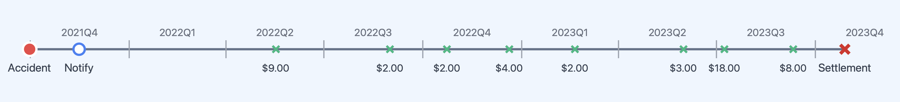

```{r}
#| echo: false
#| warning: false
# Bind reticulate to the project venv BEFORE any python chunk runs.
# (Package loading happens on the case study's imports slide.)
reticulate::use_virtualenv("../.venv", required = TRUE)
# Display python values like the jupyter engine: only the final expression
# in a chunk is auto-printed (a trailing `;` still suppresses it), instead
# of reticulate's default REPL-style echo of every top-level expression.
# And centre figures horizontally (knitr's default is left-aligned,
# unlike the jupyter engine).
knitr::opts_chunk$set(jupyter_compat = TRUE, fig.align = "center")
```

```{python}
#| echo: false
#| warning: false
from setup import *

# BUILD: same load_or_compute caching helper as interpretability.qmd, plus
# pandas/pyarrow to read the data/splice/*.parquet files written by the
# R generation chunk in the case study section.


def show_df(df):
    """Emit a dataframe as HTML in an `output: asis` chunk, wrapped in the
    same .cell-output div the jupyter engine would use — this is what gives
    wide tables their horizontal scrollbar on slides (via the .cell-output
    overflow rule in revealjs-style.scss)."""
    print('<div class="cell-output cell-output-display">'
          + df._repr_html_() + "</div>")
```

---

::: {.callout-note}
These slides are currently a work in progress.
The full/final version will be completed soon.
:::

# Introduction


## Why is pricing different from reserving?

::: {.incremental}


- _Pricing_ is prospective and per-policy: no claim exists yet, and we predict the frequency/severity of hypothetical future claims from policy covariates (recall the French motor lectures).
- _Reserving_ is about claims that have already happened: we condition on each claim's unfolding history — payments to date, case estimates — to predict what is still to be paid.
- Consequence for the ML setup: pricing rows are policies with static features; reserving rows are claim-quarter snapshots with _time-varying_ features. That's why this lecture needs a whole preprocessing pipeline.
:::

## From claim severity models to individual reserving

A claim severity model looks at a potential accident from the insured, and tries to work out from their covariates the likely size of such a claim.

An individual reserving model is more specific: an accident has occurred, the insured has been notified, and maybe parts of the claim have already been paid, now we need to guess how much remains in this realised claim.



This is potentially a more promising application for neural networks (more features!).

## Ultimate claim size

For claim $k$, we want to know the  _ultimate claim size_
$$
  U_k := \sum_{t} Y_{k,t},
$$

This is the sum of all _incremental payments_ $Y_{k,t}$ (also called _partial payments_) over the complete lifetime of the claim.

::: {.callout-note}
## Assumption: payments are positive

We assume $Y_{k,t} \ge 0$ throughout. In reality some payments are _negative_ --- called _recoveries_ (e.g. money coming back from a third party or a salvaged vehicle). They are typically so rare and small relative to normal payments that ignoring them is reasonable (though this depends on the dataset).
:::

## Outstanding claim amount

Say the valuation date is $v$, then we've seen the history of the claim $\mathcal{H}_{k,v}$ to that time, including past payments.

So the _outstanding_ (future unpaid amount) for claim $k$ is
$$
  O_k(v) := \sum_{t>v} Y_{k,t}.
$$

If the claim is still ongoing, then we have
$$
  U_k = \sum_{t \le v} Y_{k,t} + O_k(v) \,.
$$

In words:
$$
\text{Ultimate} = \text{Cumulative payments before } v + \text{Outstanding amount from } v \text{ onwards}
$$

## Total outstanding

For a portfolio, we'd like to know the _total outstanding_

$$
  T(v) := \sum_{k\in\mathcal{O}(v)} O_k(v) \,,
$$
where $\mathcal{O}(v)$ is the set of all open claims at valuation time $v$.

Note: this doesn't include _incurred but not reported (IBNR)_ claims.

## The total outstanding, visually

```{python}
#| echo: false
#| fig-dpi: 350
# Schematic (hand-crafted, not SPLICE data), following the visual language
# of the splitting.html webapp: line from notification to finalisation,
# circle = notification, x = payment, big X = finalisation. One dashed
# valuation line; open claims' post-v segments highlighted (their future
# payments are the O_k(v)'s summing to T(v)); an IBNR claim at the bottom.
# Called back in the wrap-up as the limitation of individual reserving.
_v = 10
_diagram_claims = [  # (notification, [payment times], finalisation)
    (1.0, [2.5, 4.0], 5.5),
    (2.0, [3.0, 6.0, 8.5], 9.4),
    (3.5, [5.0, 8.0, 11.0, 13.0], 14.0),
    (5.0, [6.5, 9.0], 9.8),
    (6.0, [7.5, 12.0, 15.5], 17.0),
    (8.0, [9.5, 11.5, 14.0], 15.0),
]
_GREY, _TEAL, _PINK = "#B8B8B8", "#3F9999", "#FF8FA9"

plt.figure(figsize=(5, 2.8))
for _row, (_n, _pays, _f) in enumerate(_diagram_claims):
    _y = -_row
    if _n <= _v < _f:  # open at the valuation date
        plt.plot([_n, _v], [_y, _y], color=_TEAL, linewidth=1.5)
        plt.plot([_v, _f], [_y, _y], color=_PINK, linewidth=2.5)
        for _p in _pays:
            _c = _TEAL if _p <= _v else _PINK
            plt.plot(_p, _y, "x", color=_c, markersize=5)
        plt.plot(_n, _y, "o", color=_TEAL, markersize=4)
        plt.plot(_f, _y, "X", color=_PINK, markersize=6)
    else:  # already closed: greyed out
        plt.plot([_n, _f], [_y, _y], color=_GREY, linewidth=1.5)
        for _p in _pays:
            plt.plot(_p, _y, "x", color=_GREY, markersize=5)
        plt.plot(_n, _y, "o", color=_GREY, markersize=4)
        plt.plot(_f, _y, "X", color=_GREY, markersize=6)

# The IBNR claim: occurred before v, notified after v — invisible at v.
_y_ibnr = -len(_diagram_claims) - 0.6
plt.plot(8.5, _y_ibnr, "^", color="#666666", markersize=5)
plt.plot([8.5, 12.0], [_y_ibnr, _y_ibnr], color=_GREY,
         linewidth=1.2, linestyle=":")
plt.plot([12.0, 16.0], [_y_ibnr, _y_ibnr], color=_GREY, linewidth=1.5)
plt.plot(12.0, _y_ibnr, "o", color=_GREY, markersize=4)
for _p in [13.0, 15.0]:
    plt.plot(_p, _y_ibnr, "x", color=_GREY, markersize=5)
plt.plot(16.0, _y_ibnr, "X", color=_GREY, markersize=6)
plt.annotate("IBNR: accident before $v$, reported after",
             (8.2, _y_ibnr), ha="right", va="center", fontsize=7,
             color="#666666")

# Stop the dashed line below the label so the text doesn't sit on it.
plt.plot([_v, _v], [_y_ibnr - 0.9, 0.55], color="black",
         linestyle="--", linewidth=1)
plt.annotate("valuation time $v$", (_v, 0.9), ha="center",
             va="bottom", fontsize=8)
plt.annotate("$O_k(v)$", (12.0, -1.6), ha="center", va="bottom",
             fontsize=8, color=_PINK)
plt.annotate("$T(v)$ = sum of the\nhighlighted future payments",
             (17.2, -3.0), ha="right", va="center", fontsize=7)

plt.ylim(_y_ibnr - 0.9, 1.6)
plt.yticks([])
plt.gca().spines["left"].set_visible(False)
plt.xlabel("Time (quarters)");
```

Each open claim's future payments (highlighted) get summed to give $T(v)$.

The bottom claim has _occurred_ before $v$ but hasn't been _notified_ yet.
No individual model can reserve for a claim it cannot see --- IBNR needs a separate adjustment.

# An Individual Claim

## The key dates


A claim is _open_ if not yet finalised.

$$
  \mathcal{O}(v) := \{ k : d_k^F > v \} \,.
$$

(Though, technically, claims sometimes finalise, and then get reopened with further payments, and refinalised again.)

## Series of incremental payments

| Event | Date | Amount |
|-------|------|--------|
| Accident | 2021-09-30 | |
| Notification | 2021-11-15 | |
| Payment #1 | 2022-05-17 | $9.00 |
| Payment #2 | 2022-08-31 | $2.00 |
| Payment #3 | 2022-10-23 | $2.00 |
| Payment #4 | 2022-12-20 | $4.00 |
| Payment #5 | 2023-02-19 | $2.00 |
| Payment #6 | 2023-05-31 | $3.00 |
| Payment #7 | 2023-07-08 | $18.00 |
| Payment #8 | 2023-09-10 | $8.00 |
| Finalisation | 2023-10-28 | |

## Case estimates

Alongside payments, the insurer holds a _case estimate_ $C_{k,v} \ge 0$: a claims assessor's live, subjective estimate of the outstanding liability at the end of quarter $v$.

The assessor is aiming for
$$
  C_{k,v} \approx O_k(v) \,.
$$

The crucial difference: $C_{k,v}$ is _known at time_ $v$, whereas $O_k(v)$ is only knowable in retrospect, once the claim finalises.

So case estimates play two roles for us:

- a _strong predictor_ to feed into the model, and
- a _benchmark to beat_ (if the model can't out-predict the assessors, why bother?).

## Payments and case estimates together

The same running example claim, now with the assessor's revisions interleaved.
Note the case estimate is a _level_ (the current view of what's left), not a flow.

| Date | Event | Payment | Case estimate |
|------|-------|--------:|--------------:|
| 2021-11-15 | Notification, initial estimate | | $30.00 |
| 2022-05-17 | Payment #1 | $9.00 | $21.00 |
| 2022-06-20 | Review: worse than hoped | | $35.00 |
| 2022-08-31 | Payment #2 | $2.00 | $33.00 |
| 2022-10-23 | Payment #3 | $2.00 | $31.00 |
| 2022-12-20 | Payment #4 | $4.00 | $27.00 |
| 2023-02-19 | Payment #5 | $2.00 | $25.00 |
| 2023-05-31 | Payment #6 | $3.00 | $22.00 |
| 2023-07-08 | Payment #7 (settlement agreed) | $18.00 | $8.00 |
| 2023-09-10 | Payment #8 | $8.00 | $0.00 |
| 2023-10-28 | Finalisation | | $0.00 |

With hindsight: the true outstanding just after Payment #1 was $39, while the assessor's estimate was $21 --- case estimates are informative but not oracles.


## Putting it all together: payments growing

```{python}
#| echo: false
# One synthetic claim's life, on the nominal basis (case estimates are
# nominal). Claim 19 is hand-picked: its case estimate starts too low,
# overshoots, then settles — the full story in one claim. Plotted over two
# slides (incurred view, then case estimate view) from this shared prep.
# NB this chunk reads the parquet fixture BEFORE the case study's generation
# chunk runs, so data/splice/*.parquet must exist (it is the committed,
# non-regenerable fixture — see the case study section). Uses the full-name
# imports from setup.py (pandas, plt) so the case study's visible
# `import pandas as pd` etc. slide is not preempted.
claim_story_no = 19
_claims = pandas.read_parquet("data/splice/claims.parquet")
_payments = pandas.read_parquet("data/splice/payments.parquet")
_estimates = pandas.read_parquet("data/splice/estimates.parquet")

_claim = _claims.set_index("claim_no").loc[claim_story_no]
_pay = (_payments[_payments["claim_no"] == claim_story_no]
        .sort_values("payment_time"))
_est = (_estimates[_estimates["claim_no"] == claim_story_no]
        .sort_values("txn_time"))

_ultimate = _pay["payment_inflated"].sum() / 1_000
_t_acc = _claim["occurrence_time"]
_t_notif = _t_acc + _claim["notidel"]
_t_final = _t_notif + _claim["setldel"]

_t_paid = [_t_acc, *_pay["payment_time"], _t_final]
_cum_paid = [0.0, *(_pay["payment_inflated"].cumsum() / 1_000), _ultimate]
_t_est = [_t_notif, *_est["txn_time"], _t_final]
_case_est = [_est["OCL"].iloc[0] / 1_000, *(_est["OCL"] / 1_000), 0.0]
_incurred = [_est["incurred"].iloc[0] / 1_000,
             *(_est["incurred"] / 1_000), _ultimate]
_y_top = max(_incurred) * 1.08  # shared y-limits so the two slides overlay

# Transactions where the assessor actually issued a new estimate, as opposed
# to the automatic dollar-for-dollar knock-on from a payment (txn_type "P").
# SPLICE labels them major ("Ma"/"PMa") or minor ("Mi"/"PMi") revisions.
_major = _est["txn_type"].str.contains("Ma")
_minor = _est["txn_type"].str.contains("Mi")


def _mark_revisions(values, colour):
    for mask, marker, size, label in [(_major, "D", 14, "Major revision"),
                                      (_minor, "o", 10, "Minor revision")]:
        plt.scatter(_est.loc[mask, "txn_time"], values[mask] / 1_000,
                    marker=marker, s=size, color=colour, zorder=5,
                    label=label)


def _claim_base_plot():
    plt.figure(figsize=(5, 2.6))
    plt.axhline(_ultimate, color="black", linestyle="--",
                linewidth=1, zorder=1)
    # Label the dashed line at the right, just above it: the upper-left is
    # taken by the legend, below-right by the outstanding line (slide 1),
    # and the incurred plateau (slide 2) sits high enough to clear this.
    plt.annotate("Ultimate", (_t_final - 1.5, _ultimate), ha="center",
                 textcoords="offset points", xytext=(0, 4), fontsize=8)
    plt.ylim(0, _y_top)
    plt.xlabel("Time since accident (quarters)")
    plt.ylabel("Amount ($000s)")
```

```{python}
#| echo: false
#| fig-dpi: 350
_claim_base_plot()
plt.step(_t_paid, _cum_paid, where="post", color="#3F9999",
         linewidth=2, label="Cumulative payments")
plt.step(_t_est, _incurred, where="post", color="#CC91BC",
         linewidth=2, label="Incurred")
_mark_revisions(_est["incurred"], "#CC91BC")
plt.legend(fontsize=7, frameon=False, loc="upper left");
```

Payments step up toward the ultimate.
The _incurred_, which is cumulative payments plus the case estimate of the outstanding, is the assessor's running view of the ultimate.

## Putting it all together: outstanding shrinking

```{python}
#| echo: false
#| fig-dpi: 350
_claim_base_plot()
plt.step(_t_paid, [_ultimate - c for c in _cum_paid], where="post",
         color="#FF8FA9", linewidth=2, label="True outstanding")
# A hue well away from both the pink outstanding here and the mauve
# incurred on the previous slide.
plt.step(_t_est, _case_est, where="post", color="#E69F00",
         linewidth=2, label="Case estimate (OCL)")
_mark_revisions(_est["OCL"], "#E69F00")
plt.legend(fontsize=7, frameon=False, loc="upper left");
```

The same claim upside down: the true outstanding falls to zero as the payments arrive.
The _outstanding claims liability (OCL)_ is the assessor's live forecast of the outstanding, and drops to zero.

## Three levels of data visibility

1. _Individual transaction level_: Stores every transaction or other update for every claim. Highest granularity. Often just visible in the insured's bank statements, or in insurance company's finance records. Usually considered too granular to be useful for actuaries.
2. _Individual quarterly summaries_: This aggregates all the payments within a quarter (alternatively per month) for each claim. This is what the actuary would see.
3. _Portfolio quarterly summaries_: Aggregates all payments within a quarter (alternatively per month) across all claims. This feeds into a Chain Ladder style of reserving.

# Benchmark: Aggregate Reserving


## Aggregate reserving

You have seen the classical approach to reserving already.
The insurer's past payments are aggregated into a _run-off triangle_: rows are accident years, columns are development years, and each cell holds the cumulative amount paid so far.

| Accident Year | Dev 1 | Dev 2 | Dev 3 |
|---------------|------:|------:|------:|
| 2021 | 100 | 150 | 165 |
| 2022 | 120 | 180 | ? |
| 2023 | 140 | ? | ? |

The lower-right of the triangle is the future: it hasn't happened yet, and the _reserve_ is our estimate of it.

## Chain ladder

Chain ladder fills in the triangle by assuming each accident year develops in the same proportions as the past ones.

- Development factor from Dev 1 to Dev 2:
  $f_1 = \frac{150 + 180}{100 + 120} = 1.5$
- Development factor from Dev 2 to Dev 3:
  $f_2 = \frac{165}{150} = 1.1$

Projecting forward:

| Accident Year | Dev 1 | Dev 2 | Dev 3 | Reserve |
|---------------|------:|------:|------:|--------:|
| 2021 | 100 | 150 | 165 | 0 |
| 2022 | 120 | 180 | _198_ | 18 |
| 2023 | 140 | _210_ | _231_ | 91 |

The total reserve here is $18 + 91 = 109$.


## What chain ladder ignores

Every claim in the same accident year is treated identically.
The triangle has already thrown away:

- _who_ was injured (age, injury severity),
- _how_ the claim is progressing (legal representation, payment pattern),
- the case estimates set by claims assessors.

If two claims have paid out the same amount so far, chain ladder implicitly reserves the same for both --- even if one is a minor injury about to settle and the other is heading to court.

## Why individual claim reserving?

With claim-level data and machine learning, we can use those discarded covariates to predict each claim's outstanding amount separately.

- The portfolio reserve is then just a sum: $T(v) = \sum_{k \in \mathcal{O}(v)} O_k(v)$.
- Per-claim predictions are useful beyond the total: claims triage (which claims need senior assessors?), segmenting the reserve by injury severity or legal representation, spotting claims whose case estimates look off.
- Chain ladder remains the _benchmark_: an individual model that can't beat the triangle isn't worth its complexity.

::: {.callout-note}
Next week's guest lecture digs into _when and why_ aggregate models break down, and the trade-offs between micro- and macro-level models. Today we focus on individual-level approach and how to implement it.
:::

# Preprocessing One Claim


## Noting the quarters

We work in quarters --- the standard in actuarial practice.
Each event date is binned into its calendar quarter, and we also track the _development quarter_ (quarters since the accident).

| Event | Date | Calendar Quarter | Amount | Dev Quarter |
|-------|------|-----------------|--------|-------------|
| Accident | 2021-09-30 | 2021Q3 | | Q1 |
| Notification | 2021-11-15 | 2021Q4 | | Q2 |
| Payment #1 | 2022-05-17 | 2022Q2 | $9.00 | Q4 |
| Payment #2 | 2022-08-31 | 2022Q3 | $2.00 | Q5 |
| Payment #3 | 2022-10-23 | 2022Q4 | $2.00 | Q6 |
| Payment #4 | 2022-12-20 | 2022Q4 | $4.00 | Q6 |
| Payment #5 | 2023-02-19 | 2023Q1 | $2.00 | Q7 |
| Payment #6 | 2023-05-31 | 2023Q2 | $3.00 | Q8 |
| Payment #7 | 2023-07-08 | 2023Q3 | $18.00 | Q9 |
| Payment #8 | 2023-09-10 | 2023Q3 | $8.00 | Q9 |
| Finalisation | 2023-10-28 | 2023Q4 | | Q10 |

The exact dates $d_k^A, d_k^N, d_k^F$ are then discarded; we only keep the quarters $(A_k, N_k, F_k)$.

::: {.callout-warning}
A side effect of discretising: a claim that opens _and_ closes within a single quarter vanishes from the snapshot dataset entirely.
:::

## Quarterly aggregation

All payments within a quarter collapse into one number, $Y_{k,t}$ --- including quarters with _zero_ payments, which are kept as rows.

| Quarter | Total Paid |
|---------|------------|
| 2022Q2 | $9.00 |
| 2022Q3 | $2.00 |
| 2022Q4 | $8.00 |
| 2023Q1 | $2.00 |
| 2023Q2 | $3.00 |
| 2023Q3 | $26.00 |

Case estimates within a quarter are summarised by their _latest_ value (the estimate is a level, not a flow --- summing revisions would be meaningless).


## Adjusting for inflation

A dollar paid in 2015 is not a dollar paid in 2025.
If past payments enter the model in nominal terms, the model must waste capacity learning inflation --- and drifts as soon as inflation changes.

- Deflate all dollar amounts to the valuation date using a suitable index (e.g. wage inflation for injury claims, since costs are dominated by wages and care).
- Fit the model in _real_ dollars; re-inflate predictions afterwards if needed.


## From history to features

Everything known about claim $k$ at valuation quarter $v$:
$$
  \mathcal{H}_{k,v} := \left\{A_k, N_k, (Z_{k,t})_{t\le v},\ (Y_{k,t})_{t\le v},\ (C_{k,t})_{t\le v}\right\}
$$

Some covariates $Z_{k,t}$ are _static_ (age at accident, injury severity), others are _time-varying_ (legal representation can switch on mid-claim).

Problem: this history has a _different length_ for every $(k, v)$.
Neural networks (the tabular kind we know) want a fixed-length vector.

The preprocessing pipeline is a deterministic map
$$
  X_{k,v} := \Phi(\mathcal{H}_{k,v}) \in \mathbb{R}^p .
$$

## Two kinds of time-varying covariates

When $\Phi$ compresses the history, the time-varying covariates split into two kinds:

1. _Only the latest value matters._ E.g. legal representation status, or the current case estimate: keep $Z_{k,v}$, discard the path. (Implicitly a _Markov-style_ assumption: the current state is a sufficient summary.)
2. _The path matters._ E.g. the payments-per-quarter series: a claim that paid $40 in one early lump differs from one that dribbled out $10 four times. These get summarised as functions of the whole history --- they are _path-dependent_ features.


Deciding which kind each covariate is _is itself a modelling choice_: treating the case estimate as "latest value only" throws away how often the assessor has revised it.

## Summarising the payment history

How does $\Phi$ compress a variable-length payment history into fixed columns? Summary statistics:

- development quarter $v - A_k$, notification delay $N_k - A_k$,
- count / sum / mean / std / min / max of past payments,
- the latest case estimate,
- current values of the time-varying covariates,
- the static covariates unchanged.


## Alternative: let an RNN read the history

The claim history is naturally a _sequence_ --- one vector per development quarter:
$$
  \bigl( Y_{k,t},\ C_{k,t},\ Z_{k,t} \bigr) \quad \text{for } t = N_k, \dots, v .
$$

So instead of hand-crafting summary statistics, we could (recall Week 4):

- feed the quarter-by-quarter vectors into a recurrent layer (e.g. GRU/LSTM),
- take the final hidden state as a _learned_ summary of the history --- a trainable replacement for $\Phi$'s count/sum/mean/etc.,
- concatenate the static covariates, and predict $O_k(v)$ with a dense head.


## Preparing features for a neural network

The second half of $\Phi$ is the standard tabular recipe from earlier weeks:

- `log1p` transform dollar amounts (heavy tails!),
- one-hot encode categoricals (age band, injury severity, legal representation),
- min--max scale numeric columns --- with scalers _fit on the training set only_.


## Creating claim snapshots


One finalised claim, viewed retrospectively from _every_ quarter it was open, yields one training row per quarter:
$$
  (X_{k,v},\ O_k(v)) \quad \text{for } v = N_k, \dots, F_k - 1 .
$$

So a claim that took $F_k - N_k$ quarters to settle contributes $F_k - N_k$ rows.
The full supervised dataset is
$$
  \mathcal{D} := \{(X_{k,v}, O_k(v)) : k \in \mathcal{I},\ v = N_k, \dots, F_k - 1\}.
$$


# Splitting Claims into Datasets


## A portfolio of claims over time


Now zoom out from one claim to the whole portfolio.
Every claim needs to be allocated to train, validation, or test --- but claims _overlap in time_, so the familiar shuffled random split deserves suspicion.

## Two natural ways to split claims in time

Claims have two anchor dates you could split on:

- by _notification_ quarter: a claim belongs to the era in which it _arrived_, or
- by _finalisation_ quarter: a claim belongs to the era in which it _completed_.

Both are sensible-looking temporal splits (the interactive demo shows both).
But they differ in one important way: under a notification split, the training set contains claims that are _still open_ at the end of the training window --- and for those, we don't know the true outstanding.

## The trouble with splitting by notification

For an in-progress claim, we haven't yet seen the target, we only know the _bound_:
$$
  U_k \ge \sum_{t \le v} Y_{k,t} \,,
$$
i.e. the ultimate is at least what's been paid so far. This is a _censored_ observation (the survival-analysis kind).

You could still train on these rows: add a loss term that penalises predictions of the ultimate _below_ the payments made to date.

## It's simpler if we predict the outstanding

We chose to predict the _outstanding_ $O_k(v)$ rather than the ultimate $U_k$ directly.

- For a censored row, the bound $U_k \ge \text{paid so far}$ translates to just $O_k(v) \ge 0$.
- Any sensible model of the outstanding would only predicts _positive_ values.
- So the censored observations impose a constraint the model satisfies _by construction_, they carry no usable information.

So we predict the outstanding, split by _finalisation_ quarter, and train only on fully-observed claims.


## Train / validation / test splits

Split claims by their _finalisation quarter_:


## Why split by claim, not by row?

One claim generates $F_k - N_k$ snapshot rows, and consecutive snapshots of the same claim are _near-duplicates_ (the history only grows by one quarter).

If we randomly shuffled _rows_ into train/val/test, almost every test row would have a sibling in the training set.
The model could just memorise claims --- validation scores would look brilliant, deployment would disappoint.

So: _all snapshots from one claim go to the same set_. Splitting by finalisation quarter guarantees this, and keeps time flowing in one direction too.


## Censoring at the observation date

Claims still open at the end of the data window are _right-censored_: we can see their history, but not their target $O_k(v)$ (the future payments haven't happened yet).

- They can't be used for training or testing as their label is unknown.
- But they are precisely the claims we need predictions for in deployment! They form the _unfinalised set_.


# Case Study: Synthetic Claims

## Imports for the case study

The R side simulates the data and runs the classical benchmark:

```{r}
#| message: false
#| warning: false
library(SPLICE)       # synthetic claims with case estimates
library(ChainLadder)  # the classical benchmark
library(arrow)        # parquet files: handing data from R to Python
```

The Python side does the machine learning:

```{python}
import numpy as np
import pandas as pd
from sklearn.compose import ColumnTransformer
from sklearn.linear_model import Ridge
from sklearn.metrics import root_mean_squared_error
from sklearn.pipeline import make_pipeline
from sklearn.preprocessing import (FunctionTransformer, MinMaxScaler,
                                   OneHotEncoder)
```

## Generating synthetic claims with SPLICE

SynthETIC [@avanzi2021synthetic] generates the claims and payments; SPLICE [@avanzi2023splice] adds the case estimates; the claim-level covariates plug in via SynthETIC's covariates module.

```{r}
#| eval: false
sim <- generate_data(
  n_claims_per_period = 100,   # ~4,000 claims in total
  n_periods           = 40,    # 40 quarters = 10 accident years
  complexity          = 5,     # the most realistic scenario
  random_seed         = 20260712,
  covariates_obj      = SynthETIC::test_covariates_obj
)
claims <- cbind(sim$claim_dataset, sim$covariates_data$data)
write_parquet(claims, "data/splice/claims.parquet")
write_parquet(sim$payment_dataset, "data/splice/payments.parquet")
write_parquet(sim$incurred_dataset, "data/splice/estimates.parquet")
```

```{r}
#| echo: false
#| output: false
# The chunk shown above is eval: false; this hidden twin actually runs it,
# guarded so the saved dataset is never clobbered. The guard is load-bearing:
# SPLICE's random_seed does NOT reproduce the payment-level simulation across
# sessions, so data/splice/*.parquet is the source of truth (commit it).
dir.create("data/splice", recursive = TRUE, showWarnings = FALSE)
if (!file.exists("data/splice/claims.parquet")) {
  sim <- generate_data(
    n_claims_per_period = 100, n_periods = 40, complexity = 5,
    random_seed = 20260712,
    covariates_obj = SynthETIC::test_covariates_obj
  )
  claims <- cbind(sim$claim_dataset, sim$covariates_data$data)
  write_parquet(claims, "data/splice/claims.parquet")
  write_parquet(sim$payment_dataset, "data/splice/payments.parquet")
  write_parquet(sim$incurred_dataset, "data/splice/estimates.parquet")
}
```

Three tables: one row per _claim_, per _payment_, and per _case estimate transaction_.


## One synthetic claim's payments

```{python}
#| echo: false
claims = pd.read_parquet("data/splice/claims.parquet")
payments = pd.read_parquet("data/splice/payments.parquet")
estimates = pd.read_parquet("data/splice/estimates.parquet")
```

One claim's payments (note the paired nominal/deflated columns):

```{python}
#| eval: false
payments[payments["claim_no"] == 1][["pmt_no", "payment_time", "payment_period", "payment_size", "payment_inflated"]]
```

```{python}
#| echo: false
#| output: asis
# Hidden twin of the chunk above: under the knitr engine a bare dataframe
# shows as plain text, so emit pandas' HTML repr as raw output instead
# (the jupyter engine does this automatically).
show_df(payments[payments["claim_no"] == 1][["pmt_no", "payment_time", "payment_period","payment_size", "payment_inflated"]])
```

## One synthetic claim's case estimates

Its case estimate transactions (`OCL` is the case estimate):

```{python}
#| eval: false
estimates[estimates["claim_no"] == 1][["txn_time", "txn_type", "cumpaid", "OCL"]]
```

```{python}
#| echo: false
#| output: asis
show_df(estimates[estimates["claim_no"] == 1][["txn_time", "txn_type", "cumpaid", "OCL"]])
```

::: {.content-visible unless-format="revealjs"}
The package shows payments as both a nominal (`payment_inflated`) and a deflated (`payment_size`) amount, and we model the deflated ones.
The case estimates are revised at irregular times, just like the toy table earlier --- though note they are tracked in nominal dollars (assessors think in the money of the day).
:::


## From transactions to snapshot rows

Bin each claim's key dates into quarters, and sort the claims into groups:

```{python}
T_END = 40  # the valuation quarter (end of the observation window)

claims["notif_qtr"] = np.ceil(claims["occurrence_time"] + claims["notidel"]).astype(int)
claims["final_qtr"] = np.ceil(claims["occurrence_time"] + claims["notidel"] + claims["setldel"]).astype(int)

ibnr = claims["notif_qtr"] > T_END
unfinalised = ~ibnr & (claims["final_qtr"] > T_END)
flash = ~ibnr & ~unfinalised & (claims["final_qtr"] == claims["notif_qtr"])
observed = claims[~ibnr & ~unfinalised & ~flash]
```

```{python}
#| echo: false
print(f"{len(claims):,} claims: {len(observed):,} finalised & usable, "
      f"{unfinalised.sum():,} unfinalised, {ibnr.sum():,} IBNR, "
      f"{flash.sum():,} settled within a quarter")
```

Every category from the theory shows up in the counts.

::: {.content-visible unless-format="revealjs"}
The simulator produced genuine IBNR claims --- occurred but not yet notified at the valuation date, so we must discard them, just as reality hides them from the insurer.
And some claims open and close within a single quarter, so they _vanish_ under the quarterly discretisation, exactly as the earlier callout warned.
:::

## Building the snapshot grid

One row per claim per open quarter, with the quarterly payments $Y_{k,t}$ merged in (missing quarters become zero-payment rows):

```{python}
n_snapshots = (observed["final_qtr"] - observed["notif_qtr"]).to_numpy()
grid = observed.loc[observed.index.repeat(n_snapshots),
    ["claim_no", "occurrence_period", "notif_qtr", "final_qtr", "notidel",
     "Legal Representation", "Injury Severity", "Age of Claimant"]].copy()
grid["quarter"] = grid["notif_qtr"] + grid.groupby("claim_no").cumcount()

quarterly = (payments.groupby(["claim_no", "payment_period"])["payment_size"]
             .sum().rename("Incremental").reset_index())
grid = grid.merge(quarterly, left_on=["claim_no", "quarter"],
                  right_on=["claim_no", "payment_period"], how="left")
grid["Incremental"] = grid["Incremental"].fillna(0.0)
grid = grid.drop(columns="payment_period")
```

## History summaries, case estimates, and the target

The path-dependent features (expanding summaries of the payment history), the current-state features (latest case estimate, forward-filled), and the target:

```{python}
g = grid.groupby("claim_no")["Incremental"]
grid["count_Incremental"] = ((grid["Incremental"] > 0)
                             .groupby(grid["claim_no"]).cumsum())
grid["sum_Incremental"] = g.cumsum()
for stat in ["mean", "std", "min", "max"]:
    grid[f"{stat}_Incremental"] = getattr(g.expanding(), stat)().to_numpy()
grid["std_Incremental"] = grid["std_Incremental"].fillna(0.0)

ultimate = payments.groupby("claim_no")["payment_size"].sum()
grid["Outstanding"] = grid["claim_no"].map(ultimate) - grid["sum_Incremental"]
grid["development_period"] = grid["quarter"] - grid["occurrence_period"] + 1
```

```{python}
estimates["txn_qtr"] = np.ceil(estimates["txn_time"]).astype(int)
latest = (estimates.sort_values("txn_time")
          .groupby(["claim_no", "txn_qtr"])["OCL"].last()
          .rename("Estimate").reset_index())
grid = grid.merge(latest, left_on=["claim_no", "quarter"],
                  right_on=["claim_no", "txn_qtr"], how="left")
grid["Estimate"] = grid.groupby("claim_no")["Estimate"].ffill()
grid = grid.drop(columns="txn_qtr")
```

## The dataset after preprocessing

```{python}
#| eval: false
grid[["claim_no", "quarter", "development_period", "Incremental",
      "sum_Incremental", "Estimate", "Outstanding"]].head(8)
```

```{python}
#| echo: false
#| output: asis
show_df(grid[["claim_no", "quarter", "development_period", "Incremental",
              "sum_Incremental", "Estimate", "Outstanding"]].head(8))
```


## Splitting by finalisation quarter

```{python}
T_TRAIN, T_VAL = 28, 34
splits = {
    "train": grid[grid["final_qtr"] <= T_TRAIN],
    "val": grid[(grid["final_qtr"] > T_TRAIN) & (grid["final_qtr"] <= T_VAL)],
    "test": grid[grid["final_qtr"] > T_VAL],
}
```

```{python}
#| echo: false
for name, df in splits.items():
    print(f"{name:6s} {len(df):7,} rows {df['claim_no'].nunique():6,} claims  "
          f"(finalisation quarters {df['final_qtr'].min()}"
          f"..{df['final_qtr'].max()})")
```

Note rows $\gg$ claims: each claim contributes one row per quarter it was open --- and every one of a claim's rows lands in the same set.

## Benchmark: chain ladder


```{r}
payments <- read_parquet("data/splice/payments.parquet")
observed <- subset(payments, payment_period <= 40)
observed$acc_year <- ceiling(observed$occurrence_period / 4)
observed$dev_year <- ceiling(observed$payment_period / 4) -
  observed$acc_year + 1

incr <- aggregate(payment_size ~ acc_year + dev_year, observed, sum)
tri <- incr2cum(as.triangle(incr, origin = "acc_year",
                            dev = "dev_year", value = "payment_size"))
round(tri / 1e6, 2)  # cumulative payments, $m
```

## The chain ladder reserve

```{r}
mack <- MackChainLadder(tri, est.sigma = "Mack")
reserve_cl <- summary(mack)$Totals["IBNR:", ]
true_outstanding <- sum(subset(payments, payment_period > 40)$payment_size)

cat(sprintf("Chain ladder reserve:   $%.1fm\n", reserve_cl / 1e6),
    sprintf("True total outstanding: $%.1fm\n", true_outstanding / 1e6))
```

As this is synthetic data, we know the future and can compare against the true value.


## A baseline model: GLM

Before any neural network: ridge regression on the log outstanding, with the standard tabular recipe as an sklearn pipeline.

```{python}
dollar_cols = ["Incremental", "sum_Incremental", "mean_Incremental",
               "std_Incremental", "min_Incremental", "max_Incremental"]
numeric_cols = ["development_period", "notidel", "count_Incremental"]
cat_cols = ["Legal Representation", "Injury Severity", "Age of Claimant"]

def make_glm(with_estimate):
    dollars = dollar_cols + (["Estimate"] if with_estimate else [])
    preprocess = ColumnTransformer([
        ("dollars", make_pipeline(FunctionTransformer(np.log1p),
                                  MinMaxScaler()), dollars),
        ("numeric", MinMaxScaler(), numeric_cols),
        ("categorical", OneHotEncoder(drop="first"), cat_cols),
    ])
    return make_pipeline(preprocess, Ridge(alpha=1e-4))
```

Two versions: _without_ and _with_ the case estimate as a feature.


## How do the GLMs do?

```{python}
X_train, X_test = splits["train"], splits["test"]
y_train = np.log1p(X_train["Outstanding"])
y_test = np.log1p(X_test["Outstanding"])

for with_est in [False, True]:
    glm = make_glm(with_est).fit(X_train, y_train)
    rmse = root_mean_squared_error(y_test, glm.predict(X_test))
    print(f"GLM {'with' if with_est else 'without'} case estimates:"
          f" test RMSE (log scale) = {rmse:.3f}")

rmse_ce = root_mean_squared_error(y_test, np.log1p(X_test["Estimate"]))
print(f"Case estimate alone: test RMSE (log scale) = {rmse_ce:.3f}")
```

Two questions for the printed numbers: does the model beat the assessors' estimates? Does giving it the case estimates help?

::: {.content-visible unless-format="revealjs"}
On this synthetic portfolio, even a simple GLM on the payment history beats using the case estimates directly, and adding the case estimates as a feature changes little --- the payment history already carries most of the signal here.
On real data, assessors know things the payment stream doesn't, and this feature tends to matter much more.
:::


## Fitting a neural network


## Evaluating the models


# Wrapping Up

## Individual vs aggregate reserving

::: {.incremental}
- _Aggregate_ (chain ladder on triangles): simple, stable, industry standard; but throws away claim-level covariates and gives no per-claim view.
- _Individual_: predicts $O_k(v)$ per open claim; the portfolio reserve is just the sum $T(v)$; supports triage and segmentation; per-claim errors partially cancel in the aggregate.
- Individual level reserving is a data engineering headache, and the total still misses IBNR, so an individual model alone is _not yet_ a full portfolio reserve.
:::


## What we didn't cover

One slide, words only --- pointers to where this goes next:

- _IBNR_: our model only reserves claims it can see; incurred-but-not-reported claims need a separate (usually aggregate) adjustment.
- _Uncertainty_: a reserve needs a risk margin, not just a point estimate; distributional forecasts and ensembling give prediction intervals.
- _When does granular beat aggregate?_

## References {.appendix data-visibility="uncounted"}

::: {#refs}
:::