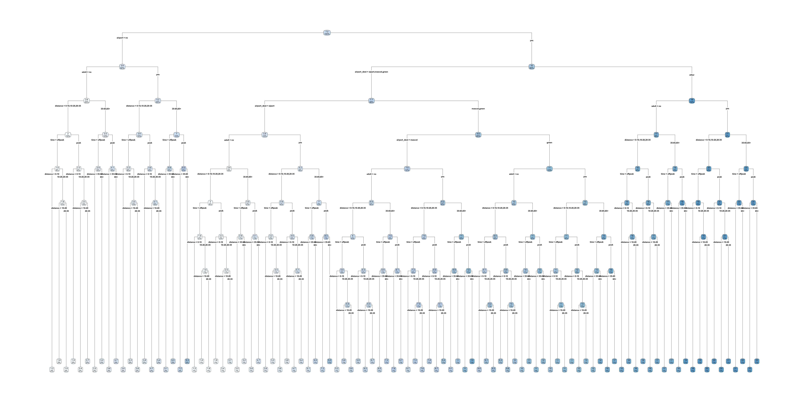
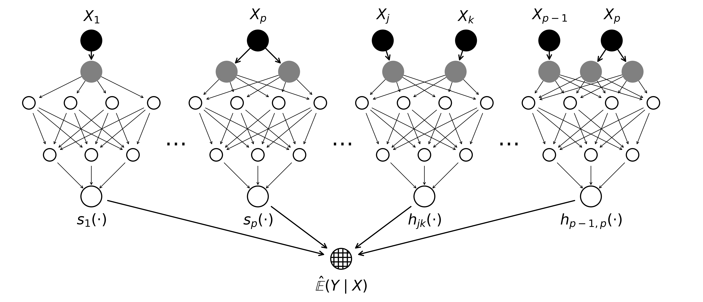
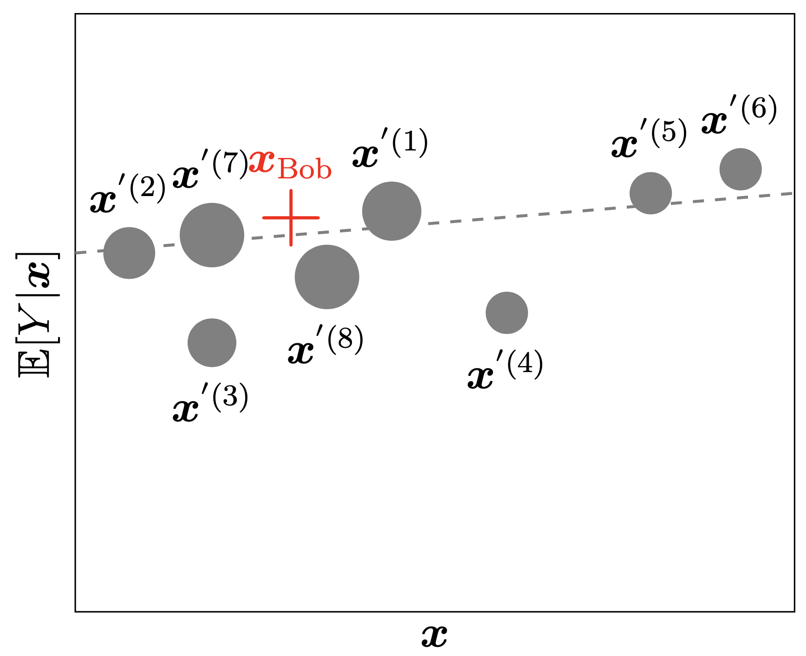
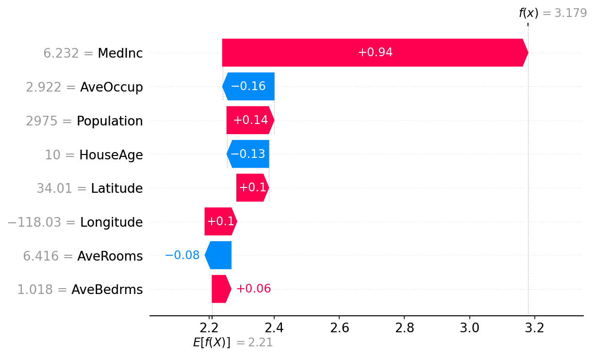

```{python}
#| echo: false
#| warning: false
from setup import *

# Packages only used in hidden (echo: false) code chunks
import json
import pickle
import graphviz
import torch
from pathlib import Path

# Cache-on-disk helper, the pickled-result analogue of `load_or_fit` in
# time-series-and-rnns.qmd. Used for slow computations like permutation
# importance so re-renders skip the expensive step.
def load_or_compute(path, compute, *args, **kwargs):
    """Load a pickled result from `path`, or run `compute(*args, **kwargs)` and pickle it."""
    p = Path(path)
    if p.exists():
        with open(p, "rb") as f:
            return pickle.load(f)
    result = compute(*args, **kwargs)
    p.parent.mkdir(exist_ok=True)
    with open(p, "wb") as f:
        pickle.dump(result, f)
    return result
```

# Introduction

## The right to an explanation

::: columns
::: {.column width="80%"}

> On your thirtieth birthday, you awake to find two police officers standing
over you. They inform you that you’re under arrest. When you ask what for,
they tell you that they don’t know, but their boss, the inspector, will be along soon,
and he’ll be able to tell you. A few hours later, you’re ushered into a neighboring
tenant’s bedroom. The inspector tells you that he doesn’t know what you’ve been
charged with, but you’re free to go about your life, except that you must report
to a hearing on Sunday. And so you move through the criminal justice system,
never knowing what crime you’ve allegedly committed, nor understanding the
rules of the process. On the eve of your thirty-first
birthday, you’re taken away
and executed.
>
> Fortunately, this story is not about you, but is instead about Josef K., the
fictional protagonist of Kafka’s The Trial.
>
> ::: {style="text-align: right;"}
> — @vredenburgh2022right [p. 1]
> :::

:::
::: {.column width="20%"}

<br><br>


:::
:::


---

::: columns
::: {.column width="80%"}

> Unfortunately, a broadly similar story
is probably true about you, thanks to the use of algorithms to aid decision-making
in a variety of institutions. One such example comes from Washington, DC. In
2009, the city set out to improve its school system, where only 8 percent of eighth
graders were performing at grade level in math. It introduced IMPACT, a model
to evaluate teacher performance developed by Mathematica Policy Research. The
aim of the model was to identify poorly performing teachers, as input to firing
decisions. The model that Mathematica Policy Research developed was complex
and proprietary, and teachers couldn’t find anyone to explain to them why they’d
been fired. In response to the firing of her colleagues on the basis of the model’s
outputs, Sarah Bax, a math teacher, asked: “How do you justify evaluating people
by a measure for which you are unable to provide an explanation?”.
>
> ::: {style="text-align: right;"}
> — @vredenburgh2022right [p. 1]
> :::
:::
::: {.column width="20%"}

<br><br><br>


:::
:::


## The situation in insurance

> "Understanding the relationships between the model inputs and outputs builds additional confidence in any model but is particularly challenging for many types of machine learning models. And in many applications, it is necessary for users and reviewers of models to understand whether the relationships between the model inputs and outputs make business sense, are compliant with laws and regulations, and/or can be explained to individuals impacted by the use of the model."
>
> ::: {style="text-align: right;"}
> — @baeder2021interpretable [p. 5]
> :::


---

::: {.callout-note title="Article 22 GDPR – Automated individual decision-making, including profiling"}
1. The data subject shall have the right **not** to be subject to a decision based solely on automated processing, including profiling, which produces legal effects concerning him or her or similarly significantly affects him or her.

2. Paragraph 1 shall not apply if the decision:  
   a) is necessary for entering into, or performance of, a contract between the data subject and a data controller;  
   b) is authorised by Union or Member State law to which the controller is subject and which also lays down suitable measures to safeguard the data subject’s rights and freedoms and legitimate interests; or  
   c) is based on the data subject’s explicit consent.

3. In the cases referred to in points (a) and (c) of paragraph 2, the data controller shall implement suitable measures to safeguard the data subject’s rights and freedoms and legitimate interests, at least the right to obtain human intervention on the part of the controller, to express his or her point of view and to contest the decision.

4. Decisions referred to in paragraph 2 shall not be based on special categories of personal data referred to in Article 9(1), unless point (a) or (g) of Article 9(2) applies and suitable measures to safeguard the data subject’s rights and freedoms and legitimate interests are in place.
:::

::: {.content-visible unless-format="revealjs"}
In some high-stakes contexts, governance and legal obligations make justification, human review and contestability especially important.
:::

## Definitions

> "Surprisingly enough, although the concept of interpretability is increasingly widespread, there is no general consensus on both the definition and the measurement of the interpretability of a model."
>
> ::: {style="text-align: right;"}
> — @delcaillau2022
> :::

> "**Definition** Interpret means _to explain or to present in understandable terms_.
> In the context of ML systems, we define interpretability as _the ability to explain or to present in understandable terms to a human_."
>
> ::: {style="text-align: right;"}
> — @doshi2017
> :::

<!-- 
## Interpretability

Interpretability Definition

:   *Interpretability refers to the ease with which one can understand and comprehend the model's algorithm and predictions.*

Interpretability of black-box models can be crucial to ascertaining trust. -->

## Interpretability $\ne$ Explainability

> "Interpretability is about transparency, about understanding exactly why and how the model is generating predictions, and therefore, it is important to observe the inner mechanics of the algorithm considered. This leads to interpreting the model’s parameters and features used to determine the given output. Explainability is about explaining the behavior of the model in human terms."
>
> ::: {style="text-align: right;"}
> — @charpentier2024insurance
> :::

## Aspects of interpretability

Inherent Interpretability

: The model is interpretable by design.

::: {.content-visible unless-format="revealjs"}
Models with inherent interpretability generally have a simple model architecture where the relationships between inputs and outputs are straightforward. This makes it easy to understand and comprehend the model's inner workings and its predictions. As a result, the decision-making process becomes more convenient. Examples for models with inherent interpretability include:

* linear regression models
* generalized linear regression models
* decision trees. 
:::

Post-hoc Explanations

: The model is not interpretable by design, but we can use other methods to explain the model.

::: {.content-visible unless-format="revealjs"}
Post-hoc explanations refer to applying various techniques to understand how the model makes its predictions after the model is trained. Post-hoc explanations are useful for understanding predictions coming from complex models (less interpretable models) such as:

* neural networks
* random forests
* gradient boosting trees. 
:::

<br>

Global Interpretability

: The ability to understand how the model works.

Local Interpretability

: The ability to interpret/understand each prediction.

::: {.content-visible unless-format="revealjs"}
Global Interpretability focuses on understanding the model's decision-making process as a whole. Global interpretability takes into account the entire dataset. These techniques will try to look at general patterns related to how input data drives the output in general. Examples for global interpretability techniques include:

* global feature importance method
* permutation importance methods

Local Interpretability focuses on understanding the model's decision-making for a specific input observation. These techniques will try to look at how different input features contributed to the output. 
:::

## Interpretable insurance pricing

For general insurance pricing, we adopted six interpretability and practical requirements:

1. _Transparency of main effects_ — an exact description of each covariate's univariate effect on the output.
2. _Transparency of interaction effects_ — which interactions are used, and how they influence the prediction.
3. _Quantification of variable importance_ — rank the covariates by their influence on the output.
4. _Sparsity_ — only include features with a significant impact on the prediction.
5. _Monotonicity_ — capture known monotone relationships (e.g. worse bonus–malus $\Rightarrow$ higher premium).
6. _Smoothness_ — predictions should vary smoothly with certain rating factors.

::: footer
Source: @laub2026anam
:::




## Adversarial examples

::: {.content-visible unless-format="revealjs"}
An adversarial attack refers to a small carefully created modification to the input data that aims to trick the model into making wrong predictions while keeping the `y_true` the same. The goal is to identify instances where subtle modifications in the input data (which are not instantaneously recognized) can lead to erroneous model predictions.
:::

![A demonstration of fast adversarial example generation applied to GoogLeNet on ImageNet. By adding an imperceptibly small vector whose elements are equal to the sign of the elements of the gradient of the cost function with respect to the input, we can change GoogLeNet’s classification of the image [@goodfellow2014explaining]](images/adversarial-example.png)

::: {.content-visible unless-format="revealjs"}
The above example shows how a small perturbation to the image of a panda led to the model predicting the image as a gibbon with high confidence. This indicates that there may be certain patterns in the data which are not clearly seen by the human eye, but the model is relying on them to make predictions. Identifying these sensitivities/vulnerabilities is important to understand how a model is making its predictions.
:::

<!--
## Adversarial text

::: {.content-visible unless-format="revealjs"}
Adversarial attacks on text generation models help users get an understanding of the inner workings of NLP models. This includes identifying input patterns that are critical to model predictions, and assessing performance of NLP models for robustness. 
:::

"[TextAttack](https://github.com/QData/TextAttack) 🐙 is a Python framework for adversarial attacks, data augmentation, and model training in NLP"

{width=80%}

## LLMs are even more opaque

::: columns
::: {.column width="65%"}

<br>

!["Figure 1: An overview of our research from generating to evaluating EmotionPrompt." [@li2023large]](images/llm-emotional-manipulation.png)
:::
::: {.column width="35%"}
 about @ben2025assessing](images/llm-trauma.png)
:::
:::

::: {.content-visible unless-format="revealjs"}
The LLMs performed better after adding some "emotional manipulation" to the prompt.
:::
-->

# Inherently Interpretable Models {visibility="uncounted"}

## What is inherent interpretability?

::: columns
::: {.column width="70%"}

> "Interpretability by design is decided on the level of the machine learning algorithm. If you want a machine learning algorithm that produces interpretable models, the algorithm has to constrain the search of models to those that are interpretable. The simplest example is linear regression: When you use ordinary least squares to fit/train a linear regression model, you are using an algorithm that will produce ... models that are linear in the input features. Models that are interpretable by design are also called **intrinsically** or **inherently** interpretable models."
>
> ::: {style="text-align: right;"}
> — @molnar2020interpretable
> :::

:::
::: {.column width="30%"}

<br><br>


:::
:::

## Examples of interpretable models

::: columns
::: {.column width="40%"}

<br>
<br>
<br>

- Linear regression
- Generalised linear models
- Decision trees
- Decision rules

:::
::: {.column width="60%"}

```{mermaid}
%%| echo: false
graph TD
  A{vpdmax8 < 27}
  A -->|true| B{pcpn8 ≥ 37}
  A -->|false| C{vpdmax6 < 29}

  B -->|true| D{tmax9 ≥ 21}
  B -->|false| E{tmax6 ≥ 26}

  D -->|true| F[11]
  D -->|false| G[118]

  E -->|true| H[60]
  E -->|false| I[133]

  C -->|true| J{tmax7 ≥ 31}
  C -->|false| M{tmax7 < 31}

  J -->|true| K[81]
  J -->|false| L[131]

  M -->|true| N[82]
  M -->|false| O[186]
```

E.g. decision tree for payouts of index insurance [@chen2024managing].

<!-- ::: footer
Source: Jinggong Zhang (2023), Integrated Design for Index Insurance, IME Presentation
::: -->

:::
:::

::: {.content-visible unless-format="revealjs"}
Non-greedy search can improve the accuracy of the tree, without sacrificing interpretability.

> "The optimization over the node parameters (exact for axis-aligned trees, approximate for oblique
trees) assumes the rest of the tree (structure and parameters) is fixed. The greedy nature of the
algorithm means that once a node is optimized, it its [sic] fixed forever."
>
> ::: {style="text-align: right;"}
> — @carreira2018alternating
> :::
:::

::: footer
See, e.g., @carreira2018alternating, for modern trees.
:::


## Some processes don't fit the tree structure

::: columns
::: {.column width="50%"}


:::
::: {.column width="50%"}



:::
:::

::: {.content-visible unless-format="revealjs"}
By including all train pricing, the tree is very big; this is an example of a process that does not fit the tree structure.
:::

## Decision rules

::: columns
:::: {.column width="50%"}

Make predictions using if-then statements related to the inputs.

> "Decision rules can be **as expressive as decision trees, while being more compact**. Decision trees often also suffer from replicated sub-trees, that is, when the splits in a left and a right child node have the same structure."
>
> ::: {style="text-align: right;"}
> — @molnar2020interpretable
> :::

:::
::: {.column width="50%"}
```python
def rail_cost(peak_hours, distance):
  if peak_hours:
      if distance <= 10:
        cost = 3.79
      elif distance <= 20:
        cost = 4.71
      elif distance <= 35:
        cost = 5.42
      elif distance <= 65:
        cost = 7.24
      else:
        cost = 9.31
  else:
      if distance <= 10:
        cost = 2.65
      elif distance <= 20:
        cost = 3.29
      elif distance <= 35:
        cost = 3.79
      elif distance <= 65:
        cost = 5.06
      else:
        cost = 6.51
  return cost
```

:::
:::

<!--
## Scoring rules


::: {.content-visible unless-format="revealjs"}
Here is a scoring rule system trying to predict the risk that a person released from prison will be incarcerated again. A point system was designed, such that the higher the number of points, the higher the risk of recidivism.
:::

::: footer
Source: Adapted from Rudin (2019), [Stop explaining black box machine learning models for high stakes decisions and use interpretable models instead](https://arxiv.org/abs/1811.10154), preprint available under Creative Commons.
:::
-->

<!-- 
## Globally vs. Locally Faithful

Globally Faithful

:   *The interpretable model's explanations accurately reflect the behaviour of the black-box model across the entire input space.*

Locally Faithful

:   *The interpretable model's explanations accurately reflect the behaviour of the black-box model for a specific instance.* -->


## Generalised linear & additive models

A generalised linear model has the form

$$
\hat{y} = g^{-1}\bigl( \beta_0 + \beta_1 x_1 + \dots + \beta_p x_p \bigr)
$$

where $\beta_0, \dots, \beta_p$ are the model parameters.

Global & local interpretations are easy to obtain.

::: {.content-visible unless-format="revealjs"}
The above GLM representation provides a clear interpretation of how a marginal change in a variable $x$ can contribute to a change in the mean of the output. This makes GLM inherently interpretable.
:::

A _Generalised Additive Model_ replaces each linear term with a flexible _shape function_ $f_j$:

$$
\hat{y} = g^{-1}\bigl( \beta_0 + f_1(x_1) + f_2(x_2) + \dots + f_p(x_p) \bigr)
$$

The $f_j$ are typically splines. Each covariate's effect is still a curve you can plot, so the model stays transparent while capturing non-linear effects.

::: {.content-visible unless-format="revealjs"}
The interpretability story is unchanged from the GLM: the prediction is a sum of one-variable effects, so we can plot each $f_j$ to see exactly what the model does with that variable. What we gain is flexibility — the effect of age on claims doesn't need to be a straight line on the link scale. We fit a GAM to real data later in this lecture.
:::

## Neural Additive Models (NAMs)

A NAM is a GAM where each shape function $f_j$ is a _small neural network_, learned jointly with the rest of the model [@agarwal2021].



::: footer
Source: @laub2026anam [Fig. 1].
:::

## Actuarial NAMs (ANAMs)

Recall the six requirements for an interpretable pricing model — the ANAM is a NAM engineered around that checklist [@laub2026anam].

| Requirement | Mechanism in ANAM |
|---|-------|
| Transparency of main effects | one subnetwork per covariate, plotted as a _shape function_ |
| Transparency of interactions | dedicated subnetworks for the selected pairs only |
| Variable importance | variance of each shape function over the data |
| Sparsity | explicit selection of features and interactions |
| Monotonicity | enforced by the architecture |
| Smoothness | roughness penalty on the shape functions |

::: {.content-visible unless-format="revealjs"}
This is why the model is called the _Actuarial_ NAM: the plain NAM already gives transparent main effects, but the remaining rows of the table are extra constraints and training procedures added so that every item on the pricing checklist is satisfied. The monotonicity constraint is baked into the subnetwork's architecture (so it cannot be violated, even off the training data), while smoothness is encouraged with a penalty term added to the loss, in the same spirit as the roughness penalty in a classical GAM. Later in the lecture we fit an ANAM to Belgian motor insurance data with the `anam` package.
:::

## LocalGLMNet

A different route to interpretability: keep the GLM's _form_, but let the coefficients vary [@richman2023a].

$$
\hat{y_i} = g^{-1}\bigl( \beta_0(\boldsymbol{x}_i) + \beta_1(\boldsymbol{x}_i) x_{i1} + \dots + \beta_p(\boldsymbol{x}_i) x_{ip} \bigr)
$$

A GLM with local parameters $\beta_0(\boldsymbol{x}_i), \dots, \beta_p(\boldsymbol{x}_i)$ for each observation $\boldsymbol{x}_i$.
The local parameters are the output of a neural network.

::: {.content-visible unless-format="revealjs"}
Here, $\beta_p$'s are the neurons from the output layer. First, we define a Feed Forward Neural Network using an input layer, several hidden layers and an output layer.  The number of neurons in the output layer must be equal to the number of inputs. Thereafter, we define a skip connection from the input layer directly to the output layer, and merge them using scalar multiplication. Thereafter, the neural network returns the coefficients of the GLM fitted for each individual. We then train the model with the _response_ variable.

Where the GAM/NAM/ANAM family earns its interpretability from an additive decomposition into one-variable effects, the LocalGLMNet instead keeps the familiar regression read-out ("this coefficient times this feature") but makes the coefficients themselves functions of the whole feature vector — so the interpretation is local to each observation.
:::

# Post-hoc Explanations

## Explaining a black box

::: columns
::: {.column width="70%"}

> A black box machine learning model is a
formula that is either too complicated for any human to understand, or proprietary,
so that one cannot understand its inner workings. Black box models
are difficult to troubleshoot, which is particularly problematic for medical data.
Black box models often predict the right answer for the wrong reason (the
“Clever Hans” phenomenon), leading to excellent performance in training but
poor performance in practice. There are numerous
other issues with black box models. In criminal justice, individuals may have
been subjected to years of extra prison time due to typographical errors in black
box model inputs and poorly-designed proprietary models for air quality
have had serious consequences for public safety during wildfires...
>
> ::: {style="text-align: right;"}
> — @rudin2022interpretable [pp. 2-3]
> :::

:::
::: {.column width="30%"}


:::
:::


---

::: columns
::: {.column width="70%"}


> Determining whether a black box model is fair with respect to gender or
racial groups is much more difficult than determining whether an interpretable
model has such a bias... Explaining black boxes, rather
than replacing them with interpretable models, can make the problem worse
by providing misleading or false characterizations, or adding
unnecessary authority to the black box. There is a clear need for innovative
machine learning models that are inherently interpretable.
>
> ::: {style="text-align: right;"}
> — @rudin2022interpretable [pp. 2-3]
> :::

:::
::: {.column width="30%"}


:::
:::

## Permutation importance

::: {.content-visible unless-format="revealjs"}
We've seen this in the NLP example.
:::

- Inputs: fitted model $m$, tabular dataset $D$.
- Compute the reference score $s$ of the model $m$ on data
  $D$ (for instance the accuracy for a classifier or the $R^2$ for
  a regressor).
- For each feature $j$ (column of $D$):

  - For each repetition $k$ in ${1, \dots, K}$:

    - Randomly shuffle column $j$ of dataset $D$ to generate a
      corrupted version of the data named $\tilde{D}_{k,j}$.
    - Compute the score $s_{k,j}$ of model $m$ on corrupted data
      $\tilde{D}_{k,j}$.

  - Compute importance $i_j$ for feature $f_j$ defined as:

    $$ i_j = s - \frac{1}{K} \sum_{k=1}^{K} s_{k,j} $$

Originally proposed by @breiman2001random, extended by @fisher2019all.

::: footer
Source: scikit-learn documentation, [permutation_importance function](https://scikit-learn.org/stable/modules/permutation_importance.html).
:::

## Permutation importance {data-visibility="uncounted" .unlisted}

```{python}
def permutation_test(model, X, y, num_reps=1, seed=42, batch_size=8192):
    """
    Run the permutation test for variable importance.
    Returns matrix of shape (X.shape[1], len(model.evaluate(X, y))).
    """
    rnd.seed(seed)
    scores = []    

    for j in range(X.shape[1]):
        original_column = np.copy(X[:, j])
        col_scores = []

        for r in range(num_reps):
            rnd.shuffle(X[:,j])
            col_scores.append(model.evaluate(X, y, verbose=0, batch_size=batch_size))

        scores.append(np.mean(col_scores, axis=0))
        X[:,j] = original_column
    
    return np.array(scores)
```

## Three different plots

A [_Ceteris Paribus_ plot](https://christophm.github.io/interpretable-ml-book/ceteris-paribus.html) shows how the model's prediction changes as we vary the value of _one covariate/input_ while keeping _all other features constant_ at their original values for some observation.

An [Individual Conditional Expectation (ICE)](https://christophm.github.io/interpretable-ml-book/ice.html) plot is the same thing as a ceteris paribus plot, but for _all observations_ in the dataset.

A [Partial Dependence Plot (PDP)](https://christophm.github.io/interpretable-ml-book/pdp.html) shows how the model's prediction changes as we vary the value of _one covariate/input_ while averaging over all other features in the dataset.

::: {.content-visible unless-format="revealjs"}
ICE plots allow us to see the differences in the effect of a given variable based on the values of the other variables.
:::

All of these show the relationship between an input and the prediction that the _model_ has learned — not necessarily the true relationship in the world.

::: footer
See @molnar2020interpretable [Section 12]. Note, there are documented issues with PDPs; they can even be manipulated to hide discrimination [@xin2025pitfalls].
:::

## Example: ceteris paribus plot

Fit a random forest to predict diabetes progression, take _one patient_, and vary their `bmi` while holding _every other feature fixed_.

```{python}
#| code-fold: true
from sklearn.datasets import load_diabetes
from sklearn.ensemble import RandomForestRegressor

diab_X, diab_y = load_diabetes(return_X_y=True, as_frame=True, scaled=False)
diab_model = RandomForestRegressor(random_state=42).fit(diab_X, diab_y)

patient = diab_X.iloc[[0]]
bmi_grid = np.linspace(diab_X["bmi"].min(), diab_X["bmi"].max(), 100)
cp_curve = [diab_model.predict(patient.assign(bmi=bmi))[0] for bmi in bmi_grid]

plt.plot(bmi_grid, cp_curve)
plt.scatter(patient["bmi"], diab_model.predict(patient), color="black", zorder=3)
plt.xlabel("bmi")
plt.ylabel("Predicted progression");
```

::: {.content-visible unless-format="revealjs"}
The dot marks the patient's actual `bmi` and the model's prediction for them. The curve answers a _what-if_ question for this one patient: what would the model predict if their `bmi` were different, other things being equal (_ceteris paribus_)?
:::

## Example: ICE plot

Draw the same ceteris paribus curve for _every_ observation in the dataset.

```{python}
#| code-fold: true
PartialDependenceDisplay.from_estimator(
    diab_model, diab_X, ["bmi"], kind="individual"
);
```

::: {.content-visible unless-format="revealjs"}
If the curves are roughly parallel, the feature's effect is similar for everyone; crossing or fanning curves are a sign of interactions with other features.
:::

## Example: partial dependence plot

Averaging the ICE curves gives the partial dependence plot.

```{python}
#| code-fold: true
PartialDependenceDisplay.from_estimator(
    diab_model, diab_X, ["bmi"], kind="both",
    pd_line_kw={"color": "black"}
);
```

::: {.content-visible unless-format="revealjs"}
The dashed line is the PDP: the average of all the individual ICE curves. It summarises the overall effect of `bmi` on the model's predictions, at the cost of hiding the individual-level variation seen in the ICE plot.
:::

<!--
## Useful for Hyperparameter Tuning


::: {.content-visible unless-format="revealjs"}
Optimal hyperparameter values can be chosen using partial dependence plots as seen in the plot above.
:::
-->


## Warning: correlated features

These methods (and permutation importance) change _one feature at a time_, leaving the others untouched — so they can manufacture inputs that could never exist.

```{python}
#| echo: false
rnd.seed(1)
ages = rnd.uniform(18, 80, 300)
years_licensed = np.clip(ages - 18 - rnd.gamma(2, 4, 300), 0, None)

fig, ax = plt.subplots(figsize=(5.5, 2.7))
ax.scatter(ages, years_licensed, s=8, alpha=0.5, color=COLOURS[3], linewidths=0)

# Everything above the diagonal means being licensed before age 18.
age_grid = np.linspace(18, 80, 100)
ax.fill_between(age_grid, age_grid - 18, 70, color=COLOURS[1], alpha=0.3)
ax.text(30, 45, "Impossible:\nlicensed before age 18", color="#C0334D",
    ha="center", fontsize=10)

# The ceteris paribus path for one 25-year-old policyholder.
ax.annotate("", xy=(25, 45), xytext=(25, 4),
    arrowprops=dict(arrowstyle="-|>", lw=1.8, color="black"))
ax.scatter([25], [4], color="black", zorder=3)
ax.set_xlabel("Age of policyholder")
ax.set_ylabel("Years holding a licence")
ax.set_ylim(-2, 62);
```

::: {.content-visible unless-format="revealjs"}
Say the model uses the policyholder's age and the number of years they have held their driver's licence. These two features are strongly dependent: you cannot have held a licence for longer than your age minus the minimum driving age. A ceteris paribus curve for the 25-year-old above (the arrow) sweeps the licence tenure up to 45 years while pinning their age at 25 — implying they were licensed 20 years before they were born. The same happens when permutation importance shuffles one column, pairing young ages with long tenures. The model's predictions in that region are pure extrapolation (it saw no training data there), yet PDP and permutation importance happily average over them. This is one of the documented pitfalls that @xin2025pitfalls exploit: because nobody checks the extrapolated region, a discriminatory model can be tuned to look innocent on a PDP.
:::

## Explain the model on the raw features

The model to explain is the _composition_ $f \circ t$; perturb the _raw_ features $\boldsymbol{x}$ and re-apply the preprocessing $t$, rather than perturbing $t(\boldsymbol{x})$.

```{python}
#| echo: false
import matplotlib.patches as mpatches

raw_rows = [["32", "petrol"], ["45", "diesel"], ["23", "EV"]]
trans_rows = [["0.4", "1", "0", "0"], ["1.3", "0", "1", "0"], ["-0.2", "0", "0", "1"]]
ARROW_INSET = 0.012  # gap between an arrow tip and the box it points at


def _arrow(bg, x0, x1, y=0.55, label=None):
    bg.annotate("", xy=(x1, y), xytext=(x0, y),
        arrowprops=dict(arrowstyle="-|>", lw=1.5, color="black"))
    if label:
        bg.text((x0 + x1) / 2, y + 0.04, label, ha="center", va="bottom",
            fontsize=12)


def _table(fig, pos, rows, col_labels):
    # bbox=[0, 0, 1, 1] makes the table fill its axes exactly, so its visible
    # edges match `pos` and arrows can connect cleanly.
    ax = fig.add_axes(pos); ax.axis("off")
    tbl = ax.table(cellText=rows, colLabels=col_labels,
        cellLoc="center", bbox=[0, 0, 1, 1])
    tbl.auto_set_font_size(False); tbl.set_fontsize(10)
    for (r, _c), cell in tbl.get_celld().items():
        cell.set_edgecolor("#AAAAAA")
        if r == 0:
            cell.set_facecolor("#ECECEC"); cell.set_text_props(weight="bold")
    return pos[0] + pos[2]


fig = plt.figure(figsize=(11, 4.2))
bg = fig.add_axes([0, 0, 1, 1])
bg.set_xlim(0, 1); bg.set_ylim(0, 1); bg.axis("off")

raw_pos = [0.03, 0.36, 0.15, 0.38]
trans_pos = [0.30, 0.36, 0.28, 0.38]
box_l, box_r = 0.70, 0.84
pred_x = 0.93

raw_r = _table(fig, raw_pos, raw_rows, ["age", "fuel"])
bg.text((raw_pos[0] + raw_r) / 2, 0.80, "Raw data $\\boldsymbol{x}$",
    ha="center", va="bottom", fontsize=13, weight="bold")

trans_r = _table(fig, trans_pos, trans_rows,
    ["age\n(scaled)", "petrol", "diesel", "EV"])
bg.text((trans_pos[0] + trans_r) / 2, 0.80,
    "Transformed data $t(\\boldsymbol{x})$",
    ha="center", va="bottom", fontsize=13, weight="bold")

box = mpatches.FancyBboxPatch(
    (box_l, 0.55 - 0.14), box_r - box_l, 0.28,
    boxstyle="round,pad=0.008,rounding_size=0.02",
    linewidth=1.5, edgecolor="black", facecolor=COLOURS[0], alpha=0.55)
bg.add_patch(box)
bg.text((box_l + box_r) / 2, 0.55, "Neural\nnetwork $f$",
    ha="center", va="center", fontsize=13, weight="bold")

_arrow(bg, raw_r + ARROW_INSET, trans_pos[0] - ARROW_INSET, label="$t$")
_arrow(bg, trans_r + ARROW_INSET, box_l - ARROW_INSET)
_arrow(bg, box_r + ARROW_INSET, pred_x - ARROW_INSET)
bg.text(pred_x + 0.015, 0.55, "$\\hat{y}$", ha="left", va="center", fontsize=15)

bg.text((raw_pos[0] + raw_r) / 2, 0.24,
    "$\\checkmark$ perturb & shuffle here,\nexplaining $f \\circ t$",
    ha="center", va="top", fontsize=11, color="#3F9999", weight="bold")
bg.text((trans_pos[0] + trans_r) / 2, 0.24,
    "$\\times$ not here — shuffling one-hot columns\nindependently makes impossible rows\nlike [0.4, 1, 0, 1]: petrol $and$ EV?",
    ha="center", va="top", fontsize=11, color="#C0334D", weight="bold")

plt.show()
```

::: {.content-visible unless-format="revealjs"}
Preprocessing like standardisation and one-hot encoding is part of the model as far as the customer is concerned: they have an age and a fuel type, not a z-score and three indicator columns. If an interpretability method perturbs the transformed matrix $t(\boldsymbol{x})$ directly — shuffling each column for permutation importance, or sweeping one column over a grid for a PDP — it treats the one-hot columns as independent features. It can then switch `petrol` to 1 without switching `EV` off, producing "multi-hot" rows that no real customer generates, and the scaled `age` column loses its real-world units. Instead, perturb the raw feature (swap the category, change the age in years), push the perturbed row back through $t$, and only then ask the network for a prediction — that is, explain the composite function $f \circ t$. This is exactly why, later in this lecture, we wrap the column transformer and the Keras model together into one `SklearnModel` object before handing it to scikit-learn's PDP tools.
:::


# Belgian Motor Dataset

## beMTPL97 dataset

```{python}
data = pd.read_csv('data/raw/beMTPL97.csv')
claims = data.drop(columns = ["id", "claim", "amount", "average"])
claims.shape
```

```{python}
postcode = claims.pop("postcode")
train_raw, test_raw = train_test_split(claims, test_size=0.2, random_state=2000, stratify=postcode)

X_train_raw = train_raw.drop(columns='nclaims')
X_test_raw = test_raw.drop(columns='nclaims')
y_train_raw = train_raw['nclaims']
y_test_raw = test_raw['nclaims']

int_cols = X_train_raw.select_dtypes(include='integer').columns
X_train_raw[int_cols] = X_train_raw[int_cols].astype(float)
X_test_raw[int_cols] = X_test_raw[int_cols].astype(float)

num_vars = ['expo', 'ageph', 'bm', 'power', 'agec', 'lat', 'long']
cat_vars = ['coverage', 'sex', 'fuel', 'use', 'fleet']
```

<!-- 
## Frequency and severity variables

| **Variable** | **Description** |
|---|------------------|
| `id`         | A numeric for the policy number. |
| `expo`       | A numeric for the exposure to risk. |
| `claim`      | A factor indicating the occurrence of claims. |
| `nclaims`    | A numeric for the claims number. |
| `amount`     | A numeric for the aggregate claims amount. |
| `average`    | A numeric for the average claims amount. |
| ...   | ... |
 -->

## Covariates {.smaller}

::: columns
::: {.column width="50%"}

Numerical variables:

| **Variable** | **Description** |
|---|------------------|
| `expo`       | exposure to risk. |
| `ageph`      | policyholder's age. |
| `bm`         | An integer for the level on the former Belgian bonus-malus scale (0 to 22; higher = worse claims history). |
| `power`      | vehicle's horsepower in kilowatts. |
| `agec`       | vehicle's age in years. |
| `long`       | longitude of the policyholder's municipality center. |
| `lat`        | latitude of the policyholder's municipality center. |


Target is `nclaims`.


:::
::: {.column width="50%"}

Categorical variables:

| **Variable** | **Description** |
|---|------------------|
| `coverage`   | insurance coverage level: `"TPL"` (third party liability), `"TPL+"` (TPL + limited material damage), `"TPL++"` (TPL + comprehensive material damage). |
| `sex`        | policyholder's gender: `"female"`, `"male"`. |
| `fuel`       | vehicle's fuel type: `"gasoline"` or `"diesel"`. |
| `use`        | vehicle's use: `"private"` or `"work"`. |
| `fleet`      | vehicle is part of a fleet (`1` = yes, `0` = no). |

<!-- | `postcode`   | postal code of the policyholder. | -->

:::
:::

::: {.content-visible unless-format="revealjs"}
::: {.callout-note}
## Bonus-malus

A customer's premium is adjusted based on the number of claims they have made in the past. If a customer made multiple claims, their premium will increase (malus); if they made no claims, their premium will decrease (bonus).
:::
:::

## Exposure & frequency

```{python}
claims["expo"].plot(kind='hist', title='Exposure Distribution')
```

```{python}
claims["nclaims"].value_counts()
```

<!--
## Data description {.smaller}

```{python}
claims[["expo", "nclaims", "ageph", "bm", "power", "agec", "long", "lat"]].describe()
```
-->

## In-class exercise

Consider:

- exposure
- policyholder age
- bonus–malus level
- vehicle age or power
- geographical location

For at least three variables:

1. Describe or sketch the relationship you would expect with the predicted number of claims.
2. Decide whether the relationship should be imposed by the model, learned freely from the data, or merely checked after fitting.
3. Identify one result that would make you distrust the model, even if its predictive performance were good.


<!-- {{ include _belgian-maps.qmd }} -->

## Map of claims

::: {style="width: 75%; margin: 0 auto;"}
```{python}
#| code-fold: true
# Compute average claims per location
avg = train_raw.groupby(['lat', 'long'], as_index=False)['nclaims'].mean()

# Build GeoDataFrame in Web Mercator
gdf = gpd.GeoDataFrame(
    avg,
    geometry=[Point(xy) for xy in zip(avg.long, avg.lat)],
    crs="EPSG:4326"
).to_crs(epsg=3857)

# Plot
ax = gdf.plot(
    column='nclaims',
    cmap='OrRd',
    markersize=8,
    edgecolor='grey',
    linewidth=0.5,
    alpha=0.8,
    legend=True,
    figsize=(10, 5)
)
ctx.add_basemap(ax, source=ctx.providers.CartoDB.Positron(r="@2x"))
ax.set_axis_off()
plt.title("Average Claims per Location")
plt.show()
```
:::


## Fitting using statsmodels

```{python}
formula = "nclaims ~ expo + ageph + bm + power + agec + lat + long " + \
    " + C(coverage) + C(sex) + C(fuel) + C(use) + C(fleet)"

glm_model = smf.glm(
    formula=formula,
    data=train_raw,
    family=sm.families.Poisson()
).fit()
```

::: {.callout-note}
## Question
What do you expect to be the relationship between `ageph` and `nclaims`?
:::

```{python}
X_train_first = X_train_raw.iloc[0:1].copy()
X_train_first
```

## Summary {.smaller data-visibility="uncounted"}

```{python}
glm_model.summary().tables[0]
```

## Summary {.smaller data-visibility="uncounted" .unlisted}

```{python}
glm_model.summary().tables[1]
```

# Interpreting Inherently Interpretable Models

## GLM Ceteris Paribus Plots

```{python}
ageph_range = np.linspace(train_raw['ageph'].min(), train_raw['ageph'].max(), 20)
y_pred_batch = []
for ageph in ageph_range:
    X_train_first['ageph'] = ageph
    y_pred_batch.append(glm_model.predict(X_train_first))
```

```{python}
#| code-fold: true
plt.plot(ageph_range, y_pred_batch, 'r')

real_age = X_train_raw['ageph'].iloc[0:1].item()
orig_prediction = glm_model.predict(X_train_raw.iloc[0:1]).item()
plt.plot(real_age, orig_prediction, 'o', color='r', markersize=5)

plt.xlabel('Age of Policyholder')
plt.ylabel('Predicted Number of Claims')
plt.title('GLM Predictions for Varying Age of Policyholder #1');
```

## Zoomed out {data-visibility="uncounted"}

We can see the trend if we zoom out to ages between 0 & 1,000.

```{python}
#| code-fold: true
ageph_range = np.linspace(0, 1000, 20)

X_train_first = X_train_raw.iloc[0:1].copy()
y_pred_batch = []
for ageph in ageph_range:
    X_train_first['ageph'] = ageph
    y_pred_ageph = glm_model.predict(X_train_first)
    y_pred_batch.append(y_pred_ageph)

plt.plot(ageph_range, y_pred_batch, 'r')
plt.plot(real_age, orig_prediction, 'o', markersize=5, color='r')

plt.xlabel('Age of Policyholder')
plt.ylabel('Predicted Number of Claims')
plt.title('GLM Predictions for Varying Age of Policyholder #1');
```

::: {.content-visible unless-format="revealjs"}
This is an _exponential_ curve. Is this surprising? It shouldn't be, since the GLM has a log link function.
:::

## Interrogating an intentional bug

We fed `expo` in as an ordinary covariate — the CP plot exposes the consequence.

```{python}
#| code-fold: true
expo_range = np.linspace(train_raw['expo'].min(), train_raw['expo'].max(), 20)

X_train_first = X_train_raw.iloc[0:1].copy()
y_pred_batch = []
for expo in expo_range:
    X_train_first['expo'] = expo
    y_pred_batch.append(glm_model.predict(X_train_first).item())

plt.plot(expo_range, y_pred_batch, 'r', label='GLM ceteris paribus')
plt.plot([0, expo_range[-1]], [0, y_pred_batch[-1]], '--', color='grey',
    label='Proportional to exposure')

real_expo = X_train_raw['expo'].iloc[0:1].item()
plt.plot(real_expo, orig_prediction, 'o', markersize=5, color='r')

plt.xlabel('Exposure')
plt.ylabel('Predicted Number of Claims')
plt.title('GLM Predictions for Varying Exposure of Policyholder #1')
plt.legend();
```

::: {.content-visible unless-format="revealjs"}
This modelling bug is _deliberate_, and we will keep it for this lecture. Expected claim counts should scale _proportionally_ with exposure: insuring a car for twice as long should double the expected number of claims, and a policy insured for one day should expect almost none. The proper treatment is to include exposure as an _offset_, adding $\log(\text{expo})$ to the linear predictor with a fixed coefficient of one (as the ANAM fit does later with `exposure="expo"`). Instead, we let the GLM estimate a coefficient for `expo` on the log-link scale, so it claims the claim count grows _exponentially_ with exposure — and, worse, predicts a decidedly non-zero claim count for a policy insured for a single day (the red curve does not pass through the origin). Interrogating the model with a ceteris paribus plot is exactly how this kind of specification error gets caught: the plotted relationship contradicts what we know must be true. The same flaw shows up again in the neural network's PDP for `expo` later in the lecture.
:::

## What if we look at multiple policyholders?

```{python}
#| code-fold: true
ageph_range = np.linspace(train_raw['ageph'].min(), train_raw['ageph'].max(), 20)

# Just overlay the plots for the first 10 training observations
for i in range(5):
    X_train_first = X_train_raw.iloc[i:i+1].copy()
    y_pred_batch = []

    real_age = X_train_first['ageph'].item()
    orig_prediction = glm_model.predict(X_train_first).item()

    for ageph in ageph_range:
        X_train_first['ageph'] = ageph
        y_pred_ageph = glm_model.predict(X_train_first)
        y_pred_batch.append(y_pred_ageph)

    res = plt.plot(ageph_range, y_pred_batch, label=f'Policyholder {i+1}')
    plt.plot(real_age, orig_prediction, 'o', markersize=5, color=res[0].get_color())

plt.xlabel('Age of Policyholder')
plt.ylabel('Predicted Number of Claims')
plt.title('GLM Predictions for Varying Age of Policyholders')
plt.legend(loc='upper left', bbox_to_anchor=(1, 1), ncol=1);
```

## Logarithmic scale

```{python}
#| code-fold: true
ageph_range = np.linspace(train_raw['ageph'].min(), train_raw['ageph'].max(), 100)

# Just overlay the plots for the first 10 training observations
for i in range(5):
    X_train_first = X_train_raw.iloc[i:i+1].copy()
    log_y_pred_batch = []

    real_age = X_train_first['ageph'].item()
    orig_prediction = np.log(glm_model.predict(X_train_first).item())


    for ageph in ageph_range:
        X_train_first['ageph'] = ageph
        y_pred_ageph = glm_model.predict(X_train_first)
        log_y_pred_batch.append(np.log(y_pred_ageph))

    res = plt.plot(ageph_range, log_y_pred_batch, label=f'Policyholder {i+1}')
    plt.plot(real_age, orig_prediction, 'o', markersize=5, color=res[0].get_color())

plt.xlabel('Age of Policyholder')
plt.ylabel('Log-Predicted Num. Claims')
plt.title('GLM Log-Predictions for Varying Age of Policyholders')
plt.legend(loc='upper left', bbox_to_anchor=(1, 1), ncol=1);
```

::: {.content-visible unless-format="revealjs"}
The lines should be straight since we have taken the log of predicted number of claims. Also, the lines should be _parallel_ --- the fitted coefficient is the same for all.
:::

## Do it for `ageph` and `agec`

```{python}
#| code-fold: true
# Create ranges
ageph_range = np.linspace(train_raw['ageph'].min(), train_raw['ageph'].max(), 100)
agec_range = np.linspace(train_raw['agec'].min(), train_raw['agec'].max(), 100)

# Create grid
ageph_grid, agec_grid = np.meshgrid(ageph_range, agec_range)
ageph_flat = ageph_grid.ravel()
agec_flat = agec_grid.ravel()

# Get the first training observation as a dictionary
base_row = X_train_raw.iloc[0].to_dict()

# Create a DataFrame with repeated base_row and overwrite ageph/agec
df_batch = pd.DataFrame([base_row] * len(ageph_flat))
df_batch['ageph'] = ageph_flat
df_batch['agec'] = agec_flat

# Predict all at once
y_pred_flat = glm_model.predict(df_batch)

# Reshape predictions into 2D grid
Z = y_pred_flat.values.reshape(agec_grid.shape)  # shape = (100, 100)

# Plot
fig = go.Figure(data=[
    go.Surface(x=agec_grid, y=ageph_grid, z=Z, colorscale='Viridis')
])

fig.update_layout(
    title='GLM-predicted Number of Claims',
    scene=dict(
        xaxis_title='agec',
        yaxis_title='ageph',
        zaxis_title='Predicted Response'
    ),
    width=800,          # Wider figure
    height=500,         # Taller figure
    margin=dict(l=0, r=0, t=50, b=50),  # Reduce whitespace cropping
)
```

::: {.content-visible unless-format="revealjs"}
The age of the policyholder appears to have a more significant effect on claim count than the age of the car (for the ranges of those variables that we observe). 
:::

## Generalised Additive Models (GAMs)

Transform a GLM's inputs nonlinearly, i.e.,

$$
  \hat{y}_i = g^{-1}\bigl( \beta_0 + f_1(x_{i,1}) + f_2(x_{i,2}) + ... + f_p(x_{i,p}) \bigr)
$$

The $f_j$ are typically polynomials, step functions, or splines. 

```{python}
ct = make_column_transformer(
    ("passthrough", num_vars),
    (OrdinalEncoder(), cat_vars),
    verbose_feature_names_out = False
)
X_train_gam = ct.fit_transform(X_train_raw)
X_test_gam = ct.transform(X_test_raw)
y_train_gam = y_train_raw.values
y_test_gam = y_test_raw.values
```

```{python}
#| eval: false
#| label: fit-gam-poisson
formula = s(0) + s(1) + s(2) + s(3) + s(4) + s(5) + s(6) + \
    f(7) + f(8) + f(9) + f(10) + f(11)
gam_model = PoissonGAM(formula).fit(X_train_gam, y_train_gam)
```

```{python}
#| echo: false
#| output: false
#| label: fit-gam-poisson-cache
filename = 'models/gam.pkl'

if Path(filename).exists():
  with open(filename, 'rb') as f:
    gam_model = pickle.load(f)

else:
  formula = s(0) + s(1) + s(2) + s(3) + s(4) + s(5) + s(6) + \
      f(7) + f(8) + f(9) + f(10) + f(11)
  gam_model = PoissonGAM(formula).fit(X_train_gam, y_train_gam)

  with open(filename, 'wb') as f:
      pickle.dump(gam_model, f)
```

## Ceteris paribus plot for `ageph`

```{python}
#| code-fold: true
# Define range of ageph values
ageph_range = np.linspace(X_train_gam['ageph'].min(), X_train_gam['ageph'].max(), 100)

# Start with a copy of the first encoded training row
X_first = X_train_gam.iloc[0:1].copy()
# Set the dtype of 'ageph' to float
X_first['ageph'] = X_first['ageph'].astype(float)
gam_preds = []

real_age = X_first['ageph'].item()
orig_prediction = gam_model.predict(X_first).item()

for ageph in ageph_range:
    X_first['ageph'] = ageph
    y_pred = gam_model.predict(X_first)[0]
    gam_preds.append(y_pred)

plt.plot(ageph_range, gam_preds, label='GAM', color='red')

# Add original GLM prediction for reference
plt.plot(real_age, orig_prediction, 'o', color='red', markersize=5)

plt.xlabel('Age of Policyholder')
plt.ylabel('Predicted Number of Claims')
plt.title('GAM Predictions for Varying Age')
plt.legend();
```

<!--
## Continuous variables

```python
cts = [term.feature for term in gam_model.terms if term.info['term_type'] == 'spline_term']
for i, name in zip(cts, num_vars):
    XX = gam_model.generate_X_grid(term=i)
    pdep, confi = gam_model.partial_dependence(term=i, X=XX, width=0.95)
    plt.figure()
    plt.plot(XX[:, i], pdep)
    plt.plot(XX[:, i], confi, c='r', ls='--')
    plt.title(name)
    plt.show()
```

## Categorical variables

```python
dsc = [term.feature for term in gam_model.terms if term.info['term_type'] == 'factor_term']
for i, name in zip(dsc, cat_vars):
    XX = gam_model.generate_X_grid(term=i)
    pdep, confi = gam_model.partial_dependence(term=i, X=XX, width=0.95)
    plt.figure()
    plt.plot(XX[:, i], pdep)
    plt.plot(XX[:, i], confi, c='r', ls='--')
    plt.title(name)
    plt.show()
```
-->

## GAM bivariate effects for `ageph` and `agec`

```{python}
#| code-fold: true
# Create ranges
ageph_range = np.linspace(X_train_gam['ageph'].min(), X_train_gam['ageph'].max(), 100)
agec_range = np.linspace(X_train_gam['agec'].min(), X_train_gam['agec'].max(), 100)

# Create grid
ageph_grid, agec_grid = np.meshgrid(ageph_range, agec_range)
ageph_flat = ageph_grid.ravel()
agec_flat = agec_grid.ravel()

# Get the first training observation as a dictionary
base_row = X_train_gam.iloc[0].to_dict()

# Create a DataFrame with repeated base_row and overwrite ageph/agec
df_batch = pd.DataFrame([base_row] * len(ageph_flat))
df_batch['ageph'] = ageph_flat
df_batch['agec'] = agec_flat

# Predict all at once
y_pred_flat = gam_model.predict(df_batch)

# Reshape predictions into 2D grid
Z = y_pred_flat.reshape(agec_grid.shape)  # shape = (100, 100)

# Plot
fig = go.Figure(data=[
    go.Surface(x=agec_grid, y=ageph_grid, z=Z, colorscale='Viridis')
])

fig.update_layout(
    title='GAM-predicted Number of Claims',
    scene=dict(
        xaxis_title='agec',
        yaxis_title='ageph',
        zaxis_title='Predicted Response'
    ),
    width=800,          # Wider figure
    height=500,         # Taller figure
    margin=dict(l=0, r=0, t=50, b=50),  # Reduce whitespace cropping
)
```





# Other Local Methods


## LIME

*Local Interpretable Model-agnostic Explanations* employs an interpretable surrogate model (e.g. a linear regression) to explain locally how the black-box model makes predictions for individual instances.

<!--
E.g. a black-box model predicts Bob's premium as the highest among all policyholders. LIME uses an interpretable model to explain how Bob's features influence the black-box model's prediction.

::: footer
See ["Why Should I Trust You?": Explaining the Predictions of Any Classifier](https://youtu.be/hUnRCxnydCc).
:::


## LIME Algorithm

Suppose we want to explain the instance $\boldsymbol{x}_{\text{Bob}}=(1, 2, 0.5)$.

1.  Generate perturbed examples of $\boldsymbol{x}_{\text{Bob}}$ and use the trained gamma MDN $f$ to make predictions:
    $$
    \begin{align*}
      \boldsymbol{x}^{'(1)}_{\text{Bob}} &= (1.1, 1.9, 0.6), \quad f\big(\boldsymbol{x}^{'(1)}_{\text{Bob}}\big)=34000 \\
      \boldsymbol{x}^{'(2)}_{\text{Bob}} &= (0.8, 2.1, 0.4), \quad f\big(\boldsymbol{x}^{'(2)}_{\text{Bob}}\big)=31000 \\
      &\vdots \quad \quad \quad \quad\quad \quad\quad \quad\quad \quad \quad \vdots
    \end{align*}$$
    We can then construct a dataset of $N_{\text{Examples}}$ perturbed examples: $\mathcal{D}_{\text{LIME}} = \big(\big\{\boldsymbol{x}^{'(i)}_{\text{Bob}},f\big(\boldsymbol{x}^{'(i)}_{\text{Bob}}\big)\big\}\big)_{i=0}^{N_{\text{Examples}}}$.

## LIME Algorithm

2.  Fit an interpretable model $g$, i.e., a linear regression using $\mathcal{D}_{\text{LIME}}$ and the following loss function: $$\mathcal{L}_{\text{LIME}}(f,g,\pi_{\boldsymbol{x}_{\text{Bob}}})=\sum_{i=1}^{N_{\text{Examples}}}\pi_{\boldsymbol{x}_{\text{Bob}}}\big(\boldsymbol{x}^{'(i)}_{\text{Bob}}\big)\cdot \bigg(f\big(\boldsymbol{x}^{'(i)}_{\text{Bob}}\big)-g\big(\boldsymbol{x}^{'(i)}_{\text{Bob}}\big)\bigg)^2,$$ where $\pi_{\boldsymbol{x}_{\text{Bob}}}\big(\boldsymbol{x}^{'(i)}_{\text{Bob}}\big)$ represents the distance from the perturbed example $\boldsymbol{x}^{'(i)}_{\text{Bob}}$ to the instance to be explained $\boldsymbol{x}_{\text{Bob}}$.
## "Explaining" to Bob {.smaller}

::: columns
::: {.column width="60%"}

:::
::: {.column width="40%"}
The bold [red]{style="color:red;"} cross is the instance being explained. LIME samples instances ([grey]{style="color:gray;"} nodes), gets predictions using $f$ (gamma MDN) and weighs them by the proximity to the instance being explained (represented here by size). The dashed line $g$ is the learned local explanation.

> "Again the approximation must be imperfect, otherwise one would throw out the black box and instead use the explanation as an inherently interpretable model."
>
> ::: {style="text-align: right;"}
> — @rudin2022interpretable
> :::

:::
:::

## LIME explained by its authors
-->

::: {.content-hidden unless-format="revealjs"}

:::
::: {.content-visible unless-format="revealjs"}

:::

## SHAP Values

The SHapley Additive exPlanations (SHAP) value helps to quantify the contribution of each feature to the prediction for a specific instance [@lundberg2017unified].

The SHAP value for the $j$th feature is defined as
$$\begin{align*}
\text{SHAP}^{(j)}(\boldsymbol{x}) &=
\sum_{U\subset \{1, ..., p\} \backslash \{j\}} \frac{1}{p}
\binom{p-1}{|U|}^{-1} 
\big(\mathbb{E}[Y| \boldsymbol{x}^{(U\cup \{j\})}] - \mathbb{E}[Y|\boldsymbol{x}^{(U)}]\big),
\end{align*}
$$
where $p$ is the number of features. A positive SHAP value indicates that the variable increases the prediction value.

## SHAP waterfall plot



::: {.content-visible unless-format="revealjs"}
How the SHAP waterfall plot works: 

: Start with the mean prediction. Given the value of `AveBedrms` was 1.018 for this prediction, this contributes `+0.06` to the prediction. Continue with this for the rest of the variables. The variables with the largest contributions (positive or negative) are at the top, and the lowest at the bottom.
:::

::: footer
Source: `shap` package documentation, [_An introduction to explainable AI with Shapley values_](https://shap.readthedocs.io/en/stable/example_notebooks/overviews/An%20introduction%20to%20explainable%20AI%20with%20Shapley%20values.html)
:::

## Counterfactual Explanations

::: {.content-visible unless-format="revealjs"}
Counterfactual explanations answer the question: *"What is the smallest change to the input features that would change the model's prediction?"* They provide actionable recourse by showing what would need to be different for a different outcome [@wachter2017counterfactual].
:::

> "A counterfactual explanation of a prediction describes the smallest change to the feature values that changes the prediction to a predefined output."
>
> ::: {style="text-align: right;"}
> — @molnar2020interpretable
> :::

Given a model $f$, an instance $\boldsymbol{x}$, and a desired prediction $y'$, a counterfactual $\boldsymbol{x}'$ solves:

$$
\boldsymbol{x}' = \arg\min_{\boldsymbol{x}'} \bigl( f(\boldsymbol{x}') - y' \bigr)^2 + d(\boldsymbol{x}, \boldsymbol{x}')
$$

where $d(\cdot, \cdot)$ measures the distance between the original and counterfactual instances.

::: {.callout-note}
For insurance pricing, a counterfactual might tell Bob: *"If your bonus-malus level were 5 instead of 12, your predicted premium would drop from \$5,200 to \$3,800."* This gives a contrastive explanation of why the prediction is higher. It is only actionable if the proposed change is feasible and under the policyholder's control.
:::

<!-- TODO: In 2027, check if "Enhancing Transparency of Insurance Pricing Models for Policyholders Using Counterfactual Explanation Techniques" is published yet, by Agathe Fernandes Machado & Fei Huang. -->

## Grad-CAM

::: columns
::: column

:::
::: column

:::
:::

See, e.g., [Keras tutorial](https://keras.io/examples/vision/grad_cam/).

::: footer
See Chollet (2021), Deep Learning with Python, Section 9.4.3.
:::

# Conclusion {visibility="uncounted"}

<!--
## Criticism

> "Rather than trying to create models that are inherently interpretable,
there has been a recent explosion of work on ‘explainable ML’,
where a second (post hoc) model is created to explain the first black
box model. This is problematic. Explanations are often not reliable,
and can be misleading, as we discuss below. If we instead use models
that are inherently interpretable, they provide their own explanations,
which are faithful to what the model actually computes."
>
> ::: {style="text-align: right;"}
> — @rudin2019
> :::

## Criticism II

![Multiple conflicting explanations [@rudin2019]](images/saliency-criticism.png)

::: footer
Source: Rudin (2019), [Stop explaining black box machine learning models for high stakes decisions and use interpretable models instead](https://arxiv.org/abs/1811.10154), preprint available under Creative Commons.
:::
-->

## Conclusion


## Package Versions {.appendix data-visibility="uncounted"}

```{python}
from watermark import watermark
print(watermark(python=True, packages="contextily,geopandas,keras,matplotlib,numpy,pandas,plotly,pygam,seaborn,scipy,shapely,sklearn,statsmodels,torch"))
```

## Glossary {.appendix data-visibility="uncounted"}

::: columns
::: column
- adversarial examples
- counterfactual explanations
- ceteris paribus plot
- global interpretability
- Grad-CAM
- individual conditional expectation (ICE) plot
- inherent interpretability
:::
::: column
- LIME
- local interpretability
- partial dependence plot
- permutation importance
- post-hoc explainability
- SHAP values
:::
:::

## References {.appendix data-visibility="uncounted"}
