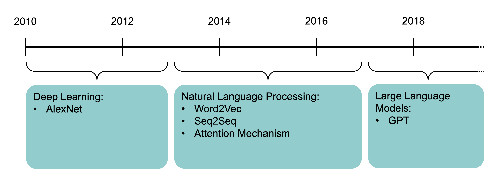
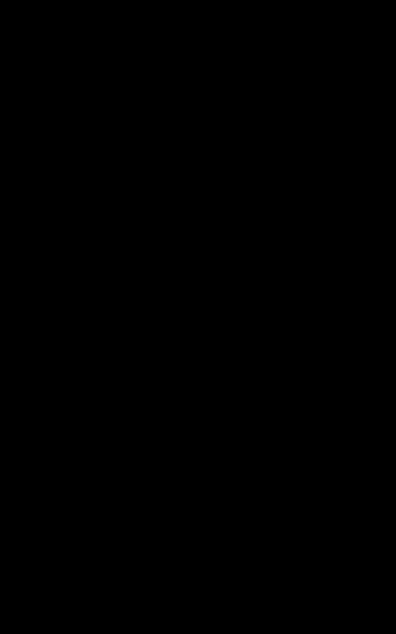
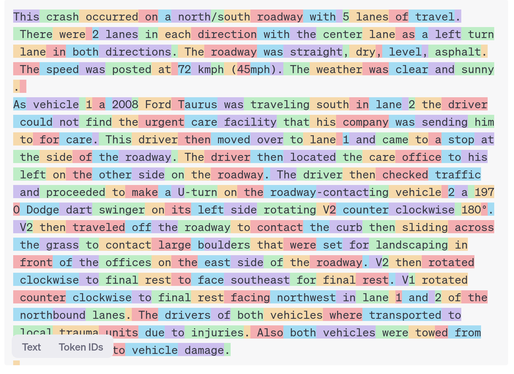

```{python}
#| echo: false
#| warning: false
from setup import *
```

# Natural Language Processing {visibility="uncounted"}


## What is NLP?

A field of research at the intersection of computer science, linguistics, and artificial intelligence that takes the _naturally spoken or written language_ of humans and _processes it with machines_ to automate or help in certain tasks.


## Applications of NLP in Industry

__1) Classifying documents__: Using the language within a body of text to classify it into a particular category, e.g.:

- Grouping emails into high and low urgency
- Movie reviews into positive and negative sentiment (i.e. _sentiment analysis_)
- Company news into bullish (positive) and bearish (negative) statements

__2) Machine translation__: Assisting language translators with machine-generated suggestions from a source language (e.g. English) to a target language

<!-- ## Applications of NLP in Industry II -->

__3) Search engine__ functions, including:

- Autocomplete
- Predicting what information or website user is seeking

__4) Speech recognition__: Interpreting voice commands to provide information or take action. Used in virtual assistants such as Alexa, Siri, and Cortana

## Deep learning & NLP?

Simple NLP applications such as spell checkers and synonym suggesters _do not require deep learning_ and can be solved with _deterministic, rules-based code_ with a dictionary/thesaurus.

More complex NLP applications such as classifying documents, search engine word prediction, and chatbots are complex enough to be solved using deep learning methods.

## NLP in 1966-1973

> "A typical story occurred in early machine translation efforts, which were generously funded by the U.S. National Research Council in an attempt to speed up the translation of Russian scientific papers in the wake of the Sputnik launch in 1957.
> It was thought initially that simple syntactic transformations, based on the grammars of Russian and English, and word replacement from an electronic dictionary, would suffice to preserve the exact meanings of sentences.
> The fact is that accurate translation requires background knowledge in order to resolve ambiguity and establish the content of the sentence.
> The famous retranslation of _“the spirit is willing but the flesh is weak”_ as _“the vodka is good but the meat is rotten”_ illustrates the difficulties encountered.
> In 1966, a report by an advisory committee found that “there has been no machine translation of general scientific text, and none is in immediate prospect.”
> All U.S. government funding for academic translation projects was canceled."
>
> ::: {style="text-align: right;"}
> — @russell2021artificial [p. 21]
> :::

## High-level history of deep learning



The attention mechanism [@bahdanau2015neural] and the Transformer architecture [@vaswani2017attention] underpin modern large language models.

::: footer
Source: Melissa Renard (2025)
:::

# How Computers View Text


## Python imports

```{python}
import random
from pathlib import Path

import zipfile
import ast, dis, io, tokenize
from urllib.request import urlretrieve

import numpy as np
import numpy.random as rnd
import pandas as pd
import spacy

from sklearn.feature_extraction.text import CountVectorizer, TfidfVectorizer
from sklearn.model_selection import train_test_split
from sklearn.preprocessing import LabelEncoder

import keras
from keras.callbacks import EarlyStopping
from keras.layers import Dense, Input
from keras.metrics import SparseTopKCategoricalAccuracy
from keras.models import Sequential
```

Also need to run `python -m spacy download en_core_web_trf`.

## How the computer sees text

::: {.content-visible unless-format="revealjs"}
The following vectors are short sentences translated into numbered data that computers can read.
:::

Spot the odd one out:

```{python}
#| echo: false
print([ord(x) for x in "patrick laub"])
```

```{python}
#| echo: false
print([ord(x) for x in "PATRICK LAUB"])
```
```{python}
#| echo: false
print([ord(x) for x in "Levi Ackerman"])
```

::: fragment
Generated by:
```{python}
#| eval: false
print([ord(x) for x in "patrick laub"])
print([ord(x) for x in "PATRICK LAUB"])
print([ord(x) for x in "Levi Ackerman"])
```

The `ord` built-in turns characters into their ASCII form.

:::{.callout-tip}
## Question

The largest value for a character is 127, can you guess why?
:::
:::

::: {.content-visible unless-format="revealjs"}
Similarly to image information ranging from 0 to 255, ASCII characters range from 0 to 127 representing 7 bits of binary numbers.
:::

## American Standard Code for Information Interchange

```{=html}
<style>
/* ---- HTML target (no `.reveal` prefix) ----------------------------------
   Lay the four tables out side-by-side like the Wikipedia figure, but as
   real selectable/searchable text. The `.reveal` rules below have higher
   specificity, so on slides they win and the layout is unchanged. */
.ascii-row {
  display: flex;
  flex-wrap: wrap;
  gap: 1.5rem;
  align-items: flex-start;
  justify-content: center;
}
.ascii-row table {
  margin: 0 !important;
  width: auto;
  border-collapse: collapse;
  font-size: 0.72rem;
  line-height: 1.25;
}
.ascii-row th, .ascii-row td { padding: 0.05rem 0.55rem; white-space: nowrap; }
.ascii-row tbody tr:nth-child(odd) { background: rgba(0, 0, 0, 0.04); }

/* ---- revealjs slides (unchanged behaviour) ------------------------------ */
.reveal .ascii-scroll {
  width: 92%;          /* leave a gap on the right so the scrollbar isn't jammed against the slide edge */
  margin: 0 auto 0 0;  /* hug the left; the spare width (and the scrollbar) sits on the right */
  font-size: 0.75em;   /* ZOOM: how big the text is */
  line-height: 1.3;
  max-height: 28em;    /* ROWS: how many rows show before scrolling (em, so it tracks the zoom) */
  overflow-y: auto;
  overflow-x: hidden;
}
.reveal .ascii-scroll .ascii-row {
  display: flex;
  flex-wrap: nowrap;   /* one row of 4 columns; override the HTML wrap above */
  gap: 2em;
  width: 100%;
  box-sizing: border-box;
  padding-right: 1em;  /* breathing room between the last table and the scrollbar */
  align-items: flex-start;
}
/* Reveal centres tables with auto side-margins; zero them and let the tables
   grow to fill the full slide width (the descriptions column gets twice the share). */
.reveal .ascii-scroll table { margin: 0 !important; width: 100%; font-size: inherit; line-height: inherit; }
.reveal .ascii-scroll table:first-child { flex: 2 1 0; }   /* descriptions column, widest */
.reveal .ascii-scroll table:nth-child(2) { flex: 1 1 0; }
/* Right two columns a bit narrower. */
.reveal .ascii-scroll table:nth-child(3),
.reveal .ascii-scroll table:nth-child(4) { flex: 0.8 1 0; }
.reveal .ascii-scroll td, .reveal .ascii-scroll th { padding: 0.15em 0.6em; white-space: normal; }
/* Zebra-stripe rows for readability (scoped to these 4 tables only, not the
   whole deck). Stronger alpha than the HTML rule because the serif theme's
   background is cream, where a faint tint barely shows. */
.reveal .ascii-scroll tbody tr:nth-child(odd) { background: rgba(0, 0, 0, 0.06); }
/* Keep the Dec/Char header visible while scrolling. */
.reveal .ascii-scroll thead th {
  position: sticky;
  top: 0;
  z-index: 1;
  background: var(--r-background-color, #fff);
}
</style>
```

::: {.ascii-scroll}
::: {.ascii-row}

| Dec | Char | Esc |
|----:|:-----|:-------|
|   0 | \[Null\] | `\0` |
|   1 | \[Start of Heading\] | |
|   2 | \[Start of Text\] | |
|   3 | \[End of Text\] | |
|   4 | \[End of Transmission\] | |
|   5 | \[Enquiry\] | |
|   6 | \[Acknowledge\] | |
|   7 | \[Bell\] | `\a` |
|   8 | \[Backspace\] | `\b` |
|   9 | \[Horizontal Tab\] | `\t` |
|  10 | \[Line Feed\] | `\n` |
|  11 | \[Vertical Tab\] | `\v` |
|  12 | \[Form Feed\] | `\f` |
|  13 | \[Carriage Return\] | `\r` |
|  14 | \[Shift Out\] | |
|  15 | \[Shift In\] | |
|  16 | \[Data Link Escape\] | |
|  17 | \[Device Control 1\] | |
|  18 | \[Device Control 2\] | |
|  19 | \[Device Control 3\] | |
|  20 | \[Device Control 4\] | |
|  21 | \[Negative Acknowledge\] | |
|  22 | \[Synchronous Idle\] | |
|  23 | \[End of Trans. Block\] | |
|  24 | \[Cancel\] | |
|  25 | \[End of Medium\] | |
|  26 | \[Substitute\] | |
|  27 | \[Escape\] | |
|  28 | \[File Separator\] | |
|  29 | \[Group Separator\] | |
|  30 | \[Record Separator\] | |
|  31 | \[Unit Separator\] | |

| Dec | Char |
|----:|:-----|
|  32 | \[Space\] |
|  33 | ! |
|  34 | " |
|  35 | # |
|  36 | $ |
|  37 | % |
|  38 | \& |
|  39 | ' |
|  40 | ( |
|  41 | ) |
|  42 | \* |
|  43 | + |
|  44 | , |
|  45 | - |
|  46 | . |
|  47 | / |
|  48 | 0 |
|  49 | 1 |
|  50 | 2 |
|  51 | 3 |
|  52 | 4 |
|  53 | 5 |
|  54 | 6 |
|  55 | 7 |
|  56 | 8 |
|  57 | 9 |
|  58 | : |
|  59 | ; |
|  60 | \< |
|  61 | = |
|  62 | \> |
|  63 | ? |

| Dec | Char |
|----:|:-----|
|  64 | @ |
|  65 | A |
|  66 | B |
|  67 | C |
|  68 | D |
|  69 | E |
|  70 | F |
|  71 | G |
|  72 | H |
|  73 | I |
|  74 | J |
|  75 | K |
|  76 | L |
|  77 | M |
|  78 | N |
|  79 | O |
|  80 | P |
|  81 | Q |
|  82 | R |
|  83 | S |
|  84 | T |
|  85 | U |
|  86 | V |
|  87 | W |
|  88 | X |
|  89 | Y |
|  90 | Z |
|  91 | \[ |
|  92 | \\ |
|  93 | \] |
|  94 | \^ |
|  95 | \_ |

| Dec | Char |
|----:|:-----|
|  96 | \` |
|  97 | a |
|  98 | b |
|  99 | c |
| 100 | d |
| 101 | e |
| 102 | f |
| 103 | g |
| 104 | h |
| 105 | i |
| 106 | j |
| 107 | k |
| 108 | l |
| 109 | m |
| 110 | n |
| 111 | o |
| 112 | p |
| 113 | q |
| 114 | r |
| 115 | s |
| 116 | t |
| 117 | u |
| 118 | v |
| 119 | w |
| 120 | x |
| 121 | y |
| 122 | z |
| 123 | { |
| 124 | \| |
| 125 | } |
| 126 | \~ |
| 127 | \[Del\] |

:::
:::

::: {.fragment}
[“I knew she’d have an ASCII table in there somewhere. All computer geeks do.” (The Martian)]{style="font-size: 0.8em;"}
:::

## Random strings

The built-in `chr` function turns numbers into characters.

```{python}
rnd.seed(1)
```
```{python}
chars = [chr(rnd.randint(32, 127)) for _ in range(10)]
chars
```

```{python}
" ".join(chars)
```

```{python}
"".join([chr(rnd.randint(32, 127)) for _ in range(50)])
```

```{python}
"".join([chr(rnd.randint(0, 128)) for _ in range(50)])
```


## Escape characters

::: columns
::: column

```{python}
print("Hello,\tworld!")
```

```{python}
print("Line 1\nLine 2")
```

```{python}
#| eval: false
print("Patrick\rLaub")
```

```{python}
#| echo: false
print("Laubick")
```

:::
::: column

```{python}
#| error: true
print("C:\tom\new folder")
```

Escape the backslash:

```{python}
print("C:\\tom\\new folder")
```

```{python}
repr("Hello,\rworld!")
```

:::
:::

## Non-natural language processing I

How would you evaluate

> 10 + 2 * -3

::: {.fragment}
All that Python sees is a string of characters.

```{python}
[ord(c) for c in "10 + 2 * -3"]
```
:::

::: {.fragment}
```{python}
10 + 2 * -3
```
:::

::: {.content-visible unless-format="revealjs"}
And yet, when you run it, Python returns the correct number.
:::

## Non-natural language processing II

Python first tokenizes the string:

```{python}
code = "10 + 2 * -3"
tokens = tokenize.tokenize(io.BytesIO(code.encode("utf-8")).readline)
for token in tokens:
    print(token)
```

## Non-natural language processing III

Python needs to _parse_ the tokens into an abstract syntax tree.

::: columns
::: {.column width="70%"}

```{python}
print(ast.dump(ast.parse("10 + 2 * -3"), indent="  "))
```

:::
::: {.column width="30%"}

```{mermaid}
%%| echo: false
graph TD;
    Expr --> C[Add]
    C --> D[10]
    C --> E[Mult]
    E --> F[2]
    E --> G[USub]
    G --> H[3]

```

:::
:::

## Non-natural language processing IV {.smaller}

The abstract syntax tree is then compiled into bytecode.

::: columns
::: {.column width="60%"}
```{python}
def expression(a, b, c):
    return a + b * -c

dis.dis(expression)
```
:::
::: {.column width="30%"}



:::
:::

## ChatGPT tokenization

::: {.content-visible unless-format="revealjs"}
Large language models (LLMs) also tokenize text. GPT can also split compound words (e.g. "northbound") into their sub-components ("north" and "bound"), making new tokens. GPT can then interpret what the compound word means based on the sub-components. 

Some chinese words have a similar idea, where you can interpret shared meanings between words based on common characters.
:::

::: columns
::: {.column width="80%"}

{width="80%"}

:::
::: {.column width="20%"}
::: fragment
E.g. 犭 radical for animals

狗 gǒu (dog)

猫 māo (cat)

狼 láng (wolf)

狮 shī (lion)
:::
:::
:::

::: footer
Source: [https://platform.openai.com/tokenizer](https://platform.openai.com/tokenizer)
:::







## Package Versions {.appendix data-visibility="uncounted"}

```{python}
from watermark import watermark
print(watermark(python=True, packages="keras,matplotlib,numpy,pandas,seaborn,scipy,torch"))
```

## Glossary {.appendix data-visibility="uncounted"}

::: columns
::: column
- bag of words
- lemmatization
- $n$-grams
- one-hot embedding
:::
::: column
- TF-IDF
- vocabulary
- word embedding
- word2vec
:::
:::

## References {visibility="uncounted"}

::: {#refs}
:::
