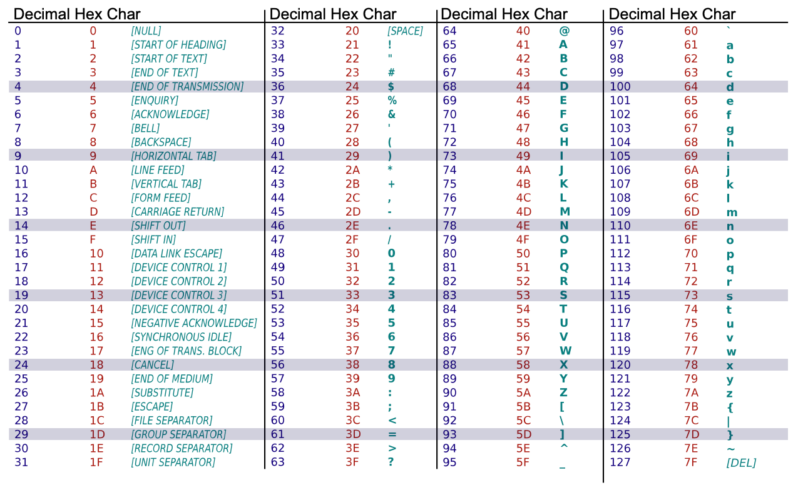

```{python}
#| echo: false
#| warning: false
import sys
sys.path.insert(0, "../scripts")
from setup import *
```

::: {.content-visible unless-format="revealjs"}

```{python}
#| code-fold: true
#| code-summary: Show the package imports
import random
from pathlib import Path

import matplotlib.pyplot as plt
import numpy as np
import numpy.random as rnd
import pandas as pd

from sklearn.model_selection import train_test_split
import keras
from keras import layers
from keras.callbacks import EarlyStopping
from keras.layers import Dense, Input
from keras.metrics import SparseTopKCategoricalAccuracy
from keras.models import Sequential
```

:::

# Natural Language Processing {visibility="uncounted"}

## What is NLP?

A field of research at the intersection of computer science, linguistics, and artificial intelligence that takes the __naturally spoken or written language__ of humans and __processes it with machines__ to automate or help in certain tasks.

## How the computer sees text

::: {.content-visible unless-format="revealjs"}
The following vectors are short sentences translated into numbered data that computers can read.
:::

Spot the odd one out:

```{python}
#| echo: false
print([ord(x) for x in "patrick laub"])
```

```{python}
#| echo: false
print([ord(x) for x in "PATRICK LAUB"])
```
```{python}
#| echo: false
print([ord(x) for x in "Levi Ackerman"])
```

::: fragment
Generated by:
```{python}
#| eval: false
print([ord(x) for x in "patrick laub"])
print([ord(x) for x in "PATRICK LAUB"])
print([ord(x) for x in "Levi Ackerman"])
```

The `ord` built-in turns characters into their ASCII form.

:::{.callout-tip}
## Question

The largest value for a character is 127, can you guess why?
:::
:::

::: {.content-visible unless-format="revealjs"}
Similarly to image information ranging from 0 to 255, ASCII characters range from 0 to 127 representing 7 bits of binary numbers.
:::

## ASCII



Unicode is the new standard.

::: footer
Source: [Wikipedia](https://commons.wikimedia.org/wiki/File:ASCII-Table-wide.svg)
:::

## Random strings

The built-in `chr` function turns numbers into characters.

```{python}
rnd.seed(1)
```
```{python}
chars = [chr(rnd.randint(32, 127)) for _ in range(10)]
chars
```

```{python}
" ".join(chars)
```

```{python}
"".join([chr(rnd.randint(32, 127)) for _ in range(50)])
```

```{python}
"".join([chr(rnd.randint(0, 128)) for _ in range(50)])
```


## Escape characters

::: columns
::: column

```{python}
print("Hello,\tworld!")
```

```{python}
print("Line 1\nLine 2")
```

```{python}
#| eval: false
print("Patrick\rLaub")
```

```{python}
#| echo: false
print("Laubick")
```

:::
::: column

```{python}
#| error: true
print("C:\tom\new folder")
```

Escape the backslash:

```{python}
print("C:\\tom\\new folder")
```

```{python}
repr("Hello,\rworld!")
```

:::
:::

## Non-natural language processing I

How would you evaluate

> 10 + 2 * -3

::: {.fragment}
All that Python sees is a string of characters.

```{python}
[ord(c) for c in "10 + 2 * -3"]
```
:::

::: {.fragment}
```{python}
10 + 2 * -3
```
:::

::: {.content-visible unless-format="revealjs"}
And yet, when you run it, Python returns the correct number.
:::

## Non-natural language processing II

Python first tokenizes the string:

```{python}
import tokenize
import io

code = "10 + 2 * -3"
tokens = tokenize.tokenize(io.BytesIO(code.encode("utf-8")).readline)
for token in tokens:
    print(token)
```

## Non-natural language processing III

Python needs to _parse_ the tokens into an abstract syntax tree.

::: columns
::: {.column width="70%"}

```{python}
import ast

print(ast.dump(ast.parse("10 + 2 * -3"), indent="  "))
```

:::
::: {.column width="30%"}

```{mermaid}
%%| echo: false
graph TD;
    Expr --> C[Add]
    C --> D[10]
    C --> E[Mult]
    E --> F[2]
    E --> G[USub]
    G --> H[3]

```

:::
:::

## Non-natural language processing IV

The abstract syntax tree is then compiled into bytecode.

::: columns
::: {.column width="60%"}
```{python}
import dis

def expression(a, b, c):
    return a + b * -c

dis.dis(expression)
```
:::
::: {.column width="40%"}


:::
:::

## ChatGPT tokenization

::: {.content-visible unless-format="revealjs"}
Large language models (LLMs) also tokenize text. GPT can also split compound words (e.g. "northbound") into their sub-components ("north" and "bound"), making new tokens. GPT can then interpret what the compound word means based on the sub-components. 

Some chinese words have a similar idea, where you can interpret shared meanings between words based on common characters.
:::

::: columns
::: {.column width="80%"}


:::
::: {.column width="20%"}
::: fragment
E.g. 犭 radical for animals

狗 gǒu (dog)

猫 māo (cat)

狼 láng (wolf)

狮 shī (lion)
:::
:::
:::

::: footer
Source: [https://platform.openai.com/tokenizer](https://platform.openai.com/tokenizer)
:::

## Applications of NLP in Industry

__1) Classifying documents__: Using the language within a body of text to classify it into a particular category, e.g.:

- Grouping emails into high and low urgency
- Movie reviews into positive and negative sentiment (i.e. _sentiment analysis_)
- Company news into bullish (positive) and bearish (negative) statements

__2) Machine translation__: Assisting language translators with machine-generated suggestions from a source language (e.g. English) to a target language

## Applications of NLP in Industry II

__3) Search engine__ functions, including:

- Autocomplete
- Predicting what information or website user is seeking

__4) Speech recognition__: Interpreting voice commands to provide information or take action. Used in virtual assistants such as Alexa, Siri, and Cortana

## Deep learning & NLP?

Simple NLP applications such as spell checkers and synonym suggesters __do not require deep learning__ and can be solved with __deterministic, rules-based code__ with a dictionary/thesaurus.

More complex NLP applications such as classifying documents, search engine word prediction, and chatbots are complex enough to be solved using deep learning methods.

## NLP in 1966-1973 I

> A typical story occurred in early machine translation efforts, which were generously funded by the U.S. National Research Council in an attempt to speed up the translation of Russian scientific papers in the wake of the Sputnik launch in 1957.
> It was thought initially that simple syntactic transformations, based on the grammars of Russian and English, and word replacement from an electronic dictionary, would suffice to preserve the exact meanings of sentences.

::: footer
Source: Russell and Norvig (2016), _Artificial Intelligence: A Modern Approach_, Third Edition, p. 21.
:::

## NLP in 1966-1973 II

> The fact is that accurate translation requires background knowledge in order to resolve ambiguity and establish the content of the sentence.
> The famous retranslation of **“the spirit is willing but the flesh is weak”** as **“the vodka is good but the meat is rotten”** illustrates the difficulties encountered.
> In 1966, a report by an advisory committee found that “there has been no machine translation of general scientific text, and none is in immediate prospect.”
> All U.S. government funding for academic translation projects was canceled.

::: footer
Source: Russell and Norvig (2016), _Artificial Intelligence: A Modern Approach_, Third Edition, p. 21.
:::

## High-level history of deep learning


::: footer
Source: Melissa Renard (2025)
::: 



## Package Versions {.appendix data-visibility="uncounted"}

```{python}
from watermark import watermark
print(watermark(python=True, packages="keras,matplotlib,numpy,pandas,seaborn,scipy,torch"))
```

## Glossary {.appendix data-visibility="uncounted"}

::: columns
::: column
- bag of words
- lemmatization
- $n$-grams
- one-hot embedding
:::
::: column
- TF-IDF
- vocabulary
- word embedding
- word2vec
:::
:::