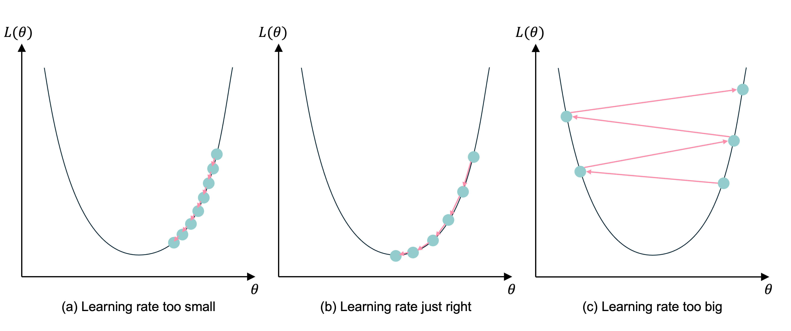
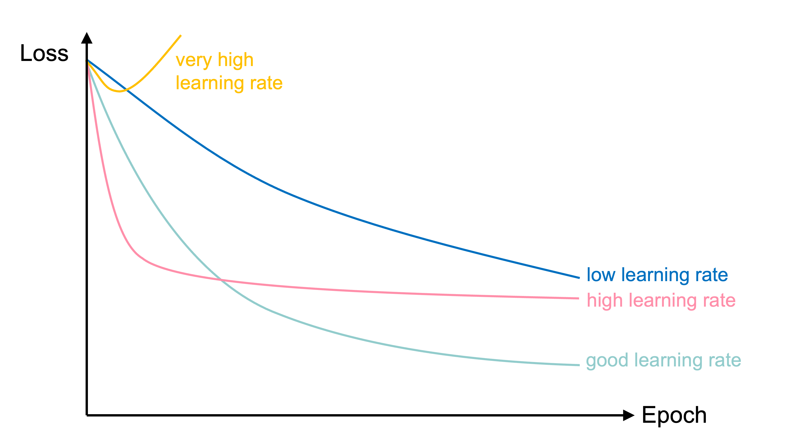

```{python}
#| echo: false
#| warning: false
import sys
sys.path.insert(0, "../scripts")
from setup import *


def skip_empty(line):
    if line.strip() != "":
        print(line.strip())
```

::: {.content-visible unless-format="revealjs"}

```{python}
#| code-fold: true
#| code-summary: Show the package imports
import random
import matplotlib.pyplot as plt
import numpy as np
import pandas as pd
```

:::



# Optimisation {data-visibility="uncounted"}

## Gradient-based learning

_In-class demo_

## Gradient descent pitfalls

```{python}
#| echo: false
def gradient_descent_plot():
    # Custom function with exact control
    def f(x):
        # Global min at x=5 (value=-5), local min at x=-2.15 (value=1.47)
        # Flat plateau between x=1.5 and x=2.5
        return np.piecewise(x, [
            x < 1.5,
            (x >= 1.5) & (x <= 2.5),
            x > 2.5
        ], [
            lambda x: 0.3*(x+1)**4 - 0.8*(x+1)**2 + 2,  # Left curve (local min)
            lambda x: 1.5,                                # Flat plateau
            lambda x: 0.2*(x-5)**4 + 0.1*(x-5)**2 - 5    # Right curve (global min)
        ])

    x = np.linspace(-3, 8, 1000)
    y = f(x)

    # # Verify minima
    # from scipy.optimize import minimize
    # global_min = minimize(f, 4).x[0]
    # local_min = minimize(f, -2).x[0]
    global_min = 5
    local_min = -2.15

    # Plot
    plt.figure(figsize=(8, 5))
    plt.plot(x, y, linewidth=2)

    # Critical points
    plt.scatter(global_min, f(global_min), c='lime', s=200, 
                label=f"Global minimum", 
                marker='*', edgecolor='black')
    plt.scatter(local_min, f(local_min), c='red', s=150,
                label=f"Local minimum", 
                marker='X', edgecolor='black')

    # Plateau (perfectly flat)
    plateau_mask = (x >= 1.5) & (x <= 2.5)
    plt.fill_between(x[plateau_mask], y[plateau_mask], 
                    color='orange', alpha=0.2, label="Plateau")

    plt.xlabel("Parameter (θ)")
    plt.ylabel("Loss") 

    plt.legend(
        loc='upper center',           # Anchor point
        bbox_to_anchor=(0.5, -0.25),  # Position below (y=-0.25 places it under the axes)
        frameon=False,                 # Cleaner look without border
        ncol=3,                        # Number of columns (3 items in 1 row)
        fontsize=9                     # Adjust font size if needed
    )

    plt.tight_layout(rect=[0, 0.15, 1, 1])  # Make room for legend (bottom margin=0.15)

gradient_descent_plot()
```

::: {.content-visible unless-format="revealjs"}
* Depending on where the algorithm starts, it might find a local minimum, but not the global minimum.
* If it starts where the gradient is very small, it may take a long time to get to the minimum because it will take small steps
* If it starts where the gradient is 0 (plateau), the algorithm will have nowhere to go and end there.
:::

## Go over all the training data

<br>

Called _batch gradient descent_.

<br>

```python
for i in range(num_epochs):
    gradient = evaluate_gradient(loss_function, data, weights)
    weights = weights - learning_rate * gradient
```

::: {.content-visible unless-format="revealjs"}
Batch gradient descent tries to improve all of the predictions in one go by using the entire training set at once.

For each epoch of the data, evaluate the gradient of the loss function on the entire training set with the chosen weights. The new weights are rebalanced based on the learning rate and in the _negative_ direction of the gradient.
:::

## Pick a random training example

<br>

Called _stochastic gradient descent_.

<br>

```python
for i in range(num_epochs):
    rnd.shuffle(data)
    for example in data:
        gradient = evaluate_gradient(loss_function, example, weights)
        weights = weights - learning_rate * gradient
```

::: {.content-visible unless-format="revealjs"}
Rather than trying to improve all predictions at once, stochastic gradient descent tries to improve each observation one by one (chosen at random). The weights are adjusted many times in a single epoch.
:::

## Take a group of training examples

<br>

Called _mini-batch gradient descent_.

<br>

```python
for i in range(num_epochs):
    rnd.shuffle(data)
    for b in range(num_batches):
        batch = data[b * batch_size : (b + 1) * batch_size]
        gradient = evaluate_gradient(loss_function, batch, weights)
        weights = weights - learning_rate * gradient
```

::: {.content-visible unless-format="revealjs"}
Somewhere in between batch gradient descent and stochastic gradient descent, mini-batch gradient descent tries to improve batches of the training data at a time. The weights are adjusted a few times in a single epoch.

This is the most common method.
:::

## Mini-batch gradient descent

::: {.content-visible unless-format="revealjs"}
Most NNs opt for mini-batch gradient descent.
:::

::: columns
::: column

Why?

1. Because we have to (data is too big to shove it all in a single batch)
2. Because it is faster (lots of quick noisy steps _takes longer_ than a few slow super accurate steps)
3. The noise helps us jump out of local minima

:::
::: column

```{python}
#| echo: false
gradient_descent_plot()
```

Noisy gradient means we might jump out of a local minimum.
:::
:::

## Learning rates



::: {.content-visible unless-format="revealjs"}
If the learning rate is too small, the subsequent NNs are too similar and it takes too long for the parameters to converge (and more likely to a local, not global, minimum). If the learning rate is too big, you could overshoot and the loss may _increase_.
:::

::: footer
Source: Melissa Renard (2025), adapted from Jeremy Jordan (2018), [_Setting the learning rate of your neural network_](https://www.jeremyjordan.me/nn-learning-rate/).
:::

## Learning rates #2

{width=60%}

::: {.content-visible unless-format="revealjs"}

> "a nice way to see how the learning rate affects Stochastic Gradient Descent.
> we can use SGD to control a robot arm - minimizing the distance to the target as a function of the angles θᵢ. Too low a learning rate gives slow inefficient learning, too high and we see instability"

:::

::: footer
Source: Matt Henderson (2021), [X post](https://x.com/matthen2/status/1520427516997025792)
:::

## Learning rate schedule



In training the learning rate may be tweaked manually.

::: footer
Source: Melissa Renard (2025), adapted from [Deep Learning for Computer Vision - Stanford Spring 2025](https://cs231n.github.io/neural-networks-3/)
:::



## Glossary {.appendix data-visibility="uncounted"}

- batch gradient descent
- batches, batch size
- global minimum, local minimum
- gradient-based learning, hill-climbing
- learning rate, learning rate schedule
- plateau
- stochastic gradient descent
- mini-batch gradient descent