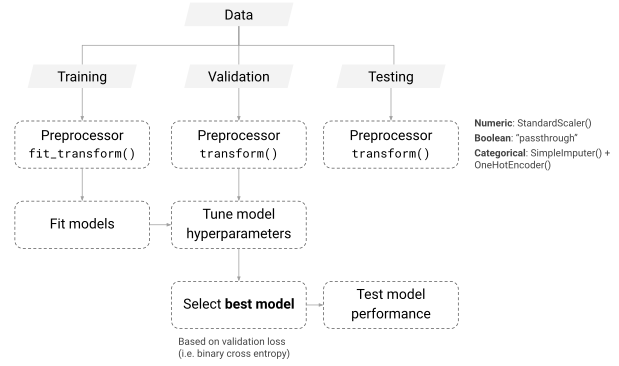

```{python}
#| echo: false
#| warning: false
from setup import *


def add_diagonal_line():
    xl = matplotlib.pyplot.xlim()
    yl = matplotlib.pyplot.ylim()
    shortest_side = min(xl[1], yl[1])
    matplotlib.pyplot.plot(
        [0, shortest_side], [0, shortest_side], color="black", linestyle="--"
    )


import pandas

pandas.options.display.max_rows = 4
```

::: {.content-visible unless-format="revealjs"}

```{python}
#| code-fold: true
#| code-summary: Show the package imports
import random
from pathlib import Path

import joblib
import matplotlib.pyplot as plt
import numpy as np
import pandas as pd

from keras.models import Sequential
from keras.layers import Dense, Input
from keras.callbacks import EarlyStopping

import sklearn
from sklearn import set_config
from sklearn.model_selection import train_test_split
from sklearn.preprocessing import OneHotEncoder, OrdinalEncoder, StandardScaler
from sklearn.impute import SimpleImputer
from sklearn.compose import make_column_transformer
from sklearn.pipeline import make_pipeline
from sklearn.linear_model import LinearRegression
```

:::


## Deep learning project life cycle

1. Define objectives
2. _Collect & label data_
3. Clean & preprocess data (opt. _feature engineering_)
4. Design network architecture
5. Train and validate model 
6. Hyperparameter tuning
7. Test and evaluate performance
8. _Deploy to production_
9. _Monitor and iterate_

(We won't cover the italicised items in this course, though they are very important.)

## Overview


# Example 1: Continuous Variables

## California housing dataset

```{python}
features, target = sklearn.datasets.fetch_california_housing(
    as_frame=True, return_X_y=True)
features
```

## Pandas will assign or guess dtypes

Can look at the data types of the features.

```{python}
features.info()
```

Here, all the features were continuous variables

## Pandas can guess wrong though {.smaller}


::: columns
::: column
For example, Australian postcodes are four digits and some start with `0` (e.g. Darwin is `0800`).
A CSV reader just sees digits, guesses a number, and silently drops the leading zero — giving the column the wrong _type_ **and** the wrong _value_.
:::
::: column
The raw file keeps the leading zero:

```{python}
print(Path("data/postcodes.csv").read_text())
```
:::
:::

::: columns
::: column
Default inference:

```{python}
df = pd.read_csv("data/postcodes.csv")
df
```

```{python}
df.dtypes
```
:::
::: column
Typed at read time:

```{python}
df = pd.read_csv("data/postcodes.csv",
    dtype={"postcode": "string"})
df
```

```{python}
df.dtypes
```
:::
:::

::: {.content-visible unless-format="revealjs"}
The fix is to declare the type as you read the data, e.g. `pd.read_csv(..., dtype={"postcode": "string"})` (or `"category"`), with `parse_dates=[...]` for any date columns.
Fixing types at the point of ingestion is the cleanest place to do it: it preserves the leading zeros, it would raise an error if a value were not a valid number where one is expected, and _every_ downstream step (plots, `groupby`, the column transformer) then sees the correct type.
Don't rely on the dtype alone to choose a feature's modelling role, though — a binary 0/1 flag, a count, and an ID column are all integers, so the nominal/ordinal/continuous decision still belongs in your column transformer.
:::

## Splitting into train, validation and test sets

```{python}
X_main, X_test_raw, y_main, y_test = train_test_split(
    features, target, test_size=0.2, random_state=1
)
X_train_raw, X_val_raw, y_train, y_val = train_test_split(
    X_main, y_main, test_size=0.25, random_state=1
)
```

Note that we really cannot allow there to be duplicate rows in the training, validation, or test sets. If there are, we will have data leakage between the sets, which will lead to overfitting and poor generalisation.

## Checking for leaks

We can look for rows that appear in multiple of the datasets.

```{python}
train_val_overlap = pd.merge(X_train_raw, X_val_raw, how='inner')
train_test_overlap = pd.merge(X_train_raw, X_test_raw, how='inner')
val_test_overlap = pd.merge(X_val_raw, X_test_raw, how='inner')

print(f"Number of duplicated rows between train and val: {len(train_val_overlap)}")
print(f"Number of duplicated rows between train and test: {len(train_test_overlap)}")
print(f"Number of duplicated rows between val and test: {len(val_test_overlap)}")
```

An earlier check is to check that there are no duplicate rows in the dataset.

```{python}
features.duplicated().sum()
```

## We rescaled every column

```{python}
scaler = StandardScaler()
scaler.fit(X_train_raw)

X_train = scaler.transform(X_train_raw)
X_val = scaler.transform(X_val_raw)
X_test = scaler.transform(X_test_raw)

X_train
```

That is because the neural network expects continuous inputs to be normalised to help with the training procedure.

::: {.content-visible unless-format="revealjs"}
Basically, the initial starting point for the network is random weights and biases that assume a (roughly) standard normal kind of input, to keep the inner neuron values from overflowing or underflowing.
:::

::: {.callout-note}
Notice that the output of `X_train` here looks a bit different to `X_train_raw` earlier?
We'll touch on this in a couple of slides.
:::

## Scikit-learn preprocessing methods

::: columns
::: {.column width="45%"}
- `fit`: learn the parameters of the transformation
- `transform`: apply the transformation
- `fit_transform`: learn the parameters and apply the transformation
:::
::: {.column width="55%"}

::: {.panel-tabset}


### `fit`

```{python}
scaler = StandardScaler()
scaler.fit(X_train_raw)
X_train = scaler.transform(X_train_raw)
X_val = scaler.transform(X_val_raw)
X_test = scaler.transform(X_test_raw)

print(X_train.mean(axis=0))
print(X_train.std(axis=0))
print(X_val.mean(axis=0))
print(X_val.std(axis=0))
```

### `fit_transform`

```{python}
scaler = StandardScaler()
X_train = scaler.fit_transform(X_train_raw)
X_val = scaler.transform(X_val_raw)
X_test = scaler.transform(X_test_raw)

print(X_train.mean(axis=0))
print(X_train.std(axis=0))
print(X_val.mean(axis=0))
print(X_val.std(axis=0))
```
:::

:::
:::

::: {.content-visible unless-format="revealjs"}
Notice that when using `fit_transform`, this function is only used on the training set. Then, for the validation and test sets, the function `transform` is called, *not* `fit_transform`. It is important to make sure that the scaler is fitted using only the data from the train set, to avoid information leakage.
:::

<!-- 
## Summary of the splitting



::: footer
Source: Melantha Wang (2022), ACTL3143 Project.
::: -->

## Dataframes & arrays

::: columns
::: column
```{python}
X_test_raw.head(3)
```
:::
::: column
```{python}
X_test
```
:::
:::

::: {.callout-note}
By default, when you pass `sklearn` a DataFrame it returns a `numpy` array.
:::

## Keep as a DataFrame

::: columns
::: {.column width="55%"}
From [scikit-learn 1.2](https://scikit-learn.org/stable/auto_examples/release_highlights/plot_release_highlights_1_2_0.html#pandas-output-with-set-output-api):

```{python}
set_config(transform_output="pandas")       #<1>

imp = SimpleImputer()                       #<2>

X_train = imp.fit_transform(X_train_raw)    #<3>
X_val = imp.transform(X_val_raw)            #<4>
X_test = imp.transform(X_test_raw)          #<5>
```

1. Tells sklearn that any transformed data should stay as pandas dataframes.
2. Defines the `SimpleImputer`. This function helps in dealing with missing values. Default is set to `mean`, meaning that, missing values in each column will be replaced with the column mean.
3. Finds the means of training set columns, and replaces train set missing values by those means.
4. Replace missing values in the validation set by the means of the _training set_ columns.
5. Replace missing values in the test set by the means of the _training set_ columns.


<br><br><br>

From SimpleImputer's docs:
:::
::: {.column width="45%"}
```{python}
X_test
```
:::
:::

 > Replace missing values using a descriptive statistic (e.g. mean, median, or
 > most frequent) along each column, or using a constant value... default='mean'

```{python}
#| echo: false
# set_config(transform_output="default")
pandas.options.display.max_rows = 6
```

# Example 2: Continuous and Categorical Variables {visibility="uncounted"}

## French motor dataset

```{python}
 # Download the dataset if we don't have it already. 
if not Path("../data/freq_data.csv").exists():               #<1>
    freq = sklearn.datasets.fetch_openml(data_id=41214, as_frame=True).frame   #<2>
    freq.to_csv("../data/freq_data.csv", index=False)         #<3>
else:
    freq = pd.read_csv("../data/freq_data.csv")               #<4>
freq.info()
```

1. Checks if the dataset does not already exist within the current directory. 
2. Download the dataset from sklearn. The `fetch_openml` function allows the user to bring in the datasets available in the OpenML platform. Every dataset has a unique ID, hence, can be fetched by providing the ID. `data_id` of the French motor dataset is 41214.
3. Save it as a CSV file, so we don't need to redownload it (slow!) next time.
4. If it already exists, then read the dataset from the CSV file.


## The data

```{python}
freq
```

## Data dictionary {.smaller}

::: columns
::: column
- `IDpol`: policy number (unique identifier)
- `ClaimNb`: number of claims on the given policy
- `Exposure`: total exposure in yearly units
- `Area`: area code (categorical, ordinal)
- `VehPower`: power of the car (categorical, ordinal)
- `VehAge`: age of the car in years
- `DrivAge`: age of the (most common) driver in years
:::
::: column
- `BonusMalus`: bonus-malus level between 50 and 230 (with reference level 100)
- `VehBrand`: car brand (categorical, nominal)
- `VehGas`: diesel or regular fuel car (binary)
- `Density`: of inhabitants per km^2^ in the city of the living place of the driver
- `Region`: regions in France (prior to 2016)
:::
:::

::: {.content-visible unless-format="revealjs"}
Our target variable is the number of claims, `ClaimNb`.
:::

::: footer
Source: Nell et al. (2020), [Case Study: French Motor Third-Party Liability Claims](https://papers.ssrn.com/sol3/papers.cfm?abstract_id=3164764), SSRN.
:::

We have $\{ (\mathbf{x}_i, y_i) \}_{i=1, \dots, n}$ for $\mathbf{x}_i \in \mathbb{R}^{p}$ and $y_i \in \mathbb{N}_0$.
Assume the distribution
$$
Y_i \sim \mathsf{Poisson}(\lambda(\mathbf{x}_i))
$$

We have $\mathbb{E} Y_i = \lambda(\mathbf{x}_i)$. 
The NN takes $\mathbf{x}_i$ & predicts $\mathbb{E} Y_i$.

```{python}
freq = freq.drop("IDpol", axis=1)
```

::: {.content-visible unless-format="revealjs"}
While `IDpol` is a useful tool for checking duplicates, we remove it before beginning the modelling process.
:::

## Split the data

```{python}
X_train_raw, X_test_raw, y_train, y_test = train_test_split(                    #<1>
  freq.drop("ClaimNb", axis=1), freq["ClaimNb"], random_state=2023)
X_train_raw = X_train_raw.reset_index(drop=True)                                #<2>
X_test_raw = X_test_raw.reset_index(drop=True)
X_train_raw
```

1. Splits the dataset into train and test sets. By setting the `random_state` to a specific number, we ensure the consistency in the train-test split. `freq.drop("ClaimNb", axis=1)` removes the "ClaimNb" column.
2. Resets the index of train set, and drops the previous index column. Since the index column will get shuffled during the train-test split, we may want to reset the index to start from 0 again. 


## What values do we see in the data?

::: {layout-ncol=2 layout-nrow=2}
```{python}
X_train_raw["Area"].value_counts()
```

```{python}
X_train_raw["VehBrand"].value_counts()
```

```{python}
X_train_raw["VehGas"].value_counts()
```

```{python}
X_train_raw["Region"].value_counts()
```
:::

::: {.content-visible unless-format="revealjs"}
`data["column_name"].value_counts()` function provides counts of each category for a categorical variable. In this dataset, variables `Area` and `VehGas` are assumed to have natural orderings (*ordinal categorical variables*) whereas `VehBrand` and `Region` are not considered to have such natural orderings (*nominal categorical variables*). Therefore, the two sets of categorical variables will have to be treated differently.
:::

## Nominal categorical variables {.smaller}

These are categorical variables which you cannot order in a 'default' sensible way.

::: {.content-visible unless-format="revealjs"}
There are two options for dealing with a nominal categorical variable:

* One-hot encoding: one column for each category (taking the value 1 if true, 0 if false). Using this method, one of the columns is redundant.
* Dummy encoding: drop the first of the one-hot encoding categories.
:::

```{python}
gas = X_train_raw[["VehGas"]]
```

::: columns
::: {.column width="20%"}

The original data:

<br>

```{python}
gas.head()
```
:::

::: {.column width="50%"}
One-hot encoding

```{python}
enc = OneHotEncoder(sparse_output=False)

X_train = enc.fit_transform(gas)
X_train.head()
```
:::
::: {.column width="30%"}
Dummy encoding

```{python}
enc = OneHotEncoder(
    drop="first",
    sparse_output=False)
X_train = enc.fit_transform(gas)
X_train.head()
```
:::
:::

::: {.callout-warning}
Collinearity is not a big deal for neural networks.
However if you want to reuse the same `X_train` data for a (generalised) linear regression, then you probably want to dummy-encode here to avoid needing two different preprocessing regimes for the two competing models.
:::

## Ordinal categorical variables

These are categorical variables which have a natural order to them.

::: {.content-visible unless-format="revealjs"}
`OrdinalEncoder` can assign numerical values to each category of the ordinal variable. The nice thing about `OrdinalEncoder` is that it can preserve the information about ordinal relationships in the data. To actually convert the values in the ordinal columns, we must also apply the `enc.transform` method. The following lines of code show how we consistently apply the transform function to both train and test sets. To avoid inconsistencies in encoding, we use `enc.fit` function only to the train set.
:::

```{python}
enc = OrdinalEncoder()                                         #<1>
enc.fit(X_train_raw[["Area"]])                                 #<2>
enc.categories_                                                #<3>
```

1. Create an `OrdinalEncoder` object named `enc`
2. Selects the two columns with ordinal variables from `X_train` and fits the ordinal encoder
3. Gives out the number of unique categories in each ordinal variable

```{python}
for i, area in enumerate(enc.categories_[0]):
    print(f"The Area value {area} gets turned into {i}.")
```

In other words,

```{python}
print(" < ".join(enc.categories_[0]) + ", and ")
print(" = ".join(f"{r} - {l}" for l, r in zip(enc.categories_[0][:-1], enc.categories_[0][1:])))
```

## Ordinal encoded values

::: {.content-visible unless-format="revealjs"}
Note that fitting an ordinal encoder (`enc.fit`) only establishes the mapping between numerical values and ordinal variable levels. To actually convert the values in the ordinal columns, we must also apply the `enc.transform` function. The following lines of code show how we consistently apply the transform function to both train and test sets. To avoid inconsistencies in encoding, we use `enc.fit` function only to the train set.
:::

```{python}
X_train = enc.transform(X_train_raw[["Area"]])
X_test = enc.transform(X_test_raw[["Area"]])
```

::: columns
::: column
```{python}
X_train_raw[["Area"]].head()
```
:::
::: column
```{python}
X_train.head()
```
:::
:::

We could train on this `X_train`, or on the previous `X_train`, but each only contains one feature from the dataset.
How do we add the continuous variables back in?
Use a sklearn _column transformer_ for that.

<!-- 
## Train on ordinal encoded values

::: {.content-visible unless-format="revealjs"}
If we would like to see whether we can train a neural network only on the ordinal variables, we can try the following code.
:::

```python
random.seed(12)                                                 #<1>
model = Sequential([                                            #<2>
  Dense(1, activation="exponential")
])

model.compile(optimizer="adam", loss="poisson")                 #<3>

es = EarlyStopping(verbose=True)                                #<4>
hist = model.fit(X_train, y_train, epochs=100, verbose=0,   #<5>
    validation_split=0.2, callbacks=[es])
hist.history["val_loss"][-1]                                    #<6>
```

1. Sets the random state for reproducibility
2. Constructs a neural network with 1 `Dense` layer, 1 neuron and an exponential activation function
3. Compiles the model by defining the optimizer and loss function
4. Defines the early stopping object (Note that the early stopping object only works if we have a validation set. If we do not define a validation set, there will be no validation loss, hence, no metric to compare the training loss with.)
5. Fits the model only with the encoded columns as input data. The command `validation_split=0.2` tells the neural network to treat the last 20% of input data as the validation set. This is an alternative way of defining the validation set. 
6. Returns the validation loss at the final epoch of training

<br> -->

```{python}
#| echo: false
# set_config(transform_output="default")
pandas.options.display.max_rows = 3
```

## Transform all columns in one hit I

```{python}
ct = make_column_transformer(                               #<1>
  (OneHotEncoder(sparse_output=False, drop="first"), ["VehGas", "VehBrand", "Region"]), #<2>
  (OrdinalEncoder(), ["Area"]),                             #<3>
  remainder=StandardScaler()                                #<4>
)

X_train = ct.fit_transform(X_train_raw)                     #<5>
```

1. Starts defining the column transformer object
2. Apply dummy encoding to the nominal categorical columns
3. Apply ordinal encoding to the ordinal categorical column
4. Standardise the remaining columns (which are all numerical)
5. Fits and transforms the train set using this new column transformer


::: columns
::: column
```{python}
X_train_raw
```
:::
::: column
```{python}
X_train
```
:::
:::

::: {.content-visible unless-format="revealjs"}
The default column names of `X_train` that the column transformer adds are a bit obscure/verbose.
We can add the `verbose_feature_names_out=False` flag to have a cleaner `X_train` dataframe. 
:::

## Transform all columns in one hit II

```{python}
ct = make_column_transformer(
  (OneHotEncoder(sparse_output=False, drop="first"), ["VehGas", "VehBrand", "Region"]),
  (OrdinalEncoder(), ["Area"]),
  remainder=StandardScaler(),
  verbose_feature_names_out=False
)
X_train = ct.fit_transform(X_train_raw)
```

::: columns
::: column
```{python}
X_train_raw
```
:::
::: column
```{python}
X_train
```
:::
:::

::: {.content-visible unless-format="revealjs"}
An important thing to notice here is that the order of columns has changed. They are rearranged according to the order in which we specify the transformations inside the column transformer. 
:::

```{python}
#| echo: false
# set_config(transform_output="default")
pandas.options.display.max_rows = 6
```

## Aside: The order of the variables matters

::: {.content-visible unless-format="revealjs"}
Sometimes the ordinal categories are named with words, such as "Low", "Medium", "High" (rather than, for example, "A", "B", "C"). The ordinal encoder does not know how to read these and orders the categories based on alphabetical order. 
:::

```{python}
X_train_raw["Area_In_Words"] = X_train_raw["Area"].map({
    "A": "Very low", "B": "Low", "C": "Medium",
    "D": "High", "E": "Very high", "F": "Extremely high"
})
```

```{python}
enc_wrong = OrdinalEncoder()
enc_wrong.fit(X_train_raw[["Area_In_Words"]])
enc_wrong.categories_ 
```

```{python}
for i, area in enumerate(enc_wrong.categories_[0]):
    print(f"The Area value {area} gets turned into {i}.")
```

In other words,

```{python}
print(" < ".join(enc_wrong.categories_[0]))
```

## Aside: Manually set the order

::: {.content-visible unless-format="revealjs"}
To fix this issue, we need to manually set the order.
:::

```{python}
ordered = [["Very low", "Low", "Medium", "High", "Very high", "Extremely high"]]
enc_right = OrdinalEncoder(categories=ordered)
enc_right.fit(X_train_raw[["Area_In_Words"]])
enc_right.categories_ 
```

```{python}
for i, area in enumerate(enc_right.categories_[0]):
    print(f"The Area value {area} gets turned into {i}.")
```

In other words,

```{python}
print(" < ".join(enc_right.categories_[0]))
```

```{python}
X_train_raw = X_train_raw.drop("Area_In_Words", axis=1)
```

# Example 3: Continuous and Categorical Variables and Missing Values

## Stroke prediction dataset {.smaller}

Dataset source: [Kaggle Stroke Prediction Dataset](https://www.kaggle.com/datasets/fedesoriano/stroke-prediction-dataset).

```{python}
RAW_DATA_DIR = Path("stroke/raw")
data = pd.read_csv(RAW_DATA_DIR / "stroke.csv")
data.head()
```

## Data description {.smaller}

::: columns
::: column
1) `id`: unique identifier
2) `gender`: "Male", "Female" or "Other"
3) `age`: age of the patient
4) `hypertension`: 0 or 1 if the patient has hypertension
5) `heart_disease`: 0 or 1 if the patient has any heart disease
6) `ever_married`: "No" or "Yes"
7) `work_type`: "children", "Govt_job", "Never_worked", "Private" or "Self-employed"
:::
::: column
8) `Residence_type`: "Rural" or "Urban"
9) `avg_glucose_level`: average glucose level in blood
10) `bmi`: body mass index
11) `smoking_status`: "formerly smoked", "never smoked", "smokes" or "Unknown"
12) `stroke`: 0 or 1 if the patient had a stroke
:::
:::

::: {.content-visible unless-format="revealjs"}
Target: `stroke`.
:::

::: footer
Source: Kaggle, [Stroke Prediction Dataset](https://www.kaggle.com/datasets/fedesoriano/stroke-prediction-dataset).
:::

## Look for missing values and split the data

First, look for missing values.
```{python}
number_missing = data.isna().sum()
number_missing[number_missing > 0]
```

::: {.callout-tip}
Always take a look at the missing data in, say, Excel.
Sometimes pandas reads in a category like "None" and interprets that as a missing value, when it's really a valid category.
This happened to me just the other day.
:::

```{python}
features = data.drop(["id", "stroke"], axis=1)
target = data["stroke"]

X_main_raw, X_test_raw, y_main, y_test = train_test_split(
    features, target, test_size=0.2, random_state=7)
X_train_raw, X_val_raw, y_train, y_val = train_test_split(
    X_main_raw, y_main, test_size=0.25, random_state=12)

X_train_raw.shape, X_val_raw.shape, X_test_raw.shape
```

## What values do we see in the data?

::: columns
::: column
```{python}
X_train_raw["gender"].value_counts()
```

```{python}
X_train_raw["ever_married"].value_counts()
```

```{python}
X_train_raw["Residence_type"].value_counts()
```
:::
::: column
```{python}
X_train_raw["work_type"].value_counts()
```

```{python}
X_train_raw["smoking_status"].value_counts()
```
:::
:::

::: {.callout-tip}
Look for sparse categories.
One common trick is to lump together all the small categories (e.g. < 5% or 10% each) into a new combined 'OTHER' or 'RARE' category.
:::

## Lumping rare categories automatically {.smaller}

Rather than hand-coding an 'OTHER' category, `OneHotEncoder` can group infrequent levels for us (since scikit-learn 1.1).
Here `Never_worked` is a very rare level of `work_type`:

::: columns
::: {.column width="35%"}
```{python}
X_train_raw["work_type"].value_counts()
```
:::
::: {.column width="65%"}

::: {.panel-tabset}

### `min_frequency`

Lump together any level below 5% of the rows:

```{python}
enc = OneHotEncoder(sparse_output=False,
    min_frequency=0.05)
ohe = enc.fit_transform(X_train_raw[["work_type"]])
enc.infrequent_categories_
```

```{python}
ohe.head(3)
```

### `max_categories`

Keep the most common levels, capping the column count:

```{python}
enc = OneHotEncoder(sparse_output=False,
    max_categories=3)
ohe = enc.fit_transform(X_train_raw[["work_type"]])
enc.infrequent_categories_
```

```{python}
ohe.head(3)
```

:::

:::
:::

::: {.content-visible unless-format="revealjs"}
The lumped levels are combined into a single `work_type_infrequent_sklearn` column, and the `infrequent_categories_` attribute records exactly which levels were grouped.
Use `min_frequency` to set the threshold below which a level is treated as infrequent (an integer count, or a float proportion of the rows), or `max_categories` to cap the total number of output columns.
Because the encoder learns the rare levels from the _training set only_, this avoids the data leakage you could accidentally introduce by hand-coding the grouping yourself.
It also composes with `handle_unknown="infrequent_if_exist"`, which sends any unseen category at test time into the same infrequent column.
:::

## Make a plan for preprocessing each column

1. Take categorical columns $\hookrightarrow$ one-hot vectors
2. binary columns $\hookrightarrow$ do nothing (already 0 & 1)
3. continuous columns $\hookrightarrow$ impute NaNs & standardise.

## Make the column transformer

```{python}
nom_vars =  ["gender", "ever_married", "Residence_type",                                #<1>
    "work_type", "smoking_status"]                  

ct = make_column_transformer(
  (OneHotEncoder(sparse_output=False, handle_unknown="ignore"), nom_vars),              #<2>
  ("passthrough", ["hypertension", "heart_disease"]),                                   #<3>
  remainder=make_pipeline(SimpleImputer(), StandardScaler()),                           #<4>
  verbose_feature_names_out=False
)

X_train = ct.fit_transform(X_train_raw)
X_val = ct.transform(X_val_raw)
X_test = ct.transform(X_test_raw)

for name, X in zip(("train", "val", "test"), (X_train, X_val, X_test)):        #<5>
    num_na = pd.DataFrame(X).isna().sum().sum()
    print(f"The {name} set has shape {X.shape} & with {num_na} NAs.")
```

1. Stores categorical variables in `nom_vars`
2. Specifies the one-hot encoding for all categorical variables. We set the `sparse_output=False`, to return a dense array rather than a sparse matrix. `handle_unknown` specifies how the neural network should handle unseen categories. By setting `handle_unknown="ignore"`, we instruct the neural network to ignore categories that were not seen during training. If we did not do this, it would interrupt the model's operation after deployment
3. Passes through `hypertension` and `heart_disease` without any preprocessing
4. Makes a pipeline that first applies `SimpleImputer()` to replace missing values with the mean and then applies `StandardScaler()` to scale the numerical values
5. Prints out the missing values to ensure the `SimpleImputer()` has worked

## Handling unseen categories

::: columns
::: column
```{python}
X_train_raw["gender"].value_counts()
```
:::
::: column
```{python}
X_val_raw["gender"].value_counts()
```
:::
:::

::: {.content-visible unless-format="revealjs"}
Because of the way the train and test sets were split, the one-hot encoder could not pick up on the third category. This could interrupt the model performance. To avoid such confusions, we could either give instructions manually on how to tackle unseen categories. An example is given below. In the second row, the values given for `gender_Female` and `gender_Male` are both 0, implying a third category.
:::

::: columns
::: column
```{python}
ind = np.argmax(X_val_raw["gender"] == "Other")
X_val_raw.iloc[ind-1:ind+3][["gender"]]
```
:::
::: column
```{python}
gender_cols = pd.DataFrame(X_val)[["gender_Female", "gender_Male"]]
gender_cols.iloc[ind-1:ind+3]
```
:::
:::

::: {.content-visible unless-format="revealjs"}
However, to give such instructions on handling unseen categories, we would first have to know what those possible categories could be. We should also have specific knowledge on what value to assign in case they come up during model performance. One easy way to tackle it would be to use `handle_unknown="ignore"` during encoding, as mentioned before.
:::

## Handling unseen categories II

This was caused by fitting the encoder on the `X_train` which, by bad luck, didn't have the "Other" category.
Why not just read the entire dataset before splitting to collect all the values the categorical variables could take?

It's a very mild form of data leakage, though it may be justifiable in some cases.
If we made the datasets, we'd have a better idea of whether it makes sense on a case-by-case basis.
We struggle here as we (in this course) are just analysing datasets which we didn't collect.

## Save the preprocessed data to files

```{python}
PROCESSED_DATA_DIR = Path("stroke/processed")
PROCESSED_DATA_DIR.mkdir(parents=True, exist_ok=True)

X_train.to_csv(PROCESSED_DATA_DIR / "x_train.csv", index=False)
X_val.to_csv(PROCESSED_DATA_DIR / "x_val.csv", index=False)
X_test.to_csv(PROCESSED_DATA_DIR / "x_test.csv", index=False)
y_train.to_csv(PROCESSED_DATA_DIR / "y_train.csv", index=False)
y_val.to_csv(PROCESSED_DATA_DIR / "y_val.csv", index=False)
y_test.to_csv(PROCESSED_DATA_DIR / "y_test.csv", index=False)
```

## Lastly, keep the preprocessor around {.smaller}

Later want to make a prediction on some new data point.
It has to go through the **exact same** preprocessing steps.

::: {.content-visible unless-format="revealjs"}
We can save the preprocessing column transformer and save it to a file to use later.
:::

```{python}
joblib.dump(ct, PROCESSED_DATA_DIR / "preprocessor.pkl")
preprocessor = joblib.load(PROCESSED_DATA_DIR / "preprocessor.pkl")
```

```{python}
X_test_raw.head(1)
```

```{python}
new_data = X_test_raw.head(1).copy()
new_data["ever_married"] = "No" # Let's pretend this is the new data point
```


```{python}
ct.transform(new_data)
```

```{python}
preprocessor.transform(new_data)
```

## Glossary {.appendix data-visibility="uncounted"}

- column transformer
- nominal variables
- ordinal variables
- one-hot encoding
- missing values
- imputation
- standardisation