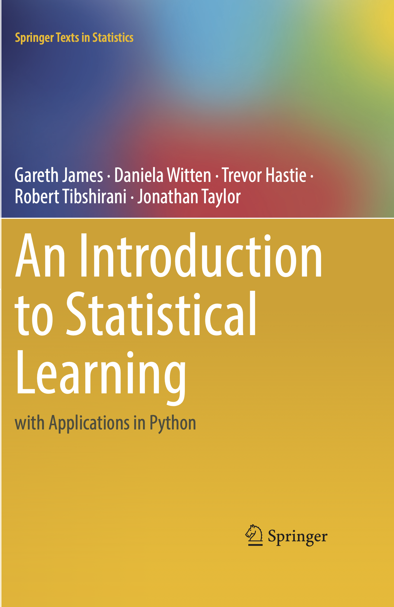
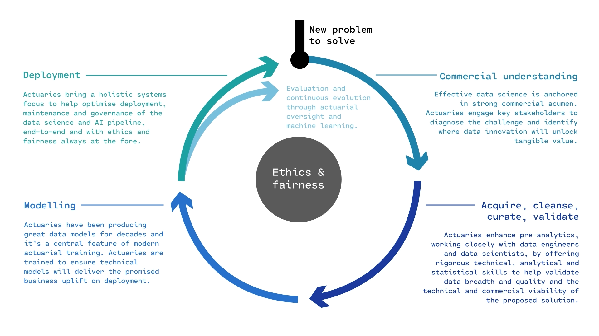
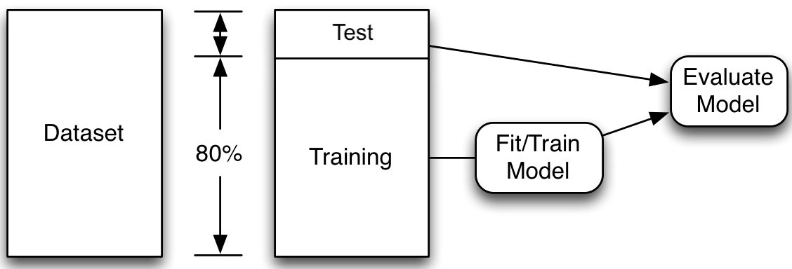
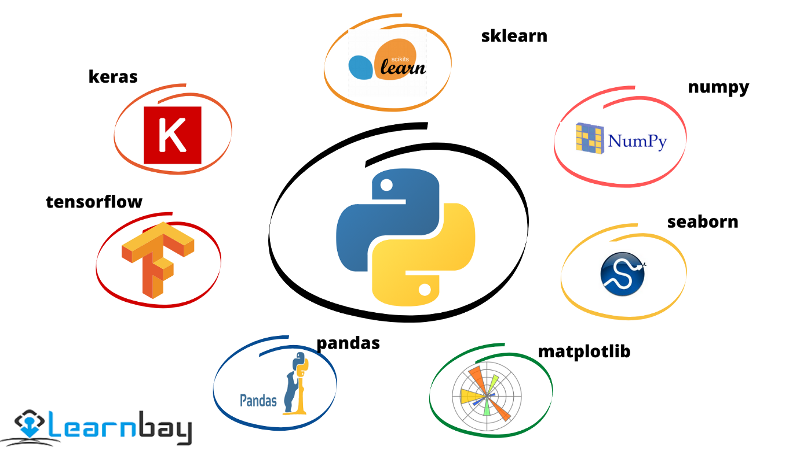

```{python}
#| echo: false
#| warning: false
from setup import *
```

## Preliminary notes

::: columns
::: column

Readings for this topic:

| Week | Readings (ACTL3142 Revision) |
|:--:|--------------|
| 1 | @james2021statistical: Chapter 2, Sections 3.1, 3.2, and 5.1.1 |
| 2 | @james2021statistical: Section 3.3.1, 4.1, 4.2, 4.3 |

: {tbl-colwidths="[6,94]"}

For ACTL3143 students, these slides are mostly a revision of ACTL3142 concepts but using Python instead of R.

For ACTL5111 students, if you have not taken ACTL5110, you need to self-study any surprising concepts in these slides ASAP.

:::
::: column

{width="50%"}

:::
:::


# Machine Learning Workflow

## An entire ML project



::: {.content-visible unless-format="revealjs"}
The course focuses more on the modelling part of the life cycle.
:::

::: footer
Source: Actuaries Institute.
:::

## Questions to answer in ML project

You fit a few models to the training set, then ask:

1. __(Selection)__ Which of these models is the best?
2. __(Future Performance)__ How good should we expect the final model to be on unseen data?



::: footer
Adapted from: Heaton (2022), [Applications of Deep Learning](https://github.com/jeffheaton/t81_558_deep_learning/blob/e4bdc124b0c45b592d9bdbed0d2ef6c63c0245d6/t81_558_class_02_1_python_pandas.ipynb).
:::


## Validation set approach


1. For each model, fit it to the _training set_.
2. Compute the error for each model on the _validation set_.
3. Select the model with the lowest validation error.
4. Compute the error of the final model on the _test set_.

Read Section 5.1.1 of @james2021statistical for details.

::: {.content-visible unless-format="revealjs"}
You should have seen split A in your previous courses. In those courses, split A is used, and then cross-validation is performed to fit the hyperparameters. In the case of NNs, it is much more common to split the dataset into training, validation and test (split B).
:::

::: footer
Source: [Wikipedia](https://commons.wikimedia.org/wiki/File:ML_dataset_training_validation_test_sets.png#filelinks).
:::


# Data Science Packages {visibility="uncounted"}


## Data science packages



::: footer
Source: Learnbay.co, [Python libraries for data analysis and modeling in Data science](https://medium.com/@learnbay/python-libraries-for-data-analysis-and-modeling-in-data-science-c5c994208385), Medium.
:::

## Imports for these slides

```{python}
import numpy as np
import pandas as pd
import matplotlib.pyplot as plt

from sklearn.datasets import fetch_california_housing
from sklearn.linear_model import LinearRegression, LogisticRegression, PoissonRegressor
from sklearn.metrics import mean_squared_error
from sklearn.model_selection import train_test_split
from sklearn.preprocessing import StandardScaler
from sklearn.tree import DecisionTreeClassifier, plot_tree
```

For sklearn, you'll need to `pip install scikit-learn`.


## Numpy for matrices {.title-col2}

::: columns
::: column

Numpy is Python's standard approach for any low-level numerical mathematics tasks (matrix processing, linear algebra)

```{python}
a = np.array([1, 2, 3, 4])
a.mean(), a.std()
```

```{python}
a * 2 + 1 # vectorised arithmetic
```

```{python}
M = np.arange(6).reshape(2, 3)
M
```

```{python}
M.shape, M.sum(axis=0)
```

:::
::: column

 and [ClickPy](https://clickpy.clickhouse.com/dashboard/numpy))](images/travis.webp){width="50%"}

Also has random number generation functionality

```{python}
rng = np.random.default_rng(0)
x = rng.normal(size=200)
y = 2 * x + rng.normal(size=200)
```

:::
:::

## Pandas for DataFrames {.title-col2}

::: columns
::: column

Used for tabular data: loading, cleaning, processing, saving

```{python}
df = pd.DataFrame({
    "age": [25, 32, 41, 28, 36],
    "salary": [45_000, 65_000, 80_000, 55_000, 72_000],
})
df.head()
```


:::
::: column

 and [ClickPy](https://clickpy.clickhouse.com/dashboard/pandas))](images/wes-2017-01-12-small.png){width="50%"}


```{python}
df.shape          # (rows, cols)
df.columns.tolist()
```

```{python}
df["age"]         # column
df.iloc[0]        # first row
```
:::
:::

<!-- ::: {.callout-tip}
Pandas + NumPy depth (slicing, `.loc`, `Series`, merging) lives in the [Python for Data Science lab](../Labs/python-for-data-science-lab.html). This slide is the minimum needed for the rest of the lecture.
::: -->

## Matplotlib for plots {.title-col2}

::: columns
::: {.column width="45%"}

The traditional way to generate plots; similar (in spirit) to R's base `plot()`

```{python}
plt.figure(figsize=(3, 3))
plt.scatter(x, y);
```

:::
::: {.column width="55%"}

 and [ClickPy](https://clickpy.clickhouse.com/dashboard/matplotlib))](images/john-d-hunter.jpeg){height="25% !important"}

```{python}
#| fig-width: 4
plt.hist(x, bins=20);
```


:::
:::

<!-- ::: {.callout-tip}
We'll combine `plt.scatter`, `plt.hist`, and `plt.colorbar` in the case study. More depth is in the [matplotlib lab](../Labs/matplotlib-lab.html).
::: -->


## Scikit-learn for machine learning

::: columns
::: {.column width="45%"}
Every sklearn estimator has the same three methods:

- `fit(X, y)`: learn the parameters of the model
- `predict(X)`: apply the model
- `score(X, y)`: apply the model and calculate a metric
:::
::: {.column width="55%"}

<br>

```{python}
X = df[["age"]] # [[ ]] gives a 2D DataFrame
y = df["salary"]
model = LinearRegression()
model.fit(X, y)
y_pred = model.predict(X)
print(f"R^2 = {model.score(X, y):.3f}")
```
:::
:::

::: {.content-visible unless-format="revealjs"}
Once you've learned this pattern for `LinearRegression`, you've largely learned it for every other model in scikit-learn — `LogisticRegression`, `PoissonRegressor`, `DecisionTreeClassifier`, `RandomForestRegressor`, and so on all use the same three methods.
:::


## Set aside a fraction for a test set

```{python}
#| echo: false
from sklearn.datasets import make_regression

X, y = make_regression(n_samples=10_000, n_features=4, random_state=0)
```

Off-screen I have loaded up a larger `X` & `y` dataset:

```{python}
print(X.shape, y.shape)
```

We can split into train and test sets (in a random but reproducible way):

```{python}
X_train, X_test, y_train, y_test = train_test_split(X, y, random_state=42) #<1>
print(X_train.shape, X_test.shape, y_train.shape, y_test.shape)
```

::: {.content-visible unless-format="revealjs"}
We set aside the test data, assuming it represents new, unseen data. Then we fit many models on the train data and select the one with the lowest train error. Thereafter we assess the performance of that model using the unseen test data.
:::

::: {.smaller}
Note: Compare `X_`/`y_` names, capitals & lowercase.
:::

Split three ways:

::: {.content-visible unless-format="revealjs"}
Using the same dataset for both validating and testing purposes can result in **data leakage**: the information from supposedly 'unseen' data is now used by the model during its training. This results in a situation where the model is now 'learning' from the test data, which could lead to overly optimistic results in the model evaluation stage. That is why it is important to split the data three ways.
:::

```{python}
X_main, X_test, y_main, y_test = train_test_split(X, y, test_size=0.2, random_state=1) #<1>

# As 0.25 x 0.8 = 0.2
X_train, X_val, y_train, y_val = train_test_split(X_main, y_main, test_size=0.25, random_state=1) #<2>

X_train.shape, X_val.shape, X_test.shape
```

1. Splits the entire dataset into two parts. Sets aside $20\%$ of the data as the test set.
2. Splits the first $80\%$ of the data (`X_main` and `y_main`) further into train and validation sets. Sets aside $25\%$ as the validation set.

::: {.content-visible unless-format="revealjs"}
This results in a $60:20:20$ three-way split. While this is not a strict rule, it is widely used.
:::
<!-- 
## Why not use test set for both?

_Thought experiment_: have $m$ classifiers: $f_1(\mathbf{x})$, $\dots$, $f_m(\mathbf{x})$.

They are just as good as each other in the long run
$$
\mathbb{P}(\, f_i(\mathbf{X}) = Y \,)\ =\ 90\% , \quad \text{for } i=1,\dots,m .
$$

::: columns
::: {.column width="40%"}
Evaluate each model on the test set, some will be better than others.

:::
::: {.column width="60%"}
```{python}
#| echo: false
import seaborn

np.random.seed(123)
m = 50
x = np.random.normal(loc=0.9, scale=0.03, size=m)
seaborn.displot(x, kde=True, stat="density", height=2, aspect=5.0 / 2.0)
plt.scatter(x, np.zeros_like(x))
plt.xlabel("Accuracy of each model on test set")
plt.axvline(0.9, ls="--", c="k")
plt.axvline(np.max(x), ls="--", c="r")
plt.tight_layout()
```
:::
:::

Take the best, you'd think it has $\approx 98\%$ accuracy!

::: {.content-visible unless-format="revealjs"}
Using the same dataset for both validating and testing purposes can result in a data leakage. The information from supposedly 'unseen' data is now used by the model during its tuning. This results in a situation where the model is now 'learning' from the test data, and it could lead to overly optimistic results in the model evaluation stage.
::: -->




# California House Price Prediction (Setup) {visibility="uncounted"}


## Data science always starts with the data!

::: columns
::: column

> The target variable is the median house value for California districts, expressed in $100,000's.
> This dataset was derived from the 1990 U.S. census, using one row per census block group.
> A block group is the smallest geographical unit for which the U.S. Census Bureau publishes sample data (a block group typically has a population of 600 to 3,000 people).

:::
::: column

:::
:::

::: footer
Source: [Scikit-learn documentation](https://scikit-learn.org/stable/datasets/real_world.html#california-housing-dataset).
:::

## Columns

- `MedInc` median income in block group
- `HouseAge` median house age in block group
- `AveRooms` average number of rooms per household
- `AveBedrms` average # of bedrooms per household
- `Population` block group population
- `AveOccup` average number of household members
- `Latitude` block group latitude
- `Longitude` block group longitude
- `MedHouseVal` median house value (**target**)

::: footer
Source: [Scikit-learn documentation](https://scikit-learn.org/stable/datasets/real_world.html#california-housing-dataset).
:::


## Import the data {.smaller}

```{python}
features, target = fetch_california_housing(as_frame=True, return_X_y=True) #<1>
features
```

1. Assigns features and target from the dataset to two variables 'features' and 'target' and returns two separate data frames. The command `return_X_y=True` ensures that there will be two separate data frames, one for the features and the other for the target

## What is the target? {.title-col2}

::: columns
::: column
```{python}
target
```

Why predict this? Let's pretend we are these guys.
:::
::: column

:::
:::

::: footer
Source: Dougherty and Griffith (2023), [The Silicon Valley Elite Who Want to Build a City From Scratch](https://www.nytimes.com/2023/08/25/business/land-purchases-solano-county.html), New York Times.
:::

## Apply the three-way split to California housing

The same `train_test_split` pattern, now applied to the loaded data:

```{python}
X_main, X_test, y_main, y_test = train_test_split(features, target, test_size=0.2, random_state=1)
X_train, X_val, y_train, y_val = train_test_split(X_main, y_main, test_size=0.25, random_state=1)
print(X_train.shape, X_val.shape, X_test.shape)
```

::: {.content-visible unless-format="revealjs"}
A $60:20:20$ three-way split: $20\%$ for the held-out test set, then $25\%$ of the remaining $80\%$ (i.e. $20\%$ overall) for the validation set, leaving $60\%$ for training. The same `random_state` would let a teammate reproduce the split exactly.
:::

## The training set {.smaller}

```{python}
X_train
```

## Location

Python's `matplotlib` package $\approx$ R's basic `plot`s.

```{python}
plt.scatter(features["Longitude"], features["Latitude"])
```

::: {.callout-note .fragment}
There's no _analysis_ in this EDA.
:::

## Location EDA

```{python}
plt.scatter(features["Longitude"], features["Latitude"], c=target, cmap="coolwarm")
plt.colorbar()
```

::: {.fragment}
"We observe that the median house prices are higher closer to the coastline."
:::

## Pandas can make plots directly

```{python}
both = pd.concat([features, target], axis=1)
both.plot(kind="scatter", x="Longitude", y="Latitude", c="MedHouseVal", cmap="coolwarm")
```

## Features

```{python}
print(list(features.columns))
```

How many?

```{python}
num_features = len(features.columns)
num_features
```

Or

```{python}
num_features = features.shape[1]
features.shape
```

# California House Price Prediction (Regression) {visibility="uncounted"}

## Linear Regression

$$ \hat{y}_i = w_0 + \sum_{j=1}^p w_j x_{ij} .$$

```{python}
lr = LinearRegression()                                                     #<1>
lr.fit(X_train, y_train);                                                   #<2>
```

1. Defines the object `lr` which represents the linear regression function.
2. Fits a linear regression model using the training data. `lr.fit` computes the coefficients of the regression model.


The $w_0$ is in `lr.intercept_` and the others are in
```{python}
print(lr.coef_)
```

## Make some predictions

```{python}
X_train.head(3)
```

::: {.content-visible unless-format="revealjs"}
`X_train.head(3)` returns the first three rows of the dataset `X_train`.
:::

```{python}
y_pred = lr.predict(X_train.head(3))
y_pred
```

::: {.content-visible unless-format="revealjs"}
`lr.predict(X_train.head(3))` returns the predictions for the first three rows of the dataset `X_train`.
:::

## Plot the predictions

```{python}
#| include: false
set_square_figures()
```

::: columns
::: column
```{python}
#| echo: false
y_pred = lr.predict(X_train)
plt.scatter(y_pred, y_train)
plt.xlabel("Predictions")
plt.ylabel("True values")
plt.title("Training set")
add_diagonal_line()
```
:::
::: column
```{python}
#| echo: false
y_pred = lr.predict(X_val)
plt.scatter(y_pred, y_val)
plt.xlabel("Predictions")
plt.ylabel("True values")
plt.title("Validation set")
add_diagonal_line()
```
:::
:::

```{python}
#| include: false
set_rectangular_figures()
```

::: {.content-visible unless-format="revealjs"}
We can see dispersion around the fitted line.
:::

## Track MSE for model comparison

We'll add ANN results to these dictionaries later.

```{python}
mse_lr_train = mean_squared_error(y_train, lr.predict(X_train))
mse_lr_val = mean_squared_error(y_val, lr.predict(X_val))

mse_train = {"Linear Regression": mse_lr_train}
mse_val = {"Linear Regression": mse_lr_val}
```

::: {.callout-tip}
Think about the units of the mean squared error.
Is there a variation which is more interpretable?
:::

### To be continued...

We'll revisit this California housing problem in the **AI and Deep Learning** lecture, where we extend `mse_train` and `mse_val` with neural network results and compare them against this linear regression baseline.

## Package Versions {.appendix data-visibility="uncounted"}

```{python}
from watermark import watermark
print(watermark(python=True, packages="matplotlib,numpy,pandas,seaborn,scikit-learn,scipy"))
```

## Glossary {.appendix data-visibility="uncounted"}

::: columns
::: column
- base case (in dummy encoding)
- categorical input / dummy encoding
- design matrix
- exploratory data analysis (EDA)
- features, target
- generalised linear model (GLM)
- linear regression
- link function
- logistic regression
- matplotlib
:::
::: column
- mean squared error
- numpy
- pandas DataFrame
- Poisson regression
- probit regression
- scikit-learn (`fit` / `predict` / `score`)
- sigmoid function
- standardisation (z-score)
- `train_test_split`
- training / validation / test split
:::
:::


## References

::: {#refs}
:::