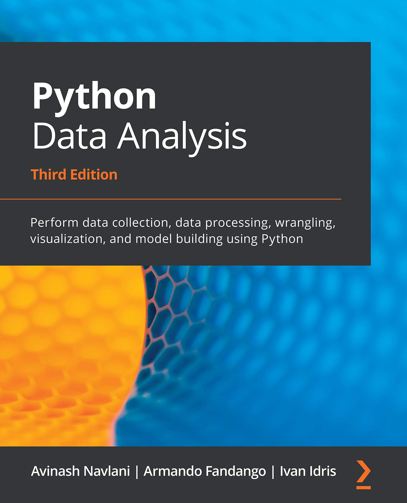

```{python}
#| echo: false
#| warning: false
from setup import *
```

<!-- ## Recording of this lecture

A recording covering (most of) this Python content:

::: {.content-hidden unless-format="revealjs"}

:::
::: {.content-visible unless-format="revealjs"}

::: -->

# Data Science & Python {visibility="uncounted"}

## About Python

::: columns
::: {.column width="70%}

First released in 20 February 1991

An open-source scripting language, named after Monty Python

Led by its "benevolent dictator for life" Guido, until his retirement, now led by Python Software Foundation

Python packages are [downloaded at a rate of ~6B/day](https://pypistats.org/packages/__all__)

:::
::: {.column width="30%}

{width="50%"}

:::
:::

## Designed as a beautiful, simple, and readable language

```{python}
import this
```

Easy to learn language, popular first language, [taught in high schools](https://youtu.be/mqg93zv1S-E?si=KqfgNkLdZpQ1vMp3)

## Uses for Python

::: columns
::: {.column width="40%"}
](images/automate-the-boring-stuff-with-python.jpeg)
:::

::: {.column width="60%"}
It is _general purpose_ language

Python powers:

- Instagram
- Spotify
- Netflix
- Uber
- Reddit...

Python is on Mars.

:::
:::

::: footer
Sources: [Blog post](https://learn.onemonth.com/10-famous-websites-built-using-python/) and [Github](https://docs.github.com/en/account-and-profile/setting-up-and-managing-your-github-profile/customizing-your-profile/personalizing-your-profile#list-of-qualifying-repositories-for-mars-2020-helicopter-contributor-badge).
:::


## Python metrics

::: columns
::: {.column width="33%"}

**[TIOBE Index](https://www.tiobe.com/tiobe-index/) (May 2026)**

Python is **#1** with a **19.98%** rating, well ahead of C (11.55%) and Java (7.94%).

:::
::: {.column width="33%"}

**[Stack Overflow 2025](https://survey.stackoverflow.co/2025/technology)**

Python is the **#1 most-used language** among those learning to code (71.8%) and **#4 overall** (57.9%) — a 7-point jump from 2024.

:::
::: {.column width="33%"}

**[JetBrains 2025](https://blog.jetbrains.com/pycharm/2025/08/the-state-of-python-2025/)**

**86%** of Python developers use it as their main language. Top uses: data science (51%), web (46%), machine learning (41%).

:::
:::

## Popularity on GitHub 

](images/octoverse-2025-top-programming-languages.png)

## Popularity on GitHub II

> "What else we’re seeing
>
> Python dominates AI projects. It remains the clear leader inside AI-tagged repositories, where Jupyter Notebook usage nearly doubled in 2025 offering evidence of its role as the go-to language for prototyping, training, and orchestrating AI workloads. [GitHub's 2025 State of the Octoverse](https://github.blog/news-insights/octoverse/octoverse-a-new-developer-joins-github-every-second-as-ai-leads-typescript-to-1/#the-top-programming-languages-of-2025-typescript-jumps-to-1-while-python-takes-2)

## Python and machine learning


> ...[T]he entire machine learning and data science industry has been dominated by these two approaches: **deep learning** and **gradient boosted trees**...
> Users of gradient boosted trees tend to use Scikit-learn, XGBoost, or LightGBM. Meanwhile, most practitioners of deep learning use Keras, often in combination with its parent framework TensorFlow.
The common point of these tools is **they're all Python libraries**: Python is by far the most widely used language for machine learning and data science.

::: footer
Source: François Chollet (2021), _Deep Learning with Python, Second Edition_, Section 1.2.7.
:::

<!--
## Python for data science

::: columns
::: {.column width="50%"}
In R you can run:
```r
pchisq(3, 10)
```
:::
::: {.column width="50%"}
In Python it is
```python
from scipy import stats
stats.chi2(10).cdf(3)
```
:::
:::


-->

## "The Story of Python and how it took over the world"

::: {.content-hidden unless-format="revealjs"}

:::
::: {.content-visible unless-format="revealjs"}

:::

Python: The Documentary


## Disclaimer on following slides

These slides are for an audience who _already knows programming fundamentals_ (variables, control flow, functions, etc.) but just don't know how they work in Python.


# Python Data Types {visibility="uncounted"}

## Variables and basic types

::: columns
::: {.column width="50%"}
```{python}
1 + 2
```

```{python}
x = 1
x + 2.0
```

```{python}
type(2.0)
```

```{python}
type(1), type(x)
```

:::
::: {.column width="50%"}

```{python}
does_math_work = 1 + 1 == 2
print(does_math_work)
type(does_math_work)
```

```{python}
contradiction = 1 != 1
contradiction
```

:::
:::

## Shorthand assignments

If we want to add 2 to a variable `x`:

::: columns
::: {.column width="50%"}
```{python}
x = 1
x = x + 2
x
```
:::

::: {.column width="50%"}
```{python}
x = 1
x += 2
x
```
:::
:::

Same for:

- `x -= 2` : take 2 from the current value of `x` ,
- `x *= 2` : double the current value of `x`,
- `x /= 2` : halve the current value of `x`.

## Strings

```{python}
name = "Patrick"
surname = "Laub"
```

```{python}
coffee = "This is Patrick's coffee"
quote = 'And then he said "I need a coffee!"'
```

```{python}
name + surname
```

```{python}
greeting = f"Hello {name} {surname}"
greeting
```

```{python}
"Patrick" in greeting
```

## `and` & `or`

```{python}
name = "Patrick"
surname = "Laub"
name.istitle() and surname.istitle()
```

```{python}
full_name = "Dr Patrick Laub"
full_name.startswith("Dr ") or full_name.endswith(" PhD")
```

::: {.callout-important}
The dot is used denote methods, it can't be used inside a variable name.
```{python}
#| error: true
i.am.an.unfortunate.R.users = True
```
:::

## `help` to get more details

```{python}
help(name.istitle)
```

## f-strings

```{python}
print(f"Five squared is {5*5} and five cubed is {5**3}")
print("Five squared is {5*5} and five cubed is {5**3}")
```

::: {.callout-aside}
Use f-strings and avoid the older alternatives:
```{python}
print(f"Hello {name} {surname}")
print("Hello " + name + " " + surname)
print("Hello {} {}".format(name, surname))
print("Hello %s %s" % (name, surname))
```
:::

## Converting types

```{python}
digit = 3
digit
```

```{python}
type(digit)
```

```{python}
num = float(digit)
num
```

```{python}
type(num)
```

```{python}
num_str = str(num)
num_str
```

## Quiz

What is the output of:

```{python}
#| eval: false
x = 1
y = 1.0
print(f"{x == y} and {type(x) == type(y)}")
```

::: fragment
```{python}
#| echo: false
x = 1
y = 1.0
print(f"{x == y} and {type(x) == type(y)}")
```
:::

::: fragment
What would you add before line 3 to get "True and True"?
:::

::: fragment
```{python}
x = 1
y = 1.0
x = float(x)  # or y = int(y)
print(f"{x == y} and {type(x) == type(y)}")
```
:::

# Collections {visibility="uncounted"}

## Lists

```{python}
desires = ["Coffee", "Cake", "Sleep"]
desires
```

```{python}
len(desires)
```


```{python}
desires[0]
```

```{python}
desires[-1]
```

```{python}
desires[2] = "Nap"
desires
```

## Slicing lists

```{python}
print([0, 1, 2])
desires
```

```{python}
desires[0:2]
```

```{python}
desires[0:1]
```

```{python}
desires[:2]
```

## A common indexing  error

```{python}
#| error: true
desires[1.0]
```

```{python}
#| error: true
desires[: len(desires) / 2]
```

```{python}
len(desires) / 2, len(desires) // 2
```

```{python}
desires[: len(desires) // 2]
```

## Editing lists

```{python}
desires = ["Coffee", "Cake", "Sleep"]
desires.append("Gadget")
desires
```

```{python}
desires.pop()
```

```{python}
desires
```

```{python}
desires.sort()
desires
```

```{python}
#| error: true
desires[3] = "Croissant"
```

## `None`

```{python}
desires = ["Coffee", "Cake", "Sleep", "Gadget"]
sorted_list = desires.sort()
sorted_list
```

```{python}
type(sorted_list)
```

```{python}
sorted_list is None
```

```{python}
bool(sorted_list)
```

```{python}
desires = ["Coffee", "Cake", "Sleep", "Gadget"]
sorted_list = sorted(desires)
print(desires)
sorted_list
```

## Tuples ('immutable' lists)

```{python}
weather = ("Sunny", "Cloudy", "Rainy")
print(type(weather))
print(len(weather))
print(weather[-1])
```

```{python}
#| error: true
weather.append("Snowy")
```

```{python}
#| error: true
weather[2] = "Snowy"
```

## One-length tuples

```{python}
using_brackets_in_math = (2 + 4) * 3
using_brackets_to_simplify = (1 + 1 == 2)
```

```{python}
failure_of_atuple = ("Snowy")
type(failure_of_atuple)
```

```{python}
happy_solo_tuple = ("Snowy",)
type(happy_solo_tuple)
```

```{python}
cheeky_solo_list = ["Snowy"]
type(cheeky_solo_list)
```

## Dictionaries

```{python}
phone_book = {"Patrick": "+61 1234", "Café": "(02) 5678"}
phone_book["Patrick"]
```

```{python}
phone_book["Café"] = "+61400 000 000"
phone_book
```

```{python}
phone_book.keys()
```

```{python}
phone_book.values()
```

```{python}
factorial = {0: 1, 1: 1, 2: 2, 3: 6, 4: 24, 5: 120, 6: 720, 7: 5040}
factorial[4]
```

## Quiz

```{python}
#| eval: false
animals = ["dog", "cat", "bird"]
animals.append("teddy bear")
animals.pop()
animals.pop()
animals.append("koala")
animals.append("kangaroo")
print(f"{len(animals)} and {len(animals[-2])}")
```

::: fragment
```{python}
#| echo: false
animals = ["dog", "cat", "bird"]
animals.append("teddy bear")
animals.pop()
animals.pop()
animals.append("koala")
animals.append("kangaroo")
print(f"{len(animals)} and {len(animals[-2])}")
```
:::

# Control Flow {visibility="uncounted"}

## `if` and `else`

```{python}
age = 50
```

```{python}
if age >= 30:
    print("Gosh you're old")
```

```{python}
if age >= 30:
    print("Gosh you're old")
else:
    print("You're still young")
```

## The weird part about Python...

```{python}
#| error: true
if age >= 30:
    print("Gosh you're old")
else:
print("You're still young")
```

::: {.callout-warning}
Watch out for mixing tabs and spaces!
:::

## An example of aging

```{python}
age = 16

if age < 18:
    friday_evening_schedule = "School things"
if age < 30:
    friday_evening_schedule = "Party 🥳🍾"
if age >= 30:
    friday_evening_schedule = "Work"
```

::: fragment
```{python}
print(friday_evening_schedule)
```
:::

## Using `elif` {auto-animate=true}

```{python}
age = 16

if age < 18:
    friday_evening_schedule = "School things"
elif age < 30:
    friday_evening_schedule = "Party 🥳🍾"
else:
    friday_evening_schedule = "Work"

print(friday_evening_schedule)
```

## `for` Loops

```{python}
desires = ["coffee", "cake", "sleep"]
for desire in desires:
    print(f"Patrick really wants a {desire}.")
```

::: columns
::: {.column width="50%"}
```{python}
for i in range(3):
    print(i)
```

```{python}
for i in range(3, 6):
    print(i)
```

:::
::: {.column width="50%"}

```{python}
range(5)
```

```{python}
type(range(5))
```

```{python}
list(range(5))
```

:::
:::

## Advanced `for` loops

```{python}
for i, desire in enumerate(desires):
    print(f"Patrick wants a {desire}, it is priority #{i+1}.")
```

```{python}
desires = ["coffee", "cake", "nap"]
times = ["in the morning", "at lunch", "during a boring lecture"]

for desire, time in zip(desires, times):
    print(f"Patrick enjoys a {desire} {time}.")
```

## List comprehensions

```{python}
[x**2 for x in range(10)]
```

```{python}
[x**2 for x in range(10) if x % 2 == 0]
```

They can get more complicated:
```{python}
[x * y for x in range(4) for y in range(4)]
```
```{python}
[[x * y for x in range(4)] for y in range(4)]
```
but I'd recommend just using `for` loops at that point.

## While Loops

```{python}
#| echo: false
import numpy.random as rnd

rnd.seed(1234)
simulate_pareto = lambda: rnd.pareto(1)
```

Say that we want to simulate $(X \,\mid\, X \ge 100)$ where $X \sim \mathrm{Pareto}(1)$.
Assuming we have `simulate_pareto`,
a function to generate $\mathrm{Pareto}(1)$ variables:
```{python}
samples = []
while len(samples) < 5:
    x = simulate_pareto()
    if x >= 100:
        samples.append(x)

samples
```

## Breaking out of a loop

```{python}
#| eval: false
while True:
    user_input = input(">> What would you like to do? ")

    if user_input == "order cake":
        print("Here's your cake! 🎂")

    elif user_input == "order coffee":
        print("Here's your coffee! ☕️")

    elif user_input == "quit":
        break
```

```{python}
#| echo: false
inputs = ["order cake", "order coffee", "order cake", "quit"]

for user_input in inputs:
    print(f">> What would you like to do? {user_input}")
    if user_input == "order cake":
        print("Here's your cake! 🎂")

    elif user_input == "order coffee":
        print("Here's your coffee! ☕️")

    elif user_input == "quit":
        break
```

## Quiz

What does this print out?

```{python}
#| eval: false
if 1 / 3 + 1 / 3 + 1 / 3 == 1:
    if 2**3 == 6:
        print("Math really works!")
    else:
        print("Math sometimes works..")
else:
    print("Math doesn't work")
```

::: fragment
```{python}
#| echo: false
if 1 / 3 + 1 / 3 + 1 / 3 == 1:
    if 2**3 == 6:
        print("Math really works!")
    else:
        print("Math sometimes works..")
else:
    print("Math doesn't work")
```
:::


What does this print out?

```{python}
#| eval: false
count = 0
for i in range(1, 10):
    count += i
    if i > 3:
        break
print(count)
```

::: fragment
```{python}
#| echo: false
count = 0
for i in range(1, 10):
    count += i
    if i > 3:
        break
print(count)
```
:::

## Debugging the quiz code

```{python}
count = 0
for i in range(1, 10):
    count += i
    print(f"After i={i} count={count}")
    if i > 3:
        break
```

# Python Functions {visibility="uncounted"}

## Making a function

```{python}
def add_one(x):
    return x + 1


def greet_a_student(name):
    print(f"Hi {name}, welcome to the AI class!")
```

```{python}
add_one(10)
```

```{python}
greet_a_student("Josephine")
```

```{python}
greet_a_student("Joseph")
```

::: {.callout-aside}
Here, `name` is a _parameter_ and the value supplied is an _argument_.
:::

## Default arguments

```{python}
#| echo: false
import numpy.random as rnd

rnd.seed(1234)
simulate_standard_normal = rnd.normal
```

Assuming we have `simulate_standard_normal`,
a function to generate $\mathrm{Normal}(0, 1)$ variables:
```{python}
def simulate_normal(mean=0, std=1):
    return mean + std * simulate_standard_normal()
```

```{python}
simulate_normal()  # same as 'simulate_normal(0, 1)'
```

```{python}
simulate_normal(1_000)  # same as 'simulate_normal(1_000, 1)'
```

::: {.callout-note}
We'll cover random numbers next week (using `numpy`).
:::

## Use explicit parameter name

```{python}
simulate_normal(mean=1_000)  # same as 'simulate_normal(1_000, 1)'
```

```{python}
simulate_normal(std=1_000)  # same as 'simulate_normal(0, 1_000)'
```

```{python}
simulate_normal(10, std=0.001)  # same as 'simulate_normal(10, 0.001)'
```

```{python}
#| error: true
simulate_normal(std=10, 1_000)
```

## Why would we need that?

E.g. to fit a Keras model, we use the `.fit` method:

```{python}
#| eval: false
model.fit(x=None, y=None, batch_size=None, epochs=1, verbose='auto',
        callbacks=None, validation_split=0.0, validation_data=None,
        shuffle=True, class_weight=None, sample_weight=None,
        initial_epoch=0, steps_per_epoch=None, validation_steps=None,
        validation_batch_size=None, validation_freq=1,
        max_queue_size=10, workers=1, use_multiprocessing=False)
```

Say we want all the defaults except changing `use_multiprocessing=True`:

```{python}
#| eval: false
model.fit(None, None, None, 1, 'auto', None, 0.0, None, True, None,
        None, 0, None, None, None, 1, 10, 1, True)
```

but it is _much nicer_ to just have:
```{python}
#| eval: false
model.fit(use_multiprocessing=True)
```

## Further viewing

::: {.content-hidden unless-format="revealjs"}

:::
::: {.content-visible unless-format="revealjs"}

:::


## Quiz

What does the following print out?

```{python}
#| eval: false
def get_half_of_list(numbers, first=True):
    if first:
        return numbers[: len(numbers) // 2]
    else:
        return numbers[len(numbers) // 2 :]

nums = [1, 2, 3, 4, 5, 6]
chunk = get_half_of_list(nums, False)
second_chunk = get_half_of_list(chunk)
print(second_chunk)
```

::: fragment
```{python}
#| echo: false
def get_half_of_list(numbers, first=True):
    if first:
        return numbers[: len(numbers) // 2]
    else:
        return numbers[len(numbers) // 2 :]

nums = [1, 2, 3, 4, 5, 6]
chunk = get_half_of_list(nums, False)
second_chunk = get_half_of_list(chunk)
print(second_chunk)
```
:::

::: fragment
```{python}
f"nums ~> {nums[:len(nums)//2]} and {nums[len(nums)//2:]}"
```
```{python}
f"chunk ~> {chunk[:len(chunk)//2]} and {chunk[len(chunk)//2:]}"
```
:::

## Multiple return values
    
```{python}
def limits(numbers):
    return min(numbers), max(numbers)

limits([1, 2, 3, 4, 5])
```

```{python}
type(limits([1, 2, 3, 4, 5]))
```

```{python}
min_num, max_num = limits([1, 2, 3, 4, 5])
print(f"The numbers are between {min_num} and {max_num}.")
```

```{python}
_, max_num = limits([1, 2, 3, 4, 5])
print(f"The maximum is {max_num}.")
```

```{python}
print(f"The maximum is {limits([1, 2, 3, 4, 5])[1]}.")
```

## Tuple unpacking

```{python}
lims = limits([1, 2, 3, 4, 5])
smallest_num = lims[0]
largest_num = lims[1]
print(f"The numbers are between {smallest_num} and {largest_num}.")
```

```{python}
smallest_num, largest_num = limits([1, 2, 3, 4, 5])
print(f"The numbers are between {smallest_num} and {largest_num}.")
```

This doesn't just work for functions with multiple return values:

```{python}
RESOLUTION = (1920, 1080)
WIDTH, HEIGHT = RESOLUTION
print(f"The resolution is {WIDTH} wide and {HEIGHT} tall.")
```

## Short-circuiting

```{python}
def is_positive(x):
    print("Called is_positive")
    return x > 0

def is_negative(x):
    print("Called is_negative")
    return x < 0

x = 10
```

::: columns
::: column
```{python}
x_is_positive = is_positive(x)
x_is_positive
```

:::
::: column
```{python}
x_is_negative = is_negative(x)
x_is_negative
```
:::
:::

```{python}
x_not_zero = is_positive(x) or is_negative(x)
x_not_zero
```





## with keyword

Example, opening a file:

::: columns
::: column
Most basic way is:
```{python}
f = open("haiku1.txt", "r")
print(f.read())
f.close()
```

:::
::: column
Instead, use:
```{python}
with open("haiku2.txt", "r") as f:
    print(f.read())
```
:::
:::

::: footer
Haikus from http://www.libertybasicuniversity.com/lbnews/nl107/haiku.htm
:::

## Package Versions {.appendix data-visibility="uncounted"}

```{python}
from watermark import watermark
print(watermark(python=True, packages="keras,matplotlib,numpy,pandas,seaborn,scipy,torch"))
```

## Links {.appendix data-visibility="uncounted"}

If you came from C (i.e. are a joint computer science student), and were super interested in Python's internals, maybe you'd be interested in this [How variables work in Python](https://youtu.be/0Om2gYU6clE?si=fdy_YpWbvfti8ZoD) video.

## Glossary {.appendix data-visibility="uncounted"}

::: columns
::: column

- default arguments
- dictionaries
- f-strings
- function definitions
- Google Colaboratory
- `help`
- list

:::
::: column

- `pip install ...`
- `range`
- slicing
- tuple
- `type`
- whitespace indentation
- zero-indexing

:::
:::