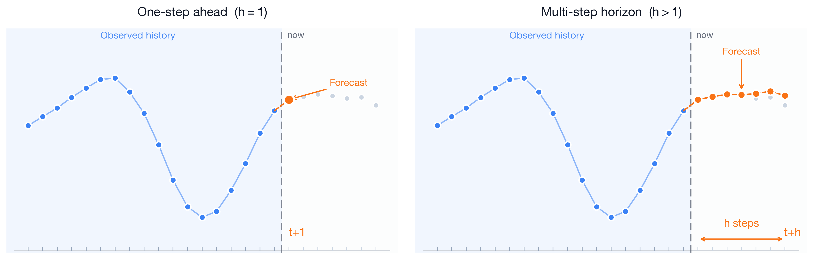
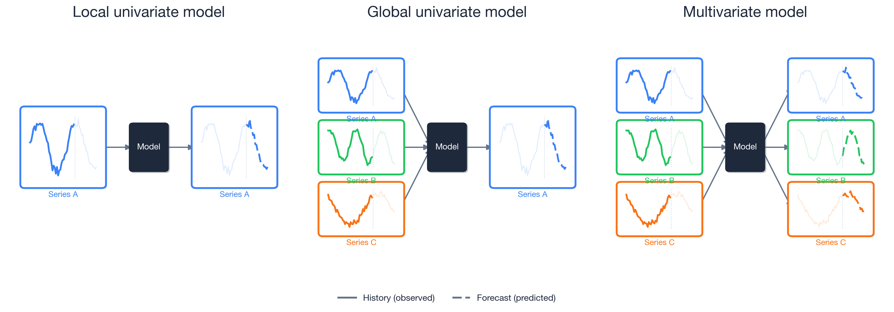
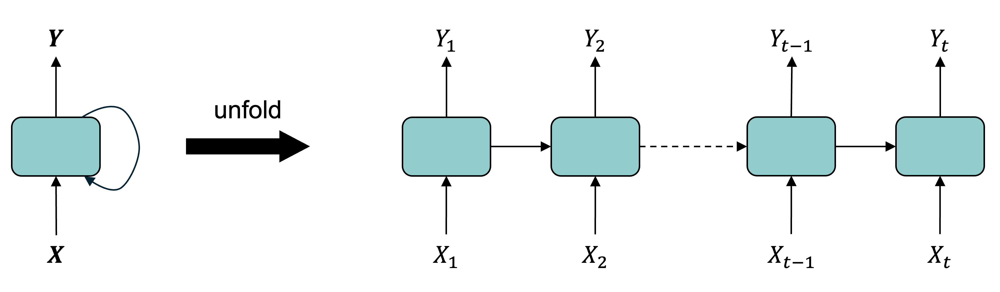
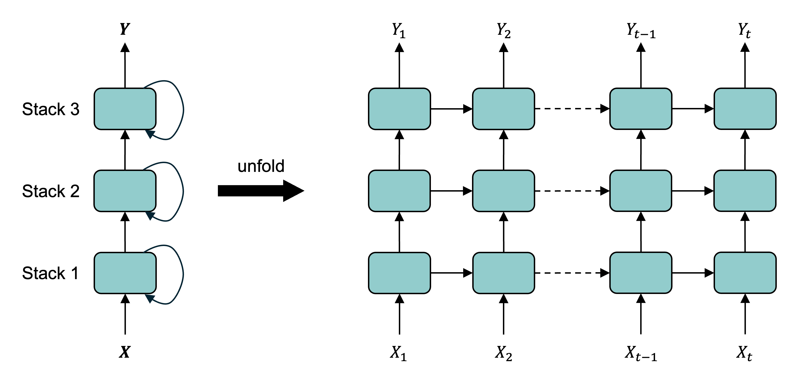
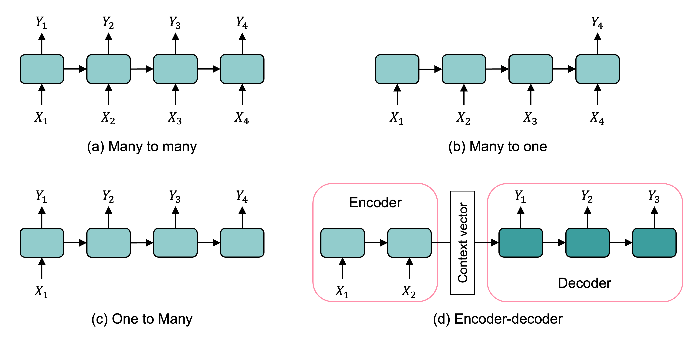

```{python}
#| echo: false
#| warning: false
from setup import *
```

# Introduction {visibility="uncounted"}

## A lecture on sequence modelling

This is really a lecture about _sequences_ — ordered data where the _order itself carries meaning_.

- _Time series_: stock prices, claim counts, mortality rates, temperatures.
- _Text_: a sentence is a sequence of words; a document a sequence of sentences.

The common thread: to predict the next element we must use what came _before_.

## Imports needed for these demos

```{python}
import re
import random
from pathlib import Path

import matplotlib.pyplot as plt
import matplotlib.dates as mdates
import numpy as np
import pandas as pd

from sklearn.linear_model import LinearRegression
from sklearn.metrics import mean_squared_error
from sklearn.preprocessing import LabelEncoder
from sklearn.model_selection import train_test_split
from sklearn.feature_extraction.text import CountVectorizer

import keras
from keras.models import Sequential
from keras.layers import (Dense, Input, Rescaling, Reshape,
    SimpleRNN, GRU, LSTM, Bidirectional, Embedding)
from keras.callbacks import EarlyStopping
```


# Time series data

## Tabular data vs time series data

::: columns
::: column

**Tabular data**

We have a dataset $\{ \boldsymbol{x}_i, y_i \}_{i=1}^n$ which we assume are i.i.d. observations.

| Brand    | Mileage  | # Claims |
|:--------:|:--------:|:--------:|
| BMW      | 101 km   | 1        |
| Audi     | 432 km   | 0        |
| Volvo    | 3 km     | 5        |
| $\vdots$ | $\vdots$ | $\vdots$ |

The goal is to _predict_ the $y$ for some covariates $\boldsymbol{x}$.
:::
::: column
**Time series data**

Have a sequence $\{ \boldsymbol{x}_t, y_t \}_{t=1}^T$ of observations taken at regular time intervals.

| Date  | Humidity | Temp. | 
|:-----:|:--------:|:-----:|
| Jan 1 | 60%      | 20 °C |
| Jan 2 | 65%      | 22 °C | 
| Jan 3 | 70%      | 21 °C |
| $\vdots$ | $\vdots$ | $\vdots$ |


The task is to _forecast_ future values based on the past.

:::
:::

## Attributes of time series data

- **Temporal ordering**: The order of the observations matters.
- **Trend**: The general direction of the data.
- **Noise**: Random fluctuations in the data.
- **Seasonality**: Patterns that repeat at regular intervals.

<!-- - **Autocorrelation**: The correlation of a signal with a delayed copy of itself. -->

::: {.callout-note}
## Question
What will be the temperature in Berlin tomorrow?
What information would you use to make a prediction?
:::

## The forecasting problem

We stand at a _reference time_ $t$: we have seen the series up to now, and want the next $h$ values.



## Three kinds of forecasting models



For local models, you would have a separate model for each time series. 
Global models allow for _cross-learning_, and are more promising for deep forecasting techniques.

::: footer
See @benidis2022deep [p. 4].
:::

## Time series for actuaries

Applications:

- _Claims reserving_ — project future claim payments given a notified claim.
- _Mortality forecasting_ — extrapolate mortality rates from life tables, e.g., @richman2019lee.
- _Economic scenario generation_ — simulate interest rates, inflation, and asset returns.

Neural networks or traditional models:

- _Traditional_ models (ARIMA, Lee–Carter) can be hard to beat on a _single, short, well-structured_ series — decades of refinement, few parameters, robust.
- _Neural networks_ work best with global cross-learning, and rich covariates.

Think about the fundamental predictability of the data:

- _Share prices_ are close to a _random walk_, hopeless to predict.
- _Weather_ is often genuinely predictable, especially in the short-term.

# Australian financial stocks

::: {.content-visible unless-format="revealjs"}

## Downloading the data {.smaller}

The `yfinance` package can download daily price histories from Yahoo Finance. We grab several ASX-listed financials plus the ASX200 index.

```python
# pip install yfinance
import yfinance as yf
from datetime import date

# Yahoo uses ".AX" for ASX stocks and "^AXJO" for the S&P/ASX 200 index
tickers = {
    "ANZ": "ANZ.AX", "BOQ": "BOQ.AX", "CBA": "CBA.AX", "NAB": "NAB.AX",
    "QBE": "QBE.AX", "SUN": "SUN.AX", "WBC": "WBC.AX", "ASX200": "^AXJO",
}

raw = yf.download(list(tickers.values()),
    start="1999-01-01", end=date.today().isoformat(), progress=False)

data = raw["Close"].rename(columns={v: k for k, v in tickers.items()})

# Make 'Date' an explicit column instead of the index
data = data.rename_axis("Date").reset_index()

data.to_csv("data/interim/aus_fin_stocks.csv", index=False)
```

:::

## Australian financial stocks {.smaller}

```{python}
stocks = pd.read_csv("data/interim/aus_fin_stocks.csv")
stocks
```

## Plot

```{python}
stocks.plot()
```

::: {.callout-note}
## Question
What is wrong with this plot?
:::

::: {.content-visible unless-format="revealjs"}
*Answer*: The main issues are

- $x$-axis is unclear: should show the _date_, not the observation number
- The ASX200 index has much larger values than the individual stocks; it should be plotted separately.
- The legend shouldn't be overlapping and hiding half of the plot.
:::

## Data types and NA values

::: columns
::: column
```{python}
stocks.info()
```
:::
::: column
```{python}
for col in stocks.columns:
    print(f"{col}: {stocks[col].isna().sum()}")
```
:::
:::

```{python}
asx200 = stocks.pop("ASX200")
```

## Set the index to the date {.smaller}

```{python}
stocks["Date"] = pd.to_datetime(stocks["Date"])
stocks = stocks.set_index("Date")
stocks
```

::: {.content-visible unless-format="revealjs"}
By setting the index to the date (and converting the date to a proper date format rather than a string), the plot of the stocks can be updated accordingly very easily.
:::

## Plot II
```{python}
stocks.plot() # This plot can still be improved.. why?
plt.ylabel("Stock Price ($)")
plt.legend(loc="upper center", bbox_to_anchor=(0.5, -0.4), ncol=4);
```

## Can index using dates I

::: {.content-visible unless-format="revealjs"}
We can filter our data nicely using the dates that are now indexed.
:::

```{python}
stocks.loc["2010-1-4":"2010-01-8"]
```

::: {.fragment}
Note, these ranges are _inclusive_, not like Python's normal slicing.
:::

## Can index using dates II

So to get 2019's December and all of 2020 for CBA:
```{python}
stocks.loc["2019-12":"2020", ["CBA"]]
```

## Can look at the first differences

::: {.content-visible unless-format="revealjs"}
Rather than looking directly at the time series, we can remove the effect of the trend by looking at first differences. 
:::

```{python}
stocks.diff().plot()
plt.ylabel("Daily Price Changes ($)")
plt.legend(loc="upper center", bbox_to_anchor=(0.5, -0.4), ncol=4);
```

::: {.content-visible unless-format="revealjs"}
The variance of the first differences increases over time (heteroscedasticity). This is a natural occurrence when the stock price increases over time.
:::

## Can look at the percentage changes

::: {.content-visible unless-format="revealjs"}
We can normalise the differences by taking the percentage changes.
:::

```{python}
stocks.pct_change().plot()
plt.ylabel("Daily Returns (%)")
plt.legend(loc="upper center", bbox_to_anchor=(0.5, -0.4), ncol=4);
```

## Focus on one stock

::: columns
::: column
```{python}
stock = stocks[["CBA"]].copy()
stock
```
:::
::: column
```{python}
stock.plot()
plt.ylabel("Stock Price ($)");
```

```{python}
stock.isna().sum()
```
:::
:::

## Fill in the missing values

::: {.content-visible unless-format="revealjs"}
Some of the data has missing values. Here, we fill in the missing values by taking the value from the previous day. If the previous day also has a missing value, then you do the same thing until all values are filled. This is called _forward-filling_.
:::

```{python}
asx200 = pd.DataFrame(asx200).set_index(stocks.index)
missing_day = asx200.index[asx200["ASX200"].isna()][1]
prev_day = missing_day - pd.Timedelta(days=1)
after = missing_day + pd.Timedelta(days=3)
```

::: columns
::: column
```{python}
asx200.loc[prev_day:after]
```
:::
::: column
```{python}
asx200 = asx200.ffill()
asx200.loc[prev_day:after]
```
:::
:::

```{python}
stock = stock.ffill()
```

## Convert to log returns

Instead of working with raw prices, we'll work with daily log returns:

::: columns
::: column
```{python}
# Calculate log returns
stock_log = np.log(stock / stock.shift(1)).dropna()
stock_log.head()
```
:::
::: column

```{python}
#| code-fold: true
stock_log.plot()
plt.ylabel("Daily Log Return")
plt.title("CBA Daily Log Returns");
```

```{python}
#| code-fold: true
# Distribution of log returns
returns = stock_log["CBA"]
plt.hist(returns, bins=100, alpha=0.7)
plt.xlabel("Daily Log Return")
plt.ylabel("Frequency")
plt.title("Distribution of CBA daily log returns");
```
:::
:::

The returns are tiny and roughly symmetric about zero. Neural networks train best on inputs near unit scale, so when we build the models we rescale the returns by the standard deviation of the _training_ returns — computed at that point, so nothing leaks from the test period.

## Splitting in time {.smaller}

We never shuffle a time series: train on the oldest data, validate on the middle, and keep the most recent years to test on. The cutoffs live in one place — change these lines to re-split.

```{python}
# Train through *_train_end, validate through *_val_end, test after.
cba_train_end,  cba_val_end  = "2014", "2020"   # ~60/20/20 (finance data ends 2026)
cba_val_start,  cba_test_start  = str(int(cba_train_end) + 1),  str(int(cba_val_end) + 1)
```

```{python}
#| code-fold: true
import matplotlib.dates as mdates
fig, ax = plt.subplots(figsize=(6, 2.6))
for label, lo, hi in [("Train", None, cba_train_end), ("Val", cba_val_start, cba_val_end), ("Test", cba_test_start, None)]:
    ax.plot(stock["CBA"].loc[lo:hi].index, stock["CBA"].loc[lo:hi], label=label)
ax.set_ylabel("CBA price ($)")
ax.xaxis.set_major_locator(mdates.YearLocator(5))
ax.xaxis.set_major_formatter(mdates.DateFormatter("%Y"))
ax.legend(loc="upper left", fontsize=7);
```

# Sydney weather

## Sydney Airport weather {.smaller}

The Bureau of Meteorology records daily weather at Sydney Airport (station 066037).

```{python}
TMAX = "Maximum temperature in 24 hours after 9am (local time) in Degrees C"
weather = pd.read_csv("data/raw/BoM/DC02D_Data_066037_9999999910249598.csv", low_memory=False)
weather
```

## The maximum temperature series

We forecast the _daily maximum temperature_. First build a proper date index.

```{python}
weather["Date"] = pd.to_datetime(weather[["Year", "Month", "Day"]])
temps = weather.set_index("Date")[[TMAX]].rename(columns={TMAX: "Temp"})
temps["Temp"] = pd.to_numeric(temps["Temp"], errors="coerce")
temps
```

## Plot

```{python}
temps.plot()
plt.ylabel("Max temperature (°C)");
```

::: {.content-visible unless-format="revealjs"}
Unlike stock prices, temperature has a strong, regular _yearly seasonality_ — hot summers and cool winters repeat every year. That is genuine structure a model can learn.
:::

## Data types and NA values

::: columns
::: column
```{python}
temps.info()
```
:::
::: column
```{python}
temps.isna().sum()
```
:::
:::

```{python}
temps = temps.dropna()
```

## Zooming into one summer

```{python}
temps.loc["2019-12":"2020-02"].plot()
plt.ylabel("Max temperature (°C)");
```

## Splitting in time {.smaller}

```{python}
temp_train_end, temp_val_end = "2009", "2015"   # ~60/20/20 (weather data ends 2022)
temp_val_start, temp_test_start = str(int(temp_train_end) + 1), str(int(temp_val_end) + 1)
```

```{python}
#| code-fold: true
import matplotlib.dates as mdates
fig, ax = plt.subplots(figsize=(6, 2.6))
for label, lo, hi in [("Train", None, temp_train_end), ("Val", temp_val_start, temp_val_end), ("Test", temp_test_start, None)]:
    ax.plot(temps["Temp"].loc[lo:hi].index, temps["Temp"].loc[lo:hi], label=label)
ax.set_ylabel("Max temp (°C)")
ax.xaxis.set_major_locator(mdates.YearLocator(5))
ax.xaxis.set_major_formatter(mdates.DateFormatter("%Y"))
ax.legend(loc="upper left", fontsize=7);
```

# Naive baseline forecasts

::: {.content-visible unless-format="revealjs"}
Before any neural network we set up _baselines_ that need no training; a model only earns its keep if it beats them. The simplest assume _nothing changes_; for each series we also build one smarter, structural forecast — a _trend_ for the share price and a _seasonal average_ for the temperature.
:::

## Three naive forecasting ideas

The simplest forecast assumes _nothing changes_ — but that has two readings, differing in how far ahead they look and where they re-anchor:

- _Persistence_ (one-step): tomorrow equals today, $\hat{y}_t = y_{t-1}$, re-anchored to the _true_ latest value every day. The yardstick for _one-step_ models.
- _Constant_ (multi-step): the entire future is held _constant_ at the last value we saw, $\hat{y}_{t+h} = y_t$ for all $h$ — anchored _once_ at the forecast origin, giving a flat line. The yardstick for _multi-step_ models.

Both are the same _random-walk_ idea (also called _last observation carried forward_): they agree on the first step and only diverge after it.

The last basic forecast is to just extrapolate the trend seen in the training data.

## Helper functions

```{python}
def log_to_price(log_returns, initial_price):
    """Convert log returns to raw prices given an initial price."""
    # Use cumulative sum of log returns for numerical stability
    # P_t = P_0 * exp(sum of log returns from 1 to t)
    cumulative_log_returns = log_returns.cumsum()
    prices = initial_price * np.exp(cumulative_log_returns)

    return prices

def get_last_price(stock_df, cutoff_date):
    """Get the last known price before the forecast period starts."""
    last_known_date = stock_df.loc[:cutoff_date].index[-1]
    return stock_df.loc[last_known_date, "CBA"]
```

## Constant forecast

The whole validation period is held _constant_ at the last price we saw just before it.
This is the multi-step naïve forecast (zero log returns from the origin onward).

```{python}
last_price = get_last_price(stock, cutoff_date=f"{cba_train_end}-12")
constant_log = pd.Series(0.0, index=stock_log.loc[cba_val_start:cba_val_end].index)
constant_prices = log_to_price(constant_log, last_price)
```

```{python}
#| code-fold: true
start = f"{cba_train_end}-12"
end = cba_val_end
stock.loc[start:end, ["CBA"]].plot(label="CBA")
constant_prices.plot(label="Constant")
plt.axvline(f"{cba_val_start}-01", color="black", linestyle="--")
plt.ylabel("Stock Price ($)")
plt.legend()
```

## Extrapolate the trend

```{python}
train_log_returns = stock_log.loc[:cba_train_end]   # estimate the trend on training data only
trend_log = train_log_returns.mean().values[0]
print(f"Average daily log return: {trend_log:.6f}")
```

```{python}
#| echo: false
log_trend = pd.Series(trend_log, index=stock_log.loc[cba_val_start:cba_val_end].index)
trend_prices = log_to_price(log_trend, last_price)
```

```{python}
#| code-fold: true
# Plot the mean daily log return over the training-period returns
train_log_returns.plot()
plt.axhline(trend_log, color=COLOURS[1], linestyle="--", label="Trend (mean log return)")
plt.ylabel("Daily Log Return");
```

## Trend fitted

```{python}
# Create trend forecast over the training period to show the fitted trend
train_trend_log = pd.Series(trend_log, index=train_log_returns.index)
trend_start_price = get_last_price(stock, cutoff_date=train_log_returns.index[0].strftime('%Y-%m-%d'))
train_trend_prices = log_to_price(train_trend_log, trend_start_price)
```

```{python}
#| code-fold: true
stock.loc[train_log_returns.index, ["CBA"]].plot(label="CBA")
train_trend_prices.plot(label="Trend")
plt.axvline(train_log_returns.index[0], color="gray", linestyle=":", linewidth=1)
plt.axvline(train_log_returns.index[-1], color="gray", linestyle=":", linewidth=1)
plt.ylabel("Stock Price ($)")
plt.legend();
```

## Trend forecasts

```{python}
#| code-fold: true
stock.loc[start:end, ["CBA"]].plot(label="CBA")
constant_prices.loc[start:end].plot(label="Constant")
trend_prices.loc[start:end].plot(label="Trend")
plt.axvline(f"{cba_val_start}-01", color="black", linestyle="--")
plt.ylabel("Stock Price ($)")
plt.legend(ncol=3, loc="upper center", bbox_to_anchor=(0.5, 1.3));
```

## Which is better?

If we look at the root mean squared error (RMSE) of the two models:

```{python}
# Calculate RMSE using the actual forecasts we computed
actual_prices = stock.loc[cba_val_start:cba_val_end, "CBA"]
constant_rmse = mean_squared_error(actual_prices, constant_prices) ** 0.5
trend_rmse = mean_squared_error(actual_prices, trend_prices) ** 0.5
constant_rmse, trend_rmse
```

::: {.content-visible unless-format="revealjs"}
::: {.callout-tip}
## Question
Why report RMSE rather than MSE?

*Answer*: MSE squares the differences, so its units are _squared_ dollars — hard to interpret. Taking the square root (RMSE) brings the units back to dollars, directly comparable to the share price.
:::
:::

## Persistence forecast (one-step)

Now two baselines for the _temperature_ series. First, _persistence_: predict tomorrow's maximum temperature to be the _same as today's_, $\hat{y}_t = y_{t-1}$.

```{python}
persistence = temps["Temp"].shift(1)
```

```{python}
#| code-fold: true
ax = temps.loc[f"{temp_test_start}-01":f"{temp_test_start}-03", "Temp"].plot(label="Actual", x_compat=True)
persistence.loc[f"{temp_test_start}-01":f"{temp_test_start}-03"].plot(ax=ax, label="Persistence", x_compat=True)
ax.set_ylabel("Max temperature (°C)")
ax.xaxis.set_major_locator(mdates.MonthLocator())
ax.xaxis.set_major_formatter(mdates.DateFormatter("%b"))
ax.set_xlabel("")
ax.legend();
```

## A seasonal baseline

A smarter baseline uses the _seasonality_: predict each day's historical average over all years in the training period.

```{python}
train_temps = temps.loc[:temp_train_end, "Temp"]
seasonal_average = train_temps.groupby(train_temps.index.dayofyear).mean()
seasonal = pd.Series(temps.index.dayofyear, index=temps.index).map(seasonal_average)
```

```{python}
#| code-fold: true
seasonal_average.plot()
plt.xlabel("Day of year")
plt.ylabel("Average max temp (°C)");
```

## Seasonal forecast

```{python}
#| code-fold: true
ax = temps.loc[temp_test_start, "Temp"].plot(label="Actual", x_compat=True)
seasonal.loc[temp_test_start].plot(ax=ax, label="Seasonal", x_compat=True)
ax.set_ylabel("Max temperature (°C)")
ax.xaxis.set_major_locator(mdates.MonthLocator())
ax.xaxis.set_major_formatter(mdates.DateFormatter("%b"))
ax.set_xlabel("")
ax.legend();
```

::: {.content-visible unless-format="revealjs"}
The seasonal average captures the annual cycle but misses the day-to-day weather. Persistence does the opposite. A good model should combine both.
:::

## Which is better?

We compare the forecasts over the _validation_ years using the root mean squared error (RMSE), in °C.

```{python}
actual_val = temps["Temp"].loc[temp_val_start:temp_val_end]
persistence_rmse_val = mean_squared_error(actual_val, persistence.loc[temp_val_start:temp_val_end]) ** 0.5
seasonal_rmse_val = mean_squared_error(actual_val, seasonal.loc[temp_val_start:temp_val_end]) ** 0.5
persistence_rmse_val, seasonal_rmse_val
```

::: {.content-visible unless-format="revealjs"}
The RMSE is in °C, so it is directly interpretable: a typical forecast is off by a few degrees. The seasonal baseline clearly beats persistence — there is real structure to exploit. For the share price, by contrast, persistence is already about as good as it gets.
:::

# Use the recent history {visibility="uncounted"}

::: {.content-visible unless-format="revealjs"}
The baselines used only yesterday (persistence) or the calendar (seasonal / trend). Now we hand a model a genuine _window_ of recent history — the last 40 values — and let it learn the mapping to the next value. This turns the series into an ordinary supervised-learning problem that any regressor can tackle, starting with a linear model and a feedforward network.
:::

## Lagged features {.smaller}

We turn each series into a table: the previous 40 values become the features `T-40, …, T-1`, and the value to predict is `T`.

::: columns
::: column

```{python}
def lagged_timeseries(df, target, window):
    lagged = pd.DataFrame()
    for i in range(window, 0, -1):
        lagged[f"T-{i}"] = df[target].shift(i)
    lagged["T"] = df[target].values
    return lagged
```

:::
::: column

```{python}
temp_lagged = lagged_timeseries(temps, "Temp", 40)
cba_lagged = lagged_timeseries(stock_log, "CBA", 40)
```

:::
:::

The temperature design matrix — each row is one 40-day window (the first rows include `NaN` until 40 days of history exist):

```{python}
#| echo: false
pandas.options.display.max_rows = 4
```

```{python}
#| echo: false
temp_lagged
```

```{python}
#| echo: false
pandas.options.display.max_rows = 6
```

## Building the design matrix {.smaller}

We turn each split into a supervised table of lagged features. We can't shuffle — the timing matters — so we fit on older data and forecast forward. The same recipe applies to both series.

::: columns
::: column
_Weather_ — predict the temperature (time-ordered split; cutoffs set above).
```{python}
X_train_temp = temp_lagged.loc[:temp_train_end].dropna()
X_val_temp = temp_lagged.loc[temp_val_start:temp_val_end].dropna()
X_test_temp = temp_lagged.loc[temp_test_start:].dropna()
y_train_temp = X_train_temp.pop("T")
y_val_temp = X_val_temp.pop("T")
y_test_temp = X_test_temp.pop("T")
```
:::
::: column
_Finance_ — predict the log return (same time-ordered split; cutoffs set above).
```{python}
X_train_cba = cba_lagged.loc[:cba_train_end].dropna()
X_val_cba = cba_lagged.loc[f"{cba_val_start}-01":f"{cba_val_end}-12"].dropna()
X_test_cba = cba_lagged.loc[cba_test_start:].dropna()
y_train_cba = X_train_cba.pop("T")
y_val_cba = X_val_cba.pop("T")
y_test_cba = X_test_cba.pop("T")
```
:::
:::

```{python}
#| echo: false
def w_rmse(pred):
    return mean_squared_error(y_test_temp, np.asarray(pred).flatten()) ** 0.5
def s_rmse(pred_log):
    s = pd.Series(np.asarray(pred_log).flatten(), index=y_test_cba.index)
    pred_price = stock["CBA"].shift(1).reindex(y_test_cba.index) * np.exp(s)
    return mean_squared_error(stock["CBA"].reindex(y_test_cba.index), pred_price) ** 0.5
def load_or_fit(path, make, X_tr, y_tr, X_va, y_va):
    if Path(path).exists():
        return keras.models.load_model(path)
    m = make(); m.compile(optimizer="adam", loss="mean_absolute_error")
    m.fit(X_tr, y_tr, validation_data=(X_va, y_va), epochs=500,
          callbacks=[EarlyStopping(patience=15, restore_best_weights=True)], verbose=0)
    m.save(path); return m

s_shift = mean_squared_error(stock["CBA"].reindex(y_test_cba.index), stock["CBA"].shift(1).reindex(y_test_cba.index)) ** 0.5
w_scores = {
    "Persistence (1-step)": mean_squared_error(temps["Temp"].loc[temp_test_start:], persistence.loc[temp_test_start:]) ** 0.5,
    "Seasonal": mean_squared_error(temps["Temp"].loc[temp_test_start:], seasonal.loc[temp_test_start:]) ** 0.5,
}
s_scores = {"Persistence (1-step)": s_shift}

# Observed std of the training-period log returns, used to rescale the NN inputs.
finance_scale = y_train_cba.std()
```

## A linear model {.smaller}

::: columns
::: column
```{python}
lr_s = LinearRegression().fit(X_train_cba, y_train_cba)
y_pred_cba = lr_s.predict(X_test_cba)
s_scores["Linear"] = s_rmse(y_pred_cba)
```
CBA log-return forecasts (Q1 of test set)

```{python}
#| code-fold: true
pd.DataFrame({"Actual": y_test_cba, "Linear": y_pred_cba}, index=y_test_cba.index).loc[f"{cba_test_start}-01":f"{cba_test_start}-03"].plot()
plt.ylabel("Log return"); plt.legend();
```
:::
::: column
```{python}
lr_w = LinearRegression().fit(X_train_temp, y_train_temp)
y_pred_temp = lr_w.predict(X_test_temp)
w_scores["Linear"] = w_rmse(y_pred_temp)
```
Temperature forecasts (Q1 of test set)

```{python}
#| code-fold: true
ax = pd.DataFrame({"Actual": y_test_temp, "Linear": y_pred_temp}, index=y_test_temp.index).loc[f"{temp_test_start}-01":f"{temp_test_start}-03"].plot(x_compat=True)
ax.set_ylabel("Max temp (°C)")
ax.set_xlabel("")
ax.xaxis.set_major_locator(mdates.MonthLocator())
ax.xaxis.set_major_formatter(mdates.DateFormatter("%b"))
ax.legend();
```
:::
:::

## A feedforward network {.smaller}

Same architecture for both; only the input rescaling differs: temperatures are divided by 40 (their rough maximum), log returns by their training-set standard deviation (`finance_scale` ≈ 0.014).

```{python}
#| eval: false
scale = 1 / finance_scale  # for weather: 1/40
model = Sequential([Rescaling(scale), Dense(32, activation="leaky_relu"), Dense(1)])
model.compile(optimizer="adam", loss="mean_absolute_error")
model.fit(X_train_cba, y_train_cba, validation_data=(X_val_cba, y_val_cba), epochs=500,
    callbacks=[EarlyStopping(patience=15, restore_best_weights=True)], verbose=0)
```

```{python}
#| echo: false
fnn_w = load_or_fit("models/bom_fnn.keras",
    lambda: Sequential([Rescaling(1/40), Dense(32, activation="leaky_relu"), Dense(1)]),
    X_train_temp, y_train_temp, X_val_temp, y_val_temp)
fnn_s = load_or_fit("models/aus_fin_fnn_model.keras",
    lambda: Sequential([Rescaling(1/finance_scale), Dense(32, activation="leaky_relu"), Dense(1)]),
    X_train_cba, y_train_cba, X_val_cba, y_val_cba)
y_pred_temp = fnn_w.predict(X_test_temp.to_numpy(), verbose=0).flatten()
y_pred_cba = fnn_s.predict(X_test_cba.to_numpy(), verbose=0).flatten()
w_scores["FNN"] = w_rmse(y_pred_temp); s_scores["FNN"] = s_rmse(y_pred_cba)
```

::: columns
::: column
CBA log-return forecasts (Q1 of test set)

```{python}
#| code-fold: true
pd.DataFrame({"Actual": y_test_cba, "FNN": y_pred_cba}, index=y_test_cba.index).loc[f"{cba_test_start}-01":f"{cba_test_start}-03"].plot()
plt.ylabel("Log return"); plt.legend();
```
:::
::: column
Temperature forecasts (Q1 of test set)

```{python}
#| code-fold: true
ax = pd.DataFrame({"Actual": y_test_temp, "FNN": y_pred_temp}, index=y_test_temp.index).loc[f"{temp_test_start}-01":f"{temp_test_start}-03"].plot(x_compat=True)
ax.set_ylabel("Max temp (°C)")
ax.xaxis.set_major_locator(mdates.MonthLocator())
ax.xaxis.set_major_formatter(mdates.DateFormatter("%b %Y"))
ax.set_xlabel("")
ax.legend();
```
:::
:::

# Simple Recurrent Neural Networks {visibility="uncounted"}

## Introduction

- A recurrent neural network is a type of neural network that is designed to process sequences of data (e.g. time series, sentences).
- A recurrent neural network is any network that contains a recurrent layer.
- A recurrent layer is a layer that processes data in a sequence.
- An RNN can have one or more recurrent layers.
- Weights are shared over time; this allows the model to be used on arbitrary-length sequences.

On the name of RNNs:

The "recurrent" comes from a _recurrence relation_: each element of a sequence is defined in terms of the previous one(s). When only the immediately preceding element matters, this looks like

$$ u_n = \psi(n, u_{n-1}) \quad \text{ for } \quad n > 0.$$

__Example__: Factorial $n! = n (n-1)!$ for $n > 0$ given $0! = 1$.

## Diagram of an RNN cell

The RNN processes each data point in the sequence one by one, while keeping memory of what came before.



::: {.content-visible unless-format="revealjs"}
The RNN combines an input $X_n$ with a processed state using inputs $X_1,...,X_{n-1}$ to produce the output $Y_n$. RNNs have a cyclic information processing structure that enables them to pass information sequentially from previous inputs. RNNs can capture dependencies and patterns in sequential data, making them useful for analysing time series data.
:::

::: footer
Source: Melissa Renard (2025)
:::

## A SimpleRNN cell


All the outputs before the final one are often discarded.

::: footer
Source: Christopher Olah (2015), [Understanding LSTM Networks](http://colah.github.io/posts/2015-08-Understanding-LSTMs), Colah's Blog.
:::

## The rank of a time series

::: columns
::: column
Say we had $n$ observations of a time series $x_1, x_2, \dots, x_n$. 

This $\boldsymbol{x} = (x_1, \dots, x_n)$ would have shape $(n,)$ & rank 1.

If instead we had a batch of $b$ time series

$$
\boldsymbol{X} = \begin{pmatrix}
x_7 & x_8 & \dots & x_{7+n-1} \\
x_2 & x_3 & \dots & x_{2+n-1} \\
\vdots & \vdots & \ddots & \vdots \\
x_3 & x_4 & \dots & x_{3+n-1} \\
\end{pmatrix}  \,,
$$

the batch $\boldsymbol{X}$ would have shape $(b, n)$ & rank 2.
:::
::: column

<center>

|   $t$ | $x$   | $y$   |
|------:|:------|:------|
|     0 | $x_0$ | $y_0$ |
|     1 | $x_1$ | $y_1$ |
|     2 | $x_2$ | $y_2$ |
|     3 | $x_3$ | $y_3$ |
</center>

Say $n$ observations of the $m$ time series would be a shape $(n, m)$ matrix of rank 2.

In Keras, a batch of $b$ of these time series has shape $(b, n, m)$ and has rank 3.

:::
:::

::: {.callout-note}
Use $\boldsymbol{x}_t \in \mathbb{R}^{1 \times m}$ to denote the vector of all time series at time $t$.
Here, $\boldsymbol{x}_t = (x_t, y_t)$.
:::

## SimpleRNN

Say each prediction is a vector of size $d$, so $\boldsymbol{y}_t \in \mathbb{R}^{1 \times d}$.

Then the main equation of a SimpleRNN, given $\boldsymbol{y}_0 = \boldsymbol{0}$, is

$$ \boldsymbol{y}_t = \psi\bigl( \boldsymbol{x}_t \boldsymbol{W}_x + \boldsymbol{y}_{t-1} \boldsymbol{W}_y + \boldsymbol{b} \bigr) . $$

Here,
$$
\begin{aligned}
&\boldsymbol{x}_t \in \mathbb{R}^{1 \times m}, \boldsymbol{W}_x \in \mathbb{R}^{m \times d}, \\
&\boldsymbol{y}_{t-1} \in \mathbb{R}^{1 \times d}, \boldsymbol{W}_y \in \mathbb{R}^{d \times d}, \text{ and } \boldsymbol{b} \in \mathbb{R}^{d}.
\end{aligned}
$$

::: {.content-visible unless-format="revealjs"}
At each time step, a simple Recurrent Neural Network (RNN) takes an input vector $x_t$, incorporates it with the information from the previous hidden state ${y}_{t-1}$ and produces an output vector at each time step $y_t$. The hidden state helps the network remember the context of the previous inputs and states, enabling it to make informed predictions about what comes next in the sequence. 
In a simple RNN, the output at time $(t-1)$ is the same as the hidden state at time $t$.
:::

## SimpleRNN (in batches)

Say we operate on batches of size $b$, then $\boldsymbol{Y}_t \in \mathbb{R}^{b \times d}$.

The main equation of a SimpleRNN, given $\boldsymbol{Y}_0 = \boldsymbol{0}$, is
$$ \boldsymbol{Y}_t = \psi\bigl( \boldsymbol{X}_t \boldsymbol{W}_x + \boldsymbol{Y}_{t-1} \boldsymbol{W}_y + \boldsymbol{b} \bigr) . $$
Here,
$$
\begin{aligned}
&\boldsymbol{X}_t \in \mathbb{R}^{b \times m}, \boldsymbol{W}_x \in \mathbb{R}^{m \times d}, \\
&\boldsymbol{Y}_{t-1} \in \mathbb{R}^{b \times d}, \boldsymbol{W}_y \in \mathbb{R}^{d \times d}, \text{ and } \boldsymbol{b} \in \mathbb{R}^{d}.
\end{aligned}
$$

Remember, $\boldsymbol{X} \in \mathbb{R}^{b \times n \times m}$, $\boldsymbol{Y} \in \mathbb{R}^{b \times d}$, and $\boldsymbol{X}_t$ is equivalent to `X[:, t, :]`.

## Simple Keras demo

```{python}
num_obs = 4  # <1>
num_time_steps = 3  # <2>
num_time_series = 2  # <3>

X = (
    np.arange(num_obs * num_time_steps * num_time_series)
    .astype(np.float32)
    .reshape([num_obs, num_time_steps, num_time_series])
)  # <4>

output_size = 1
y = np.array([0, 0, 1, 1])
```
1. Defines the number of observations
2. Defines the number of time steps
3. Defines the number of time series
4. Reshapes the array to a rank 3 tensor (4,3,2)

::: columns
::: column
```{python}
X[:2]  # <1>
```
1. Selects the first two slices along the first dimension. Since the tensor is of dimensions (4,3,2), `X[:2]` selects the first two slices (0 and 1) along the first dimension, and returns a sub-tensor of shape (2,3,2).
:::
::: column
```{python}
X[2:]  # <1>
```
1. Selects the last two slices along the first dimension. The first dimension (axis=0) has size 4. Therefore, `X[2:]`  selects the last two slices (2 and 3) along the first dimension, and returns a sub-tensor of shape (2,3,2). 
:::
:::

## Keras' SimpleRNN

As usual, the `SimpleRNN` is just a layer in Keras. 

```{python}
random.seed(1234)  # <1>
model = Sequential([SimpleRNN(output_size, activation="sigmoid")])  # <2>
model.compile(loss="binary_crossentropy", metrics=["accuracy"])  # <3>

hist = model.fit(X, y, epochs=500, verbose=False)  # <4>
model.evaluate(X, y, verbose=False)  # <5>
```

1. Sets the seed for the random number generator to ensure reproducibility
2. Defines a simple RNN with one output node and sigmoid activation function
3. Specifies binary crossentropy as the loss function (usually used in classification problems), and specifies "accuracy" as the metric to be monitored during training
4. Trains the model for 500 epochs and saves output as `hist`
5. Evaluates the model to obtain a value for the loss and accuracy


The predicted probabilities on the training set are:

```{python}
model.predict(X, verbose=0)
```

## SimpleRNN weights

::: {.content-visible unless-format="revealjs"}
To verify the results of predicted probabilities, we can obtain the weights of the fitted model and calculate the outcome manually as follows.
:::

```{python}
model.get_weights()
```

```{python}
def sigmoid(x):
    return 1 / (1 + np.exp(-x))


W_x, W_y, b = model.get_weights()

Y = np.zeros((num_obs, output_size), dtype=np.float32)
for t in range(num_time_steps):
    X_t = X[:, t, :]
    z = X_t @ W_x + Y @ W_y + b
    Y = sigmoid(z)

Y
```

# Recurrent Neural Networks


## Long short-term memory (LSTM)

<center>

{width="80%"}
{width="80%"}

</center>

::: {.content-visible unless-format="revealjs"}
Simple RNN structures encounter vanishing gradient problems, hence, struggle with learning long term dependencies. LSTM models were designed to overcome this problem. LSTMs have a more complex network structure (contains more memory cells and gating mechanisms) and can better regulate the information flow.
:::


::: footer
Sources: @hochreiter1997long, and Christopher Olah (2015), [Understanding LSTM Networks](http://colah.github.io/posts/2015-08-Understanding-LSTMs), Colah's Blog.
:::

## Gated Recurrent Unit (GRU)

::: {.content-visible unless-format="revealjs"}
GRUs are simpler compared to LSTM, hence, computationally more efficient than LSTMs. 
:::


::: footer
Source: Christopher Olah (2015), [Understanding LSTM Networks](http://colah.github.io/posts/2015-08-Understanding-LSTMs), Colah's Blog.
:::

## Recurrent layers can be stacked



::: {.content-visible unless-format="revealjs"}
The output from a hidden state can be used as input for another hidden layer of RNN processing. This is called _stacking_, or a _stacked RNN_.
:::

::: footer
Source: Melissa Renard (2025)
:::

## Fitting the SimpleRNN {.smaller}

```{python}
#| echo: false
rnn_w = load_or_fit("models/bom_simplernn.keras",
    lambda: Sequential([Rescaling(1/40), Reshape((-1, 1)), SimpleRNN(64, activation="tanh"), Dense(1)]),
    X_train_temp, y_train_temp, X_val_temp, y_val_temp)
rnn_s = load_or_fit("models/aus_fin_simplernn_model.keras",
    lambda: Sequential([Rescaling(1/finance_scale), Reshape((-1, 1)), SimpleRNN(64, activation="tanh"), Dense(1)]),
    X_train_cba, y_train_cba, X_val_cba, y_val_cba)
y_pred_temp = rnn_w.predict(X_test_temp.to_numpy(), verbose=0).flatten()
y_pred_cba = rnn_s.predict(X_test_cba.to_numpy(), verbose=0).flatten()
w_scores["SimpleRNN"] = w_rmse(y_pred_temp); s_scores["SimpleRNN"] = s_rmse(y_pred_cba)
```

```{python}
#| eval: false
scale = 1 / finance_scale  # for weather: 1/40
model = Sequential([Rescaling(scale), Reshape((-1, 1)), SimpleRNN(64, activation="tanh"), Dense(1)])
model.compile(optimizer="adam", loss="mean_absolute_error")
model.fit(X_train_cba, y_train_cba, validation_data=(X_val_cba, y_val_cba), epochs=500,
    callbacks=[EarlyStopping(patience=15, restore_best_weights=True)], verbose=0)
```

::: columns
::: column
CBA stock price forecasts (test set)

```{python}
#| code-fold: true
pd.DataFrame({"Actual": y_test_cba, "SimpleRNN": y_pred_cba}, index=y_test_cba.index).plot()
plt.ylabel("Log return"); plt.legend();
```
:::
::: column
Temperature forecasts (test set)

```{python}
#| code-fold: true
ax = pd.DataFrame({"Actual": y_test_temp, "SimpleRNN": y_pred_temp}, index=y_test_temp.index).loc[f"{temp_test_start}-01":f"{temp_test_start}-03"].plot(x_compat=True)
ax.set_ylabel("Max temp (°C)")
ax.xaxis.set_major_locator(mdates.MonthLocator())
ax.xaxis.set_major_formatter(mdates.DateFormatter("%b %Y"))
ax.set_xlabel("")
ax.legend();
```
:::
:::

## Fitting a GRU {.smaller}

```{python}
#| echo: false
gru_w = load_or_fit("models/bom_gru.keras",
    lambda: Sequential([Rescaling(1/40), Reshape((-1, 1)), GRU(16, activation="tanh"), Dense(1)]),
    X_train_temp, y_train_temp, X_val_temp, y_val_temp)
gru_s = load_or_fit("models/aus_fin_gru_model.keras",
    lambda: Sequential([Rescaling(1/finance_scale), Reshape((-1, 1)), GRU(16, activation="tanh"), Dense(1)]),
    X_train_cba, y_train_cba, X_val_cba, y_val_cba)
y_pred_temp = gru_w.predict(X_test_temp.to_numpy(), verbose=0).flatten()
y_pred_cba = gru_s.predict(X_test_cba.to_numpy(), verbose=0).flatten()
w_scores["GRU"] = w_rmse(y_pred_temp); s_scores["GRU"] = s_rmse(y_pred_cba)
```

```{python}
#| eval: false
scale = 1 / finance_scale  # for weather: 1/40
model = Sequential([Rescaling(scale), Reshape((-1, 1)), GRU(16, activation="tanh"), Dense(1)])
model.compile(optimizer="adam", loss="mean_absolute_error")
model.fit(X_train_cba, y_train_cba, validation_data=(X_val_cba, y_val_cba), epochs=500,
    callbacks=[EarlyStopping(patience=15, restore_best_weights=True)], verbose=0)
```

::: columns
::: column
CBA stock price forecasts (test set)

```{python}
#| code-fold: true
pd.DataFrame({"Actual": y_test_cba, "GRU": y_pred_cba}, index=y_test_cba.index).plot()
plt.ylabel("Log return"); plt.legend();
```
:::
::: column
Temperature forecasts (test set)

```{python}
#| code-fold: true
ax = pd.DataFrame({"Actual": y_test_temp, "GRU": y_pred_temp}, index=y_test_temp.index).loc[f"{temp_test_start}-01":f"{temp_test_start}-03"].plot(x_compat=True)
ax.set_ylabel("Max temp (°C)")
ax.xaxis.set_major_locator(mdates.MonthLocator())
ax.xaxis.set_major_formatter(mdates.DateFormatter("%b %Y"))
ax.set_xlabel("")
ax.legend();
```
:::

:::

## Metrics on the validation set

```{python}
#| echo: false
# Same models and baselines, scored on the *validation* split.
def w_rmse_val(pred):
    return mean_squared_error(y_val_temp, np.asarray(pred).flatten()) ** 0.5
def s_rmse_val(pred_log):
    s = pd.Series(np.asarray(pred_log).flatten(), index=y_val_cba.index)
    pred_price = stock["CBA"].shift(1).reindex(y_val_cba.index) * np.exp(s)
    return mean_squared_error(stock["CBA"].reindex(y_val_cba.index), pred_price) ** 0.5

w_val = temps["Temp"].loc[temp_val_start:temp_val_end]
v_idx = y_val_cba.index
w_scores_val = {
    "Persistence (1-step)": mean_squared_error(w_val, persistence.loc[temp_val_start:temp_val_end]) ** 0.5,
    "Seasonal": mean_squared_error(w_val, seasonal.loc[temp_val_start:temp_val_end]) ** 0.5,
}
s_scores_val = {
    "Persistence (1-step)": mean_squared_error(stock["CBA"].reindex(v_idx), stock["CBA"].shift(1).reindex(v_idx)) ** 0.5,
}
w_scores_val["Linear"] = w_rmse_val(lr_w.predict(X_val_temp))
s_scores_val["Linear"] = s_rmse_val(lr_s.predict(X_val_cba))
for _name, _mw, _ms in [("FNN", fnn_w, fnn_s), ("SimpleRNN", rnn_w, rnn_s), ("GRU", gru_w, gru_s)]:
    w_scores_val[_name] = w_rmse_val(_mw.predict(X_val_temp.to_numpy(), verbose=0).flatten())
    s_scores_val[_name] = s_rmse_val(_ms.predict(X_val_cba.to_numpy(), verbose=0).flatten())
```

::: columns
::: column
Stock price forecasting

```{python}
#| echo: false
pd.DataFrame({"RMSE ($)": s_scores_val}).sort_values("RMSE ($)", ascending=False).round(2)
```
:::
::: column
Temperature forecasting

```{python}
#| echo: false
pd.DataFrame({"RMSE (°C)": w_scores_val}).sort_values("RMSE (°C)", ascending=False).round(2)
```
:::
:::

## Metrics on the test set

::: columns
::: column
Stock price forecasting

```{python}
#| echo: false
# Only the model that won on the validation set.
pd.DataFrame({"RMSE ($)": {"Persistence (1-step)": s_scores["Persistence (1-step)"]}}).round(2)
```
:::
::: column
Temperature forecasting

```{python}
#| echo: false
# Only the model that won on the validation set.
pd.DataFrame({"RMSE (°C)": {"GRU": w_scores["GRU"]}}).round(2)
```
:::
:::

::: {.content-visible unless-format="revealjs"}
For the weather, every learned model beats the baselines and the GRU is best. For the share price, nothing meaningfully beats persistence — there is no signal to extract.
:::

# Multi-step forecasting and multivariate forecasting {visibility="uncounted"}

<!--
::: {.content-visible unless-format="revealjs"}
Everything so far was _one-step_: predict tomorrow from the real last 40 days. To forecast further out, we would have to feed a model its own predictions.
:::

## Three ways to forecast further ahead

- **Recursive / autoregressive** — feed a one-step model its own output, one step at a time.
- **Direct** — train the network to output the next `h` values at once.
- **Encoder–decoder (seq2seq)** — encode the history into a vector, then decode the whole horizon (out of scope).
-->

## Autoregressive forecasts

Every model so far is _one-step_: it maps the last 40 days to a single next value. To forecast further out, we can feed the model _its own predictions_.

**Idea**: make the first forecast, then treat it as if it were real and use it to make the next forecast, and so on. For the linear model this reads:

$$
\begin{aligned}
    \hat{y}_t &= \beta_0 + \beta_1 y_{t-1} + \beta_2 y_{t-2} + \ldots + \beta_n y_{t-n} \\
    \hat{y}_{t+1} &= \beta_0 + \beta_1 \hat{y}_t + \beta_2 y_{t-1} + \ldots + \beta_n y_{t-n+1} \\
    \hat{y}_{t+2} &= \beta_0 + \beta_1 \hat{y}_{t+1} + \beta_2 \hat{y}_t + \ldots + \beta_n y_{t-n+2}
\end{aligned}
$$
$$\vdots$$
$$
\hat{y}_{t+k} = \beta_0 + \beta_1 \hat{y}_{t+k-1} + \beta_2 \hat{y}_{t+k-2} + \ldots + \beta_n \hat{y}_{t+k-n}
$$

After $n$ steps the window holds _only_ predictions — the model is running entirely on its own output. The same recursion works for _any_ one-step model.

## Autoregressive forecasting function

Each step predicts one value, appends it to the window, and drops the oldest input — so the 40-day window slides forward one day at a time.

```{python}
def autoregressive_forecast(model, window, n_steps):
    """Roll a one-step model forward, feeding each prediction back in."""
    window = np.asarray(window, dtype="float32").copy()
    preds = []
    for _ in range(n_steps):
        next_value = model.predict(window.reshape(1, -1), verbose=0).flatten()[0]
        preds.append(next_value)
        window = np.append(window[1:], next_value)  # drop oldest, add prediction
    return np.array(preds)
```

## Forecasting a few weeks ahead

Start the model with the last 40 real days, then forecast the next four weeks.
Over a short horizon the errors may be small enough.

```{python}
#| code-fold: true
horizon = 28
seed = X_test_temp.iloc[0].to_numpy()
short = pd.Series(autoregressive_forecast(fnn_w, seed, horizon),
                  index=y_test_temp.index[:horizon])
y_test_temp.iloc[:horizon].plot(label="Actual", marker=".", x_compat=True)
short.plot(label="Recursive FNN", marker=".", color="#CC91BC", x_compat=True)
plt.ylabel("Max temp (°C)")
ax = plt.gca()
ax.xaxis.set_major_locator(mdates.DayLocator(interval=7))
ax.xaxis.set_major_formatter(mdates.DateFormatter("%b %d"))
plt.xlabel("")
plt.legend(loc="center left", bbox_to_anchor=(1, 0.5));
```

## Forecasting a year ahead

Keep unrolling for the _whole_ test period and the small errors compound. The forecast drifts off, loses the seasonal cycle, and settles on a flat plateau, much worse than the trivial baseline.

```{python}
#| code-fold: true
long = pd.Series(autoregressive_forecast(fnn_w, X_test_temp.iloc[0].to_numpy(), len(y_test_temp)),
                 index=y_test_temp.index)
y_test_temp.plot(label="Actual")
seasonal.reindex(y_test_temp.index).plot(label="Seasonal baseline")
long.plot(label="Recursive FNN", color="#CC91BC")
plt.ylabel("Max temp (°C)")
plt.legend(loc="center left", bbox_to_anchor=(1, 0.5));
```

<!-- 
# Input and output shapes {visibility="uncounted"}


::: {.content-visible unless-format="revealjs"}
Multi-step forecasting stretched the output along _time_. The other axis is _shape_: how many series go in, and how many come out. An RNN handles each case with the same machinery — only the input and output heads change.
:::

## Input and output sequences

{width="70%"}

- _Sequence → sequence_ — forecast a series one step shifted (last $N$ days → days $2$ to $N{+}1$).
- _Sequence → vector_ — read a whole sequence, output one summary (e.g. a sentiment score for a movie review).
- _Vector → sequence_ — feed one input in at every step, output a sequence (e.g. caption an image).
- _Encoder–decoder_ — a seq → vector encoder feeds a vector → seq decoder (e.g. translate a sentence).

::: footer
Source: Melissa Renard (2025)
::: -->

## Multivariate forecast model

Every model so far ended in `Dense(1)` — it predicted a _single_ number/time series.

Often we want to forecast _several related series at once_ — e.g. the big-four banks, or house-price indices across multiple cities.

An RNN does this with almost no change: feed it a _multivariate_ sequence and _widen the output head_ so it predicts a vector.

::: columns
::: column
_One series out_ — scalar target.
```python
model = Sequential([
    Input((seq_len, num_series)),
    GRU(16),
    Dense(1),
])
```
:::
::: column
_Many series out_ — vector target.
```python
model = Sequential([
    Input((seq_len, num_series)),
    GRU(16),
    Dense(num_series),
])
```
:::
:::

- The input shape `(seq_len, num_series)` is the same — the RNN reads all the series at each step.
- Only the final `Dense` layer changes from `1` to `num_series`, and the loss is averaged over all outputs — so the model can exploit _correlations across series_.

## A multivariate example

```{python}
#| echo: false
station_files = {
    "Sydney Airport": "066037",
    "Parramatta": "066124",
    "Bankstown": "066137",
    "Badgerys Creek": "067108",
}
dfs_mt = []
for _name, _sid in station_files.items():
    _w = pd.read_csv(f"data/raw/BoM/DC02D_Data_{_sid}_9999999910249598.csv", low_memory=False)
    _w["Date"] = pd.to_datetime(_w[["Year", "Month", "Day"]])
    _col = _w.set_index("Date")[[TMAX]].rename(columns={TMAX: _name})
    _col[_name] = pd.to_numeric(_col[_name], errors="coerce")
    dfs_mt.append(_col)
mt_temps = pd.concat(dfs_mt, axis=1).ffill().dropna()

mt_arr = mt_temps.to_numpy("float32")
mt_idx = mt_temps.index
seq_len_mt = 40
X_mt = np.stack([mt_arr[i - seq_len_mt:i] for i in range(seq_len_mt, len(mt_arr))])
y_mt = mt_arr[seq_len_mt:]
mt_idx = mt_idx[seq_len_mt:]
yr_mt = mt_idx.year
tr_mt = yr_mt <= int(temp_train_end)
va_mt = (yr_mt >= int(temp_val_start)) & (yr_mt <= int(temp_val_end))
te_mt = yr_mt >= int(temp_test_start)
mv_w = load_or_fit("models/bom_multivariate_gru.keras",
    lambda: Sequential([Rescaling(1/40), GRU(16, activation="tanh"), Dense(len(station_files))]),
    X_mt[tr_mt], y_mt[tr_mt], X_mt[va_mt], y_mt[va_mt])
pred_mt = pd.DataFrame(mv_w.predict(X_mt[te_mt], verbose=0), index=mt_idx[te_mt], columns=list(station_files))
actual_mt = pd.DataFrame(y_mt[te_mt], index=mt_idx[te_mt], columns=list(station_files))
```

```{python}
#| code-fold: true
fig, axs = plt.subplots(2, 2, figsize=(5.5, 3.5), sharex=True)
for ax, s in zip(axs.flat, station_files):
    actual_mt[s].loc[f"{temp_test_start}-01":f"{temp_test_start}-03"].plot(ax=ax, label="Actual", x_compat=True)
    pred_mt[s].loc[f"{temp_test_start}-01":f"{temp_test_start}-03"].plot(ax=ax, label="GRU", x_compat=True)
    ax.set_title(s, fontsize=9); ax.set_ylabel("Max temp (°C)"); ax.set_xlabel("")
axs[0, 0].legend(fontsize=7)
for ax in [axs[1, 0], axs[1, 1]]:
    ax.xaxis.set_major_locator(mdates.MonthLocator())
    ax.xaxis.set_major_formatter(mdates.DateFormatter("%b %Y"))
plt.tight_layout();
```

::: {.content-visible unless-format="revealjs"}
The same single model serves all four Sydney-region stations at once — the only change from the single-station case is the wider output head.
:::



## Package Versions {.appendix data-visibility="uncounted"}

```{python}
from watermark import watermark
print(watermark(python=True, packages="keras,matplotlib,numpy,pandas,seaborn,scipy,torch"))
```

## Glossary {.appendix data-visibility="uncounted"}

- autoregressive forecasting
- forecasting
- GRU
- LSTM
- one-step/multi-step ahead forecasting
- persistence forecast
- recurrent neural networks
- SimpleRNN


## References {visibility="uncounted"}

::: {#refs}
:::