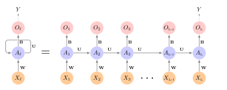
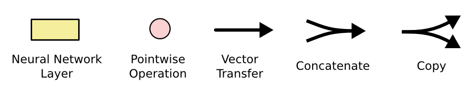
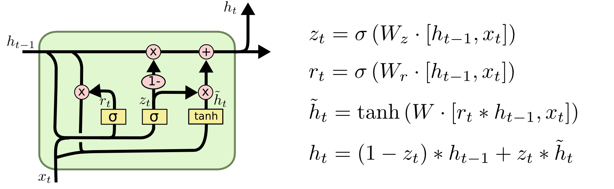
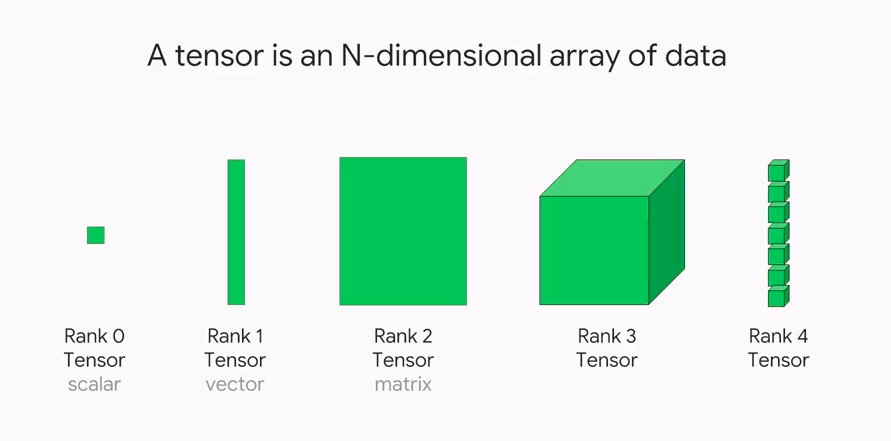
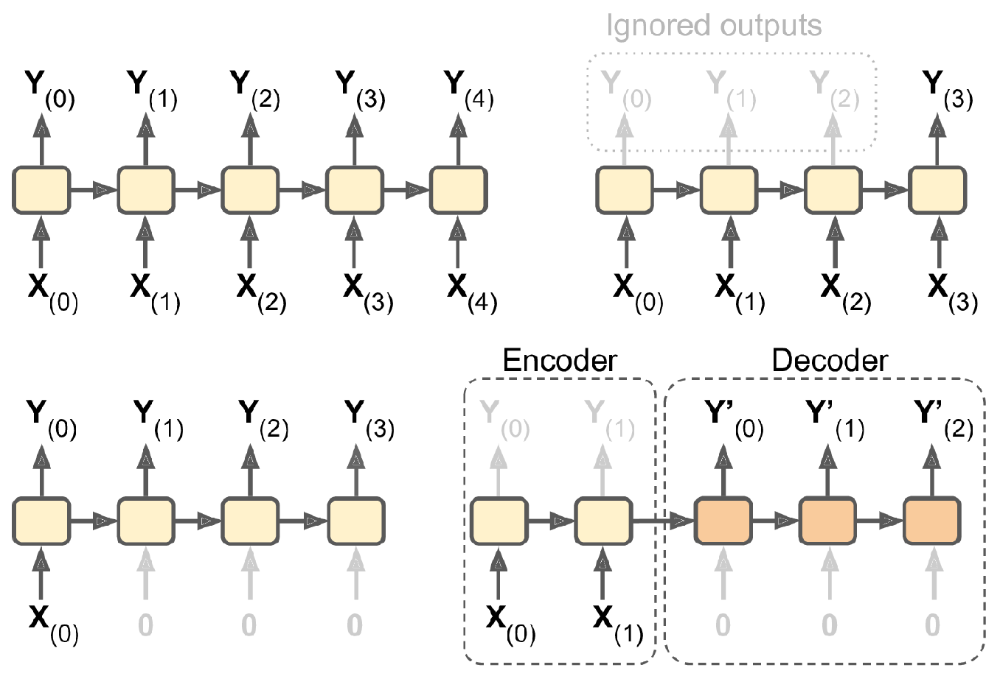
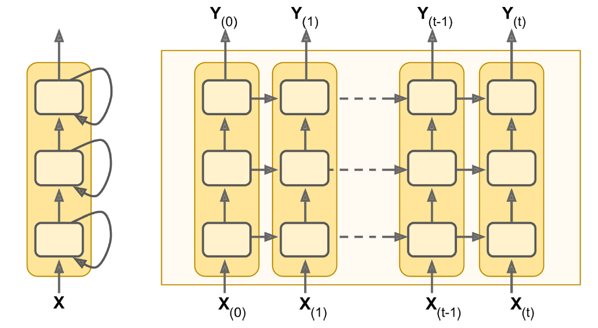

```{python}
#| echo: false
#| warning: false
from dotenv import find_dotenv, load_dotenv
assert load_dotenv(find_dotenv(usecwd=False)), "The .env file was not loaded."

import matplotlib

import cycler

# colors = ["#91CCCC", "#FF8FA9", "#CC91BC", "#3F9999", "#A5FFB8"]
# colors += ["#4682B4", "#D2691E", "#808080"]
# matplotlib.pyplot.rcParams["axes.prop_cycle"] = cycler.cycler(color=colors)


def set_square_figures():
    matplotlib.pyplot.rcParams["figure.figsize"] = (2.0, 2.0)
    # matplotlib.pyplot.rcParams['figure.figsize'] = (5.0, 3.0)
    # matplotlib.pyplot.rcParams['figure.dpi'] = 350


def set_rectangular_figures():
    matplotlib.pyplot.rcParams["figure.figsize"] = (5.0, 2.0)


set_rectangular_figures()
matplotlib.pyplot.rcParams["figure.dpi"] = 350
matplotlib.pyplot.rcParams["savefig.bbox"] = "tight"
matplotlib.pyplot.rcParams["font.family"] = "serif"

matplotlib.pyplot.rcParams["axes.spines.right"] = False
matplotlib.pyplot.rcParams["axes.spines.top"] = False


def square_fig():
    return matplotlib.pyplot.figure(figsize=(2, 2), dpi=350).gca()


def add_diagonal_line():
    xl = matplotlib.pyplot.xlim()
    yl = matplotlib.pyplot.ylim()

    min_left = min(xl[0], yl[0])
    max_right = max(xl[1], yl[1])
    matplotlib.pyplot.plot(
        [min_left, max_right], [min_left, max_right], color="black", linestyle="--"
    )
    matplotlib.pyplot.xlim([min_left, max_right])
    matplotlib.pyplot.ylim([min_left, max_right])


import pandas

pandas.options.display.max_rows = 6

import numpy

numpy.set_printoptions(precision=2)
numpy.random.seed(123)

# import keras as keras
import keras

keras.utils.set_random_seed(1)
```

::: {.content-visible unless-format="revealjs"}

```{python}
#| code-fold: true
#| code-summary: Show the package imports
import random
from pathlib import Path

import matplotlib.pyplot as plt
import numpy as np
import pandas as pd

from sklearn.linear_model import LinearRegression
from sklearn.metrics import mean_squared_error

from keras.models import Sequential
from keras.layers import Dense, Input, Rescaling
from keras.callbacks import EarlyStopping
```

:::

# Time Series {visibility="uncounted"}

## Tabular data vs time series data

::: columns
::: column

**Tabular data**

We have a dataset $\{ \boldsymbol{x}_i, y_i \}_{i=1}^n$ which we assume are i.i.d. observations.

| Brand    | Mileage  | # Claims |
|:--------:|:--------:|:--------:|
| BMW      | 101 km   | 1        |
| Audi     | 432 km   | 0        |
| Volvo    | 3 km     | 5        |
| $\vdots$ | $\vdots$ | $\vdots$ |

The goal is to _predict_ the $y$ for some covariates $\boldsymbol{x}$.
:::
::: column
**Time series data**

Have a sequence $\{ \boldsymbol{x}_t, y_t \}_{t=1}^T$ of observations taken at regular time intervals.

| Date  | Humidity | Temp. | 
|:-----:|:--------:|:-----:|
| Jan 1 | 60%      | 20 °C |
| Jan 2 | 65%      | 22 °C | 
| Jan 3 | 70%      | 21 °C |
| $\vdots$ | $\vdots$ | $\vdots$ |


The task is to _forecast_ future values based on the past.

:::
:::

## Attributes of time series data

- **Temporal ordering**: The order of the observations matters.
- **Trend**: The general direction of the data.
- **Noise**: Random fluctuations in the data.
- **Seasonality**: Patterns that repeat at regular intervals.

<!-- - **Autocorrelation**: The correlation of a signal with a delayed copy of itself. -->

::: {.callout-note}
Question: What will be the temperature in Berlin tomorrow?
What information would you use to make a prediction?
:::

## Australian financial stocks {.smaller}

```python
# First, install yfinance if you haven't already:
# pip install yfinance
import yfinance as yf
import pandas as pd
from datetime import date

# 1. Define the ASX tickers (Yahoo uses “.AX” for Australian stocks
#    and “^AXJO” for the S&P/ASX 200 index)
tickers = {
    "ANZ":    "ANZ.AX",
    "BOQ":    "BOQ.AX",
    "CBA":    "CBA.AX",
    "NAB":    "NAB.AX",
    "QBE":    "QBE.AX",
    "SUN":    "SUN.AX",
    "WBC":    "WBC.AX",
    "ASX200": "^AXJO"
}

# 2. Choose your date range
start = "1999-01-01"
end   = date.today().isoformat()  # e.g. "2025-06-29"

# 3. Download the data
#    This returns a Panel-like DataFrame: columns are tickers, rows are trading dates.
raw_data = yf.download(
    tickers=list(tickers.values()),
    start=start,
    end=end,
    progress=False
)

raw_data.to_csv("asx_raw_data.csv")  # Optional: Save raw data for inspection

data = raw_data["Close"]

# 4. Rename columns to the simple names
data.rename(columns={v: k for k, v in tickers.items()}, inplace=True)

cols = ["ANZ", "ASX200", "BOQ", "CBA", "NAB", "QBE", "SUN", "WBC"]
data = data[cols]

# 5. (Optional) Inspect the first few rows
print(data.head())

# 6. Save to CSV
output_path = "asx_daily_close_prices.csv"
data.to_csv(output_path)
print(f"Saved daily close prices to {output_path}")
```

## Australian financial stocks {.smaller}

```{python}
stocks = pd.read_csv("aus_fin_stocks.csv")
stocks
```

## Plot

```{python}
stocks.plot()
```

## Data types and NA values

::: columns
::: column
```{python}
stocks.info()
```
:::
::: column
```{python}
for col in stocks.columns:
    print(f"{col}: {stocks[col].isna().sum()}")
```
:::
:::

```{python}
asx200 = stocks.pop("ASX200")
```

## Set the index to the date {.smaller}

```{python}
stocks["Date"] = pd.to_datetime(stocks["Date"])
stocks = stocks.set_index("Date") # or `stocks.set_index("Date", inplace=True)`
stocks
```

## Plot II
```{python}
stocks.plot()
plt.ylabel("Stock Price ($)")
plt.legend(loc="upper center", bbox_to_anchor=(0.5, -0.5), ncol=4);
```

## Can index using dates I {.smaller}

```{python}
stocks.loc["2010-1-4":"2010-01-8"]
```

::: {.fragment}
Note, these ranges are _inclusive_, not like Python's normal slicing.
:::

## Can index using dates II

So to get 2019's December and all of 2020 for CBA:
```{python}
stocks.loc["2019-12":"2020", ["CBA"]]
```

## Can look at the first differences

```{python}
stocks.diff().plot()
plt.ylabel("Daily Price Changes ($)")
plt.legend(loc="upper center", bbox_to_anchor=(0.5, -0.5), ncol=4);
```

## Can look at the percentage changes

```{python}
stocks.pct_change().plot()
plt.ylabel("Daily Returns (%)")
plt.legend(loc="upper center", bbox_to_anchor=(0.5, -0.5), ncol=4);
```

## Focus on one stock

::: columns
::: column
```{python}
stock = stocks[["CBA"]].copy()
stock
```
:::
::: column
```{python}
stock.plot()
plt.ylabel("Stock Price ($)");
```

```{python}
stock.isna().sum()
```
:::
:::

## Convert to log returns

Instead of working with raw prices, we'll work with daily log returns:

::: columns
::: column
```{python}
# Calculate log returns
stock_log = np.log(stock / stock.shift(1)).dropna()
stock_log.head()
```
:::
::: column

```{python}
#| code-fold: true
stock_log.plot()
plt.ylabel("Daily Log Return")
plt.title("CBA Daily Log Returns");
```

```{python}
#| code-fold: true
# Distribution of log returns
stock_log.hist(bins=50, alpha=0.7)
plt.xlabel("Daily Log Return")
plt.ylabel("Frequency")
plt.title("Distribution of CBA Daily Log Returns");
```
:::
:::

## Fill in the missing values

```{python}
asx200 = pd.DataFrame(asx200).set_index(stocks.index)
missing_day = asx200.index[asx200["ASX200"].isna()][1]
prev_day = missing_day - pd.Timedelta(days=1)
after = missing_day + pd.Timedelta(days=3)
```

::: columns
::: column
```{python}
asx200.loc[prev_day:after]
```
:::
::: column
```{python}
asx200 = asx200.ffill()
asx200.loc[prev_day:after]
```
:::
:::

# Baseline forecasts

## Helper functions

```{python}
def log_to_price(log_returns, initial_price):
    """Convert log returns to raw prices given an initial price."""
    # Use cumulative sum of log returns for numerical stability
    # P_t = P_0 * exp(sum of log returns from 1 to t)
    cumulative_log_returns = log_returns.cumsum()
    prices = initial_price * np.exp(cumulative_log_returns)
    
    return prices

def get_last_price(stock_df, cutoff_date):
    """Get the last known price before the forecast period starts."""
    last_known_date = stock_df.loc[:cutoff_date].index[-1]
    return stock_df.loc[last_known_date, "CBA"]
```

## Persistence forecast

Predict the next value to be the same as the current value.

```{python}
last_price = get_last_price(stock, cutoff_date="2024-12")
log_persistence = pd.Series(0.0, index=stock_log.loc["2025":].index)
persistence_prices = log_to_price(log_persistence, last_price)
```

```{python}
#| code-fold: true
start = "2024-12"
end = "2025"
stock.loc[start:end, ["CBA"]].plot(label="CBA")
persistence_prices.plot(label="Persistence")
plt.axvline("2025-01", color="black", linestyle="--")
plt.ylabel("Stock Price ($)")
plt.legend()
```

## Extrapolate the trend

```{python}
recent_log_returns = stock_log.loc["2022-01":"2024-12"]
trend_log = recent_log_returns.mean().values[0]
print(f"Average daily log return: {trend_log:.6f}")
```

```{python}
log_trend = pd.Series(trend_log, index=stock_log.loc["2025":].index)
trend_prices = log_to_price(log_trend, last_price)
```

```{python}
#| code-fold: true
# Plot the trend line over the top of the 'recent_log_returns' data
recent_log_returns.plot()
plt.axhline(trend_log, color="red", linestyle="--", label="Trend (mean log return)")
plt.ylabel("Daily Log Return");
```

## Trend fitted

```{python}
# Create trend forecast for the recent period to show fitted trend
recent_trend_log = pd.Series(trend_log, index=recent_log_returns.index)
trend_start_price = get_last_price(stock, cutoff_date=recent_log_returns.index[0].strftime('%Y-%m-%d'))
recent_trend_prices = log_to_price(recent_trend_log, trend_start_price)
```

```{python}
#| code-fold: true
stock.loc[recent_log_returns.index, ["CBA"]].plot(label="CBA")
recent_trend_prices.plot(label="Trend")
plt.axvline(recent_log_returns.index[0], color="gray", linestyle=":", linewidth=1)
plt.axvline(recent_log_returns.index[-1], color="gray", linestyle=":", linewidth=1)
plt.ylabel("Stock Price ($)")
plt.legend();
```

## Trend forecasts

```{python}
#| code-fold: true
stock.loc[start:end, ["CBA"]].plot(label="CBA")
persistence_prices.loc[start:end].plot(label="Persistence")
trend_prices.loc[start:end].plot(label="Trend")
plt.axvline("2025-01", color="black", linestyle="--")
plt.ylabel("Stock Price ($)")
plt.legend(ncol=3, loc="upper center", bbox_to_anchor=(0.5, 1.3));
```

## Which is better?

If we look at the mean squared error (MSE) of the two models:

```{python}
# Calculate MSE using the actual forecasts we computed
actual_prices = stock.loc["2025":, "CBA"]
persistence_mse = mean_squared_error(actual_prices, persistence_prices)
trend_mse = mean_squared_error(actual_prices, trend_prices)
persistence_mse, trend_mse
```

## Use the history

::: {.content-visible unless-format="revealjs"}
Now let's work with log returns instead of raw prices to create lagged features:
:::

```{python}
cba_log_shifted = stock_log["CBA"].head().shift(1)
both = pd.concat([stock_log["CBA"].head(), cba_log_shifted], axis=1, keys=["Today", "Yesterday"])
both
```

```{python}
def lagged_timeseries(df, target, window=40):
    lagged = pd.DataFrame()
    for i in range(window, 0, -1):
        lagged[f"T-{i}"] = df[target].shift(i)
    lagged["T"] = df[target].values
    return lagged
```

## Lagged time series {.smaller}

```{python}
#| echo: false
pandas.options.display.max_rows = 4
```

```{python}
df_lags = lagged_timeseries(stock_log, "CBA", 40)
df_lags
```

```{python}
#| echo: false
pandas.options.display.max_rows = 6
```

## Split into training and testing

```{python}
# Split the data in time
X_train = df_lags.loc[:"2021"]
X_val = df_lags.loc["2022-01":"2024-12"]  # 2022-2024
X_test = df_lags.loc["2025":]  # 2025

# Remove any with NAs and split into X and y
X_train = X_train.dropna()
X_val = X_val.dropna()
X_test = X_test.dropna()

y_train = X_train.pop("T")
y_val = X_val.pop("T")
y_test = X_test.pop("T")
```

```{python}
X_train.shape, y_train.shape, X_val.shape, y_val.shape, X_test.shape, y_test.shape
```

## Inspect the split data {.smaller}

```{python}
X_train
```

## Plot the split

```{python}
#| code-fold: true
y_train.plot()
y_val.plot()
y_test.plot()
plt.ylabel("Daily Log Return")
plt.legend(["Train", "Validation", "Test"], loc="center left", bbox_to_anchor=(1, 0.5));
```

<!--
## Train on more recent data

```python
X_train = X_train.loc["2012":]
y_train = y_train.loc["2012":]
```

```python
#| code-fold: true
y_train.plot()
y_val.plot()
y_test.plot()
plt.ylabel("Daily Log Return")
plt.legend(["Train", "Validation", "Test"], loc="center left", bbox_to_anchor=(1, 0.5));
```
-->

## Fit a linear model

```{python}
lr = LinearRegression()
lr.fit(X_train, y_train);
```

Make a forecast for the test data:

```{python}
y_pred = lr.predict(X_test)
```

## Plot predictions in log return space

```{python}
#| code-fold: true
log_forecasts_df = pd.DataFrame({
    "Actual": y_test,
    "Linear": y_pred
}, index=y_test.index)

log_forecasts_df.plot()
plt.ylabel("Daily Log Return")
plt.legend(loc="center left", bbox_to_anchor=(1, 0.5))
```

## Convert to raw prices and plot

```{python}
linear_log_forecasts = pd.Series(y_pred, index=y_test.index)
prev_price = stock.shift(1).loc["2025", "CBA"]
linear_price_forecasts = prev_price * np.exp(linear_log_forecasts)
```

```{python}
#| code-fold: true
stock.loc[start:end, ["CBA"]].plot(label="CBA")
persistence_prices.reindex(stock.loc[start:end].index).plot(label="Persistence")
trend_prices.reindex(stock.loc[start:end].index).plot(label="Trend")
linear_price_forecasts.reindex(stock.loc[start:end].index).plot(label="Linear")
plt.axvline("2025-01", color="black", linestyle="--")
plt.ylabel("Stock Price ($)")
plt.legend(loc="center left", bbox_to_anchor=(1, 0.5));
```

## Distribution of log return predictions

```{python}
#| code-fold: true
fig, (ax1, ax2) = plt.subplots(1, 2, figsize=(10, 3))

# Actual log returns
y_val.hist(bins=30, alpha=0.7, ax=ax1, label="Actual")
ax1.set_xlabel("Daily Log Return")
ax1.set_ylabel("Frequency")
ax1.set_title("Actual Log Returns")

# Predicted log returns
pd.Series(y_pred).hist(bins=30, alpha=0.7, ax=ax2, label="Predicted", color="orange")
ax2.set_xlabel("Daily Log Return")
ax2.set_ylabel("Frequency")
ax2.set_title("Predicted Log Returns")

plt.tight_layout()
```

```{python}
# Calculate MSE on raw prices using explicit forecast calculation
test_actual_prices = stock.loc["2025":, "CBA"]
test_linear_prices = linear_price_forecasts.loc["2025":]
linear_mse = mean_squared_error(test_actual_prices, test_linear_prices)
linear_mse
```

```{python}
persistence_mse, trend_mse, linear_mse
```

# Multi-step forecasts

## Comparing apples to apples {.smaller}

The linear model is only producing _one-step-ahead_ forecasts.

The other models are producing _multi-step-ahead_ forecasts.

```{python}
shifted_forecast = stock["CBA"].shift(1).loc["2025":]
```

```{python}
#| code-fold: true
stock.loc[start:end, ["CBA"]].plot(label="CBA")
linear_price_forecasts.reindex(stock.loc[start:end].index).plot(label="Linear")
shifted_forecast.reindex(stock.loc[start:end].index).plot(label="Shifted")
plt.axvline("2025-01", color="black", linestyle="--")
plt.ylabel("Stock Price ($)")
plt.legend(loc="center left", bbox_to_anchor=(1, 0.5));
```

```{python}
shifted_mse = mean_squared_error(stock.loc["2025":, "CBA"], shifted_forecast)
persistence_mse, trend_mse, linear_mse, shifted_mse
```

## Autoregressive forecasts

The linear model needs the last 90 days to make a forecast.

**Idea**: Make the first forecast, then use that to make the next forecast, and so on.

$$
\begin{aligned}
    \hat{y}_t &= \beta_0 + \beta_1 y_{t-1} + \beta_2 y_{t-2} + \ldots + \beta_n y_{t-n} \\
    \hat{y}_{t+1} &= \beta_0 + \beta_1 \hat{y}_t + \beta_2 y_{t-1} + \ldots + \beta_n y_{t-n+1} \\
    \hat{y}_{t+2} &= \beta_0 + \beta_1 \hat{y}_{t+1} + \beta_2 \hat{y}_t + \ldots + \beta_n y_{t-n+2}
\end{aligned}
$$
$$\vdots$$
$$
\hat{y}_{t+k} = \beta_0 + \beta_1 \hat{y}_{t+k-1} + \beta_2 \hat{y}_{t+k-2} + \ldots + \beta_n \hat{y}_{t+k-n}
$$

## Autoregressive forecasting function
```{python}
def autoregressive_forecast(model, X_val, suppress=False):
    """
    Generate a multi-step forecast using the given model.
    """
    multi_step = pd.Series(index=X_val.index, name="Multi Step")

    # Initialize the input data for forecasting
    input_data = X_val.iloc[0].values.reshape(1, -1)

    for i in range(len(multi_step)):
        # Ensure input_data has the correct feature names
        input_df = pd.DataFrame(input_data, columns=X_val.columns)
        if suppress:
            next_value = model.predict(input_df, verbose=0)
        else:
            next_value = model.predict(input_df) 

        multi_step.iloc[i] = next_value

        # Append that prediction to the input for the next forecast
        if i + 1 < len(multi_step):
            input_data = np.append(input_data[:, 1:], next_value).reshape(1, -1)

    return multi_step
```

## Look at the autoregressive linear forecasts

```{python}
lr_forecast = autoregressive_forecast(lr, X_test)
lr_multi_step_prices = log_to_price(lr_forecast, last_price)
```

```{python}
#| code-fold: true
stock.loc[start:end, ["CBA"]].plot(label="CBA")
persistence_prices.reindex(stock.loc[start:end].index).plot(label="Persistence")
trend_prices.reindex(stock.loc[start:end].index).plot(label="Trend")
lr_multi_step_prices.reindex(stock.loc[start:end].index).plot(label="MS Linear")
plt.axvline("2025-01", color="black", linestyle="--")
plt.ylabel("Stock Price ($)")
plt.legend(loc="center left", bbox_to_anchor=(1, 0.5));
```

## Compare log return forecasts

```{python}
#| code-fold: true
log_forecasts_multistep = pd.DataFrame({
    "Actual": y_test,
    "One-step Linear": y_pred,
    "Multi-step Linear": lr_forecast
}, index=y_test.index)

log_forecasts_multistep.plot()
plt.ylabel("Daily Log Return")
plt.legend(loc="center left", bbox_to_anchor=(1, 0.5))
```

## Metrics

One-step-ahead forecasts:

```{python}
linear_mse, shifted_mse
```

Multi-step-ahead forecasts:

```{python}
multi_step_linear_mse = mean_squared_error(stock.loc["2025":, "CBA"], lr_multi_step_prices.loc["2025":])
persistence_mse, trend_mse, multi_step_linear_mse
```

## Prefer only short windows

```{python}
#| code-fold: true
stock.loc["2025-01":"2025-01", ["CBA"]].plot(label="CBA")
persistence_prices.loc["2025-01":"2025-01"].plot(label="Persistence")
trend_prices.loc["2025-01":"2025-01"].plot(label="Trend")
lr_multi_step_prices.loc["2025-01":"2025-01"].plot(label="MS Linear")
plt.ylabel("Stock Price ($)")
plt.legend(loc="center left", bbox_to_anchor=(1, 0.5));
```

> "It's tough to make predictions, especially about the future."

::: footer
Yogi Berra
:::

# Neural network forecasts

## Simple feedforward neural network

```{python}
model = Sequential([
        Rescaling(1/0.02),
        Dense(32, activation="leaky_relu"),
        Dense(1)])  # Linear activation for log returns
model.compile(optimizer="adam", loss="mean_absolute_error")
```

```{python}
if Path("aus_fin_fnn_model.keras").exists():
    model = keras.models.load_model("aus_fin_fnn_model.keras")
else:
    es = EarlyStopping(patience=15, restore_best_weights=True)
    model.fit(X_train, y_train, validation_data=(X_val, y_val), epochs=500,
        callbacks=[es], verbose=0)
    model.save("aus_fin_fnn_model.keras")

model.summary()
```

## Forecast and plot

```{python}
y_pred = model.predict(X_test, verbose=0)
```

```{python}
#| code-fold: true
# Show log return predictions
log_forecasts_nn = pd.DataFrame({
    "Actual": y_test,
    "Linear": lr.predict(X_test),
    "FNN": y_pred.flatten()
}, index=y_test.index)

log_forecasts_nn.plot()
plt.ylabel("Daily Log Return")
plt.legend(loc="center left", bbox_to_anchor=(1, 0.5))
```

## Plot forecasts in raw price space

```{python}
fnn_log_forecasts = pd.Series(y_pred.flatten(), index=y_test.index)
fnn_price_forecasts = prev_price * np.exp(fnn_log_forecasts)
```

```{python}
#| code-fold: true
stock.loc[start:end, ["CBA"]].plot(label="CBA")
linear_price_forecasts.reindex(stock.loc[start:end].index).plot(label="Linear")
fnn_price_forecasts.reindex(stock.loc[start:end].index).plot(label="FNN")
plt.axvline("2025-01", color="black", linestyle="--")
plt.ylabel("Stock Price ($)")
plt.legend(loc="center left", bbox_to_anchor=(1, 0.5));
```

## Distribution of log return predictions

```{python}
#| code-fold: true
fig, (ax1, ax2) = plt.subplots(1, 2, figsize=(10, 3))

# Actual log returns
y_test.hist(bins=30, alpha=0.7, ax=ax1, label="Actual")
ax1.set_xlabel("Daily Log Return")
ax1.set_ylabel("Frequency")
ax1.set_title("Actual Log Returns")

# Predicted log returns
pd.Series(y_pred.flatten()).hist(bins=30, alpha=0.7, ax=ax2, label="Predicted", color="orange")
ax2.set_xlabel("Daily Log Return")
ax2.set_ylabel("Frequency")
ax2.set_title("Predicted Log Returns")

plt.tight_layout()
```

## Autoregressive forecasts

```{python}
fnn_forecast = autoregressive_forecast(model, X_test, True)
fnn_multi_step_prices = log_to_price(fnn_forecast, last_price)
```

```{python}
#| code-fold: true
stock.loc[start:end, ["CBA"]].plot(label="CBA")
persistence_prices.reindex(stock.loc[start:end].index).plot(label="Persistence")
trend_prices.reindex(stock.loc[start:end].index).plot(label="Trend")
lr_multi_step_prices.reindex(stock.loc[start:end].index).plot(label="MS Linear")
fnn_multi_step_prices.reindex(stock.loc[start:end].index).plot(label="MS FNN")
plt.axvline("2025-01", color="black", linestyle="--")
plt.ylabel("Stock Price ($)")
plt.legend(loc="center left", bbox_to_anchor=(1, 0.5));
```

## Compare multi-step log return forecasts

```{python}
#| code-fold: true
log_forecasts_multistep_nn = pd.DataFrame({
    "Actual": y_test,
    "Multi-step Linear": lr_forecast,
    "Multi-step FNN": fnn_forecast
}, index=y_test.index)

log_forecasts_multistep_nn.plot()
plt.ylabel("Daily Log Return")
plt.legend(loc="center left", bbox_to_anchor=(1, 0.5));
```

## Metrics

One-step-ahead forecasts (MSE on raw prices):

```{python}
nn_mse = mean_squared_error(stock.loc["2025":, "CBA"], fnn_price_forecasts.loc["2025":])
linear_mse, nn_mse
```

Multi-step-ahead forecasts (MSE on raw prices):

```{python}
multi_step_fnn_mse = mean_squared_error(stock.loc["2025":, "CBA"], fnn_multi_step_prices.loc["2025":])
persistence_mse, trend_mse, multi_step_linear_mse, multi_step_fnn_mse
```

# Recurrent Neural Networks {visibility="uncounted"}

## Basic facts of RNNs

- A recurrent neural network is a type of neural network that is designed to process sequences of data (e.g. time series, sentences).
- A recurrent neural network is any network that contains a recurrent layer.
- A recurrent layer is a layer that processes data in a sequence.
- An RNN can have one or more recurrent layers.
- Weights are shared over time; this allows the model to be used on arbitrary-length sequences.

## Applications

- Forecasting: revenue forecast, weather forecast, predict disease rate from medical history, etc. 
- Classification: given a time series of the activities of a visitor on a website, classify whether the visitor is a bot or a human.
- Event detection: given a continuous data stream, identify the occurrence of a specific event. Example: Detect utterances like "Hey Alexa" from an audio stream.
- Anomaly detection: given a continuous data stream, detect anything unusual happening. Example: Detect unusual activity on the corporate network.

## Origin of the name of RNNs

> A recurrence relation is an equation that expresses each element of a sequence as a function of the preceding ones. More precisely, in the case where only the immediately preceding element is involved, a recurrence relation has the form
> 
> $$ u_n = \psi(n, u_{n-1}) \quad \text{ for } \quad n > 0.$$

__Example__: Factorial $n! = n (n-1)!$ for $n > 0$ given $0! = 1$.

::: footer
Source: Wikipedia, [Recurrence relation](https://en.wikipedia.org/wiki/Recurrence_relation#Definition). 
:::

<!-- 
# Recurrent Cells {visibility="uncounted"}
-->

## Diagram of an RNN cell

The RNN processes each data in the sequence one by one, while keeping memory of what came before.

::: {.content-visible unless-format="revealjs"}
The following figure shows how the recurrent neural network combines an input `X_l` with a preprocessed state of the process `A_l` to produce the output `O_l`. RNNs have a cyclic information processing structure that enables them to pass information sequentially from previous inputs. RNNs can capture dependencies and patterns in sequential data, making them useful for analysing time series data.
:::



::: footer
Source: James et al (2022), [An Introduction to Statistical Learning](https://www.statlearning.com/), 2nd edition, Figure 10.12.
:::

## A SimpleRNN cell


All the outputs before the final one are often discarded.

::: footer
Source: Christopher Olah (2015), [Understanding LSTM Networks](http://colah.github.io/posts/2015-08-Understanding-LSTMs), Colah's Blog.
:::

## LSTM internals

::: {.content-visible unless-format="revealjs"}
Simple RNN structures encounter vanishing gradient problems, hence, struggle with learning long term dependencies. LSTM are designed to overcome this problem. LSTMs have a more complex network structure (contains more memory cells and gating mechanisms) and can better regulate the information flow. 
:::




::: footer
Source: Christopher Olah (2015), [Understanding LSTM Networks](http://colah.github.io/posts/2015-08-Understanding-LSTMs), Colah's Blog.
:::

## GRU internals

::: {.content-visible unless-format="revealjs"}
GRUs are simpler compared to LSTM, hence, computationally more efficient than LSTMs. 
:::



::: footer
Source: Christopher Olah (2015), [Understanding LSTM Networks](http://colah.github.io/posts/2015-08-Understanding-LSTMs), Colah's Blog.
:::

# Stock prediction with recurrent networks {visibility="uncounted"}

## SimpleRNN

```{python}
from keras.layers import SimpleRNN, Reshape
model = Sequential([
        Rescaling(1/0.02),
        Reshape((-1, 1)),
        SimpleRNN(64, activation="tanh"),
        Dense(1)])  # Linear activation for log returns
model.compile(optimizer="adam", loss="mean_absolute_error")
```

```{python}
#| eval: false
es = EarlyStopping(patience=15, restore_best_weights=True)
model.fit(X_train, y_train, validation_data=(X_val, y_val),
    epochs=500, callbacks=[es], verbose=0)
model.summary()
```

```{python}
#| echo: false
if Path("aus_fin_simplernn_model.keras").exists():
    model = keras.models.load_model("aus_fin_simplernn_model.keras")
else:
    es = EarlyStopping(patience=15, restore_best_weights=True)
    model.fit(X_train, y_train, validation_data=(X_val, y_val),
        epochs=500, callbacks=[es], verbose=0)
    model.save("aus_fin_simplernn_model.keras")
model.summary()
```

## Forecast and plot

```{python}
y_pred = model.predict(X_test.to_numpy(), verbose=0)
```

```{python}
#| code-fold: true
# Show log return predictions
log_forecasts_rnn = pd.DataFrame({
    "Actual": y_test,
    "FNN": fnn_forecast.values[:len(y_test)],  # Use the FNN forecast from previous section
    "SimpleRNN": y_pred.flatten()
}, index=y_test.index)

log_forecasts_rnn.plot()
plt.ylabel("Daily Log Return")
plt.legend(loc="center left", bbox_to_anchor=(1, 0.5))
```

## Plot forecasts in raw price space

```{python}
rnn_log_forecasts = pd.Series(y_pred.flatten(), index=y_test.index)
rnn_price_forecasts = prev_price * np.exp(rnn_log_forecasts)
```

```{python}
#| code-fold: true
stock.loc[start:end, ["CBA"]].plot(label="CBA")
linear_price_forecasts.reindex(stock.loc[start:end].index).plot(label="Linear")
fnn_price_forecasts.reindex(stock.loc[start:end].index).plot(label="FNN")
rnn_price_forecasts.reindex(stock.loc[start:end].index).plot(label="SimpleRNN")
plt.axvline("2025-01", color="black", linestyle="--")
plt.ylabel("Stock Price ($)")
plt.legend(loc="center left", bbox_to_anchor=(1, 0.5));
```

## Multi-step forecasts

```{python}
rnn_forecast = autoregressive_forecast(model, X_test, True)
rnn_multi_step_prices = log_to_price(rnn_forecast, last_price)
```

```{python}
#| code-fold: true
stock.loc[start:end, ["CBA"]].plot(label="CBA")
persistence_prices.reindex(stock.loc[start:end].index).plot(label="Persistence")
trend_prices.reindex(stock.loc[start:end].index).plot(label="Trend")
lr_multi_step_prices.reindex(stock.loc[start:end].index).plot(label="MS Linear")
fnn_multi_step_prices.reindex(stock.loc[start:end].index).plot(label="MS FNN")
rnn_multi_step_prices.reindex(stock.loc[start:end].index).plot(label="MS RNN")
plt.axvline("2025-01", color="black", linestyle="--")
plt.ylabel("Stock Price ($)")
plt.legend(loc="center left", bbox_to_anchor=(1, 0.5));
```

## Metrics

One-step-ahead forecasts (MSE on raw prices):

```{python}
rnn_mse = mean_squared_error(stock.loc["2025":, "CBA"], rnn_price_forecasts.loc["2025":])
linear_mse, nn_mse, rnn_mse
```

Multi-step-ahead forecasts (MSE on raw prices):

```{python}
multi_step_rnn_mse = mean_squared_error(stock.loc["2025":, "CBA"], rnn_multi_step_prices.loc["2025":])
persistence_mse, trend_mse, multi_step_linear_mse, multi_step_fnn_mse, multi_step_rnn_mse
```

## GRU

```{python}
from keras.layers import GRU

model = Sequential([
        Rescaling(1/0.02),
        Reshape((-1, 1)),
        GRU(16, activation="tanh"),
        Dense(1)])  # Linear activation for log returns
model.compile(optimizer="adam", loss="mean_absolute_error")
```

```{python}
#| eval: false
es = EarlyStopping(patience=15, restore_best_weights=True)
model.fit(X_train, y_train, validation_data=(X_val, y_val),
    epochs=500, callbacks=[es], verbose=0)
model.summary()
```

```{python}
#| echo: false
if Path("aus_fin_gru_model.keras").exists():
    model = keras.models.load_model("aus_fin_gru_model.keras")
else:
    es = EarlyStopping(patience=15, restore_best_weights=True)
    model.fit(X_train, y_train, validation_data=(X_val, y_val),
        epochs=500, callbacks=[es], verbose=0)
    model.save("aus_fin_gru_model.keras")
model.summary()
```

## Forecast and plot

```{python}
y_pred = model.predict(X_test, verbose=0)
```

```{python}
#| code-fold: true
# Show log return predictions
log_forecasts_gru = pd.DataFrame({
    "Actual": y_test,
    "SimpleRNN": rnn_forecast.values[:len(y_test)],  # Use the RNN forecast from previous section
    "GRU": y_pred.flatten()
}, index=y_test.index)

log_forecasts_gru.plot()
plt.ylabel("Daily Log Return")
plt.legend(loc="center left", bbox_to_anchor=(1, 0.5))
```

## Plot forecasts in raw price space

```{python}
gru_log_forecasts = pd.Series(y_pred.flatten(), index=y_test.index)
gru_price_forecasts = prev_price * np.exp(gru_log_forecasts)
```

```{python}
#| code-fold: true
stock.loc[start:end, ["CBA"]].plot(label="CBA")
linear_price_forecasts.reindex(stock.loc[start:end].index).plot(label="Linear")
fnn_price_forecasts.reindex(stock.loc[start:end].index).plot(label="FNN")
rnn_price_forecasts.reindex(stock.loc[start:end].index).plot(label="SimpleRNN")
gru_price_forecasts.reindex(stock.loc[start:end].index).plot(label="GRU")
plt.axvline("2025-01", color="black", linestyle="--")
plt.ylabel("Stock Price ($)")
plt.legend(loc="center left", bbox_to_anchor=(1, 0.5));
```

## Multi-step forecasts

```{python}
gru_forecast = autoregressive_forecast(model, X_test, True)
gru_multi_step_prices = log_to_price(gru_forecast, last_price)
```

```{python}
#| code-fold: true
stock.loc[start:end, ["CBA"]].plot(label="CBA")
persistence_prices.reindex(stock.loc[start:end].index).plot(label="Persistence")
trend_prices.reindex(stock.loc[start:end].index).plot(label="Trend")
lr_multi_step_prices.reindex(stock.loc[start:end].index).plot(label="MS Linear")
fnn_multi_step_prices.reindex(stock.loc[start:end].index).plot(label="MS FNN")
rnn_multi_step_prices.reindex(stock.loc[start:end].index).plot(label="MS RNN")
gru_multi_step_prices.reindex(stock.loc[start:end].index).plot(label="MS GRU")
plt.axvline("2025-01", color="black", linestyle="--")
plt.ylabel("Stock Price ($)")
plt.legend(loc="center left", bbox_to_anchor=(1, 0.5));
```

## All multi-step log return forecasts

```{python}
#| code-fold: true
log_forecasts_all = pd.DataFrame({
    "Actual": y_test,
    "Linear": lr_forecast,
    "FNN": fnn_forecast,
    "SimpleRNN": rnn_forecast,
    "GRU": gru_forecast
}, index=y_test.index)

log_forecasts_all.plot()
plt.ylabel("Daily Log Return")
plt.legend(loc="center left", bbox_to_anchor=(1, 0.5))
```

## Metrics

One-step-ahead forecasts (MSE on raw prices):

```{python}
gru_mse = mean_squared_error(stock.loc["2025":, "CBA"], gru_price_forecasts.loc["2025":])
linear_mse, nn_mse, rnn_mse, gru_mse
```

Multi-step-ahead forecasts (MSE on raw prices):

```{python}
multi_step_gru_mse = mean_squared_error(stock.loc["2025":, "CBA"], gru_multi_step_prices.loc["2025":])
persistence_mse, trend_mse, multi_step_linear_mse, multi_step_fnn_mse, multi_step_rnn_mse, multi_step_gru_mse
```

## Summary of all model performance

::: columns
::: column

**One-step forecasts**

```{python}
#| echo: false
model_summary = pd.DataFrame({"MSE": [shifted_mse, linear_mse, nn_mse, rnn_mse, gru_mse]}, index=["Shifted", "Linear", "FNN", "SimpleRNN", "GRU"])

model_summary
```

:::
::: column
**Multi-step forecasts**

```{python}
#| echo: false
model_summary = pd.DataFrame({"MSE": [persistence_mse, trend_mse,
multi_step_linear_mse, multi_step_fnn_mse, multi_step_rnn_mse, multi_step_gru_mse]}, index=["Persistence", "Trend", "Linear", "FNN", "SimpleRNN", "GRU"])

model_summary
```
:::
:::


# Internals of the SimpleRNN {visibility="uncounted"}

<!--

## Shapes of data



::: footer
Source: Paras Patidar (2019), [Tensors — Representation of Data In Neural Networks](https://medium.com/mlait/tensors-representation-of-data-in-neural-networks-bbe8a711b93b), Medium article.
:::


## The `axis` argument in numpy

Starting with a $(3, 4)$-shaped matrix:
```{python}
X = np.arange(12).reshape(3, 4)
X
```

::: {.content-visible unless-format="revealjs"}
The above code creates an array with values from 0 to 11 and converts that array into a matrix with 3 rows and 4 columns.
:::

::: columns
::: column
`axis=0`: $(3, 4) \leadsto (4,)$.
```{python}
X.sum(axis=0)
```

::: {.content-visible unless-format="revealjs"}
The above code returns the column sum. This changes the shape of the matrix from $(3,4)$ to $(4,)$. Similarly, `X.sum(axis=1)` returns row sums and will change the shape of the matrix from $(3,4)$ to $(3,)$.
:::

:::
::: column
`axis=1`: $(3, 4) \leadsto (3,)$.
```{python}
X.prod(axis=1)
```
:::
:::

The return value's rank is one less than the input's rank.

::: {.callout-important}
The `axis` parameter tells us which dimension is removed.
:::

## Using `axis` & `keepdims`

With `keepdims=True`, the rank doesn't change.

```{python}
X = np.arange(12).reshape(3, 4)
X
```

::: columns
::: column
`axis=0`: $(3, 4) \leadsto (1, 4)$.
```{python}
X.sum(axis=0, keepdims=True)
```
:::
::: column
`axis=1`: $(3, 4) \leadsto (3, 1)$.
```{python}
X.prod(axis=1, keepdims=True)
```
:::
:::

::: columns
::: column
```{python}
#| error: true
X / X.sum(axis=1)
```
:::
::: column
```{python}
X / X.sum(axis=1, keepdims=True)
```
:::
:::

-->

## The rank of a time series

Say we had $n$ observations of a time series $x_1, x_2, \dots, x_n$. 

This $\boldsymbol{x} = (x_1, \dots, x_n)$ would have shape $(n,)$ & rank 1.

If instead we had a batch of $b$ time series'

$$
\boldsymbol{X} = \begin{pmatrix}
x_7 & x_8 & \dots & x_{7+n-1} \\
x_2 & x_3 & \dots & x_{2+n-1} \\
\vdots & \vdots & \ddots & \vdots \\
x_3 & x_4 & \dots & x_{3+n-1} \\
\end{pmatrix}  \,,
$$

the batch $\boldsymbol{X}$ would have shape $(b, n)$ & rank 2.

## Multivariate time series

::: {.content-visible unless-format="revealjs"}
Multivariate time series consists of more than 1 variable observation at a given time point. Following example has two variables `x` and `y`. 
:::

::: columns
::: {.column width="35%"}

<center>

```{python}
#| echo: false
from IPython.display import Markdown

t = range(4)
x = [f"$x_{i}$" for i in t]
y = [f"$y_{i}$" for i in t]
df = pandas.DataFrame({"$x$": x, "$y$": y})
df.index.name = "$t$"
Markdown(df.to_markdown())
```

</center>

:::
::: {.column width="65%"}
Say $n$ observations of the $m$ time series, would be a shape $(n, m)$ matrix of rank 2.

In Keras, a batch of $b$ of these time series has shape $(b, n, m)$ and has rank 3.
:::
:::

::: {.callout-note}
Use $\boldsymbol{x}_t \in \mathbb{R}^{1 \times m}$ to denote the vector of all time series at time $t$.
Here, $\boldsymbol{x}_t = (x_t, y_t)$.
:::


## SimpleRNN

Say each prediction is a vector of size $d$, so $\boldsymbol{y}_t \in \mathbb{R}^{1 \times d}$.

Then the main equation of a SimpleRNN, given $\boldsymbol{y}_0 = \boldsymbol{0}$, is

$$ \boldsymbol{y}_t = \psi\bigl( \boldsymbol{x}_t \boldsymbol{W}_x + \boldsymbol{y}_{t-1} \boldsymbol{W}_y + \boldsymbol{b} \bigr) . $$

Here,
$$
\begin{aligned}
&\boldsymbol{x}_t \in \mathbb{R}^{1 \times m}, \boldsymbol{W}_x \in \mathbb{R}^{m \times d}, \\
&\boldsymbol{y}_{t-1} \in \mathbb{R}^{1 \times d}, \boldsymbol{W}_y \in \mathbb{R}^{d \times d}, \text{ and } \boldsymbol{b} \in \mathbb{R}^{d}.
\end{aligned}
$$

::: {.content-visible unless-format="revealjs"}
At each time step, a simple Recurrent Neural Network (RNN) takes an input vector `x_t`, incorporate it with the information from the previous hidden state `{y}_{t-1}` and produces an output vector at each time step `y_t`. The hidden state helps the network remember the context of the previous words, enabling it to make informed predictions about what comes next in the sequence. In a simple RNN, the output at time `(t-1)` is the same as the hidden state at time `t`.
:::

## SimpleRNN (in batches)

::: {.content-visible unless-format="revealjs"}
The difference between RNN and RNNs with batch processing lies in the way how the neural network handles sequences of input data. With batch processing, the model processes multiple ($b$) input sequences simultaneously. The training data is grouped into batches, and the weights are updated based on the average error across the entire batch. Batch processing often results in more stable weight updates, as the model learns from a diverse set of examples in each batch, reducing the impact of noise in individual sequences. 
:::

Say we operate on batches of size $b$, then $\boldsymbol{Y}_t \in \mathbb{R}^{b \times d}$.

The main equation of a SimpleRNN, given $\boldsymbol{Y}_0 = \boldsymbol{0}$, is
$$ \boldsymbol{Y}_t = \psi\bigl( \boldsymbol{X}_t \boldsymbol{W}_x + \boldsymbol{Y}_{t-1} \boldsymbol{W}_y + \boldsymbol{b} \bigr) . $$
Here,
$$
\begin{aligned}
&\boldsymbol{X}_t \in \mathbb{R}^{b \times m}, \boldsymbol{W}_x \in \mathbb{R}^{m \times d}, \\
&\boldsymbol{Y}_{t-1} \in \mathbb{R}^{b \times d}, \boldsymbol{W}_y \in \mathbb{R}^{d \times d}, \text{ and } \boldsymbol{b} \in \mathbb{R}^{d}.
\end{aligned}
$$

::: footer
Remember, $\boldsymbol{X} \in \mathbb{R}^{b \times n \times m}$, $\boldsymbol{Y} \in \mathbb{R}^{b \times d}$, and $\boldsymbol{X}_t$ is equivalent to `X[:, t, :]`.
:::

## Simple Keras demo

```{python}
num_obs = 4  # <1>
num_time_steps = 3  # <2>
num_time_series = 2  # <3>

X = (
    np.arange(num_obs * num_time_steps * num_time_series)
    .astype(np.float32)
    .reshape([num_obs, num_time_steps, num_time_series])
)  # <4>

output_size = 1
y = np.array([0, 0, 1, 1])
```
1. Defines the number of observations
2. Defines the number of time steps
3. Defines the number of time series
4. Reshapes the array to a range 3 tensor (4,3,2)

::: columns
::: column
```{python}
X[:2]  # <1>
```
1. Selects the first two slices along the first dimension. Since the tensor of dimensions (4,3,2), `X[:2]` selects the first two slices (0 and 1) along the first dimension, and returns a sub-tensor of shape (2,3,2). 
:::
::: column
```{python}
X[2:]  # <1>
```
1. Selects the last two slices along the first dimension. The first dimension (axis=0) has size 4. Therefore, `X[2:]`  selects the last two slices (2 and 3) along the first dimension, and returns a sub-tensor of shape (2,3,2). 
:::
:::

## Keras' SimpleRNN

As usual, the `SimpleRNN` is just a layer in Keras. 

```{python}
from keras.layers import SimpleRNN  # <1>

random.seed(1234)  # <2>
model = Sequential([SimpleRNN(output_size, activation="sigmoid")])  # <3>
model.compile(loss="binary_crossentropy", metrics=["accuracy"])  # <4>

hist = model.fit(X, y, epochs=500, verbose=False)  # <5>
model.evaluate(X, y, verbose=False)  # <6>
```

1. Imports the SimpleRNN layer from the Keras library
2. Sets the seed for the random number generator to ensure reproducibility
3. Defines a simple RNN with one output node and sigmoid activation function
4. Specifies binary crossentropy as the loss function (usually used in classification problems), and specifies "accuracy" as the metric to be monitored during training
5. Trains the model for 500 epochs and saves output as `hist`
6. Evaluates the model to obtain a value for the loss and accuracy


The predicted probabilities on the training set are:

```{python}
model.predict(X, verbose=0)
```

## SimpleRNN weights

::: {.content-visible unless-format="revealjs"}
To verify the results of predicted probabilities, we can obtain the weights of the fitted model and calculate the outcome manually as follows.
:::

```{python}
model.get_weights()
```

```{python}
def sigmoid(x):
    return 1 / (1 + np.exp(-x))


W_x, W_y, b = model.get_weights()

Y = np.zeros((num_obs, output_size), dtype=np.float32)
for t in range(num_time_steps):
    X_t = X[:, t, :]
    z = X_t @ W_x + Y @ W_y + b
    Y = sigmoid(z)

Y
```

# Other recurrent network variants {visibility="uncounted"}

## Input and output sequences



::: footer
Source: Aurélien Géron (2019), _Hands-On Machine Learning with Scikit-Learn, Keras, and TensorFlow_, 2nd Edition, Chapter 15.
:::


## Input and output sequences

- Sequence to sequence: Useful for predicting time series such as using prices over the last $N$ days to output the prices shifted one day into the future (i.e. from $N-1$ days ago to tomorrow.)
- Sequence to vector: ignore all outputs in the previous time steps except for the last one. Example: give a sentiment score to a sequence of words corresponding to a movie review.

## Input and output sequences

- Vector to sequence: feed the network the same input vector over and over at each time step and let it output a sequence. Example: given that the input is an image, find a caption for it. The image is treated as an input vector (pixels in an image do not follow a sequence). The caption is a sequence of textual description of the image. A dataset containing images and their descriptions is the input of the RNN.
- The Encoder-Decoder: The encoder is a sequence-to-vector network. The decoder is a vector-to-sequence network. Example: Feed the network a sequence in one language. Use the encoder to convert the sentence into a single vector representation. The decoder decodes this vector into the translation of the sentence in another language.

## Recurrent layers can be stacked.




::: footer
Source: Aurélien Géron (2019), _Hands-On Machine Learning with Scikit-Learn, Keras, and TensorFlow_, 2nd Edition, Chapter 15.
:::



## Package Versions {.appendix data-visibility="uncounted"}

```{python}
from watermark import watermark
print(watermark(python=True, packages="keras,matplotlib,numpy,pandas,seaborn,scipy,torch,tensorflow,tf_keras"))
```

## Glossary {.appendix data-visibility="uncounted"}

- autoregressive forecasting
- forecasting
- GRU
- LSTM
- one-step/multi-step ahead forecasting
- persistence forecast
- recurrent neural networks
- SimpleRNN
